# 目录

[TOC]

# 网络

## 网络层次

### 物理层

数据链路层类似通过网线将两台电脑连接起来，规定好彼此的硬件接口。**这一层就是物理层，这些规定就是物理层协议** 。

### 数据链路层

通过交换机连接多台电脑，这样连接起来的网络，称为局域网，也可以称为以太网（以太网是局域网的一种）。

在局域网中，需要标识每台机器才能指定要和哪台机器通信，这个标识就是**硬件地址MAC**，硬件地址随机器的生产就被确定，永久性唯一。

交换机就会把消息发送到对应硬件地址的机器。

这种不管底层的网线接口如何发送，在物理层之上创建一个新的层次，这就是**数据链路层** 。

### 网络层

通过路由器来连接多个局域网，此时在网络规模较大的情况下就无法使用硬件地址来标识所有的机器，此时就会使用**IP地址**。

**局域网中，动态维护一个MAC地址与IP地址的映射关系，根据目的IP地址就可以寻找到机器的MAC地址进行发送** 。

这种不管底层如何去选择机器，只要知道IP地址，就可以和目标进行通信，就是**网络层**。网络层的核心作用就是**提供主机之间的逻辑通信** 。

### 运输层

一台机器有多个进程，进程之间进行不同的网络通信，此时就需要运输层来**提供进程之间的逻辑通信** 。

运输层通过socket（套接字），将网络信息进行进一步的拆分，不同的应用进程可以独立进行网络请求，互不干扰。这里的进程可以是主机之间，也可以是同个主机。

在运输层之下的网络层，是不知道该数据包属于哪个进程，他只负责数据包的接收与发送。运输层则负责接收不同进程的数据交给网络层，同时把网络层的数据拆分交给不同的进程。从上往下汇聚到网络层，称为**多路复用**，从下往上拆分，称为**多路拆分** 。

运输层表现受网络层限制，网络层是运输层的底层支持。所以运输层是无法决定自己带宽、时延等的上限。但可以基于网络层开发更多的特性：如可靠传输。网络层只负责尽力把数据包从一端发送到另一端，而不保证数据可以到达且完整。

#### Socket

最简单的运输层协议，就是提供进程之间的独立通信 ，但底层的实现，是**socket之间的独立通信** 。在网络层中，IP地址是一个主机逻辑地址，而在运输层中，socket是一个进程的逻辑地址；当然，一个进程可以拥有多个socket。应用进程可以通过监听socket，来获取这个socket接受到的消息。

socket并不是一个实实在在的东西，而是运输层抽象出来的一个对象。运输层增加了**端口**这个概念，来区分不同的socket。端口可以理解为一个主机上有很多的网络通信口，每个端口都有一个端口号，端口的数量由运输层协议确定。

不同的运输层协议对socket有不同的定义方式。在UDP协议中，使用目标IP+目标端口号来定义一个socket；在TCP中使用目标IP+目标端口号+源IP+源端口号来定义一个socket。只需要在运输层报文的头部附加上这些信息，目标主机就会知道要发送给哪个socket，对应监听该socket的进程就可获得信息。

#### 运输层协议

##### TCP和UDP

运输层的协议就是大名鼎鼎的TCP和UDP。其中，UDP是最精简的运输层协议，只实现了进程间的通信；而TCP在UDP的基础上，实现了可靠传输、流量控制、拥塞控制、面向连接等等特性，同时也更加复杂。

除此之外，还有更多更优秀的运输层协议，但目前广为使用的，就是TCP和UDP。

### 分块传输

TCP为了避免传输中断时要将整个数据重传，运输层传输数据时，会将数据包拆成多个报文分开发送。此时传输中断，只需重传该数据报文即可。

拆分的报文过小时，会使得报文的固定首部的占比太大。例如1000字节，每个报文首部是40字节，如果拆分成10个报文，那么只需要传输400字节的首部；而如果拆分成1000个，那么需要传输40000字节的首部，效率就极大地降低了。

### 粘包与拆包

TCP分块传输时会发生粘包和拆包。粘包是指将两个数据的部分内容拆分到了同一个报文；拆包是指目标进程应用层在接收到数据之后，需要把这些数据拆分成正确的两个数据。

粘包与拆包都是应用层需要解决的问题，可以在每个文件的最后附加上一些特殊的字节，如换行符；或者控制每个报文只包含一个文件的数据，不足的用0补充等等。

### 应用层

在计算机网络上开发出形形式式的应用：如web网页的http，文件传输ftp等等。这一层称为**应用层**。

应用层还可以进一步拆分出表示层、会话层，但他们的本质特点都没有改变：**完成具体的业务需求** 。

#### 会话层

#### 表示层

### 总结

#### 五级网络层次

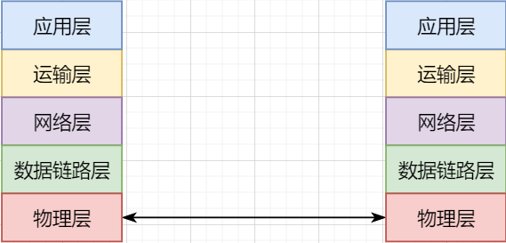

1. 最底层物理层，负责两个机器之间通过硬件的直接通信；
2. 数据链路层使用硬件地址在局域网中进行寻址，实现局域网通信；
3. 网络层通过抽象IP地址实现主机之间的逻辑通信；
4. 运输层在网络层的基础上，对数据进行拆分，实现应用进程的独立网络通信；
5. 应用层在运输层的基础上，根据具体的需求开发形形式式的功能。

分层并不是在物理上的分层，而是逻辑上的分层。通过对底层逻辑的封装，使得上层的开发可以直接依赖底层的功能而无需理会具体的实现，简便了开发。这种分层的思路，也就是责任链设计模式，通过层层封装，把不同的职责独立起来，更加方便开发、维护等等。

#### 七层网络层次

## 网络协议

### TCP协议

TCP（Transmission Control Protocol，传输控制协议）是基于连接的协议，在正式收发数据前，必须和对方建立可靠的连接。

#### 报文结构

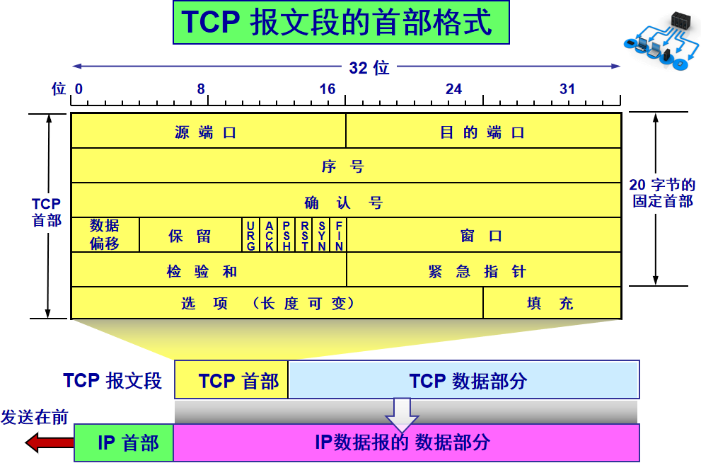

TCP首部固定长度是20字节，下面还有4字节是可选的。

| 头部参数         | 字节数  | 作用                                                         |
| ---------------- | ------- | ------------------------------------------------------------ |
| 源端口和目的端口 | 各2字节 | socket通过端口号和IP来定义，这里表示发出消息的主机端口以及接收消息的主机端口。 |
| 序号             | 4字节   | TCP传输的数据流中每一个字节都编上一个序号，这里序号的指的是本报文发送的数据的第一个字节的序号。 序号取值范围是[0, 2^32 - 1]。 |
| 确认号           | 4字节   | 期望收到的下一个报文数据的第一个字节的序号。                 |
| 数据偏移         | 4位     | 指TCP报文的数据起始处和TCP报文的起始处距离。                 |
| 保留             | 6位     | 保留为今后使用，目前设为0。                                  |
| 紧急URG          | 1位     | 为1时表示为报文含有紧急数据，应尽快传送。即表示优先级高的数据。 |
| 确认ACK          | 1位     |                                                              |
| 推送PSH          | 1位     |                                                              |
| 复位RST          | 1位     |                                                              |
| 同步SYN          | 1位     |                                                              |
| 终止FIN          | 1位     |                                                              |
| 窗口             | 2字节   |                                                              |

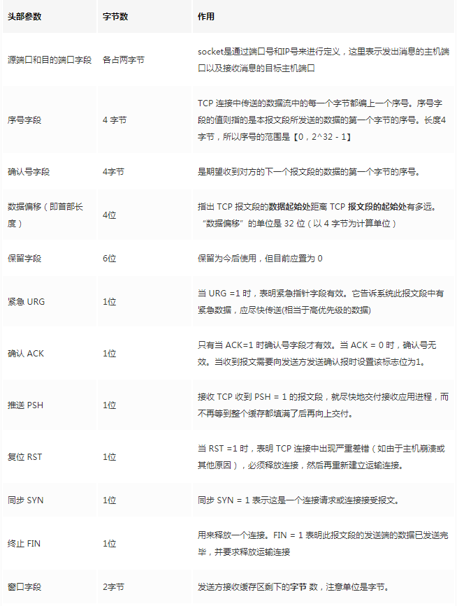

选项字段中包含以下其他选项：

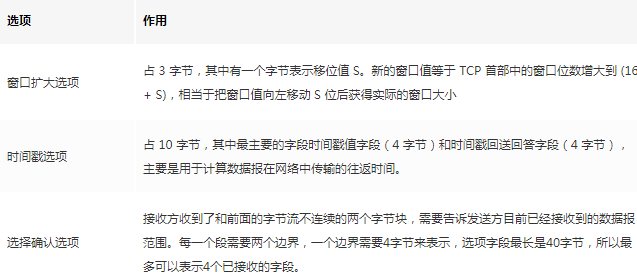

#### 传输形式

TCP并不是把应用层传输过来的数据直接加上首部然后发送给目标，而是把数据看成一个字节流，给数据标上序号之后分批发送。这就是TCP的**面向字节流** 特性。

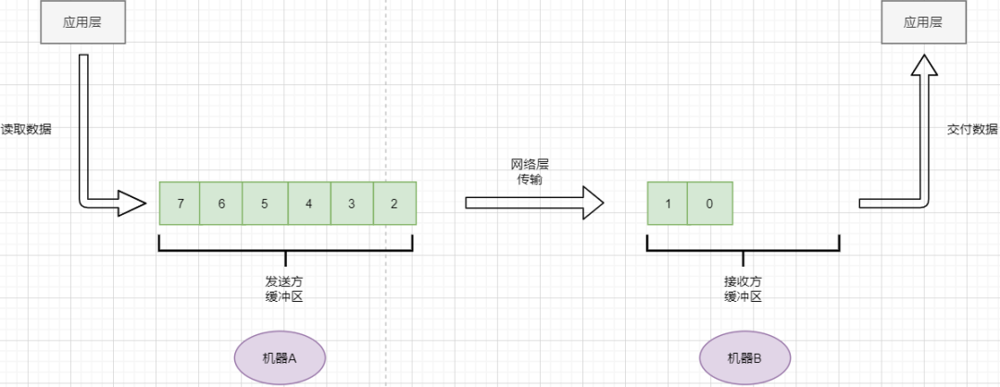

- TCP会以流的形式从应用层读取数据并存放在自己的发送缓存区中，同时为这些**字节**标上序号
- TCP会从发送方缓冲区选择适量的字节组成TCP报文，通过网络层发送给目标
- 目标会读取字节并存放在自己的接收方缓冲区中，并在合适的时候交付给应用层

面向字节流的好处是无需一次存储过大的数据占用太多内存，坏处是无法知道这些字节代表的意义，例如应用层发送一个音频文件和一个文本文件，对于TCP来说就是一串字节流，没有意义可言，这会导致粘包以及拆包问题。

#### 可靠传输

对于应用层来说，他就是一个可靠传输的底层支持服务；而运输层底层采用了网络层的不可靠传输。虽然在网络层甚至数据链路层就可以使用协议来保证数据传输的可靠性，但这样网络的设计会更加复杂、效率会随之降低。把数据传输的可靠性保证放在运输层，会更加合适。

##### 停止等待协议

要实现可靠传输，最简便的方法就是：我发送一个数据包给你，然后你跟我回复收到，我继续发送下一个数据包。

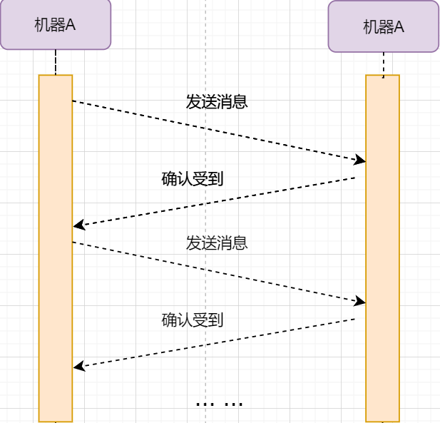

这种“一来一去”的方法来保证传输可靠就是**停止等待协议**（stop-and-wait）。TCP首部有一个ack字段，当设置为1时，表示这个报文是一个确认收到报文。

##### 超时重传

然后再来考虑一种情况：丢包。网络环境不可靠，导致每一次发送的数据包可能会丢失，如果机器A发送了数据包丢失了，那么机器B永远接收不到数据，机器A永远在等待。解决这个问题的方法是：**超时重传** 。当机器A发出一个数据包时便开始计时，时间到还没收到确认回复，就可以认为是发生了丢包，便再次发送，也就是重传。

但重传会导致另一种问题：如果原先的数据包并没有丢失，只是在网络中待的时间比较久，这个时候机器B会受到两个数据包，那么机器B是如何辨别这两个数据包是属于同一份数据还是不同的数据？这就需要前面讲过的方法：**给数据字节进行编号**。这样接收方就可以根据数据的字节编号，得出这些数据是接下来的数据，还是重传的数据。

在TCP首部有两个字段：序号和确认号，他们表示发送方数据第一个字节的编号，和接收方期待的下一份数据的第一个字节的编号。前面讲到TCP是面向字节流，但是他并不是一个字节一个字节地发送，而是一次截取一整段。截取的长度受多种因素影响，如缓存区的数据大小、数据链路层限制的帧大小等。

##### 连续ARQ协议

停止等待协议已经可以满足可靠传输了，但有一个致命缺点：**效率太低**。发送方发送一个数据包之后便进入等待，这个期间并没有干任何事，浪费了资源。解决的方法是：**连续发送数据包**。模型如下：

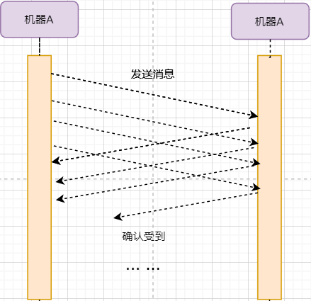

和停止等待最大的不同就是，他会源源不断地发送，接收方源源不断收到数据之后，逐一进行确认回复。这样便极大地提高了效率。但同样，带来了一些额外的问题。

###### 滑动窗口

发送是否可以无限发送直到把缓冲区所有数据发送完？不可以。因为需要考虑接收方缓冲区以及读取数据的能力。如果发送太快导致接收方无法接受，那么只是会频繁进行重传，浪费了网络资源。所以发送方发送数据的范围，需要考虑到接收方缓冲区的情况。这就是TCP的**流量控制** 。解决方法是：**滑动窗口** 。基本模型如下：

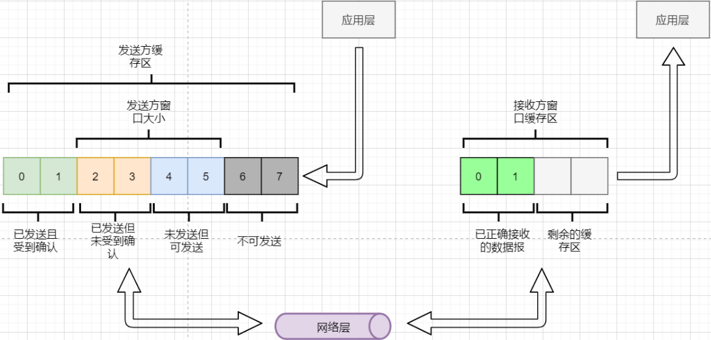

- 发送方需要根据接收方的缓冲区大小，设置自己的可发送窗口大小，处于窗口内的数据表示可发送，之外的数据不可发送。
- 当窗口内的数据接收到确认回复时，整个窗口会往前移动，直到发送完成所有的数据

在TCP的首部有一个窗口大小字段，他表示接收方的剩余缓冲区大小，让发送方可以调整自己的发送窗口大小。通过滑动窗口，就可以实现TCP的流量控制，不至于发送太快，导致太多的数据丢失。

###### 累计确认

连续ARQ带来的第二个问题是：网络中充斥着和发送数据包一样数据量的确认回复报文，因为每一个发送数据包，必须得有一个确认回复。提高网络效率的方法是：**累积确认** 。接收方不需要逐个进行回复，而是累积到一定量的数据包之后，告诉发送方，在此数据包之前的数据全都收到。例如，收到 1234，接收方只需要告诉发送方我收到4了，那么发送方就知道1234都收到了。

###### GBN

连续ARQ第三个问题是：如何处理丢包情况。在停止等待协议中很简单，直接一个超时重传就解决了。但，连续ARQ中不太一样。例如：接收方收到了 123 567，六个字节，编号为4的字节丢失了。按照累积确认的思路，只能发送3的确认回复，567都必须丢掉，因为发送方会进行重传。这就是**GBN（go-back-n)** 思路。

###### 选择确认SACK

但是我们会发现，只需要重传4即可，这样不是很浪费资源，所以就有了：**选择确认SACK** 。在TCP报文的选项字段，可以设置已经收到的报文段，每一个报文段需要两个边界来进行确定。这样发送方，就可以根据这个选项字段只重传丢失的数据了。

##### 总结

- 通过连续ARQ协议与发送-确认回复模式来保证每一个数据包都到达接收方
- 通过给字节编号的方法，来标记每一个数据是属于重传还是新的数据
- 通过超时重传的方式，来解决数据包在网络中丢失的问题
- 通过滑动窗口来实现流量控制
- 通过累积确认+选择确认的方法来提高确认回复与重传的效率

#### 拥塞控制 

拥塞控制考虑的是另外一个问题：**避免网络过分拥挤导致丢包严重，网络效率降低 。**

这里的拥塞控制和前面的流量控制不是一个东西，流量控制是拥塞控制的手段：为了避免拥塞，必须对流量进行控制。拥塞控制目的是：限制每个主机的发送的数据量，避免网络拥塞效率下降。就像广州等地，限制车牌号出行是一个道理。不然大家都堵在路上，谁都别想走。

拥塞控制的解决方法是流量控制，流量控制的实现是滑动窗口，所以**拥塞控制最终也是通过限制发送方的滑动窗口大小来限制流量** 。当然，拥塞控制的手段不只是流量控制，导致拥塞的因素有：路由器缓存、带宽、处理器处理速度等等。提升硬件能力（把4车道改成8车道）是其中一个方法，但毕竟硬件提升是有瓶颈的，没办法不断提升，还是需要从tcp本身来增加算法，解决拥塞。

拥塞控制的重点有4个：**慢开始、快恢复、快重传、拥塞避免**。这里依旧献祭出大学老师的ppt图片：

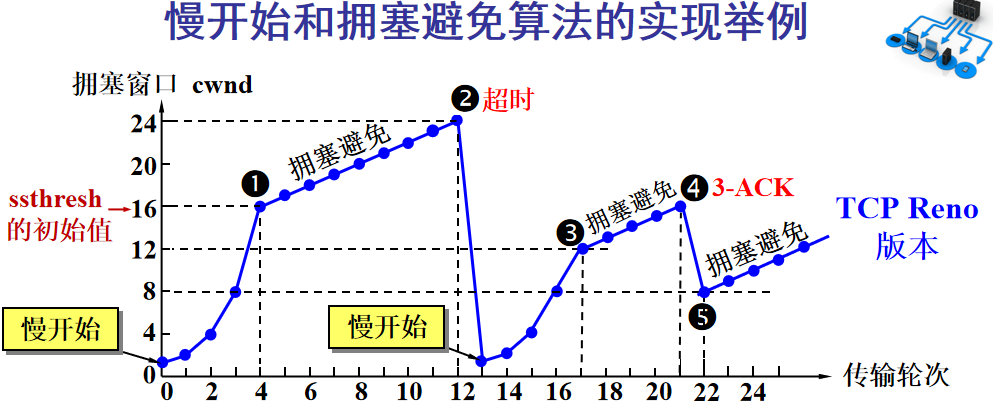

Y轴表示的是发送方窗口大小，X轴表示的是发送的轮次（不是字节编号）。

- 最开始的时候，会把窗口设置一个较小的值，然后每轮变为原来的两倍。这是慢开始。
- 当窗口值到达ssthresh值，这个值是需要通过实时网络情况设置的一个窗口限制值，开始进入拥塞避免，每轮把窗口值提升1，慢慢试探网络的底线。
- 如果发生了数据超时，表示极可能发生了拥塞，然后回到慢开始，重复上面的步骤。
- 如果收到三个相同的确认回复，表示现在网络的情况不太好，把ssthresh的值设置为原来的一半，继续拥塞避免。这部分称为快恢复。
- 如果收到丢包信息，应该尽快把丢失的包重传一次，这是快重传。
- 当然，窗口的最终上限是不能无限上涨的，他不能超过接收方的缓存区大小。

通过这个算法，就可以在很大程度上，避免网络拥挤。

除此之外，还可以让路由器在缓存即将满的时候，告知发送方我快满了，而不是等到出现了超时再进行处理，这是**主动队列管理AQM**。此外还有很多方法，但是上面的算法是重点。

#### 面向连接

TCP是面向连接的，那连接是什么？**这里的连接并不是实实在在的连接，而是通信双方彼此之间的一个记录** 。TCP是一个全双工通信，也就是可以互相发送数据，所以双方都需要记录对方的信息。根据前面的可靠传输原理，TCP通信双方需要为对方准备一个接收缓冲区可以接收对方的数据、记住对方的socket知道怎么发送数据、记住对方的缓冲区来调整自己的窗口大小等等，这些记录，就是一个连接。

在运输层小节中讲到，运输层双方通信的地址是采用socket来定义的，TCP也不例外。TCP的每一个连接只能有两个对象，也就是两个socket，而不能有三个。所以socket的定义需要源IP、源端口号、目标IP、目标端口号四个关键因素，才不会发生混乱。

>假如TCP和UDP一样只采用目标IP+目标端口号来定义socket，那么就会出现多个发送方同时发送到同一个目标socket的情况。这个时候TCP无法区分这些数据是否来自不同的发送方，就会导致出现错误。

##### 建立连接（三次握手）

建立连接的目的就是交换彼此的信息，然后记住对方的信息。所以双方都需要发送彼此的信息给对方。

但前面的可靠传输原理告诉我们，数据在网络中传输是不可靠的，需要对方给予我们一个确认回复，才可以保证消息正确到达。如下图：

机器B的确认收到和机器B信息可以进行合并，减少次数；而且发送机器B给机器A本身就代表了机器B已经收到了消息，所以最后的示例图是：

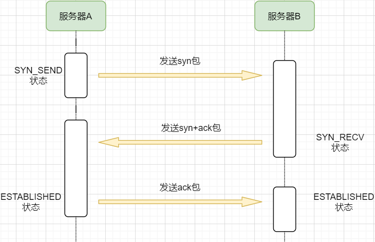

步骤如下：

1. 机器A发送syn包向机器B请求建立TCP连接，并附加上自身的接收缓冲区信息等，机器A进入SYN_SEND状态，表示请求已经发送正在等待回复；
2. 机器B收到请求之后，根据机器A的信息记录下来，并创建自身的接收缓存区，向机器A发送syn+ack的合成包，同时自身进入SYN_RECV状态，表示已经准备好了，等待机器A 的回复就可以向A发送数据；
3. 机器A收到回复之后记录机器B 的信息，发送ack信息，自身进入ESTABLISHED状态，表示已经完全准备好了，可以进行发送和接收；
4. 机器B收到ACK数据之后，进入ESTABLISHED状态。

三次消息的发送，称为三次握手。

##### 断开连接（四次挥手）

断开连接和三次握手类似，直接上图：

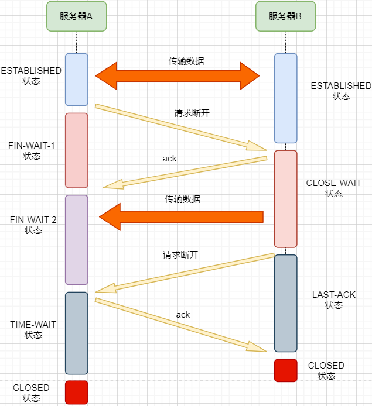

1. 机器A发送完数据之后，向机器B请求断开连接，自身进入FIN_WAIT_1状态，表示数据发送完成且已经发送FIN包（FIN标志位为1）；

2. 机器B收到FIN包之后，回复ack包表示已经收到，但此时机器B可能还有数据没发送完成，自身进入CLOSE_WAIT状态，表示对方已发送完成且请求关闭连接，自身发送完成之后可以关闭连接；

3. 机器B数据发送完成之后，发送FIN包给机器B ，自身进入LAST_ACK状态，表示等待一个ACK包即可关闭连接；

4. 机器A收到FIN包之后，知道机器B也发送完成了，回复一个ACK包，并进入TIME_WAIT状态

*TIME_WAIT状态比较特殊。当机器A收到机器B的FIN包时，理想状态下，确实是可以直接关闭连接了；但是：*

1. 我们知道网络是不稳定的，可能机器B 发送了一些数据还没到达（比FIN包慢）；
2. 同时回复的ACK包可能丢失了，机器B会重传FIN包；

*如果此时机器A马上关闭连接，会导致数据不完整、机器B无法释放连接等问题。所以此时机器A需要等待2个报文生存最大时长，确保网络中没有任何遗留报文了，再关闭连接*

5. 最后，机器A等待两个报文存活最大时长之后，机器B 接收到ACK报文之后，均关闭连接，进入CLASED状态

双方之间4次互相发送报文来断开连接的过程，就是四次挥手。

现在，对于为什么握手是三次挥手是四次、一定要三次/四次吗、为什么要停留2msl再关闭连接等等这些问题，就都解决了。

#### 优点和缺点

### UDP协议

UDP（User Data Protocol，用户数据报协议）是与TCP相对应的协议。它是面向非连接的协议，它不与对方建立连接，而是直接就把数据包发送过去！ 
  UDP适用于一次只传送少量数据、对可靠性要求不高的应用环境。比如，我们经常使用“ping”命令来测试两台主机之间TCP/IP通信是否正常，其实“ping”命令的原理就是向对方主机发送UDP数据包，然后对方主机确认收到数据包，如果数据包是否到达的消息及时反馈回来，那么网络就是通的。例如，在默认状态下，一次“ping”操作发送4个数据包（如图2所示）。大家可以看到，发送的数据包数量是4包，收到的也是4包（因为对方主机收到后会发回一个确认收到的数据包）。这充分说明了UDP协议是面向非连接的协议，没有建立连接的过程。正因为UDP协议没有连接的过程，所以它的通信效果高；但也正因为如此，它的可靠性不如TCP协议高。QQ就使用UDP发消息，因此有时会出现收不到消息的情况。 

#### 功能特点

运输层协议除了TCP，还有大名鼎鼎的UDP。如果说TCP凭借他完善稳定的功能独树一帜，那UDP就是精简主义乱拳打死老师傅。

UDP只实现了运输层最少的功能：进程间通信。对于应用层传下来的数据，UDP只是附加一个首部就直接交给网络层了。UDP的头部非常简单，只有三部分：

- 源端口、目标端口：端口号用来区分主机的不同进程
- 校验码：用于校验数据包在传输的过程中没有出现错误，例如某个1变成了0
- 长度：报文的长度

所以UDP的功能也只有两个：校验数据报是否发生错误、区分不同的进程通信。

但，TCP的功能虽然多，但同时也是要付出相对应的代价。例如面向连接的特性，在建立和断开连接的时候会有开销；拥塞控制的特性，会限制传输的上限等等。

#### 优点和缺点

##### UDP的缺点

- 无法保证消息完整、正确到达，UDP是一个不可靠的传输协议；
- 缺少拥塞控制容易互相竞争资源导致网络系统瘫痪

##### UDP的优点

- 效率更快；不需要建立连接以及拥塞控制

- 连接更多的客户；没有连接状态，不需要为每个客户创建缓存等

- 分组首部字节少，开销小；TCP首部固定首部是20字节，而UDP只有8字节；更小的首部意味着更大比例的数据部分

- 在一些需要高效率允许可限度误差的场景下可以使用。如直播场景，并不需要保证每个数据包都完整到达，允许一定的丢包率，这个时候TCP的可靠特性反而成为了累赘；精简的UDP更高的效率是更加适合的选择

- 可以进行广播；UDP并不是面向连接的，所以可以同时对多个进程进行发送报文

    

#### 适用场景

UDP适用于对传输模型需要应用层高度自定义、允许出现丢包、需要高效率的场景、需要广播；例如

- 视屏直播
- DNS
- RIP路由选择协议

### TCP和UDP比较

|            | TCP          | UDP          |
| ---------- | ------------ | ------------ |
| 是否连接   | 面向连接     | 面向非连接   |
| 传输可靠性 | 可靠         | 不可靠       |
| 应用场合   | 传输大量数据 | 传输少量数据 |
| 速度       | 慢           | 快           |

## 网络传输

### 路由转换

| 主机  | 路由    | 路由    | 路由    | 路由    | 主机    |
| ----- | ------- | ------- | ------- | ------- | ------- |
|       | > 路由1 | > 路由3 |         | > 路由7 |         |
| 主机A |         | > 路由4 | > 路由6 |         | > 主机B |
|       | > 路由2 | > 路由5 |         | > 路由8 |         |

- 正常情况下，主机A的数据包可以由 1-3-6-7路径进行传送
- 如果路由3坏掉了，那么可以从 1-4-6-7进行传送
- 如果4也坏掉了，那么只能从2-5-6-7传送
- 如果5坏掉了，那么就中断线路了

使用路由转发可以提高网络的容错率，本质原因依旧是网络是不稳定的，即使坏掉几个路由器，网络依旧畅通。但是如果坏掉路由器6那就直接导致主机A和主机B无法通信，所以要避免这种核心路由器的存在。

使用路由转发还可以分流，如果一条线路太拥堵，可以从别的路线进行传输，提高效率。

### 恶意攻击

TCP的面向连接特点可能会被恶意的人利用，对服务器进行攻击。

前面我们知道，当我们向一个主机发送syn包请求创建连接时，服务器会为我们创建缓冲区等，然后向我们返回syn+ack报文；如果我们伪造IP和端口，向一个服务器进行海量的请求，会使得服务器创建了大量的创建一半的TCP连接，使得其无法正常响应用户的请求，导致服务器瘫痪。

解决的方法可以有限制IP的创建连接数、让创建一半的tcp连接在更短的时间内自行关闭、延缓接收缓冲区内存的分配等等。

### 长连接

我们向服务器的每一次请求都需要创建一个TCP连接，服务器返回数据之后就会关闭连接；如果在短时间内有大量的请求，那么频繁创建TCP连接关闭TCP连接是一个很浪费资源的行为。所以我们可以让TCP连接不要关闭，在这个期间进行请求，提高效率。

需要注意长连接维持时间、创建条件等，避免被恶意利用创建大量的长连接，消耗殆尽服务器的资源。

# HTTP
## HTTP特性
标准的http协议指的是不包括cookies, session，application的http协议，他们都不属于标准协议。

### 有状态和无状态
标准的http协议是无状态的，无连接的。 

TCP一直有状态，HTTP一直无状态，但是应用为了有状态，就给HTTP加了cookie和session机制，让使用http的应用也能有状态，但http还是无状态。

### 有链接和无连接
无连接的含义是限制每次连接只处理一个请求。服务器处理完客户的请求，并收到客户的应答后，即断开连接。

开始TCP是有连接，后来TCP无连接，再后来也就是现在TCP是Keep-Alive，有点像有连接。

# HTTPS
## HTTPS特性
HTTP 由于是明文传输，所谓的明文，就是说客户端与服务端通信的信息都是肉眼可见的，随意使用一个抓包工具都可以截获通信的内容。

所以安全上存在以下三个风险：

- 窃听风险，比如通信链路上可以获取通信内容，用户号容易没。
- 篡改风险，比如强制植入垃圾广告，视觉污染，用户眼容易瞎。
- 冒充风险，比如冒充淘宝网站，用户钱容易没。

HTTPS 在 HTTP 与 TCP 层之间加入了 TLS 协议，来解决上述的风险。

TLS 协议包括如下三个部分：
信息加密：HTTP 交互信息是被加密的，第三方就无法被窃取；
校验机制：校验信息传输过程中是否有被第三方篡改过，如果被篡改过，则会有警告提示；
身份证书：证明淘宝是真的淘宝网；

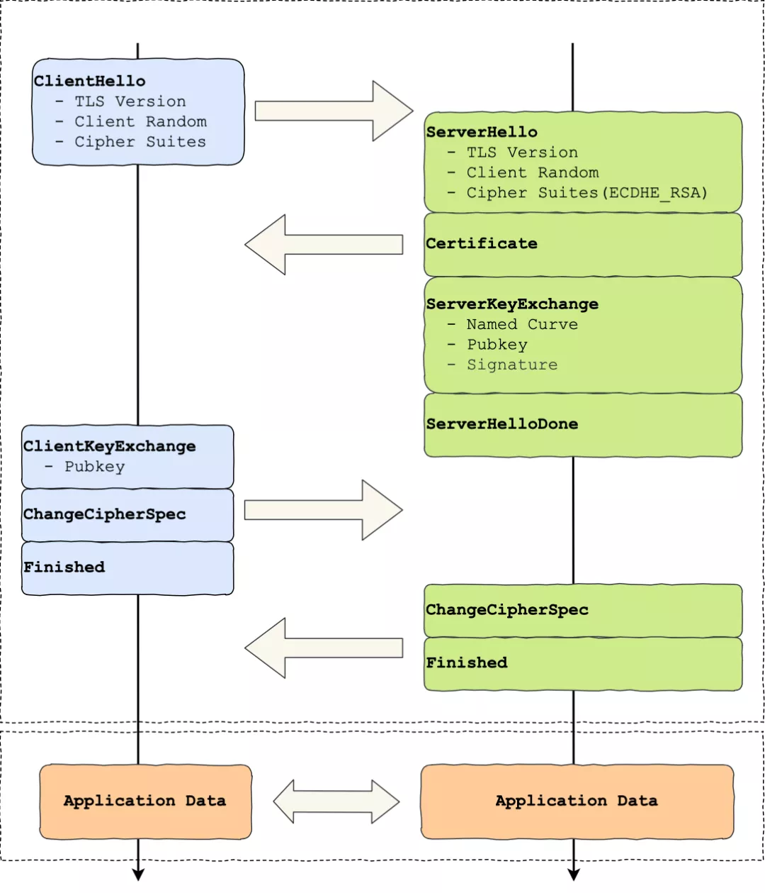