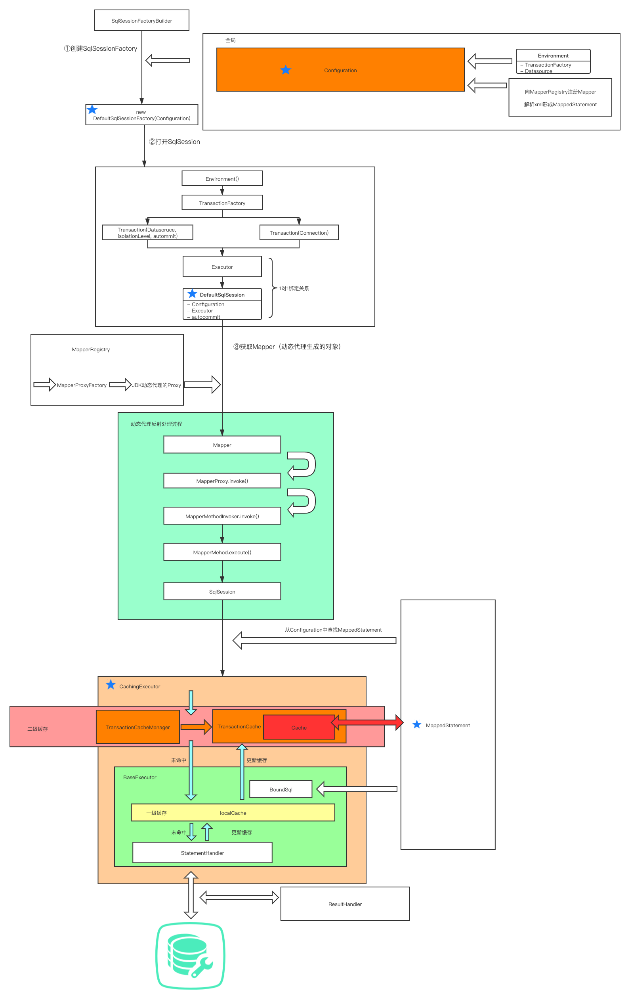
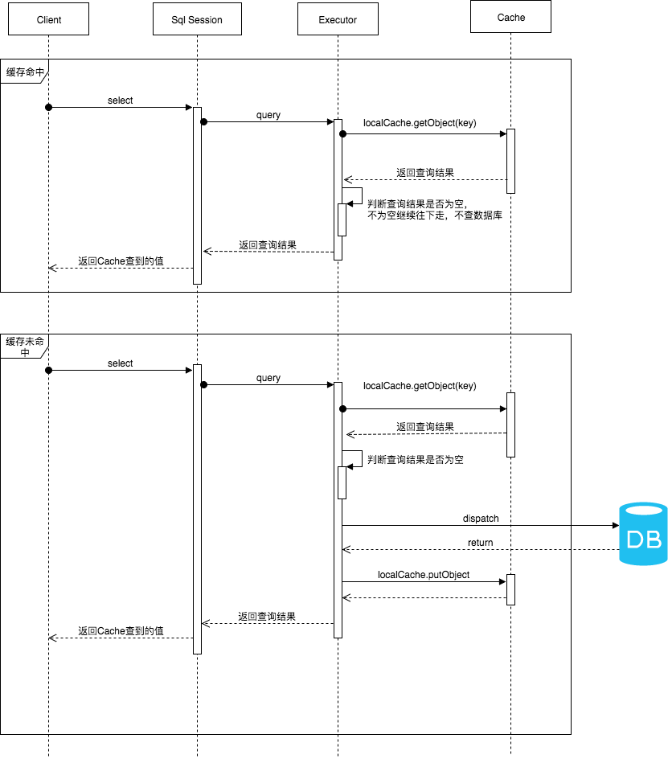

# 目录
[TOC]

# JDBC
## JDBC执行过程
- 获取连接Connection
- 预编译SQL 
# 原理


- 首先通过SqlSessionFactoryBuilder的build方法构建SqlSessionFactory接口的实现类DefaultSqlSessionFactory对象；
- 然后通过SqlSessionFactory的openSession方法构建SqlSession接口的实现类DefaultSqlSession对象；
- 再通过DefaultSqlSession的Executor属性执行query或update等方法；
- Executor选择通过StatementHandler进行数据库CRUD操作，还是通过mybatis的缓存功能获取数据；
- StatementHandler进行数据库CRUD操作
- 最后通过ResultSetHandler接口的实现类来将查询出的数据映射到Java对象中返回

## SqlSessionFactoryBuilder


## SqlSessionFactory 


## SqlSession 


## Executor 


## StatementHandler 


## ResultSetHandler 


# 拦截器

通过@Intercepts和@Signature标注并实现Interceptor接口来自定义拦截器。

## @Intercepts注解

该注解标注在自定义的Mybatis拦截器类上。

```java
@Documented
@Retention(RetentionPolicy.RUNTIME)
@Target(ElementType.TYPE)
public @interface Intercepts {
    /**
     * value属性表示@Signature注解的数组，可以配置多个@Signature注解
     */
    Signature[] value();
}
```


## @Signature注解

@Signature注解的3个属性分别对应Invocation类的3个属性。

- Signature.type => Invocation.target
- Signature.method => Invocation.method
- Signature.args => Invocation.args

```java
@Documented
@Retention(RetentionPolicy.RUNTIME)
@Target({})
public @interface Signature {
    /**
     * 设置要拦截的接口，可以拦截的接口只有四种Executor.class，StatementHandler.class，ParameterHandler.class 和 ResultSetHandler.class。
     */
    Class<?> type();

    /**
     * 设置需要拦截的方法，该方法要存在于被拦截的接口之中
     */
    String method();

    /**
     * 被拦截的方法所需要的参数
     */
    Class<?>[] args();
}
```


## Interceptor接口

```java
package org.apache.ibatis.plugin;
/**
 * Interceptor接口，Mybatis自定义拦截器需要实现该接口
 */
public interface Interceptor {
    /**
     * intercept接口必须被实现类实现
     */
    Object intercept(Invocation invocation) throws Throwable;
    
    /**
     * 返回目标对象，或其代理。
     */
    default Object plugin(Object target) {
        return Plugin.wrap(target, this);
    }
    
    /**
     * 用于在 Mybatis 配置文件中指定一些属性
     */
    default void setProperties(Properties properties) {
        // NOP
    }
}
```


### intercept方法

**方法参数**

```java
package org.apache.ibatis.plugin;
/**
 * intercept接口参数
 */
public class Invocation {
    /**
     * 代理对象
     */
    private final Object target;
    /**
     * 被监控方法对象
     */   
    private final Method method;
    /**
     * 当前被监控方法运行时需要的实参
     */
    private final Object[] args;
    // ***
}
```


### plugin方法

该方法在拦截器接口中有一个默认实现，调用了Plugin的静态方法wrap。该方法的实现如下：

```java
public static Object wrap(Object target, Interceptor interceptor) {
    Map<Class<?>, Set<Method>> signatureMap = getSignatureMap(interceptor);
    Class<?> type = target.getClass();
    Class<?>[] interfaces = getAllInterfaces(type, signatureMap);
    // 如果接口的数量大于0，就返回一个代理对象，否则直接返回原对象 target。
    if (interfaces.length > 0) {
        return Proxy.newProxyInstance(
                type.getClassLoader(),
                interfaces,
                new Plugin(target, interceptor, signatureMap));
    }
    return target;
}
```


## 自定义Mybatis拦截器

通过实现Interceptor接口和标注@Intercepts注解及@Signature注解来实现自定义拦截器。

```java
@Intercepts({
    @Signature(
        method = "query",
        type = Executor.class,
        args = {
            MappedStatement.class, Object.class, RowBounds.class, ResultHandler.class}
    ),
    @Signature(
        method = "query",
        type = StatementHandler.class,
        args = {Statement.class, ResultHandler.class}
    )
})
@Component
public class MybatisInterceptor implements Interceptor {
    @Override
    public Object intercept(Invocation invocation) {
        Object target = invocation.getTarget();
        System.err.println("intercept......" + target);
        return invocation.proceed();
    }
}
```

# XML配置
## properties（属性）
### XML配置
在 `properties` 元素下可以配置自定义属性。
```xml
<!-- resource属性表示可以读取指定properties配置文件中的配置 -->
<properties resource='jdbc.properties'>
    <!-- 配置properties属性通过${name属性的值}来引用 -->
    <property name="jdbc.password" value="340823"/>
</properties>
```

配置完属性后可以通过${name}符号来引用配置的属性。
```xml
<dataSource type='POOLED'>
    <property name='driver' value='${jdbc.driverClassName}'/>
    <property name='url' value='${jdbc.url}'/>
    <property name='username' value='${jdbc.username}'/>
    <property name='password' value='${jdbc.password}'/>
</dataSource>
```

### 代码配置
也可以通过 `SqlSessionFactoryBuilder` 的build方法来配置properties配置文件中的属性配置。
> org.apache.ibatis.session.SqlSessionFactoryBuilder
```java
public class SqlSessionFactoryBuilder {

    public SqlSessionFactory build(Reader reader) {
        return build(reader, null, null);
    }

    public SqlSessionFactory build(Reader reader, String environment) {
        return build(reader, environment, null);
    }

    public SqlSessionFactory build(Reader reader, Properties properties) {
        return build(reader, null, properties);
    }

    public SqlSessionFactory build(Reader reader, String environment, Properties properties) {
        try {
            XMLConfigBuilder parser = new XMLConfigBuilder(reader, environment, properties);
            return build(parser.parse());
        } 
        // ...
    }
}
```

### 加载顺序
如果一个属性在不只一个地方进行了配置，那么，MyBatis 将按照下面的顺序来加载：

- 首先读取在 `properties` 元素体内指定的属性。
- 然后根据 `properties` 元素中的 `resource` 属性读取类路径下属性文件，或根据 url 属性指定的路径读取属性文件，并覆盖之前读取过的同名属性。
- 最后读取作为方法参数传递的属性，并覆盖之前读取过的同名属性。

### 补充
- 从 MyBatis 3.4.2 开始，你可以为占位符指定一个默认值。

## settings（设置）
```xml
<settings>
    <setting name="cacheEnabled" value="true"/>
    <setting name="lazyLoadingEnabled" value="true"/>
    <setting name="multipleResultSetsEnabled" value="true"/>
    <setting name="useColumnLabel" value="true"/>
    <setting name="useGeneratedKeys" value="false"/>
    <setting name="autoMappingBehavior" value="PARTIAL"/>
    <setting name="autoMappingUnknownColumnBehavior" value="WARNING"/>
    <setting name="defaultExecutorType" value="SIMPLE"/>
    <setting name="defaultStatementTimeout" value="25"/>
    <setting name="defaultFetchSize" value="100"/>
    <setting name="safeRowBoundsEnabled" value="false"/>
    <setting name="mapUnderscoreToCamelCase" value="false"/>
    <setting name="localCacheScope" value="SESSION"/>
    <setting name="jdbcTypeForNull" value="OTHER"/>
    <setting name="lazyLoadTriggerMethods" value="equals,clone,hashCode,toString"/>
</settings>
```

`settings` 元素配置是MyBatis中极为重要的调整设置，它们会改变MyBatis的运行时行为。下表描述了设置中各项设置的含义、默认值等。


| 设置名                           | 描述                                                         | 有效值                                                       | 默认值                                                |
| -------------------------------- | ------------------------------------------------------------ | ------------------------------------------------------------ | ----------------------------------------------------- |
| cacheEnabled                     | 全局性地开启或关闭所有映射器配置文件中已配置的任何缓存。     | true \| false                                                | true                                                  |
| lazyLoadingEnabled               | 延迟加载的全局开关。当开启时，所有关联对象都会延迟加载。 特定关联关系中可通过设置 `fetchType` 属性来覆盖该项的开关状态。 | true \| false                                                | false                                                 |
| aggressiveLazyLoading            | 开启时，任一方法的调用都会加载该对象的所有延迟加载属性。 否则，每个延迟加载属性会按需加载（参考 `lazyLoadTriggerMethods`)。 | true \| false                                                | false （在 3.4.1 及之前的版本中默认为 true）          |
| multipleResultSetsEnabled        | 是否允许单个语句返回多结果集（需要数据库驱动支持）。         | true \| false                                                | true                                                  |
| useColumnLabel                   | 使用列标签代替列名。实际表现依赖于数据库驱动，具体可参考数据库驱动的相关文档，或通过对比测试来观察。 | true \| false                                                | true                                                  |
| useGeneratedKeys                 | 允许 JDBC 支持自动生成主键，需要数据库驱动支持。如果设置为 true，将强制使用自动生成主键。尽管一些数据库驱动不支持此特性，但仍可正常工作（如 Derby）。 | true \| false                                                | False                                                 |
| autoMappingBehavior              | 指定 MyBatis 应如何自动映射列到字段或属性。 NONE 表示关闭自动映射；PARTIAL 只会自动映射没有定义嵌套结果映射的字段。 FULL 会自动映射任何复杂的结果集（无论是否嵌套）。 | NONE, PARTIAL, FULL                                          | PARTIAL                                               |
| autoMappingUnknownColumnBehavior | 指定发现自动映射目标未知列（或未知属性类型）的行为。`NONE`: 不做任何反应`WARNING`: 输出警告日志（`'org.apache.ibatis.session.AutoMappingUnknownColumnBehavior'` 的日志等级必须设置为 `WARN`）`FAILING`: 映射失败 (抛出 `SqlSessionException`) | NONE, WARNING, FAILING                                       | NONE                                                  |
| defaultExecutorType              | 配置默认的执行器。SIMPLE 就是普通的执行器；REUSE 执行器会重用预处理语句（PreparedStatement）； BATCH 执行器不仅重用语句还会执行批量更新。 | SIMPLE REUSE BATCH                                           | SIMPLE                                                |
| defaultStatementTimeout          | 设置超时时间，它决定数据库驱动等待数据库响应的秒数。         | 任意正整数                                                   | 未设置 (null)                                         |
| defaultFetchSize                 | 为驱动的结果集获取数量（fetchSize）设置一个建议值。此参数只可以在查询设置中被覆盖。 | 任意正整数                                                   | 未设置 (null)                                         |
| defaultResultSetType             | 指定语句默认的滚动策略。（新增于 3.5.2）                     | FORWARD_ONLY \| SCROLL_SENSITIVE \| SCROLL_INSENSITIVE \| DEFAULT（等同于未设置） | 未设置 (null)                                         |
| safeRowBoundsEnabled             | 是否允许在嵌套语句中使用分页（RowBounds）。如果允许使用则设置为 false。 | true \| false                                                | False                                                 |
| safeResultHandlerEnabled         | 是否允许在嵌套语句中使用结果处理器（ResultHandler）。如果允许使用则设置为 false。 | true \| false                                                | True                                                  |
| mapUnderscoreToCamelCase         | 是否开启驼峰命名自动映射，即从经典数据库列名 A_COLUMN 映射到经典 Java 属性名 aColumn。 | true \| false                                                | False                                                 |
| localCacheScope                  | MyBatis 利用本地缓存机制（Local Cache）防止循环引用和加速重复的嵌套查询。 默认值为 SESSION，会缓存一个会话中执行的所有查询。 若设置值为 STATEMENT，本地缓存将仅用于执行语句，对相同 SqlSession 的不同查询将不会进行缓存。 | SESSION \| STATEMENT                                         | SESSION                                               |
| jdbcTypeForNull                  | 当没有为参数指定特定的 JDBC 类型时，空值的默认 JDBC 类型。 某些数据库驱动需要指定列的 JDBC 类型，多数情况直接用一般类型即可，比如 NULL、VARCHAR 或 OTHER。 | JdbcType 常量，常用值：NULL、VARCHAR 或 OTHER。              | OTHER                                                 |
| lazyLoadTriggerMethods           | 指定对象的哪些方法触发一次延迟加载。                         | 用逗号分隔的方法列表。                                       | equals,clone,hashCode,toString                        |
| defaultScriptingLanguage         | 指定动态 SQL 生成使用的默认脚本语言。                        | 一个类型别名或全限定类名。                                   | org.apache.ibatis.scripting.xmltags.XMLLanguageDriver |
| defaultEnumTypeHandler           | 指定 Enum 使用的默认 `TypeHandler` 。（新增于 3.4.5）        | 一个类型别名或全限定类名。                                   | org.apache.ibatis.type.EnumTypeHandler                |
| callSettersOnNulls               | 指定当结果集中值为 null 的时候是否调用映射对象的 setter（map 对象时为 put）方法，这在依赖于 Map.keySet() 或 null 值进行初始化时比较有用。注意基本类型（int、boolean 等）是不能设置成 null 的。 | true \| false                                                | false                                                 |
| returnInstanceForEmptyRow        | 当返回行的所有列都是空时，MyBatis默认返回 `null`。 当开启这个设置时，MyBatis会返回一个空实例。 请注意，它也适用于嵌套的结果集（如集合或关联）。（新增于 3.4.2） | true \| false                                                | false                                                 |
| logPrefix                        | 指定 MyBatis 增加到日志名称的前缀。                          | 任何字符串                                                   | 未设置                                                |
| logImpl                          | 指定 MyBatis 所用日志的具体实现，未指定时将自动查找。        | SLF4J \| LOG4J \| LOG4J2 \| JDK_LOGGING \| COMMONS_LOGGING \| STDOUT_LOGGING \| NO_LOGGING | 未设置                                                |
| proxyFactory                     | 指定 Mybatis 创建可延迟加载对象所用到的代理工具。            | CGLIB \| JAVASSIST                                           | JAVASSIST （MyBatis 3.3 以上）                        |
| vfsImpl                          | 指定 VFS 的实现                                              | 自定义 VFS 的实现的类全限定名，以逗号分隔。                  | 未设置                                                |
| useActualParamName               | 允许使用方法签名中的名称作为语句参数名称。 为了使用该特性，你的项目必须采用 Java 8 编译，并且加上 `-parameters` 选项。（新增于 3.4.1） | true \| false                                                | true                                                  |
| configurationFactory             | 指定一个提供 `Configuration` 实例的类。 这个被返回的 Configuration 实例用来加载被反序列化对象的延迟加载属性值。 这个类必须包含一个签名为`static Configuration getConfiguration()` 的方法。（新增于 3.2.3） | 一个类型别名或完全限定类名。                                 | 未设置                                                |
| shrinkWhitespacesInSql           | 从SQL中删除多余的空格字符。请注意，这也会影响SQL中的文字字符串。 (新增于 3.5.5) | true \| false                                                | false                                                 |
| defaultSqlProviderType           | Specifies an sql provider class that holds provider method (Since 3.5.6). This class apply to the `type`(or `value`) attribute on sql provider annotation(e.g. `@SelectProvider`), when these attribute was omitted. | A type alias or fully qualified class name                   | Not set                                               |


## typeAliases（类型别名）
类型别名可为Java类型设置一个缩写名字。它仅用于XML配置，意在降低冗余的全限定类名书写。例如：

### xml配置
首先在mybatis-config.xml配置文件中配置 `typeAlias` 后，即可在任意地方使用该别名
```xml
<typeAliases>
    <!-- 配置com.demo.mybatis.entity.JavaUserDTO的别名为JavaUserDTO -->
    <typeAlias type="com.demo.mybatis.entity.JavaUserDTO" alias="JavaUserDTO"/>
    <!-- package标签表示指定一个包名，MyBatis会在包名下面搜索需要的JavaBean-->
    <package name="com.demo.mybatis.entity"/>
</typeAliases>
```

### 注解配置
也可以在JavaBean上通过注解 `@Alias` 的方式来配置别名
```java
@Alias("JavaUserAliasDTO")
public class JavaUserAliasDTO {
}
```

### 别名使用
```xml
<select id="selectListByAliasResult" resultType="JavaUserDTO">
    SELECT `id`, `real_name` AS `realName` FROM `java`.`java_user` LIMIT 5;
</select>
```

### 默认别名配置
下面是一些为常见的Java类型内建的类型别名。它们都是不区分大小写的，注意，为了应对原始类型的命名重复，采取了特殊的命名风格。


| 别名            | 映射的类型 | 别名                 | 映射的类型 | 别名       | 映射的类型 |
| --------------- | ---------- | -------------------- | ---------- | ---------- | ---------- |
| _byte           | byte       | byte                 | Byte       | date       | Date       |
| _long           | long       | long                 | Long       | object     | Object     |
| _short          | short      | short                | Short      | map        | Map        |
| _int / _integer | int        | int / integer        | Integer    | hashmap    | HashMap    |
| _double         | double     | double               | Double     | list       | List       |
| _float          | float      | float                | Float      | arraylist  | ArrayList  |
| _boolean        | boolean    | boolean              | Boolean    | collection | Collection |
| string          | String     | decimal / bigdecimal | BigDecimal | iterator   | Iterator   |


## typeHandlers（类型处理器）
MyBatis 在设置预处理语句（PreparedStatement）中的参数或从结果集中取出一个值时， 都会用类型处理器将获取到的值以合适的方式转换成 Java 类型。下表描述了一些默认的类型处理器。

提示 从 3.4.5 开始，MyBatis 默认支持 JSR-310（日期和时间 API） 。


| 类型处理器                 | Java 类型                     | JDBC 类型                                                    |
| -------------------------- | ----------------------------- | ------------------------------------------------------------ |
| BooleanTypeHandler         | java.lang.Boolean, boolean    | 数据库兼容的 BOOLEAN                                         |
| ByteTypeHandler            | java.lang.Byte, byte          | 数据库兼容的 NUMERIC 或 BYTE                                 |
| ShortTypeHandler           | java.lang.Short, short        | 数据库兼容的 NUMERIC 或 SMALLINT                             |
| IntegerTypeHandler         | java.lang.Integer, int        | 数据库兼容的 NUMERIC 或 INTEGER                              |
| LongTypeHandler            | java.lang.Long, long          | 数据库兼容的 NUMERIC 或 BIGINT                               |
| FloatTypeHandler           | java.lang.Float, float        | 数据库兼容的 NUMERIC 或 FLOAT                                |
| DoubleTypeHandler          | java.lang.Double, double      | 数据库兼容的 NUMERIC 或 DOUBLE                               |
| BigDecimalTypeHandler      | java.math.BigDecimal          | 数据库兼容的 NUMERIC 或 DECIMAL                              |
| StringTypeHandler          | java.lang.String              | CHAR, VARCHAR                                                |
| ClobReaderTypeHandler      | java.io.Reader                | -                                                            |
| ClobTypeHandler            | java.lang.String              | CLOB, LONGVARCHAR                                            |
| NStringTypeHandler         | java.lang.String              | NVARCHAR, NCHAR                                              |
| NClobTypeHandler           | java.lang.String              | NCLOB                                                        |
| BlobInputStreamTypeHandler | java.io.InputStream           | -                                                            |
| ByteArrayTypeHandler       | byte[]                        | 数据库兼容的字节流类型                                       |
| BlobTypeHandler            | byte[]                        | BLOB, LONGVARBINARY                                          |
| DateTypeHandler            | java.util.Date                | TIMESTAMP                                                    |
| DateOnlyTypeHandler        | java.util.Date                | DATE                                                         |
| TimeOnlyTypeHandler        | java.util.Date                | TIME                                                         |
| SqlTimestampTypeHandler    | java.sql.Timestamp            | TIMESTAMP                                                    |
| SqlDateTypeHandler         | java.sql.Date                 | DATE                                                         |
| SqlTimeTypeHandler         | java.sql.Time                 | TIME                                                         |
| ObjectTypeHandler          | Any                           | OTHER 或未指定类型                                           |
| EnumTypeHandler            | Enumeration Type              | VARCHAR 或任何兼容的字符串类型，用来存储枚举的名称（而不是索引序数值） |
| EnumOrdinalTypeHandler     | Enumeration Type              | 任何兼容的 NUMERIC 或 DOUBLE 类型，用来存储枚举的序数值（而不是名称）。 |
| SqlxmlTypeHandler          | java.lang.String              | SQLXML                                                       |
| InstantTypeHandler         | java.time.Instant             | TIMESTAMP                                                    |
| LocalDateTimeTypeHandler   | java.time.LocalDateTime       | TIMESTAMP                                                    |
| LocalDateTypeHandler       | java.time.LocalDate           | DATE                                                         |
| LocalTimeTypeHandler       | java.time.LocalTime           | TIME                                                         |
| OffsetDateTimeTypeHandler  | java.time.OffsetDateTime      | TIMESTAMP                                                    |
| OffsetTimeTypeHandler      | java.time.OffsetTime          | TIME                                                         |
| ZonedDateTimeTypeHandler   | java.time.ZonedDateTime       | TIMESTAMP                                                    |
| YearTypeHandler            | java.time.Year                | INTEGER                                                      |
| MonthTypeHandler           | java.time.Month               | INTEGER                                                      |
| YearMonthTypeHandler       | java.time.YearMonth           | VARCHAR 或 LONGVARCHAR                                       |
| JapaneseDateTypeHandler    | java.time.chrono.JapaneseDate | DATE                                                         |


### 处理枚举类型


## objectFactory（对象工厂）

## plugins（插件）

## environments（环境配置）

### environment（环境变量）

#### transactionManager（事务管理器）

#### dataSource（数据源）

## databaseIdProvider（数据库厂商标识）

## mappers（映射器）

# SQL-XML映射文件

# 动态SQL

# Java API

# SQL 语句构建器

# 缓存机制
## 缓存体系
Mybatis缓存相关类位于`org.apache.ibatis.cache`目录下，缓存的key功能由`CacheKey`类实现，缓存的value功能由`PerpetualCache`及其装饰器类实现。

### PerpetualCache及其装饰器类
无论怎么装饰，经过多少层装饰，最后使用的还是基本的实现类(默认`PerpetualCache`)。

| 缓存实现类         | 描述               | 作用                                                         | 装饰条件                                     |
| ------------------ | ------------------ | ------------------------------------------------------------ | -------------------------------------------- |
| PerpetualCache     | 缓存基本实现类     | 具备基本功能的缓存类。                                       | 无                                           |
| BlockingCache      | 阻塞缓存           | 通过在读写操作中加锁，保证只有一个线程操作缓存，基于Java重入锁实现。 | blocking=true                                |
| FifoCache          | FIFO策略的缓存     | 当缓存达到上限时删除最先入队的缓存（First Input First Out）。 | eviction="FIFO"                              |
| LoggingCache       | 具备日志功能的缓存 | 输出缓存命中率。                                             | 基本                                         |
| LruCache           | LRU策略的缓存      | 当缓存达到上限时删除最近最少使用的缓存（Least Recently Use）。 | eviction="LRU"(default)                      |
| ScheduledCache     | 定时调度的缓存     | 在进行get/put/remove/getSize等操作前，判断缓存时间是否超过了设置的最长缓存时间（默认是一小时），如果是则清空缓存。即每隔一段时间清空一次缓存。 | flushInterval不为空                          |
| SerializedCache    | 可序列化的缓存     | 将对象序列化后存到缓存，取出时进行反序列化。                 | readOnly=false(default)                      |
| SoftCache          | 带清理策略的缓存   | 通过JVM的软引用来实现缓存，当JVM内存不足时，会自动清理缓存。基于SoftReference。 | eviction="SOFT"                              |
| SynchronizedCache  | 同步缓存           | 基于synchronized关键字实现的缓存，解决并发问题。             | 基本                                         |
| TransactionalCache | 事务缓存           | 在二级缓存中，可一次存入多个缓存，移除多个缓存。             | TransactionalCacheManager中的Map维护对应关系 |
| WeakCache          | 带清理策略的缓存   | 通过JVM的弱引用来实现缓存，当JVM内存不足时，会自动清理缓存。基于WeakReference。 | eviction="WEAK"                              |


## 一级缓存
### 一级缓存原理
每个SqlSession中持有Executor，每个Executor有PerpetualCache类型属性localCache。当用户发起查询时，MyBatis根据当前执行的语句生成MappedStatement，在localCache进行查询。
- 如果缓存命中的话，直接返回结果给用户；
- 如果缓存没有命中的话，查询数据库，结果写入localCache，最后返回结果给用户。

一级缓存的有效期是一次会话过程，会话关闭，一级缓存也就失效。另外，如果会话中发生了增删改的写操作，一级缓存的会话同样会失效。



### 一级缓存配置
通过mybatis-config.xml配置开启一级缓存，`localCacheScope`配置的可选值有`SESSION`和`STATEMENT`两个级别。
- SESSION表示一级缓存中同一个sqlSession中有效。
- STATEMENT表示一级缓存在同一个sql查询语句中有效，即关闭了一级缓存。

```xml
<settings>
    <setting name="localCacheScope" value="SESSION"/>
</settings>
```

### 一级缓存生命周期
- MyBatis在开启一个数据库会话时，会创建一个新的SqlSession对象，SqlSession对象中会有一个新的Executor对象，Executor对象中持有一个新的PerpetualCache对象；当会话结束时，SqlSession对象及其内部的Executor对象还有PerpetualCache对象也一并释放掉。
- 如果SqlSession调用了close()方法，会释放掉一级缓存PerpetualCache对象，一级缓存将不可用；
- 如果SqlSession调用了clearCache()，会清空PerpetualCache对象中的数据，但是该对象仍可使用；
- SqlSession中执行了任何一个update操作(update、delete、insert)，都会清空PerpetualCache对象的数据，但是该对象可以继续使用；

### 一级缓存总结
- 一级缓存的生命周期和SqlSession一致。
- 一级缓存内部设计简单，只是一个没有容量限定的HashMap，在缓存的功能性上有所欠缺。
- 一级缓存最大范围是SqlSession内部，有多个SqlSession或者分布式的环境下，数据库写操作会引起脏数据，建议设定缓存级别为Statement。

### 源码解析
#### 一级缓存流程
> org.apache.ibatis.executor.BaseExecutor
```java
public abstract class BaseExecutor implements Executor {
    @Override
    public <E> List<E> query(MappedStatement ms, Object parameter, RowBounds rowBounds, ResultHandler resultHandler) throws SQLException {
        BoundSql boundSql = ms.getBoundSql(parameter);
        // 生成一级缓存key
        CacheKey key = createCacheKey(ms, parameter, rowBounds, boundSql);
        return query(ms, parameter, rowBounds, resultHandler, key, boundSql);
    }

    @SuppressWarnings("unchecked")
    @Override
    public <E> List<E> query(MappedStatement ms, Object parameter, RowBounds rowBounds, ResultHandler resultHandler, CacheKey key, BoundSql boundSql) throws SQLException {
        // ...
        if (queryStack == 0 && ms.isFlushCacheRequired()) {
            // 对于嵌套查询只有第一次查询才会清空缓存，子查询不会清空缓存。
            clearLocalCache();
        }
        List<E> list;
        try {
            queryStack++;
            list = resultHandler == null ? (List<E>) localCache.getObject(key) : null;
            if (list != null) {
                // 从一级缓存中获取数据，然后根据存储过程处理数据
                handleLocallyCachedOutputParameters(ms, key, parameter, boundSql);
            } else {
                list = queryFromDatabase(ms, parameter, rowBounds, resultHandler, key, boundSql);
            }
        } finally {
            queryStack--;
        }
        if (queryStack == 0) {
            for (BaseExecutor.DeferredLoad deferredLoad : deferredLoads) {
                deferredLoad.load();
            }
            // issue #601
            deferredLoads.clear();
            if (configuration.getLocalCacheScope() == LocalCacheScope.STATEMENT) {
                  // 当一级缓存作用域配置为statement时，清空一级缓存结果
                clearLocalCache();
            }
        }
        return list;
    }

    private <E> List<E> queryFromDatabase(MappedStatement ms, Object parameter, RowBounds rowBounds, ResultHandler resultHandler, CacheKey key, BoundSql boundSql) throws SQLException {
        List<E> list;
        // 占位符，嵌套查询使用，防止死循环
        localCache.putObject(key, EXECUTION_PLACEHOLDER);
        try {
            list = doQuery(ms, parameter, rowBounds, resultHandler, boundSql);
        } finally {
            // 为了更新结果
            localCache.removeObject(key);
        }
        // 缓存结果
        localCache.putObject(key, list);
        // ...
        return list;
    }
}
```

#### 一级缓存key
缓存key根据mappedStatementId、分页参数offset和limit、sql、查询参数和环境变量生成，因此在同一个SqlSession的查询中，上述条件相同的情况下就会命中缓存。
> org.apache.ibatis.executor.BaseExecutor
```java
public abstract class BaseExecutor implements Executor {
    @Override
    public CacheKey createCacheKey(MappedStatement ms, Object parameterObject, RowBounds rowBounds, BoundSql boundSql) {
        if (closed) {
            throw new ExecutorException("Executor was closed.");
        }
        CacheKey cacheKey = new CacheKey();
        cacheKey.update(ms.getId());
        cacheKey.update(rowBounds.getOffset());
        cacheKey.update(rowBounds.getLimit());
        cacheKey.update(boundSql.getSql());
        List<ParameterMapping> parameterMappings = boundSql.getParameterMappings();
        TypeHandlerRegistry typeHandlerRegistry = ms.getConfiguration().getTypeHandlerRegistry();
        // mimic DefaultParameterHandler logic
        for (ParameterMapping parameterMapping : parameterMappings) {
            if (parameterMapping.getMode() != ParameterMode.OUT) {
                Object value;
                String propertyName = parameterMapping.getProperty();
                if (boundSql.hasAdditionalParameter(propertyName)) {
                    value = boundSql.getAdditionalParameter(propertyName);
                } else if (parameterObject == null) {
                    value = null;
                } else if (typeHandlerRegistry.hasTypeHandler(parameterObject.getClass())) {
                    value = parameterObject;
                } else {
                    MetaObject metaObject = configuration.newMetaObject(parameterObject);
                    value = metaObject.getValue(propertyName);
                }
                cacheKey.update(value);
            }
        }
        if (configuration.getEnvironment() != null) {
            // issue #176
            cacheKey.update(configuration.getEnvironment().getId());
        }
        return cacheKey;
    }
}
```

#### 一级缓存value
> org.apache.ibatis.cache.impl.PerpetualCache
```java
public class PerpetualCache implements Cache {
    private final String id;
    // 一级缓存的实质是PerpetualCache类维护了一个HashMap来存储查询结果
    private Map<Object, Object> cache = new HashMap<>();
    public PerpetualCache(String id) {
        this.id = id;
    }
}
```

> org.apache.ibatis.executor.BaseExecutor
```java
public abstract class BaseExecutor implements Executor {
    protected BaseExecutor(Configuration configuration, Transaction transaction) {
        // ...
        // 在构建Executor对象时初始化一级缓存
        this.localCache = new PerpetualCache("LocalCache");
        this.localOutputParameterCache = new PerpetualCache("LocalOutputParameterCache");
        // ...
    }
}
```

#### 清除一级缓存
在SqlSession中执行了update、commit或rollback方法时会清空mybatis的一级缓存。

> org.apache.ibatis.executor.BaseExecutor
```java
public abstract class BaseExecutor implements Executor {
    @Override
    public int update(MappedStatement ms, Object parameter) throws SQLException {
        ErrorContext.instance().resource(ms.getResource()).activity("executing an update").object(ms.getId());
        if (closed) {
            throw new ExecutorException("Executor was closed.");
        }
        clearLocalCache();
        return doUpdate(ms, parameter);
    }

    @Override
    public void commit(boolean required) throws SQLException {
        if (closed) {
            throw new ExecutorException("Cannot commit, transaction is already closed");
        }
        clearLocalCache();
        // doCommit ...
    }

    @Override
    public void rollback(boolean required) throws SQLException {
        if (!closed) {
            try {
                clearLocalCache();
                flushStatements(true);
            } finally {
                if (required) {
                    transaction.rollback();
                }
            }
        }
    }
    
    @Override
    public void clearLocalCache() {
        if (!closed) {
            // 清空一级缓存数据
            localCache.clear();
            localOutputParameterCache.clear();
        }
    }
}
```
## 二级缓存
### 二级缓存原理
二级缓存开启后，同一个namespace下的所有操作语句，都影响着同一个Cache，即二级缓存被多个SqlSession共享，是一个全局的变量。

二级缓存是MappedStatement的缓存，MappedStatement有一个Cache字段用来存放二级缓存。因此，二级缓存是跨SqlSession的。二级缓存默认是关闭的，如果希望开启二级缓存需要同时确保mybatis设置中的Cache打开，以及对应的MappedStatement开启了缓存。

二级缓存的使用者是CachingExecutor，在CachingExecutor执行查询前会先查看MappedStatement中是否存放对应的缓存。如果缓存未命中，CachingExecutor会由内部的BaseExecutor执行数据库查询操作，得到查询结果后，CachingExecutor交给内部的TransactionCacheManager保存。只有当事务提交完成后，TransactionCacheManager保存的缓存才会写入MappedStatement的Cache中。

### 二级缓存使用场景
- 因为所有的增删改都会刷新二级缓存，导致二级缓存失效，所以适合在查询为主的应用中使用，比如历史交易、历史订单的查询。否则缓存就失去了意义。
- 如果多个namespace 中有针对于同一个表的操作，比如Blog 表，如果在一个namespace 中刷新了缓存，另一个namespace 中没有刷新，就会出现读到脏数据的情况。所以，推荐在一个Mapper 里面只操作单表的情况使用。


### 二级缓存配置
#### XML配置方式
通过 mybatis-config.xml 配置开启二级缓存。
```xml
<settings>
    <setting name="cacheEnabled" value="true"/>
</settings>
```

然后在mapper.xml中添加如下配置
```xml
<mapper namespace="com.demo.mybatis.mapper.MybatisJavaUserQueryMapper">
    <!-- cache标签用于声明这个namespace使用二级缓存，并且可以自定义配置。 -->
    <cache type="org.apache.ibatis.cache.impl.PerpetualCache"
           eviction="LRU"
           flushInterval="60000"
           blocking="true"
           readOnly="true"
           size="1024"/>

    <!-- cache-ref代表引用别的命名空间的Cache配置，两个命名空间的操作使用的是同一个Cache。-->
    <!-- 但是如果多个mapper操作均会引起缓存变化，则缓存意义不大 -->
    <cache-ref namespace="com.demo.mybatis.mapper.MybatisJavaUserCommandMapper"/>
    
    <!-- 在statement中可以设置useCache=false，禁用当前select语句的二级缓存，默认情况为true -->
    <select id="selectList"
            useCache="false">
        select * from table
    </select>
</mapper>
```

cache标签有如下可选属性
- `type`：cache使用的类型，默认是PerpetualCache，这在一级缓存中提到过。
- `eviction`：定义回收的策略，常见的有FIFO、LRU、SOFT和WEAK。
- `flushInterval`：配置一定时间自动刷新缓存，单位是毫秒。
- `blocking`：若缓存中找不到对应的key，是否会一直blocking，直到有对应的数据进入缓存。
- `readOnly`：是否只读，若配置可读写，则需要对应的实体类能够序列化。
- `size`：最多缓存对象的个数，不宜设置过大，设置过大会导致内存溢出。

#### 注解方式

### 二级缓存生命周期
二级缓存只要是同一个接口里面的相同方法，都可以共享，生命周期和应用同步。

### 二级缓存总结
- MyBatis的二级缓存相对于一级缓存来说，实现了SqlSession之间缓存数据的共享，同时粒度更加的细，能够到namespace级别，通过Cache接口实现类不同的组合，对Cache的可控性也更强。
- MyBatis在多表查询时，极大可能会出现脏数据，有设计上的缺陷，安全使用二级缓存的条件比较苛刻。
- 由于默认的MyBatis缓存实现都是基于本地的，分布式环境下必然会出现读取到脏数据，需要使用集中式缓存将MyBatis的Cache接口实现，有一定的开发成本，直接使用Redis、Memcached等分布式缓存可能成本更低，安全性也更高。

因为二级缓存是与MappedStatement绑定的，换句话说就是和命名空间绑定的

假设存在这个一个情况，MappedStatement A 缓存了User的数据，但是MappedStatement B 可能也对User表进行了修改，但是 A中的缓存无法感知这一变化，缓存一直生效。这就产生了二级缓存的脏读问题。

为了避免上述问题，在开发的时候需要确保相应的规范，让相同表的操作尽量在相同的命名空间下。如果实在需要在不同的命名空间下操作相同的表，就需要CacheRef设置让二者使用相同的缓存。


### 源码解析
#### 二级缓存流程
##### 生成二级缓存执行器
> org.apache.ibatis.session.Configuration
```java
public class Configuration {
    /**
     * 为true时表示开启二级缓存
     */
    protected boolean cacheEnabled = true;

    public Executor newExecutor(Transaction transaction, ExecutorType executorType) {
        // ...
        // 如果开启了二级缓存，则用CachingExecutor执行器包装当前执行器
        if (cacheEnabled) {
            executor = new CachingExecutor(executor);
        }
        executor = (Executor) interceptorChain.pluginAll(executor);
        return executor;
    }
}
```

> org.apache.ibatis.executor.CachingExecutor
```java
public class CachingExecutor implements Executor {

    private final Executor delegate;
    private final TransactionalCacheManager tcm = new TransactionalCacheManager();

    public CachingExecutor(Executor delegate) {
        // 讲默认执行器设置为delegate属性的值，并讲当前对象设置到默认执行器的executorWrapper属性
        this.delegate = delegate;
        delegate.setExecutorWrapper(this);
    }
}
```

##### 进行查询操作
> org.apache.ibatis.executor.CachingExecutor
```java
public class CachingExecutor implements Executor {
	@Override
	public <E> List<E> query(MappedStatement ms, Object parameterObject, RowBounds rowBounds, ResultHandler resultHandler, CacheKey key, BoundSql boundSql)
		throws SQLException {
		Cache cache = ms.getCache();
		if (cache != null) {
			flushCacheIfRequired(ms);
			if (ms.isUseCache() && resultHandler == null) {
                // ...		
                // 通过TransactionalCacheManager查找缓存
				List<E> list = (List<E>) tcm.getObject(cache, key);
				if (list == null) {
					list = delegate.query(ms, parameterObject, rowBounds, resultHandler, key, boundSql);
                    // 将查询到的数据结果缓存
					tcm.putObject(cache, key, list); // issue #578 and #116
				}
				return list;
			}
		}
		return delegate.query(ms, parameterObject, rowBounds, resultHandler, key, boundSql);
	}
}
```

##### 从缓存中读取数据
> org.apache.ibatis.cache.TransactionalCacheManager
```java
public class TransactionalCacheManager {
    private final Map<Cache, TransactionalCache> transactionalCaches = new HashMap<>();

    public Object getObject(Cache cache, CacheKey key) {
        // 在缓存管理类中获取缓存的实现，用从对应的缓存中获取数据
        return getTransactionalCache(cache).getObject(key);
    }

    private TransactionalCache getTransactionalCache(Cache cache) {
        return transactionalCaches.computeIfAbsent(cache, TransactionalCache::new);
    }
}
```

> org.apache.ibatis.cache.decorators.TransactionalCache
```java
public class TransactionalCache implements Cache {
    @Override
    public Object getObject(Object key) {
        // 获取值的职责一路传递，最终到PerpetualCache
        Object object = delegate.getObject(key);
        if (object == null) {
            // 如果没有从缓存中获取到数据，则将其添加，用于计算命中率
            entriesMissedInCache.add(key);
        }
        // issue #146
        if (clearOnCommit) {
            return null;
        } else {
            return object;
        }
    }
}
```

##### 将查询结果写入缓存
> org.apache.ibatis.cache.TransactionalCacheManager
```yaml
public class TransactionalCacheManager {
    public void putObject(Cache cache, CacheKey key, Object value) {
        getTransactionalCache(cache).putObject(key, value);
    }
}
```

> org.apache.ibatis.cache.decorators.TransactionalCache
```java
public class TransactionalCache implements Cache {
    @Override
    public void putObject(Object key, Object object) {
        // 把查询数据和key放入待提交的Map中。
        entriesToAddOnCommit.put(key, object);
    }
}
```

#### 二级缓存value
二级缓存value的应用是对装饰模式的应用，通过如下几层类的装饰来实现二级缓存的value功能。

SynchronizedCache -> LoggingCache -> SerializedCache -> LruCache -> PerpetualCache。

- `SynchronizedCache`：同步Cache，实现比较简单，直接使用synchronized修饰方法。
- `LoggingCache`：日志功能，装饰类，用于记录缓存的命中率，如果开启了DEBUG模式，则会输出命中率日志。
- `SerializedCache`：序列化功能，将值序列化后存到缓存中。该功能用于缓存返回一份实例的Copy，用于保存线程安全。
- `LruCache`：采用了Lru算法的Cache实现，移除最近最少使用的Key/Value。
- `PerpetualCache`： 作为为最基础的缓存类，底层实现比较简单，直接使用了HashMap。

## 自定义缓存
除了`MyBatis`自带的二级缓存之外，也可以通过实现`Cache`接口来自定义二级缓存。`MyBatis`提供了一些第三方缓存集成方式，比如https://github.com/mybatis/redis-cache（不方便，生产慎重使用）。

也可以使用独立的缓存服务，不使用`MyBatis`自带的二级缓存。


## 参考资料
- [x] []() 
- [X] [聊聊MyBatis缓存机制](https://tech.meituan.com/2018/01/19/mybatis-cache.html)

# Mybatis 类
## StatementType
> org.apache.ibatis.mapping.StatementType
```java
public enum StatementType {
    /**
     * 直接操作sql，不进行预编译获取数据
     */
    STATEMENT, 

    /**
     * 预处理参数，进行预编译获取数据
     */
    PREPARED, 

    /**
     * 执行存储过程 
     */
    CALLABLE
}
```

如果只为STATEMENT，那么sql就是直接进行的字符串拼接，这样如果为字符串需要加上引号，如果为PREPARED，是使用的参数替换，也就是索引占位符，我们的#会转换为?再设置对应的参数的值。

可以通过select标签的statementType属性进行配置
```xml
    <select id="selectList"
            resultType="com.demo.mybatis.entity.JavaUserDTO"
            statementType="PREPARED">
        <!--...-->
    </select>
```

### 参考资料
- [X] [MyBatis中的statementType详解](https://blog.csdn.net/xingfei_work/article/details/76896359)

## LocalCacheScope
> org.apache.ibatis.session.LocalCacheScope
```java
public enum LocalCacheScope {
    /**
     * 表示一级缓存作用域是session，默认配置是session
     */
    SESSION,

    /**
     * 表示一级缓存作用域是statement
     */
    STATEMENT
}
```
# 参考资料
- [ ] []()
- [ ] []()
- [ ] [mybatis源码学习（三）：MappedStatement的解析过程](https://www.cnblogs.com/insaneXs/p/9083003.html)
- [ ] [mybatis update无效_五分钟，带你彻底掌握MyBatis的缓存工作原理](https://blog.csdn.net/weixin_39607474/article/details/111700992)
- [ ] [11_聊聊MyBatis](https://www.jianshu.com/nb/5226994)
- [ ] [使用dynamic-datasource-spring-boot-starter做多数据源及源码分析](https://blog.csdn.net/w57685321/article/details/106823660)
- [ ] [Mybatis-plus批量去重插入 ON DUPLICATE key update的用法](https://blog.csdn.net/weixin_42581660/article/details/114820159)


# 零散知识点
## 懒加载
