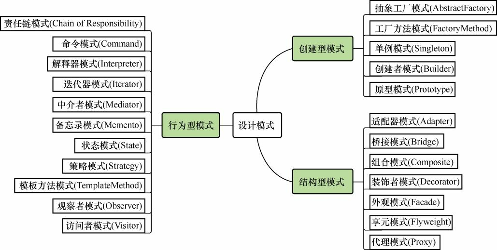

# 设计模式概览

**创建型设计模式**

用于描述“怎样创建对象”，主要特点是“将对象的创建与使用分离”。GoF中提供了单例、原型、工厂方法、抽象工厂、建造者5种创建型模式。

| 模式名称     | **业务场景**                                         | **实现要点**                                                 |
| ------------ | ---------------------------------------------------- | :----------------------------------------------------------- |
| 工厂方法模式 | 多种类型商品不同接口，统一发奖服务搭建场景           | 定义一个创建对象的接口，让其子类自己决定实例化哪一个工厂类，工厂模式使其创建过程延迟到子类进行。 |
| 抽象工厂模式 | 替换Redis双集群升级，代理类抽象场景                  | 提供一个创建一系列相关或相互依赖对象的接口，而无需指定它们具体的类。 |
| 单例模式     | 7种单例模式案例，Effective Java 作者推荐枚举单例模式 | 一个类只有一个实例，并提供一个访问它的全局访问点，以便外部获取该实例。 |
| 原型模式     | 上机考试多套试，每人题目和答案乱序排列场景           | 通过对原型对象复制而获取多个和原型对象类似的实例。           |
| 建造者模式   | 各项装修物料组合套餐选配场景                         | 将一个复杂对象分解成多个相对简单的部分，然后根据不同的需要分别创建它们，最后构建成该复杂对象。 |

**结构型设计模式**

用于描述如何将类或对象按某种布局组成更大的结构，GoF中提供了代理、适配器、桥接、装饰、外观、享元、组合7种结构型模式。

| 模式名称   | **业务场景**                                                 | **实现要点**                                                 |
| :--------- | :----------------------------------------------------------- | :----------------------------------------------------------- |
| 适配器模式 | 从多个MQ消息体中，抽取指定字段值场景                         | 将一个类的接口转换成另外一个接口，使得原本由于接口不兼容而不能一起工作的那些类可以一起工作。 |
| 桥接模式   | 多支付渠道(微信、支付宝)与多支付模式(刷脸、指纹)场景         | 将抽象与实现分离，使它们可以独立变化，用组合关系代替继承关系，降低了抽象和实现的耦合度。 |
| 组合模式   | 营销差异化人群发券，决策树引擎搭建场景                       | 将对象组合成树形结构以表示”部分-整体”的层次结构。组合模式使得用户对单个对象和组合对象的使用具有一致性。 |
| 装饰模式   | SSO单点登录功能扩展，增加拦截用户访问方法范围场景            | 动态地给对象添加额外功能。                                   |
| 外观模式   | 基于SpringBoot开发门面模式中间件，统一控制接口白名单场景     | 为多个复杂的子系统提供一个一致的接口，使这些子系统更加容易被访问。 |
| 享元模式   | 基于Redis秒杀，提供活动与库存信息查询场景                    | 运用共享技术有效地支持大量细粒度的对象的复用。               |
| 代理模式   | 模拟mybatis-spring中定义DAO接口，使用代理类方式操作数据库原理实现场景 | 提供一种代理来控制对这个对象的访问，从而限制、增强或修改该对象的一些特性。 |

**行为型设计模式**

用于描述类或对象之间怎样相互协作共同完成单个对象无法单独完成的任务，以及怎样分配职责。GoF中提供了模板方法、策略、命令、职责链、状态、观察者、中介者、迭代器、访问者、备忘录、解释器11种行为型模式。

| 模式名称     | **业务场景**                                                 | **实现要点**                                                 |
| :----------- | ------------------------------------------------------------ | ------------------------------------------------------------ |
| 责任链模式   | 模拟618电商大促期间，项目上线流程多级负责人审批场景          | 把请求从链中的一个对象传到下一个对象，直到请求被响应为止。通过这种方式可以去除对象之间的耦合。 |
| 命令模式     | 模拟高档餐厅八大菜系，小二点单厨师烹饪场景                   | 将一个请求封装成一个对象，使发出请求的责任和执行请求的责任分割开。 |
| 迭代器模式   | 模拟公司组织架构树结构关系，深度迭代遍历人员信息输出场景     | 提供一种方法顺序访问一个聚合对象中各个元素,  而又无须暴露该对象的内部表示。 |
| 中介者模式   | 按照Mybatis原理手写ORM框架，给JDBC方式操作数据库增加中介者场景 | 定义一个中介对象来简化原有对象之间的交互关系，降低系统中对象间的耦合度，使原有对象之间不必相互了解。 |
| 备忘录模式   | 模拟互联网系统上线过程中，配置文件回滚场景                   | 在不破坏封装性的前提下，捕获一个对象的内部状态，并在该对象之外保存这个状态。 |
| 观察者模式   | 模拟类似小客车指标摇号过程，监听消息通知用户中签场景         | 定义对象间的一种一对多的依赖关系，当一个对象的状态发生改变时，所有依赖于它的对象都得到通知并被自动更新。 |
| 状态模式     | 模拟系统营销活动，状态流程审核发布上线场景                   | 允许一个对象在其内部状态发生改变时改变其行为能力。           |
| 策略模式     | 模拟多种营销类型优惠券，折扣金额计算策略场景                 | 定义并封装一系列的算法， 使它们可相互替换。算法的改变不会影响使用算法的客户。 |
| 模板方法模式 | 模拟爬虫各类电商商品，生成营销推广海报场景                   | 定义一个操作中的算法的骨架，而将一些步骤延迟到子类中。模板方法使得子类可以不改变一个算法的结构即可重定义该算法的某些特定步骤。 |
| 访问者模式   | 模拟家长与校长，对学生和老师的不同视角信息的访问场景         | 在不改变集合元素的前提下，为一个集合中的每个元素提供多种访问方式，即每个元素有多个访问者对象访问。 |
| 解释器       |                                                              | 提供如何定义语言的文法，以及对语言句子的解释方法，即解释器。 |

