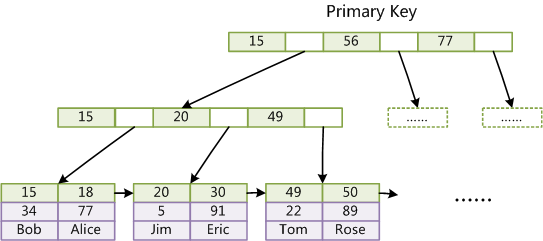

# 存储引擎
MySQL中常用的四种存储引擎分别是：MyISAM、InnoDB、MEMORY、ARCHIVE。MySQL 5.5版本后默认的存储引擎为InnoDB。

# InnoDB
InnoDB是MySQL默认的事务型存储引擎，使用最广泛，基于聚簇索引建立的。InnoDB内部做了很多优化，如能够自动在内存中创建自适应hash索引，以加速读操作。

优点：支持事务和崩溃修复能力；引入了行级锁和外键约束。

缺点：占用的数据空间相对较大。

适用场景：需要事务支持，并且有较高的并发读写频率。


## 数据存储

### 存储方式

InnoDB下，一张表的所有数据都是存放在该表的聚簇索引，即主键索引的叶子结点中的。


### 数据文件

```
[root@izuf6e56zt7ebjhby2hxboz l@002dsixth@002dservice]# ll
total 10488
-rw-r----- 1 mysql mysql  147456 Mar 28 12:28 it_blog_classify.ibd
-rw-r----- 1 mysql mysql  114688 Dec  2 14:15 it_blogger.ibd
-rw-r----- 1 mysql mysql 9437184 Mar 28 23:18 it_blog.ibd
-rw-r----- 1 mysql mysql  114688 Dec  7 10:19 it_blog_tag.ibd
```


| 文件格式 | 描述                                                         |
| -------- | ------------------------------------------------------------ |
| .frm     | 存储表定义的文件                                             |
| .ibd     | 存储索引和数据的文件。既该表的所有索引树，所有行记录数据都存储在该文件中。 |


## 索引支持

- 根据索引类型来分：

| 索引名称 | 描述     | 最早支持版本 | 是否常用 |
| -------- | -------- | ------------ | -------- |
| NORMAL   | 普通索引 |              | 是       |
| UNIQUE   | 唯一索引 |              | 是       |
| SPATIAL  | 空间索引 |              | 否       |
| FULLTEXT | 全文索引 | MySQL 5.6    | 否       |


- 根据索引结构来分

| 结构名称 | 备注                                                   |
| -------- | ------------------------------------------------------ |
| B+Tree   | 支持                                                   |
| HASH     | Innodb不支持真正的hash结构，这里是一种自适应的hash索引 |


### 数据结构角度

#### B+Tree

- **主键索引**

叶子节点存储与主键对应的行数据。





- 非主键索引

叶子节点存储的是主键，查找数据时先根据索引找到匹配的主键，再根据主键索引进行查询。


#### 自适应HASH

Innodb不支持真正的hash结构，这里是一种自适应的hash索引。

- 虽然InnoDB不支持哈希索引，但是它依然有曲线救国的手段，就是支持一种伪哈希索引的方式，变相支持哈希索引。
- 这样的伪哈希索引，我们叫它为**自适应哈希索引**。但这个**自适应哈希索引**并不是由我们人为控制建立的。而InnoDB存储引擎引擎自动优化创建，不受人为干预的


什么是哈希表，相信我们大家都知道，通过O(1)的时间复杂度，我们就可以查询到想要的数据，但是需要付出O(n)的空间复杂度代价。这也是InnoDB不支持哈希索引的原因之一
那么什么是自适应哈希索引呢？说白了，它也是哈希索引，但是它不为表中的所有数据都建立索引。而是有选择性的为一些热点数据建立哈希索引。
既Innodb存储引擎会监控对某表的辅助键索引查找情况，如果发现某辅助键索引被频繁访问，既代表某些关键字是热数据，于是这些数据则会被放入哈希索引中，由此让特定频繁被访问的热点数据可以享受到哈希索引O(1)的速度。


### 主键角度

#### 主键索引

主键索引采用的是聚簇索引，叶子结点的每个关键字对应的数据，**存放的都是完整的行数据**。既InnoDB下，一张表的所有数据都是存放在该表的聚簇索引叶子结点中的。


#### 辅助索引

辅助键索引采用的是非聚簇索引，叶子结点的每个关键字对应的数据，**存放的都是主键信息**。


# MyISAM
数据以紧密格式存储。对于只读数据，或者表比较小、可以容忍修复操作，可以使用MyISAM引擎。MyISAM会将表存储在两个文件中，数据文件.MYD和索引文件.MYI。

优点：访问速度快。

缺点：MyISAM不支持事务和行级锁，不支持崩溃后的安全恢复，也不支持外键。

适用场景：对事务完整性没有要求；表的数据都会只读的。

## 数据存储

### 存储方式

**在MyISAM下，主键索引和辅助键索引都属于非聚簇索引。**非聚簇索引的叶子结点的关键字的值都是对应数据在数据文件中的地址，就是叶子结点存储的不是数据本身，而仅仅是一个指针。

MyISAM存储引擎的数据文本和索引是分开存储的，索引是索引，索引的叶子结点存储的也仅仅是指针。


### 数据文件

```
[root@izuf6e56zt7ebjhby2hxboz springboot]# ll
total 120
-rw-r----- 1 mysql mysql  10605 Mar 28 23:45 jpa_user_1732.sdi
-rw-r----- 1 mysql mysql    736 Mar 28 23:45 jpa_user.MYD
-rw-r----- 1 mysql mysql   2048 Mar 28 23:45 jpa_user.MYI
-rw-r----- 1 mysql mysql  10608 Mar 28 23:45 mybatis_user_1733.sdi
-rw-r----- 1 mysql mysql    220 Mar 28 23:45 mybatis_user.MYD
-rw-r----- 1 mysql mysql   2048 Mar 28 23:45 mybatis_user.MYI
```


| 文件格式 | 描述                   |
| -------- | ---------------------- |
| .frm     | 存储表定义的文件       |
| .MYD     | 存储所有行数据的文件   |
| .MYI     | 存储索引相关数据的文件 |


## 索引支持

### 数据结构角度

#### B+Tree索引

MyISAM中的主键索引和非主键索引一样，都是非聚簇索引，存储的是行数据地址的指针。


## MyISAM和InnoDB的区别

是否支持行级锁 : MyISAM 只有表级锁，而InnoDB 支持行级锁和表级锁，默认为行级锁。

是否支持事务和崩溃后的安全恢复：MyISAM 不提供事务支持。而InnoDB提供事务支持，具有事务、回滚和崩溃修复能力。

是否支持外键： MyISAM不支持，而InnoDB支持。

是否支持MVCC ：MyISAM不支持，InnoDB支持。应对高并发事务，MVCC比单纯的加锁更高效。

MyISAM不支持聚集索引，InnoDB支持聚集索引。

叶子节点存储的是行数据的内存地址。

# MEMORY
MEMORY引擎将数据全部放在内存中，访问速度较快，但是一旦系统奔溃的话，数据都会丢失。

MEMORY引擎默认使用哈希索引，将键的哈希值和指向数据行的指针保存在哈希索引中。

优点：访问速度较快。

缺点：

哈希索引数据不是按照索引值顺序存储，无法用于排序。
不支持部分索引匹配查找，因为哈希索引是使用索引列的全部内容来计算哈希值的。
只支持等值比较，不支持范围查询。
当出现哈希冲突时，存储引擎需要遍历链表中所有的行指针，逐行进行比较，直到找到符合条件的行。

# ARCHIVE

ARCHIVE存储引擎非常适合存储大量独立的、作为历史记录的数据。ARCHIVE提供了压缩功能，拥有高效的插入速度，但是这种引擎不支持索引，所以查询性能较差。