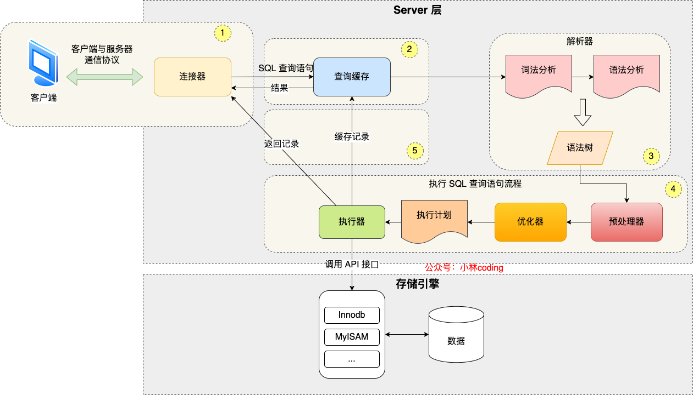
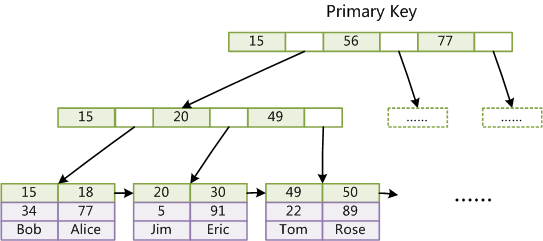
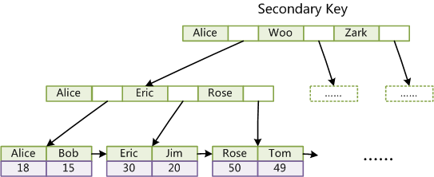

# MySQL

## 基本概念

### 数据库三范式

第一范式（1NF）：字段不可分；原子性。 
　　第二范式（2NF）：有主键，非主键字段依赖主键，一个表只说明一个事物；
　　第三范式（3NF）：非主键字段不能相互依赖，每个字段都与主键有直接关系，不存在传递依赖。


## 架构
MySQL主要分为 Server 层和存储引擎层：


- Server 层

主要包括连接器、查询缓存、分析器、优化器、执行器等，所有跨存储引擎的功能都在这一层实现，比如存储过程、触发器、视图，函数等，还有一个通用的日志模块 binglog 日志模块。


- 存储引擎

主要负责数据的存储和读取。server 层通过api与存储引擎进行通信。


### Server 层

MySQL 大多数的核心功能模块都在这实现，主要包括连接器，查询缓存、解析器、预处理器、优化器、执行器等。另外，所有的内置函数（如日期、时间、数学和加密函数等）和所有跨存储引擎的功能（如存储过程、触发器、视图等。）都在 Server 层实现。


#### 连接器

第一步要先连接 MySQL 服务，然后才能执行 SQL 语句，连接的过程需要先经过 TCP 三次握手，因为 MySQL 是基于 TCP 协议进行传输的。

如果 MySQL 服务正常运行，完成 TCP 连接的建立后，连接器就要开始验证你的用户名和密码，如果用户名或密码不对，就收到一个"Access denied for user"的错误，然后客户端程序结束执行。

如果用户密码都没有问题，连接器就会获取该用户的权限，然后保存起来，后续该用户在此连接里的任何操作，都会基于连接开始时读到的权限进行权限逻辑的判断。

所以，如果一个用户已经建立了连接，即使管理员中途修改了该用户的权限，也不会影响已经存在连接的权限。修改完成后，只有再新建的连接才会使用新的权限设置。


#### 查询缓存 

连接器得工作完成后，客户端就可以向 MySQL 服务发送 SQL 语句了，MySQL 服务收到 SQL 语句后，就会解析出 SQL 语句的第一个字段，看看是什么类型的语句。

如果 SQL 是查询语句（select 语句），MySQL 就会先去查询缓存（ Query Cache ）里查找缓存数据，看看之前有没有执行过这一条命令，这个查询缓存是以 key-value 形式保存在内存中的，key 为 SQL 查询语句，value 为 SQL 语句查询的结果。

如果查询的语句命中查询缓存，那么就会直接返回 value 给客户端。如果查询的语句没有命中查询缓存中，那么就要往下继续执行，等执行完后，查询的结果就会被存入查询缓存中。

这么看，查询缓存还挺有用，但是其实**查询缓存挺鸡肋**的。

对于更新比较频繁的表，查询缓存的命中率很低的，因为只要一个表有更新操作，那么这个表的查询缓存就会被清空。如果刚缓存了一个查询结果很大的数据，还没被使用的时候，刚好这个表有更新操作，查询缓冲就被清空了，相当于缓存了个寂寞。

所以，MySQL 8.0 版本直接将查询缓存删掉了，也就是说 MySQL 8.0 开始，执行一条 SQL 查询语句，不会再走到查询缓存这个阶段了。

对于 MySQL 8.0 之前的版本，如果想关闭查询缓存，我们可以通过将参数 query_cache_type 设置成 DEMAND。


#### 分析器

没有命中缓存的话，SQL 语句就会经过分析器，主要分为两步，词法分析和语法分析，先看 SQL 语句要做什么，再检查 SQL 语句语法是否正确。

第一件事情，**词法分析**。MySQL 会根据你输入的字符串识别出关键字出来，构建出 SQL 语法树，这样方面后面模块获取 SQL 类型、表名、字段名、 where 条件等等。

第二件事情，**语法分析**。根据词法分析的结果，语法解析器会根据语法规则，判断你输入的这个 SQL 语句是否满足 MySQL 语法。

如果输入的 SQL 语句语法不对，就会在解析器这个阶段报错。比如，我下面这条查询语句，把 from 写成了 form，这时 MySQL 解析器就会给报错。


#### 预处理器

预处理阶段做了两件事。

- 检查 SQL 查询语句中的表或者字段是否存在，不存在则抛出异常；
- 将 `select *` 中的 `*` 符号，扩展为表上的所有列；


#### 优化器

优化器对查询进行优化，包括重写查询、决定表的读写顺序以及选择合适的索引等，生成执行计划。

**优化器主要负责将 SQL 查询语句的执行方案确定下来**，比如在表里面有多个索引的时候，优化器会基于查询成本的考虑，来决定选择使用哪个索引。


#### 执行器 

经历完优化器后，就确定了执行方案，接下来 MySQL 就真正开始执行语句了，这个工作是由「执行器」完成的。在执行的过程中，执行器就会和存储引擎交互了，交互是以记录为单位的。


### 存储引擎

支持 InnoDB、MyISAM、Memory 等多个存储引擎，不同的存储引擎共用一个 Server 层。现在最常用的存储引擎是 InnoDB，从 MySQL 5.5 版本开始， InnoDB 成为了 MySQL 的默认存储引擎。我们常说的索引数据结构，就是由存储引擎层实现的，不同的存储引擎支持的索引类型也不相同，比如 InnoDB 支持索引类型是 B+树 ，且是默认使用，也就是说在数据表中创建的主键索引和二级索引默认使用的是 B+ 树索引。


## 分区表
分区表是一个独立的逻辑表，但是底层由多个物理子表组成。

当查询条件的数据分布在某一个分区的时候，查询引擎只会去某一个分区查询，而不是遍历整个表。在管理层面，如果需要删除某一个分区的数据，只需要删除对应的分区即可。

### 按照范围分区。
```mysql
CREATE TABLE test_range_partition(
       id INT auto_increment,
       createdate DATETIME,
       primary key (id,createdate)
   ) 
   PARTITION BY RANGE (TO_DAYS(createdate) ) (
      PARTITION p201801 VALUES LESS THAN ( TO_DAYS('20180201') ),
      PARTITION p201802 VALUES LESS THAN ( TO_DAYS('20180301') ),
      PARTITION p201803 VALUES LESS THAN ( TO_DAYS('20180401') ),
      PARTITION p201804 VALUES LESS THAN ( TO_DAYS('20180501') ),
      PARTITION p201805 VALUES LESS THAN ( TO_DAYS('20180601') ),
      PARTITION p201806 VALUES LESS THAN ( TO_DAYS('20180701') ),
      PARTITION p201807 VALUES LESS THAN ( TO_DAYS('20180801') ),
      PARTITION p201808 VALUES LESS THAN ( TO_DAYS('20180901') ),
      PARTITION p201809 VALUES LESS THAN ( TO_DAYS('20181001') ),
      PARTITION p201810 VALUES LESS THAN ( TO_DAYS('20181101') ),
      PARTITION p201811 VALUES LESS THAN ( TO_DAYS('20181201') ),
      PARTITION p201812 VALUES LESS THAN ( TO_DAYS('20190101') )
   )
```


在/var/lib/mysql/data/可以找到对应的数据文件，每个分区表都有一个使用##分隔命名的表文件：

```
  -rw-r----- 1 MySQL MySQL    65 Mar 14 21:47 db.opt
  -rw-r----- 1 MySQL MySQL  8598 Mar 14 21:50 test_range_partition.frm
  -rw-r----- 1 MySQL MySQL 98304 Mar 14 21:50 test_range_partition##P##p201801.ibd
  -rw-r----- 1 MySQL MySQL 98304 Mar 14 21:50 test_range_partition##P##p201802.ibd
  -rw-r----- 1 MySQL MySQL 98304 Mar 14 21:50 test_range_partition##P##p201803.ibd
```


### list分区

对于`List`分区，分区字段必须是已知的，如果插入的字段不在分区时枚举值中，将无法插入。

```mysql
create table test_list_partiotion
   (
       id int auto_increment,
       data_type tinyint,
       primary key(id,data_type)
   )partition by list(data_type)
   (
       partition p0 values in (0,1,2,3,4,5,6),
       partition p1 values in (7,8,9,10,11,12),
       partition p2 values in (13,14,15,16,17)
   );
```


### hash分区

可以将数据均匀地分布到预先定义的分区中。

```mysql
create table test_hash_partiotion
   (
       id int auto_increment,
       create_date datetime,
       primary key(id,create_date)
   )partition by hash(year(create_date)) partitions 10;
```


## 变量查询
### datadir
查询存储数据地址。

```mysql
show global variables like "datadir";
```


## 主从同步

### 什么是MySQL主从同步？

主从同步使得数据可以从一个数据库服务器复制到其他服务器上，在复制数据时，一个服务器充当主服务器（`master`），其余的服务器充当从服务器（`slave`）。

因为复制是异步进行的，所以从服务器不需要一直连接着主服务器，从服务器甚至可以通过拨号断断续续地连接主服务器。通过配置文件，可以指定复制所有的数据库，某个数据库，甚至是某个数据库上的某个表。


### 为什么要做主从同步？

1. 读写分离，使数据库能支撑更大的并发。
2. 在主服务器上生成实时数据，而在从服务器上分析这些数据，从而提高主服务器的性能。
3. 数据备份，保证数据的安全。
4. 更新完成。


## 参考资料
- [MySQL 5.7版本版本版本版本官方文档](https://dev.mysql.com/doc/refman/5.7/en/【【【)
- [MySQL 8.0版本版本版本版本官方文档](https://dev.mysql.com/doc/refman/8.0/en/)


# MySQL 数据类型

## 日期类型数据

- date: 

	日期  如：2019-10-26 不带时分秒

	范围: '1000-01-01' to '9999-12-31'

- datetime: 

	日期时间 如：2019-10-26 10:53:00 带时分秒 

	范围: '1000-01-01 00:00:00' to '9999-12-31 23:59:59'.

- timestamp: 

	时间戳， 指格林威治时间1970年01月01日00时00分00秒(北京时间1970年01月01日08时00分00秒)起至现在的总秒数。

	范围: '1970-01-01 00:00:01' UTC to '2038-01-19 03:14:07' UTC 

	Coordinated Universal  Time，协调世界时，又称世界统一时间、世界标准时间、国际协调时间。由于英文（CUT）和法文（TUC）的缩写不同，作为妥协，简称UTC。

	

# MySQL 语法

**SQL主要分成四部分**：
（1）数据定义。（SQL DDL）用于定义SQL模式、基本表、视图和索引的创建和撤消操作。
（2）数据操纵。（SQL DML）数据操纵分成数据查询和数据更新两类。数据更新又分成插入、删除、和修改三种操作。
（3）数据控制。包括对基本表和视图的授权，完整性规则的描述，事务控制等内容。
（4）嵌入式SQL的使用规定。涉及到SQL语句嵌入在宿主语言程序中使用的规则。


## DCL

### 概念

DCL（Data Control Language）数据库控制语言  授权，角色控制等。


### 语法

##### GRANT 授权

##### REVOKE 取消授权


## DDL
### 概念

**DDL**（Data Definition Language）数据库定义语言

>  statements are used to define the database structure or schema.


用于定义数据库的三级结构，包括外模式、概念模式、内模式及其相互之间的映像，定义数据的完整性、安全控制等约束。DDL不需要commit。


### 语法
##### 索引相关

###### 查询索引

```mysql
## 查询指定表的索引
SHOW INDEX FROM it_blog;
```


查询结果：

| Table   | Non_unique | Key_name              | Seq_in_index | Column_name | Collation | Cardinality | Sub_part | Packed | Null | Index_type | Comment | Index_comment | Visible | Expression |
| ------- | ---------- | --------------------- | ------------ | ----------- | --------- | ----------- | -------- | ------ | ---- | ---------- | ------- | ------------- | ------- | ---------- |
| it_blog | 0          | PRIMARY               | 1            | id          | A         | 2141        |          |        |      | BTREE      |         |               | YES     |            |
| it_blog | 0          | uk_url                | 1            | url         | A         | 2172        |          |        |      | BTREE      |         | url唯一索引   | YES     |            |
| it_blog | 1          | idx_user_tag_classify | 1            | user_id     | A         | 2           |          |        |      | BTREE      |         |               | YES     |            |
| it_blog | 1          | idx_user_tag_classify | 2            | tag_id      | A         | 4           |          |        |      | BTREE      |         |               | YES     |            |
| it_blog | 1          | idx_user_tag_classify | 3            | classify_id | A         | 8           |          |        |      | BTREE      |         |               | YES     |            |


###### 添加索引

```mysql
## 添加普通索引
ALTER TABLE `it_blog` ADD KEY `idx_user`(`user_id`);
CREATE INDEX `idx_user` ON `it_blog`(`user_id`);
## 添加联合索引
ALTER TABLE `it_blog` ADD KEY `idx_user_classiyf`(`user_id`, `classify_id`);
CREATE INDEX `idx_user_classiyf` ON `it_blog`(`user_id`, `classify_id`);
## 添加唯一索引
ALTER TABLE `it_blog` ADD UNIQUE KEY `uk_url`(`url`);
CREATE UNIQUE INDEX `uk_url` ON `it_blog`(`url`);
## 添加主键索引
ALTER TABLE `it_blog` ADD PRIMARY KEY `temp`(`id`);
### 移除主键并设置新的主键
ALTER TABLE `it_blog` DROP PRIMARY KEY, ADD PRIMARY KEY `it_blog`(`id`) USING BTREE;
```


###### 删除索引

```mysql
## 删除索引
ALTER TABLE `it_blog` DROP INDEX `uk_url`;
## 删除索引
DROP INDEX `idx_user` ON `it_blog`;
## 删除主键索引
ALTER TABLE `it_blog` DROP PRIMARY KEY;
```


###### 注意

- 如果单纯移除自增主键而不设置新的主键时，会执行失败。因为表中只能有一列自增列并且改自增列必须要是主键。此时会返回如下结果：

```
ALTER TABLE `it_blog` DROP PRIMARY KEY
> 1075 - Incorrect table definition; there can be only one auto column and it must be defined as a key
> 时间: 0.031s
```


##### CREATE


##### ALTER


##### DROP


##### TRUNCATE

###### truncate、delete与drop区别？

**相同点：**

1. `truncate`和不带`where`子句的`delete`、以及`drop`都会删除表内的数据。
2. `drop`、`truncate`都是`DDL`语句（数据定义语言），执行后会自动提交。


**不同点：**

1. truncate 和 delete 只删除数据不删除表的结构；drop 语句将删除表的结构被依赖的约束、触发器、索引；
2. 一般来说，执行速度: drop > truncate > delete。


##### COMMENT


##### RENAME

## DML
### 概念

DML（Data Manipulation Language）数据操纵语言statements are used for managing data within schema objects.

由DBMS提供，用于让用户或程序员使用，实现对数据库中数据的操作。
DML分成交互型DML和嵌入型DML两类。
依据语言的级别，DML又可分成过程性DML和非过程性DML两种。
需要commit.


### 语法

#### 查询

##### SELECT


#### 更新

##### INSERT

##### UPDATE

##### DELETE

#### 条件

##### EXIST

##### IN

###### EXIST和IN的区别？

`exists`用于对外表记录做筛选。`exists`会遍历外表，将外查询表的每一行，代入内查询进行判断。当`exists`里的条件语句能够返回记录行时，条件就为真，返回外表当前记录。反之如果`exists`里的条件语句不能返回记录行，条件为假，则外表当前记录被丢弃。

`in`是先把后边的语句查出来放到临时表中，然后遍历临时表，将临时表的每一行，代入外查询去查找。

**子查询的表比较大的时候**，使用`exists`可以有效减少总的循环次数来提升速度；**当外查询的表比较大的时候**，使用`in`可以有效减少对外查询表循环遍历来提升速度。


##### WHERE


#### 分组过滤

##### HAVING

###### having和where的区别？

- 二者作用的对象不同，`where`子句作用于表和视图，`having`作用于组。
- `where`在数据分组前进行过滤，`having`在数据分组后进行过滤。


#### 排序

##### ORDER


#### 分页

##### LIMIT


## TCL
### 概念

TCL（Transaction Control Language）事务控制语言。


### 语法

#### SAVEPOINT 设置保存点

#### ROLLBACK  回滚

#### SET TRANSACTION


#### 查看和设置

```mysql
## 查看隔离级别
select @@transaction_isolation;
## 设置隔离级别
set session transaction isolation level read uncommitted;
set global transaction isolation level repeatable read;
```


## 函数

### count

### sum

### avg

### max

### min


### 总结

| 函数名称 | 描述     |
| -------- | -------- |
| sum      | 求和     |
| avg      | 求平均值 |
| max      | 求最大值 |
| min      | 求最小值 |
| count    | 计数     |
| md5      | 取MD5    |


## 其他

### SHOW

#### 查看表结构 

```mysql
SHOW CREATE TABLE `it_blog`;
```


# MySQL 索引

索引有很多种类型，可以为不同的场景提供更好的性能。在 MySQL 中，**索引是存储引擎层实现的**，并没有统一的索引标准，即使多个存储引擎支持同一种类型的索引，其底层的实现也可能不同。

索引的根本原理就是降低硬盘的io次数。


> 其实简单来说，索引就是一个排好序的数据结构


**索引优势**

1. 加快查询和分组、排序的速度，降低数据库的IO成本以及CPU的消耗。
2. 通过创建唯一索引，可以保证每一行数据的唯一性。
3. 加速表与表的连接。


**索引劣势**

1. 增删改操作时需要更新索引，会降低数据操作的性能：
  1. 新增：自然需要在索引树中新增节点；
  2. 删除：索引树中指向的记录可能会失效，意味着这棵索引树很多节点，都是失效的；
  3. 改动：索引树中节点的**指向**可能需要改变。
2. 创建索引时需要对表加锁，在锁表的同时，可能会影响到其他的数据操作。
3. 索引需要磁盘的空间进行存储，如果针对单表创建了大量的索引，可能比数据文件更快达到大小上限。
4. 当对表中的数据进行CRUD的时，也会触发索引的维护，而维护索引需要时间，可能会降低数据操作的性能。
5. 创建索引需要时间，后期创建的索引，创建开销时间与表数据量呈正相关


## 索引类型

### 数据结构角度

#### B+Tree 索引

>  B-Tree能加快数据的访问速度，因为存储引擎不再需要进行全表扫描来获取数据，数据分布在各个节点之中。最常见的索引类型，大部分索引都支持 B 树索引。


MySQL 中以 B+Tree 的有序的数据结构存储索引数据。

本身是一种平衡的二叉树，每一个叶子节点到根的距离都是相同的，并且记录的所有节点是按键值的大小、顺序放在同一层的叶子节点上的，并且每一个叶子节点是通过指针来连接的。

是B-Tree的改进版本，同时也是数据库索引索引所采用的存储结构。数据都在叶子节点上，并且增加了顺序访问指针，每个叶子节点都指向相邻的叶子节点的地址。相比B-Tree来说，进行范围查找时只需要查找两个节点，进行遍历即可。而B-Tree需要获取所有节点，相比之下B+Tree效率更高。

B+Tree的每个非叶子节点存储了多个索引数据，每个非叶子节点大小为4kb。

MySql索引数据结构对经典的B+Tree进行了优化。在原B+Tree的基础上，增加一个**指向相邻叶子节点的链表指针(整体类似一个双向链表的结构)**，就形成了带有顺序指针的B+Tree，提高区间访问的性能。


MyISAM的B+Tree索引的叶子节点上面存储的是主键id的内存地址。

MyISAM的B+Tree索引如果是主键，则叶子节点上面存储的是该主键对应的所有列；如果不是主键，则叶子节点上面存储的是主键数据。

自适应 HASH 索引：自动维护


##### 优点

Btree 索引适用于全值匹配的查询。如

Btree 索引适合处理范围查找。

Btee 索引从索引的最左侧列开始匹配查找列

对于多个列组合成的索引，只能从左开始查找，如


##### 缺陷

- 只能从最左侧开始按索引键的顺序使用索引，不能跳过索引键

    如一个 a_b_c 的联合索引，在过滤的时候使用 a 和 c 列，那么就只能用到 a 列的索引

- NOT IN 和 `<>`（不等于） 操作无法使用索引

- 索引列上不能使用表达式或是函数


##### 和B-Tree对比

- B+Tree的磁盘读写代价更低

B+Tree非叶子结点存储索引数据，仅仅包含索引列和地址指针，同一个结点（磁盘页）中，B+Tree包含的索引数量比B-Tree更多，同样的数据量下，B+Tree会比B-Tree更加“矮胖”，查询时需要的IO次数更少。


- B+树的查询效率更加稳定

B+Tree所有索引或行数据都在叶子结点，而叶子结点都属于同一层级，所有查询都是从根结点遍历到叶子结点，时间复杂度相比B-Tree查询更加稳定。


- B+树更有利对数据的扫描

B-Tree如果需要查询一串相邻的数值，可能需要来回扫描或是从根结点多次中序遍历。而B+Tree的所有元素都存储叶子结点，每个叶子结点都有指向下一个结点的指针，直接线性遍历即可。B+Tree更加利于做范围查询。


##### 扩展

###### 为什么索引结构默认使用B+Tree，而不是链表、hash、二叉树、红黑树？

- **HASH**

    虽然可以快速定位，但是没有顺序，IO复杂度高。

    

- **二叉树**

    树的高度不均匀，不能自平衡，查找效率跟树的高度有关，并且IO代价高。在极端情况下等同于链表，此时查询相当于全表扫描。

    

- **红黑树**

    树的高度不可控，随着数据量增加而增加，IO代价高。


###### 为什么官方建议使用自增长主键作为索引

结合B+Tree的特点，自增主键是连续递增的，在插入过程中能减少页分裂，即使要进行页分裂，也只会分裂很少一部分。并且能减少数据的移动，每次插入都是插入到最后。总之就是减少分裂和移动的频率。


###### B+Tree索引页能存储多少数据

一个索引页默认大小16kb，整数（`bigint`）字段的长度为8B，另外还跟着6B的指向其子树的指针，这意味着一个索引页可以存储接近1200条数据(16kb/14B ≈ 1170)。

- 树的根节点存储1200条索引目录，占用16kb内存。
- 树的第二层总共是1200个索引页，每个索引页存放1200条索引目录，就有144w条索引目录，占用1200 \* 16KB = 20M内存。
- 树的第三层1200 \* 1200 = 144w页，144w \* 16kB = 23G，此时不适合存放到内存中。


###### 根据主键ID查询流程

- 内存中直接获取树根索引页，对树根索引页内的目录进行二分查找，定位到第二层的索引页
- 内存中直接获取第二层的索引页，对索引页内的目录进行二分查找，定位到第三层的索引页
- 从磁盘加载第三层的索引页到内存中，对索引页内的目录进行二分查找，定位到第四层数据页
- 从磁盘加载第四层的数据页到内存中，数据页变成缓存页，对缓存页中的目录进行二分查找，定位到具体的行数据


#### Hash索引

基于哈希表实现，只有精确匹配索引所有列的查询才有效，对于每一行数据，存储引擎都会对所有的索引列计算一个哈希码（hash code），并且Hash索引将所有的哈希码存储在索引中，同时在索引表中保存指向每个数据行的指针。


##### 优点

- 通过对Key进行散列值计算，可以直接得到对应数据的存放位置，它的查询效率能够达到O(1)。


##### 缺陷

- Hash索引仅仅能满足“=”，“in”查询条件，不能使用范围查询。
- 不能用部分索引键来搜索，因为组合索引在计算哈希值的时候是一起计算的。
- 哈希索引也没办法利用索引完成排序
- 不支持最左匹配原则
- 存在大量哈希冲突（Hash碰撞）的情况下，哈希索引的效率也是极低的


#### R-Tree索引

空间索引，是MyISAM引擎的一个特殊索引类型，主要用于地理空间数据类型，通常使用较少。


### 主键角度

#### 主键索引

MySQL在创建表时如果设置了主键（Primary Key），则会默认在主键列上设置索引，即主键索引（Primary Index）。


> 在InnoDB里，主键索引也被称为**聚簇索引**（Clustered Index）。


##### 特点

1. 数据唯一，不能为NULL


#### 辅助索引

与主键索引相对的即是**辅助索引**（Secondary Index），辅助索引也被称为**二级索引**、**次级索引**。


### 应用层次角度

#### 普通索引

即一个索引只包含单个列，一个表可以有多个单列索引。

普通索引的唯一作用就是为了快速查询数据，一张表允许创建多个普通索引，并允许数据重复和 NULL。


#### 组合索引

一个索引包含多个列。组合索引和字符串列上的索引都有一个最左匹配原则，查询条件中必须要有索引最左一列才会生效，而如果中间跳过一列则跳过的列及之后的列都不会生效。

有时有可能因为多个列名过长，导致组合索引树的键大小过大，降低了存储和查询的效率。所以为了避免出现这样的情况，可以适当的保证每一列的名字不要太长，或只取组合索引每一列前几个字符组成索引。

**组合索引实际还是一个索引，并非真的创建了多个索引，只是产生的效果等价于产生多个索引。**


**示例**

| 索引名称           | 字段               | 索引类型 | 索引方法 |
| ------------------ | ------------------ | -------- | -------- |
| idx_classify_title | classify_id, title | NORMAL   | BTREE    |


##### 优点

- 减少开销

组合索引(col1,col2,col3)实际产生的作用等价于建了(col1),(col1,col2),(col1,col2,col3)三个索引。索引也需要磁盘空间，每多一个索引，不仅增加磁盘空间的开销，还多了一棵索引的查询和维护。对于大量数据的表，使用联合索引会大大的减少磁盘空间和执行开销！


- 覆盖索引

如果查询的列都包括在组合索引中，那么MySQL可以只遍历一次该组合索引，便可以取到`col1,col2,col3`三列的数据，而无需回表，这就减少了很多IO操作。


- 效率高

索引列越多，通过索引筛选出的数据越少。


#### 唯一索引

唯一索引也是一种约束。**唯一索引的属性列不能出现重复的数据，一张表允许创建多个唯一索引。** 建立唯一索引的目的大部分时候都是为了该属性列的数据的唯一性，而不是为了查询效率。

在数据库的角度中，`NULL` != `NULL` , 所以唯一索引列，可以有多个空值。

每张表可以有多个唯一索引，但是只能有一个Primary索引。


#### 前缀索引

前缀索引只适用于字符串类型的数据。前缀索引是对文本的前几个字符创建索引，相比普通索引建立的数据更小， 因为只取前几个字符。


#### 空间索引

> 不常用

空间索引，空间索引是对空间数据类型的字段建立的索引，MYSQL中的空间数据类型有4种，分别是GEOMETRY、POINT、LINESTRING、POLYGON。


#### 全文索引

> 不常用

全文索引（MySQL 5.6 之后InnoDB才支持），它是模糊匹配的一种更好的解决方案，它的效率要比使用`like %`更高，并且它还支持多种匹配方式，灵活性也更加强大。只有字段的数据类型为 char、varchar、text 及其系列才可以建全文索引。

全文索引主要是为了检索大文本数据中的关键字的信息，是目前搜索引擎数据库使用的一种技术。Mysql5.6 之前只有 MYISAM 引擎支持全文索引，5.6 之后 InnoDB 也支持了全文索引

全文索引也是MyISAM的一个特殊索引类型，主要用于全文索引，InnoDB从Mysql5.6版本开始支持全文索引。

说是全文索引，其实它只代表可以实现全文检索的功能，而全文检索的底层实现，实际就是倒排索引，所以你也可以把全文索引的本质，当做是倒排索引。再了解全文检索之前，务必要先了解倒排索引

为什么叫倒排索引？

因为英文单词Inverted有颠倒的意思，然后可能就被翻译为倒排索引，也有很多地方叫反向索引。相对而言的索引就是正排索引（forward index）
倒排索引和正排索引，我的个人理解是，它与我们之前说的B+索引，哈希索引的应用不同。拿这些索引的知识去理解正排索引和倒排索引，感觉有些难以联系起来，容易混乱。因为正排，倒排是属于搜索引擎范畴的概念，所以理解正排，倒排最好还是先对搜索引擎有一些了解。比如使用过ElasticSearch
什么是倒排索引（Inverted index）？

说实话，倒排索引也不是一个简单的概念，很多搜索引擎的底层原理都是倒排索引，比如ElasticSearch等。
学习倒排索引的时候，最好还是需要一些搜索引擎的知识会更容易理解。

倒排索引就是相对正排索引相反而言的模型。正排索引是通过文档ID来遍历文档内容，找到关键字（文档 -> 关键字）。而倒排索引则是通过关键字，找到所在的文档（关键字 -> 文档）

以上正排索引，假如我们的搜索引擎是基于正排索引实现的，那么我们要在索引库中查询"python"关键字, 就很可能需要一个一个文档的进行遍历，直到在某个文档的内容中找到"python"单词。这样的一个时间复杂度是很大的，尤其是数据量很大的情况下。所以基于正排索引实现的搜索引擎是不现实的

如果在每一文档录入搜索引擎索引库的时候，我们就对文档的内容进行分词，统计，分析。建立倒排索引，记录分词得到的每个单词对应文档的出现位置和出现次数。 那么我们在搜索引擎查询"python"关键字，就会非常的快速，只需要通过关键字就可以马上查询到已经预处理的统计分析结果。也就知道了'python'关键字在文档A和文档B出现过。展示给用户即可。

这也是为什么是正排和倒排的原因，正排是通过文档查找关键字，倒排是通过关键字查到对应的文档。详细的倒排索引知识以后有时间再在ES的知识点中重点说明。


### 数据存储角度

#### 聚簇索引

聚簇索引（Clustered Index）又称`聚集索引`，将根据键值对数据库表中的数据进行排序存储，并将相关的信息聚簇在一起索引就叫聚簇索引（**该顺序是物理上连续的存储空间的顺序**）。

只有InnoDB支持聚簇索引，若存在主键，则以该主键列生聚簇索引树；若没有主键，则以**第一个唯一非空列**的索引作为聚簇索引；以上条件皆不满足，InnoDB会在内部生成一个名为`GEN_CLUST_INDEX`隐式聚簇索引。该索引是基于一个名为`DB_ROW_ID`的隐藏字段，通常称之隐式主键。


##### 特点

1. 定义了数据存储在表中的顺序，该表的数据有且仅以一种方式排序。因此，**每个表只能有一个聚簇索引**；
2. 聚簇索引其中一个大特征就是将索引和数据存储在同一个文件中，叶子结点不仅保存键的信息，还保存了位于同一行其他列的信息，**聚簇索引的叶子结点保存的是一个完整行记录数据**；
3. 聚簇索引是一种有序索引，它的具体实现可以是稠密索引，也可以是稀疏索引。


##### 优点

- **聚簇索引可以将相关的数据紧密的关联起来，存储在相邻的连续物理空间，利于范围查询**，比如将相关的数据存放在一个叶子结点上，既一个结点的多个关键字对应的数据都存储在一个数据页中，范围查询时，磁盘一次Load出即可，降低IO操作次数，比如针对MAX, MIN, COUNT等聚集函数都有很好的作用；

- **聚簇索引将数据和索引存储在同一个数据文件。** 既聚簇索引的叶子结点不仅存放键的信息，还存储相关其他列的完全数据。当查询走聚簇索引，不需要中间人跳转，直接就可以获得目的数据，查询效率更快。


##### 缺陷

- 因为聚簇索引是顺序存储的，如果多次的插入操作是以非顺序的方式执行，那么最终聚簇索引需要不断的维护这个顺序，这是需要一定性能消耗的；
- 当聚簇索引中的主键发生更改时，可能需要重新维护顺序，迫使物理空间的交换，所以聚簇索引需要更长的时间来更新记录；
- 支持聚簇索引的存储引擎的辅助键索引的查询结果只是一个中间结果，还需要通过中间结果到聚簇索引上二次查询，即回表，操作相对繁琐。


##### 扩展

###### 为什么InnoDB存储引擎一定要有聚簇索引呢？

如果SQL条件是一个非主键列的数据，那么在索引查询中，很可能需要跨树查询，既两次查询。

因为InnoDB的辅助索引的叶子结点并不存储行数据，而是对应的主键值。查询时需要根据辅助键索引查询到的主键值，再去聚簇索引中查询。


#### 非聚簇索引

非聚簇索引（No-Clustered Index）将数据存储在一个位置，将索引存储在另一个位置，索引包含指向该数据位置的指针。


##### 特点

1. 一个表中可以包含多个非聚簇索引；
2. InnoDB的辅助键索引，以及MyISAM的主、辅索引都是非聚簇索引；
3. 非聚簇索引只存储键与指针，不存储数据，所以非聚簇索引的叶子结点仅保存数据的地址(`MyISAM`)或是其主键信息(`InnoDB`)。


##### 优点

- **因为一张表只能有一个聚簇索引，而非聚簇索引则可以有多个**；
- **非聚簇索引占用空间小**，因为叶子结点不存储真实数据，所以非聚簇索引相比聚簇索引更小；
- 在部分查询中，**可以利用覆盖索引的特性，加快查询速度**，直接从辅助键索引中获得想要的数据，而不需要做二次查询；
- **非聚簇索引只需要一次遍历，便可得到数据地址。**支持聚簇索引的存储引擎会导致其辅助键索引查询的结果只是一个中间结果，还需要通过该中间结果在聚簇索引再遍历一次。而不支持聚簇索引的存储引擎，只有非聚簇索引，非聚簇索引只需要一次遍历，即可得到真实数据的地址。


##### 缺陷

1. 非聚集索引只能按逻辑顺序存储数据，并不允许以物理空间连续的方式对数据行进行顺序存储。既非聚簇索引一个叶子结点内部的所有关键字仅仅是逻辑顺序的维护。一个结点对应真实数据在数据文件中可能并非按连续物理空间存储的。 相对聚簇索引的查询，IO次数可能更多，查询性能更低；
2. 相比聚簇索引，范围查询更慢，因为聚簇索引的范围查询可以让磁盘一次load出整个结点的数据线性遍历。虽然非聚簇索引的同叶子结点之间的关键字也是逻辑顺序存储，也可以线性遍历，但每线性遍历一个关键字都需要中间再跳转到另一个地方(InnoDB下的聚簇索引)遍历或(MyISAM下的数据文件)访问 。这个中间过程实际都是不同的IO操作，可能触发磁盘不同盘块的数据读取。所以本质还是会造成大量的IO操作；
3. 每当聚簇索引的主键值更新时，可能会触发非聚簇索引的更新，因为非聚簇索引的叶子结点可能存放的是主键信息（比如InnoDB）；
4. 每当数据文件中的数据发生更新时, 也可能会触发非聚簇索引的更新，因为可能会导致非聚簇索引叶子结点的数据地址发生改变（比如MyISAM）。


### 索引密度角度
#### 稠密索引

稠密索引（Dense Index）是有序的，包含所有数据对应的索引，索引数据包含关键字段值和指向数据的指针。

>**Dense Index :**
>
>- An index record appears for every search key value in file.
>- This record contains search key value and a pointer to the actual record.


##### 特点

- 稠密索引的真实数据是按顺序储存的；
- 为每一个键都创建一个索引记录；
- 每个索引记录都包含键本身和指向实际数据的指针；
- 因为每个键都有索引，所以可以直接通过索引就找到目的键对应的数据。


#### 稀疏索引

稀疏索引（Sparse Index）是有序的，包含部分数据对应的索引，索引数据包含关键字段值和指向数据的指针。

>**Sparse Index :**
>
>- Index records are created only for some of the records.
>- To locate a record, we find the index record with the largest search key value less than or equal to the search key value we are looking for.
>- We start at that record pointed to by the index record, and proceed along the pointers in the file (that is, sequentially) until we find the desired record.


##### 特点

- 稀疏索引的真实数据是按顺序存储的；
- 只为部分的键创建索引记录；
- 当在稀疏索引中查找某个目的键时，通常会通过索引，先找到小于或等于目的键的其他键的数据项，既通过索引找到比目的键值要小的数据项（如果目的键有索引，就直接找到目的键的数据）。然后在数据项按顺序遍历(线性)，直到找到目的键的数据记录。


##### 稠密索引和稀疏索引的优缺点

- 相对某列键而言，稠密索引对每个数据都建有索引，要查询起来，直接快速。但是因为要为每个数据都建立对应的索引，所以需要比较大的空间资源
- 而稀疏索引因为只针对部分数据建立索引，所以空间资源占用小，但是查询效率相对比较慢

## 存储引擎支持

### 数据结构角度

| 索引        | INNODB                               | MYISAM | MEMORY | HEAP | NDB  |
| ----------- | ------------------------------------ | ------ | ------ | ---- | ---- |
| BTREE索引   | 支持                                 | 支持   | 支持   |      |      |
| HASH 索引   | 不支持<br />（支持自适应的HASH索引） | 不支持 | 支持   | 支持 | 支持 |
| R-tree 索引 | 不支持                               | 支持   | 不支持 |      |      |


### 主键角度

| 索引     | INNODB引擎 | MYISAM引擎 | MEMORY引擎 |
| -------- | ---------- | ---------- | ---------- |
| 主键索引 | 支持       | 支持       | 支持       |
| 辅助索引 | 支持       | 支持       | 支持       |


### 应用层次角度

| 索引               | INNODB引擎      | MYISAM引擎 | MEMORY引擎 |
| ------------------ | --------------- | ---------- | ---------- |
| 全文索引(FULLTEXT) | 5.6版本之后支持 | 支持       | 不支持     |


### 数据存储角度

| 索引       | INNODB引擎 | MYISAM引擎 | MEMORY引擎 |
| ---------- | ---------- | ---------- | ---------- |
| 聚簇索引   | 支持       | 不支持     | ？         |
| 非聚簇索引 | 支持       | 支持       | ？         |


## 索引的维护

### B+Tree索引

B+Tree索引是一个有序的树形结构，因此每次增删改涉及到索引的数据时，都会对索引的数据页和索引页进行重新排列（回收和分裂）。


> 删除操作并不会立即进行数据页内记录的重排列，而是会给被删除的记录打上一个删除的标识，等到合适的时候，再把记录从链表中移除，但是总归需要涉及到排序的维护，势必要消耗性能。


## 最佳实践

### 正确姿势

#### 离散度高的列

离散度公式：`COUNT(DISTINCT(column_name)) / COUNT(*)`，列的不重复值的个数与所有数据行的比例。简而言之，如果列的重复值越多，列的离散度越低。重复值越少，离散度就越高。

为离散度高的列创建索引时会在二级索引中搜索到大量的重复数据，然后进行大量回表操作。


#### 搜索、排序或分组的列

只为出现在`WHERE`子句中的列或者出现在`ORDER BY`和`GROUP BY`子句中的列创建索引即可。仅出现在查询列表中的列不需要创建索引。


#### 联合索引

**不要为联合索引的第一个索引列单独创建索引**，因为联合索引本身就是先按照第一个索引列进行排序，因此联合索引对第一个索引列的搜索是有效的，不需要单独为`name`再创建索引了。

因此在建立联合索引的时候，要注意如下几点：

1. 区分度最高的列放在联合索引的最左侧
2. 使用最频繁的列放到联合索引的最左侧
3. 尽量把字段长度小的列放在联合索引列的最左侧


#### 过长的列

如果一个字符串格式的列占用的空间比较大（就是说允许存储比较长的字符串数据），为该列创建索引，就意味着该列的数据会被完整地记录在每个数据页的每条记录中，会占用相当大的存储空间。

对此，可以为该列的前几个字符创建索引，也就是在二级索引的记录中只会保留字符串的前几个字符。比如可以为`phone`列创建索引，索引只保留手机号的前3位：

```sql
ALTER TABLE user_innodb ADD INDEX IDX_PHONE_3 (phone(3));
```

然后执行下面的SQL语句：

```sql
EXPLAIN SELECT * FROM user_innodb WHERE phone = '1320';
```

由于在`IDX_PHONE_3`索引中只保留了手机号的前3位数字，所以我们只能定位到以132开头的二级索引记录，然后在遍历所有的这些二级索引记录时再判断它们是否满足第4位数为0的条件。


**当列中存储的字符串包含的字符较多时，为该字段建立前缀索引可以有效节省磁盘空间**。


#### 较短的列

索引创建之后也是使用硬盘来存储的，因此提升索引访问的I/O效率，也可以提升总体的访问效率。假如构成索引的字段总长度比较短，那么在给定大小的存储块内可以存储更多的索引值，相应的可以有效的提升MySQL访问索引的I/O效率。


### 错误姿势
#### 索引越多越好

不是越多越好，维护也需要时间和空间代价，建议单张表索引不超过 5 个。


##### 空间上的代价

索引就是一棵B+数，每创建一个索引都需要创建一棵B+树，每一棵B+树的节点都是一个数据页，每一个数据页默认会占用16KB的磁盘空间，每一棵B+树又会包含许许多多的数据页。所以，大量创建索引会消耗大量磁盘空间。


##### 时间上的代价

MySQL 执行优化器在选择如何优化查询时，会根据统一信息，对每一个可以用到的索引来进行评估，以生成出一个最好的执行计划，如果同时有很多个索引都可以用于查询，就会增加 MySQL 优化器生成执行计划的时间，同样会降低查询性能。

数据更新时会维护过多索引导致效率降低。


#### 数据量小的表建立索引

数据量过小，建索引等于多此一举，还增加了操作复杂度。


#### 频繁更新的列

数据频繁更新，触发索引频频维护（数据页回收和分裂），降低写速度。


#### 随机无序的列

随机无序的值，不建议作为索引，例如身份证、UUID。


### 索引失效

现有如下联合索引：

| 名                 | 字段               | 索引类型 | 索引方法 |
| ------------------ | ------------------ | -------- | -------- |
| idx_classify_title | classify_id, title | NORMAL   | BTREE    |
| uk_url             | url                | UNIQUE   | BTREE    |


#### 最左前缀原则

MySQL根据联合索引查询时，会按从左往右的字段依次进行排序查询。查询条件中的字段依次匹配上索引字段，就能根据对应的索引查询，如果中间有中断，没有匹配上，则从中断位置及后面的索引字段都无法根据索引查询。

因此如果联合索引最左边的字段没有匹配上，则不会根据该联合索引进行查询。


##### 错误用法

```mysql
SELECT * FROM `it_blog` WHERE `title` LIKE '异常设计%';
```

执行计划如下：

| id   | select_type | table   | partitions | type | possible_keys | key  | key_len | ref  | rows | filtered | Extra       |
| :--- | :---------- | :------ | :--------- | :--- | :------------ | :--- | :------ | :--- | :--- | :------- | :---------- |
| 1    | SIMPLE      | it_blog | NULL       | ALL  | NULL          | NULL | NULL    | NULL | 1995 | 11.11    | Using where |


联合索引的B+树数据页内的记录首先按照 `classify_id` 字段进行排序，`classify_id` 字段相同的情况下，再按照 `title` 字段进行排序。所以，如果我们直接使用 `title` 字段进行搜索，无法利用索引的顺序性。


##### 正确用法

```mysql
SELECT * FROM `it_blog` WHERE `title` LIKE '异常设计%' AND `classify_id` = 1;
```

执行计划如下：

| id   | select_type | table   | partitions | type  | possible_keys      | key                | key_len | ref  | rows | filtered | Extra                 |
| :--- | :---------- | :------ | :--------- | :---- | :----------------- | :----------------- | :------ | :--- | :--- | :------- | :-------------------- |
| 1    | SIMPLE      | it_blog | NULL       | range | idx_classify_title | idx_classify_title | 1030    | NULL | 1    | 100.00   | Using index condition |


加上 `classify_id` 的搜索条件，就会使用到联合索引，而且不需要在意 `classify_id` 在 `WHERE` 子句中的位置，因为查询优化器会进行优化。


#### 使用反向查询（!=, <>,NOT LIKE）

MySQL在使用反向查询（!=, <>, NOT LIKE）的时候无法使用索引，会导致全表扫描，覆盖索引除外。


##### 错误用法

```mysql
SELECT * FROM `it_blog` WHERE `classify_id` <> 1;
```

执行计划如下：

| id   | select_type | table   | partitions | type | possible_keys      | key  | key_len | ref  | rows | filtered | Extra       |
| :--- | :---------- | :------ | :--------- | :--- | :----------------- | :--- | :------ | :--- | :--- | :------- | :---------- |
| 1    | SIMPLE      | it_blog | NULL       | ALL  | idx_classify_title | NULL | NULL    | NULL | 1995 | 50.38    | Using where |

查询 `classify_id` 不为1的数据时，MySQL会进行全表扫描，获取所有的数据。


##### 正确用法

```mysql
SELECT `id`, `classify_id` FROM `it_blog` WHERE `classify_id` <> 1;
```

执行计划如下：

| id   | select_type | table   | partitions | type  | possible_keys      | key                | key_len | ref  | rows | filtered | Extra                    |
| :--- | :---------- | :------ | :--------- | :---- | :----------------- | :----------------- | :------ | :--- | :--- | :------- | :----------------------- |
| 1    | SIMPLE      | it_blog | NULL       | range | idx_classify_title | idx_classify_title | 8       | NULL | 1005 | 100.00   | Using where; Using index |

同样查询 `classify_id` 不为1的数据时，但由于此时查询的所有数据都在索引页中，因此MySQL会进行优化，在索引页中进行查询，而不是全表扫描。


##### 主键<>查询

```mysql
SELECT * FROM `it_blog` WHERE `id` <> 1
```

执行计划如下：

| id   | select_type | table   | partitions | type  | possible_keys | key     | key_len | ref  | rows | filtered | Extra       |
| :--- | :---------- | :------ | :--------- | :---- | :------------ | :------ | :------ | :--- | :--- | :------- | :---------- |
| 1    | SIMPLE      | it_blog | NULL       | range | PRIMARY       | PRIMARY | 8       | NULL | 1057 | 100.00   | Using where |

在主键反向查询这种特殊的场景下，也是能够使用主键索引的。


#### LIKE以通配符开头

在进行LIKE模糊匹配时，如果匹配条件中的通配符在左边，则无法使用索引查询。因为字符串的模糊匹配和联合索引类似，也是从左往右将字符串中的字符依次匹配，如果通配符在左边，就无法匹配最左边的字符，因此会导致索引失效。

和反向查询一样，覆盖索引除外，因为所有数据都可以在索引页中获取。


##### 错误用法

```mysql
SELECT * FROM `it_blog` WHERE `url` LIKE '%https://blog.csdn.net%';
SELECT * FROM `it_blog` WHERE `url` LIKE '%https://blog.csdn.net';
```

执行计划如下：

| id   | select_type | table   | partitions | type | possible_keys | key  | key_len | ref  | rows | filtered | Extra       |
| :--- | :---------- | :------ | :--------- | :--- | :------------ | :--- | :------ | :--- | :--- | :------- | :---------- |
| 1    | SIMPLE      | it_blog | NULL       | ALL  | NULL          | NULL | NULL    | NULL | 1995 | 11.11    | Using where |


当使用 `url LIKE '%https://blog.csdn.net'` 或者 `url LIKE '%https://blog.csdn.net%'` 这两种方式都会使索引失效，因为联合索引的B+树数据页内的记录首先按照 `url ` 字段进行排序，这两种搜索方式无法从 `url ` 字段最左边开始匹配，自然就无法使用索引，只能通过全表扫描的方式进行查询。


##### 正确用法

```mysql
SELECT * FROM `it_blog` WHERE `url` LIKE 'https://blog.csdn.net%';
SELECT * FROM `it_blog` WHERE `url` LIKE 'https://blog.csdn.net';
```

执行计划如下：

| id   | select_type | table   | partitions | type  | possible_keys | key    | key_len | ref  | rows | filtered | Extra                 |
| :--- | :---------- | :------ | :--------- | :---- | :------------ | :----- | :------ | :--- | :--- | :------- | :-------------------- |
| 1    | SIMPLE      | it_blog | NULL       | range | uk_url        | uk_url | 1022    | NULL | 9    | 100.00   | Using index condition |


模糊匹配通配符不在左边时就可以使用索引，根据 `url` 字段从最左边开始匹配从索引页中获取数据。


#### 对索引列做任何操作

如果不是单纯使用索引列，而是对索引列做了其他操作，例如数值计算、使用函数、（手动或自动）类型转换等操作，会导致索引失效。


##### 使用函数

###### 错误用法

```mysql
SELECT * FROM `it_blog` WHERE LEFT(`url`, 24) = 'https://mp.weixin.qq.com';
```

执行计划如下：

| id   | select_type | table   | partitions | type | possible_keys | key  | key_len | ref  | rows | filtered | Extra       |
| :--- | :---------- | :------ | :--------- | :--- | :------------ | :--- | :------ | :--- | :--- | :------- | :---------- |
| 1    | SIMPLE      | it_blog | NULL       | ALL  | NULL          | NULL | NULL    | NULL | 2020 | 100.00   | Using where |


因为对索引字段 `url` 做了函数操作，导致索引失效。


###### 正确用法

```mysql
SELECT * FROM `it_blog` WHERE `url` LIKE 'https://mp.weixin.qq.com%';
```

执行计划如下：

| id   | select_type | table   | partitions | type  | possible_keys | key    | key_len | ref  | rows | filtered | Extra                 |
| :--- | :---------- | :------ | :--------- | :---- | :------------ | :----- | :------ | :--- | :--- | :------- | :-------------------- |
| 1    | SIMPLE      | it_blog | NULL       | range | uk_url        | uk_url | 1022    | NULL | 402  | 100.00   | Using index condition |


##### 使用表达式

###### 错误用法

```mysql
SELECT * FROM `it_blog` WHERE `id` + 1 = 2;
```

执行计划如下：

| id   | select_type | table   | partitions | type | possible_keys | key  | key_len | ref  | rows | filtered | Extra       |
| :--- | :---------- | :------ | :--------- | :--- | :------------ | :--- | :------ | :--- | :--- | :------- | :---------- |
| 1    | SIMPLE      | it_blog | NULL       | ALL  | NULL          | NULL | NULL    | NULL | 2020 | 100.00   | Using where |


因为在主键id查询时，对id字段使用了表达式，导致索引时效。


###### 正确用法

```mysql
SELECT * FROM `it_blog` WHERE `id` = 2 - 1;
```

执行计划如下：

| id   | select_type | table   | partitions | type  | possible_keys | key     | key_len | ref   | rows | filtered | Extra |
| :--- | :---------- | :------ | :--------- | :---- | :------------ | :------ | :------ | :---- | :--- | :------- | :---- |
| 1    | SIMPLE      | it_blog | NULL       | const | PRIMARY       | PRIMARY | 8       | const | 1    | 100.00   | NULL  |


##### 使用类型转换

###### 错误用法

```mysql
SELECT * FROM `it_blog_classify` WHERE `title` = 3;
```

​	执行计划如下：

| id   | select_type | table            | partitions | type | possible_keys | key  | key_len | ref  | rows | filtered | Extra       |
| :--- | :---------- | :--------------- | :--------- | :--- | :------------ | :--- | :------ | :--- | :--- | :------- | :---------- |
| 1    | SIMPLE      | it_blog_classify | NULL       | ALL  | idx_title     | NULL | NULL    | NULL | 10   | 10.00    | Using where |


使用整型条件查询索引字段 `title` 时，由于会发生类型转换，导致无法使用索引。


###### 正确用法

```mysql
SELECT * FROM `it_blog_classify` WHERE `title` = '3';
```

执行计划如下：

| id   | select_type | table            | partitions | type  | possible_keys | key       | key_len | ref   | rows | filtered | Extra |
| :--- | :---------- | :--------------- | :--------- | :---- | :------------ | :-------- | :------ | :---- | :--- | :------- | :---- |
| 1    | SIMPLE      | it_blog_classify | NULL       | const | idx_title     | idx_title | 1022    | const | 1    | 100.00   | NULL  |


```mysql
SELECT * FROM `it_blog_classify` WHERE `id` = '3';
SELECT * FROM `it_blog_classify` WHERE `id` = 3;
```

执行计划如下：

| id   | select_type | table   | partitions | type  | possible_keys | key     | key_len | ref   | rows | filtered | Extra |
| :--- | :---------- | :------ | :--------- | :---- | :------------ | :------ | :------ | :---- | :--- | :------- | :---- |
| 1    | SIMPLE      | it_blog | NULL       | const | PRIMARY       | PRIMARY | 8       | const | 1    | 100.00   | NULL  |


因此当索引字段类型为字符串时，使用数字类型进行搜索不会用到索引；而索引字段类型为数字类型时，使用字符串类型进行搜索会使用到索引。


###### 原理解析

MySQL遇到类型转换时，会自动将字符串类型转换为数字类型。

```mysql
SELECT 10 > 9 ## result 1
SELECT '10' > 9 ## result 1
SELECT '10' > '9' ## result 0
```

如上所示，在比较字符串类型10和数字类型9的大小时，结果与数字类型10和数字类型9的比较结果一致。因此可以得知MySQL在字符串类型比较数字类型时，会将字符串类型转换为数字类型。


```mysql
SELECT * FROM `it_blog_classify` WHERE `title` = 3;
## 等价于
SELECT * FROM `it_blog_classify` WHERE CAST(`title` AS signed int) = 3;
```

使用数字类型查询字符串类型字段时，因为在索引字段使用了函数，导致索引失效。


```mysql
SELECT * FROM `it_blog_classify` WHERE `id` = '3';
## 等价于
SELECT * FROM `it_blog_classify` WHERE `id` = CAST('3' AS signed int);
```

使用字符串类型查询数字类型字段时，没有在索引字段添加任何操作，因此不会导致索引失效。


#### OR连接

`OR` 查询时只有条件两边字段都走索引才不会发生索引失效。


##### 错误用法

```mysql
SELECT * FROM `it_blog` WHERE `tag_id` = 1 OR `classify_id` = 1
```

执行计划如下：

| id   | select_type | table   | partitions | type | possible_keys      | key  | key_len | ref  | rows | filtered | Extra       |
| :--- | :---------- | :------ | :--------- | :--- | :----------------- | :--- | :------ | :--- | :--- | :------- | :---------- |
| 1    | SIMPLE      | it_blog | NULL       | ALL  | idx_classify_title | NULL | NULL    | NULL | 2112 | 39.70    | Using where |

因为OR查询时，只有 `classify_id` 字段有索引，而 `tag_id` 字段没有设置索引，所以SQL执行了全表扫面。


##### 正确用法

```mysql
SELECT * FROM `it_blog` WHERE `user_id` = 1 OR `classify_id` = 1;
```

执行计划如下：

| id   | select_type | table   | partitions | type        | possible_keys                            | key                                      | key_len | ref  | rows | filtered | Extra                                                        |
| :--- | ----------- | ------- | ---------- | ----------- | ---------------------------------------- | ---------------------------------------- | ------- | ---- | ---- | -------- | ------------------------------------------------------------ |
| 1    | SIMPLE      | it_blog | NULL       | index_merge | idx_user_tag_classify,idx_classify_title | idx_user_tag_classify,idx_classify_title | 8,8     | NULL | 6    | 100.00   | Using sort_union(idx_user_tag_classify,idx_classify_title); Using where |

因为 `user_id` 和 `classify_id` 字段都设置了索引，因此没有发生索引失效，而实根据两个索引条件去查询数据。


## 查看索引使用情况

```sql
-- 查看当前会话索引使用情况
show status like 'Handler_read%';
-- 查看全局索引使用情况
show global status like 'Handler_read%';
```

**Handler_read_first**：索引中第一条被读的次数。如果较高，表示服务器正执行大量全索引扫描（这个值越低越好）。

**Handler_read_key**：如果索引正在工作，这个值代表一个行被索引值读的次数，如果值越低，表示索引得到的性能改善不高，因为索引不经常使用（这个值越高越好）。

**Handler_read_next** ：按照键顺序读下一行的请求数。如果你用范围约束或如果执行索引扫描来查询索引列，该值增加。

**Handler_read_prev**：按照键顺序读前一行的请求数。该读方法主要用于优化ORDER BY ... DESC。

**Handler_read_rnd** ：根据固定位置读一行的请求数。如果你正执行大量查询并需要对结果进行排序该值较高。你可能使用了大量需要MySQL扫描整个表的查询或你的连接没有正确使用键。这个值较高，意味着运行效率低，应该建立索引来补救。

**Handler_read_rnd_next**：在数据文件中读下一行的请求数。如果你正进行大量的表扫描，该值较高。通常说明你的表索引不正确或写入的查询没有利用索引。


# MySQL 执行计划
## 为什么要关注执行计划？
- 了解 SQL 如何访问表中的数据，是使用全表扫描、还是索引等方式来获取的
- 了解 SQL 如何使用表中的索引，是否使用到了正确的索引
- 了解 SQL 锁使用的查询类型，是否使用到了子查询、关联查询等信息


## explain关键字

可通过 EXPLAIN 来获取到 SQL的执行计划

| id   | select_type | table      | partitions | type | possible_keys | key  | key_len | ref  | rows | filtered | Extra       |
| :--- | :---------- | :--------- | :--------- | :--- | :------------ | :--- | :------ | :--- | :--- | :------- | :---------- |
| 1    | SIMPLE      | table_name | NULL       | ALL  | NULL          | NULL | NULL    | NULL | 100  | 33.33    | Using where |


## 执行计划表

### id列

id 会有两种值：

- 数值：查询中的 SQL 数据对数据库对象操作的顺序
	- 当 ID 相同时由上到下执行。
	- 当 ID 不同时，由大到小执行

- NULL：这一行数据是由另外两个查询进行 union 后产生的


#### 数值

##### id数值相同时

```mysql
EXPLAIN SELECT * FROM `it_blog` ib INNER JOIN `it_blog_classify` ibc ON ib.`classify_id` = ibc.`id`
```


执行计划如下：

| id   | select_type | table | partitions | type   | possible_keys | key     | key_len | ref                            | rows | filtered | Extra |
| :--- | ----------- | ----- | ---------- | ------ | ------------- | ------- | ------- | ------------------------------ | ---- | -------- | ----- |
| 1    | SIMPLE      | ib    | NULL       | ALL    | idx_classify  | NULL    | NULL    | NULL                           | 1699 | 100.00   | Null  |
| 1    | SIMPLE      | ibc   | NULL       | eq_ref | PRIMARY       | PRIMARY | 8       | l-sixth-service.ib.classify_id | 1    | 100.00   | Null  |


此时SQL执行循序是从上到下执行，先执行`it_blog`表的查询，再执行`it_blog_classify`表的查询。


##### id数值不同时

```mysql
EXPLAIN SELECT * FROM `it_blog` WHERE `classify_id` NOT IN (SELECT `id` FROM `it_blog_classify`)
```


执行计划如下：

| id   | select_type | table            | partitions | type  | possible_keys | key      | key_len | ref  | rows | filtered | Extra       |
| :--- | ----------- | ---------------- | ---------- | ----- | ------------- | -------- | ------- | ---- | ---- | -------- | ----------- |
| 1    | PRIMARY     | it_blog          | NULL       | ALL   | NULL          | NULL     | NULL    | NULL | 1699 | 100.00   | Using where |
| 2    | SUBQUERY    | it_blog_classify | NULL       | index | PRIMARY       | idx_user | 8       | NULL | 10   | 100.00   | Using index |


此时SQL执行顺序是由大到小执行，先执行`it_blog_classify`表子查询，再执行外面的`it_blog  `表查询。


#### NULL

```mysql
EXPLAIN SELECT `id`, `title` FROM `it_blog` WHERE `id` = 10
UNION 
SELECT `id`, `title` FROM `it_blog` WHERE `id` = 20
```


执行计划如下：

| id   | select_type  | table      | partitions | type  | possible_keys | key     | key_len | ref   | rows | filtered | Extra           |
| :--- | ------------ | ---------- | ---------- | ----- | ------------- | ------- | ------- | ----- | ---- | -------- | --------------- |
| 1    | PRIMARY      | it_blog    | NULL       | const | PRIMARY       | PRIMARY | 8       | const | 1    | 100.00   | NULL            |
| 2    | UNION        | it_blog    | NULL       | const | PRIMARY       | PRIMARY | 8       | const | 1    | 100.00   | NULL            |
| NULL | UNION RESULT | <union1,2> | NULL       | ALL   | NULL          | NULL    | NULL    | NULL  | NULL | NULL     | Using temporary |


此时执行计划结果中id为NULL的执行计划表示这一行数据是由另外两个查询进行 union 后产生的。


### select_type列

有以下几种类型：

- SIMPLE：不包含子查询或是 UNION 操作的查询
- PRIMARY：查询中如果包含任何子查询，那么最外层的查询则被标记为 PRIMARY
- SUBQUERY：SEL ECT 列表中的子查询
- DEPENDENT SUBQUERY：依赖外部结果的子查询
- UNION：union 操作的第二个或是之后的查询的值为 union
- UNION RESULT：UNION 产生的结果集
- DEPENDENT UNION：当 UNION 作为子查询时，第二或是第二个后的查询的 select_type 值
- DERIVED：出现在 FROM 子句中的子查询
- MATERIALIZED：


#### SIMPLE

```mysql
EXPLAIN SELECT * FROM `it_blog` WHERE `id` = 10
```


执行计划如下：

| id   | select_type | table   | partitions | type  | possible_keys | key     | key_len | ref   | rows | filtered | Extra |
| :--- | ----------- | ------- | ---------- | ----- | ------------- | ------- | ------- | ----- | ---- | -------- | ----- |
| 1    | SIMPLE      | it_blog | NULL       | const | PRIMARY       | PRIMARY | 8       | const | 1    | 100.00   | NULL  |


`select_type` 值为 `SIMPLE` 时表示该查询是简单查询，不包括任何子查询或UNION查询。


#### PRIMARY & SUBQUERY

```mysql
EXPLAIN SELECT * FROM `it_blog` WHERE `classify_id` NOT IN (SELECT `id` FROM `it_blog_classify`)
```


执行计划如下：

| id   | select_type | table            | partitions | type  | possible_keys | key      | key_len | ref  | rows | filtered | Extra       |
| :--- | ----------- | ---------------- | ---------- | ----- | ------------- | -------- | ------- | ---- | ---- | -------- | ----------- |
| 1    | PRIMARY     | it_blog          | NULL       | ALL   | NULL          | NULL     | NULL    | NULL | 1699 | 100.00   | Using where |
| 2    | SUBQUERY    | it_blog_classify | NULL       | index | PRIMARY       | idx_user | 8       | NULL | 10   | 100.00   | Using index |


当一个查询语句中包括子查询时，`PRIMARY` 表示该表的查询时子查询的外层查询，`SUBQUERY` 则表示该表是子查询。


#### DEPENDENT SUBQUERY


#### UNION & UNION RESULT

```mysql
EXPLAIN SELECT `id`, `title` FROM `it_blog` WHERE `id` IN (10, 30)
UNION 
SELECT `id`, `title` FROM `it_blog` WHERE `id` = 20
UNION 
SELECT `id`, `title` FROM `it_blog` WHERE `id` = 40
```


执行计划如下：

| id   | select_type  | table        | partitions | type  | possible_keys | key     | key_len | ref   | rows | filtered | Extra           |
| :--- | ------------ | ------------ | ---------- | ----- | ------------- | ------- | ------- | ----- | ---- | -------- | --------------- |
| 1    | PRIMARY      | it_blog      | NULL       | range | PRIMARY       | PRIMARY | 8       | NULL  | 2    | 100.00   | Using where     |
| 2    | UNION        | it_blog      | NULL       | const | PRIMARY       | PRIMARY | 8       | const | 1    | 100.00   | NULL            |
| 3    | UNION        | it_blog      | NULL       | const | PRIMARY       | PRIMARY | 8       | const | 1    | 100.00   | NULL            |
| NULL | UNION RESULT | <union1,2,3> | NULL       | ALL   | NULL          | NULL    | NULL    | NULL  | NULL | NULL     | Using temporary |


`UNION` 表示该表的查询操作是联合查询的第二个或是之后的查询；`UNION RESULT` 则表示是联合查询产生的结果集。


#### DEPENDENT UNION


#### DERIVED

```mysql
EXPLAIN SELECT drived_table.* FROM (
	SELECT COUNT(`id`), `classify_id` FROM `it_blog` GROUP BY `classify_id`) drived_table 
WHERE drived_table.`classify_id` = 1
```


执行计划如下：

| id   | select_type | table      | partitions | type  | possible_keys | key          | key_len | ref   | rows | filtered | Extra       |
| :--- | ----------- | ---------- | ---------- | ----- | ------------- | ------------ | ------- | ----- | ---- | -------- | ----------- |
| 1    | PRIMARY     | <derived2> | NULL       | ref   | <auto_key0>   | <auto_key0>  | 8       | const | 10   | 100.00   | NULL        |
| 2    | DERIVED     | it_blog    | NULL       | index | idx_classify  | idx_classify | 8       | NULL  | 1718 | 100.00   | Using index |


`DERIVED` 表示出现在 `FROM` 子句中的子查询。


#### MATERIALIZED

```mysql
EXPLAIN SELECT * FROM `it_blog_classify` WHERE `id` IN (
	SELECT `classify_id` FROM `it_blog` WHERE `classify_id` NOT IN (
		SELECT `id` FROM `it_blog_classify`))
```


执行计划如下：

| id   | select_type  | table            | partitions | type   | possible_keys | key          | key_len | ref                                 | rows | filtered | Extra                    |
| :--- | ------------ | ---------------- | ---------- | ------ | ------------- | ------------ | ------- | ----------------------------------- | ---- | -------- | ------------------------ |
| 1    | PRIMARY      | it_blog_classify | NULL       | ALL    | PRIMARY       | NULL         | NULL    | NULL                                | 10   | 100.00   | Using where              |
| 1    | PRIMARY      | <subquery2>      | NULL       | eq_ref | <auto_key>    | <auto_key>   | 8       | l-sixth-service.it_blog_classify.id | 1    | 100.00   | NULL                     |
| 2    | MATERIALIZED | it_blog          | NULL       | index  | idx_classify  | idx_classify | 8       | NULL                                | 1718 | 100.00   | Using where; Using index |
| 3    | SUBQUERY     | it_blog_classify | NULL       | index  | PRIMARY       | idx_user     | 8       | NULL                                | 10   | 100.00   | Using index              |


### table列

表示执行计划表中的数据是由哪个表输出的

- 表名：指明从哪个表中获取数据，有原始表名，或则别名
- `<unionM,N>`：表示由 ID 为 M.N 查询 union 产生的结果集
- `<derived N>/<subquery N>`：由 ID 为 N 的查询产生的结果集


### partitions列

只有在查询分区表的时候，才会显示分区表的 ID


### type列

通常通过 type 可以知道查询使用的连接类型。


>在 MySQL 中，并不是只有通过 join 产生的关联查询才叫关联查询。
>
>就算只查询一个表，也会认为是一个连接查询


type 按照性能从高到低排列如下：

- `system` （性能最高）

	这是 const 连接类型的一个特列，当查询的表只有一行时使用。

- `const`

	表中有且只有一个匹配的行时使用，如对住建或是唯一索引的查询，这是效率最高的连接方式。

- `eq_ref`

	唯一索引或主键引查找，对于每个索引键，表中只有一条记录与之匹配；是以前面表返回的数据行为基础，对于每一行数据都会从本表中读取一行数据。

- `ref`

	非唯一索引查找、返回匹配某个单独值的所有行。

- `ref_or_null`

	类似于 ref 类型的查询，但是附加了对 NULL 值列的查询。

- `index_merge`

	该连接类型表示使用了索引合并优化方法；mysql 5.6 之前，一般只支持一个索引查询，后来支持索引合并之后，可以支持多个索引查询。

- `range`

	索引范围扫描，常见于 between、`>`、`<` 这样的查询条件。

- `index`

	FULL index Scan 全索引扫描，同 ALL 的区别是，遍历的是索引树。

- `ALL` （性能最底）

	FULL TABLE Scan 权标扫表这是效率最差的连接方式。

- `NULL`

	 MySQL不访问任何表或索引，直接返回结果。


#### system


#### const

#### eq_ref


#### ref

```mysql
EXPLAIN SELECT * FROM `it_blog` WHERE `classify_id` = 2
```


执行计划如下：

| id   | select_type | table   | partitions | type | possible_keys | key          | key_len | ref   | rows | filtered | Extra |
| :--- | ----------- | ------- | ---------- | ---- | ------------- | ------------ | ------- | ----- | ---- | -------- | ----- |
| 1    | SIMPLE      | it_blog | NULL       | ref  | idx_classify  | idx_classify | 8       | const | 3    | 100.00   | NULL  |


`ref` 表示非唯一索引查找、返回匹配某个单独值的所有行。


#### ref_or_null


#### index_merge

```mysql
SELECT * FROM `it_blog` WHERE `user_id` = 1 OR `classify_id` = 1;
```

执行计划如下：

| id   | select_type | table   | partitions | type        | possible_keys                            | key                                      | key_len | ref  | rows | filtered | Extra                                                        |
| :--- | ----------- | ------- | ---------- | ----------- | ---------------------------------------- | ---------------------------------------- | ------- | ---- | ---- | -------- | ------------------------------------------------------------ |
| 1    | SIMPLE      | it_blog | NULL       | index_merge | idx_user_tag_classify,idx_classify_title | idx_user_tag_classify,idx_classify_title | 8,8     | NULL | 6    | 100.00   | Using sort_union(idx_user_tag_classify,idx_classify_title); Using where |


#### range

```mysql
SELECT * FROM `it_blog` WHERE `classify_id` IN (1, 2, 3, 4, 5, 6)
```

执行计划如下：

| id   | select_type | table   | partitions | type  | possible_keys | key          | key_len | ref  | rows | filtered | Extra                 |
| :--- | ----------- | ------- | ---------- | ----- | ------------- | ------------ | ------- | ---- | ---- | -------- | --------------------- |
| 1    | SIMPLE      | it_blog | NULL       | range | idx_classify  | idx_classify | 8       | NULL | 9    | 100.00   | Using index condition |


`range` 表示索引范围扫描，常见于 between、`>`、`<` 和 `IN` 查询这样的查询条件。


#### index


#### ALL

```mysql
EXPLAIN SELECT * FROM `it_blog` WHERE `title` = 'Java'
```


执行计划如下：

| id   | select_type | table   | partitions | type | possible_keys | key  | key_len | ref  | rows | filtered | Extra       |
| :--- | ----------- | ------- | ---------- | ---- | ------------- | ---- | ------- | ---- | ---- | -------- | ----------- |
| 1    | SIMPLE      | it_blog | NULL       | ALL  | NULL          | NULL | NULL    | NULL | 1725 | 10.00    | Using where |


`ALL` 表示全表扫描，是效率最低的方式。


#### NULL

```mysql
EXPLAIN SELECT 1
```


执行计划如下：


| id   | select_type | table | partitions | type | possible_keys | key  | key_len | ref  | rows | filtered | Extra          |
| :--- | ----------- | ----- | ---------- | ---- | ------------- | ---- | ------- | ---- | ---- | -------- | -------------- |
| 1    | SIMPLE      | NULL  | NULL       | NULL | NULL          | NULL | NULL    | NULL | NULL | NULL     | No tables used |


此时type列的值为NULL，表示没有访问任何表或索引，直接返回结果。


### possible_keys列

指出查询中可能会用到的索引，优化器会把这里边的索引都试一遍，然后选一个开销最小的，如果都不太行，那就直接全表扫描。


> 如果表中建立的索引过多，执行SQL时，优化器就会花费更多的时间在选择索引上。因此一般来说表中的索引个数不要超过5个。


### key列

possible_keys 列出的是可能使用到的索引，key 则是表示实际使用到的索引

- 如果为 NULL，则表示该表中没有使用到索引
- 如果出现的值，没有存在 possible_keys 中，查询可能使用到的是覆盖索引


### key_len列

实际使用索引的最大长度。

**注意：**比如在一个联合索引中，如果有 3 列且总字节长度是 100 字节，key_len 可能少于 100 字节的，比如只有 30 个字节，这就说明在查询中没有到联合索引中的所有列，而是只使用到了联合索引中的部分列。

**注意：** 这一列的字节计算方式是以表中定义列的字节方式，而不是数据的实际长度


### ref列

指出哪些列或常量被用于索引查找；


### rows列

有两方面的含义：

- 根据统计信息预估的扫描的行数

- 在关联查询中，也表示内嵌循环的次数

	每获取一个值，就要对目标表进行一次查找，循环越多，性能就越差


```mysql
EXPLAIN SELECT * FROM `it_blog` WHERE `classify_id` NOT IN (SELECT `id` FROM `it_blog_classify`)
```


执行计划如下：

| id   | select_type | table            | partitions | type  | possible_keys | key      | key_len | ref  | rows | filtered | Extra       |
| :--- | ----------- | ---------------- | ---------- | ----- | ------------- | -------- | ------- | ---- | ---- | -------- | ----------- |
| 1    | PRIMARY     | it_blog          | NULL       | ALL   | NULL          | NULL     | NULL    | NULL | 1699 | 100.00   | Using where |
| 2    | SUBQUERY    | it_blog_classify | NULL       | index | PRIMARY       | idx_user | 8       | NULL | 10   | 100.00   | Using index |


### filtered列

与 rows 有一定的关系，表示返回结果的行数占需要读取行数（rows）的百分比。也是一个预估值，不太准确，但是可以在一定程度上可以预估 mysql 的查询成本。该值越高，效率也越高。


```mysql
EXPLAIN SELECT * FROM `it_blog` WHERE `title` = 'Java' AND `classify_id` = 1
```


执行计划如下：

| id   | select_type | table   | partitions | type | possible_keys | key          | key_len | ref   | rows | filtered | Extra       |
| :--- | ----------- | ------- | ---------- | ---- | ------------- | ------------ | ------- | ----- | ---- | -------- | ----------- |
| 1    | SIMPLE      | it_blog | NULL       | ref  | idx_classify  | idx_classify | 8       | const | 2    | 10.00    | Using where |


### Extra列

包含了不适合在其他列中显示的一些额外信息。常见的值有如下：

| 值                                 | 含义                                                         |
| ---------------------------------- | ------------------------------------------------------------ |
| NULL                               |                                                              |
| Distinct                           | 优化 distinct 操作，在找到第一匹配的元组后即停止找同样值的动作 |
| Not exists                         | 使用 not exists 来优化查询                                   |
| Using filesort                     | 使用文件来进行排序，通常会出现在 order by 或 group by 查询中 |
| Using index                        | 使用了覆盖索引进行查询；<br/>覆盖索引：查询中使用到的信息是完全可以通过索引信息来获取的，而不用去从表中的数据进行访问 |
| Using index condition; Using where |                                                              |
| Using where                        | 需要在 MySQL 服务器层使用 Where 条件来过滤数据               |
| Using where; Using index           |                                                              |
|                                    |                                                              |
| Using temporary                    | MySQL 需要使用临时表来处理查询，常见于排序、子查询、和分组查询 |
| select tables optimizedaway        | 直接通过索引来获得数据，不用访问标                           |


#### NULL

```mysql
EXPLAIN SELECT * FROM `it_blog` 
```


执行计划如下：

| id   | select_type | table   | partitions | type | possible_keys | key  | key_len | ref  | rows | filtered | Extra |
| :--- | ----------- | ------- | ---------- | ---- | ------------- | ---- | ------- | ---- | ---- | -------- | ----- |
| 1    | SIMPLE      | it_blog | NULL       | ALL  | NULL          | NULL | NULL    | NULL | 1779 | 100.00   | NULL  |


#### Distinct


#### Not exists  


#### Using filesort


#### Using index

```mysql
EXPLAIN SELECT `id`, `classify_id` FROM `it_blog` WHERE `classify_id` = 1 
```


执行计划如下：

| id   | select_type | table   | partitions | type | possible_keys                      | key          | key_len | ref   | rows | filtered | Extra       |
| :--- | ----------- | ------- | ---------- | ---- | ---------------------------------- | ------------ | ------- | ----- | ---- | -------- | ----------- |
| 1    | SIMPLE      | it_blog | NULL       | ref  | idx_classify,idx_user_tag_classify | idx_classify | 8       | const | 2    | 100.00   | Using index |


`Using index` 表示where 和select中需要的字段都能够直接通过一个索引字段获取，无需再回表查询，当查询涉及的列都是某一单独索引的组成部分时即为此种情况，这实际上就是索引类型中覆盖索引。

上述查询的SQL条件和结果列都在 `idx_classify` 索引树中，因此无需再回表查询。


#### Using index condition; Using where


#### Using where

- 非索引where匹配查询

```mysql
EXPLAIN SELECT * FROM `it_blog` WHERE `read_status` = 1 
```


执行计划如下：

| id   | select_type | table   | partitions | type | possible_keys | key  | key_len | ref  | rows | filtered | Extra       |
| :--- | ----------- | ------- | ---------- | ---- | ------------- | ---- | ------- | ---- | ---- | -------- | ----------- |
| 1    | SIMPLE      | it_blog | NULL       | ALL  | NULL          | NULL | NULL    | NULL | 1779 | 100.00   | Using where |


`Using where` 表示where条件中的查询没有使用到索引来限制要返回的select结果，执行计划中 `type` 是ALL类型。


#### Using where; Using index

```mysql
EXPLAIN SELECT `classify_id` FROM `it_blog` WHERE `classify_id`%2 = 1 
```


执行计划如下：

| id   | select_type | table   | partitions | type  | possible_keys | key          | key_len | ref  | rows | filtered | Extra                    |
| :--- | ----------- | ------- | ---------- | ----- | ------------- | ------------ | ------- | ---- | ---- | -------- | ------------------------ |
| 1    | SIMPLE      | it_blog | NULL       | index | NULL          | idx_classify | 8       | NULL | 1779 | 100.00   | Using where; Using index |


`Using where; Using index` 表示sql使用了覆盖索引，所有字段均从索引中获取，同时在从索引中查询出初步结果后，还需要使用组成索引的部分字段进一步进行条件筛选，而不是说需要回表获取完整行数据。


#### 	Using temporary


> 当该列的值出现了 Using temporary 时，就需要重点关注了，通常来说性能不会太好


#### select tables optimizedaway


# MySQL 执行过程

## 查询SQL

查询语句的执行流程如下：权限校验、查询缓存、分析器、优化器、权限校验、执行器、引擎。




举个例子，查询语句如下：

```mysql
select * from user where id > 1 and name = '大彬';
```


### Server层

**Server 层负责建立连接、分析和执行 SQL**。MySQL 大多数的核心功能模块都在这实现，主要包括连接器，查询缓存、解析器、预处理器、优化器、执行器等。另外，所有的内置函数（如日期、时间、数学和加密函数等）和所有跨存储引擎的功能（如存储过程、触发器、视图等。）都在 Server 层实现。


- 连接器：建立连接，管理连接、校验用户身份，没有权限则返回错误；
- 查询缓存：查询语句如果命中查询缓存则直接返回，否则继续往下执行。MySQL 8.0 已删除该模块；
- 解析 SQL，通过解析器对 SQL 查询语句进行词法分析、语法分析，检查语法是否有错误。然后构建语法树，方便后续模块读取表名、字段、语句类型；
- 执行 SQL：执行 SQL 共有三个阶段：

	- 预处理阶段：检查表或字段是否存在；将 `select *` 中的 `*` 符号扩展为表上的所有列。
	- 优化阶段：基于查询成本的考虑， 选择查询成本最小的执行计划；
	- 执行阶段：根据执行计划执行 SQL 查询语句，从存储引擎读取记录，返回给客户端；


#### 执行SQL

#####  主键索引查询

查询条件用到了主键索引，而且是等值查询，同时主键 id 是唯一，不会有 id 相同的记录，所以优化器决定选用访问类型为 const 进行查询，也就是使用主键索引查询一条记录，那么执行器与存储引擎的执行流程是这样的：

- 执行器第一次查询，会调用 read_first_record 函数指针指向的函数，因为优化器选择的访问类型为 const，这个函数指针被指向为 InnoDB 引擎索引查询的接口，把条件 `id = 1` 交给存储引擎，**让存储引擎定位符合条件的第一条记录**。
- 存储引擎通过主键索引的 B+ 树结构定位到 id = 1的第一条记录，如果记录是不存在的，就会向执行器上报记录找不到的错误，然后查询结束。如果记录是存在的，就会将记录返回给执行器；
- 执行器从存储引擎读到记录后，接着判断记录是否符合查询条件，如果符合则发送给客户端，如果不符合则跳过该记录。
- 执行器查询的过程是一个 while 循环，所以还会再查一次，但是这次因为不是第一次查询了，所以会调用 read_record 函数指针指向的函数，因为优化器选择的访问类型为 const，这个函数指针被指向为一个永远返回 - 1 的函数，所以当调用该函数的时候，执行器就退出循环，也就是结束查询了。


##### 全表扫描

查询条件没有用到索引，所以优化器决定选用访问类型为 ALL 进行查询，也就是全表扫描的方式查询，那么这时执行器与存储引擎的执行流程是这样的：

- 执行器第一次查询，会调用 read_first_record 函数指针指向的函数，因为优化器选择的访问类型为 all，这个函数指针被指向为 InnoDB 引擎全扫描的接口，**让存储引擎读取表中的第一条记录**；
- 执行器会判断读到的这条记录的 name 是不是 iphone，如果不是则跳过；如果是则将记录发给客户的（是的没错，Server 层每从存储引擎读到一条记录就会发送给客户端，之所以客户端显示的时候是直接显示所有记录的，是因为客户端是等查询语句查询完成后，才会显示出所有的记录）。
- 执行器查询的过程是一个 while 循环，所以还会再查一次，会调用 read_record 函数指针指向的函数，因为优化器选择的访问类型为 all，read_record 函数指针指向的还是 InnoDB 引擎全扫描的接口，所以接着向存储引擎层要求继续读刚才那条记录的下一条记录，存储引擎把下一条记录取出后就将其返回给执行器（Server层），执行器继续判断条件，不符合查询条件即跳过该记录，否则发送到客户端；
- 一直重复上述过程，直到存储引擎把表中的所有记录读完，然后向执行器（Server层） 返回了读取完毕的信息；
- 执行器收到存储引擎报告的查询完毕的信息，退出循环，停止查询。


##### 索引下推

索引下推能够减少**二级索引**在查询时的回表操作，提高查询的效率，因为它将 Server 层部分负责的事情，交给存储引擎层去处理了。

联合索引当遇到范围查询 (>、<、between、like) 就会停止匹配，也就是 **a 字段能用到联合索引，但是 reward 字段则无法利用到索引**。

那么，不使用索引下推（MySQL 5.6 之前的版本）时，执行器与存储引擎的执行流程是这样的：

- Server 层首先调用存储引擎的接口定位到满足查询条件的第一条二级索引记录，也就是定位到 age > 20 的第一条记录；
- 存储引起根据二级索引的 B+ 树快速定位到这条记录后，获取主键值，然后**进行回表操作**，将完整的记录返回给 Server 层；
- Server 层在判断该记录的 reward 是否等于 100000，如果成立则将其发送给客户端；否则跳过该记录；
- 接着，继续向存储引擎索要下一条记录，存储引擎在二级索引定位到记录后，获取主键值，然后回表操作，将完整的记录返回给 Server 层；
- 如此往复，直到存储引擎把表中的所有记录读完。

可以看到，没有索引下推的时候，每查询到一条二级索引记录，都要进行回表操作，然后将记录返回给 Server，接着 Server 再判断该记录的 reward 是否等于 100000。

而使用索引下推后，判断记录的 reward 是否等于 100000 的工作交给了存储引擎层，过程如下 ：

- Server 层首先调用存储引擎的接口定位到满足查询条件的第一条二级索引记录，也就是定位到 age > 20 的第一条记录；
- 存储引擎定位到二级索引后，**先不执行回表**操作，而是先判断一下该索引中包含的列（reward列）的条件（reward 是否等于 100000）是否成立。如果**条件不成立**，则直接**跳过该二级索引**。如果**成立**，则**执行回表**操作，将完成记录返回给 Server 层。
- Server 层在判断其他的查询条件（本次查询没有其他条件）是否成立，如果成立则将其发送给客户端；否则跳过该记录，然后向存储引擎索要下一条记录。
- 如此往复，直到存储引擎把表中的所有记录读完。

可以看到，使用了索引下推后，虽然 reward 列无法使用到联合索引，但是因为它包含在联合索引（age，reward）里，所以直接在存储引擎过滤出满足 reward = 100000 的记录后，才去执行回表操作获取整个记录。相比于没有使用索引下推，节省了很多回表操作。

当你发现执行计划里的 Extr 部分显示了 “Using index condition”，说明使用了索引下推。


### 存储引擎

#### Innodb

根据主键查询时直接走主键索引，从主键索引的根结点开始遍历，然后查到叶子结点，直接得到行数据；非主键索引查询时，先从非主键索引树的叶子节点中获取到主键，再根据主键回表查询主键索引，得到行数据；全表扫描时直接遍历主键索引的叶子节点，得到行数据。


#### MyISAM

MyISAM下的表数据都是单独存储一个文件进行存储的，并不像InnoDB一样，存储在主键索引中，所以MyISAM不管查询是走主键索引，还是辅助键索引，通通都要遍历到叶子结点，从叶子结点获得真实数据的地址，再通过地址找到真实数据。


## 更新SQL

更新语句执行流程如下：分析器、权限校验、执行器、引擎、`redo log`（`prepare`状态）、`binlog`、`redo log`（`commit`状态）


举个例子，更新语句如下：

```mysql
update user set name = '大彬' where id = 1;
```


1. 先查询到 id 为1的记录，有缓存会使用缓存。
2. 拿到查询结果，将 name 更新为大彬，然后调用引擎接口，写入更新数据，innodb 引擎将数据保存在内存中，同时记录`redo log`，此时`redo log`进入 `prepare`状态。
3. 执行器收到通知后记录`binlog`，然后调用引擎接口，提交`redo log`为`commit`状态。
4. 更新完成。

为什么记录完`redo log`，不直接提交，而是先进入`prepare`状态？

假设先写`redo log`直接提交，然后写`binlog`，写完`redo log`后，机器挂了，`binlog`日志没有被写入，那么机器重启后，这台机器会通过`redo log`恢复数据，但是这个时候`binlog`并没有记录该数据，后续进行机器备份的时候，就会丢失这一条数据，同时主从同步也会丢失这一条数据。


## 相关概念

### 回表

```mysql
SELECT * FROM `it_blog` WHERE `classify_id` = 1 
```

查询上述SQL时，先通过索引 `classif_id` 获取到叶子节点上的主键id，此时表中的其他数据还需要通过主键去查询。


执行计划如下：

| id   | select_type | table   | partitions | type | possible_keys      | key                | key_len | ref   | rows | filtered | Extra |
| :--- | :---------- | :------ | :--------- | :--- | :----------------- | :----------------- | :------ | :---- | :--- | :------- | :---- |
| 1    | SIMPLE      | it_blog | NULL       | ref  | idx_classify_title | idx_classify_title | 9       | const | 2    | 100.00   | NULL  |


通过二级索引找到B+树中的叶子结点，但是二级索引的叶子节点的内容并不全，只有索引列的值和主键值。需要拿着主键值再去聚簇索引（主键索引）的叶子节点中去拿到完整的用户记录，这个过程叫做回表。

二级索引叶子节点中的主键id的排布就没有任何规律了，进行回表的时候，极有可能出现主键`id`所在的记录在聚簇索引叶子节点中反复横跳的情况，也就是随机IO。如果目标数据页恰好在内存中的话效果倒也不会太差，但如果不在内存中，还要从磁盘中加载一个数据页的内容（16KB）到内存中，这个速度就太慢了。

因此要尽量减少回表操作带来的损耗，总结起来就是两点：

1. 能不回表就不回；
2. 必须回表就减少回表的次数。


### 覆盖索引

如果辅助索引中已经包含了所有需要读取的列数据，就不需要回表，这种查询方式称为**覆盖索引**（或**索引覆盖**），如下SQL所示：

```mysql
SELECT `id`, `classify_id` FROM `it_blog` WHERE `classify_id` = 1 
```


此时索引页中就包含了所查询的所有数据，无需回表查询，执行计划如下：

| id   | select_type | table   | partitions | type | possible_keys                            | key                | key_len | ref   | rows | filtered | Extra       |
| :--- | :---------- | :------ | :--------- | :--- | :--------------------------------------- | :----------------- | :------ | :---- | :--- | :------- | :---------- |
| 1    | SIMPLE      | it_blog | NULL       | ref  | idx_user_tag_classify,idx_classify_title | idx_classify_title | 9       | const | 2    | 100.00   | Using index |


覆盖索引在MySQL中，仅仅是针对InnoDB存储引擎而言的。准确的说，是针对聚簇索引和非聚簇索引共存的情况下才能起作用的。


### ICP索引下推

> To see how this optimization works, consider first how an index scan proceeds when Index Condition Pushdown is not used:
>
> 1. Get the next row, first by reading the index tuple, and then by using the index tuple to locate and read the full table row.
> 2. Test the part of the `WHERE` condition that applies to this table. Accept or reject the row based on the test result.
>
> When Index Condition Pushdown is used, the scan proceeds like this instead:
>
> 1. Get the next row's index tuple (but not the full table row).
> 2. Test the part of the `WHERE` condition that applies to this table and can be checked using only index columns. If the condition is not satisfied, proceed to the index tuple for the next row.
> 3. If the condition is satisfied, use the index tuple to locate and read the full table row.
> 4. Test the remaining part of the `WHERE` condition that applies to this table. Accept or reject the row based on the test result.


#### ICP实践

现有如下联合索引：

| 索引名称           | 字段               | 索引类型 | 索引方法 |
| ------------------ | ------------------ | -------- | -------- |
| idx_classify_title | classify_id, title | NORMAL   | BTREE    |


执行如下SQL获取 `classify_id` 为1且 `title` 中包含'异常设计'的数据：

```mysql
SELECT * FROM `it_blog` WHERE `classify_id` = 1 AND `title` LIKE '%异常设计%'
```


执行计划如下：

| id   | select_type | table   | partitions | type | possible_keys      | key                | key_len | ref   | rows | filtered | Extra                 |
| :--- | :---------- | :------ | :--------- | :--- | :----------------- | :----------------- | :------ | :---- | :--- | :------- | :-------------------- |
| 1    | SIMPLE      | it_blog | NULL       | ref  | idx_classify_title | idx_classify_title | 9       | const | 2    | 11.11    | Using index condition |


由于联合索引的叶子节点的记录是先按照 `classify_id` 字段排序，`classify_id` 字段相同的情况下再按照 `title` 字段排序，因为把`%`加在 `title` 字段前面时无法利用索引的顺序性来进行快速比较的，也就是说这条查询语句中只有 `classify_id` 字段可以使用索引进行快速比较和过滤。正常情况下查询过程是这个样子的：

1. InnoDB使用联合索引查出所有 `classify_id` 为1的二级索引数据，得到主键值；
2. 拿到主键索引进行回表，到聚簇索引中拿到完整记录；
3. InnoDB把完整记录返回给MySQL的Server层，在Server层过滤出 `title` 包含'异常设计'的数据。


此时如果 `classify_id` 查询出来的结果较多，就需要将大量数据返回给Server层进行过滤。但是实际上是可以在InnoDB存储引擎中过滤出`title` 包含'异常设计'的数据主键的。这种在存储引擎中提前过滤数据的行为就称为索引下推（Index Condition Pushdown，**ICP**），或索引条件下推。

准确来说就是过滤的动作由下层的存储引擎层通过使用索引来完成，而不需要上推到Server层进行处理，使用ICP的方式能有效减少回表的次数。

ICP是在MySQL5.6之后完善的功能，是默认开启的，对于二级索引，只要能把条件甩给下面的存储引擎，存储引擎就会进行过滤，不需要进行干预。


> 即使满足索引下推的使用条件，查询优化器也未必会使用索引下推，因为可能存在更高效的方式。


#### ICP设置

- 查看索引下推设置

```mysql
## 查看优化器开关
SHOW VARIABLES LIKE 'optimizer_switch';
```

​	

| Variable_name    | Value                                 |
| ---------------- | ------------------------------------- |
| optimizer_switch | ..., index_condition_pushdown=on, ... |


- 开启索引下推

```mysql
SET optimizer_switch="index_condition_pushdown=on";
```


- 关闭索引下推

```mysql
SET optimizer_switch="index_condition_pushdown=off";
```


关闭索引下推后再执行同样的SQL，其执行计划如下：

| id   | select_type | table   | partitions | type | possible_keys      | key                | key_len | ref   | rows | filtered | Extra       |
| :--- | :---------- | :------ | :--------- | :--- | :----------------- | :----------------- | :------ | :---- | :--- | :------- | :---------- |
| 1    | SIMPLE      | it_blog | NULL       | ref  | idx_classify_title | idx_classify_title | 9       | const | 2    | 11.11    | Using where |


和打开索引下推时的执行计划区别在于Extra信息发生变化，没有再使用索引条件。


# MySQL MVCC
MVCC(Multiversion concurrency control) 就是同一份数据保留多版本的一种方式，进而实现并发控制。在查询的时候，通过read view和版本链找到对应版本的数据。

作用：提升并发性能。对于高并发场景，MVCC比行级锁开销更小。

##  原理
MVCC 实现原理如下：

MVCC 的实现依赖于版本链，版本链是通过表的三个隐藏字段实现。

DB_TRX_ID：当前事务id，通过事务id的大小判断事务的时间顺序。
DB_ROLL_PRT：回滚指针，指向当前行记录的上一个版本，通过这个指针将数据的多个版本连接在一起构成undo log版本链。
DB_ROLL_ID：主键，如果数据表没有主键，InnoDB会自动生成主键。
每条表记录大概是这样的：

图片
使用事务更新行记录的时候，就会生成版本链，执行过程如下：

用排他锁锁住该行；
将该行原本的值拷贝到undo log，作为旧版本用于回滚；
修改当前行的值，生成一个新版本，更新事务id，使回滚指针指向旧版本的记录，这样就形成一条版本链。
下面举个例子方便大家理解。

1、初始数据如下，其中DB_ROW_ID和DB_ROLL_PTR为空。

图片
2、事务A对该行数据做了修改，将age修改为12，效果如下：

图片
3、之后事务B也对该行记录做了修改，将age修改为8，效果如下：

图片
4、此时undo log有两行记录，并且通过回滚指针连在一起。

接下来了解下read view的概念。

read view可以理解成将数据在每个时刻的状态拍成“照片”记录下来。在获取某时刻t的数据时，到t时间点拍的“照片”上取数据。

在read view内部维护一个活跃事务链表，表示生成read view的时候还在活跃的事务。这个链表包含在创建read view之前还未提交的事务，不包含创建read view之后提交的事务。

不同隔离级别创建read view的时机不同。

read committed：每次执行select都会创建新的read_view，保证能读取到其他事务已经提交的修改。

repeatable read：在一个事务范围内，第一次select时更新这个read_view，以后不会再更新，后续所有的select都是复用之前的read_view。这样可以保证事务范围内每次读取的内容都一样，即可重复读。

read view的记录筛选方式

前提：DATA_TRX_ID 表示每个数据行的最新的事务ID；up_limit_id表示当前快照中的最先开始的事务；low_limit_id表示当前快照中的最慢开始的事务，即最后一个事务。

图片
如果DATA_TRX_ID < up_limit_id：说明在创建read view时，修改该数据行的事务已提交，该版本的记录可被当前事务读取到。
如果DATA_TRX_ID >= low_limit_id：说明当前版本的记录的事务是在创建read view之后生成的，该版本的数据行不可以被当前事务访问。此时需要通过版本链找到上一个版本，然后重新判断该版本的记录对当前事务的可见性。
如果up_limit_id <= DATA_TRX_ID < low_limit_i：
需要在活跃事务链表中查找是否存在ID为DATA_TRX_ID的值的事务。
如果存在，因为在活跃事务链表中的事务是未提交的，所以该记录是不可见的。此时需要通过版本链找到上一个版本，然后重新判断该版本的可见性。
如果不存在，说明事务trx_id 已经提交了，这行记录是可见的。
总结：InnoDB 的MVCC是通过 read view 和版本链实现的，版本链保存有历史版本记录，通过read view 判断当前版本的数据是否可见，如果不可见，再从版本链中找到上一个版本，继续进行判断，直到找到一个可见的版本。


## 相关特性

### 快照读和当前读
表记录有两种读取方式。

快照读：读取的是快照版本。普通的SELECT就是快照读。通过mvcc来进行并发控制的，不用加锁。

当前读：读取的是最新版本。UPDATE、DELETE、INSERT、SELECT … LOCK IN SHARE MODE、SELECT … FOR UPDATE是当前读。

快照读情况下，InnoDB通过mvcc机制避免了幻读现象。而mvcc机制无法避免当前读情况下出现的幻读现象。因为当前读每次读取的都是最新数据，这时如果两次查询中间有其它事务插入数据，就会产生幻读。

下面举个例子说明下：

1、首先，user表只有两条记录，具体如下：
2、事务a和事务b同时开启事务start transaction；

3、事务a插入数据然后提交；
4、事务b执行全表的update；
5、事务b然后执行查询，查到了事务a中插入的数据。（下图左边是事务b，右边是事务a。事务开始之前只有两条记录，事务a插入一条数据之后，事务b查询出来是三条数据）
以上就是当前读出现的幻读现象。

那么MySQL是如何避免幻读？

在快照读情况下，MySQL通过mvcc来避免幻读。
在当前读情况下，MySQL通过next-key来避免幻读（加行锁和间隙锁来实现的）。
next-key包括两部分：行锁和间隙锁。行锁是加在索引上的锁，间隙锁是加在索引之间的。

Serializable隔离级别也可以避免幻读，会锁住整张表，并发性极低，一般不会使用。


## 事务隔离级别控制

### 读未提交


### 读已提交


### 可重复读


### 串行读

# MySQL 事务

## 基础概念

数据库事务（简称：事务）是数据库管理系统执行过程中的一个逻辑单位，由一个有限的数据库操作序列构成。数据库事务通常包含了一个序列的对数据库的读/写操作。包含有以下两个目的：

- 为数据库操作序列提供了一个**从失败中恢复到正常状态**的方法，同时提供了数据库即使在异常状态下仍能保持一致性的方法。
- 当多个应用程序在**并发访问数据库**时，可以在这些应用程序之间提供一个隔离方法，以防止彼此的操作互相干扰。

当事务被提交给了数据库管理系统（DBMS），则DBMS需要确保该事务中的所有操作都成功完成且其结果被永久保存在数据库中，如果事务中有的操作没有成功完成，则事务中的所有操作都需要回滚，回到事务执行前的状态；同时，该事务对数据库或者其他事务的执行无影响，所有的事务都好像在独立的运行。


### 事务特性

**事务特性ACID**：**原子性**（`Atomicity`）、**一致性**（`Consistency`）、**隔离性**（`Isolation`）、**持久性**（`Durability`）。

**原子性**是指事务包含的所有操作要么全部成功，要么全部失败。


**一致性**是指事务的执行结果必须使数据库从一个一致性状态到另一个一致性状态。一致性状态是指：

- 系统的状态满足数据的完整性约束(主码,参照完整性,check约束等)
- 系统的状态反应数据库本应描述的现实世界的真实状态，比如转账前后两个账户的金额总和应该保持不变。


**隔离性**的意思就是多个事务之间互相不干扰，即使是并发事务的情况下，他们只是两个并发执行没有交集，互不影响的东西；

**当然实现中，也不一定需要这么完整隔离性，即不一定需要这么的互不干扰，有时候还是允许有部分干扰的**。所以MySQL可以支持`4`种事务隔离性。


**持久性**是指一个事务一旦被提交了，那么对数据库中的数据的改变就是永久性的，即便是在数据库系统遇到故障的情况下也不会丢失提交事务的操作。


#### 实现ACID的方式

影响数据库ACID实现的因素有两个：并发和系统故障，相应地，数据库系统通过并发控制技术和日志恢复技术来实现数据库的ACID特性。


##### 数据库的并发控制

并发控制技术是实现事务隔离性以及不同隔离级别的关键,实现方式有很多,按照其对可能冲突的操作采取的不同策略可以分为乐观并发控制和悲观并发控制两大类。

- 乐观并发控制:对于并发执行可能冲突的操作,假定其不会真的冲突,允许并发执行,直到真正发生冲突时才去解决冲突,比如让事务回滚。
- 悲观并发控制:对于并发执行可能冲突的操作,假定其必定发生冲突,通过让事务等待(锁)或者中止(时间戳排序)的方式使并行的操作串行执行。

其实现方式有多种： 基于封锁的并发控制、基于时间戳的并发控制、基于有效性检查的并发控制、基于快照隔离的并发控制。


##### 数据库的日志

数据库运行过程中可能会出现故障,这些故障包括事务故障和系统故障两大类

- 事务故障:比如非法输入,系统出现死锁,导致事务无法继续执行。
- 系统故障:比如由于软件漏洞或硬件错误导致系统崩溃或中止。

这些故障可能会对事务和数据库状态造成破坏,因而必须提供一种技术来对各种故障进行恢复,保证数据库一致性,事务的原子性以及持久性。数据库通常以日志的方式记录数据库的操作从而在故障时进行恢复,因而可以称之为日志恢复技术。数据库日志包含undo和redo日志。


### 读写异常

- **脏读**是指在一个事务处理过程里读取了另一个未提交的事务中的数据。
- **不可重复读**是指在对于数据库中的某行记录，一个事务范围内多次查询却返回了不同的数据值，这是由于在查询间隔，另一个事务修改了数据并提交了。
- **幻读**是当某个事务在读取某个范围内的记录时，另外一个事务又在该范围内插入了新的记录，当之前的事务再次读取该范围的记录时，会产生幻行，就像产生幻觉一样，这就是发生了幻读。

**不可重复读和脏读的区别**是，脏读是某一事务读取了另一个事务未提交的脏数据，而不可重复读则是读取了前一事务提交的数据。

幻读和不可重复读都是读取了另一条已经提交的事务，不同的是不可重复读的重点是修改，幻读的重点在于新增或者删除。


### 隔离级别

MySQL数据库为了解决上面提到的脏读、不可重复读、幻读这几个问题，提供了四种隔离级别：

数据库的事务隔离越严格，并发副作用越小，但付出的代价也就越大，因为事务隔离实质上就是使事务在一定程度上 “串行化”进行，这显然与“并发”是矛盾的。同时，不同的应用对读一致性和事务隔离程度的要求也是不同的，比如许多应用对“不可重复读”和“幻读”并不敏感，可能更关心数据并发访问的能力。 


读未提交(Read Uncommitted)：所有事务都可以看到其他未提交事务的执行结果。能够读取到其他事务中未提交的内容，存在脏读问题。

读已提交(Read Committed)：一个事务只能看见已经提交事务所做的改变。可避免脏读的发生。只能读取其他事务已经提交的内容，存在不可重复读问题。

可重复读(Repeated Read)：MySQL的默认事务隔离级别，它确保同一事务的多个实例在并发读取数据时，会看到同样的数据行，解决了不可重复读的问题。在读取某行后不允许其他事务操作此行，直到事务结束，但是依然存在幻读问题。

串行读(Serializable)：通过强制事务排序，使之不可能相互冲突，从而解决幻读问题。一个事务的开始必须等待另一个事务的完成。


### 总结

| 隔离级别 | 脏读 | 不可重复读 | 幻读 |
| -------- | ---- | ---------- | ---- |
| 读未提交 | ✓    | ✓          | ✓    |
| 读已提交 | ×    | ✓          | ✓    |
| 可重复读 | ×    | ×          | ✓    |
| 串行读   | ×    | ×          | ×    |


## 语法

查看当前数据库的事务隔离级别：

```mysql
show variables like 'tx_isolation';
```

查看隔离级别

```mysql
# 查看当前会话隔离级别
select @@tx_isolation;
# 查看系统当前隔离级别
select @@global.tx_isolation;
```

设置当前会话隔离级别

```mysql
set session transaction isolation level read uncommitted;
set session transaction isolation level read committed;
set session transaction isolation level repeatable read;
set session transaction isolation level serializable;
```

事务开启、提交和回滚

```mysql
# 开启事务
start transaction;
# 提交事务
commit;
# 回滚事务
rollback;
```


# MySQL 锁

## 操作类型来分

### 读锁

也叫共享锁，当一个事务添加了读锁后，其他的事务也可以添加读锁或是读取数据，但是不能进行写操作，只能等到所有的读锁全部释放。


### 写锁

也叫排他锁，当一个事务添加了写锁后，其他事务不能读不能写也不能添加任何锁，只能等待当前事务释放锁。


使用InnoDB的情况下，在执行更新、删除、插入操作时，数据库也会自动为所涉及的行添加写锁（排他锁），直到事务提交时，才会释放锁。

执行普通的查询操作时，不会添加任何锁。

使用MyISAM的情况下，在执行更新、删除、插入操作时，数据库会对涉及的表添加写锁，在执行查询操作时，数据库会对涉及的表添加读锁。


## 作用范围来分

### 全局锁

锁作用于全局，整个数据库的所有操作全部受到锁限制。


### 表锁

锁作用于整个表，所有对表的操作都会收到锁限制。


### 行锁

锁作用于表中的某一行，只会通过锁限制对某一行的操作（仅InnoDB支持）


#### 记录锁

（Record Locks）记录锁, 仅仅锁住索引记录的一行，在单条索引记录上加锁。Record lock锁住的永远是索引，而非记录本身，即使该表上没有任何索引，那么innodb会在后台创建一个隐藏的聚集主键索引，那么锁住的就是这个隐藏的聚集主键索引。所以说当一条sql没有走任何索引时，那么将会在每一条聚合索引后面加写锁，这个类似于表锁，但原理上和表锁应该是完全不同的。


#### 间隙锁

（Gap Locks）仅仅锁住一个索引区间（开区间，不包括双端端点）。在索引记录之间的间隙中加锁，或者是在某一条索引记录之前或者之后加锁，并不包括该索引记录本身。比如在 1、2中，间隙锁的可能值有 (-∞, 1)，(1, 2)，(2, +∞)，间隙锁可用于防止幻读，保证索引间的不会被插入数据。


#### 临键锁

（Next-Key Locks）Record lock + Gap lock，左开右闭区间。默认情况下，`InnoDB`正是使用Next-key Locks来锁定记录（如select … for update语句）它还会根据场景进行灵活变换：

| 场景                                       | 转换                           |
| :----------------------------------------- | :----------------------------- |
| 使用唯一索引进行精确匹配，但表中不存在记录 | 自动转换为 Gap Locks           |
| 使用唯一索引进行精确匹配，且表中存在记录   | 自动转换为 Record Locks        |
| 使用非唯一索引进行精确匹配                 | 不转换                         |
| 使用唯一索引进行范围匹配                   | 不转换，但是只锁上界，不锁下界 |

## 共享锁和排他锁

SELECT 的读取锁定主要分为两种方式：共享锁和排他锁。

select * from table where id<6 lock in share mode;--共享锁
select * from table where id<6 for update;--排他锁
这两种方式主要的不同在于LOCK IN SHARE MODE多个事务同时更新同一个表单时很容易造成死锁。

申请排他锁的前提是，没有线程对该结果集的任何行数据使用排它锁或者共享锁，否则申请会受到阻塞。在进行事务操作时，MySQL会对查询结果集的每行数据添加排它锁，其他线程对这些数据的更改或删除操作会被阻塞（只能读操作），直到该语句的事务被commit语句或rollback语句结束为止。

SELECT... FOR UPDATE 使用注意事项：

for update 仅适用于innodb，且必须在事务范围内才能生效。
根据主键进行查询，查询条件为like或者不等于，主键字段产生表锁。
根据非索引字段进行查询，会产生表锁。


## 乐观锁和悲观锁

数据库中的并发控制是确保在多个事务同时存取数据库中同一数据时不破坏事务的隔离性和统一性以及数据库的统一性。乐观锁和悲观锁是并发控制主要采用的技术手段。

- 悲观锁：假定会发生并发冲突，在查询完数据的时候就把事务锁起来，直到提交事务。实现方式：使用数据库中的锁机制。
- 乐观锁：假设不会发生并发冲突，只在提交操作时检查是否数据是否被修改过。给表增加`version`字段，在修改提交之前检查`version`与原来取到的`version`值是否相等，若相等，表示数据没有被修改，可以更新，否则，数据为脏数据，不能更新。实现方式：乐观锁一般使用版本号机制或`CAS`算法实现。


# MySQL 日志
MySQL日志主要包括查询日志、慢查询日志、事务日志、错误日志、二进制日志等。其中比较重要的是 bin log（二进制日志）和 redo log（重做日志）和 undo log（回滚日志）。

## binlog
bin log是MySQL数据库级别的文件，记录对MySQL数据库执行修改的所有操作，不会记录select和show语句，主要用于恢复数据库和同步数据库。


## redo log
redo log是innodb引擎级别，用来记录innodb存储引擎的事务日志，不管事务是否提交都会记录下来，用于数据恢复。当数据库发生故障，innoDB存储引擎会使用redo log恢复到发生故障前的时刻，以此来保证数据的完整性。将参数innodb_flush_log_at_tx_commit设置为1，那么在执行commit时会将redo log同步写到磁盘。

### bin log和redo log有什么区别？
bin log会记录所有日志记录，包括InnoDB、MyISAM等存储引擎的日志；redo log只记录innoDB自身的事务日志。
bin log只在事务提交前写入到磁盘，一个事务只写一次；而在事务进行过程，会有redo log不断写入磁盘。
bin log是逻辑日志，记录的是SQL语句的原始逻辑；redo log是物理日志，记录的是在某个数据页上做了什么修改。

## undo log
除了记录redo log外，当进行数据修改时还会记录undo log，undo log用于数据的撤回操作，它保留了记录修改前的内容。通过undo log可以实现事务回滚，并且可以根据undo log回溯到某个特定的版本的数据，实现MVCC。


# MySQL 存储引擎
MySQL中常用的四种存储引擎分别是：MyISAM、InnoDB、MEMORY、ARCHIVE。MySQL 5.5版本后默认的存储引擎为InnoDB。

## InnoDB
InnoDB是MySQL默认的事务型存储引擎，使用最广泛，基于聚簇索引建立的。InnoDB内部做了很多优化，如能够自动在内存中创建自适应hash索引，以加速读操作。

优点：支持事务和崩溃修复能力；引入了行级锁和外键约束。

缺点：占用的数据空间相对较大。

适用场景：需要事务支持，并且有较高的并发读写频率。


### 数据存储

#### 存储方式

InnoDB下，一张表的所有数据都是存放在该表的聚簇索引，即主键索引的叶子结点中的。


#### 数据文件

```
[root@izuf6e56zt7ebjhby2hxboz l@002dsixth@002dservice]## ll
total 10488
-rw-r----- 1 mysql mysql  147456 Mar 28 12:28 it_blog_classify.ibd
-rw-r----- 1 mysql mysql  114688 Dec  2 14:15 it_blogger.ibd
-rw-r----- 1 mysql mysql 9437184 Mar 28 23:18 it_blog.ibd
-rw-r----- 1 mysql mysql  114688 Dec  7 10:19 it_blog_tag.ibd
```


| 文件格式 | 描述                                                         |
| -------- | ------------------------------------------------------------ |
| .frm     | 存储表定义的文件                                             |
| .ibd     | 存储索引和数据的文件。既该表的所有索引树，所有行记录数据都存储在该文件中。 |


### 索引支持

- 根据索引类型来分：

| 索引名称 | 描述     | 最早支持版本 | 是否常用 |
| -------- | -------- | ------------ | -------- |
| NORMAL   | 普通索引 |              | 是       |
| UNIQUE   | 唯一索引 |              | 是       |
| SPATIAL  | 空间索引 |              | 否       |
| FULLTEXT | 全文索引 | MySQL 5.6    | 否       |


- 根据索引结构来分

| 结构名称 | 备注                                                   |
| -------- | ------------------------------------------------------ |
| B+Tree   | 支持                                                   |
| HASH     | Innodb不支持真正的hash结构，这里是一种自适应的hash索引 |


#### 数据结构角度

##### B+Tree

- **主键索引**

叶子节点存储与主键对应的行数据。





- 非主键索引

叶子节点存储的是主键，查找数据时先根据索引找到匹配的主键，再根据主键索引进行查询。




##### 自适应HASH

Innodb不支持真正的hash结构，这里是一种自适应的hash索引。

- 虽然InnoDB不支持哈希索引，但是它依然有曲线救国的手段，就是支持一种伪哈希索引的方式，变相支持哈希索引。
- 这样的伪哈希索引，我们叫它为**自适应哈希索引**。但这个**自适应哈希索引**并不是由我们人为控制建立的。而InnoDB存储引擎引擎自动优化创建，不受人为干预的


什么是哈希表，相信我们大家都知道，通过O(1)的时间复杂度，我们就可以查询到想要的数据，但是需要付出O(n)的空间复杂度代价。这也是InnoDB不支持哈希索引的原因之一
那么什么是自适应哈希索引呢？说白了，它也是哈希索引，但是它不为表中的所有数据都建立索引。而是有选择性的为一些热点数据建立哈希索引。
既Innodb存储引擎会监控对某表的辅助键索引查找情况，如果发现某辅助键索引被频繁访问，既代表某些关键字是热数据，于是这些数据则会被放入哈希索引中，由此让特定频繁被访问的热点数据可以享受到哈希索引O(1)的速度。


#### 主键角度

##### 主键索引

主键索引采用的是聚簇索引，叶子结点的每个关键字对应的数据，**存放的都是完整的行数据**。既InnoDB下，一张表的所有数据都是存放在该表的聚簇索引叶子结点中的。


##### 辅助索引

辅助键索引采用的是非聚簇索引，叶子结点的每个关键字对应的数据，**存放的都是主键信息**。


## MyISAM
数据以紧密格式存储。对于只读数据，或者表比较小、可以容忍修复操作，可以使用MyISAM引擎。MyISAM会将表存储在两个文件中，数据文件.MYD和索引文件.MYI。

优点：访问速度快。

缺点：MyISAM不支持事务和行级锁，不支持崩溃后的安全恢复，也不支持外键。

适用场景：对事务完整性没有要求；表的数据都会只读的。

### 数据存储

#### 存储方式

**在MyISAM下，主键索引和辅助键索引都属于非聚簇索引。**非聚簇索引的叶子结点的关键字的值都是对应数据在数据文件中的地址，就是叶子结点存储的不是数据本身，而仅仅是一个指针。

MyISAM存储引擎的数据文本和索引是分开存储的，索引是索引，索引的叶子结点存储的也仅仅是指针。


#### 数据文件

```
[root@izuf6e56zt7ebjhby2hxboz springboot]## ll
total 120
-rw-r----- 1 mysql mysql  10605 Mar 28 23:45 jpa_user_1732.sdi
-rw-r----- 1 mysql mysql    736 Mar 28 23:45 jpa_user.MYD
-rw-r----- 1 mysql mysql   2048 Mar 28 23:45 jpa_user.MYI
-rw-r----- 1 mysql mysql  10608 Mar 28 23:45 mybatis_user_1733.sdi
-rw-r----- 1 mysql mysql    220 Mar 28 23:45 mybatis_user.MYD
-rw-r----- 1 mysql mysql   2048 Mar 28 23:45 mybatis_user.MYI
```


| 文件格式 | 描述                   |
| -------- | ---------------------- |
| .frm     | 存储表定义的文件       |
| .MYD     | 存储所有行数据的文件   |
| .MYI     | 存储索引相关数据的文件 |


### 索引支持

#### 数据结构角度

##### B+Tree索引

MyISAM中的主键索引和非主键索引一样，都是非聚簇索引，存储的是行数据地址的指针。


### MyISAM和InnoDB的区别

是否支持行级锁 : MyISAM 只有表级锁，而InnoDB 支持行级锁和表级锁，默认为行级锁。

是否支持事务和崩溃后的安全恢复：MyISAM 不提供事务支持。而InnoDB提供事务支持，具有事务、回滚和崩溃修复能力。

是否支持外键： MyISAM不支持，而InnoDB支持。

是否支持MVCC ：MyISAM不支持，InnoDB支持。应对高并发事务，MVCC比单纯的加锁更高效。

MyISAM不支持聚集索引，InnoDB支持聚集索引。

叶子节点存储的是行数据的内存地址。

## MEMORY
MEMORY引擎将数据全部放在内存中，访问速度较快，但是一旦系统奔溃的话，数据都会丢失。

MEMORY引擎默认使用哈希索引，将键的哈希值和指向数据行的指针保存在哈希索引中。

优点：访问速度较快。

缺点：

哈希索引数据不是按照索引值顺序存储，无法用于排序。
不支持部分索引匹配查找，因为哈希索引是使用索引列的全部内容来计算哈希值的。
只支持等值比较，不支持范围查询。
当出现哈希冲突时，存储引擎需要遍历链表中所有的行指针，逐行进行比较，直到找到符合条件的行。

## ARCHIVE

ARCHIVE存储引擎非常适合存储大量独立的、作为历史记录的数据。ARCHIVE提供了压缩功能，拥有高效的插入速度，但是这种引擎不支持索引，所以查询性能较差。


# MySQL 配置

## 数据库连接

### 查看数据库连接

```mysql
# 查看当前 MySQL 连接情况
show processlist;
show full processlist;
```


返回参数如下：

1. **id**：线程ID，可以用`kill id`杀死某个线程

2. **db**：数据库名称

3. **user**：数据库用户

4. **host**：数据库实例的IP

5. **command**：当前执行的命令，比如`Sleep`，`Query`，`Connect`等

6. **time**：消耗时间，单位秒

7. **state**：执行状态，主要有以下状态：

8. - `Sleep`，线程正在等待客户端发送新的请求
	- `Locked`，线程正在等待锁
	- `Sending data`，正在处理`SELECT`查询的记录，同时把结果发送给客户端
	- `Kill`，正在执行`kill`语句，杀死指定线程
	- `Connect`，一个从节点连上了主节点
	- `Quit`，线程正在退出
	- `Sorting for group`，正在为`GROUP BY`做排序
	- `Sorting for order`，正在为`ORDER BY`做排序

9. **info**：正在执行的`SQL`语句


### 空闲连接

当连接详情的 Command 列的状态为 Sleep ，这意味着该连接没有再执行过任何命令，也就是说这是一个空闲的连接，并且空闲的时长是 736 秒（ Time 列）。

MySQL 定义了空闲连接的最大空闲时长，由 wait_timeout 参数控制的，默认值是 8 小时（28880秒），如果空闲连接超过了这个时间，连接器就会自动将它断开。

```mysql
> show variables like 'wait_timeout'
```


查询结果：

| Variable_name | Value |
| ------------- | ----- |
| wait_timeout  | 28800 |


也可以手动断开空闲的连接，使用的是 kill connection + id 的命令。

```mysql
> kill connection +6;
```


一个处于空闲状态的连接被服务端主动断开后，这个客户端并不会马上知道，等到客户端在发起下一个请求的时候，才会收到这样的报错“ERROR 2013 (HY000): Lost connection to MySQL server during query”。


### 连接限制

MySQL 服务支持的最大连接数由 max_connections 参数控制，默认是 151 个，超过这个值，系统就会拒绝接下来的连接请求，并报错提示“Too many connections”。

```mysql
> show variables like 'max_connections';
```


### 长连接占用

MySQL 的连接也跟 HTTP 一样，有短连接和长连接的概念，它们的区别如下：

```bash
// 短连接
连接 mysql 服务（TCP 三次握手）
执行sql
断开 mysql 服务（TCP 四次挥手）

// 长连接
连接 mysql 服务（TCP 三次握手）
执行sql
执行sql
执行sql
....
断开 mysql 服务（TCP 四次挥手）
```


使用长连接的好处就是可以减少建立连接和断开连接的过程，所以一般是推荐使用长连接。

但是，使用长连接后可能会占用内存增多，因为 MySQL 在执行查询过程中临时使用内存管理连接对象，这些连接对象资源只有在连接断开时才会释放。如果长连接累计很多，将导致 MySQL 服务占用内存太大，有可能会被系统强制杀掉，这样会发生 MySQL 服务异常重启的现象。

有两种解决方式。

第一种，**定期断开长连接**。既然断开连接后就会释放连接占用的内存资源，那么我们可以定期断开长连接。

第二种，**客户端主动重置连接**。MySQL 5.7 版本实现了 `mysql_reset_connection()` 函数的接口，注意这是接口函数不是命令，那么当客户端执行了一个很大的操作后，在代码里调用 mysql_reset_connection 函数来重置连接，达到释放内存的效果。这个过程不需要重连和重新做权限验证，但是会将连接恢复到刚刚创建完时的状态。


# MySQL 分库分表

## 分库

## 分表


### 水平分表
水平分表指的是将表中的数据，按不同的规则分别存储到对应的分表中。分表后表的结构不变，数据量变小。


#### 原理

水平划分是根据一定规则，例如时间或id序列值等进行数据的拆分。比如根据年份来拆分不同的数据库。每个数据库结构一致，但是数据得以拆分，从而提升性能。


##### 优点

- 单库（表）的数据量得以减少，提高性能；切分出的表结构相同，程序改动较少。


##### 缺点

- 分片事务一致性难以解决
- 跨节点join性能差，逻辑复杂
- 数据分片在扩容时需要迁移


#### 常用方式

##### 主键取模或Hash


##### 时间范围取值


#### 水平分表规范

##### 禁止使用自增主键

- 资源浪费
- 范围分表时会产生尾部热点问题，最新的分表的压力较大。


##### 禁止使用UUID替代自增主键

UUID是无序的128位长的唯一字符串，较为浪费空间，而且会产生频繁的索引重排。主键索引在B+Tree索引中是有序的数据结构，UUID每次生成的都是无序的。

因此推荐使用雪花算法来生成递增唯一的主键ID。


### 垂直分表

垂直分表指将字段较多的表拆成多张字段较少的表，分表后表的结构发生改变，表的数据量不变。分表之间以主键关联。

垂直划分数据库是根据业务进行划分，例如购物场景，可以将库中涉及商品、订单、用户的表分别划分出成一个库，通过降低单库的大小来提高性能。同样的，分表的情况就是将一个大表根据业务功能拆分成一个个子表，例如商品基本信息和商品描述，商品基本信息一般会展示在商品列表，商品描述在商品详情页，可以将商品基本信息和商品描述拆分成两张表。


#### 原理

MySQL中默认每一页数据的大小是16K，然后跨页获取数据的效率较低。因此为了减少跨页获取数据，就要尽可能多的增加每一页的数据行数。然后查询获取数据后通过主键到其他分表中获取其他字段。


##### 优点

- 行记录变小，数据页可以存放更多记录，在查询时减少I/O次数。


##### 缺点

- 主键出现冗余，需要管理冗余列；
- 会引起表连接JOIN操作，可以通过在业务服务器上进行join来减少数据库压力；
- 依然存在单表数据量过大的问题。


#### 字段拆分规范

表拆分时，应将数据查询、排序时需要的字段和高频访问的小字段作为主要查询表。将低频访问的字段和大字段作为通过主键查询的表。

# MySQL 主从同步


# MySQL 优化

## 服务器优化

当服务器的内存够多时，配制线程数量 = 最大连接数+5，这样能发挥最大的效率；否则使用配制线程数量<最大连接数启用SQL SERVER的线程池来解决，如果还是数量 = 最大连接数+5，严重的损害服务器的性能；


## 建表优化

- 避免在创建表时NULL是默认值，然后在where子句中对字段进行null值判断，应该使用NOT NULL，或者用0作为默认值；
- 使用数字型字段，若只含数值信息的字段不要设计为字符型，这会降低查询和连接的性能，并会增加存储开销；
- 创建表时字段类型在满足需求的情况下越小越好；使用varchar/nvarchar代替char/nchar，变长字段存储空间小，可以节省存储空间，而且在一个相对较小的字段内查询效率要高些；
- 将需要查询的结果预先计算好放在表中，查询的时候再Select


## 查询优化

- 避免select *，将需要查找的字段列出来；
- 尽量做单表查询，避免任何方式的多表查询；进行多表查询时可将连接（join）查询来代替子查询；
- sql语句尽可能简单：一条sql只能在一个cpu运算；大语句拆小语句，减少锁时间；一条大sql可以堵死整个库；
- 不用函数和触发器，在应用程序实现；
- 使用同类型进行比较，比如用'123'和'123'比，123和123比；
- OR改写成IN：OR的效率是n级别，IN的效率是log(n)级别，in的个数建议控制在200以内；
- 对于连续数值，使用BETWEEN不用IN；
- 列表数据不要拿全表，要使用LIMIT来分页限定，每页数量也不要太大；
- 可以通过将不需要的记录在GROUP BY之前过滤掉来提高GROUP BY语句的效率；
- 当只要一行数据时使用LIMIT 1；
- 不做列运算：SELECT id WHERE age + 1 = 10，任何对列的操作都将导致表扫描，它包括数据库教程函数、计算表达式等等，查询时要尽可能将操作移至等号右边；
- 应尽量避免在WHERE子句中对字段进行NULL值判断，否则将导致引擎放弃使用索引而进行全表扫描；
- Like左模糊查询也会导致全表扫描；
- 尽量避免在WHERE子句中使用!=或<>操作符，否则将引擎放弃使用索引而进行全表扫描；
- 应尽量避免在where子句中使用or来连接条件，否则将导致引擎放弃使用索引而进行全表扫描，可以使用UNION合并查询：


### 禁止3表JOIN查询

- MySQL的SQL优化器在针对超过3张表的关联查询时，NLJ多级嵌套性能差。
- 多张表关联的数据迁移时改造困难。


#### 解决方式

- 单表查出结果后作为条件in查询关联的表。但此时只适用于数据量小且要是INNER JOIN的情况。
- 通过反范式表来查询，反范式表指的是冗余所有的需要的字段到一张大表中。
- 通过数据仓库来获取数据。
- 通过倒排表来获取数据。


## 更新优化

- 当有一批处理的插入或更新时，用批量插入或批量更新，绝不会一条条记录的去更新


## 索引优化

- 索引并不是越多越好，要根据查询有针对性的创建，考虑在WHERE和ORDER BY命令上涉及的列建立索引，可根据EXPLAIN来查看是否用了索引还是全表扫描；

- 值分布很稀少的字段不适合建索引，例如"sex"；

- 尽量不用UNIQUE，由程序保证约束；

- 索引的创建要与应用结合考虑，建议大的OLTP表不要超过6个索引；

- 字符字段只建前缀索引

- 字符字段最好不要做主键

- 使用多列索引时主意顺序和查询条件保持一致，同时删除不必要的单列索引

- 频繁进行数据操作的表，不要建立太多的索引； 


## 其它优化

- 避免对大表查询时进行table scan，必要时考虑新建索引；

​	

​	

​	


# MySQL 查询方案

## 隐藏敏感信息

### 隐藏姓名

```mysql
SELECT `name` AS `before_encrypt`,
	CASE CHAR_LENGTH(`name`)
	WHEN 2 THEN CONCAT('*',SUBSTRING(`name`, 2, 1))
	WHEN 3 THEN CONCAT(SUBSTRING(`name`, 1, 1),'*',SUBSTRING(`name`, -1, 1))
	ELSE CONCAT(SUBSTRING(`name`, 1, CHAR_LENGTH(`name`) - 2),'**')
	END AS `after_encrypt`
FROM `user`
```


### 隐藏手机号

```mysql
SELECT `mobile` AS `before_encrypt`, 
INSERT(`mobile`, CHAR_LENGTH(`mobile`) - 7, 4, '****') AS `after_encrypt`
FROM `user`
```


### 隐藏身份证号

```mysql
SELECT `id_card_no` AS `before_encrypt`, 
INSERT(`id_card_no`, 7, 8, '********') AS `after_encrypt`
FROM `user`
```

