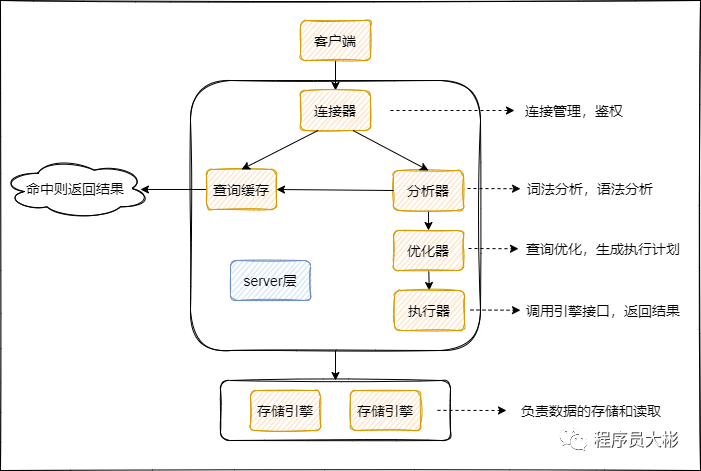

# MySQL

# 架构
MySQL主要分为 Server 层和存储引擎层：




- Server 层

主要包括连接器、查询缓存、分析器、优化器、执行器等，所有跨存储引擎的功能都在这一层实现，比如存储过程、触发器、视图，函数等，还有一个通用的日志模块 binglog 日志模块。


- 存储引擎

主要负责数据的存储和读取。server 层通过api与存储引擎进行通信。


## Server 层基本组件

### 连接器

 当客户端连接 MySQL 时，server层会对其进行身份认证和权限校验。


### 查询缓存 

执行查询语句的时候，会先查询缓存，先校验这个 sql 是否执行过，如果有缓存这个 sql，就会直接返回给客户端，如果没有命中，就会执行后续的操作。


### 分析器

没有命中缓存的话，SQL 语句就会经过分析器，主要分为两步，词法分析和语法分析，先看 SQL 语句要做什么，再检查 SQL 语句语法是否正确。


### 优化器

优化器对查询进行优化，包括重写查询、决定表的读写顺序以及选择合适的索引等，生成执行计划。


### 执行器 

首先执行前会校验该用户有没有权限，如果没有权限，就会返回错误信息，如果有权限，就会根据执行计划去调用引擎的接口，返回结果。


# 分区表
分区表是一个独立的逻辑表，但是底层由多个物理子表组成。

当查询条件的数据分布在某一个分区的时候，查询引擎只会去某一个分区查询，而不是遍历整个表。在管理层面，如果需要删除某一个分区的数据，只需要删除对应的分区即可。

## 按照范围分区。
```mysql
CREATE TABLE test_range_partition(
       id INT auto_increment,
       createdate DATETIME,
       primary key (id,createdate)
   ) 
   PARTITION BY RANGE (TO_DAYS(createdate) ) (
      PARTITION p201801 VALUES LESS THAN ( TO_DAYS('20180201') ),
      PARTITION p201802 VALUES LESS THAN ( TO_DAYS('20180301') ),
      PARTITION p201803 VALUES LESS THAN ( TO_DAYS('20180401') ),
      PARTITION p201804 VALUES LESS THAN ( TO_DAYS('20180501') ),
      PARTITION p201805 VALUES LESS THAN ( TO_DAYS('20180601') ),
      PARTITION p201806 VALUES LESS THAN ( TO_DAYS('20180701') ),
      PARTITION p201807 VALUES LESS THAN ( TO_DAYS('20180801') ),
      PARTITION p201808 VALUES LESS THAN ( TO_DAYS('20180901') ),
      PARTITION p201809 VALUES LESS THAN ( TO_DAYS('20181001') ),
      PARTITION p201810 VALUES LESS THAN ( TO_DAYS('20181101') ),
      PARTITION p201811 VALUES LESS THAN ( TO_DAYS('20181201') ),
      PARTITION p201812 VALUES LESS THAN ( TO_DAYS('20190101') )
   )
```


在/var/lib/mysql/data/可以找到对应的数据文件，每个分区表都有一个使用#分隔命名的表文件：

```
  -rw-r----- 1 MySQL MySQL    65 Mar 14 21:47 db.opt
  -rw-r----- 1 MySQL MySQL  8598 Mar 14 21:50 test_range_partition.frm
  -rw-r----- 1 MySQL MySQL 98304 Mar 14 21:50 test_range_partition#P#p201801.ibd
  -rw-r----- 1 MySQL MySQL 98304 Mar 14 21:50 test_range_partition#P#p201802.ibd
  -rw-r----- 1 MySQL MySQL 98304 Mar 14 21:50 test_range_partition#P#p201803.ibd
```


## list分区

对于`List`分区，分区字段必须是已知的，如果插入的字段不在分区时枚举值中，将无法插入。

```mysql
create table test_list_partiotion
   (
       id int auto_increment,
       data_type tinyint,
       primary key(id,data_type)
   )partition by list(data_type)
   (
       partition p0 values in (0,1,2,3,4,5,6),
       partition p1 values in (7,8,9,10,11,12),
       partition p2 values in (13,14,15,16,17)
   );
```


## hash分区

可以将数据均匀地分布到预先定义的分区中。

```mysql
create table test_hash_partiotion
   (
       id int auto_increment,
       create_date datetime,
       primary key(id,create_date)
   )partition by hash(year(create_date)) partitions 10;
```


# 变量查询
## datadir
查询存储数据地址。

```mysql
show global variables like "datadir";
```


# 主从同步

## 什么是MySQL主从同步？

主从同步使得数据可以从一个数据库服务器复制到其他服务器上，在复制数据时，一个服务器充当主服务器（`master`），其余的服务器充当从服务器（`slave`）。

因为复制是异步进行的，所以从服务器不需要一直连接着主服务器，从服务器甚至可以通过拨号断断续续地连接主服务器。通过配置文件，可以指定复制所有的数据库，某个数据库，甚至是某个数据库上的某个表。


## 为什么要做主从同步？

1. 读写分离，使数据库能支撑更大的并发。
2. 在主服务器上生成实时数据，而在从服务器上分析这些数据，从而提高主服务器的性能。
3. 数据备份，保证数据的安全。
4. 更新完成。


# processlist

`show processlist` 或 `show full processlist` 可以查看当前 MySQL 是否有压力，正在运行的`SQL`，有没有慢`SQL`正在执行。返回参数如下：

1. **id**：线程ID，可以用`kill id`杀死某个线程

2. **db**：数据库名称

3. **user**：数据库用户

4. **host**：数据库实例的IP

5. **command**：当前执行的命令，比如`Sleep`，`Query`，`Connect`等

6. **time**：消耗时间，单位秒

7. **state**：执行状态，主要有以下状态：

8. - `Sleep`，线程正在等待客户端发送新的请求
	- `Locked`，线程正在等待锁
	- `Sending data`，正在处理`SELECT`查询的记录，同时把结果发送给客户端
	- `Kill`，正在执行`kill`语句，杀死指定线程
	- `Connect`，一个从节点连上了主节点
	- `Quit`，线程正在退出
	- `Sorting for group`，正在为`GROUP BY`做排序
	- `Sorting for order`，正在为`ORDER BY`做排序

9. **info**：正在执行的`SQL`语句


# 参考资料
- [MySQL 5.7版本版本版本版本官方文档](https://dev.mysql.com/doc/refman/5.7/en/【【【)
- [MySQL 8.0版本版本版本版本官方文档](https://dev.mysql.com/doc/refman/8.0/en/)
