# 简介

Redis 是C语言开发的一个开源高性能键值对的*内存数据库*，可以用来做数据库、缓存、消息中间件等场景，是一种NoSQL(not-only sql,非关系型数据库)的数据库。

**Redis 除了做缓存之外，Redis 也经常用来做分布式锁，甚至是消息队列。Redis 提供了多种数据类型来支持不同的业务场景。Redis 还支持事务 、持久化、Lua 脚本、多种集群方案。**

**具备如下特点：**

- 单线程但进程，是线程安全的，采用IO多路复用制
- 可作为分布式锁
- 支持多种数据类型
- 支持数据持久化到磁盘
- 可以作为消息中间件使用，支持消息发布及订阅


### 一般使用流程

#### 查询

1. 如果用户请求的数据在缓存中就直接返回。
2. 缓存中不存在的话就看数据库中是否存在。
3. 数据库中存在的话就更新缓存中的数据。
4. 数据库中不存在的话就返回空数据。


#### 更新

参考保证数据一致性。


## 线程模型

### 单线程模型

> Redis6.0 后引入多线程


**Redis 基于 Reactor 模式来设计开发了自己的一套高效的事件处理模型**，通过**IO 多路复用程序** 来监听来自客户端的大量连接。**I/O 多路复用技术的使用让 Redis 不需要额外创建多余的线程来监听客户端的大量连接，降低了资源的消耗。**


Redis 服务器是一个事件驱动程序，服务器需要处理两类事件： 1. 文件事件; 2. 时间事件。


#### 文件事件

文件事件处理器（file event handler）主要是包含 4 个部分：

- 多个 socket（客户端连接）
- IO 多路复用程序（支持多个客户端连接的关键）
- 文件事件分派器（将 socket 关联到相应的事件处理器）
- 事件处理器（连接应答处理器、命令请求处理器、命令回复处理器）


#### 总结

##### **Redis6.0 之前 为什么不使用多线程？**

1. 单线程编程容易并且更容易维护；
2. Redis 的性能瓶颈不再 CPU ，主要在内存和网络；
3. 多线程就会存在死锁、线程上下文切换等问题，甚至会影响性能。


### 多线程模型

**Redis6.0 引入多线程主要是为了提高网络 IO 读写性能**，因为这个算是 Redis 中的一个性能瓶颈。

虽然Redis6.0 引入了多线程，但是 Redis 的多线程只是在网络数据的读写这类耗时操作上使用了， 执行命令仍然是单线程顺序执行。因此不需要担心线程安全问题。


#### 使用方式

Redis6.0 的多线程默认是禁用的，只使用主线程。如需开启需要修改 redis 配置文件 `redis.conf`:

```
io-threads-do-reads yes
```


开启多线程后，还需要设置线程数，否则是不生效的。同样需要修改 redis 配置文件 `redis.conf` :

```bash
#官网建议4核的机器建议设置为2或3个线程，8核的建议设置为6个线程
io-threads 4 
```


## 扩展

##### Memcached对比

**共同点** ：

1. 都是基于内存的数据库，一般都用来当做缓存使用。
2. 都有过期策略。
3. 两者的性能都非常高。


**区别** ：

1. **Redis 支持更丰富的数据类型（支持更复杂的应用场景）**。Redis 不仅仅支持简单的 k/v 类型的数据，同时还提供 list，set，zset，hash 等数据结构的存储。Memcached 只支持最简单的 k/v 数据类型。
2. **Redis 支持数据的持久化，可以将内存中的数据保持在磁盘中，重启的时候可以再次加载进行使用,而 Memecache 把数据全部存在内存之中。**
3. **Redis 有灾难恢复机制。** 因为可以把缓存中的数据持久化到磁盘上。
4. **Redis 在服务器内存使用完之后，可以将不用的数据放到磁盘上。但是，Memcached 在服务器内存使用完之后，就会直接报异常。**
5. **Memcached 没有原生的集群模式，需要依靠客户端来实现往集群中分片写入数据；但是 Redis 目前是原生支持 cluster 模式的.**
6. **Memcached 是多线程，非阻塞 IO 复用的网络模型；Redis 使用单线程的多路 IO 复用模型。** （Redis 6.0 引入了多线程 IO ）
7. **Redis 支持发布订阅模型、Lua 脚本、事务等功能，而 Memcached 不支持。并且，Redis 支持更多的编程语言。**
8. **Memcached过期数据的删除策略只用了惰性删除，而 Redis 同时使用了惰性删除与定期删除。**


##### 为什么要用缓存

一般像 MySQL 这类的数据库的 QPS 大概都在 1w 左右（4 核 8g） ，但是使用 Redis 缓存之后很容易达到 10w+，甚至最高能达到 30w+（就单机 redis 的情况，redis 集群的话会更高）。

直接操作缓存能够承受的数据库请求数量是远远大于直接访问数据库的，把数据库中的部分数据转移到缓存中去，这样用户的一部分请求会直接到缓存这里而不用经过数据库，进而提高的系统整体的并发。


# 数据类型

## String

String 数据结构是简单的 key-value 类型，key 是唯一标识，value 是具体的值，value其实不仅是字符串， 也可以是数字（整数或浮点数），value 最多可以容纳的数据长度是 `512M`。


### 内部实现

String 类型的底层的数据结构实现主要是 int 和 SDS（简单动态字符串）。SDS 相比于 C 的原生字符串：

- **SDS 不仅可以保存文本数据，还可以保存二进制数据**。因为 `SDS` 使用 `len` 属性的值而不是空字符来判断字符串是否结束，并且 SDS 的所有 API 都会以处理二进制的方式来处理 SDS 存放在 `buf[]` 数组里的数据。所以 SDS 不光能存放文本数据，而且能保存图片、音频、视频、压缩文件这样的二进制数据。
- **SDS 获取字符串长度的时间复杂度是 O(1)**。因为 C 语言的字符串并不记录自身长度，所以获取长度的复杂度为 O(n)；而 SDS 结构里用 `len` 属性记录了字符串长度，所以复杂度为 `O(1)`。
- **Redis 的 SDS API 是安全的，拼接字符串不会造成缓冲区溢出**。因为 SDS 在拼接字符串之前会检查 SDS 空间是否满足要求，如果空间不够会自动扩容，所以不会导致缓冲区溢出的问题。

字符串对象的内部编码（encoding）有 3 种 ：**int、raw和 embstr**。


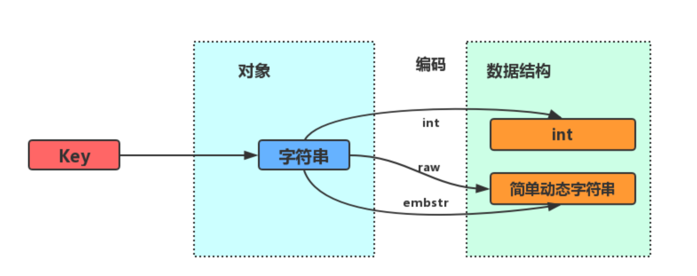


#### int

如果一个字符串对象保存的是整数值，并且这个整数值可以用`long`类型来表示，那么字符串对象会将整数值保存在字符串对象结构的`ptr`属性里面（将`void*`转换成 long），并将字符串对象的编码设置为`int`。

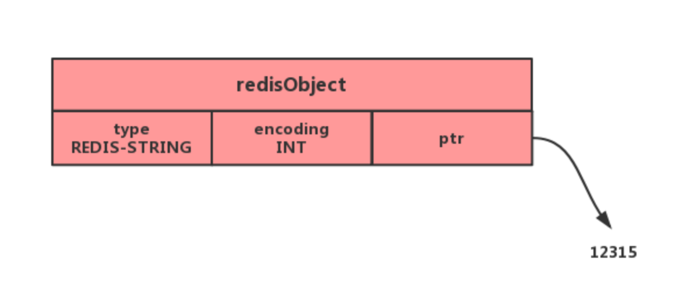

#### raw和embstr

如果字符串对象保存的是一个字符串，并且这个字符申的长度小于等于 32 字节（redis 2.+版本），那么字符串对象将使用一个简单动态字符串（SDS）来保存这个字符串，并将对象的编码设置为`embstr`， `embstr`编码是专门用于保存短字符串的一种优化编码方式：

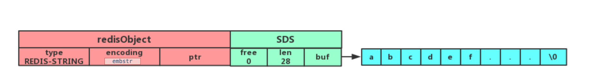

如果字符串对象保存的是一个字符串，并且这个字符串的长度大于 32 字节（redis 2.+版本），那么字符串对象将使用一个简单动态字符串（SDS）来保存这个字符串，并将对象的编码设置为`raw`：

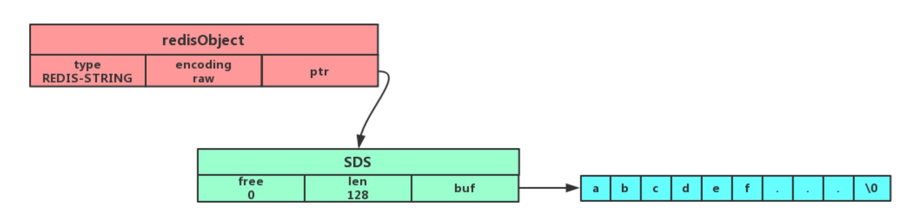

注意，embstr 编码和 raw 编码的边界在 redis 不同版本中是不一样的：

- redis 2.+ 是 32 字节
- redis 3.0-4.0 是 39 字节
- redis 5.0 是 44 字节

可以看到`embstr`和`raw`编码都会使用`SDS`来保存值，但不同之处在于`embstr`会通过一次内存分配函数来分配一块连续的内存空间来保存`redisObject`和`SDS`，而`raw`编码会通过调用两次内存分配函数来分别分配两块空间来保存`redisObject`和`SDS`。Redis这样做会有很多好处：

- `embstr`编码将创建字符串对象所需的内存分配次数从 `raw` 编码的两次降低为一次；
- 释放 `embstr`编码的字符串对象同样只需要调用一次内存释放函数；
- 因为`embstr`编码的字符串对象的所有数据都保存在一块连续的内存里面可以更好的利用 CPU 缓存提升性能。

但是 embstr 也有缺点的：

- 如果字符串的长度增加需要重新分配内存时，整个redisObject和sds都需要重新分配空间，所以**embstr编码的字符串对象实际上是只读的**，redis没有为embstr编码的字符串对象编写任何相应的修改程序。当我们对embstr编码的字符串对象执行任何修改命令（例如append）时，程序会先将对象的编码从embstr转换成raw，然后再执行修改命令。


### 命令语法

#### 普通字符串

普通字符串的基本操作。

```bash
# 设置 key-value 类型的值
> SET name lin
OK
# 根据 key 获得对应的 value
> GET name
"lin"
# 判断某个 key 是否存在
> EXISTS name
(integer) 1
# 返回 key 所储存的字符串值的长度
> STRLEN name
(integer) 3
# 删除某个 key 对应的值
> DEL name
(integer) 1
```


#### 批量操作

```shell
# 批量设置 key-value 类型的值
> MSET key1 value1 key2 value2 
OK
# 批量获取多个 key 对应的 value
> MGET key1 key2 
1) "value1"
2) "value2"
```


#### 计数器

字符串的内容为整数的时候可以使用。

```shell
# 设置 key-value 类型的值
> SET number 0
OK
# 将 key 中储存的数字值增一
> INCR number
(integer) 1
# 将key中存储的数字值加 10
> INCRBY number 10
(integer) 11
# 将 key 中储存的数字值减一
> DECR number
(integer) 10
# 将key中存储的数字值键 10
> DECRBY number 10
(integer) 0
```


#### 过期

```shell
# 设置 key 在 60 秒后过期（该方法是针对已经存在的key设置过期时间）
> EXPIRE name  60 
(integer) 1
# 查看数据还有多久过期
> TTL name 
(integer) 51

#设置 key-value 类型的值，并设置该key的过期时间为 60 秒
> SET key  value EX 60
OK
> SETEX key  60 value
OK
```


#### 其它

```shell
# 不存在就插入（not exists）
>SETNX key value
(integer) 1
```


### 应用场景

#### 缓存对象

使用 String 来缓存对象有两种方式：

- 直接缓存整个对象的 JSON，命令例子： `SET user:1 '{"name":"xiaolin", "age":18}'`。
- 采用将 key 进行分离为 user:ID:属性，采用 MSET 存储，用 MGET 获取各属性值，命令例子： `MSET user:1:name xiaolin user:1:age 18 user:2:name xiaomei user:2:age 20`。


#### 常规计数

因为 Redis 处理命令是单线程，所以执行命令的过程是原子的。因此 String 数据类型适合计数场景，比如计算访问次数、点赞、转发、库存数量等等。


#### 分布式锁

SET 命令有个 NX 参数可以实现「key不存在才插入」，可以用它来实现分布式锁：

- 如果 key 不存在，则显示插入成功，可以用来表示加锁成功；
- 如果 key 存在，则会显示插入失败，可以用来表示加锁失败。

一般而言，还会对分布式锁加上过期时间，分布式锁的命令如下：

```shell
SET lock_key unique_value NX PX 10000
```

- lock_key 就是 key 键；
- unique_value 是客户端生成的唯一的标识；
- NX 代表只在 lock_key 不存在时，才对 lock_key 进行设置操作；
- PX 10000 表示设置 lock_key 的过期时间为 10s，这是为了避免客户端发生异常而无法释放锁。

而解锁的过程就是将 lock_key 键删除，但不能乱删，要保证执行操作的客户端就是加锁的客户端。所以，解锁的时候，我们要先判断锁的 unique_value 是否为加锁客户端，是的话，才将 lock_key 键删除。

可以看到，解锁是有两个操作，这时就需要 Lua 脚本来保证解锁的原子性，因为 Redis 在执行 Lua 脚本时，可以以原子性的方式执行，保证了锁释放操作的原子性。

```lua
// 释放锁时，先比较 unique_value 是否相等，避免锁的误释放
if redis.call("get",KEYS[1]) == ARGV[1] then
    return redis.call("del",KEYS[1])
else
    return 0
end
```

这样一来，就通过使用 SET 命令和 Lua 脚本在 Redis 单节点上完成了分布式锁的加锁和解锁。


#### 共享 Session 信息

通常在开发后台管理系统时，会使用 Session 来保存用户的会话(登录)状态，这些 Session 信息会被保存在服务器端，但这只适用于单系统应用，如果是分布式系统此模式将不再适用。

例如用户一的 Session 信息被存储在服务器一，但第二次访问时用户一被分配到服务器二，这个时候服务器并没有用户一的 Session 信息，就会出现需要重复登录的问题，问题在于分布式系统每次会把请求随机分配到不同的服务器。

因此需要借助 Redis 对这些 Session 信息进行统一的存储和管理，这样无论请求发送到那台服务器，服务器都会去同一个 Redis 获取相关的 Session 信息，这样就解决了分布式系统下 Session 存储的问题。


### 源码解析

```c
typedef struct redisObject {
    unsigned type:4;       // 数据类型  integer  string  list  set
    unsigned encoding:4;
    unsigned lru:LRU_BITS; /* LRU time (relative to global lru_clock) or
                            * LFU data (least significant 8 bits frequency
                            * and most significant 16 bits access time). 
                            * redis用24个位来保存LRU和LFU的信息，当使用LRU时保存上次
                            * 读写的时间戳(秒),使用LFU时保存上次时间戳(16位 min级) 保存近似统计数8位 */
    int refcount;           // 引用计数 
    void *ptr;              // 指针指向具体存储的值，类型用type区分
} robj;
```


## List

**list** 即是 **链表**。链表是一种非常常见的数据结构，特点是易于数据元素的插入和删除并且且可以灵活调整链表长度，但是链表的随机访问困难。许多高级编程语言都内置了链表的实现比如 Java 中的 **LinkedList**，但是 C 语言并没有实现链表，所以 Redis 实现了自己的链表数据结构。Redis 的 list 的实现为一个 **双向链表**，即可以支持反向查找和遍历，更方便操作，不过带来了部分额外的内存开销。


### 内部实现

#### 双向链表

如果列表的元素个数小于 `512` 个（默认值，可由 `list-max-ziplist-entries` 配置），列表每个元素的值都小于 `64` 字节（默认值，可由 `list-max-ziplist-value` 配置），Redis 会使用**压缩列表**作为 List 类型的底层数据结构。


#### 压缩列表

如果列表的元素不满足上面的条件，Redis 会使用**双向链表**作为 List 类型的底层数据结构。


#### quicklist

**Redis 3.2 版本之后，List 数据类型底层数据结构就只由 quicklist 实现了，替代了双向链表和压缩列表**。


### 命令语法

```shell
# 将一个或多个值value插入到key列表的表头(最左边)，最后的值在最前面
LPUSH key value [value ...] 
# 将一个或多个值value插入到key列表的表尾(最右边)
RPUSH key value [value ...]
# 移除并返回key列表的头元素
LPOP key     
# 移除并返回key列表的尾元素
RPOP key 

# 返回列表key中指定区间内的元素，区间以偏移量start和stop指定，从0开始
LRANGE key start stop

# 从key列表表头弹出一个元素，没有就阻塞timeout秒，如果timeout=0则一直阻塞
BLPOP key [key ...] timeout
# 从key列表表尾弹出一个元素，没有就阻塞timeout秒，如果timeout=0则一直阻塞
BRPOP key [key ...] timeout
```


### 应用场景

#### 消息队列

消息队列在存取消息时，必须要满足三个需求，分别是**消息保序、处理重复的消息和保证消息可靠性**。

Redis 的 List 和 Stream 两种数据类型，就可以满足消息队列的这三个需求。我们先来了解下基于 List 的消息队列实现方法，后面在介绍 Stream 数据类型时候，在详细说说 Stream。

***1、如何满足消息保序需求？***

List 本身就是按先进先出的顺序对数据进行存取的，所以，如果使用 List 作为消息队列保存消息的话，就已经能满足消息保序的需求了。

List 可以使用 LPUSH + RPOP （或者反过来，RPUSH+LPOP）命令实现消息队列。

- 生产者使用 `LPUSH key value[value...]` 将消息插入到队列的头部，如果 key 不存在则会创建一个空的队列再插入消息。
- 消费者使用 `RPOP key` 依次读取队列的消息，先进先出。

不过，在消费者读取数据时，有一个潜在的性能风险点。

在生产者往 List 中写入数据时，List 并不会主动地通知消费者有新消息写入，如果消费者想要及时处理消息，就需要在程序中不停地调用 `RPOP` 命令（比如使用一个while(1)循环）。如果有新消息写入，RPOP命令就会返回结果，否则，RPOP命令返回空值，再继续循环。

所以，即使没有新消息写入List，消费者也要不停地调用 RPOP 命令，这就会导致消费者程序的 CPU 一直消耗在执行 RPOP 命令上，带来不必要的性能损失。

为了解决这个问题，Redis提供了 BRPOP 命令。**BRPOP命令也称为阻塞式读取，客户端在没有读到队列数据时，自动阻塞，直到有新的数据写入队列，再开始读取新数据**。和消费者程序自己不停地调用RPOP命令相比，这种方式能节省CPU开销。


***2、如何处理重复的消息？***

消费者要实现重复消息的判断，需要 2 个方面的要求：

- 每个消息都有一个全局的 ID。
- 消费者要记录已经处理过的消息的 ID。当收到一条消息后，消费者程序就可以对比收到的消息 ID 和记录的已处理过的消息 ID，来判断当前收到的消息有没有经过处理。如果已经处理过，那么，消费者程序就不再进行处理了。

但是 **List 并不会为每个消息生成 ID 号，所以我们需要自行为每个消息生成一个全局唯一ID**，生成之后，我们在用 LPUSH 命令把消息插入 List 时，需要在消息中包含这个全局唯一 ID。

例如，我们执行以下命令，就把一条全局 ID 为 111000102、库存量为 99 的消息插入了消息队列：

```shell
> LPUSH mq "111000102:stock:99"
(integer) 1
```


***3、如何保证消息可靠性？***

当消费者程序从 List 中读取一条消息后，List 就不会再留存这条消息了。所以，如果消费者程序在处理消息的过程出现了故障或宕机，就会导致消息没有处理完成，那么，消费者程序再次启动后，就没法再次从 List 中读取消息了。

为了留存消息，List 类型提供了 `BRPOPLPUSH` 命令，这个命令的**作用是让消费者程序从一个 List 中读取消息，同时，Redis 会把这个消息再插入到另一个 List（可以叫作备份 List）留存**。

这样一来，如果消费者程序读了消息但没能正常处理，等它重启后，就可以从备份 List 中重新读取消息并进行处理了。

好了，到这里可以知道基于 List 类型的消息队列，满足消息队列的三大需求（消息保序、处理重复的消息和保证消息可靠性）。

- 消息保序：使用 LPUSH + RPOP；
- 阻塞读取：使用 BRPOP；
- 重复消息处理：生产者自行实现全局唯一 ID；
- 消息的可靠性：使用 BRPOPLPUSH


**List 作为消息队列有什么缺陷？**

**List 不支持多个消费者消费同一条消息**，因为一旦消费者拉取一条消息后，这条消息就从 List 中删除了，无法被其它消费者再次消费。

要实现一条消息可以被多个消费者消费，那么就要将多个消费者组成一个消费组，使得多个消费者可以消费同一条消息，但是 **List 类型并不支持消费组的实现**。

这就要说起 Redis 从 5.0 版本开始提供的 Stream 数据类型了，Stream 同样能够满足消息队列的三大需求，而且它还支持「消费组」形式的消息读取。


## Hash

hash 类似于 JDK1.8 前的 HashMap，内部实现也差不多(数组 + 链表)。不过，Redis 的 hash 做了更多优化。另外，hash 是一个 string 类型的 field 和 value 的映射表，**特别适合用于存储对象**，后续操作的时候，你可以直接仅仅修改这个对象中的某个字段的值。 比如我们可以 hash 数据结构来存储用户信息，商品信息等等。


### 内部实现

#### 压缩列表

如果哈希类型元素个数小于 `512` 个（默认值，可由 `hash-max-ziplist-entries` 配置），所有值小于 `64` 字节（默认值，可由 `hash-max-ziplist-value` 配置）的话，Redis 会使用**压缩列表**作为 Hash 类型的底层数据结构。


#### 哈希表

如果哈希类型元素不满足上面条件，Redis 会使用**哈希表**作为 Hash 类型的 底层数据结构。


#### listpack

**在 Redis 7.0 中，压缩列表数据结构已经废弃了，交由 listpack 数据结构来实现了**。


### 命令语法

```shell
# 存储一个哈希表key的键值
HSET key field value   
# 获取哈希表key对应的field键值
HGET key field

# 在一个哈希表key中存储多个键值对
HMSET key field value [field value...] 
# 批量获取哈希表key中多个field键值
HMGET key field [field ...]       
# 删除哈希表key中的field键值
HDEL key field [field ...]    

# 返回哈希表key中field的数量
HLEN key       
# 返回哈希表key中所有的键值
HGETALL key 

# 为哈希表key中field键的值加上增量n
HINCRBY key field n   
```


### 应用场景

#### 缓存对象


#### 购物车


## Set

set 类似于 Java 中的 `HashSet` 。Redis 中的 set 类型是一种无序集合，集合中的元素没有先后顺序。当你需要存储一个列表数据，又不希望出现重复数据时，set 是一个很好的选择，并且 set 提供了判断某个成员是否在一个 set 集合内的重要接口，这个也是 list 所不能提供的。可以基于 set 轻易实现交集、并集、差集的操作。比如：你可以将一个用户所有的关注人存在一个集合中，将其所有粉丝存在一个集合。Redis 可以非常方便的实现如共同关注、共同粉丝、共同喜好等功能。这个过程也就是求交集的过程。


### 内部实现

#### 整数集合

如果集合中的元素都是整数且元素个数小于 `512` （默认值，`set-maxintset-entries`配置）个，Redis 会使用**整数集合**作为 Set 类型的底层数据结构。


#### 哈希表

如果集合中的元素不满足上面条件，则 Redis 使用**哈希表**作为 Set 类型的底层数据结构。


### 命令语法

#### 基本操作

```shell
# 往集合key中存入元素，元素存在则忽略，若key不存在则新建
SADD key member [member ...]
# 从集合key中删除元素
SREM key member [member ...] 
# 获取集合key中所有元素
SMEMBERS key
# 获取集合key中的元素个数
SCARD key

# 判断member元素是否存在于集合key中
SISMEMBER key member

# 从集合key中随机选出count个元素，元素不从key中删除
SRANDMEMBER key [count]
# 从集合key中随机选出count个元素，元素从key中删除
SPOP key [count]
```


#### 运算操作

```shell
# 往集合key中存入元素，元素存在则忽略，若key不存在则新建
SADD key member [member ...]
# 从集合key中删除元素
SREM key member [member ...] 
# 获取集合key中所有元素
SMEMBERS key
# 获取集合key中的元素个数
SCARD key

# 判断member元素是否存在于集合key中
SISMEMBER key member

# 从集合key中随机选出count个元素，元素不从key中删除
SRANDMEMBER key [count]
# 从集合key中随机选出count个元素，元素从key中删除
SPOP key [count]
```


### 应用场景

集合的主要几个特性，无序、不可重复、支持并交差等操作。

因此 Set 类型比较适合用来数据去重和保障数据的唯一性，还可以用来统计多个集合的交集、错集和并集等，当我们存储的数据是无序并且需要去重的情况下，比较适合使用集合类型进行存储。

但是要提醒你一下，这里有一个潜在的风险。**Set 的差集、并集和交集的计算复杂度较高，在数据量较大的情况下，如果直接执行这些计算，会导致 Redis 实例阻塞**。

在主从集群中，为了避免主库因为 Set 做聚合计算（交集、差集、并集）时导致主库被阻塞，我们可以选择一个从库完成聚合统计，或者把数据返回给客户端，由客户端来完成聚合统计。


####  点赞

Set 类型可以保证一个用户只能点一个赞，这里举例子一个场景，key 是文章id，value 是用户id。


#### 共同关注

Set 类型支持交集运算，所以可以用来计算共同关注的好友、公众号等。


#### 抽奖活动

存储某活动中中奖的用户名 ，Set 类型因为有去重功能，可以保证同一个用户不会中奖两次。


## ZSet

和 set 相比，sorted set 增加了一个权重参数 score，使得集合中的元素能够按 score 进行有序排列，还可以通过 score 的范围来获取元素的列表。有点像是 Java 中 HashMap 和 TreeSet 的结合体。


### 内部实现

#### 压缩列表

如果有序集合的元素个数小于 `128` 个，并且每个元素的值小于 `64` 字节时，Redis 会使用**压缩列表**作为 Zset 类型的底层数据结构；


#### 跳表

如果有序集合的元素不满足上面的条件，Redis 会使用**跳表**作为 Zset 类型的底层数据结构；


#### listpack

**在 Redis 7.0 中，压缩列表数据结构已经废弃了，交由 listpack 数据结构来实现了**


### 命令语法

#### 基本操作

```shell
# 往有序集合key中加入带分值元素
ZADD key score member [[score member]...]   
# 往有序集合key中删除元素
ZREM key member [member...]                 
# 返回有序集合key中元素member的分值
ZSCORE key member
# 返回有序集合key中元素个数
ZCARD key 

# 为有序集合key中元素member的分值加上increment
ZINCRBY key increment member 

# 正序获取有序集合key从start下标到stop下标的元素
ZRANGE key start stop [WITHSCORES]
# 倒序获取有序集合key从start下标到stop下标的元素
ZREVRANGE key start stop [WITHSCORES]

# 返回有序集合中指定分数区间内的成员，分数由低到高排序。
ZRANGEBYSCORE key min max [WITHSCORES] [LIMIT offset count]

# 返回指定成员区间内的成员，按字典正序排列, 分数必须相同。
ZRANGEBYLEX key min max [LIMIT offset count]
# 返回指定成员区间内的成员，按字典倒序排列, 分数必须相同
ZREVRANGEBYLEX key max min [LIMIT offset count]
```


#### 运算操作

```shell
# 并集计算(相同元素分值相加)，numberkeys一共多少个key，WEIGHTS每个key对应的分值乘积
ZUNIONSTORE destkey numberkeys key [key...] 
# 交集计算(相同元素分值相加)，numberkeys一共多少个key，WEIGHTS每个key对应的分值乘积
ZINTERSTORE destkey numberkeys key [key...]
```


### 应用场景

需要对数据根据某个权重进行排序的场景。比如在直播系统中，实时排行信息包含直播间在线用户列表，各种礼物排行榜，弹幕消息（可以理解为按消息维度的消息排行榜）等信息。

Zset 类型（Sorted Set，有序集合） 可以根据元素的权重来排序，我们可以自己来决定每个元素的权重值。比如说，我们可以根据元素插入 Sorted Set 的时间确定权重值，先插入的元素权重小，后插入的元素权重大。

在面对需要展示最新列表、排行榜等场景时，如果数据更新频繁或者需要分页显示，可以优先考虑使用 Sorted Set。


#### 排行榜

有序集合比较典型的使用场景就是排行榜。例如学生成绩的排名榜、游戏积分排行榜、视频播放排名、电商系统中商品的销量排名等。


#### 电话排序

使用有序集合的 `ZRANGEBYLEX` 或 `ZREVRANGEBYLEX` 可以帮助我们实现电话号码或姓名的排序，我们以 `ZRANGEBYLEX` （返回指定成员区间内的成员，按 key 正序排列，分数必须相同）为例。

**注意：不要在分数不一致的 SortSet 集合中去使用 ZRANGEBYLEX和 ZREVRANGEBYLEX 指令，因为获取的结果会不准确。**

可以将电话号码存储到 SortSet 中，然后根据需要来获取号段。


#### 姓名排序


## BitMap

Bitmap，即位图，是一串连续的二进制数组（0和1），可以通过偏移量（offset）定位元素。BitMap通过最小的单位bit来进行`0|1`的设置，表示某个元素的值或者状态，时间复杂度为O(1)。

由于 bit 是计算机中最小的单位，使用它进行储存将非常节省空间，特别适合一些数据量大且使用**二值统计的场景**。


### 内部实现

Bitmap 本身是用 String 类型作为底层数据结构实现的一种统计二值状态的数据类型。

String 类型是会保存为二进制的字节数组，所以，Redis 就把字节数组的每个 bit 位利用起来，用来表示一个元素的二值状态，你可以把 Bitmap 看作是一个 bit 数组。


### 命令语法

#### 基本操作

```shell
# 设置值，其中value只能是 0 和 1
SETBIT key offset value

# 获取值
GETBIT key offset

# 获取指定范围内值为 1 的个数，start 和 end 以字节为单位
BITCOUNT key start end
```


#### 运算操作

```shell
# BitMap间的运算
# operations 位移操作符，枚举值
#     AND 与运算 &
#     OR 或运算 |
#     XOR 异或 ^
#     NOT 取反 ~
# result 计算的结果，会存储在该key中
# key1 … keyn 参与运算的key，可以有多个，空格分割，not运算只能一个key
# 当 BITOP 处理不同长度的字符串时，较短的那个字符串所缺少的部分会被看作 0。返回值是保存到 destkey 的字符串的长度（以字节byte为单位），和输入 key 中最长的字符串长度相等。
BITOP [operations] [result] [key1] [keyn…]

# 返回指定key中第一次出现指定value(0/1)的位置
BITPOS [key] [value]
```


### 应用场景

Bitmap 类型非常适合二值状态统计的场景，这里的二值状态就是指集合元素的取值就只有 0 和 1 两种，在记录海量数据时，Bitmap 能够有效地节省内存空间。


#### 签到统计

在签到打卡的场景中，我们只用记录签到（1）或未签到（0），所以它就是非常典型的二值状态。

签到统计时，每个用户一天的签到用 1 个 bit 位就能表示，一个月（假设是 31 天）的签到情况用 31 个 bit 位就可以，而一年的签到也只需要用 365 个 bit 位，根本不用太复杂的集合类型。


#### 判断用户登陆态

Bitmap 提供了 `GETBIT、SETBIT` 操作，通过一个偏移值 offset 对 bit 数组的 offset 位置的 bit 位进行读写操作，需要注意的是 offset 从 0 开始。

只需要一个 key = login_status 表示存储用户登陆状态集合数据， 将用户 ID 作为 offset，在线就设置为 1，下线设置 0。通过 `GETBIT`判断对应的用户是否在线。 50000 万 用户只需要 6 MB 的空间。


#### 连续签到用户总数

如何统计出这连续 7 天连续打卡用户总数呢？

我们把每天的日期作为 Bitmap 的 key，userId 作为 offset，若是打卡则将 offset 位置的 bit 设置成 1。

key 对应的集合的每个 bit 位的数据则是一个用户在该日期的打卡记录。

一共有 7 个这样的 Bitmap，如果我们能对这 7 个 Bitmap 的对应的 bit 位做 『与』运算。同样的 UserID offset 都是一样的，当一个 userID 在 7 个 Bitmap 对应对应的 offset 位置的 bit = 1 就说明该用户 7 天连续打卡。

结果保存到一个新 Bitmap 中，我们再通过 `BITCOUNT` 统计 bit = 1 的个数便得到了连续打卡 3 天的用户总数了。


#### 布隆过滤器


## HyperLogLog

Redis HyperLogLog 是 Redis 2.8.9 版本新增的数据类型，是一种用于「统计基数」的数据集合类型，基数统计就是指统计一个集合中不重复的元素个数。但要注意，HyperLogLog 是统计规则是基于概率完成的，不是非常准确，标准误算率是 0.81%。

所以，简单来说 HyperLogLog **提供不精确的去重计数**。

HyperLogLog 的优点是，在输入元素的数量或者体积非常非常大时，计算基数所需的内存空间总是固定的、并且是很小的。

在 Redis 里面，**每个 HyperLogLog 键只需要花费 12 KB 内存，就可以计算接近 `2^64` 个不同元素的基数**，和元素越多就越耗费内存的 Set 和 Hash 类型相比，HyperLogLog 就非常节省空间。

用 Java 语言来说，一般 long 类型占用 8 字节，而 1 字节有 8 位，即：1 byte = 8 bit，即 long 数据类型最大可以表示的数是：`2^63-1`。对应上面的`2^64`个数，假设此时有`2^63-1`这么多个数，从 `0 ~ 2^63-1`，按照`long`以及`1k = 1024 字节`的规则来计算内存总数，就是：`((2^63-1) * 8/1024)K`，这是很庞大的一个数，存储空间远远超过`12K`，而 `HyperLogLog` 却可以用 `12K` 就能统计完。


### 内部实现

// TODO

### 命令语法

```shell
# 添加指定元素到 HyperLogLog 中
PFADD key element [element ...]

# 返回给定 HyperLogLog 的基数估算值。
PFCOUNT key [key ...]

# 将多个 HyperLogLog 合并为一个 HyperLogLog
PFMERGE destkey sourcekey [sourcekey ...]
```


### 应用场景

#### 百万级网页 UV 计数

Redis HyperLogLog 优势在于只需要花费 12 KB 内存，就可以计算接近 2^64 个元素的基数，和元素越多就越耗费内存的 Set 和 Hash 类型相比，HyperLogLog 就非常节省空间。

所以，非常适合统计百万级以上的网页 UV 的场景。

在统计 UV 时，你可以用 PFADD 命令（用于向 HyperLogLog 中添加新元素）把访问页面的每个用户都添加到 HyperLogLog 中。

接下来，就可以用 PFCOUNT 命令直接获得 page1 的 UV 值了，这个命令的作用就是返回 HyperLogLog 的统计结果。


## GEO

Redis GEO 是 Redis 3.2 版本新增的数据类型，主要用于存储地理位置信息，并对存储的信息进行操作。

在日常生活中，我们越来越依赖搜索“附近的餐馆”、在打车软件上叫车，这些都离不开基于位置信息服务（Location-Based Service，LBS）的应用。LBS 应用访问的数据是和人或物关联的一组经纬度信息，而且要能查询相邻的经纬度范围，GEO 就非常适合应用在 LBS 服务的场景中。


### 内部实现

GEO 本身并没有设计新的底层数据结构，而是直接使用了 Sorted Set 集合类型。

GEO 类型使用 GeoHash 编码方法实现了经纬度到 Sorted Set 中元素权重分数的转换，这其中的两个关键机制就是「对二维地图做区间划分」和「对区间进行编码」。一组经纬度落在某个区间后，就用区间的编码值来表示，并把编码值作为 Sorted Set 元素的权重分数。

这样一来，我们就可以把经纬度保存到 Sorted Set 中，利用 Sorted Set 提供的“按权重进行有序范围查找”的特性，实现 LBS 服务中频繁使用的“搜索附近”的需求。


### 命令语法

```shell
# 存储指定的地理空间位置，可以将一个或多个经度(longitude)、纬度(latitude)、位置名称(member)添加到指定的 key 中。
GEOADD key longitude latitude member [longitude latitude member ...]

# 从给定的 key 里返回所有指定名称(member)的位置（经度和纬度），不存在的返回 nil。
GEOPOS key member [member ...]

# 返回两个给定位置之间的距离。
GEODIST key member1 member2 [m|km|ft|mi]

# 根据用户给定的经纬度坐标来获取指定范围内的地理位置集合。
GEORADIUS key longitude latitude radius m|km|ft|mi [WITHCOORD] [WITHDIST] [WITHHASH] [COUNT count] [ASC|DESC] [STORE key] [STOREDIST key]
```


### 应用场景

#### 滴滴叫车

#### 附近的人


## Stream

Redis Stream 是 Redis 5.0 版本新增加的数据类型，Redis 专门为消息队列设计的数据类型。

在 Redis 5.0 Stream 没出来之前，消息队列的实现方式都有着各自的缺陷，例如：

- 发布订阅模式，不能持久化也就无法可靠的保存消息，并且对于离线重连的客户端不能读取历史消息的缺陷；
- List 实现消息队列的方式不能重复消费，一个消息消费完就会被删除，而且生产者需要自行实现全局唯一 ID。

基于以上问题，Redis 5.0 便推出了 Stream 类型也是此版本最重要的功能，用于完美地实现消息队列，它支持消息的持久化、支持自动生成全局唯一 ID、支持 ack 确认消息的模式、支持消费组模式等，让消息队列更加的稳定和可靠。


### 内部实现

### 命令语法

Stream 消息队列操作命令：

- XADD：插入消息，保证有序，可以自动生成全局唯一 ID；

- XLEN ：查询消息长度；

- XREAD：用于读取消息，可以按 ID 读取数据；

- XDEL ： 根据消息 ID 删除消息；

- DEL ：删除整个 Stream；

- XRANGE ：读取区间消息

- XREADGROUP：按消费组形式读取消息；

- XPENDING 和 XACK：

	- XPENDING 命令可以用来查询每个消费组内所有消费者「已读取、但尚未确认」的消息；
	- XACK 命令用于向消息队列确认消息处理已完成；

	

### 应用场景

#### 消息队列


## 总结

| 数据类型    | 数据结构                                  | 版本 |
| ----------- | ----------------------------------------- | ---- |
| String      | int<br />raw和embstr                      | V1.0 |
| List        | 双向列表和压缩列表<br />quicklist（V3.2） | V1.0 |
| Hash        | 压缩列表和哈希表<br />listpack（V7.0）    | V1.0 |
| Set         | 整数集合<br />哈希表                      | V1.0 |
| Zset        | 压缩列表和调表<br />listpack（V7.0）      | V1.0 |
| BitMap      | 二进制字节数组                            | V2.2 |
| HyperLogLog |                                           | V2.8 |
| GEO         | 直接使用的Zset，即同Zset                  | V3.2 |
| Stream      |                                           | V5.0 |


# 数据结构

## SDS

## 链表

## 压缩列表

## 哈希表

## 整数集合

## 跳表

## quicklist

## listpack

## 总结


# 事务

事务具有四大特性： **1. 原子性**，**2. 隔离性**，**3. 持久性**，**4. 一致性**。

1. **原子性（Atomicity）：** 事务是最小的执行单位，不允许分割。事务的原子性确保动作要么全部完成，要么完全不起作用；
2. **隔离性（Isolation）：** 并发访问数据库时，一个用户的事务不被其他事务所干扰，各并发事务之间数据库是独立的；
3. **持久性（Durability）：** 一个事务被提交之后。它对数据库中数据的改变是持久的，即使数据库发生故障也不应该对其有任何影响。
4. **一致性（Consistency）：** 执行事务前后，数据保持一致，多个事务对同一个数据读取的结果是相同的；

**Redis 事务是不支持 roll back 的，**Redis开发者们觉得没必要支持回滚，这样更简单便捷并且性能更好。Redis开发者觉得即使命令执行错误也应该在开发过程中就被发现而不是生产过程中。

**Redis事务可以理解为提供了一种将多个命令请求打包的功能。然后，再按顺序执行打包的所有命令，并且不会被中途打断。**


## 事务语法

Redis 可以通过 **MULTI，EXEC，DISCARD 和 WATCH** 等命令来实现事务(transaction)功能。

```bash
> MULTI
OK
> INCR foo
QUEUED	# 表示命令被暂时存放到事务命令队列，还没有实际执行
> INCR bar
QUEUED
> EXEC
1) (integer) 1
2) (integer) 1
```


使用 MULTI 命令后可以输入多个命令。Redis不会立即执行这些命令，而是将它们放到队列，当调用了 EXEC 命令将执行所有命令。


| 命令    | 描述                                                         |
| ------- | ------------------------------------------------------------ |
| MULTI   | 开启事务队列，等待输入命令                                   |
| EXEC    | 执行事务队列中的所有命令                                     |
| DISCARD | 抛弃事务队列中的所有命令                                     |
| WATCH   | 在事务执行前，监控一个或多个键的值变化情况，当事务调用 EXEC 命令执行时，WATCH 机制会先检查监控的键是否被其它客户端修改了。**如果修改了，就放弃事务执行，避免事务的隔离性被破坏。** |


## 事务异常

### 原子性

#### EXEC执行前异常

在命令入队时，Redis 就会**报错并且记录下这个错误**。此时还能继续提交命令操作。等到执行了 `EXEC`命令之后，Redis 就会**拒绝执行所有提交的命令操作，返回事务失败的结果**。这样一来，**事务中的所有命令都不会再被执行了，保证了原子性。**

如下是指令入队发生错误，导致事务失败的例子：

```bash
#开启事务
> MULTI
OK
#发送事务中的第一个操作，但是Redis不支持该命令，返回报错信息
127.0.0.1:6379> PUT order 6
(error) ERR unknown command `PUT`, with args beginning with: `order`, `6`,
#发送事务中的第二个操作，这个操作是正确的命令，Redis把该命令入队
> DECR b:stock
QUEUED
#实际执行事务，但是之前命令有错误，所以Redis拒绝执行
> EXEC
(error) EXECABORT Transaction discarded because of previous errors.
```


#### EXEC执行时异常

如果 Redis 开启了 AOF 日志，那么只会有部分的事务操作被记录到 AOF 日志中。需要使用 redis-check-aof 工具检查 AOF 日志文件，把未完成的事务操作从 AOF 文件中去除。这样一来，使用 AOF 恢复实例后，事务操作不会再被执行，从而保证了原子性。


#### EXEC执行后异常

事务操作入队时，命令和操作的数据类型不匹配，但 Redis 实例没有检查出错误。但是在执行完 EXEC 命令以后，Redis 实际执行这些指令，就会报错。

**Redis 虽然会对错误指令报错，但是事务依然会把正确的命令执行完，这时候事务的原子性就无法保证了！**Redis 中并没有提供回滚机制，虽然 Redis 提供了 DISCARD 命令。但这个命令只能用来主动放弃事务执行，把暂存的命令队列清空，起不到回滚的效果。


#### 总结

- 命令入队时就报错，会放弃事务执行，保证原子性；
- 命令入队时没报错，实际执行时报错，不保证原子性；
- EXEC 命令执行时实例故障，如果开启了 AOF 日志，可以保证原子性。


### 一致性

一致性会受到错误命令、实例故障发生时机的影响，按照命令出错实例故障两个维度的发生时机，可以分三种情况分析。

#### EXEC执行前异常

事务会被放弃执行，所以可以保证一致性。


#### EXEC执行时异常

有错误的执行不会执行，正确的指令可以正常执行，一致性可以保证。


#### EXEC执行后异常

实例故障后会进行重启，这就和数据恢复的方式有关了，我们要根据实例是否开启了 RDB 或 AOF 来分情况讨论下。

如果我们没有开启 RDB 或 AOF，那么，实例故障重启后，数据都没有了，数据库是一致的。

如果我们使用了 RDB 快照，**因为 RDB 快照不会在事务执行时执行。**所以，**事务命令操作的结果不会被保存到 RDB 快照中**，使用 RDB 快照进行恢复时，数据库里的数据也是一致的。

如果我们使用了 AOF 日志，而事务操作还没有被记录到 AOF 日志时，实例就发生了故障，那么，使用 AOF 日志恢复的数据库数据是一致的。如果只有部分操作被记录到了 AOF 日志，我们可以使用 redis-check-aof 清除事务中已经完成的操作，数据库恢复后也是一致的。


### 隔离性

事务执行又可以分成命令入队（EXEC 命令执行前）和命令实际执行（EXEC 命令执行后）两个阶段。

所以在并发执行的时候我们针对这两个阶段分两种情况分析：

1. 并发操作在 `EXEC` 命令前执行，隔离性需要通过 `WATCH` 机制保证；
2. 并发操作在 `EXEC` 命令之后，隔离性可以保证。


#### EXEC执行前

一个事务的 EXEC 命令还没有执行时，事务的命令操作是暂存在命令队列中的。此时，如果有其它的并发操作，同样的 key 被修改，需要看事务是否使用了 `WATCH` 机制。**如果键被修改了，就放弃事务执行，避免事务的隔离性被破坏。**

同时，客户端可以再次执行事务，此时，如果没有并发修改事务数据的操作了，事务就能正常执行，隔离性也得到了保证。

如果没有 WATCH 机制， 在 EXEC 命令执行前的并发操作对数据读写。当执行 EXEC 的时候，事务内部要操作的数据已经改变，Redis 并没有做到事务之间的隔离。


#### EXEC执行后

因为 Redis 是用单线程执行命令，而且，EXEC 命令执行后，Redis 会保证先把命令队列中的所有命令执行完再执行之后的指令。

所以，在这种情况下，并发操作不会破坏事务的隔离性。


### 持久性

如果 Redis 没有使用 RDB 或 AOF，那么事务的持久化属性肯定得不到保证。

如果 Redis 使用了 RDB 模式，那么，在一个事务执行后，而下一次的 RDB 快照还未执行前，如果发生了实例宕机，数据丢失，这种情况下，事务修改的数据也是不能保证持久化的。

如果 Redis 采用了 AOF 模式，因为 AOF 模式的三种配置选项 no、everysec 和 always 都会存在数据丢失的情况。

所以，事务的持久性属性也还是得不到保证。**因此不管 Redis 采用什么持久化模式，事务的持久性属性是得不到保证的。**


## 总结

- Redis 具备了一定的原子性，但不支持回滚。
- Redis 不具备 ACID 中一致性的概念。(或者说 Redis 在设计时就无视这点)
- Redis 具备隔离性。
- Redis 无法保证持久性。

因为 Redis 本身是内存数据库，持久性并不是一个必须的属性，更加关注的还是原子性、一致性和隔离性这三个属性。**当事务中使用的命令语法有误时，原子性得不到保证**，在其它情况下，事务都可以原子性执行。


# 数据回收

因为内存是有限的，如果缓存中的所有数据都是一直保存的话，很容易导致Out of memory。因此缓存中的数据要过期删除和淘汰。


## 过期删除

Redis缓存数据过期时并不会立马删除，Redis 有两种删除过期数据的策略。

- 定期选取部分数据删除；
- 惰性删除。


> 缓存设置过期还可以用来满足一些有时间限制的需求，如验证码15分钟过期，登陆token在1天内有效。


### 设置过期时间语法

**Redis中除了字符串类型有自己独有设置过期时间的命令 `setex` 外，其他方法都需要依靠 `expire` 命令来设置过期时间 。另外， `persist` 命令可以移除一个键的过期时间：**

从 Redis 版本 7.0.0 开始：`EXPIRE` 添加了选项：`NX`、`XX`和`GT`、`LT` 选项。

- NX：当 key 没有过期时才设置过期时间；
- XX：只有 key 已过期的时候才设置过期时间；
- GT：仅当**新的到期时间**大于当前到期时间时才设置过期时间；
- LT：仅在新到期时间小于当前到期时间才设置到过期时间。


#### String

```bash
setex key 60 value # 数据在 60s 后过期
```


#### 其它类型

```bash
EXPIRE key seconds [ NX | XX | GT | LT]
```


### 数据过期原理

Redis 通过一个叫做过期字典来保存数据过期的时间。过期字典的键指向Redis数据库中的某个key(键)，过期字典的值是一个 long 类型的整数，这个整数保存了key所指向的数据库键的过期时间（毫秒精度的UNIX时间戳）。

字典实际上是哈希表，哈希表的最大好处就是可以用 O(1) 的时间复杂度来快速查找。

当查询一个 key 时，Redis 首先检查该 key 是否存在于过期字典中：

- 如果不在，则正常读取键值；
- 如果存在，则会获取该 key 的过期时间，然后与当前系统时间进行比对，如果比系统时间大，那就没有过期，否则判定该 key 已过期。


```c
typedef struct redisDb {
    ...
    
    dict *dict;     //数据库键空间,保存着数据库中所有键值对
    dict *expires   // 过期字典,保存着键的过期时间
    ...
} redisDb;
```


### 数据过期删除策略

#### 定时删除

**在设置 key 的过期时间时，同时创建一个定时事件，当时间到达时，由事件处理器自动执行 key 的删除操作。**


定时删除策略的**优点**：

- 可以保证过期 key 会被尽快删除，也就是内存可以被尽快地释放。因此，定时删除对内存是最友好的。

定时删除策略的**缺点**：

- 在过期 key 比较多的情况下，删除过期 key 可能会占用相当一部分 CPU 时间，在内存不紧张但 CPU 时间紧张的情况下，将 CPU 时间用于删除和当前任务无关的过期键上，无疑会对服务器的响应时间和吞吐量造成影响。所以，定时删除策略对 CPU 不友好。


#### 惰性删除

**不主动删除过期键，每次从数据库访问 key 时，都检测 key 是否过期，如果过期则删除该 key。将删除过期数据的主动权交给了每次访问请求。**


惰性删除策略的**优点**：

- 因为每次访问时，才会检查 key 是否过期，所以此策略只会使用很少的系统资源，因此，惰性删除策略对 CPU 时间最友好。

惰性删除策略的**缺点**：

- 如果一个 key 已经过期，而这个 key 又仍然保留在数据库中，那么只要这个过期 key 一直没有被访问，它所占用的内存就不会释放，造成了一定的内存空间浪费。所以，惰性删除策略对内存不友好。


##### 实现原理

Redis 的惰性删除策略由 db.c 文件中的 `expireIfNeeded` 函数实现，代码如下：

```c
int expireIfNeeded(redisDb *db, robj *key) {
    // 判断 key 是否过期
    if (!keyIsExpired(db,key)) return 0;
    ....
    /* 删除过期键 */
    ....
    // 如果 server.lazyfree_lazy_expire 为 1 表示异步删除，反之同步删除；
    return server.lazyfree_lazy_expire ? dbAsyncDelete(db,key) :
                                         dbSyncDelete(db,key);
}
```


Redis 在访问或者修改 key 之前，都会调用 expireIfNeeded 函数对其进行检查，检查 key 是否过期：

- 如果过期，则删除该 key，至于选择异步删除，还是选择同步删除，根据 `lazyfree_lazy_expire` 参数配置决定（Redis 4.0版本开始提供参数），然后返回 null 客户端；
- 如果没有过期，不做任何处理，然后返回正常的键值对给客户端；


#### 定期删除

**每隔一段时间「随机」从数据库中取出一定数量的 key 进行检查，并删除其中的过期key。**


定期删除策略的**优点**：

- 通过限制删除操作执行的时长和频率，来减少删除操作对 CPU 的影响，同时也能删除一部分过期的数据减少了过期键对空间的无效占用。

定期删除策略的**缺点**：

- 内存清理方面没有定时删除效果好，同时没有惰性删除使用的系统资源少。
- 难以确定删除操作执行的时长和频率。如果执行的太频繁，定期删除策略变得和定时删除策略一样，对CPU不友好；如果执行的太少，那又和惰性删除一样了，过期 key 占用的内存不会及时得到释放。


##### 实现原理

在 Redis 中，默认每秒进行 10 次过期检查一次数据库，此配置可通过 Redis 的配置文件 redis.conf 进行配置，配置键为 hz 它的默认值是 hz 10。

特别强调下，每次检查数据库并不是遍历过期字典中的所有 key，而是从数据库中随机抽取一定数量的 key 进行过期检查。


我查了下源码，定期删除的实现在 expire.c 文件下的 `activeExpireCycle` 函数中，其中随机抽查的数量由 `ACTIVE_EXPIRE_CYCLE_LOOKUPS_PER_LOOP` 定义的，它是写死在代码中的，数值是 20。

也就是说，数据库每轮抽查时，会随机选择 20 个 key 判断是否过期。

接下来，详细说说 Redis 的定期删除的流程：

1. 从过期字典中随机抽取 20 个 key；
2. 检查这 20 个 key 是否过期，并删除已过期的 key；
3. 如果本轮检查的已过期 key 的数量，超过 5 个（20/4），也就是「已过期 key 的数量」占比「随机抽取 key 的数量」大于 25%，则继续重复步骤 1；如果已过期的 key 比例小于 25%，则停止继续删除过期 key，然后等待下一轮再检查。

可以看到，定期删除是一个循环的流程。

那 Redis 为了保证定期删除不会出现循环过度，导致线程卡死现象，为此增加了定期删除循环流程的时间上限，默认不会超过 25ms。

伪代码如下：

```c
do {
    //已过期的数量
    expired = 0；
    //随机抽取的数量
    num = 20;
    while (num--) {
        //1. 从过期字典中随机抽取 1 个 key
        //2. 判断该 key 是否过期，如果已过期则进行删除，同时对 expired++
    }
    
    // 超过时间限制则退出
    if (timelimit_exit) return;

  /* 如果本轮检查的已过期 key 的数量，超过 25%，则继续随机抽查，否则退出本轮检查 */
} while (expired > 20/4); 
```


### 总结

定期删除对内存更加友好，惰性删除对CPU更加友好。所以Redis 采用的是 **定期删除+惰性/懒汉式删除** ，以求在合理使用 CPU 时间和避免内存浪费之间取得平衡。


## 内存淘汰

但是，仅仅通过给 key 设置过期时间还是有问题的。因为还是可能存在定期删除和惰性删除漏掉了很多过期 key 的情况。这样就导致大量过期 key 堆积在内存里，然后就Out of memory了。

前面说的过期删除策略，是删除已过期的 key，而当 Redis 的运行内存已经超过 Redis 设置的最大内存之后，则会使用内存淘汰策略删除符合条件的 key，以此来保障 Redis 高效的运行。

为了解决这个问题就要用到内存淘汰机制


### 设置最大运行内存

在配置文件 redis.conf 中，可以通过参数 `maxmemory <bytes>` 来设定最大运行内存，只有在 Redis 的运行内存达到了我们设置的最大运行内存，才会触发内存淘汰策略。 不同位数的操作系统，maxmemory 的默认值是不同的：

- 在 64 位操作系统中，maxmemory 的默认值是 0，表示没有内存大小限制，那么不管用户存放多少数据到 Redis 中，Redis 也不会对可用内存进行检查，直到 Redis 实例因内存不足而崩溃也无作为。
- 在 32 位操作系统中，maxmemory 的默认值是 3G，因为 32 位的机器最大只支持 4GB 的内存，而系统本身就需要一定的内存资源来支持运行，所以 32 位操作系统限制最大 3 GB 的可用内存是非常合理的，这样可以避免因为内存不足而导致 Redis 实例崩溃。


### 淘汰策略

Redis 提供 6 种数据淘汰策略：

| 淘汰策略        | 描述                                                         |
| --------------- | ------------------------------------------------------------ |
| volatile-lru    | （V3.0 前默认）淘汰所有设置了过期时间的键值中，最久未使用的键值； |
| volatile-ttl    | 优先淘汰更早过期的键值。                                     |
| volatile-random | 随机淘汰设置了过期时间的任意键值；                           |
| allkeys-lru     | 淘汰整个键值中最久未使用的键值；                             |
| allkeys-random  | 随机淘汰任意键值;                                            |
| no-eviction     | （V3.0 后默认）当运行内存超过最大设置内存时，不淘汰任何数据，新增直接返回错误。 |
| volatile-lfu    | （V4.0后）淘汰所有设置了过期时间的键值中，最少使用的键值；   |
| allkeys-lfu     | （V4.0后）淘汰整个键值中最少使用的键值。                     |


#### 查看淘汰策略

使用 `config get maxmemory-policy` 命令，来查看当前 Redis 的内存淘汰策略，命令如下：

```bash
> config get maxmemory-policy
1) "maxmemory-policy"
2) "noeviction"
```


#### 修改淘汰策略

- 方式一：通过“`config set maxmemory-policy <策略>`”命令设置。它的优点是设置之后立即生效，不需要重启 Redis 服务，缺点是重启 Redis 之后，设置就会失效。
- 方式二：通过修改 Redis 配置文件修改，设置“`maxmemory-policy <策略>`”，它的优点是重启 Redis 服务后配置不会丢失，缺点是必须重启 Redis 服务，设置才能生效。


#### 淘汰策略总结

- volatile为前缀的策略都是从已过期的数据集中进行淘汰。
- allkeys为前缀的策略都是面向所有key进行淘汰。
- LRU（least recently used）最近最少用到的。
- LFU（Least Frequently Used）最不常用的。
- 它们的触发条件都是Redis使用的内存达到阈值时。


### 淘汰算法

#### LRU算法

##### LRU算法概述

**LRU** 全称是 Least Recently Used 翻译为**最近最少使用**，会选择淘汰最近最少使用的数据。

传统 LRU 算法的实现是基于「链表」结构，链表中的元素按照操作顺序从前往后排列，最新操作的键会被移动到表头，当需要内存淘汰时，只需要删除链表尾部的元素即可，因为链表尾部的元素就代表最久未被使用的元素。

Redis 并没有使用这样的方式实现 LRU 算法，因为传统的 LRU 算法存在两个问题：

- 需要用链表管理所有的缓存数据，这会带来额外的空间开销；
- 当有数据被访问时，需要在链表上把该数据移动到头端，如果有大量数据被访问，就会带来很多链表移动操作，会很耗时，进而会降低 Redis 缓存性能。


##### Redis实现

Redis 实现的是一种**近似 LRU 算法**，目的是为了更好的节约内存，它的**实现方式是在 Redis 的对象结构体中添加一个额外的字段，用于记录此数据的最后一次访问时间**。


```c
typedef struct redisObject {
    ...
      
    // 24 bits，用于记录对象的访问信息
    unsigned lru:24;  
    ...
} robj;
```


Redis 对象头的 24 bits 的 lru 字段是用来记录 key 的访问时间戳，因此在 LRU 模式下，Redis可以根据对象头中的 lru 字段记录的值，来比较最后一次 key 的访问时间长，从而淘汰最久未被使用的 key。


当 Redis 进行内存淘汰时，会使用**随机采样的方式来淘汰数据**，它是随机取 5 个值（此值可配置），然后**淘汰最久没有使用的那个**。

Redis 实现的 LRU 算法的优点：

- 不用为所有的数据维护一个大链表，节省了空间占用；
- 不用在每次数据访问时都移动链表项，提升了缓存的性能；

但是 LRU 算法有一个问题，**无法解决缓存污染问题**，比如应用一次读取了大量的数据，而这些数据只会被读取这一次，那么这些数据会留存在 Redis 缓存中很长一段时间，造成缓存污染。


##### LRU算法总结

Redis 在对象结构体中维护了最近访问时间，淘汰采样数据中最久没有使用的数据。存在缓存污染问题。


#### LFU算法

##### LFU算法概述

LFU 全称是 Least Frequently Used 翻译为**最近最不常用的，**LFU 算法是根据数据访问次数来淘汰数据的，它的核心思想是“如果数据过去被访问多次，那么将来被访问的频率也更高”。

所以， LFU 算法会记录每个数据的访问次数。当一个数据被再次访问时，就会增加该数据的访问次数。这样就解决了偶尔被访问一次之后，数据留存在缓存中很长一段时间的问题，相比于 LRU 算法也更合理一些。


##### Redis实现

LFU 算法相比于 LRU 算法的实现，多记录了「数据的访问频次」的信息。Redis 对象的结构如下：


```c
typedef struct redisObject {
    ...
      
    // 24 bits，用于记录对象的访问信息
    unsigned lru:24;  
    ...
} robj;
```


Redis对象头的 24 bits 的 lru 字段被分成两段来存储，高 16bit 存储 ldt(Last Decrement Time)，低 8bit 存储 logc(Logistic Counter)。

- ldt 是用来记录 key 的访问时间戳；
- logc 是用来记录 key 的访问频次，它的值越小表示使用频率越低，越容易淘汰，每个新加入的 key 的logc 初始值为 5。


logc 并不是单纯的访问次数，而是访问频次（访问频率），因为 **logc 会随时间推移而衰减的**。

在每次 key 被访问时，会先对 logc 做一个衰减操作，衰减的值跟前后访问时间的差距有关系，如果上一次访问的时间与这一次访问的时间差距很大，那么衰减的值就越大，这样实现的 LFU 算法是根据**访问频率**来淘汰数据的，而不只是访问次数。访问频率需要考虑 key 的访问是多长时间段内发生的。key 的先前访问距离当前时间越长，那么这个 key 的访问频率相应地也就会降低，这样被淘汰的概率也会更大。

对 logc 做完衰减操作后，就开始对 logc 进行增加操作，增加操作并不是单纯的 + 1，而是根据概率增加，如果 logc 越大的 key，它的 logc 就越难再增加。


所以，Redis 在访问 key 时，对于 logc 是这样变化的：

1. 先按照上次访问距离当前的时长，来对 logc 进行衰减；
2. 然后，再按照一定概率增加 logc 的值

redis.conf 提供了两个配置项，用于调整 LFU 算法从而控制 logc 的增长和衰减：

- `lfu-decay-time` 用于调整 logc 的衰减速度，它是一个以分钟为单位的数值，默认值为1，lfu-decay-time 值越大，衰减越慢；
- `lfu-log-factor` 用于调整 logc 的增长速度，lfu-log-factor 值越大，logc 增长越慢。


##### LFU算法总结


## 扩展

### 集群或主从场景

在集群或主从场景下，为了保证数据一致性，让过期操作正常运行，机器之间的时间必须保证稳定同步，否则就会出现过期时间不准的情况。


比如两台时钟严重不同步的机器发生 RDB 传输， slave 的时间设置为未来的 2000 秒，假如在 master 的一个 key 设置 1000 秒存活，当 Slave 加载 RDB 的时候 key 就会认为该 key 过期（因为 slave 机器时间设置为未来的 2000 s），并不会等待 1000 s 才过期。


# 持久化

## RDB持久化

Redis 可以通过创建快照**（snapshotting）**来获得存储在内存里面的数据在某个时间点上的副本。Redis 创建快照之后，可以对快照进行备份，可以将快照复制到其他服务器从而创建具有相同数据的服务器副本（Redis 主从结构，主要用来提高 Redis 性能），还可以将快照留在原地以便重启服务器的时候使用。

RDB 快照就是记录某一个瞬间的内存数据，记录的是实际数据，而 AOF 文件记录的是命令操作的日志，而不是实际的数据。因此在 Redis 恢复数据时， RDB 恢复数据的效率会比 AOF 高些，因为直接将 RDB 文件读入内存就可以，不需要像 AOF 那样还需要额外执行操作命令的步骤才能恢复数据。


Redis 的快照是**全量快照**，也就是说每次执行快照，都是把内存中的「所有数据」都记录到磁盘中。

所以可以认为，执行快照是一个比较重的操作，如果频率太频繁，可能会对 Redis 性能产生影响。如果频率太低，服务器故障时，丢失的数据会更多。

通常可能设置至少 5 分钟才保存一次快照，这时如果 Redis 出现宕机等情况，则意味着最多可能丢失 5 分钟数据。

这就是 RDB 快照的缺点，在服务器发生故障时，丢失的数据会比 AOF 持久化的方式更多，因为 RDB 快照是全量快照的方式，因此执行的频率不能太频繁，否则会影响 Redis 性能，而 AOF 日志可以以秒级的方式记录操作命令，所以丢失的数据就相对更少。


### 实现原理

Redis 提供了 `save` 和 `bgsave`命令来生成RDB文件，他们的区别就在于是否在「主线程」里执行：

- 执行了 save 命令，就会在主线程生成 RDB 文件，由于和执行操作命令在同一个线程，所以如果写入 RDB 文件的时间太长，**会阻塞主线程**；
- 执行了 bgsave 命令，会创建一个子进程来生成 RDB 文件，这样可以**避免主线程的阻塞**；

RDB 文件的加载工作是在服务器启动时自动执行的，Redis 并没有提供专门用于加载 RDB 文件的命令。


#### 写时复制

执行 bgsave 过程中，为了 Redis 依然**可以继续处理操作命令**的，进行数据修改，因此采用了**写时复制技术（Copy-On-Write, COW）**。


执行 bgsave 命令的时候，会通过 `fork()` 创建子进程，此时子进程和父进程是共享同一片内存数据的，因为创建子进程的时候，会复制父进程的页表，但是页表指向的物理内存还是一个。


只有在发生修改内存数据的情况时，物理内存才会被复制一份。


这样的目的是为了减少创建子进程时的性能损耗，从而加快创建子进程的速度，毕竟创建子进程的过程中，是会阻塞主线程的。

所以，创建 bgsave 子进程后，由于共享父进程的所有内存数据，于是就可以直接读取主线程（父进程）里的内存数据，并将数据写入到 RDB 文件。

当主线程（父进程）对这些共享的内存数据也都是只读操作，那么，主线程（父进程）和 bgsave 子进程相互不影响。

但是，如果主线程（父进程）要**修改共享数据里的某一块数据**（比如键值对 `A`）时，就会发生写时复制，于是这块数据的**物理内存就会被复制一份（键值对 `A'`）**，然后**主线程在这个数据副本（键值对 `A'`）进行修改操作**。与此同时，**bgsave 子进程可以继续把原来的数据（键值对 `A`）写入到 RDB 文件**。

就是这样，Redis 使用 bgsave 对当前内存中的所有数据做快照，这个操作是由 bgsave 子进程在后台完成的，执行时不会阻塞主线程，这就使得主线程同时可以修改数据。


### 风险

#### 数据丢失

bgsave 快照过程中，如果主线程修改了共享数据，**发生了写时复制后，RDB 快照保存的是原本的内存数据**，而主线程刚修改的数据，是被办法在这一时间写入 RDB 文件的，只能交由下一次的 bgsave 快照。

如果系统恰好在 RDB 快照文件创建完毕后崩溃了，那么 Redis 将会丢失主线程在快照期间修改的数据。


#### 内存占用

持久化期间，主线程修改了共享内存导致该数据的物理内存会被复制一份。极端情况下，所有共享内存都被修改，导致内存占用是原先的2倍。


### 规则配置

通过配置文件的选项来实现每隔一段时间自动执行一次 bgsave 命令，默认会提供以下配置：

```bash
save 900 1     #在900秒(15分钟)之后，如果至少有1个key发生变化，自动触发BGSAVE命令创建快照。
save 300 10    #在300秒(5分钟)之后，如果至少有10个key发生变化，自动触发BGSAVE命令创建快照。
save 60 10000  #在60秒(1分钟)之后，如果至少有10000个key发生变化，自动触发BGSAVE命令创建快照。
```


## AOF持久化

### 开启配置

与快照持久化相比，AOF 持久化 的实时性更好，因此已成为主流的持久化方案。默认情况下 Redis 没有开启 AOF（append only file）方式的持久化，可以通过 appendonly 参数开启：

```bash
# 表示是否开启AOF持久化，默认关闭
appendonly     yes
# AOF 持久化文件名称
appendfilename "appendonly.aof"
```


开启 AOF 持久化后每执行一条会更改 Redis 中的数据的命令，Redis 就会将该命令写入硬盘中的 AOF 文件。**注意只会记录写操作命令，读操作命令是不会被记录的**。

AOF 文件的保存位置和 RDB 文件的位置相同，都是通过 dir 参数设置的，默认的文件名是 appendonly.aof。


### 实现原理

Redis 写入 AOF 日志的过程，如下图：


1. Redis 执行完写操作命令后，会将命令追加到 `server.aof_buf` 缓冲区；
2. 然后通过 write() 系统调用，将 aof_buf 缓冲区的数据写入到 AOF 文件，此时数据并没有写入到硬盘，而是拷贝到了内核缓冲区 page cache，等待内核将数据写入硬盘；
3. 具体内核缓冲区的数据什么时候写入到硬盘，由内核决定。


Redis 是先执行写操作命令后，才将该命令记录到 AOF 日志里的，这么做其实有两个好处。

**避免额外的检查开销**

因为如果先将写操作命令记录到 AOF 日志里，再执行该命令的话，如果当前的命令语法有问题，那么如果不进行命令语法检查，该错误的命令记录到 AOF 日志里后，Redis 在使用日志恢复数据时，就可能会出错。

而如果先执行写操作命令再记录日志的话，只有在该命令执行成功后，才将命令记录到 AOF 日志里，这样就不用额外的检查开销，保证记录在 AOF 日志里的命令都是可执行并且正确的。


**不会阻塞当前写操作命令的执行**

因为当写操作命令执行成功后，才会将命令记录到 AOF 日志。


### 风险

当然，AOF 持久化功能也不是没有潜在风险。

第一个风险，执行写操作命令和记录日志是两个过程，那当 Redis 在还没来得及将命令写入到硬盘时，服务器发生宕机了，这个数据就会有**丢失的风险**。

第二个风险，前面说道，由于写操作命令执行成功后才记录到 AOF 日志，所以不会阻塞当前写操作命令的执行，但是**可能会给「下一个」命令带来阻塞风险**。

因为将命令写入到日志的这个操作也是在主进程完成的（执行命令也是在主进程），也就是说这两个操作是同步的。

如果在将日志内容写入到硬盘时，服务器的硬盘的 I/O 压力太大，就会导致写硬盘的速度很慢，进而阻塞住了，也就会导致后续的命令无法执行。

认真分析一下，其实这两个风险都有一个共性，都跟「 AOF 日志写回硬盘的时机」有关。


### 写入策略

```bash
appendfsync always    #每次有数据修改发生时都会写入AOF文件,这样会严重降低Redis的速度
appendfsync everysec  #每秒钟同步一次，显示地将多个写命令同步到硬盘（推荐）
appendfsync no        #让操作系统决定何时进行同步
```


#### Always

每次写操作命令执行完后，同步将 AOF 日志数据写回硬盘。

Always 策略可以最大程度保证数据不丢失，但是由于它每执行一条写操作命令就同步将 AOF 内容写回硬盘，所以是不可避免会影响主进程的性能。


#### Everysec

每次写操作命令执行完后，先将命令写入到 AOF 文件的内核缓冲区，然后每隔一秒将缓冲区里的内容写回到硬盘；

Everysec 策略的话，是折中的一种方式，避免了 Always 策略的性能开销，也比 No 策略更能避免数据丢失，当然如果上一秒的写操作命令日志没有写回到硬盘，发生了宕机，这一秒内的数据自然也会丢失。


#### No

意味着不由 Redis 控制写回硬盘的时机，转交给操作系统控制写回的时机，也就是每次写操作命令执行完后，先将命令写入到 AOF 文件的内核缓冲区，再由操作系统决定何时将缓冲区内容写回硬盘。

No 策略的话，是交由操作系统来决定何时将 AOF 日志内容写回硬盘，相比于 Always 策略性能较好，但是操作系统写回硬盘的时机是不可预知的，如果 AOF 日志内容没有写回硬盘，一旦服务器宕机，就会丢失不定数量的数据。


#### 实现原理

这三种策略只是在控制 `fsync()` 函数的调用时机。当应用程序向文件写入数据时，内核通常先将数据复制到内核缓冲区中，然后排入队列，然后由内核决定何时写入硬盘。

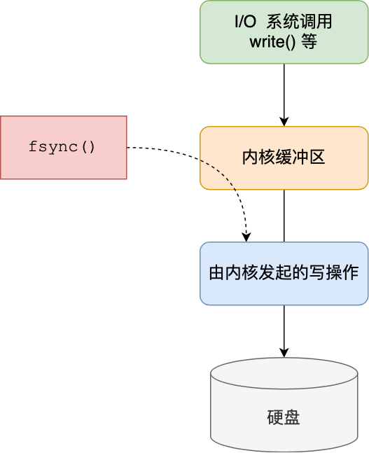

如果想要应用程序向文件写入数据后，能立马将数据同步到硬盘，就可以调用 `fsync()` 函数，这样内核就会将内核缓冲区的数据直接写入到硬盘，等到硬盘写操作完成后，该函数才会返回。

- Always 策略就是每次写入 AOF 文件数据后，就执行 fsync() 函数；
- Everysec 策略就会创建一个异步任务来执行 fsync() 函数；
- No 策略就是永不执行 fsync() 函数;


#### 总结

这 3 种写回策略都无法能完美解决「主进程阻塞」和「减少数据丢失」的问题，因为两个问题是对立的，偏向于一边的话，就会要牺牲另外一边。

- 如果要高性能，就选择 No 策略；
- 如果要高可靠，就选择 Always 策略；
- 如果允许数据丢失一点，但又想性能高，就选择 Everysec 策略。
- 


为了兼顾数据和写入性能，用户可以考虑 appendfsync everysec 选项 ，让 Redis 每秒同步一次 AOF 文件，Redis 性能几乎没受到任何影 响。而且这样即使出现系统崩溃，用户最多只会丢失一秒之内产生的数据。当硬盘忙于执行写入操作的时候，Redis 还会优雅的放慢自己的速度以便适应硬盘的最大写入速度。


### AOF重写

AOF 重写可以产生一个新的 AOF 文件，这个新的 AOF 文件和原有的 AOF 文件所保存的数据库状态一样，但体积更小。

AOF 重写是一个有歧义的名字，该功能是通过读取数据库中的键值对来实现的，程序无须对现有 AOF 文件进行任何读入、分析或者写入操作。

在执行 BGREWRITEAOF 命令时，Redis 服务器会维护一个 AOF 重写缓冲区，该缓冲区会在子进程创建新 AOF 文件期间，记录服务器执行的所有写命令。当子进程完成创建新 AOF 文件的工作之后，服务器会将重写缓冲区中的所有内容追加到新 AOF 文件的末尾，使得新旧两个 AOF 文件所保存的数据库状态一致。最后，服务器用新的 AOF 文件替换旧的 AOF 文件，以此来完成 AOF 文件重写操作。


AOF 日志是一个文件，随着执行的写操作命令越来越多，文件的大小会越来越大。

如果当 AOF 日志文件过大就会带来性能问题，比如重启 Redis 后，需要读 AOF 文件的内容以恢复数据，如果文件过大，整个恢复的过程就会很慢。

所以，Redis 为了避免 AOF 文件越写越大，提供了 **AOF 重写机制**，当 AOF 文件的大小超过所设定的阈值后，Redis 就会启用 AOF 重写机制，来压缩 AOF 文件。

AOF 重写机制是在重写时，读取当前数据库中的所有键值对，然后将每一个键值对用一条命令记录到「新的 AOF 文件」，等到全部记录完后，就将新的 AOF 文件替换掉现有的 AOF 文件。


举个例子，在没有使用重写机制前，假设前后执行了「*set name xiaolin*」和「*set name xiaolincoding*」这两个命令的话，就会将这两个命令记录到 AOF 文件。

但是**在使用重写机制后，就会读取 name 最新的 value（键值对） ，然后用一条 「set name xiaolincoding」命令记录到新的 AOF 文件**，之前的第一个命令就没有必要记录了，因为它属于「历史」命令，没有作用了。这样一来，一个键值对在重写日志中只用一条命令就行了。

重写工作完成后，就会将新的 AOF 文件覆盖现有的 AOF 文件，这就相当于压缩了 AOF 文件，使得 AOF 文件体积变小了。

然后，在通过 AOF 日志恢复数据时，只用执行这条命令，就可以直接完成这个键值对的写入了。

所以，重写机制的妙处在于，尽管某个键值对被多条写命令反复修改，**最终也只需要根据这个「键值对」当前的最新状态，然后用一条命令去记录键值对**，代替之前记录这个键值对的多条命令，这样就减少了 AOF 文件中的命令数量。最后在重写工作完成后，将新的 AOF 文件覆盖现有的 AOF 文件。


**为什么要写到新的AOF文件？**

因为**如果 AOF 重写过程中失败了，现有的 AOF 文件就会造成污染**，可能无法用于恢复使用。所以 AOF 重写过程，先重写到新的 AOF 文件，重写失败的话，就直接删除这个文件就好，不会对现有的 AOF 文件造成影响。


#### 后台重写

写入 AOF 日志的操作虽然是在主进程完成的，因为它写入的内容不多，所以一般不太影响命令的操作。

但是在触发 AOF 重写时，比如当 AOF 文件大于 64M 时，就会对 AOF 文件进行重写，这时是需要读取所有缓存的键值对数据，并为每个键值对生成一条命令，然后将其写入到新的 AOF 文件，重写完后，就把现在的 AOF 文件替换掉。

这个过程其实是很耗时的，所以重写的操作不能放在主进程里。

所以，Redis 的**重写 AOF 过程是由后台子进程 \*bgrewriteaof\* 来完成的**，这么做可以达到两个好处：

- 子进程进行 AOF 重写期间，主进程可以继续处理命令请求，从而避免阻塞主进程；
- 子进程带有主进程的数据副本（*数据副本怎么产生的后面会说*），这里使用子进程而不是线程，因为如果是使用线程，多线程之间会共享内存，那么在修改共享内存数据的时候，需要通过加锁来保证数据的安全，而这样就会降低性能。而使用子进程，创建子进程时，父子进程是共享内存数据的，不过这个共享的内存只能以只读的方式，而当父子进程任意一方修改了该共享内存，就会发生「写时复制」，于是父子进程就有了独立的数据副本，就不用加锁来保证数据安全。

子进程是怎么拥有主进程一样的数据副本的呢？

主进程在通过 `fork` 系统调用生成 bgrewriteaof 子进程时，操作系统会把主进程的「**页表**」复制一份给子进程，这个页表记录着虚拟地址和物理地址映射关系，而不会复制物理内存，也就是说，两者的虚拟空间不同，但其对应的物理空间是同一个。

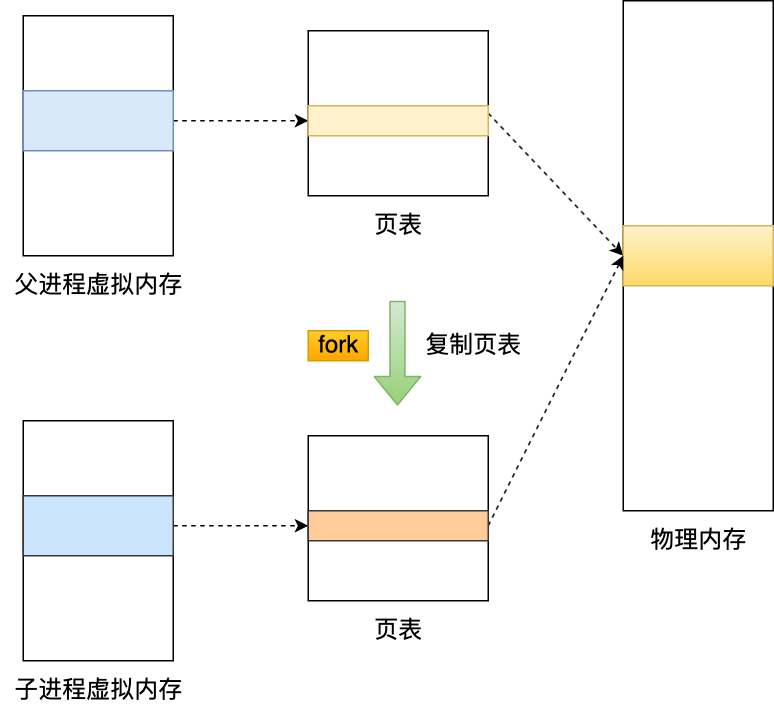


这样一来，子进程就共享了父进程的物理内存数据了，这样能够**节约物理内存资源**，页表对应的页表项的属性会标记该物理内存的权限为**只读**。

不过，当父进程或者子进程在向这个内存发起写操作时，CPU 就会触发**缺页中断**，这个缺页中断是由于违反权限导致的，然后操作系统会在「缺页异常处理函数」里进行**物理内存的复制**，并重新设置其内存映射关系，将父子进程的内存读写权限设置为**可读写**，最后才会对内存进行写操作，这个过程被称为「**写时复制(\*Copy On Write\*)**」。

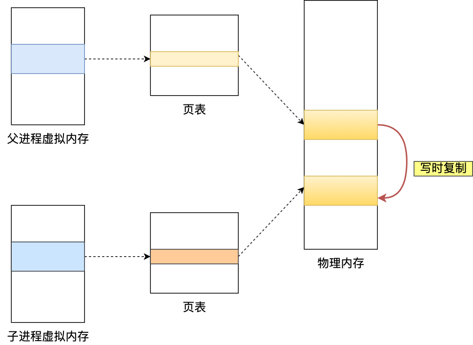

写时复制顾名思义，**在发生写操作的时候，操作系统才会去复制物理内存**，这样是为了防止 fork 创建子进程时，由于物理内存数据的复制时间过长而导致父进程长时间阻塞的问题。

当然，操作系统复制父进程页表的时候，父进程也是阻塞中的，不过页表的大小相比实际的物理内存小很多，所以通常复制页表的过程是比较快的。

不过，如果父进程的内存数据非常大，那自然页表也会很大，这时父进程在通过 fork 创建子进程的时候，阻塞的时间也越久。

所以，有两个阶段会导致阻塞父进程：

- 创建子进程的途中，由于要复制父进程的页表等数据结构，阻塞的时间跟页表的大小有关，页表越大，阻塞的时间也越长；
- 创建完子进程后，如果子进程或者父进程修改了共享数据，就会发生写时复制，这期间会拷贝物理内存，如果内存越大，自然阻塞的时间也越长；

触发重写机制后，主进程就会创建重写 AOF 的子进程，此时父子进程共享物理内存，重写子进程只会对这个内存进行只读，重写 AOF 子进程会读取数据库里的所有数据，并逐一把内存数据的键值对转换成一条命令，再将命令记录到重写日志（新的 AOF 文件）。

但是子进程重写过程中，主进程依然可以正常处理命令。

如果此时**主进程修改了已经存在 key-value，就会发生写时复制，注意这里只会复制主进程修改的物理内存数据，没修改物理内存还是与子进程共享的**。

所以如果这个阶段修改的是一个 bigkey，也就是数据量比较大的 key-value 的时候，这时复制的物理内存数据的过程就会比较耗时，有阻塞主进程的风险。

还有个问题，重写 AOF 日志过程中，如果主进程修改了已经存在 key-value，此时这个 key-value 数据在子进程的内存数据就跟主进程的内存数据不一致了，这时要怎么办呢？

为了解决这种数据不一致问题，Redis 设置了一个 **AOF 重写缓冲区**，这个缓冲区在创建 bgrewriteaof 子进程之后开始使用。

在重写 AOF 期间，当 Redis 执行完一个写命令之后，它会**同时将这个写命令写入到 「AOF 缓冲区」和 「AOF 重写缓冲区」**。

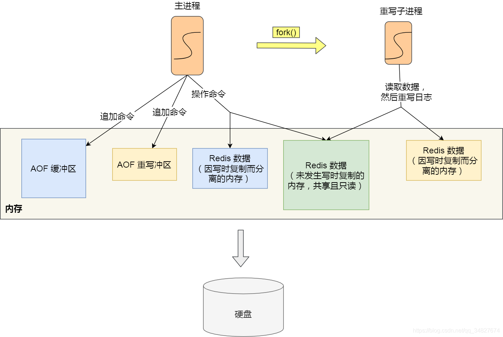

也就是说，在 bgrewriteaof 子进程执行 AOF 重写期间，主进程需要执行以下三个工作:

- 执行客户端发来的命令；
- 将执行后的写命令追加到 「AOF 缓冲区」；
- 将执行后的写命令追加到 「AOF 重写缓冲区」；

当子进程完成 AOF 重写工作（*扫描数据库中所有数据，逐一把内存数据的键值对转换成一条命令，再将命令记录到重写日志*）后，会向主进程发送一条信号，信号是进程间通讯的一种方式，且是异步的。

主进程收到该信号后，会调用一个信号处理函数，该函数主要做以下工作：

- 将 AOF 重写缓冲区中的所有内容追加到新的 AOF 的文件中，使得新旧两个 AOF 文件所保存的数据库状态一致；
- 新的 AOF 的文件进行改名，覆盖现有的 AOF 文件。

信号函数执行完后，主进程就可以继续像往常一样处理命令了。

在整个 AOF 后台重写过程中，除了发生写时复制会对主进程造成阻塞，还有信号处理函数执行时也会对主进程造成阻塞，在其他时候，AOF 后台重写都不会阻塞主进程。


### AOF总结

AOF 方法是指每执行一条写操作命令，就将该命令以追加的方式写入到 AOF 文件，然后在恢复时，以逐一执行命令的方式来进行数据恢复。

Redis 提供了三种将 AOF 日志写回硬盘的策略，分别是 Always、Everysec 和 No，这三种策略在可靠性上是从高到低，而在性能上则是从低到高。

随着执行的命令越多，AOF 文件的体积自然也会越来越大，为了避免日志文件过大， Redis 提供了 AOF 重写机制，它会直接扫描数据中所有的键值对数据，然后为每一个键值对生成一条写操作命令，接着将该命令写入到新的 AOF 文件，重写完成后，就替换掉现有的 AOF 日志。重写的过程是由后台子进程完成的，这样可以使得主进程可以继续正常处理命令。

用 AOF 日志的方式来恢复数据其实是很慢的，因为 Redis 执行命令由单线程负责的，而 AOF 日志恢复数据的方式是顺序执行日志里的每一条命令，如果 AOF 日志很大，这个「重放」的过程就会很慢了。


## 混合持久化

尽管 RDB 比 AOF 的数据恢复速度快，但是快照的频率不好把握：

- 如果频率太低，两次快照间一旦服务器发生宕机，就可能会比较多的数据丢失；
- 如果频率太高，频繁写入磁盘和创建子进程会带来额外的性能开销。


Redis 4.0 开始支持同时开启 RDB 和 AOF，系统重启后，Redis 会优先使用 AOF 来恢复数据，这样丢失的数据会最少。

```bash
aof-use-rdb-preamble yes # 开启RDB 和 AOF 的混合持久化
```


### 实现原理

当开启了混合持久化时，在 AOF 重写日志时，`fork` 出来的重写子进程会先将与主线程共享的内存数据以 RDB 方式写入到 AOF 文件，然后主线程处理的操作命令会被记录在重写缓冲区里，重写缓冲区里的增量命令会以 AOF 方式写入到 AOF 文件，写入完成后通知主进程将新的含有 RDB 格式和 AOF 格式的 AOF 文件替换旧的的 AOF 文件。

也就是说，使用了混合持久化，AOF 文件的**前半部分是 RDB 格式的全量数据，后半部分是 AOF 格式的增量数据**。

这样的好处在于，重启 Redis 加载数据的时候，由于前半部分是 RDB 内容，这样**加载的时候速度会很快**。

加载完 RDB 的内容后，才会加载后半部分的 AOF 内容，这里的内容是 Redis 后台子进程重写 AOF 期间，主线程处理的操作命令，可以使得**数据更少的丢失**。


## 持久化总结

- **RDB**：快照形式是直接把内存中的数据保存到一个 dump 的文件中，定时保存，保存策略。RDB 文件的内容是二进制数据。
- **AOF**：把所有的对 Redis 的服务器进行修改的命令都存到一个文件里，命令的集合。Redis 默认是快照 RDB 的持久化方式。AOF 文件的内容是操作命令。

如果可以承受数分钟内的数据丢失，那么可以只使用 RDB 持久。定时生成 RDB 快照非常便于进行数据库备份，并且 RDB 恢复数据集的速度也要比 AOF 恢复的速度快。

AOF 将 Redis 执行的每一条命令追加到磁盘中，处理巨大的写入会降低Redis的性能。


# 主从复制和集群

纵向扩展：主从复制

横向扩展：集群


## 主从复制

- 从节点执行 slave of [masterIP] [masterPort]，保存主节点信息。
- 从节点中的定时任务发现主节点信息，建立和主节点的 Socket 连接。
- 从节点发送 Ping 信号，主节点返回 Pong，两边能互相通信。
- 连接建立后，主节点将所有数据发送给从节点（数据同步）。
- 主节点把当前的数据同步给从节点后，便完成了复制的建立过程。接下来，主节点就会持续的把写命令发送给从节点，保证主从数据一致性。


主从复制会存在问题：

- 一旦主节点宕机，从节点晋升为主节点，同时需要修改应用方的主节点地址，还需要命令所有从节点去复制新的主节点，整个过程需要人工干预。
- 主节点的写能力受到单机的限制。
- 主节点的存储能力受到单机的限制。
- 原生复制的弊端在早期的版本中也会比较突出，比如：Redis 复制中断后，从节点会发起 psync。
- 此时如果同步不成功，则会进行全量同步，主库执行全量备份的同时，可能会造成毫秒或秒级的卡顿。


## 哨兵
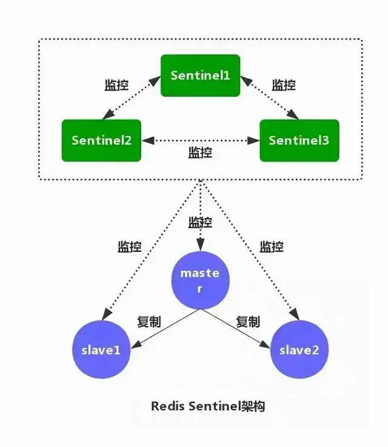


- **监控**：不断检查主服务器和从服务器是否正常运行。
- **通知**：当被监控的某个 Redis 服务器出现问题，Sentinel 通过 API 脚本向管理员或者其他应用程序发出通知。
- **自动故障转移**：当主节点不能正常工作时，Sentinel 会开始一次自动的故障转移操作，它会将与失效主节点是主从关系的其中一个从节点升级为新的主节点，并且将其他的从节点指向新的主节点，这样人工干预就可以免了。
- **配置提供者**：在 Redis Sentinel 模式下，客户端应用在初始化时连接的是 Sentinel 节点集合，从中获取主节点的信息。


## 集群

Redis V3.0后提供了 Redis Cluster 集群方案。

主从模式下实现读写分离的架构，可以让多个从服务器承载「读流量」，但面对「写流量」时，始终是只有主服务器在抗。

纵向扩展升级Redis服务器硬件能力，但升级至一定程度下，就不划算了。纵向扩展意味着大内存，Redis持久化时的"成本"会加大（Redis做RDB持久化，是全量的，fork子进程时有可能由于使用内存过大，导致主线程阻塞时间过长）

用多个Redis实例来组成一个集群，按照一定的规则把数据分发到不同的Redis实例上。当集群所有的Redis实例的数据加起来，那这份数据就是全的。


### 节点

Redis 集群中各个节点使用 `CLUSTER MEET` 命令进行连接。

```shell
CLUSTER MEET <ip> <port>
```

向一个节点 node 发送`CLUSTER MEET`命令，可以让 node 节点与 ip 和 port 的指定节点进行**握手**。握手成功后，node 节点会将目标节点添加到 node 节点所在的集群中。重复这个操作，可以让多个节点处于同一集群。


#### 集群数据结构

- **`clusterNode`结构**保存了一个节点的当前状态，包括节点创建时间、节点名字、节点配置纪元、节点 IP 地址和端口号等等。
- **`clusterLink`结构**是`clusterNode`的一个属性，保存了连接节点所需的有关信息，比如套接字描述符、输入缓冲区和输出缓冲区等等。
- **`clusterState`结构**被每个节点所保存，记录了当前节点视角下集群所处状态，例如集群是在线还是下线，集群包含多少个节点，集群当前的配置纪元等等。


#### 实现原理

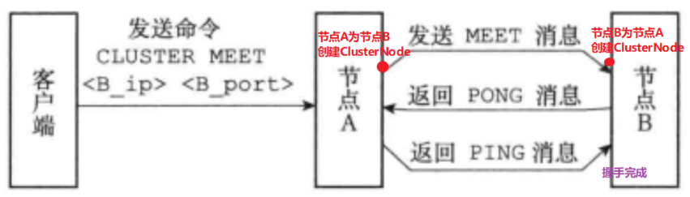

1. 客户端发送命令 CLUSTER MEET 命令到节点A；
2. 节点A收到命令，向命令中指向的节点B发送 MEET 消息；
3. 节点B收到 MEET 消息后向节点A返回 PONG 消息；
4. 节点A收到 PONG 消息后返回节点B PING消息，至此节点A和节点B之间建立了集群关系。


### 槽指派

#### 槽

Redis 集群通过分片来保存数据库中的键值对，集群的整个数据库被分为 16384 个槽，数据库中的每个键都属于这 16384 个槽中的一个，集群中的每个节点可以处理 0 个或最多 16384 个槽。

当数据库中的 16384 个槽都有节点在处理，集群处于**上线状态**。如果有任何一个槽没有节点处理，那么集群处于**下线状态**。

通过向节点发送`CLUSTER ADDSLOTS`命令，我们可以将一个或多个槽指派给节点负责。例如以下命令可以将槽 0~5000 指派给节点 7000 负责：

```shell
> CLUSTER ADDSLOTS 0 1 2 3 4 ... 5000
```


#### 记录节点的槽指派信息

`clusterNode`结构的`slots`属性和`numslot`属性记录了节点负责处理哪些槽。

- `slots`长度为 16384，某一位的长度是 1 或者 0，代表这个槽有没有被当前的节点负责处理。
- `numslots`属性记录了当前节点负责处理的槽的数量。


#### 传播节点的槽指派信息

节点会将自己的`slots`数组通过消息发送给集群中的其他节点，告诉他们自己目前负责处理哪些槽。

当节点 A 通过消息从节点 B 那里接收到节点 B 的`slots`数组时，会在自己的`clusterState.nodes`字典中查找节点 B 对应的`clusterNode`结构，并进行更新。


### 执行命令

上线状态的集群可以执行命令。当客户端向节点发送命令时，接受命令的节点会检查命令要处理的数据库键属于哪个槽，并检查这个槽是否指派给了自己。

- 如果是，则执行命令。
- 如果不是，则向客户端返回一个`MOVED`错误，指引客户端转向正确节点，重新发送之前的命令。


#### 执行过程

1. 计算给定key所属的槽

redis使用如下算法来计算给定的`key`属于哪个槽

```c
def slot_number(key):
	return CRC16(key) & 16383
```


`CRC16(key)`语句计算出`key`的`CRC-16`校验和，而`& 16383`计算出一个介于 0 和 16383 之间的整数作为key的槽号。`CLUSTER KEYSLOT`命令是根据上面的槽分配算法来实现的。


2. 判断槽是否由当前节点负责

检查自己的`slots`数组中的对应位置。如果有当前节点处理则执行命令，如果不是则返回MOVED，让客户端根据 MOVED 错误转向正确的节点。

MOVED 错误格式：

```shell
MOVED <slot> <ip>:<port>
```


#### 节点数据库的实现

除了将键值对保存在数据里面外，节点还会用`clusterState`结构中的`slots_to_keys`跳跃表来保存槽和键之间的关系。

该跳表的每个节点的分值都是一个槽号。而每个节点的成员都是一个数据库键。使用这个跳表，可以方便地对属于某些槽的所有数据库键进行批量操作。

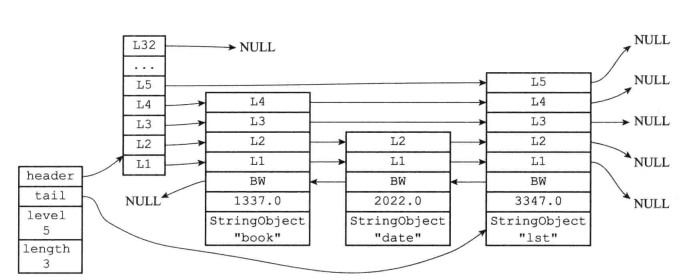


### 重新分片

#### 重新分片流程

Redis 集群的重新分片操作可以令分派给某个槽的节点重新分派给另一个节点。重新分片可以在线进行，过程中集群不需要下线，且可以正常处理命令请求。

重新分片由 Redis 集群管理软件`redis-trib`负责执行。

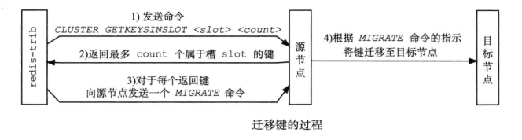

重新分片流程如上图。如果要分片的槽属于多个节点，就要对多个节点发送命令。


#### ASK错误

重新分片期间可能出现一种情况：属于被迁移槽的一部分键值对保存在源节点里面，另一部分键值对保存在目标节点里面。此时当客户端向源节点发送一个命令，并且要求处理的数据库键恰好正在被迁移：

- 源节点现在自己的数据找，找到就直接发送命令。
- 没找到就向客户端返回 ASK 错误，指引客户端转向目标节点执行命令。

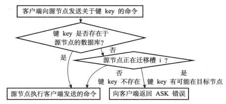


一个 ASK 错误如下图所示：

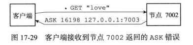

收到 ASK 错误的客户端会根据错误提供的 IP 地址和端口号，转向目标节点，先向目标节点发送一个 ASKING 命令，之后再重新发送原本要执行的命令。

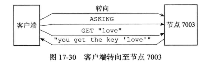

ASKING 命令可以打开发送该命令的客户端的`REDIS_ASKING`标识。这在服务端接收到后面的命令时有用。

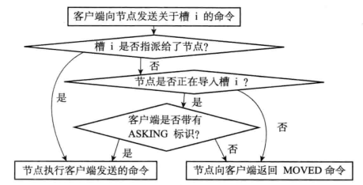


正在进行重新分片的服务端判断发送请求的客户端的 ASKING 标识是否打开

- 如果打开，该客户端的请求是一个槽分派时的重定向请求，正常执行。
- 如果没打开，该客户端的请求是一个普通的寻址错误的命令请求，返回 MOVED 错误。


### 复制和故障转移

Redis 集群中的主节点用于处理槽，从节点用于复制某个主节点，并且在被复制的主节点下线时接替它。

假如某个场景下服务器间的状态如下：

假如主服务器 7000 下线，那么剩余的主服务器即 7001、7002、7003 会从 7000 的两个从服务器 7004、7005 选择一个接管 7000 负责的槽。另一个从服务器会变成新主服务器的从服务器。

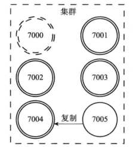

如果后续 7000 重新上线，它会变成 7004 的新从节点。

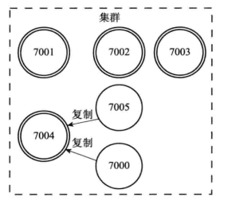


#### 故障检测

集群中每个节点会定时向集群中的其它节点发送 PING 消息，以此检测对方是否下线。如果接收 PING 的节点没有在规定时间内返回 PONG 消息，就会被标记为**疑似下线**。

集群中的节点在别的节点的视角下有三种状态：**在线、疑似下线、已下线。**

当一个主节点 A 通过消息得知主节点 B 认为主节点 C 进入疑似下线时，主节点 A 会在自己的`clusterState.nodes`字典中找到主节点 C 对应的`clusterNode`结构，并将主节点 B 的下线报告添加到`clusterNode`结构的`fail_reports`链表中。

如果在集群中，有一个主节点发现半数以上的主节点都将某个主节点 x 标记为意思下线，那么他将把这个主节点标记为已下线，并向其他所有节点广播 FAIL 消息。

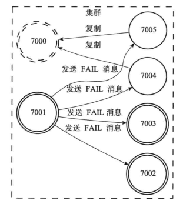

#### 故障转移

当一个从节点发现自己正在复制的主节点进入已下线状态时，从节点将开始对下线主节点进行故障转移操作：

1. 第一个发现问题的主节点举行一个选举，要求自己称为新的主节点。选举的规则和 Sentinel 中选举领头 Sentinel 非常相似，他们都基于 Raft 算法的领头选举方法。
	- 成功则称为新主节点
	- 失败则等待下一个从节点提出选举。
2. 被选中的从节点执行`SLAVEOF no one`命令，成为新的主节点。
3. 新的主节点接管已下线主节点的全部槽指派。
4. 新主节点广播 PONG 消息，让别的节点知道自己已经成为主节点。
5. 新主节点开始行使主节点职责。


# 生产应用

## 缓存失效场景

### 缓存穿透

#### 定义

缓存穿透是指查询一个一定不存在的数据，每次请求都要到数据库去查询，失去了缓存的意义。


#### 解决方案

##### 布隆过滤器

采用布隆过滤器，将所有可能存在的数据哈希到一个足够大的bitmap中，不存在的数据会被bitmap拦截掉，从而避免了对底层存储系统的查询压力。


**缺陷**

该方案要求技术难度，且可能会有一定的误差（哈希碰撞）。


##### 缓存空结果

如果一个查询返回的数据为空（不管是数据不存在，还是系统故障），仍然把这个空结果进行缓存，并设置一个较短的过期时间。


**缺陷**

在过期时间内可能会查不到最新的数据，导致数据不一致。


### 缓存击穿

#### 定义

缓存在某个时间点过期的时候，恰好在这个时间点对这个Key有大量的并发请求过来，这些请求发现缓存过期一般都会从数据库加载数据并回设到缓存，这个时候大并发的请求可能会瞬间把数据库压垮。


#### 解决方案

##### 互斥锁

缓存失效时，不是立即请求数据库，而是先设置一个缓存互斥锁，如果设置成功，则去查询数据库；如果设置失败，则表示有其他请求正在查询数据库并更新缓存。此时只要重试从缓存中获取数据即可。


```java
public String get(key) {
    String value = redis.get(key);
    //代表缓存值过期 
    if (value == null) {
        //设置3min的超时，防止del操作失败的时候，下次缓存过期一直不能load 数据库  
        if (redis.setnx(key_mutex, 1, 3 * 60) == 1) {
            //代表设置成功
            value = 数据库.get(key);
            redis.set(key, value, expire_secs);
            redis.del(key_mutex);
        } else {
            //这个时候代表同时候的其他线程已经load 数据库并回设到缓存了，这时候重试获取缓存值即可 
            sleep(50);
            //重试  
            get(key);
        }
    } else {
        return value;
    }
}
```


**缺陷**

降低了系统的处理并发的能力，存在死锁的风险。


##### 提前互斥

在value内部设置1个超时值(timeout1)，timeout1比实际的超时值(timeout2)小。当从cache读取到timeout1发现它已经过期时候，马上延长timeout1并重新设置到cache，然后再从数据库加载数据并设置到cache中。


**缺陷**

降低了系统的处理并发的能力，存在死锁的风险。


##### 永远不过期

针对某些场景下的缓存数据，可以不设置过期时间，从而使缓存永远不过期。


**缺陷**

该方案缺乏通用性，只能针对某些缓存不会频繁变化的场景使用。


#### 缓存击穿与缓存穿透的区别

缓存击穿是指存在的数据设置的缓存过期那一段时间内有大量请求导致数据库压力过大；缓存穿透指不存在的数据，因为没有缓存而导致不停的请求数据库，导致数据库压力过大。


### 缓存雪崩

#### 定义

缓存雪崩是指设置缓存时采用了相同的过期时间，导致缓存在某一时刻同时失效，请求全部转发到数据库，数据库瞬时压力过重雪崩。


#### 解决方案

##### 随机过期时间

在原有的失效时间基础上增加一个随机值，比如1-5分钟随机，这样每一个缓存的过期时间的重复率就会降低，从而降低发生缓存雪崩的概率。


**缺陷**

不适用与强制指定规定时长的过期时间的场景。


##### 限流

限制每秒请求数次，剩余的请求走降级处理，返回一些默认的值或友情提示等默认操作。


**缺陷**

用户不友好，部分用户无法使用。


## 数据一致性

在分布式环境下，缓存和数据库很容易出现数据一致性问题，如果项目对缓存的要求是强一致性，那就不要使用缓存。

只能在项目中使用策略降低缓存与数据库一致性的概率，是无法保障两者的强一致性，一般策略包括缓存更新机制，更新数据库后及时更新缓存、缓存失败时增加重试机制。


### 旁路缓存模式

**旁路缓存模式**（Cache Aside Pattern）指更新 DB，然后直接删除 cache 。删除缓存这一步失败的话，则**增加cache更新重试机制**。

