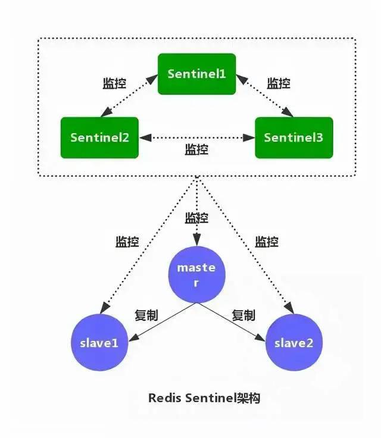

# 主从复制和集群

## 主从复制

- 从节点执行 slave of [masterIP] [masterPort]，保存主节点信息。
- 从节点中的定时任务发现主节点信息，建立和主节点的 Socket 连接。
- 从节点发送 Ping 信号，主节点返回 Pong，两边能互相通信。
- 连接建立后，主节点将所有数据发送给从节点（数据同步）。
- 主节点把当前的数据同步给从节点后，便完成了复制的建立过程。接下来，主节点就会持续的把写命令发送给从节点，保证主从数据一致性。

主从复制会存在问题：

- 一旦主节点宕机，从节点晋升为主节点，同时需要修改应用方的主节点地址，还需要命令所有从节点去复制新的主节点，整个过程需要人工干预。
- 主节点的写能力受到单机的限制。
- 主节点的存储能力受到单机的限制。
- 原生复制的弊端在早期的版本中也会比较突出，比如：Redis 复制中断后，从节点会发起 psync。
- 此时如果同步不成功，则会进行全量同步，主库执行全量备份的同时，可能会造成毫秒或秒级的卡顿。

### 哨兵的架构模式

- **监控**：不断检查主服务器和从服务器是否正常运行。
- **通知**：当被监控的某个 Redis 服务器出现问题，Sentinel 通过 API 脚本向管理员或者其他应用程序发出通知。
- **自动故障转移**：当主节点不能正常工作时，Sentinel 会开始一次自动的故障转移操作，它会将与失效主节点是主从关系的其中一个从节点升级为新的主节点，并且将其他的从节点指向新的主节点，这样人工干预就可以免了。
- **配置提供者**：在 Redis Sentinel 模式下，客户端应用在初始化时连接的是 Sentinel 节点集合，从中获取主节点的信息。

## 集群

