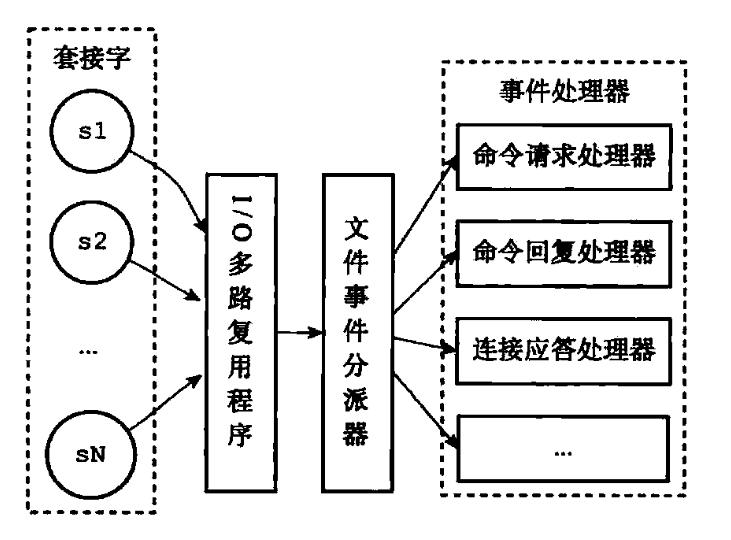

# 简介

Redis 是C语言开发的一个开源高性能键值对的*内存数据库*，可以用来做数据库、缓存、消息中间件等场景，是一种NoSQL(not-only sql,非关系型数据库)的数据库。

**Redis 除了做缓存之外，Redis 也经常用来做分布式锁，甚至是消息队列。Redis 提供了多种数据类型来支持不同的业务场景。Redis 还支持事务 、持久化、Lua 脚本、多种集群方案。**

**具备如下特点：**

- 单线程但进程，是线程安全的，采用IO多路复用制
- 可作为分布式锁
- 支持多种数据类型
- 支持数据持久化到磁盘
- 可以作为消息中间件使用，支持消息发布及订阅


### 一般使用流程

#### 查询

1. 如果用户请求的数据在缓存中就直接返回。
2. 缓存中不存在的话就看数据库中是否存在。
3. 数据库中存在的话就更新缓存中的数据。
4. 数据库中不存在的话就返回空数据。


#### 更新

参考保证数据一致性。


## 线程模型

### 单线程模型

> Redis6.0 后引入多线程


**Redis 基于 Reactor 模式来设计开发了自己的一套高效的事件处理模型**，通过**IO 多路复用程序** 来监听来自客户端的大量连接。**I/O 多路复用技术的使用让 Redis 不需要额外创建多余的线程来监听客户端的大量连接，降低了资源的消耗。**


Redis 服务器是一个事件驱动程序，服务器需要处理两类事件： 1. 文件事件; 2. 时间事件。


#### 文件事件

文件事件处理器（file event handler）主要是包含 4 个部分：

- 多个 socket（客户端连接）
- IO 多路复用程序（支持多个客户端连接的关键）
- 文件事件分派器（将 socket 关联到相应的事件处理器）
- 事件处理器（连接应答处理器、命令请求处理器、命令回复处理器）




#### 总结

##### **Redis6.0 之前 为什么不使用多线程？**

1. 单线程编程容易并且更容易维护；
2. Redis 的性能瓶颈不再 CPU ，主要在内存和网络；
3. 多线程就会存在死锁、线程上下文切换等问题，甚至会影响性能。


### 多线程模型

**Redis6.0 引入多线程主要是为了提高网络 IO 读写性能**，因为这个算是 Redis 中的一个性能瓶颈。

虽然Redis6.0 引入了多线程，但是 Redis 的多线程只是在网络数据的读写这类耗时操作上使用了， 执行命令仍然是单线程顺序执行。因此不需要担心线程安全问题。


#### 使用方式

Redis6.0 的多线程默认是禁用的，只使用主线程。如需开启需要修改 redis 配置文件 `redis.conf`:

```
io-threads-do-reads yes
```


开启多线程后，还需要设置线程数，否则是不生效的。同样需要修改 redis 配置文件 `redis.conf` :

```bash
#官网建议4核的机器建议设置为2或3个线程，8核的建议设置为6个线程
io-threads 4 
```


## 扩展

##### Memcached对比

**共同点** ：

1. 都是基于内存的数据库，一般都用来当做缓存使用。
2. 都有过期策略。
3. 两者的性能都非常高。


**区别** ：

1. **Redis 支持更丰富的数据类型（支持更复杂的应用场景）**。Redis 不仅仅支持简单的 k/v 类型的数据，同时还提供 list，set，zset，hash 等数据结构的存储。Memcached 只支持最简单的 k/v 数据类型。
2. **Redis 支持数据的持久化，可以将内存中的数据保持在磁盘中，重启的时候可以再次加载进行使用,而 Memecache 把数据全部存在内存之中。**
3. **Redis 有灾难恢复机制。** 因为可以把缓存中的数据持久化到磁盘上。
4. **Redis 在服务器内存使用完之后，可以将不用的数据放到磁盘上。但是，Memcached 在服务器内存使用完之后，就会直接报异常。**
5. **Memcached 没有原生的集群模式，需要依靠客户端来实现往集群中分片写入数据；但是 Redis 目前是原生支持 cluster 模式的.**
6. **Memcached 是多线程，非阻塞 IO 复用的网络模型；Redis 使用单线程的多路 IO 复用模型。** （Redis 6.0 引入了多线程 IO ）
7. **Redis 支持发布订阅模型、Lua 脚本、事务等功能，而 Memcached 不支持。并且，Redis 支持更多的编程语言。**
8. **Memcached过期数据的删除策略只用了惰性删除，而 Redis 同时使用了惰性删除与定期删除。**


##### 为什么要用缓存

一般像 MySQL 这类的数据库的 QPS 大概都在 1w 左右（4 核 8g） ，但是使用 Redis 缓存之后很容易达到 10w+，甚至最高能达到 30w+（就单机 redis 的情况，redis 集群的话会更高）。

直接操作缓存能够承受的数据库请求数量是远远大于直接访问数据库的，把数据库中的部分数据转移到缓存中去，这样用户的一部分请求会直接到缓存这里而不用经过数据库，进而提高的系统整体的并发。


# 数据结构

## String

string 数据结构是简单的 key-value 类型。虽然 Redis 是用 C 语言写的，但是 Redis 并没有使用 C 的字符串表示，而是自己构建了一种 **简单动态字符串**（simple dynamic string，**SDS**）。相比于 C 的原生字符串，Redis 的 SDS 不光可以保存文本数据还可以保存二进制数据，并且获取字符串长度复杂度为 O(1)（C 字符串为 O(N)）,除此之外,Redis 的 SDS API 是安全的，不会造成缓冲区溢出。


### 数据结构

### 命令语法

`set,get,strlen,exists,dect,incr,setex` 等等。


### 应用场景

一般常用在需要计数的场景，比如用户的访问次数、热点文章的点赞转发数量等等。


## List

**list** 即是 **链表**。链表是一种非常常见的数据结构，特点是易于数据元素的插入和删除并且且可以灵活调整链表长度，但是链表的随机访问困难。许多高级编程语言都内置了链表的实现比如 Java 中的 **LinkedList**，但是 C 语言并没有实现链表，所以 Redis 实现了自己的链表数据结构。Redis 的 list 的实现为一个 **双向链表**，即可以支持反向查找和遍历，更方便操作，不过带来了部分额外的内存开销。


### 数据结构


### 命令语法

`rpush,lpop,lpush,rpop,lrange、llen` 等。


### 应用场景

发布与订阅或者说消息队列、慢查询。


## Hash

hash 类似于 JDK1.8 前的 HashMap，内部实现也差不多(数组 + 链表)。不过，Redis 的 hash 做了更多优化。另外，hash 是一个 string 类型的 field 和 value 的映射表，**特别适合用于存储对象**，后续操作的时候，你可以直接仅仅修改这个对象中的某个字段的值。 比如我们可以 hash 数据结构来存储用户信息，商品信息等等。


### 数据结构


### 命令语法

`hset,hmset,hexists,hget,hgetall,hkeys,hvals` 等。


### 应用场景

系统中对象数据的存储。


## Set

set 类似于 Java 中的 `HashSet` 。Redis 中的 set 类型是一种无序集合，集合中的元素没有先后顺序。当你需要存储一个列表数据，又不希望出现重复数据时，set 是一个很好的选择，并且 set 提供了判断某个成员是否在一个 set 集合内的重要接口，这个也是 list 所不能提供的。可以基于 set 轻易实现交集、并集、差集的操作。比如：你可以将一个用户所有的关注人存在一个集合中，将其所有粉丝存在一个集合。Redis 可以非常方便的实现如共同关注、共同粉丝、共同喜好等功能。这个过程也就是求交集的过程。


### 数据结构


### 命令语法

`sadd,spop,smembers,sismember,scard,sinterstore,sunion` 等。


### 应用场景

需要存放的数据不能重复以及需要获取多个数据源交集和并集等场景。


## ZSet

和 set 相比，sorted set 增加了一个权重参数 score，使得集合中的元素能够按 score 进行有序排列，还可以通过 score 的范围来获取元素的列表。有点像是 Java 中 HashMap 和 TreeSet 的结合体。


### 数据结构

### 命令语法

`zadd,zcard,zscore,zrange,zrevrange,zrem` 等。


### 应用场景

需要对数据根据某个权重进行排序的场景。比如在直播系统中，实时排行信息包含直播间在线用户列表，各种礼物排行榜，弹幕消息（可以理解为按消息维度的消息排行榜）等信息。


## 总结


# 事务

事务具有四大特性： **1. 原子性**，**2. 隔离性**，**3. 持久性**，**4. 一致性**。

1. **原子性（Atomicity）：** 事务是最小的执行单位，不允许分割。事务的原子性确保动作要么全部完成，要么完全不起作用；
2. **隔离性（Isolation）：** 并发访问数据库时，一个用户的事务不被其他事务所干扰，各并发事务之间数据库是独立的；
3. **持久性（Durability）：** 一个事务被提交之后。它对数据库中数据的改变是持久的，即使数据库发生故障也不应该对其有任何影响。
4. **一致性（Consistency）：** 执行事务前后，数据保持一致，多个事务对同一个数据读取的结果是相同的；


**Redis 是不支持 roll back 的，因而不满足原子性的（而且不满足持久性）。**Redis开发者们觉得没必要支持回滚，这样更简单便捷并且性能更好。Redis开发者觉得即使命令执行错误也应该在开发过程中就被发现而不是生产过程中。

**Redis事务可以理解为提供了一种将多个命令请求打包的功能。然后，再按顺序执行打包的所有命令，并且不会被中途打断。**


## 事务语法

Redis 可以通过 **MULTI，EXEC，DISCARD 和 WATCH** 等命令来实现事务(transaction)功能。


```bash
> MULTI
OK
> INCR foo
QUEUED
> INCR bar
QUEUED
> EXEC
1) (integer) 1
2) (integer) 1
```


使用 MULTI 命令后可以输入多个命令。Redis不会立即执行这些命令，而是将它们放到队列，当调用了 EXEC 命令将执行所有命令。


# 数据过期淘汰

## 数据过期机制

因为内存是有限的，如果缓存中的所有数据都是一直保存的话，很容易导致Out of memory。因此缓存中的数据要设置过期时间。

缓存设置过期还可以用来满足一些有时间限制的需求，如验证码15分钟过期，登陆token在1天内有效。


Redis缓存数据过期时并不会立马删除，Redis 有两种删除过期数据的策略。

- 定期选取部分数据删除；
- 惰性删除。


### 设置过期时间语法

**Redis中除了字符串类型有自己独有设置过期时间的命令 `setex` 外，其他方法都需要依靠 `expire` 命令来设置过期时间 。另外， `persist` 命令可以移除一个键的过期时间：**

从 Redis 版本 7.0.0 开始：`EXPIRE` 添加了选项：`NX`、`XX`和`GT`、`LT` 选项。

- NX：当 key 没有过期时才设置过期时间；
- XX：只有 key 已过期的时候才设置过期时间；
- GT：仅当**新的到期时间**大于当前到期时间时才设置过期时间；
- LT：仅在新到期时间小于当前到期时间才设置到过期时间。


#### String

```bash
setex key 60 value # 数据在 60s 后过期
```


#### 其它类型

```bash
EXPIRE key seconds [ NX | XX | GT | LT]
```


### 数据过期原理

Redis 通过一个叫做过期字典（可以看作是hash表）来保存数据过期的时间。过期字典的键指向Redis数据库中的某个key(键)，过期字典的值是一个long long类型的整数，这个整数保存了key所指向的数据库键的过期时间（毫秒精度的UNIX时间戳）。


```c
typedef struct redisDb {
    ...
    
    dict *dict;     //数据库键空间,保存着数据库中所有键值对
    dict *expires   // 过期字典,保存着键的过期时间
    ...
} redisDb;
```


### 数据过期删除策略

#### 惰性删除

惰性删除就是当有客户端的请求查询该 `key` 的时候，检查下 `key` 是否过期，如果过期，则删除该 `key`。**将删除过期数据的主动权交给了每次访问请求。**


#### 定期删除

定期删除就是 Redis 默认每 1 秒运行 10 次（每 100 ms 执行一次），每次随机抽取一些（占25%）设置了过期时间的 key，检查是否过期，如果发现过期了就直接删除。

定期删除对内存更加友好，惰性删除对CPU更加友好。两者各有千秋，所以Redis 采用的是 **定期删除+惰性/懒汉式删除** 。


## 内存淘汰机制

但是，仅仅通过给 key 设置过期时间还是有问题的。因为还是可能存在定期删除和惰性删除漏掉了很多过期 key 的情况。这样就导致大量过期 key 堆积在内存里，然后就Out of memory了。

为了解决这个问题就要用到内存淘汰机制


Redis 提供 6 种数据淘汰策略：

| 淘汰策略        | 描述                                                         |
| --------------- | ------------------------------------------------------------ |
| volatile-lru    | 从已设置过期时间的数据集（server.db[i].expires）中挑选最近最少使用的数据淘汰 |
| volatile-ttl    | 从已设置过期时间的数据集（server.db[i].expires）中挑选将要过期的数据淘汰 |
| volatile-random | 从已设置过期时间的数据集（server.db[i].expires）中任意选择数据淘汰 |
| allkeys-lru     | 当内存不足以容纳新写入数据时，在键空间中，移除最近最少使用的 key（这个是最常用的） |
| allkeys-random  | 从数据集（server.db[i].dict）中任意选择数据淘汰              |
| no-eviction     | 禁止驱逐数据，也就是说当内存不足以容纳新写入数据时，新写入操作会报错。这个应该没人使用吧！ |
| volatile-lfu    | （4.0版本后）从已设置过期时间的数据集(server.db[i].expires)中挑选最不经常使用的数据淘汰 |
| allkeys-lfu     | （4.0版本后）当内存不足以容纳新写入数据时，在键空间中，移除最不经常使用的 key |


### 总结

- volatile为前缀的策略都是从已过期的数据集中进行淘汰。
- allkeys为前缀的策略都是面向所有key进行淘汰。
- LRU（least recently used）最近最少用到的。
- LFU（Least Frequently Used）最不常用的。
- 它们的触发条件都是Redis使用的内存达到阈值时。


## 扩展

### 集群或主从场景

在集群或主从场景下，为了保证数据一致性，让过期操作正常运行，机器之间的时间必须保证稳定同步，否则就会出现过期时间不准的情况。


比如两台时钟严重不同步的机器发生 RDB 传输， slave 的时间设置为未来的 2000 秒，假如在 master 的一个 key 设置 1000 秒存活，当 Slave 加载 RDB 的时候 key 就会认为该 key 过期（因为 slave 机器时间设置为未来的 2000 s），并不会等待 1000 s 才过期。


# 持久化

## RDB

Redis 可以通过创建快照**（snapshotting）**来获得存储在内存里面的数据在某个时间点上的副本。Redis 创建快照之后，可以对快照进行备份，可以将快照复制到其他服务器从而创建具有相同数据的服务器副本（Redis 主从结构，主要用来提高 Redis 性能），还可以将快照留在原地以便重启服务器的时候使用。


### 规则配置

```bash
save 900 1     #在900秒(15分钟)之后，如果至少有1个key发生变化，自动触发BGSAVE命令创建快照。
save 300 10    #在300秒(5分钟)之后，如果至少有10个key发生变化，自动触发BGSAVE命令创建快照。
save 60 10000  #在60秒(1分钟)之后，如果至少有10000个key发生变化，自动触发BGSAVE命令创建快照。
```


## AOF

与快照持久化相比，AOF 持久化 的实时性更好，因此已成为主流的持久化方案。默认情况下 Redis 没有开启 AOF（append only file）方式的持久化，可以通过 appendonly 参数开启：

```bash
appendonly yes
```


开启 AOF 持久化后每执行一条会更改 Redis 中的数据的命令，Redis 就会将该命令写入硬盘中的 AOF 文件。AOF 文件的保存位置和 RDB 文件的位置相同，都是通过 dir 参数设置的，默认的文件名是 appendonly.aof。


### AOF重写

AOF 重写可以产生一个新的 AOF 文件，这个新的 AOF 文件和原有的 AOF 文件所保存的数据库状态一样，但体积更小。

AOF 重写是一个有歧义的名字，该功能是通过读取数据库中的键值对来实现的，程序无须对现有 AOF 文件进行任何读入、分析或者写入操作。

在执行 BGREWRITEAOF 命令时，Redis 服务器会维护一个 AOF 重写缓冲区，该缓冲区会在子进程创建新 AOF 文件期间，记录服务器执行的所有写命令。当子进程完成创建新 AOF 文件的工作之后，服务器会将重写缓冲区中的所有内容追加到新 AOF 文件的末尾，使得新旧两个 AOF 文件所保存的数据库状态一致。最后，服务器用新的 AOF 文件替换旧的 AOF 文件，以此来完成 AOF 文件重写操作。


### 规则配置

```bash
appendfsync always    #每次有数据修改发生时都会写入AOF文件,这样会严重降低Redis的速度
appendfsync everysec  #每秒钟同步一次，显示地将多个写命令同步到硬盘（推荐）
appendfsync no        #让操作系统决定何时进行同步
```


为了兼顾数据和写入性能，用户可以考虑 appendfsync everysec 选项 ，让 Redis 每秒同步一次 AOF 文件，Redis 性能几乎没受到任何影响。而且这样即使出现系统崩溃，用户最多只会丢失一秒之内产生的数据。当硬盘忙于执行写入操作的时候，Redis 还会优雅的放慢自己的速度以便适应硬盘的最大写入速度。


## 总结

- **RDB**：快照形式是直接把内存中的数据保存到一个 dump 的文件中，定时保存，保存策略。
- **AOF**：把所有的对 Redis 的服务器进行修改的命令都存到一个文件里，命令的集合。Redis 默认是快照 RDB 的持久化方式。

如果可以承受数分钟内的数据丢失，那么可以只使用 RDB 持久。定时生成 RDB 快照非常便于进行数据库备份，并且 RDB 恢复数据集的速度也要比 AOF 恢复的速度快。

AOF 将 Redis 执行的每一条命令追加到磁盘中，处理巨大的写入会降低Redis的性能。

Redis 4.0 开始支持同时开启 RDB 和 AOF，系统重启后，Redis 会优先使用 AOF 来恢复数据，这样丢失的数据会最少。

```bash
aof-use-rdb-preamble yes # 开启RDB 和 AOF 的混合持久化
```


如果把混合持久化打开，AOF 重写的时候就直接把 RDB 的内容写到 AOF 文件开头。这样做的好处是可以结合 RDB 和 AOF 的优点, 快速加载同时避免丢失过多的数据。当然缺点也是有的， AOF 里面的 RDB 部分是压缩格式不再是 AOF 格式，可读性较差。


# 主从复制和集群

## 主从复制

- 从节点执行 slave of [masterIP] [masterPort]，保存主节点信息。
- 从节点中的定时任务发现主节点信息，建立和主节点的 Socket 连接。
- 从节点发送 Ping 信号，主节点返回 Pong，两边能互相通信。
- 连接建立后，主节点将所有数据发送给从节点（数据同步）。
- 主节点把当前的数据同步给从节点后，便完成了复制的建立过程。接下来，主节点就会持续的把写命令发送给从节点，保证主从数据一致性。


主从复制会存在问题：

- 一旦主节点宕机，从节点晋升为主节点，同时需要修改应用方的主节点地址，还需要命令所有从节点去复制新的主节点，整个过程需要人工干预。
- 主节点的写能力受到单机的限制。
- 主节点的存储能力受到单机的限制。
- 原生复制的弊端在早期的版本中也会比较突出，比如：Redis 复制中断后，从节点会发起 psync。
- 此时如果同步不成功，则会进行全量同步，主库执行全量备份的同时，可能会造成毫秒或秒级的卡顿。


### 哨兵的架构模式


- **监控**：不断检查主服务器和从服务器是否正常运行。
- **通知**：当被监控的某个 Redis 服务器出现问题，Sentinel 通过 API 脚本向管理员或者其他应用程序发出通知。
- **自动故障转移**：当主节点不能正常工作时，Sentinel 会开始一次自动的故障转移操作，它会将与失效主节点是主从关系的其中一个从节点升级为新的主节点，并且将其他的从节点指向新的主节点，这样人工干预就可以免了。
- **配置提供者**：在 Redis Sentinel 模式下，客户端应用在初始化时连接的是 Sentinel 节点集合，从中获取主节点的信息。


## 集群


# 生产应用

## 缓存失效场景

### 缓存穿透

#### 定义

缓存穿透是指查询一个一定不存在的数据，每次请求都要到数据库去查询，失去了缓存的意义。


#### 解决方案

##### 布隆过滤器

采用布隆过滤器，将所有可能存在的数据哈希到一个足够大的bitmap中，不存在的数据会被bitmap拦截掉，从而避免了对底层存储系统的查询压力。


**缺陷**

该方案要求技术难度，且可能会有一定的误差（哈希碰撞）。


##### 缓存空结果

如果一个查询返回的数据为空（不管是数据不存在，还是系统故障），仍然把这个空结果进行缓存，并设置一个较短的过期时间。


**缺陷**

在过期时间内可能会查不到最新的数据，导致数据不一致。


### 缓存击穿

#### 定义

缓存在某个时间点过期的时候，恰好在这个时间点对这个Key有大量的并发请求过来，这些请求发现缓存过期一般都会从数据库加载数据并回设到缓存，这个时候大并发的请求可能会瞬间把数据库压垮。


#### 解决方案

##### 互斥锁

缓存失效时，不是立即请求数据库，而是先设置一个缓存互斥锁，如果设置成功，则去查询数据库；如果设置失败，则表示有其他请求正在查询数据库并更新缓存。此时只要重试从缓存中获取数据即可。


```java
public String get(key) {
    String value = redis.get(key);
    //代表缓存值过期 
    if (value == null) {
        //设置3min的超时，防止del操作失败的时候，下次缓存过期一直不能load 数据库  
        if (redis.setnx(key_mutex, 1, 3 * 60) == 1) {
            //代表设置成功
            value = 数据库.get(key);
            redis.set(key, value, expire_secs);
            redis.del(key_mutex);
        } else {
            //这个时候代表同时候的其他线程已经load 数据库并回设到缓存了，这时候重试获取缓存值即可 
            sleep(50);
            //重试  
            get(key);
        }
    } else {
        return value;
    }
}
```


**缺陷**

降低了系统的处理并发的能力，存在死锁的风险。


##### 提前互斥

在value内部设置1个超时值(timeout1)，timeout1比实际的超时值(timeout2)小。当从cache读取到timeout1发现它已经过期时候，马上延长timeout1并重新设置到cache，然后再从数据库加载数据并设置到cache中。


**缺陷**

降低了系统的处理并发的能力，存在死锁的风险。


##### 永远不过期

针对某些场景下的缓存数据，可以不设置过期时间，从而使缓存永远不过期。


**缺陷**

该方案缺乏通用性，只能针对某些缓存不会频繁变化的场景使用。


#### 缓存击穿与缓存穿透的区别

缓存击穿是指存在的数据设置的缓存过期那一段时间内有大量请求导致数据库压力过大；缓存穿透指不存在的数据，因为没有缓存而导致不停的请求数据库，导致数据库压力过大。


### 缓存雪崩

#### 定义

缓存雪崩是指设置缓存时采用了相同的过期时间，导致缓存在某一时刻同时失效，请求全部转发到数据库，数据库瞬时压力过重雪崩。


#### 解决方案

##### 随机过期时间

在原有的失效时间基础上增加一个随机值，比如1-5分钟随机，这样每一个缓存的过期时间的重复率就会降低，从而降低发生缓存雪崩的概率。


**缺陷**

不适用与强制指定规定时长的过期时间的场景。


##### 限流

限制每秒请求数次，剩余的请求走降级处理，返回一些默认的值或友情提示等默认操作。


**缺陷**

用户不友好，部分用户无法使用。


## 数据一致性

在分布式环境下，缓存和数据库很容易出现数据一致性问题，如果项目对缓存的要求是强一致性，那就不要使用缓存。

只能在项目中使用策略降低缓存与数据库一致性的概率，是无法保障两者的强一致性，一般策略包括缓存更新机制，更新数据库后及时更新缓存、缓存失败时增加重试机制。


### 旁路缓存模式

**旁路缓存模式**（Cache Aside Pattern）指更新 DB，然后直接删除 cache 。删除缓存这一步失败的话，则**增加cache更新重试机制**。

