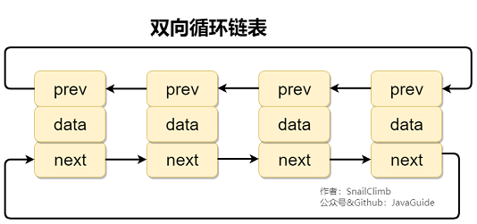

# LinkedList

## 单向列表

单向列表指每个节点都包含指向下一个节点的指针。

## 双向链表

双向链表的中间节点包含分别指向前后节点的指针，所以从任意位置开始都能快速访问其前后节点。

### 特点

- 创建双链表时无需指定链表的长度。
- 比起单链表，双链表需要多一个指针用于指向前驱节点，所以需要存储空间比单链表多一点。
- 双链表的插入和删除需要同时维护 next 和 prev 两个指针。
- 双链表中的元素访问需要通过顺序访问，即要通过遍历的方式来寻找元素。

## 双向循环链表

双向循环链表在双向列表的基础上，最后一个节点的 next 指向 head，而 head 的 prev 指向最后一个节点，构成一个环。

