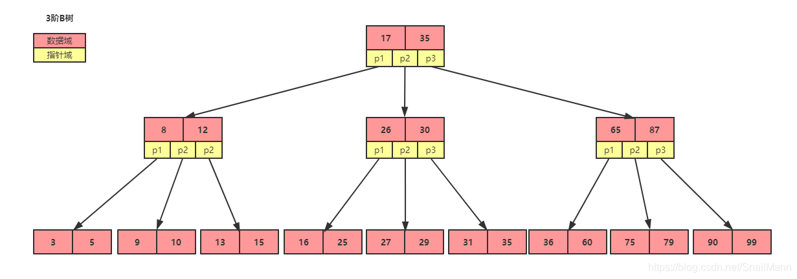

# 树结构

在树形结构中，数据搜索速度与高度有关，树越高，性能越差。树的节点元素必须可以比较，不能比较的元素无法构成一棵树。

## 二叉搜索树

### 定义

二叉搜索树（Binary Search Tree），又叫二叉查找树，二叉排序树，二分搜索|查找|排序树。二叉搜索树具备如下特点：

- 二叉搜索树也是一棵二叉树；
- 二叉搜索树的任意结点A， 其左子树的所有结点的值都小于结点A的值，其右子树的所有结点都大于结点A的值；
- 二叉搜索树的左右子树也是一棵二叉搜索树；
- 二叉搜索树没有值相等的结点。

### 缺陷

二叉搜索树无法控制根节点的取值，导致会出现树的倾斜或层级过深，此时查询效率近似于链表（时间复杂度为O(n)）。

## 平衡二叉搜索树

### 定义

平衡二叉搜索树（Self-balancing Binary Search Tree）是在二叉搜索树的基础上演变而来。又称为AVL树，因为AVL算法是最先发明的自平衡二叉搜索树算法，既是最早的平衡二叉搜索树的具体算法实现，在其他算法没有出来之前，AVL树也就称为了平衡二叉树搜索树的代名词。

平衡二叉搜索树具备如下特点：

- 每个节点的左右子树的高度之差不超过1，也可以说每个节点的平衡因子需在[-1,1]范围之内；
- 其每一个子树均为平衡二叉搜索树。

为了避免发生二叉搜索树中的树的倾斜情况，平衡二叉搜索树加上了自平衡的功能，让二叉搜索树可以经受住各种的插入和删除，依然保持左右子树的平衡，近似完全二叉树化，**让查找的时间复杂度稳定在O(log2n)。**

平衡二叉树相比于二叉树来说，查找效率更稳定，总体的查找速度也更快，但是并不是基于平衡二叉树构建索引就可以的。因为每个磁盘块只放一个节点，每个节点只放一组键值对，当数据过大的时候，二叉树的节点就会非常多，树的高度也会变高，查找的效率也会变低！

#### 节点的高

节点的高指的是**以当前该节点为根节点的子树的高，就是当前节点的高**。

#### 平衡因子

平衡二叉搜索树的每个结点的平衡因子需要满足在`[-1,1]`范围之内。平衡因子可以通过使用`左孩子的高 - 右孩子的高` 的方式去计算得到。

如上图所示：

- 结点A的平衡因子 = 结点B平衡因子 - 结点C平衡因子 = 2
- 结点G的平衡因子 = 结点I平衡因子 - 0 = 1
- 结点I的平衡因子 = 0 - 0 = 0

#### LL，RR，LR，RL

当新插入一个元素后，该树出现了不平衡现象，**那么根据新插入元素与向上回溯找到的第一个不平衡结点的相对位置，可以分为如下四种情况：**

- LL：新插入元素是在向上回溯找到的第一个不平衡结点的左孩子的左侧的情况；
- LR：新插入元素是在向上回溯找到的第一个不平衡结点的左孩子的右侧的情况；
- RR：新插入元素是在向上回溯找到的第一个不平衡结点的右孩子的右侧的情况；
- RL：新插入元素是在向上回溯找到的第一个不平衡结点的右孩子的左侧的情况；

#### 左旋，右旋

左旋，右旋指的是对不平衡结点进行类似向左旋转和向右旋转的操作，最终让整棵二叉搜索树得以满足平衡特性。因为对不平衡结点的动作，就像将该不平衡结点进行左边旋转或右边旋转。

**LL，LR，RR，RL四种情况下的解决方式：**

- LL：对不平衡结点y进行右旋操作即可（右旋）
- LR：先对不平衡结点y的左孩子x进行左旋操作，得到对结点y的LL情况，再对不平衡结点y进行右旋操作（先左旋，后右旋）
- RR：对不平衡结点y进行左旋操作即可（左旋）
- RL：选对不平衡结点y的右孩子x进行右旋操作，得到对结点y的RL情况，再对不平衡结点y进行左旋操作(先右旋，后左旋)

**以下是一个`LL`情况的左旋操作，最终的到一棵满足平衡的二叉搜索树**

**以下是一个`LR`的情况**

先通过左旋得到对节点y的LL情况，再按照LL情况进行右旋操作。

### 缺陷

平衡二叉搜索树相较于二叉搜索树而言，树的高度更平衡，避免出现树的倾斜。但是在数据量较多的情况下，平衡二叉搜索树的高度还是过高。

## 多路平衡多路查找树

### 定义

#### 数据域

B树中每个结点存储数据的地方，就称之为数据域。数据域中存储的数据通常是一个个的键值对，键值对就分为`键(key)`和`值(value)`，这里通常称键为`关键字`，**也通常会将`关键字`直接指代整个键值对**。

站在数据库索引的角度，关键字就是用于建立索引的字段值，而对应的值就是该关键字所对应的目的数据，可以是主键信息，也可以指向实际数据的地址，甚至是完整的一行数据。

#### 指针域

二叉搜索树的节点有两个指针，既左孩子指针和右孩子指针。而这两个指针所在的区域，就称之为指针域。

B类树并不是一棵二叉树，它是一棵多叉树。一棵B类树，可能有多个指针，每个的结点的所有的指针所在的区域就是指针域啦。

### B - Tree

它是一棵多路平衡多路查找树。

单节点可以存储多个键值对的二叉平衡树，就是B树。

B树相对于平衡二叉树，每个节点存储了更多的键值和数据，每个节点有更多的子节点，子节点的个数称为阶，上图就是一个3阶B树，高度也会很低，这样B树的查找磁盘次数也会很少，这样数据的查找效率就会比平衡二叉树高。

#### 特点

对于一棵m阶（m叉）B-Tree来说（m >= 2）：

- 非叶子节点的节点最少有ceil(m/2)个子节点，最多m个子节点；
- 节点上最少有ceil(m/2)-1个键，最多有m-1个键；
- 自平衡的数据结构，所有叶子节点都在同一层；
- 节点中的键值信息符合如下条件：
    - 键升序排序；
    - 指针指向子节点；
    - 节点中的键左边指针指向的键小于当前键，右边指针指向的键大于当前键。

#### 相比优势

相比二叉搜索树，高度/深度更低，自然查询效率更高。

### B + Tree

B+ 树是对B树的进一步优化。

B+ 树和B 树有什么不同

1. B+ 树非叶子节点non-leaf node 上是不存储数据的，仅存储键，而B 树的非叶子节点中不仅存储键，也会存储数据。B + 树之所以这么做的意义在于；树一个节点就是一个页，而数据库中页的大小是固定的，innodb 存储引擎默认一页为16kb，所以在页大小固定的前提下，能往一个页中放入更多的节点，相应的树的阶数就会更大，那么树的高度必然更矮更胖，如此一来我们查找数据进行磁盘io次数又会再次减少，数据查询的效率也会更快。

2. B+ 树的阶数是等于键的数量的，列如我们的B+ 树中每个节点可以存储3个键，3层B+ 树可以存储`3*3*3=9`个数据。所以如果我们的B+ 树一个节点可以存储1000个键值，那么3层B+ 树可以存储`1000*1000*1000=10亿`个数据。而一般节点是常驻内存的，所以一般我们查找出10亿数据，只需要2次磁盘IO。

3. 因为B+ 树索引的所有数据均存储在叶子节点leaf node ，而且数据是按照顺序排列的。那么B+ 树使得范围查找，排序查找，分组查找以及去重查找变得异常简单。而B 树因为数据分散在各个节点，要实现这一点是很不容易的。

	而且B+ 树中各个页之间也是通过双向链表连接的，叶子节点找那个的数据是通过单向链表连接的。其实在B 树中我们也可以多各个节点加上链表。其实这些不是它们之间的区别，是因为在mysql的innodb存储引擎中，索引及时这样存储的。也就是说B+ 树索引就是innodb中 B+ 树索引真正的实现方式，准确的说应该是聚集索引。

	在innodb中，我们通过数据页之间通过双向链表连接以及叶子节点中数据之间通过单向链表连接的方式可以找到表中所有的数据。

#### 特点

- B+树有两种类型的节点：内部结点（也称**索引结点**）和**叶子结点**。内部节点就是非叶子节点，内部节点不存储数据，只存储索引，数据都存储在叶子节点。
- 内部结点中的key都按照**从小到大**的顺序排列，对于内部结点中的一个key，左树中的所有key都小于它，右子树中的key都大于等于它。叶子结点中的记录也按照key的大小排列。
- 每个叶子结点都存有相邻叶子结点的指针，可以实现双向顺序访问，叶子结点本身依关键字的大小**自小而大**顺序链接。
- 父节点存有**右孩子的第一个元素的索引**。

#### 相比优势

- B+Tree的查询效率**更加稳定**。由于B+Tree只有叶子节点保存key信息，查询任何key都要从root走到叶子，所以更稳定。
- 只需遍历叶子节点，就可以实现整棵树的遍历。

#### B+Tree和B-Tree的区别

- B+Tree有n棵子树的结点中含有n个键值，B-Tree只有n-1个。
- B+Tree所有的键值信息只在叶子节点中包含，非叶子节点仅仅保存子节点的最小（或最大）值，和指向叶子节点的指针，这样相比B-Tree每一个节点在硬盘中存放了更少的内容（没有键值信息了）
- B+Tree所有叶子节点都有一个根据大小顺序指向下一个叶子节点的指针Q，本质上数据就是一个链表。

- 由于B+树的数据都存储在叶子结点中，叶子结点均为索引，方便扫库，只需要扫一遍叶子结点即可，但是B树因为其分支结点同样存储着数据，我们要找到具体的数据，需要进行一次中序遍历按序来扫，所以B+树更加适合在区间查询的情况，而在数据库中基于范围的查询是非常频繁的，所以通常B+树用于数据库索引。
- B+树的节点只存储索引key值，具体信息的地址存在于叶子节点的地址中。这就使以页为单位的索引中可以存放更多的节点。减少更多的I/O支出。
- B+树的查询效率更加稳定，任何关键字的查找必须走一条从根结点到叶子结点的路。所有关键字查询的路径长度相同，导致每一个数据的查询效率相当。

# 参考资料
- [Data Structure Visualizations](https://www.cs.usfca.edu/~galles/visualization/Algorithms.html)