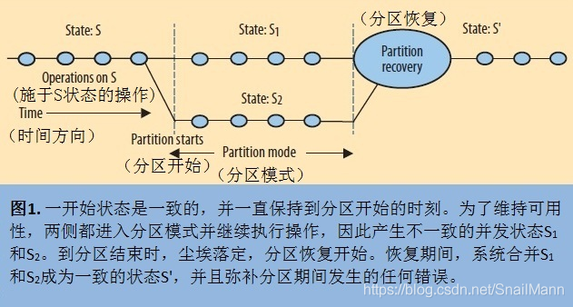

# CAP

CAP原理是现代分布式系统的理论基石，好比是分布式领域的牛顿定律。所有的分布式系统都是基于CAP理论来考虑和设计的。

>  CAP理论的核心重点就是描述了任何一个分布式系统最多只能满足以下三个特性中的两个。

## 基础概念

### 一致性

一致性，强一致性（Consistency），这里一致性的意思是在分布式系统中，对多副本数据的读操作总是能读到之前写操作完成的结果, 说白了就要满足强一致性; 比如一个数据有多个存储节点，我在A节点对数据做出了更新，而A节点需要将数据同步到节点B和节点C甚至更多，同步虽然快，但也需要一定的时间，如果这个时间段内有并发请求过来读取这个数据，请求被负载均衡，就有可能出现多个请求读取到的数据不一致的问题，这是因为有的请求可能会落到还未完成数据同步的节点上；一致性就是为了避免出现这样的情况。

### 可用性

可用性（Availability），即在某个组件的集群环境中，如果该组件的某个或多个节点发生了故障，在这些节点故障处理完之前，这个分布式系统也要能保证该组件能正常提供服务，不会因为部分节点的瘫痪而牵连整个服务；通常集群多副本环境本身就可以保证可用性，说白了就是保证服务的高可用。

### 分区容错性

分区容错性（Partition Tolerance），分区容错性是这里最不好理解的概念，但是也不复杂。我们知道现实生活中可能会出现机器故障，机房停电，网络故障等客观现象，而集群的环境更是增加了重现的概率。就是因为这些可能会出现的问题，从而导致某个时间段，集群节点数据出现分区现象，所以分区容错性的意思就是系统容忍短暂出现数据分区的情况，等故障修复，再进行分区数据整合，补偿分区时造成的错误，但在数据分区时无法保证数据强一致性或可用性
什么是数据分区？ 分区就是因为集群节点之前无法通信，比如机房A无法跟机房B通信，从而造成机房A的节点有部分机房B没有的新数据，而机房B的节点也有部分机房A没有的新数据，但碍于无法通信，所以无法数据同步，从而造成数据的分区，每个分区的数据都不完整，只有合并在一起才是一个完整的数据；但情况也不仅限于通信故障，就比如数据同步时间过长，也有可能发生数据分区，所以分区对通信时限有严格的要求，系统只要在指定时间内不能达成数据的一致性，比如通信故障，复制同步时间过长，就意味着可能会发生数据分区。

## 实践

### CA

单点部署的数据库，没有集群环境，必然可以保证数据的可用性和一致性。

MySQL一般被归类为CA，但也看设置情况，如果是主从同步复制，基本就符合CA，如果是异步复制，那就不一定满足CA了。

### CP

ZooKeeper就是CP的实践者，即任何时刻对ZooKeeper的访问请求能得到一致的数据结果，同时系统对网络分割具备容错性；但是它不能保证每次服务请求的可用性（就是在极端环境下，ZooKeeper可能会丢弃一些请求，消费者程序需要重新请求才能获得结果）。

Mongodb一般被归类为CP。

### AP

Eureka遵循的就是AP, 因为针对同一个服务，即使注册中心的不同节点保存的服务提供者信息不完全相同，但也并不会造成灾难性的后果，因为对于服务消费者来说，能消费才是最重要的，拿到的服务提供者即使不正错，大不了重试，那也好过因为无法获取服务提供者信息而不能去消费好。

## 扩展

### ACID中C与CAP定理中C的区别?

ACID理论和CAP理论都有一个C，也都叫一致性Consistent，这两个C是有区别的：

ACID的C指的是事务中的一致性，在一串对数据进行修改的操作中，保证数据的正确性。即数据在事务期间的多个操作中，数据不会凭空的消失或增加，数据的每一个增删改操作都是有因果关系的；比如用户A想用户B转了200块钱，不会出现用户A扣了款，而用户B没有收到的情况。

CAP的C则指的是分布式环境中，多服务之间的复制是异步，需要一定耗时的，不是即时瞬间完成。所以可能会造成某个节点的数据修改，将修改的数据同步到其他服务需要一定的时间，如果此时有并发请求过来，请求负载均衡到多个节点，可能会出现多个节点获取的数据不一致的问题，因为请求有可能会落在还没完成数据同步的节点上；而C就是为了做到在分布式集群环境读到的数据是一致的；当然这里的C也有分类，如强一致性，弱一致性，最终一致性。

即ACID的C着重强调单数据库事务操作时，要保证数据的完整和正确性；而CAP理论中的C指的是对一个数据多个备份的读写一致性。

### CAP理论的三选二的艰难抉择

总之CAP的理论核心就是C , A ,P不能共存，只可能三选二，以求最大能保证的有利利益

因为长时间无法达成数据一致性，就可能造成数据分区，所以要满足P，就必须在A和C做出选择：

(不去满足一致性C)即我不追求数据强一致性，在集群节点某时刻出现数据不一致的情况下，我可以去保证分区容错性，容忍分区的出现，之后再做补偿 , 即做到AP。

(不去满足可用性A)即在可能发生数据分区的时候，在故障解决之前，我去停止集群节点的对外服务，避免出现对数据的增，删，改操作，让数据不被改动，这样就不会导致数据的分区了,做到CP。

(不去满足分区容错性P)则代表当没有发生数据分区时，系统可以保证A和C，但是如果发生数据分区，因为不满足分区容错，即无法容忍分区的存在，就必定需要A,C二选一，最终只剩A或者C , 即 CA。

所以我们可以知道，CA - 单节点系统满足一致性，可用性，因为单节点，自然没有P的问题，但是没有扩展性，非常容易遇到性能瓶颈，其实本质上单节点系统也不需要考虑CAP问题。

CP - 满足一致性，分区容忍必的系统，通常性能不是特别高，因为为了保证数据强一致性，必须等待所有节点完成数据同步才能对外提供服务。

AP - 满足可用性，分区容忍性的系统，通常可能对一致性要求低一些，性能高，一般追求最终一致性

从上面看来，P几乎是必不可少的，因为AC最终会退化成A或C，除非选择做一个单节点服务，但这样也就不是分布式集群系统了，CAP理论就没有卵子用了， 所以AC几乎就是一个最不好的选择，所以通常情况下的实践都是在CP或AP中做出选择。

### 强一致性，弱一致性，最终一致性

### 强一致性

强一致性就是在任何时刻都从集群节点中获取的数据都是一致性

- 原子一致性
- 线性一致性

### 弱一致性

系统中的某个数据被更新后，后续对该数据的读取操作可能得到更新后的值，也可能是更改前的值。可以有多种实现方式。

- 最终一致性
    最终一致性是弱一致性的一种形式，就是不保证在任意时刻任意节点上的同一份数据都是相同的，但是随着时间的迁移，不同节点上的同一份数据总是在向趋同的方向变化；总之就是一段时间后，集群节点的数据会最终达到一致状态。

- 因果一致性
    如果进程A通知进程B它已更新了一个数据项，那么进程B的后续访问将获得的是进程A更新后的值

- 读己之所写一致性
    当进程A自己更新一个数据项之后，它肯定会访问到自己更新过的值，绝不会看到旧值。这是因果一致性模型的一个特例。

- 会话一致性
    这是上一个模型的实用版本，它把访问存储系统的进程放到会话的上下文中。只要会话还存在，系统就保证“读己之所写”一致性。如果由于某些失败情形令会话终止，就要建立新的会话，而且系统的保证不会延续到新的会话。

- 单调读一致性
    如果进程已经看到过数据对象的某个值，那么任何后续访问都不会返回在那个值之前的值。

- 单调写一致性
    系统保证来自同一个进程的写操作顺序执行。要是系统不能保证这种程度的一致性，就非常难以编程了

    

我们知道强一致性就是C嘛，通常在保证AP的分布式系统中，都是通过选择最终一致性来弥补数据分区期间的造成的错误，也就是忽略因出现故障或数据同步未完成而导致的数据分区情况，在故障解决后，或数据同步后对分区时期造成的影响做数据补偿和合并，这样就可以弥补分区期间发生的任何错误

## 总结

分区是常态，无法避免，CAP三者不可共存，所以必然是三选二。

可用性和一致性是一对冤家，正是因为要做到高可用，所以才会出现不一致性(就因为存在了多个节点，才会出现数据复制和通信问题)；也正是因为出现不一致性，才可能要停止集群服务，防止出现分区。

很多情况，一些实践者并不完全的去追求CP或是AP, 他们可能是尽量的去保证可用性，也尽量的去保证一致性，同时又满足一定的分区。

# BASE

BASE理论就是对CAP理论中的一致性和可用性权衡之后的结果，指的就是分布式系统中，如果无法做到强一致性，那么就用最终一致性去代替，让分布式系统满足三个特性：

- 基本可用（Basically Available）
- 软状态（Soft State）
- 最终一致性（Eventual Consistency）
    

> `eBay`的架构师`Dan Pritchett`源于对大规模分布式系统的实践总结，在`ACM`上发表文章提出`BASE`理论，`BASE`理论是对`CAP`理论的延伸，**核心思想**就是分布式系统如果无法做到强一致性，那么就要根据自身情况，采用适合的方式让系统做到最终一致性。

## 基础概念

### 基本可用

`基本可用`（Basically Available）的意思就是分布式系统如果出现不可预知的故障时，允许损失部分的可用性，但并不是整个系统都不可用，即保证系统核心服务可用即可；比如实际开发中，出现部分服务故障，我们可以让系统的响应时间适当变长，或者限流，降低消费，甚至是服务降级，让某个服务暂时无法提供服务。

### 软状态

`软状态`（Soft State）就是指系统中的数据可以存在中间状态， 并该中间状态不会影响到系统的可用性；换个说法就是允许系统中部分结点的数据同步存在时延问题，但这个时延不会影响到系统的可用性。

### 最终一致性

`最终一致性`（Eventual Consistency）强调的是所有的数据副本，在经过一段时间的同步之后，最终都能够达到数据一致的状态。既最终一致性的本质是需要系统保证数据的最终一致性，而不每时每刻的强一致性。但也要保证非一致窗口时期不会对系统数据造成危害。

## 扩展

### BASE与ACID

ACID是传统数据库常用的设计理念，追求强一致性模型，例如银行的转账场景，最求数据的绝对可靠。而BASE支持的是大型分布式系统，提出通过牺牲强一致性获得高可用性。

虽然ACID和BASE代表了两种截然相反的设计哲学，在分布式系统设计的场景中，系统组件对一致性要求是不同的，因此ACID和BASE又会结合使用

## 总结

总的来说，BASE理论面向的是大型高可用可扩展的分布式系统，是对CAP理论的一些弱化和妥协，为了保证可用性，对强一致性进行了削弱。

在了解了CAP和BASE理论之后，就可以自己去了解一下Redis, MongoDB, MySQL这些数据库怎么处理集群状态下的数据复制了，相信这也是一个很好的加深基础的问题；同时也可以去了解一下通常系统是怎么去实现最终一致性的，怎么解决非一致性窗口期间出现一些数据问题。
