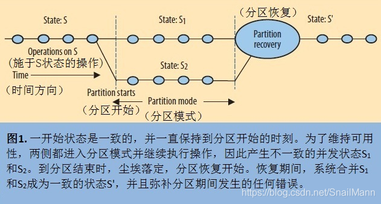
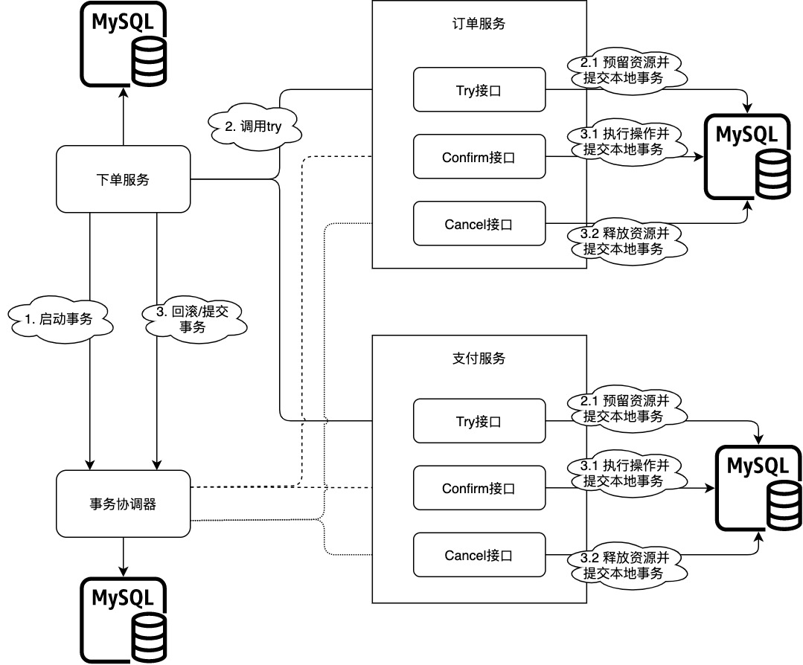
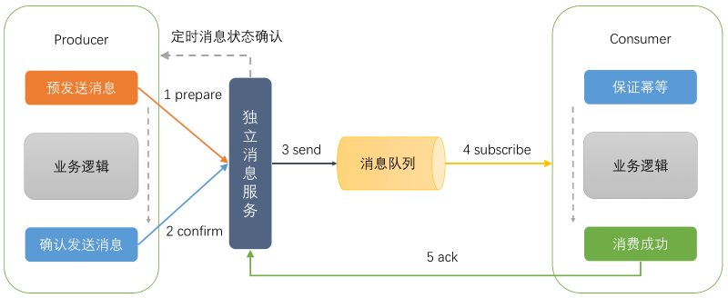
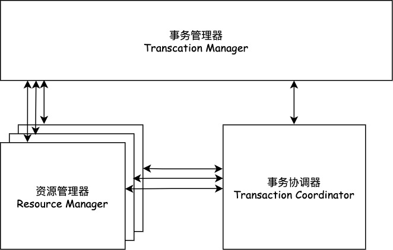
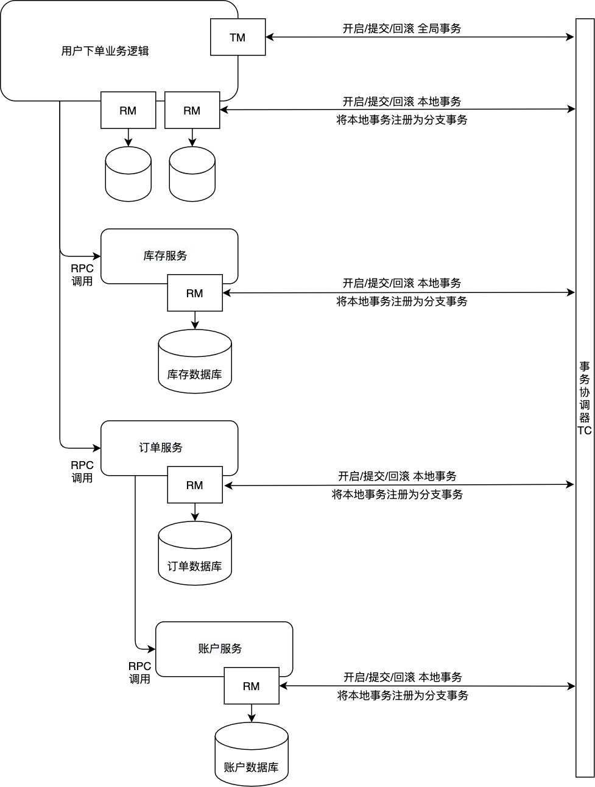

# 分布式理论
## CAP

当我们的单个数据库的性能产生瓶颈的时候，我们可能会对数据库进行分区，这里所说的分区指的是物理分区，分区之后可能不同的库就处于不同的服务器上了，这个时候单个数据库的ACID已经不能适应这种情况了，而在这种ACID的集群环境下，再想保证集群的ACID几乎是很难达到，或者即使能达到那么效率和性能会大幅下降，最为关键的是再很难扩展新的分区了，这个时候如果再追求集群的ACID会导致我们的系统变得很差，这时我们就需要引入一个新的理论原则来适应这种集群的情况，就是CAP原则或者叫CAP定理？

CAP原理是现代分布式系统的理论基石，所有的分布式系统都是基于CAP理论来考虑和设计的。**CAP理论的核心重点就是描述了任何一个分布式系统最多只能满足以下三个特性中的两个。**


### 基础概念

#### 一致性

一致性，强一致性（Consistency），这里一致性的意思是在分布式系统中，对多副本数据的读操作总是能读到之前写操作完成的结果, 说白了就要满足强一致性; 比如一个数据有多个存储节点，我在A节点对数据做出了更新，而A节点需要将数据同步到节点B和节点C甚至更多，同步虽然快，但也需要一定的时间，如果这个时间段内有并发请求过来读取这个数据，请求被负载均衡，就有可能出现多个请求读取到的数据不一致的问题，这是因为有的请求可能会落到还未完成数据同步的节点上；一致性就是为了避免出现这样的情况。


#### 可用性

可用性（Availability），即在某个组件的集群环境中，如果该组件的某个或多个节点发生了故障，在这些节点故障处理完之前，这个分布式系统也要能保证该组件能正常提供服务，不会因为部分节点的瘫痪而牵连整个服务；通常集群多副本环境本身就可以保证可用性，说白了就是保证服务的高可用。


#### 分区容错性

分区容错性（Partition Tolerance），现实生活中可能会出现机器故障，机房停电，网络故障等客观现象，而集群的环境更是增加了重现的概率。就是因为这些可能会出现的问题，从而导致某个时间段，集群节点数据出现分区现象，所以分区容错性的意思就是**系统容忍短暂出现数据分区的情况，等故障修复，再进行分区数据整合，补偿分区时造成的错误，但在数据分区时无法保证数据强一致性或可用性。**

什么是数据分区？ 分区就是因为集群节点之前无法通信，比如机房A无法跟机房B通信，从而造成机房A的节点有部分机房B没有的新数据，而机房B的节点也有部分机房A没有的新数据，但碍于无法通信，所以无法数据同步，从而造成数据的分区，每个分区的数据都不完整，只有合并在一起才是一个完整的数据；但情况也不仅限于通信故障，就比如数据同步时间过长，也有可能发生数据分区，所以分区对通信时限有严格的要求，系统只要在指定时间内不能达成数据的一致性，比如通信故障，复制同步时间过长，就意味着可能会发生数据分区。





### 实践

#### CA

单点部署的数据库，没有集群环境，必然可以保证数据的可用性和一致性。

MySQL一般被归类为CA，但也看设置情况，如果是主从同步复制，基本就符合CA，如果是异步复制，那就不一定满足CA了。


#### CP

ZooKeeper就是CP的实践者，即任何时刻对ZooKeeper的访问请求能得到一致的数据结果，同时系统对网络分割具备容错性；但是它不能保证每次服务请求的可用性（就是在极端环境下，ZooKeeper可能会丢弃一些请求，消费者程序需要重新请求才能获得结果）。

Mongodb一般被归类为CP。


#### AP

Eureka遵循的就是AP, 因为针对同一个服务，即使注册中心的不同节点保存的服务提供者信息不完全相同，但也并不会造成灾难性的后果，因为对于服务消费者来说，能消费才是最重要的，拿到的服务提供者即使不正错，大不了重试，那也好过因为无法获取服务提供者信息而不能去消费好。


### 扩展

#### ACID中C与CAP定理中C的区别?

ACID理论和CAP理论都有一个C，也都叫一致性Consistent，这两个C是有区别的：

ACID的C指的是事务中的一致性，在一串对数据进行修改的操作中，保证数据的正确性。即数据在事务期间的多个操作中，数据不会凭空的消失或增加，数据的每一个增删改操作都是有因果关系的；比如用户A想用户B转了200块钱，不会出现用户A扣了款，而用户B没有收到的情况。

CAP的C则指的是分布式环境中，多服务之间的复制是异步，需要一定耗时的，不是即时瞬间完成。所以可能会造成某个节点的数据修改，将修改的数据同步到其他服务需要一定的时间，如果此时有并发请求过来，请求负载均衡到多个节点，可能会出现多个节点获取的数据不一致的问题，因为请求有可能会落在还没完成数据同步的节点上；而C就是为了做到在分布式集群环境读到的数据是一致的；当然这里的C也有分类，如强一致性，弱一致性，最终一致性。

即ACID的C着重强调单数据库事务操作时，要保证数据的完整和正确性；而CAP理论中的C指的是对一个数据多个备份的读写一致性。


#### CAP理论的三选二的艰难抉择

总之CAP的理论核心就是C , A ,P不能共存，只可能三选二，以求最大能保证的有利利益

因为长时间无法达成数据一致性，就可能造成数据分区，所以要满足P，就必须在A和C做出选择：

(不去满足一致性C)即我不追求数据强一致性，在集群节点某时刻出现数据不一致的情况下，我可以去保证分区容错性，容忍分区的出现，之后再做补偿 , 即做到AP。

(不去满足可用性A)即在可能发生数据分区的时候，在故障解决之前，我去停止集群节点的对外服务，避免出现对数据的增，删，改操作，让数据不被改动，这样就不会导致数据的分区了,做到CP。

(不去满足分区容错性P)则代表当没有发生数据分区时，系统可以保证A和C，但是如果发生数据分区，因为不满足分区容错，即无法容忍分区的存在，就必定需要A,C二选一，最终只剩A或者C , 即 CA。

所以我们可以知道，CA - 单节点系统满足一致性，可用性，因为单节点，自然没有P的问题，但是没有扩展性，非常容易遇到性能瓶颈，其实本质上单节点系统也不需要考虑CAP问题。

CP - 满足一致性，分区容忍必的系统，通常性能不是特别高，因为为了保证数据强一致性，必须等待所有节点完成数据同步才能对外提供服务。

AP - 满足可用性，分区容忍性的系统，通常可能对一致性要求低一些，性能高，一般追求最终一致性

从上面看来，P几乎是必不可少的，因为AC最终会退化成A或C，除非选择做一个单节点服务，但这样也就不是分布式集群系统了，CAP理论就没有卵子用了， 所以AC几乎就是一个最不好的选择，所以通常情况下的实践都是在CP或AP中做出选择。


#### 强一致性

强一致性就是在任何时刻都从集群节点中获取的数据都是一致性

- 原子一致性
- 线性一致性


#### 弱一致性

系统中的某个数据被更新后，后续对该数据的读取操作可能得到更新后的值，也可能是更改前的值。可以有多种实现方式。

- 最终一致性
    最终一致性是弱一致性的一种形式，就是不保证在任意时刻任意节点上的同一份数据都是相同的，但是随着时间的迁移，不同节点上的同一份数据总是在向趋同的方向变化；总之就是一段时间后，集群节点的数据会最终达到一致状态。

- 因果一致性
    如果进程A通知进程B它已更新了一个数据项，那么进程B的后续访问将获得的是进程A更新后的值

- 读己之所写一致性
    当进程A自己更新一个数据项之后，它肯定会访问到自己更新过的值，绝不会看到旧值。这是因果一致性模型的一个特例。

- 会话一致性
    这是上一个模型的实用版本，它把访问存储系统的进程放到会话的上下文中。只要会话还存在，系统就保证“读己之所写”一致性。如果由于某些失败情形令会话终止，就要建立新的会话，而且系统的保证不会延续到新的会话。

- 单调读一致性
    如果进程已经看到过数据对象的某个值，那么任何后续访问都不会返回在那个值之前的值。

- 单调写一致性
    系统保证来自同一个进程的写操作顺序执行。要是系统不能保证这种程度的一致性，就非常难以编程了

    

我们知道强一致性就是C嘛，通常在保证AP的分布式系统中，都是通过选择最终一致性来弥补数据分区期间的造成的错误，也就是忽略因出现故障或数据同步未完成而导致的数据分区情况，在故障解决后，或数据同步后对分区时期造成的影响做数据补偿和合并，这样就可以弥补分区期间发生的任何错误。


### 总结

分区是常态，无法避免，CAP三者不可共存，所以必然是三选二。

可用性和一致性是一对冤家，正是因为要做到高可用，所以才会出现不一致性。就因为存在了多个节点，才会出现数据复制和通信问题)；也正是因为出现不一致性，才可能要停止集群服务，防止出现分区。

很多情况，一些实践者并不完全的去追求CP或是AP, 他们可能是尽量的去保证可用性，也尽量的去保证一致性，同时又满足一定的分区。


对于互联网来说，由于网络环境是不可信的，所以分区容错性（P）必须满足。为了用户体验，先选可用性。


## BASE

BASE理论就是对CAP理论中的一致性和可用性权衡之后的结果，指的就是分布式系统中，如果无法做到强一致性，那么就用最终一致性去代替，让分布式系统满足三个特性：

- 基本可用（Basically Available）
- 软状态（Soft State）
- 最终一致性（Eventual Consistency）


### 基础概念

#### 基本可用

`基本可用`（Basically Available）的意思就是分布式系统如果出现不可预知的故障时，允许损失部分的可用性，但并不是整个系统都不可用，即保证系统核心服务可用即可；比如实际开发中，出现部分服务故障，我们可以让系统的响应时间适当变长，或者限流，降低消费，甚至是服务降级，让某个服务暂时无法提供服务。


#### 软状态

软状态（Soft State）指系统中的数据可以存在中间状态， 并该中间状态不会影响到系统的可用性，即允许部分节点的数据存在延迟问题。


#### 最终一致性

最终一致性（Eventual Consistency）强调的是所有的数据副本，在经过一段时间的同步之后，最终都能够达到数据一致的状态。既最终一致性的本质是需要系统保证数据的最终一致性，而不每时每刻的强一致性。但也要保证非一致窗口时期不会对系统数据造成危害。


> 其实只有两类数据一致性，强一致性与弱一致性。强一致性也叫做线性一致性，除此以外，所有其他的一致性都是弱一致性的特殊情况。强一致性，即复制是同步的，弱一致性，即复制是异步的。
>
> 用户更新网站头像，在某个时间点，用户向主库发送更新请求，不久之后主库就收到了请求。在某个时刻，主库又会将数据变更转发给自己的从库。最后，主库通知用户更新成功。如果主库需要等待从库的确认，确保从库已经收到写入操作，那么复制是同步的，即强一致性。如果主库写入成功后，不等待从库的响应，直接返回，则复制是异步的，即弱一致性。
>
> 强一致性可以保证从库有与主库一致的数据。如果主库突然宕机，仍可以保证数据完整。但如果从库宕机或网络阻塞，主库就无法完成写入操作。


### 扩展

#### BASE与ACID

ACID是传统数据库常用的设计理念，追求强一致性模型，例如银行的转账场景，最求数据的绝对可靠。而BASE支持的是大型分布式系统，提出通过牺牲强一致性获得高可用性。

虽然ACID和BASE代表了两种截然相反的设计哲学，在分布式系统设计的场景中，系统组件对一致性要求是不同的，因此ACID和BASE又会结合使用


### 总结

总的来说，BASE理论面向的是大型高可用可扩展的分布式系统，是对CAP理论的一些弱化和妥协，为了保证可用性，对强一致性进行了削弱。

在了解了CAP和BASE理论之后，就可以自己去了解一下Redis, MongoDB, MySQL这些数据库怎么处理集群状态下的数据复制了，相信这也是一个很好的加深基础的问题；同时也可以去了解一下通常系统是怎么去实现最终一致性的，怎么解决非一致性窗口期间出现一些数据问题。

# 分布式锁

在一个分布式系统中，由于涉及到多个实例同时对同一个资源加锁的问题，像传统的synchronized、ReentrantLock等单进程情况加锁的api就不再适用，需要使用分布式锁来保证多服务实例之间加锁的安全性。常见的分布式锁的实现方式有zookeeper和redis等。而由于redis分布式锁相对于比较简单，在实际的项目中，redis分布式锁被用于很多实际的业务场景中。


## 概述

### 基础规范

#### 保证加锁的原子性


#### 锁的过期时间

设置锁的过期时间主要原因是为了防止死锁。当某个客户端获取到锁，还没来得及主动释放锁，那么此时假如客户端宕机了，又或者是释放锁失败了，那么如果没有设置过期时间，那么这个锁key会一直在，那么其它线程来加锁的时候会发现key已经被加锁了，那么其它线程一直会加锁失败，就会产生死锁的问题。


#### 手动释放锁

当业务执行完成之后，肯定需要手动释放锁，那么为什么需要主动释放锁呢？

第一，假设你任务执行完，没有手动释放锁，如果没有指定锁的超时时间，那么因为有看门狗机制，势必会导致这个锁无法释放，那么就可能造成**死锁**的问题。

第二，如果你指定了锁超时时间，虽然并不会造成死锁的问题，但是会造成**资源浪费**的问题。假设你设置的过期时间是30s，但是你的任务2s就完成了，那么这个锁还会白白被占有28s的时间，这28s内其它线程都无法成功加锁。


#### 超时自动释放

通过设置超时时间，分布式锁在一定时间后会自动释放锁。

指定超时时间达到超时释放锁的功能主要还是通过redis自动过期来实现，因为指定了超时时间，加锁成功之后就不会开启watchdog机制来延长加锁的时间。

在实际项目中，指不指定锁的超时时间是根据具体的业务来的，如果你能够比较准确的预估出代码执行的时间，那么可以指定锁超时释放时间来防止业务执行错误导致无法释放锁的问题，如果不能预估出代码执行的时间，那么可以不指定超时时间。


### 存在风险

对于单Redis实例来说，如果Redis宕机了，那么整个系统就无法工作了。所以为了保证Redis的高可用性，一般会使用主从或者哨兵模式。但是如果使用了主从或者哨兵模式，此时Redis的分布式锁的功能可能就会出现问题。


## Redisson分布式锁

说到redis的分布式锁，可能第一时间就想到了setNx命令，这个命令保证一个key同时只能有一个线程设置成功，这样就能实现加锁的互斥性。但是Redisson并没有通过setNx命令来实现加锁，而是自己实现了一套完成的加锁的逻辑。


### 非公平锁

#### 实现流程


#### 实现原理

##### 看门狗机制

Redisson对于这种未指定超时时间的加锁，就实现了一个叫watchdog机制，也就是看门狗机制来自动延长加锁的时间。

在客户端通过tryLockInnerAsync方法加锁成功之后，如果你没有指定锁过期的时间，那么客户端会起一个定时任务，来定时延长加锁时间，默认每10s执行一次。所以watchdog的本质其实就是一个定时任务。

因为有了看门狗机制，所以说如果没有设置过期时间并且没有主动去释放锁，那么这个锁就永远不会被释放，因为定时任务会不断的去延长锁的过期时间，造成死锁的问题。但是如果发生宕机了，是不会造成死锁的，因为宕机了，服务都没了，那么看门狗的这个定时任务就没了，也自然不会去续约，等锁自动过期了也就自动释放锁了，跟上述说的为什么需要设置过期时间是一样的。


##### 可重入锁

可重入加锁的意思就是同一个客户端同一个线程也能多次对同一个锁进行加锁。也就是同时可以执行多次 lock方法，流程都是一样的，最后也会调用到lua脚本，所以可重入加锁的逻辑最后也是通过加锁的lua脚本来实现的。


##### 不同线程加锁互斥

上面我们分析了第一次加锁逻辑和可重入加锁的逻辑，因为lua脚本加锁的逻辑同时只有一个线程能够执行（redis是单线程的原因），所以一旦有线程加锁成功，那么另一个线程来加锁，前面两个if条件都不成立，最后通过调用redis的pttl命令返回锁的剩余的过期时间回去。

这样，客户端就根据返回值来判断是否加锁成功，因为第一次加锁和可重入加锁的返回值都是nil，而加锁失败就返回了锁的剩余过期时间。

所以加锁的lua脚本通过条件判断就实现了加锁的互斥操作，保证其它线程无法加锁成功。总的来说，加锁的lua脚本实现了第一次加锁、可重入加锁和加锁互斥的逻辑。


##### 阻塞等待加锁

通过执行死循环（自旋）地的方式来不停地通过tryAcquire方法来尝试加锁，直到加锁成功之后才会跳出死循环，如果一直没有成功加锁，那么就会一直旋转下去，所谓的阻塞，实际上就是自旋加锁的方式。

但是这种阻塞可能会产生问题，因为如果其它线程释放锁失败，那么这个阻塞加锁的线程会一直阻塞加锁，这肯定会出问题的。


##### 超时放弃加锁

超时放弃加锁指的是在指定时间内不断尝试加锁，直到超出指定时间后放弃加锁。


##### 超时自动释放

通过传入leaseTime参数就可以指定锁超时的时间，达到指定时间后就会释放锁。

无论指不指定超时时间，最终其实都会调用tryAcquireAsync方法，只不过当不指定超时时间时，leaseTime传入的是-1，也就是代表不指定超时时间，但是Redisson默认还是会设置30s的过期时间；当指定超时时间，那么leaseTime就是我们自己指定的时间，最终也是通过同一个加锁的lua脚本逻辑。

指定和不指定超时时间的主要区别是，加锁成功之后的逻辑不一样，不指定超时时间时，会开启watchdog后台线程，不断的续约加锁时间，而指定超时时间，就不会去开启watchdog定时任务，这样就不会续约，加锁key到了过期时间就会自动删除，也就达到了释放锁的目的。


#### 源码解析

```java
    public void updateByNoFairLock() {
        RLock lock = redissonClient.getLock("noFairLockName");
        try {
            lock.lock();
            // business function
        } finally {
            lock.unlock();
        }
    }
```


##### 获取锁

> org.redisson.Redisson

```java
   /**
     * 根据name返回Lock实例
     * 实现了非公平锁，因此不保证依据线程的顺序
     */
    @Override
    public RLock getLock(String name) {
        return new RedissonLock(connectionManager.getCommandExecutor(), name);
    }
```


##### 添加锁

###### 阻塞式加锁

> org.redisson.RedissonLock

```java
    @Override
    public void lock() {
        try {
            lock(-1, null, false);
        } catch (InterruptedException e) {
            throw new IllegalStateException();
        }
    }

    @Override
    public void lock(long leaseTime, TimeUnit unit) {
        try {
          	// 通过指定 leaseTime 表示超过该时间自动释放锁
            lock(leaseTime, unit, false);
        } catch (InterruptedException e) {
            throw new IllegalStateException();
        }
    }

    private void lock(long leaseTime, TimeUnit unit, boolean interruptibly) throws InterruptedException {
        long threadId = Thread.currentThread().getId();
        Long ttl = tryAcquire(leaseTime, unit, threadId);
        // lock acquired
        if (ttl == null) {
            return;
        }

        RFuture<RedissonLockEntry> future = subscribe(threadId);
        commandExecutor.syncSubscription(future);

        try {
            while (true) {
                // 自旋阻塞方式不停尝试加锁
                ttl = tryAcquire(leaseTime, unit, threadId);
                // lock acquired
                if (ttl == null) {
                    break;
                }

                // waiting for message
                if (ttl >= 0) {
                    try {
                        getEntry(threadId).getLatch().tryAcquire(ttl, TimeUnit.MILLISECONDS);
                    } catch (InterruptedException e) {
                        if (interruptibly) {
                            throw e;
                        }
                        getEntry(threadId).getLatch().tryAcquire(ttl, TimeUnit.MILLISECONDS);
                    }
                } else {
                    if (interruptibly) {
                        getEntry(threadId).getLatch().acquire();
                    } else {
                        getEntry(threadId).getLatch().acquireUninterruptibly();
                    }
                }
            }
        } finally {
            unsubscribe(future, threadId);
        }
//        get(lockAsync(leaseTime, unit));
    }

    /*
     * 异步转同步的过程
     */
    private Long tryAcquire(long leaseTime, TimeUnit unit, long threadId) {
        return get(tryAcquireAsync(leaseTime, unit, threadId));
    }

    protected final <V> V get(RFuture<V> future) {
        return commandExecutor.get(future);
    }

    /*
     * 异步加锁
     */
    private <T> RFuture<Long> tryAcquireAsync(long leaseTime, TimeUnit unit, long threadId) {
        if (leaseTime != -1) {
            // 不设置过期时间
            return tryLockInnerAsync(leaseTime, unit, threadId, RedisCommands.EVAL_LONG);
        }
        RFuture<Long> ttlRemainingFuture = tryLockInnerAsync(commandExecutor.getConnectionManager().getCfg().getLockWatchdogTimeout(), TimeUnit.MILLISECONDS, threadId, RedisCommands.EVAL_LONG);
        ttlRemainingFuture.onComplete((ttlRemaining, e) -> {
            if (e != null) {
                return;
            }

            // lock acquired
            if (ttlRemaining == null) {
                // 看门狗机制，只有不设置过期时间才会启动看门狗进行自动延期
                scheduleExpirationRenewal(threadId);
            }
        });
        return ttlRemainingFuture;
    }
```


###### 超时放弃式加锁

```java
    @Override
    public boolean tryLock(long waitTime, TimeUnit unit) throws InterruptedException {
        return tryLock(waitTime, -1, unit);
    }

    @Override
    public boolean tryLock(long waitTime, long leaseTime, TimeUnit unit) throws InterruptedException {
        long time = unit.toMillis(waitTime);
        long current = System.currentTimeMillis();
        long threadId = Thread.currentThread().getId();
        Long ttl = tryAcquire(leaseTime, unit, threadId);
        // lock acquired
        if (ttl == null) {
            return true;
        }
        
        // 判断是否超时
        time -= System.currentTimeMillis() - current;
        if (time <= 0) {
            acquireFailed(threadId);
            return false;
        }
        
        current = System.currentTimeMillis();
        RFuture<RedissonLockEntry> subscribeFuture = subscribe(threadId);
        if (!subscribeFuture.await(time, TimeUnit.MILLISECONDS)) {
            if (!subscribeFuture.cancel(false)) {
                subscribeFuture.onComplete((res, e) -> {
                    if (e == null) {
                        unsubscribe(subscribeFuture, threadId);
                    }
                });
            }
            acquireFailed(threadId);
            return false;
        }

        try {
            // 自旋加锁前判断是否超时，超时则不再尝试加锁
            time -= System.currentTimeMillis() - current;
            if (time <= 0) {
                acquireFailed(threadId);
                return false;
            }
        
            while (true) {
                long currentTime = System.currentTimeMillis();
                ttl = tryAcquire(leaseTime, unit, threadId);
                // lock acquired
                if (ttl == null) {
                    return true;
                }

                // 判断是否超时，超时了就放弃加锁，推出循环
                time -= System.currentTimeMillis() - currentTime;
                if (time <= 0) {
                    acquireFailed(threadId);
                    return false;
                }

                // waiting for message
                currentTime = System.currentTimeMillis();
                if (ttl >= 0 && ttl < time) {
                    getEntry(threadId).getLatch().tryAcquire(ttl, TimeUnit.MILLISECONDS);
                } else {
                    getEntry(threadId).getLatch().tryAcquire(time, TimeUnit.MILLISECONDS);
                }

                // 判断是否超时，超时了就放弃加锁，推出循环
                time -= System.currentTimeMillis() - currentTime;
                if (time <= 0) {
                    acquireFailed(threadId);
                    return false;
                }
            }
        } finally {
            unsubscribe(subscribeFuture, threadId);
        }
//        return get(tryLockAsync(waitTime, leaseTime, unit));
    }
```


###### 看门狗机制

> org.redisson.RedissonLock

```java
    private void scheduleExpirationRenewal(long threadId) {
        ExpirationEntry entry = new ExpirationEntry();
        ExpirationEntry oldEntry = EXPIRATION_RENEWAL_MAP.putIfAbsent(getEntryName(), entry);
        if (oldEntry != null) {
            oldEntry.addThreadId(threadId);
        } else {
            entry.addThreadId(threadId);
            renewExpiration();
        }
    }

    private void renewExpiration() {
        ExpirationEntry ee = EXPIRATION_RENEWAL_MAP.get(getEntryName());
        if (ee == null) {
            return;
        }
        
        Timeout task = commandExecutor.getConnectionManager().newTimeout(new TimerTask() {
            @Override
            public void run(Timeout timeout) throws Exception {
                ExpirationEntry ent = EXPIRATION_RENEWAL_MAP.get(getEntryName());
                if (ent == null) {
                    return;
                }
                Long threadId = ent.getFirstThreadId();
                if (threadId == null) {
                    return;
                }
                // 定期执行如下方法，使用lua脚本来实现加锁时间的延长
                RFuture<Boolean> future = renewExpirationAsync(threadId);
                future.onComplete((res, e) -> {
                    if (e != null) {
                        log.error("Can't update lock " + getName() + " expiration", e);
                        return;
                    }
                    
                    if (res) {
                        // 递归执行自身
                        renewExpiration();
                    }
                });
            }
        }, internalLockLeaseTime / 3, TimeUnit.MILLISECONDS);
        
        ee.setTimeout(task);
    }
```


internalLockLeaseTime 默认值是 30 * 1000，所以看门狗机制是默认每10秒执行一次。


> org.redisson.RedissonLock

```java
    protected RFuture<Boolean> renewExpirationAsync(long threadId) {
        return commandExecutor.evalWriteAsync(getName(), LongCodec.INSTANCE, RedisCommands.EVAL_BOOLEAN,
                "if (redis.call('hexists', KEYS[1], ARGV[2]) == 1) then " +
                    "redis.call('pexpire', KEYS[1], ARGV[1]); " +
                    "return 1; " +
                "end; " +
                "return 0;",
            Collections.<Object>singletonList(getName()), 
            internalLockLeaseTime, getLockName(threadId));
    }
```


这段lua脚本中参数的意思其实是跟加锁的参数的意思是一样的：

- KEYS[1]：就是锁的名称
- ARGV[1]：就是锁的过期时间
- ARGV[2]：代表了加锁的唯一标识，b983c153-7421-469a-addb-44fb92259a1b:1。

这段lua脚本的意思就是判断来续约的线程跟加锁的线程是同一个，如果是同一个，那么将锁的过期时间延长到30s，然后返回1，代表续约成功，不是的话就返回0，代表续约失败，下一次定时任务也就不会执行了。


###### LUA脚本加锁

> org.redisson.RedissonLock

```java
    <T> RFuture<T> tryLockInnerAsync(long leaseTime, TimeUnit unit, long threadId, RedisStrictCommand<T> command) {
        internalLockLeaseTime = unit.toMillis(leaseTime);

        return commandExecutor.evalWriteAsync(getName(), LongCodec.INSTANCE, command,
                  "if (redis.call('exists', KEYS[1]) == 0) then " +
                      "redis.call('hset', KEYS[1], ARGV[2], 1); " +
                      "redis.call('pexpire', KEYS[1], ARGV[1]); " +
                      "return nil; " +
                  "end; " +
                  "if (redis.call('hexists', KEYS[1], ARGV[2]) == 1) then " +
                      "redis.call('hincrby', KEYS[1], ARGV[2], 1); " +
                      "redis.call('pexpire', KEYS[1], ARGV[1]); " +
                      "return nil; " +
                  "end; " +
                  "return redis.call('pttl', KEYS[1]);",
                    Collections.<Object>singletonList(getName()), internalLockLeaseTime, getLockName(threadId));
    }
```


其中这段脚本中的lua脚本中的参数的意思：

- KEYS[1]：就是锁的名称
- ARGV[1]：就是锁的过期时间，不指定的话默认是30s
- ARGV[2]：代表了加锁的唯一标识，由UUID和线程id组成。一个Redisson客户端一个UUID，UUID代表了一个唯一的客户端。所以由UUID和线程id组成了加锁的唯一标识，可以理解为某个客户端的某个线程加锁。


LUA的加锁的逻辑。

1）先调用redis的exists命令判断加锁的key存不存在，如果不存在的话，那么就进入if。不存在的意思就是还没有某个客户端的某个线程来加锁，第一次加锁肯定没有人来加锁，于是第一次if条件成立。


2）然后调用redis的hincrby的命令，设置加锁的key和加锁的某个客户端的某个线程，加锁次数设置为1，加锁次数很关键，是实现可重入锁特性的一个关键数据。用hash数据结构保存。hincrby命令完成后就形成如下的数据结构。

```c
lockname:{
    "b983c153-7421-469a-addb-44fb92259a1b:1":1
}
```


3）最后调用redis的pexpire的命令，将加锁的key过期时间设置为30s。

从这里可以看出，第一次有某个客户端的某个线程来加锁的逻辑还是挺简单的，就是判断有没有人加过锁，没有的话就自己去加锁，设置加锁的key，再存一下加锁的线程和加锁次数，设置一下锁的过期时间为30s。


**可重入锁**

> org.redisson.RedissonLock

```java
 <T> RFuture<T> tryLockInnerAsync(long leaseTime, TimeUnit unit, long threadId, RedisStrictCommand<T> command) {
        // ...
                  // 判断当前已经加锁的key对应的加锁线程跟要来加锁的线程是不是同一个，
                  // 如果是的话，就将这个线程对应的加锁次数加1，
                  // 也就实现了可重入加锁，同时返回nil回去。
                  "if (redis.call('hexists', KEYS[1], ARGV[2]) == 1) then " +
                      "redis.call('hincrby', KEYS[1], ARGV[2], 1); " +
                      "redis.call('pexpire', KEYS[1], ARGV[1]); " +
                      "return nil; " +
                  "end; " +
                  "return redis.call('pttl', KEYS[1]);",
         // ...
    }
```


可重入加锁成功之后，加锁key和对应的值可能是这样。

```c
lockname:{
    "b983c153-7421-469a-addb-44fb92259a1b:1":1
}
```


##### 释放锁

> org.redisson.RedissonLock

```java
    @Override
    public void unlock() {
        try {
            get(unlockAsync(Thread.currentThread().getId()));
        } catch (RedisException e) {
            if (e.getCause() instanceof IllegalMonitorStateException) {
                throw (IllegalMonitorStateException) e.getCause();
            } else {
                throw e;
            }
        }
    }

    @Override
    public RFuture<Void> unlockAsync(long threadId) {
        RPromise<Void> result = new RedissonPromise<Void>();
        // 调用LUA脚本释放锁
        RFuture<Boolean> future = unlockInnerAsync(threadId);

        future.onComplete((opStatus, e) -> {
            if (e != null) {
                cancelExpirationRenewal(threadId);
                result.tryFailure(e);
                return;
            }

            if (opStatus == null) {
                IllegalMonitorStateException cause = new IllegalMonitorStateException("attempt to unlock lock, not locked by current thread by node id: "
                        + id + " thread-id: " + threadId);
                result.tryFailure(cause);
                return;
            }
            
            cancelExpirationRenewal(threadId);
            result.trySuccess(null);
        });

        return result;
    }
```


###### LUA脚本释放锁

> org.redisson.RedissonLock

```java
    protected RFuture<Boolean> unlockInnerAsync(long threadId) {
        return commandExecutor.evalWriteAsync(getName(), LongCodec.INSTANCE, RedisCommands.EVAL_BOOLEAN,
                "if (redis.call('hexists', KEYS[1], ARGV[3]) == 0) then " +
                    "return nil;" +
                "end; " +
                "local counter = redis.call('hincrby', KEYS[1], ARGV[3], -1); " +
                "if (counter > 0) then " +
                    "redis.call('pexpire', KEYS[1], ARGV[2]); " +
                    "return 0; " +
                "else " +
                    "redis.call('del', KEYS[1]); " +
                    "redis.call('publish', KEYS[2], ARGV[1]); " +
                    "return 1; "+
                "end; " +
                "return nil;",
                Arrays.<Object>asList(getName(), getChannelName()), LockPubSub.UNLOCK_MESSAGE, internalLockLeaseTime, getLockName(threadId));

    }
```


lua脚本逻辑如下：

1）先判断来释放锁的线程是不是加锁的线程，如果不是，那么直接返回nil，所以从这里可以看出，主要是通过一个if条件来防止线程释放了其它线程加的锁。

2）如果来释放锁的线程是加锁的线程，那么就将加锁次数减1，然后拿到剩余的加锁次数 counter 变量。

3）如果counter大于0，说明有重入加锁，锁还没有彻底的释放完，那么就设置一下锁的过期时间，然后返回0

4）如果counter没大于0，说明当前这个锁已经彻底释放完了，于是就把锁对应的key给删除，然后发布一个锁已经释放的消息，然后返回1。


### 公平锁

所谓的公平锁就是指线程成功加锁的顺序跟线程来加锁的顺序是一样，实现了先来先成功加锁的特性，所以叫公平锁。就跟排队一样，不插队才叫公平。


#### 实现原理

通过RedissonClient的getFairLock就可以获取到公平锁。Redisson对于公平锁的实现是RedissonFairLock类，通过RedissonFairLock来加锁，就能实现公平锁的特性。


##### 公平锁和非公平锁的比较

公平锁的优点是按序平均分配锁资源，不会出现线程饿死的情况，它的缺点是按序唤醒线程的开销大，执行性能不高。非公平锁的优点是执行效率高，谁先获取到锁，锁就属于谁，不会“按资排辈”以及顺序唤醒，但缺点是资源分配随机性强，可能会出现线程饿死的情况。


#### 源码解析

```java
    public void updateByFairLock() {
        RLock fairLock = redissonClient.getFairLock("fairLockName");
        try {
            fairLock.lock();
            // business function
        } finally {
            fairLock.unlock();
        }
    }
```


##### 获取锁

> org.redisson.Redisson

```java
    @Override
    public RLock getFairLock(String name) {
        return new RedissonFairLock(connectionManager.getCommandExecutor(), name);
    }
```


##### 添加锁

RedissonFairLock继承了RedissonLock，主要是重写了tryLockInnerAsync方法，也就是加锁逻辑的方法。

> org.redisson.RedissonFairLock

```java
    @Override
    <T> RFuture<T> tryLockInnerAsync(long leaseTime, TimeUnit unit, long threadId, RedisStrictCommand<T> command) {
        internalLockLeaseTime = unit.toMillis(leaseTime);

        long currentTime = System.currentTimeMillis();
        if (command == RedisCommands.EVAL_NULL_BOOLEAN) {
            return commandExecutor.evalWriteAsync(getName(), LongCodec.INSTANCE, command,
                    // remove stale threads
                    "while true do " +
                        "local firstThreadId2 = redis.call('lindex', KEYS[2], 0);" +
                        "if firstThreadId2 == false then " +
                            "break;" +
                        "end;" +
                        "local timeout = tonumber(redis.call('zscore', KEYS[3], firstThreadId2));" +
                        "if timeout <= tonumber(ARGV[3]) then " +
                            // remove the item from the queue and timeout set
                            // NOTE we do not alter any other timeout
                            "redis.call('zrem', KEYS[3], firstThreadId2);" +
                            "redis.call('lpop', KEYS[2]);" +
                        "else " +
                            "break;" +
                        "end;" +
                    "end;" +

                    "if (redis.call('exists', KEYS[1]) == 0) " +
                        "and ((redis.call('exists', KEYS[2]) == 0) " +
                            "or (redis.call('lindex', KEYS[2], 0) == ARGV[2])) then " +
                        "redis.call('lpop', KEYS[2]);" +
                        "redis.call('zrem', KEYS[3], ARGV[2]);" +

                        // decrease timeouts for all waiting in the queue
                        "local keys = redis.call('zrange', KEYS[3], 0, -1);" +
                        "for i = 1, #keys, 1 do " +
                            "redis.call('zincrby', KEYS[3], -tonumber(ARGV[4]), keys[i]);" +
                        "end;" +

                        "redis.call('hset', KEYS[1], ARGV[2], 1);" +
                        "redis.call('pexpire', KEYS[1], ARGV[1]);" +
                        "return nil;" +
                    "end;" +
                    "if (redis.call('hexists', KEYS[1], ARGV[2]) == 1) then " +
                        "redis.call('hincrby', KEYS[1], ARGV[2], 1);" +
                        "redis.call('pexpire', KEYS[1], ARGV[1]);" +
                        "return nil;" +
                    "end;" +
                    "return 1;",
                    Arrays.<Object>asList(getName(), threadsQueueName, timeoutSetName),
                    internalLockLeaseTime, getLockName(threadId), currentTime, threadWaitTime);
        }

        if (command == RedisCommands.EVAL_LONG) {
            return commandExecutor.evalWriteAsync(getName(), LongCodec.INSTANCE, command,
                    // remove stale threads
                    "while true do " +
                        "local firstThreadId2 = redis.call('lindex', KEYS[2], 0);" +
                        "if firstThreadId2 == false then " +
                            "break;" +
                        "end;" +

                        "local timeout = tonumber(redis.call('zscore', KEYS[3], firstThreadId2));" +
                        "if timeout <= tonumber(ARGV[4]) then " +
                            // remove the item from the queue and timeout set
                            // NOTE we do not alter any other timeout
                            "redis.call('zrem', KEYS[3], firstThreadId2);" +
                            "redis.call('lpop', KEYS[2]);" +
                        "else " +
                            "break;" +
                        "end;" +
                    "end;" +

                    // check if the lock can be acquired now
                    "if (redis.call('exists', KEYS[1]) == 0) " +
                        "and ((redis.call('exists', KEYS[2]) == 0) " +
                            "or (redis.call('lindex', KEYS[2], 0) == ARGV[2])) then " +

                        // remove this thread from the queue and timeout set
                        "redis.call('lpop', KEYS[2]);" +
                        "redis.call('zrem', KEYS[3], ARGV[2]);" +

                        // decrease timeouts for all waiting in the queue
                        "local keys = redis.call('zrange', KEYS[3], 0, -1);" +
                        "for i = 1, #keys, 1 do " +
                            "redis.call('zincrby', KEYS[3], -tonumber(ARGV[3]), keys[i]);" +
                        "end;" +

                        // acquire the lock and set the TTL for the lease
                        "redis.call('hset', KEYS[1], ARGV[2], 1);" +
                        "redis.call('pexpire', KEYS[1], ARGV[1]);" +
                        "return nil;" +
                    "end;" +

                    // check if the lock is already held, and this is a re-entry
                    "if redis.call('hexists', KEYS[1], ARGV[2]) == 1 then " +
                        "redis.call('hincrby', KEYS[1], ARGV[2],1);" +
                        "redis.call('pexpire', KEYS[1], ARGV[1]);" +
                        "return nil;" +
                    "end;" +

                    // the lock cannot be acquired
                    // check if the thread is already in the queue
                    "local timeout = redis.call('zscore', KEYS[3], ARGV[2]);" +
                    "if timeout ~= false then " +
                        // the real timeout is the timeout of the prior thread
                        // in the queue, but this is approximately correct, and
                        // avoids having to traverse the queue
                        "return timeout - tonumber(ARGV[3]) - tonumber(ARGV[4]);" +
                    "end;" +

                    // add the thread to the queue at the end, and set its timeout in the timeout set to the timeout of
                    // the prior thread in the queue (or the timeout of the lock if the queue is empty) plus the
                    // threadWaitTime
                    "local lastThreadId = redis.call('lindex', KEYS[2], -1);" +
                    "local ttl;" +
                    "if lastThreadId ~= false and lastThreadId ~= ARGV[2] then " +
                        "ttl = tonumber(redis.call('zscore', KEYS[3], lastThreadId)) - tonumber(ARGV[4]);" +
                    "else " +
                        "ttl = redis.call('pttl', KEYS[1]);" +
                    "end;" +
                    "local timeout = ttl + tonumber(ARGV[3]) + tonumber(ARGV[4]);" +
                    "if redis.call('zadd', KEYS[3], timeout, ARGV[2]) == 1 then " +
                        "redis.call('rpush', KEYS[2], ARGV[2]);" +
                    "end;" +
                    "return ttl;",
                    Arrays.<Object>asList(getName(), threadsQueueName, timeoutSetName),
                    internalLockLeaseTime, getLockName(threadId), threadWaitTime, currentTime);
        }

        throw new IllegalArgumentException();
    }
```


当线程来加锁的时候，如果加锁失败了，那么会将线程扔到一个set集合中，这样就按照加锁的顺序给线程排队，set集合的头部的线程就代表了接下来能够加锁成功的线程。当有线程释放了锁之后，其它加锁失败的线程就会来继续加锁，加锁之前会先判断一下set集合的头部的线程跟当前要加锁的线程是不是同一个，如果是的话，那就加锁成功，如果不是的话，那么就加锁失败，这样就实现了加锁的顺序性。


### 读写锁

在实际的业务场景中，其实会有很多读多写少的场景，那么对于这种场景来说，使用独占锁来加锁，在高并发场景下会导致大量的线程加锁失败，阻塞，对系统的吞吐量有一定的影响，为了适配这种读多写少的场景，Redisson也实现了读写锁的功能。

读写锁的特点：

- 读与读是共享的，不互斥
- 读与写互斥
- 写与写互斥


#### 实现原理

Redisson通过RedissonReadWriteLock类来实现读写锁的功能，通过这个类可以获取到读锁或者写锁，所以真正的加锁的逻辑是由读锁和写锁实现的。

前面说过，加锁成功之后会在redis中维护一个hash的数据结构，存储加锁线程和加锁次数。在读写锁的实现中，会往hash数据结构中多维护一个mode的字段，来表示当前加锁的模式。

所以能够实现读写锁，最主要是因为维护了一个加锁模式的字段mode，这样有线程来加锁的时候，就能根据当前加锁的模式结合读写的特性来判断要不要让当前来加锁的线程加锁成功。

- 如果没有加锁，那么不论是读锁还是写锁都能加成功，成功之后根据锁的类型维护mode字段。
- 如果模式是读锁，那么加锁线程是来加读锁的，就让它加锁成功。
- 如果模式是读锁，那么加锁线程是来加写锁的，就让它加锁失败。
- 如果模式是写锁，那么加锁线程是来加写锁的，就让它加锁失败（加锁线程自己除外）。
- 如果模式是写锁，那么加锁线程是来加读锁的，就让它加锁失败（加锁线程自己除外）。


#### 源码解析

```java
		public void updateByReadLock() {
        RReadWriteLock readWriteLock = redissonClient.getReadWriteLock("readWriteLock");
        RLock readLock = readWriteLock.readLock();
        try {
            readLock.lock();
            // business function
        } finally {
            readLock.unlock();
        }
    }

    public void updateByWriteLock() {
        RReadWriteLock readWriteLock = redissonClient.getReadWriteLock("readWriteLock");
        RLock writeLock = readWriteLock.writeLock();
        try {
            writeLock.lock();
            // business function
        } finally {
            writeLock.unlock();
        }
    }
```


##### 获取锁

> org.redisson.Redisson

```java
    @Override
    public RReadWriteLock getReadWriteLock(String name) {
        return new RedissonReadWriteLock(connectionManager.getCommandExecutor(), name);
    }
```


> org.redisson.RedissonReadWriteLock

```java
    @Override
    public RLock readLock() {
        return new RedissonReadLock(commandExecutor, getName());
    }

    @Override
    public RLock writeLock() {
        return new RedissonWriteLock(commandExecutor, getName());
    }
```


##### 添加读锁

> org.redisson.RedissonReadLock

```java
    @Override
    <T> RFuture<T> tryLockInnerAsync(long leaseTime, TimeUnit unit, long threadId, RedisStrictCommand<T> command) {
        internalLockLeaseTime = unit.toMillis(leaseTime);

        return commandExecutor.evalWriteAsync(getName(), LongCodec.INSTANCE, command,
                                "local mode = redis.call('hget', KEYS[1], 'mode'); " +
                                "if (mode == false) then " +
                                  "redis.call('hset', KEYS[1], 'mode', 'read'); " +
                                  "redis.call('hset', KEYS[1], ARGV[2], 1); " +
                                  "redis.call('set', KEYS[2] .. ':1', 1); " +
                                  "redis.call('pexpire', KEYS[2] .. ':1', ARGV[1]); " +
                                  "redis.call('pexpire', KEYS[1], ARGV[1]); " +
                                  "return nil; " +
                                "end; " +
                                "if (mode == 'read') or (mode == 'write' and redis.call('hexists', KEYS[1], ARGV[3]) == 1) then " +
                                  "local ind = redis.call('hincrby', KEYS[1], ARGV[2], 1); " + 
                                  "local key = KEYS[2] .. ':' .. ind;" +
                                  "redis.call('set', key, 1); " +
                                  "redis.call('pexpire', key, ARGV[1]); " +
                                  "local remainTime = redis.call('pttl', KEYS[1]); " +
                                  "redis.call('pexpire', KEYS[1], math.max(remainTime, ARGV[1])); " +
                                  "return nil; " +
                                "end;" +
                                "return redis.call('pttl', KEYS[1]);",
                        Arrays.<Object>asList(getName(), getReadWriteTimeoutNamePrefix(threadId)), 
                        internalLockLeaseTime, getLockName(threadId), getWriteLockName(threadId));
    }
```


##### 释放读锁


##### 添加写锁

> org.redisson.RedissonWriteLock

```java
    @Override
    <T> RFuture<T> tryLockInnerAsync(long leaseTime, TimeUnit unit, long threadId, RedisStrictCommand<T> command) {
        internalLockLeaseTime = unit.toMillis(leaseTime);

        return commandExecutor.evalWriteAsync(getName(), LongCodec.INSTANCE, command,
                            "local mode = redis.call('hget', KEYS[1], 'mode'); " +
                            "if (mode == false) then " +
                                  "redis.call('hset', KEYS[1], 'mode', 'write'); " +
                                  "redis.call('hset', KEYS[1], ARGV[2], 1); " +
                                  "redis.call('pexpire', KEYS[1], ARGV[1]); " +
                                  "return nil; " +
                              "end; " +
                              "if (mode == 'write') then " +
                                  "if (redis.call('hexists', KEYS[1], ARGV[2]) == 1) then " +
                                      "redis.call('hincrby', KEYS[1], ARGV[2], 1); " + 
                                      "local currentExpire = redis.call('pttl', KEYS[1]); " +
                                      "redis.call('pexpire', KEYS[1], currentExpire + ARGV[1]); " +
                                      "return nil; " +
                                  "end; " +
                                "end;" +
                                "return redis.call('pttl', KEYS[1]);",
                        Arrays.<Object>asList(getName()), 
                        internalLockLeaseTime, getLockName(threadId));
    }
```


##### 释放写锁

```java
```


### 批量加锁

#### 实现原理

批量加锁的意思就是同时加几个锁，只有这些锁都算加成功了，才是真正的加锁成功。


#### 源码解析

```java
public void updateByMultiLock() {
    RLock lock1 = redissonClient.getLock("lock1");
    RLock lock2 = redissonClient.getLock("lock2");
    RLock lock3 = redissonClient.getLock("lock3");
    RLock multiLock = redissonClient.getMultiLock(lock1, lock2, lock3);
    try {
        multiLock.lock();
        // business function
    } finally {
        multiLock.unlock();
    }
}
```


##### 获取锁

> org.redisson.Redisson

```java
@Override
public RLock getMultiLock(RLock... locks) {
    return new RedissonMultiLock(locks);
}
```


##### 添加锁

> org.redisson.RedissonMultiLock

```java
@Override
public void lock() {
    try {
        lockInterruptibly();
    } catch (InterruptedException e) {
        Thread.currentThread().interrupt();
    }
}

@Override
public void lockInterruptibly() throws InterruptedException {
    lockInterruptibly(-1, null);
}

@Override
public void lockInterruptibly(long leaseTime, TimeUnit unit) throws InterruptedException {
    long baseWaitTime = locks.size() * 1500;
    long waitTime = -1;
    if (leaseTime == -1) {
        waitTime = baseWaitTime;
    } else {
        leaseTime = unit.toMillis(leaseTime);
        waitTime = leaseTime;
        if (waitTime <= 2000) {
            waitTime = 2000;
        } else if (waitTime <= baseWaitTime) {
            waitTime = ThreadLocalRandom.current().nextLong(waitTime/2, waitTime);
        } else {
            waitTime = ThreadLocalRandom.current().nextLong(baseWaitTime, waitTime);
        }
    }
    
    while (true) {
        if (tryLock(waitTime, leaseTime, TimeUnit.MILLISECONDS)) {
            return;
        }
    }
}

@Override
public boolean tryLock(long waitTime, long leaseTime, TimeUnit unit) throws InterruptedException {
    long newLeaseTime = -1;
    if (leaseTime != -1) {
        if (waitTime == -1) {
            newLeaseTime = unit.toMillis(leaseTime);
        } else {
            newLeaseTime = unit.toMillis(waitTime)*2;
        }
    }
    
    long time = System.currentTimeMillis();
    long remainTime = -1;
    if (waitTime != -1) {
        remainTime = unit.toMillis(waitTime);
    }
    long lockWaitTime = calcLockWaitTime(remainTime);
    
    int failedLocksLimit = failedLocksLimit();
    List<RLock> acquiredLocks = new ArrayList<>(locks.size());
    // 根据顺序去依次调用传入myLock1、myLock2、myLock3 加锁方法，然后如果都成功加锁了，那么multiLock就算加锁成功。
    for (ListIterator<RLock> iterator = locks.listIterator(); iterator.hasNext();) {
        RLock lock = iterator.next();
        boolean lockAcquired;
        try {
            if (waitTime == -1 && leaseTime == -1) {
                // 加锁
                lockAcquired = lock.tryLock();
            } else {
                long awaitTime = Math.min(lockWaitTime, remainTime);
                // 加锁
                lockAcquired = lock.tryLock(awaitTime, newLeaseTime, TimeUnit.MILLISECONDS);
            }
        } catch (RedisResponseTimeoutException e) {
            unlockInner(Arrays.asList(lock));
            lockAcquired = false;
        } catch (Exception e) {
            lockAcquired = false;
        }
        
        if (lockAcquired) {
            acquiredLocks.add(lock);
        } else {
            if (locks.size() - acquiredLocks.size() == failedLocksLimit()) {
                break;
            }

            if (failedLocksLimit == 0) {
                unlockInner(acquiredLocks);
                if (waitTime == -1) {
                    return false;
                }
                failedLocksLimit = failedLocksLimit();
                acquiredLocks.clear();
                // reset iterator
                while (iterator.hasPrevious()) {
                    iterator.previous();
                }
            } else {
                failedLocksLimit--;
            }
        }
        
        if (remainTime != -1) {
            remainTime -= System.currentTimeMillis() - time;
            time = System.currentTimeMillis();
            if (remainTime <= 0) {
                unlockInner(acquiredLocks);
                return false;
            }
        }
    }

    if (leaseTime != -1) {
        List<RFuture<Boolean>> futures = new ArrayList<>(acquiredLocks.size());
        for (RLock rLock : acquiredLocks) {
            RFuture<Boolean> future = ((RedissonLock) rLock).expireAsync(unit.toMillis(leaseTime), TimeUnit.MILLISECONDS);
            futures.add(future);
        }
        
        for (RFuture<Boolean> rFuture : futures) {
            rFuture.syncUninterruptibly();
        }
    }
    
    return true;
}
```


### 红锁

对于单Redis实例来说，如果Redis宕机了，那么整个系统就无法工作了。所以为了保证Redis的高可用性，一般会使用主从或者哨兵模式。但是如果使用了主从或者哨兵模式，此时Redis的分布式锁的功能可能就会出现问题。

基于这种模式，Redis客户端会在master节点上加锁，然后异步复制给slave节点。但是因为一些原因，master节点宕机了，那么哨兵节点感知到了master节点宕机了，那么就会从slave节点选择一个节点作为主节点，实现主从切换。

这种情况看似没什么问题，但是不幸的事发生了，那就是客户端对原先的主节点加锁，加成之后还没有来得及同步给从节点，主节点宕机了，从节点变成了主节点，此时从节点是没有加锁信息的，如果有其它的客户端来加锁，是能够加锁成功的，这不是很坑爹么。


#### 实现原理

在Redis的分布式环境中，我们假设有N个Redis master。这些节点完全互相独立，不存在主从复制或者其他集群协调机制。之前我们已经描述了在Redis单实例下怎么安全地获取和释放锁。我们确保将在每（N)个实例上使用此方法获取和释放锁。在这个样例中，我们假设有5个Redis master节点，这是一个比较合理的设置，所以我们需要在5台机器上面或者5台虚拟机上面运行这些实例，这样保证他们不会同时都宕掉。

为了取到锁，客户端应该执行以下操作:

1. 获取当前Unix时间，以毫秒为单位。
2. 依次尝试从N个实例，使用相同的key和随机值获取锁。在步骤2，当向Redis设置锁时,客户端应该设置一个网络连接和响应超时时间，这个超时时间应该小于锁的失效时间。例如你的锁自动失效时间为10秒，则超时时间应该在5-50毫秒之间。这样可以避免服务器端Redis已经挂掉的情况下，客户端还在死死地等待响应结果。如果服务器端没有在规定时间内响应，客户端应该尽快尝试另外一个Redis实例。
3. 客户端使用当前时间减去开始获取锁时间（步骤1记录的时间）就得到获取锁使用的时间。当且仅当从大多数（这里是3个节点）的Redis节点都取到锁，并且使用的时间小于锁失效时间时，锁才算获取成功。
4. 如果取到了锁，key的真正有效时间等于有效时间减去获取锁所使用的时间（步骤3计算的结果）。
5. 如果因为某些原因，获取锁失败（没有在至少N/2+1个Redis实例取到锁或者取锁时间已经超过了有效时间），客户端应该在所有的Redis实例上进行解锁（即便某些Redis实例根本就没有加锁成功）。


RedissonRedLock加锁过程如下：

- 获取所有的redisson node节点信息，循环向所有的redisson node节点加锁，假设节点数为N，例子中N等于5。一个redisson node代表一个主从节点。
- 如果在N个节点当中，有N/2 + 1个节点加锁成功了，那么整个RedissonRedLock加锁是成功的。
- 如果在N个节点当中，小于N/2 + 1个节点加锁成功，那么整个RedissonRedLock加锁是失败的。
- 如果中途发现各个节点加锁的总耗时，大于等于设置的最大等待时间，则直接返回失败。

RedissonRedLock底层其实也就基于RedissonMultiLock实现的，RedissonMultiLock要求所有的加锁成功才算成功，RedissonRedLock要求只要有N/2 + 1个成功就算成功。


#### 源码解析

```java
    public void updateByRedLock() {
        RLock lock1 = redissonClient.getLock("lock1");
        RLock lock2 = redissonClient.getLock("lock2");
        RLock lock3 = redissonClient.getLock("lock3");
        RedissonRedLock redissonRedLock = new RedissonRedLock(lock1, lock2, lock3);
        try {
            redissonRedLock.lock();
            // business function
        } finally {
            redissonRedLock.unlock();
        }
    }
```


### 参考资料

- [Redission Github](https://github.com/redisson/redisson/wiki/%E7%9B%AE%E5%BD%95)


## Zookeeper分布式锁


# 分布式事务

## 概述

分布式事务就是为了保证不同数据库的数据一致性，不同服务中的操作要么全部成功，要么全部失败。典型的分布式事务场景：跨银行转操作就涉及调用两个异地银行服务。


### 产生原因

- **数据库分表**

当数据库单表数据达到千万级别，就要考虑分库分表，那么就会从原来的一个数据库变成多个数据库。例如如果一个操作即操作了01库，又操作了02库，而且又要保证数据的一致性，那么就要用到分布式事务。


- 应用SOA化

所谓的SOA化，就是业务的服务化。例如电商平台下单操作就会产生调用库存服务扣减库存和订单服务更新订单数据，那么就会设计到订单数据库和库存数据库，为了保证数据的一致性，就需要用到分布式事务。


## 解决方案

### 2PC提交

二阶段提交，是指将事务提交分成两个部分：准备阶段和提交阶段。事务的发起者称之为协调者，事务的执行者称为参与者。


#### 执行流程

##### 阶段一：准备阶段

- 由协调者（coordinator）发起并传递带有事务信息的请求给各个参与者（participants），询问是否可以提交事务，并等待返回结果。
- 每个参与者执行事务操作，将Undo和Redo放入事务日志中（但是不提交）如果参与者执行成功就返回YES（可以提交事务），失败NO(不能提交事务)。


##### 阶段二：提交阶段

###### 正常提交

所有参与者均反馈YES时，即提交事务；

1. 协调者节点通知所有的参与者Commit事务请求；
2. 参与者收到Commit请求之后，就会正式执行本地事务Commit操作，并在完成提交之后释放整个事务执行期间占用的事务资源。


###### 异常回滚

任何一个参与者反馈NO时，即中断事务。

1. 协调者节点通知所有的参与者Rollback请求；
2. 参与者收到Rollback请求之后，就会正式执行本地事务Rollback操作，并在完成提交之后释放整个事务执行期间占用的事务资源。


#### 缺陷

##### 性能问题

无论是在第一阶段的过程中,还是在第二阶段,所有的参与者资源和协调者资源都是被锁住的,只有当所有节点准备完毕，事务 协调者 才会通知进行全局提交，参与者进行本地事务提交后才会释放资源。这样的过程会比较漫长，对性能影响比较大。


##### 节点故障

由于协调者的重要性，一旦协调者发生故障。参与者会一直阻塞下去。尤其在第二阶段，协调者发生故障，那么所有的参与者还都处于锁定事务资源的状态中，而无法继续完成事务操作。（虽然协调者挂掉，可以重新选举一个协调者，但是无法解决因为协调者宕机导致的参与者处于阻塞状态的问题）。


###### 协调者正常,参与者宕机

由于协调者无法收集到所有参与者的反馈，会陷入阻塞情况。解决方案:引入超时机制,如果协调者在超过指定的时间还没有收到参与者的反馈,事务就失败,向所有节点发送终止事务请求。


###### 协调者宕机,参与者正常

无论处于哪个阶段，由于协调者宕机，无法发送提交请求，所有处于执行了操作但是未提交状态的参与者都会陷入阻塞情况。解决方案:引入协调者备份,同时协调者需记录操作日志.当检测到协调者宕机一段时间后，协调者备份取代协调者，并读取操作日志，向所有参与者询问状态。


###### 协调者和参与者都宕机

**如果发生在第一阶段**： 因为第一阶段，所有参与者都没有真正执行commit，所以只需重新在剩余的参与者中重新选出一个协调者，新的协调者在重新执行第一阶段和第二阶段就可以了。

**发生在第二阶段并且挂了的参与者在挂掉之前没有收到协调者的指令**：也就是上面的第2步挂了，这是可能协调者还没有发送第2步就挂了。这种情形下，新的协调者重新执行第一阶段和第二阶段操作。

**发生在第二阶段并且有部分参与者已经执行完commit操作**：就好比这里订单服务A和支付服务B都收到协调者发送的commit信息，开始真正执行本地事务commit,但突发情况，A commit成功，B挂了。这个时候目前来讲数据是不一致的。虽然这个时候可以再通过手段让他和协调者通信，再想办法把数据搞成一致的，但是，这段时间内他的数据状态已经是不一致的了！ 2PC无法解决这个问题。


### 3PC提交

三阶段提交（3PC）是二阶段提交（2PC）的改进版本，三阶段提交协议主要是为了解决两阶段提交协议的阻塞问题，2pc存在的问题是当协调者崩溃时，参与者不能做出最后的选择。因此参与者可能在协调者恢复之前保持阻塞。三阶段提交（Three-phase commit），是二阶段提交（2PC）的改进版本。

与两阶段提交不同的是，三阶段提交有两个改动点：

- 引入超时机制。同时在协调者和参与者中都引入超时机制；
- 在第一阶段和第二阶段中插入一个准备阶段。保证了在最后提交阶段之前各参与节点的状态是一致的。


三阶段提交协议将事务的提交过程分为CanCommit、PreCommit、do Commit三个阶段来进行处理。


#### 执行流程

##### 阶段一：CanCommit

之前2PC的一阶段是本地事务执行结束后，最后不Commit，等其它服务都执行结束并返回Yes，由协调者发生commit才真正执行commit。而这里的CanCommit指的是 尝试获取数据库锁 如果可以，就返回Yes。

这阶段主要分为2步：

**事务询问**：协调者向所有参与者发出包含事务内容的CanCommit请求，询问是否可以提交事务，并等待所有参与者答复。

**响应反馈**：参与者收到CanCommit请求后，如果认为可以执行事务操作，则反馈YES并进入预备状态，否则反馈NO。


##### 阶段二：PreCommit

所有参与者均受到请求并返回YES时，协调者向所有参与者发出PreCommit请求，进入准备阶段，

- 事务预提交：参与者接收到PreCommit请求后，会执行事务操作，并将undo和redo信息记录到事务日志中。
- 响应反馈：如果参与者成功的执行了事务操作，则返回ACK响应，同时开始等待最终指令。


有任何一个参与者返回NO，或者有任何一个参与者超时，协调者无法收到反馈，则事务中断，协调者向所有参与者发出abort请求。无论收到协调者发出的abort请求，或者在等待协调者请求过程中出现超时，参与者均会中断事务。

- 发送中断请求：协调者向所有参与者发送abort请求。
- 中断事务：参与者收到来自协调者的abort请求之后（或超时之后，仍未收到协调者的请求），执行事务的中断。


##### 阶段3：do Commit

该阶段进行真正的事务提交，也可以分为以下两种情况。

**执行提交**，发送提交请求 协调接收到参与者发送的ACK响应，那么他将从预提交状态进入到提交状态。并向所有参与者发送doCommit请求。

- 事务提交：参与者接收到doCommit请求之后，执行正式的事务提交。并在完成事务提交之后释放所有事务资源。
- 响应反馈：事务提交完之后，向协调者发送Ack响应。
- 完成事务：协调者接收到所有参与者的ack响应之后，完成事务。


**中断事务**，协调者没有接收到参与者发送的ACK响应（可能是接受者发送的不是ACK响应，也可能响应超时），那么就会执行中断事务。

- 发送中断请求：协调者向所有参与者发送abort请求
- 事务回滚：参与者接收到abort请求之后，利用其在阶段二记录的undo信息来执行事务的回滚操作，并在完成回滚之后释放所有的事务资源。
- 反馈结果：参与者完成事务回滚之后，向协调者发送ACK消息
- 中断事务：协调者接收到参与者反馈的ACK消息之后，执行事务的中断。


#### 总结

相对于2PC，3PC主要解决的单点故障问题，并减少阻塞，因为一旦参与者无法及时收到来自协调者的信息之后，他会默认执行commit。而不会一直持有事务资源并处于阻塞状态。但是这种机制也会导致数据一致性问题，因为，由于网络原因，协调者发送的abort响应没有及时被参与者接收到，那么参与者在等待超时之后执行了commit操作。这样就和其他接到abort命令并执行回滚的参与者之间存在数据不一致的情况。

在2PC中一个参与者的状态只有它自己和协调者知晓，假如协调者提议后自身宕机，在协调者备份启用前一个参与者又宕机，其他参与者就会进入既不能回滚、又不能强制commit的阻塞状态，直到参与者宕机恢复。

参与者如果在不同阶段宕机，我们来看看3PC如何应对：

- 阶段1: 协调者或协调者备份未收到宕机参与者的vote，直接中止事务；宕机的参与者恢复后，读取logging发现未发出赞成vote，自行中止该次事务
- 阶段2: 协调者未收到宕机参与者的precommit ACK，但因为之前已经收到了宕机参与者的赞成反馈(不然也不会进入到阶段2)，协调者进行commit；协调者备份可以通过问询其他参与者获得这些信息，过程同理；宕机的参与者恢复后发现收到precommit或已经发出赞成vote，则自行commit该次事务
- 阶段3: 即便协调者或协调者备份未收到宕机参与者t的commit ACK，也结束该次事务；宕机的参与者恢复后发现收到commit或者precommit，也将自行commit该次事务。


### TCC

TCC将事务提交分为Try-Confirm-Cancel 3个操作。

- Try：预留业务资源/数据效验；
- Confirm：确认执行业务操作；
- Cancel：取消执行业务操作。

TCC事务处理流程和 2PC 二阶段提交类似，不过2PC通常都是在跨库的DB层面，而TCC本质就是一个应用层面的2PC，如下为TCC原理图。



优点：XA两阶段提交资源层面的，而TCC实际上把资源层面二阶段提交上提到了业务层面来实现。有效了的避免了XA两阶段提交占用资源锁时间过长导致的性能地下问题。

缺点：主业务服务和从业务服务都需要进行改造，从业务方改造成本更高。以上文中的订单服务为例，2PC中只需要提供一个下单接口即可，而TCC中缺需要提供Try-Confirm-Cancel三个接口，大大增加了开发量。


国内厂商在TCC实战中，提出了三种TCC变种实现：

- 通用型TCC，如果我们上面介绍的TCC模型实例，从业务服务需要提供try、confirm、cancel
- 补偿性TCC，从业务服务只需要提供Do和Compensate两个接口
- 异步确保型TCC，主业务服务的直接从业务服务是可靠消息服务，而真正的从业务服务则通过消息服务解耦，作为消息服务的消费端，异步地执行。


### 最大努力通知

最大努力通知型( Best-effort delivery)是最简单的一种柔性事务，适用于一些最终一致性时间敏感度低的业务，且被动方处理结果 不影响主动方的处理结果。典型的使用场景：如银行通知、商户通知等。最大努力通知型的实现方案，一般符合以下特点：

1. 不可靠消息：业务活动主动方，在完成业务处理之后，向业务活动的被动方发送消息，直到通知N次后不再通知，允许消息丢失(不可靠消息)。
2. 定期校对：业务活动的被动方，根据定时策略，向业务活动主动方查询(主动方提供查询接口)，恢复丢失的业务消息。


### 本地消息表


### MQ事务

消息发送一致性：是指产生消息的业务动作与消息发送的一致。也就是说，如果业务操作成功，那么由这个业务操作所产生的消息一定要成功投递出去(一般是发送到kafka、rocketmq、rabbitmq等消息中间件中)，否则就丢消息。


#### 消息不可靠性

既然提到了可靠消息的最终一致性，那么说明现有的消息发送逻辑存在不可靠性，我们用下面的几种情况来演示消息的不可靠性。


##### 先进行数据库操作，再发送消息

这种情况下无法保证数据库操作与发送消息的一致性，因为可能数据库操作成功，发送消息失败。


##### 先发送消息，再操作数据库

这种情况下无法保证数据库操作与发送消息的一致性，因为可能发送消息成功，数据库操作失败。


##### 在数据库事务中，先发送消息，后操作数据库

这里使用spring 的@Transactional注解，方法里面的操作都在一个事务中。同样无法保证一致性，因为发送消息成功了，数据库操作失败的情况下，数据库操作是回滚了，但是MQ消息没法进行回滚。


##### 在数据库事务中，先操作数据库，后发送消息

这种情况下，貌似没有问题，如果发送MQ消息失败，抛出异常，事务一定会回滚(加上了@Transactional注解后，spring方法抛出异常后，会自动进行回滚)。

这只是一个假象，因为发送MQ消息可能事实上已经成功，如果是响应超时导致的异常。这个时候，数据库操作依然回滚，但是MQ消息实际上已经发送成功，导致不一致。


##### 使用JTA事务管理器

前面通过spring的@Transactional注解加在方法上，来开启事务。其实有一个条件没有明确的说出来，就是我们配置的事务管理器是DataSourceTransactionManager。

事实上，Spring还提供了另外一个分布式事务管理器JtaTransactionManager。这个是使用XA两阶段提交来保证事务的一致性。当然前提是，你的消息中间件是实现了JMS规范中事务消息相关API（回顾前面我们介绍JTA规范时，提到DB、MQ都只是资源管理器RM，对于事务管理器来说，二者是等价的）。

因此如果你满足了2个条件：1、使用JtaTransactionManager 2、DB、MQ分别实现了JDBC、JMS规范中规定的RM应该实现的两阶段提交的API，就可以保证消息发送的一致性。

DB作为RM，一般都是支持两阶段提交的。不过，一些MQ中间件并不支持，所以你要找到支持两阶段提交的MQ中间件。另外，JtaTransactionManager只是一个代理，你需要提供一个真实的事务管理器(TM)实现。如前面提到了atomikos公司，就有这样的产品。

但是笔者依然不建议，这样做。因为XA两阶段提交性能低，我们使用消息中间件就是为了异步解耦，这种情况，虽然保证了一致性，但是响应时间却大大增加，系统可用性降低。


#### 可靠消息

##### 支持事务消息

以RocketMQ的事务消息为例，如下图所示，消息的可靠发送由发送端 Producer进行保证(消费端无需考虑)，可靠发送消息的步骤如下：

1. 发送一个事务消息，这个时候，RocketMQ将消息状态标记为Prepared，注意此时这条消息消费者是无法消费到的；
2. 执行业务代码逻辑，可能是一个本地数据库事务操作；
3. 确认发送消息，这个时候，RocketMQ将消息状态标记为可消费，这个时候消费者，才能真正的保证消费到这条数据。

如果确认消息发送失败了怎么办？RocketMQ会定期扫描消息集群中的事务消息，如果发现了Prepared消息，它会向消息发送端(生产者)确认。RocketMQ会根据发送端设置的策略来决定是回滚还是继续发送确认消息。这样就保证了消息发送与本地事务同时成功或同时失败。

如果消费失败怎么办？阿里提供给我们的解决方法是：人工解决。


##### 不支持事务消息

并不是所有的mq都支持事务消息。也就是消息一旦发送到消息队列中，消费者立马就可以消费到。此时可以使用独立消息服务、或者本地事务表。




可以看到，其实就是将消息先发送到一个我们自己编写的一个"独立消息服务"应用中，刚开始处于prepare状态，业务逻辑处理成功后，确认发送消息，这个时候"独立消息服务"才会真正的把消息发送给消息队列。消费者消费成功后，ack时，除了对消息队列进行ack(图中没有画出)，对于独立消息服务也要进行ack，"独立消息服务"一般是把这条消息删除。而定时扫描prepare状态的消息，向消息发送端(生产者)确认的工作也由独立消息服务来完成。

对于"本地事务表"，其实和"独立消息服务"的作用类似，只不过"独立消息服务"是需要独立部署的，而"本地事务表"是将"独立消息服务"的功能内嵌到应用中。


### Saga


### 总结

| 方案   | 类型           |
| ------ | -------------- |
| 2PC    | 两阶段型       |
| 3PC    | 两阶段型       |
| TCC    | 补偿型         |
| MQ事务 | 异步确保型     |
|        | 最大努力通知型 |


## Seata

Seata是一款开源的分布式事务解决方案，致力于提供高性能和简单易用的分布式事务服务。Seata将为用户提供了AT、TCC、SAGA和XA事务模式，为用户打造一站式的分布式解决方案。

Seata的分布式事务解决方案是业务层面的解决方案，只依赖于单台数据库的事务能力。Seata框架中一个分布式事务包含3中角色：


### Seata组成

| 角色                         | 描述                                                         |
| ---------------------------- | ------------------------------------------------------------ |
| Transaction Coordinator (TC) | 事务协调器，维护全局事务的运行状态，负责协调并驱动全局事务的提交或回滚。 |
| Transaction Manager (TM)     | 控制全局事务的边界，负责开启一个全局事务，并最终发起全局提交或全局回滚的决议。 |
| Resource Manager (RM)        | 控制分支事务，负责分支注册、状态汇报，并接收事务协调器的指令，驱动分支（本地）事务的提交和回滚。 |




### Seata事务流程

一个典型的seata分布式事务的流程如下：

1. TM向TC发出开启全局事务请求，TC生成全局事务的唯一标识XID，设此处的全局事务为T1；
2. 在全局事务T1的各个流程中，XID会作为事务的标识在微服务之间流转；
3. RM向TC注册本地事务，注册的本地事务的会作为全局事务T1的分支事务；
4. TM可以请求TC控制全局事务T1提交或全局事务T1回滚；
5. TC可以请求全局事务T1下的所有分支事务提交或回滚；





### Seata使用示例

**maven依赖**

```xml
<seata.version>1.4.2</seata.version>

<dependency>
    <groupId>io.seata</groupId>
    <artifactId>seata-all</artifactId>
    <version>${seata.version}</version>
</dependency>
```


引入Seata服务之后，只需要在分布式事务最外层的方法上添加分布式事务注解 `@GlobalTransactional`。添加注解之后，在执行业务逻辑之前，Seata会先生成全局事务ID，并且在调用其它服务时，会在请求中携带全局事务ID。如果其它微服务也添加了Seata依赖，这些微服务会获取全局事务ID，并且参与到全局事务中。


## 参考资料
- []()
- []()
- []()
- [TXC分布式事务简介](https://www.cnblogs.com/aspirant/p/12750589.html)
