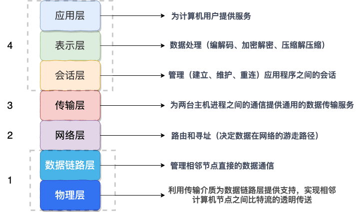
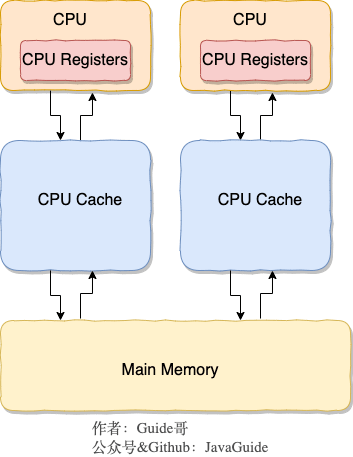

# 目录
[TOC]

# 序列化和反序列化
## 概念
- **序列化**：将数据结构或对象转换成二进制字节流的过程
- **反序列化**：将在序列化过程中所生成的二进制字节流的过程转换成数据结构或者对象的过程


> 序列化（serialization）在计算机科学的数据处理中，是指将数据结构或对象状态转换成可取用格式（例如存成文件，存于缓冲，或经由网络中发送），以留待后续在相同或另一台计算机环境中，能恢复原先状态的过程。依照序列化格式重新获取字节的结果时，可以利用它来产生与原始对象相同语义的副本。对于许多对象，像是使用大量引用的复杂对象，这种序列化重建的过程并不容易。面向对象中的对象序列化，并不概括之前原始对象所关系的函数。这种过程也称为对象编组（marshalling）。从一系列字节提取数据结构的反向操作，是反序列化（也称为解编组、deserialization、unmarshalling）。


## 序列化场景

### 网络传输

对象在进行网络传输（比如远程方法调用 RPC 的时候）之前需要先被序列化，接收到序列化的对象之后需要再进行反序列化；





OSI 七层协议模型中，**表示层**做的事情主要就是对应用层的用户数据进行处理转换为二进制流。即数据的序列化和反序列。

OSI 七层协议模型中的应用层、表示层和会话层对应的都是 TCP/IP 四层模型中的应用层，所以序列化协议属于 TCP/IP 协议**应用层**的一部分。


### 读写文件

将对象存储到文件中的时候需要进行序列化，将对象从文件中读取出来需要进行反序列化。


## 序列化协议

### JDK默认

> 不推荐使用


使用JDK 默认的序列化需实现 `java.io.Serializable`接口。

```java
@Data
public static class Obj implements Serializable {
    private static final long serialVersionUID = 1905122041950251207L;
    private Long id;
    private String title;
}
```


序列化号 serialVersionUID 属于版本控制的作用。序列化的时候 serialVersionUID 也会被写入二级制序列，当反序列化时会检查 serialVersionUID 是否和当前类的 serialVersionUID 一致。如果 serialVersionUID 不一致则会抛出 `InvalidClassException` 异常。强烈推荐每个序列化类都手动指定其 `serialVersionUID`，如果不手动指定，那么编译器会动态生成默认的序列化号。


#### 缺陷

- **不支持跨语言调用** : 不支持调用其他语言开发的服务。
- **性能差** ：序列化之后的字节数组体积较大，导致传输成本加大。


### JSON


### Kryo

Kryo 是一个高性能的序列化/反序列化工具，由于其变长存储特性并使用了字节码生成机制，拥有较高的运行速度和较小的字节码体积。

另外，Kryo 已经是一种非常成熟的序列化实现了，已经在 Twitter、Groupon、Yahoo 以及多个著名开源项目（如 Hive、Storm）中广泛的使用。


**guide-rpc-framework**就是使用的 kyro 进行序列化，序列化和反序列化相关的代码如下：

```java
@Slf4j
public class KryoSerializer implements Serializer {
    /**
     * 由于Kryo不是线程安全的，因此使用ThreadLocal来存储Kryo对象
     */
    private final ThreadLocal<Kryo> kryoThreadLocal = ThreadLocal.withInitial(() -> {
        Kryo kryo = new Kryo();
        kryo.register(RpcResponse.class);
        kryo.register(RpcRequest.class);
        return kryo;
    });

    @Override
    public byte[] serialize(Object obj) {
        try (ByteArrayOutputStream byteArrayOutputStream = new ByteArrayOutputStream();
             Output output = new Output(byteArrayOutputStream)) {
            Kryo kryo = kryoThreadLocal.get();
            // Object->byte:将对象序列化为byte数组
            kryo.writeObject(output, obj);
            kryoThreadLocal.remove();
            return output.toBytes();
        } catch (Exception e) {
            throw new SerializeException("Serialization failed");
        }
    }

    @Override
    public <T> T deserialize(byte[] bytes, Class<T> clazz) {
        try (ByteArrayInputStream byteArrayInputStream = new ByteArrayInputStream(bytes);
             Input input = new Input(byteArrayInputStream)) {
            Kryo kryo = kryoThreadLocal.get();
            // byte->Object:从byte数组中反序列化出对对象
            Object o = kryo.readObject(input, clazz);
            kryoThreadLocal.remove();
            return clazz.cast(o);
        } catch (Exception e) {
            throw new SerializeException("Deserialization failed");
        }
    }
}
```


#### 参考资料

- [EsotericSoftware/kryo Github地址](https://github.com/EsotericSoftware/kryo)
- [Kryo 和 FST 序列化](https://dubbo.apache.org/zh/docs/v2.7/user/serialization/)
- [guide-rpc-framework](https://github.com/Snailclimb/guide-rpc-framework)


### Protobuf

Protobuf 出自于 Google，性能还比较优秀，也支持多种语言，同时还是跨平台的。就是在使用中过于繁琐，因为你需要自己定义 IDL 文件和生成对应的序列化代码。这样虽然不然灵活，但是，另一方面导致 protobuf 没有序列化漏洞的风险。

Protobuf 包含序列化格式的定义、各种语言的库以及一个 IDL 编译器。正常情况下你需要定义 proto 文件，然后使用 IDL 编译器编译成你需要的语言。


一个简单的 proto 文件如下：

```
// protobuf的版本
syntax = "proto3";
// SearchRequest会被编译成不同的编程语言的相应对象，比如Java中的class、Go中的struct
message Person {
  //string类型字段
  string name = 1;
  // int 类型字段
  int32 age = 2;
}
```


#### 参考资料

- [protocolbuffers/protobuf Github地址](https://github.com/protocolbuffers/protobuf)


### ProtoStuff

由于 Protobuf 的易用性，它的哥哥 Protostuff 诞生了。

protostuff 基于 Google protobuf，但是提供了更多的功能和更简易的用法。虽然更加易用，但是不代表 ProtoStuff 性能更差。


#### 参考资料

- [protostuff/protostuff Github地址](https://github.com/protostuff/protostuff)


### hession

hessian 是一个轻量级的,自定义描述的二进制 RPC 协议。hessian 是一个比较老的序列化实现了，并且同样也是跨语言的。


### hession2

dubbo RPC 默认启用的序列化方式是 hession2 ,但是，Dubbo 对 hessian2 进行了修改，不过大体结构还是差不多。


### dubbo

阿里未成熟的高效Java序列化实现，不建议生产使用。


## 序列化协议比较

### 效率比较

序列化方式有多种，其效率比较如下（从上到下依次递减）：

- dubbo、hessian2
- hessian、ProtoStuff
- Protobuf、Kryo
- JSON
- JDK


### 支持范围比较

| 只支持Java | 跨语言     |
| ---------- | ---------- |
| JDK默认    | JSON       |
| Kryo       | Protobuf   |
| FST        | ProtoStuff |
|            | Thrift     |
|            | Avro       |
|            | MsgPack    |


## 参考资料

- [序列化和反序列化](https://tech.meituan.com/2015/02/26/serialization-vs-deserialization.html)


# 正则表达式

## 常用正则表达式
- 匹配文档注释( `/\*\*(.|[\r\n])*?\*/` )


# 系统知识

## CPU 缓存

类比我们开发网站后台系统使用的缓存（比如 Redis）是为了解决程序处理速度和访问常规关系型数据库速度不对等的问题。 **CPU 缓存则是为了解决 CPU 处理速度和内存处理速度不对等的问题。**

我们甚至可以把 **内存可以看作外存的高速缓存**，程序运行的时候我们把外存的数据复制到内存，由于内存的处理速度远远高于外存，这样提高了处理速度。

总结：**CPU Cache 缓存的是内存数据用于解决 CPU 处理速度和内存不匹配的问题，内存缓存的是硬盘数据用于解决硬盘访问速度过慢的问题。**

为了更好地理解，我画了一个简单的 CPU Cache 示意图如下（实际上，现代的 CPU Cache 通常分为三层，分别叫 L1,L2,L3 Cache）:



**CPU Cache 的工作方式：**

先复制一份数据到 CPU Cache 中，当 CPU 需要用到的时候就可以直接从 CPU Cache 中读取数据，当运算完成后，再将运算得到的数据写回 Main Memory 中。但是，这样存在 **内存缓存不一致性的问题** ！比如我执行一个 i++操作的话，如果两个线程同时执行的话，假设两个线程从 CPU Cache 中读取的 i=1，两个线程做了 1++运算完之后再写回 Main Memory 之后 i=2，而正确结果应该是 i=3。

**CPU 为了解决内存缓存不一致性问题可以通过制定缓存一致协议或者其他手段来解决。**