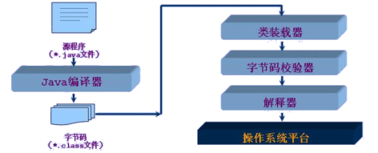

# 类加载

## 概述

### 类加载机制

> 将描述类的数据从Class文件加载到内存，并对数据进行校验、转换解析和初始化，最终形成可以被虚拟机直接使用的Java类型，这个过程称为虚拟机的类加载机制。


### 类的生命周期

一个类型从被加载到虚拟机内存中开始，到卸载出内存为止，它的整个生命周期将会经历加载（Loading）、验证（Verification）、准备（Preparation）、解析（Resolution）、初始化（Initialization）、使用（Using）和卸载（Unloading）七个阶段，其中验证、准备、解析三个部分统称为链接（Linking）


### 类加载器子系统的作用

- 类加载器子系统负责从文件系统或者网络中加载Class文件，class文件在文件开头有特定的文件标识。

- ClassLoader只负责class文件的加载，至于它是否可以运行，则由Execution Engine决定。

- 加载的类信息存放于一块称为方法区的内存空间。除了类的信息外，方法区中还会存放运行时常量池信息，可能还包括字符串字面量和数字常量(这部分常量信息是Class文件中常量池部分的内存映射)

	

### ClassLoader角色

1. class file 存在于本地硬盘上，可以理解为设计师画在纸上的模板，而最终这个模板在执行的时候是要加载到JVM当中来根据这个文件实例化出n个一模一样的实例。

2. class file 加载到JVM中,被称为DNA元数据模板,放在方法区。

3. 在.class文件—> JVM —>最终成为元数据模板,此过程就要一个运输工具(类装载器Class Loader), 扮演一个快递员的角色。

	

### 类加载方式

- 从本地文件系统来加载class文件，这是前面绝大部分类加载方式；
- 从 JAR 包中加载class文件，这种方式也是很常见的，前面介绍 JDBC 编程时用到的数据库驱动类就是放在 JAR 文件中，JVM 可以从 JAR 文件中直接加载该class文件；
- 通过网络加载class文件；
- 把一个 Java 源文件动态编译、并执行加载。


## 类加载过程




当程序主动使用某个类时，如果该类还未被加载到内存中，则系统会通过如下三个步骤来对类进行初始化。


### 加载

此过程由类加载器完成，加载阶段和连接阶段的部分内容是交叉进行的，加载阶段尚未结束，连接阶段就可能已经开始了。

1. 读取类的class字节码文件，通过全类名获取定义此类的二进制字节流；
2. 将字节流所代表的静态存储结构转换为方法区的运行时数据结构；
3. 在内存中生成一个代表该类的Class对象，作为方法区这些数据的访问入口。

1. 通过一个类的全限定名预取定义此类的二进制字节流
2. 将这个字节流所代表的静态存储结构转化为方法区的运行时数据结构
3. **在内存中生成一个代表这个类的java. lang.Class对象**，作为方法区这个类的各种数据的访问入口

加载阶段结束后，Java虚拟机外部的二进制字节流就按照虚拟机所设定的格式存储在方法区之中了，方法区中的数据存储格式完全由虚拟机实现自行定义，《Java虚拟机规范》未规定此区域的具体 数据结构。类型数据妥善安置在方法区之后，会在*Java堆内存中实例化一个java.lang.Class类的对象， 这个对象将作为程序访问方法区中的类型数据的外部接口。*

​		

### 连接

将类的二进制数据合并到JVM中，连接又可分为三步：


#### 验证

- **验证(Verify)**

	- 目的在于确保class文件的字节流中包含信息符合当前虚拟机要求，保证被加载类的正确性，不会危害虚拟机自身安全。
	- 主要包括四种验证，文件格式验证，元数据验证，字节码验证，符号引用验证。

	

确保加载的类信息符合JVM规范，没有安全方面的问题。

- 文件格式验证

验证字节流是否符合Class文件格式的规范，例如是否以0XCAFEBABE开头、主次版本号是否在当前虚拟机的处理范围之内、常量池中的常量是否又不被支持的类型。

- 元数据验证

对字节码描述的信息进行语义分析，以保证其描述的信息符合Java语言规范的要求，例如这个类是否有父类、这个类是否继承了不允许继承的类。

- 字节码验证

最复杂的阶段。通过数据流和控制流分析，确定程序语义是合法的、符合逻辑的，例如保证任意时刻操作数栈和指令代码序列都能配合工作。

- 符号引用验证

确保解析动作能正确执行。

#### 准备

- **准备(Prepare)**

	- 为类变量（即静态变量，static修饰的）分配内存并且设置该类变量的默认初始值，即零值。
	- *这里不包含用final修饰的static, 因为final在编译的时候就会分配了*
	- *这里不会为实例变量分配初始化（类还未加载）*，类变量会分配在方法区中，而实例变量是会随着对象一起分配到Java堆中。

	

准备阶段是正式为类变量分配内存并设置类变量初始值的阶段，这些内存都将在方法区中分配。对于该阶段有以下几点需要注意：

- 这时候进行内存分配的仅包括类变量（static），而不包括实例变量，实例变量会在对象实例化时随着对象一块分配在 Java 堆中。
- 这里所设置的初始值"通常情况"下是数据类型默认的零值（如0、0L、null、false等），比如我们定义了public static int value=111 ，那么 value 变量在准备阶段的初始值就是 0 而不是111（初始化阶段才会复制）。特殊情况：比如给 value 变量加上了 fianl 关键字public static final int value=111 ，那么准备阶段 value 的值就被复制为 111。

#### 解析

- **解析(Resolve)**
	- 将常量池内的符号引用转换为直接引用的过程
		- 符号引用（Symbolic References）：符号引用以一组符号来描述所引用的目标，符号可以是任何形式的字面量，只要使用时能无歧义地定位到目标即可。
		- 直接引用（Direct References）：直接引用是可以直接指向目标的指针、相对偏移量或者是一个能间接定位到目标的句柄。
	- 事实上，解析操作往往会伴随着JVM在执行完初始化之后再执行
	- 解析动作主要针对类或接口、字段、类方法、接口方法、方法类型等。对应常量池中的CONSTANT Class info、 CONSTANT Fieldref info、 CONSTANT Methodref info等


解析阶段是虚拟机将常量池内的符号引用替换为直接引用的过程。解析动作主要针对类或接口、字段、类方法、接口方法、方法类型、方法句柄和调用限定符7类符号引用进行。

符号引用就是一组符号来描述目标，可以是任何字面量。直接引用就是直接指向目标的指针、相对偏移量或一个间接定位到目标的句柄。在程序实际运行时，只有符号引用是不够的，举个例子：在程序执行方法时，系统需要明确知道这个方法所在的位置。Java 虚拟机为每个类都准备了一张方法表来存放类中所有的方法。当需要调用一个类的方法的时候，只要知道这个方法在方发表中的偏移量就可以直接调用该方法了。通过解析操作符号引用就可以直接转变为目标方法在类中方法表的位置，从而使得方法可以被调用。

综上，解析阶段是虚拟机将常量池内的符号引用替换为直接引用的过程，也就是得到类或者字段、方法在内存中的指针或者偏移量。


### 初始化

JVM负责对类进行初始化

初始化是类加载的最后一步，也是真正执行类中定义的 Java 程序代码(字节码)，初始化阶段是执行类构造器方法的过程。

对于构造器方法方法的调用，虚拟机会自己确保其在多线程环境中的安全性。因为构造器方法方法是带锁线程安全，所以在多线程环境下进行类初始化的话可能会引起死锁，并且这种死锁很难被发现。

对于初始化阶段，虚拟机严格规范了有且只有5中情况下，必须对类进行初始化：

- 当遇到new、getstatic、putstatic或invokestatic 这4条直接码指令时，比如 new 一个类，读取一个静态字段(未被 final 修饰)、或调用一个类的静态方法时。
- 使用 java.lang.reflect 包的方法对类进行反射调用时 ，如果类没初始化，需要触发其初始化。
- 初始化一个类，如果其父类还未初始化，则先触发该父类的初始化。
- 当虚拟机启动时，用户需要定义一个要执行的主类 (包含 main 方法的那个类)，虚拟机会先初始化这个类。
- 当使用 JDK1.7 的动态动态语言时，如果一个MethodHandle 实例的最后解析结构为 REF_getStatic、REF_putStatic、REF_invokeStatic、的方法句柄，并且这个句柄没有初始化，则需要先触发器初始化。


> 直到初始化阶段，Java虚拟机才真正开始执行类中编写的Java程序代码，将主导权移交给应用程序。

- 初始化阶段就是执行类构造器方法`<clinit>()`的过程。

	- `<clinit>()`此方法不需定义，是javac编译器自动收集类中的所有**类变量的赋值动作**和**静态代码块中的语句（static{}块）**合并而来。类变量指的是static修饰的变量，未用static修饰的是实例变量。

		编译器收集的顺序是由语句在源文件中出现的顺序决定的

		```java
		public class Test{
			static {
				a = 10; // 可以赋值
		        System.out.println(a); // 非法前向引用，不能访问
			}
		    static int a = 9; // a初始化为9，因为9的赋值晚于10
		}
		```

- 此方法不是必需的，如果一个类中没有静态语句块，也没有对类变量的赋值操作，就不会生成

- `<clinit>()`不同于类的构造器。(关联: 构造器是虚拟机视角下的`<init>()`)

- 若该类具有父类，JVM会保证子类的`<clinit>()`执行前，父类的`<clinit>()`已经执行完毕。

- 虚拟机必须保证一个类的`<clinit>()`方法在多线程下被同步加锁。（**只会被加载一次**）


## 类加载器

> Java虚拟机设计团队有意把类加载阶段中的“通过一个类的全限定名来获取描述该类的二进制字节流”这个动作放到Java虚拟机外部去实现，以便让应用程序自己决定如何去获取所需的类。实现这个动作的代码被称为“类加载器”（Class Loader）。

在Java虚拟机的角度来看，只存在两种不同的类加载器：一种是启动类加载器（Bootstrap ClassLoader），这个类加载器使用C++语言实现，是虚拟机自身的一部分；另外一种就是其他所有的类加载器，这些类加载器都由Java语言实现，独立存在于虚拟机外部，并且全都继承自抽象类 java.lang.ClassLoader。

无论类加载器的类型如何划分，在程序中我们最常见的类加载器始终只有3个，如下所示：

这四者之间的关系是包含关系，不是上下级关系，也不是继承关系。


四种类加载器的应用场景以及双亲委派模型。

系统可能在第一次使用某个类时加载该类，但也可能采用预先加载机制来预加载某个类，不管怎样，类的加载必须由类加载器完成，系统会通过加载、连接、初始化三个步骤来对该类进行初始化。不管类的字节码内容从哪里加载，加载的结果都一样，这些字节码内容加载到内存后，都会将这些静态数据转换成方法区的运行时数据结构，然后生成一个代表这个类的java.lang.Class对象，作为方法区中类数据的访问入口（即引用地址），所有需要访问和使用类数据只能通过这个Class对象。


### 类加载器类型

Java的类加载器由如下四种：

- **引导类加载器**（Bootstrap Classloader）：又称为根类加载器
    它负责加载Java的核心库JAVA_HOME/jre/lib/rt.jar等，是用原生代码（C/C++）来实现的，并不继承自java.lang.ClassLoder，所以通过Java代码获取引导类加载器对象将会得到null，即无法直接获取。

- **扩展类加载器**（Extension ClassLoader）
    它由sun.misc.Launcher$ExtClassLoader实现，是java.lang.ClassLoader的子类，负责加载Java的扩展库JAVA_HOME/jre/ext/*.jar等。

- **应用程序类加载器**（Application Classloader）
    它由sun.misc.Launcher$AppClassLoader实现，是java.lang.ClassLoader的子类，负责加载Java应用程序类路径下的内容，是最常用的类加载器。

- **自定义类加载器**
    开发人员可以通过继承java.lang.ClassLoader类的方式实现自己的类加载器，以满足一些特殊的需求，例如对字节码进行加密来避免class文件被反编译，或者加载特殊目录下的字节码数据。

类加载器是用来把类(class)装载进内存的。JVM 规范定义了两种类型的类加载器：启动类加载器(bootstrap)和用户自定义加载器(user-defined class loader)。 JVM在运行时会产生3个类加载器组成的初始化加载器层次结构 ，如下图所示：


可以自己定义java.lang.String类，但在应用时，需要用自己的类加载器去加载，否则，系统的类加载器永远只是去加载 rt.jar 包中的那个 java.lang.String。

但在 Tomcat 的 Web 应用程序中，都是由 webapp 自己的类加载器先自己加载WEB-INF/classess 目录中的类，然后才委托上级的类加载器加载，如果我们在 Tomcat 的 Web应用程序中写一个 java.lang.String，这时候 Servlet 程序加载的就是我们自己写的java.lang.String，但是这么干就会出很多潜在的问题，原来所有用了java.lang.String 类的都将出现问题。


#### 启动类加载器

> Bootstrap ClassLoader

- 这个类加载使用C/C++语言实现的，嵌套在JVM内部。
- 它用来加载Java的核心库(JAVA HOME/jre/lib/rt.jar.resources. jar或sun. boot . class.path路径下的内容) , 用于提供JVM自身需要的类
- 并不继承自java. lang. ClassLoader，没有父加载器。
- 加载扩展类和应用程序类加载器，并指定为他们的父类加载器。
- 出于安全考虑，Bootstrap启动类加载器只加载包名为java、javax、sun等开头的类


#### 扩展类加载器

> Extension ClassLoader

- Java语言编写，由sun.misc.Launcher$ExtClassLoader实现。
- 派生于ClassLoader类
- 父类加载器为启动类加载器
- 从java .ext . dirs系统属性所指定的目录中加载类库，或从JDK的安装目录的jre/]ib/ext子目录(扩展目录)下加载类库。如果用户创建的JAR放在此目录下，也会自动由扩展类加载器加载。


#### 应用程序类加载器

> System ClassLoader

- java语言编写，由sun.misc. Launcher$AppClassLoader实现
- 派生于ClassLoader类
- 父类加载器为扩展类加载器
- 它负责加载环境变量classpath或系统属性java.class.path 指定路径下的类库
- 该类加载是程序中默认的类加载器，一般来说，Java应用的类都是由它来完成加载
- 通过ClasLoader#getSystemClassLoader()方法可以获取到该类加载器


#### 自定义类加载器

1. 开发人员可以通过继承抽象类java. lang.ClassLoader类的方式，实现自己的类加载器，以满足一些特殊的需求
2. 在JDK1.2之前，在自定义类加载器时，总会去继承ClassLoader类并重写loadClass ()方法，从而实现自定义的类加载类，但是在JDK1.2之后已不再建议用户去覆盖loadClass()方法，而是建议把自定义的类加载逻辑写在findClass()方法中
3. 在编写自定义类加载器时，如果没有太过于复杂的需求，可以直接继承URLClassLoader类，这样就可以避免自己去编写findClass()方法及.其获取字节码流的方式，使自定义类加载器编写更加简洁。


### 双亲委派

​	某个特定的类加载器在接到加载类的请求时，首先将加载任务委托给父类加载器，依次追溯，直到最高爷爷辈的。如果父类加载器可以完成类加载任务，则成功返回；只有父类加载器无法完成加载任务时才自己去加载。
​	双亲委派机制是为了保证Java核心库的类型安全，避免用户自己能定义java.lang.Object类的情况。类加载器除了用于加载类，也是安全的最基本的屏障。


Java虚拟机对class文件采用的是按需加载的方式，也就是说当需要使用该类时才会将它的class文件加载到内存生成class对象。而且加载某个类的class文件时，Java虚拟机采用的是双亲委派模式，即把请求交由父类处理,它是一种任务委派模式。

**工作原理**

1. 如果一个类加载器收到了类加载请求它并不会自己先去加载，而是把这个请求委托给父类的加载器去执行
2. 如果父类加载器还存在其父类加,载器，则进一步向上委托，依次递归,请求最终将到达项层的启动类加载器
3. 如果父类加载器可以完成类加载任务，就成功返回，倘若父类加载器无法完成此加载任务，子加载器才会尝试自己去加载，这就是双亲委派模式。

**优势**

1. 避免类的重复加载
2. 保护程序安全，防止核心API被篡改
	- 自定义 java.lang.String


### 沙箱安全

自定义String类，但是在加载自定义String类的时候会率先使用引导类加载器加载，而引导类加载器在加载的过程中会先加载jdk自带的文件(rt.jar包中java\lang\String.class)，报错信息说没有main方法，就是因为加载的是rt.jar包中的String类。这样可以保证对java核心源代码的保护，这就是沙箱安全机制。

JVM必须知道一个类型是由启动加载器加载的还是由用户类加载器加载的。如果一个类型是由用户类加载器加载的，那么JVM会将这个类加载器的一个引用作为类型信息的一"部分保存在方法区中。当解析一个类型到另一个类型的引用的时候，JVM需要保证这两个类型的类加载器是相同的。


### ClassLoader类

```java
public abstract class ClassLoader {
    
}
```


```java
public void method1() throws Exception {
    //获取系统类加载器
    ClassLoader classLoader = ClassLoader.getSystemClassLoader();
    System.out.println("系统类加载器"+classLoader);
    //获取系统类加载器的父类加载器，即扩展类加载器
    classLoader = classLoader.getParent();
    System.out.println("扩展类加载器"+classLoader);
    //获取扩展类加载器的父类加载器，即引导类加载器，该加载器无法直接获取
    classLoader = classLoader.getParent();
    System.out.println("引导类加载器"+classLoader);
    //获取加载当前类的加载器
    classLoader = Class.forName("test509.ClassLoaderTest").getClassLoader ();
    System.out.println("当前类的加载器"+classLoader);
    //获取加载JDK中的Object类的加载器，该加载器无法直接获取
    classLoader = Class.forName("java.lang.Object").getClassLoader();
    System.out.println("Object类加载器"+classLoader);
}
```


类加载器的一个主要方法：getResourceAsStream(String str):获取bin路径下的指定文件的输入流。

注意：类加载器加载文件的根目录位于bin（类路径）目录下

```java
public void method2() throws Exception {
    InputStream inputStream = null;
    Properties properties = new Properties();
    ClassLoader classLoader = this.getClass().getClassLoader();
    //该方法读取的资源文件位于bin（用于存放字节码文件）目录下，其他目录的资源文件无法读取
    //因为类加载器读取的是bin目录下的字节码文件，所以该方法将bin目录作为根目录
    inputStream = classLoader.getResourceAsStream("game.properties");
    properties.load(inputStream);
    String name = properties.getProperty("username");
    String age = properties.getProperty("password");
    System.out.println(name + age);
}
```

