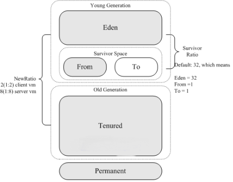
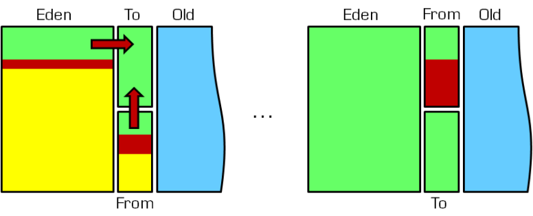

[TOC]

# 垃圾回收

## 基础概念
### 什么是垃圾对象？
垃圾（Garbage）是指在运行程序中没有任何引用（指针指向）的对象，这个对象就是需要被回收的垃圾。

>  An object is considered garbage when it can no longer be reached from any pointer in the running program.


如果不及时对内存中的垃圾进行清理，那么，这些垃圾对象所占的内存空间会一直保留到应用程序结束，被保留的空间无法被其他对象使用。甚至可能导致内存溢出。


### 内存溢出

内存溢出（OutOfMemoryError）指的是没有空闲内存，并且垃圾收集器也无法提供更多内存。即在垃圾回收器被触发进行垃圾回收后仍无法提供足够的内存时，就会发生内存溢出。

- JVM会去尝试回收软引用指向的对象；
- 在java.nio.BIts.reserveMemory()方法中，System. gc()会被调用，以清理空间；
- ……其它垃圾回收


也不是在任何情况下垃圾回收器都会被触发的，比如分配一个超大对象，类似一个超大数组，超过堆的最大值，JVM可以判断出垃圾回收并不能解决这个问题，所以直接抛出OutOfMemoryError。


#### 堆内存溢出的原因

- Java虚拟机的堆内存设置不够，要处理大量数据时没有显式指定JVM堆大小或指定数值偏小。可以通过参数-Xms、-Xmx来调整。
- 代码中创建了大量大对象，并且长时间不能被垃圾回收器回收（存在被引用）。


#### 扩展

##### 内存溢出输出异常

对于老版本的Oracle JDK，因为永久代的大小是有限的，并且JVM对永久代垃圾回收（如常量池回收、卸载不再需要的类型）非常不积极，所以不断添加新类型时，永久代出现OutOfMemoryError非常多见，尤其是在运行时存在大量动态类型生成的场合；类似intern字符串缓存占用太多空间，也会导致OOM问题。对应的异常信息，会标记出来和永久代相关：`java.lang.OutOfMemoryError: PermGen space`。随着元数据区的引入，方法区内存已经不再那么窘迫，所以相应的OOM有所改观，出现OOM，异常信息则变成了：`java.lang.OutOfMemoryError: Metaspace`。 直接内存不足，也会导致OOM。


### 内存泄漏

也称作“存储渗漏”。严格来说，只有对象不会再被程序用到了，但是GC又不能回收他们的情况，才叫内存泄漏。但实际情况很多时候一些不太好的实践或疏忽会导致对象的生命周期变得很长，甚至导致OOM，也可以叫做宽泛意义上的“内存泄漏” 。

尽管内存泄漏并不会立刻引起程序崩溃，但是一旦发生内存泄漏，程序中的可用内存就会被逐步蚕食，直至耗尽所有内存，最终出现OutOfMemory异常，导致程序崩溃。注意，这里的存储空间并不是指物理内存，而是指虛拟内存大小，这个虚拟内存大小取决于磁盘交换区设定的大小

程序运行过程中会不断地分配内存空间，那些不再使用的内存空间应该及时回收，从而保证系统可以再次使用这些内存，如果存在无用的内存没有被回收回来，那就是内存泄露。

对于Java程序而言，只要对象一直处于可达状态，gc就不会回收它们，即使它们对于程序来说已经变成了垃圾，但对于gc来说，它们还不是垃圾（还处于可达状态），因此不能回收。


#### 内存泄漏场景

##### 单例模式

单例的生命周期和应用程序是一样长的，所以单例程序中，如果持有对外部对象的引用的话，那么这个外部对象是不能被回收的，则会导致内存泄漏的产生。


##### 资源未关闭

一些提供close的资源未关闭导致内存泄漏，如数据库连接（dataSourse.getConnection()），网络连接（socket）和IO连接必须手动close，否则是不能被回收的。


#### 源码解析

```java
//ArrayList的remove方法中调用的fastRemove方法
private void fastRemove(int index) {
    modCount++;
    int numMoved = size - index - 1;
    if (numMoved > 0)
        System.arraycopy(elementData, index+1, elementData, index,
                         numMoved);
    elementData[--size] = null; // clear to let GC do its work
}
```


上述源码elementData[--size] = null;就是为了避免垃圾回收机制而编写的代码，如果没有这行代码，这个方法就会产生内存泄露，每删除一个对象，但该对象所占用的内存空间却不会释放。


#### 如何解决OOM

1. 要解决OOM异常或heap space的异常，一般的手段是首先通过内存映像分析工具(如Eclipse Memory Analyzer)对dump出来的堆转储快照进行分析，重点是确认内存中的对象是否是必要的，也就是要先分清楚到底是出现了内存泄漏(MemoryLeak)还是内存溢出(Memory Overflow)
2. 如果是内存泄漏，可进一步通过工具查看泄漏对象到GC Roots 的引用链。于是就能找到泄漏对象是通过怎样的路径与GCRoots相关联并导致垃圾收集器无法自动回收它们的。掌握了泄漏对象的类型信息，以及GC Roots 引用链的信息，就可以比较准确地定位出泄漏代码的位置。
3. 如果不存在内存泄漏，换句话说就是内存中的对象确实都还必须存活着，那就应当检查虚拟机的堆参数(-Xmx与-Xms) ，与机器物理内存对比看是否还可以调大，从代码上检查是否存在某些对象生命周期过长、持有状态时间过长的情况，尝试减少程序运行期的内存消耗。


### Stop The World

Stop-The-World，简称STW，指的是GC事件发生过程中，会产生应用程序的停顿。停顿产生时整个应用程序线程都会被暂停，没有任何响应，有点像卡死的感觉，这个停顿称为STW。

可达性分析算法中枚举根节点(GC Roots)会导致所有Java执行线程停顿。分析工作必须在一个能确保一致性的快照中进行，一致性指整个分析期间整个执行系统看起来像被冻结在某个时间点上，如果出现分析过程中对象引用关系还在不断变化，则分析结果的准确性无法保证。

STW事件和采用哪款GC无关，所有的GC都有这个事件。哪怕是G1也不能完全避免STW情况发生，只能说垃圾回收器越来越优秀，回收效率越来越高，尽可能地缩短了暂停时间。

STW是JVM在后台自动发起和自动完成的。在用户不可见的情况下，把用户正常的工作线程全部停掉。开发中不要用System.gc()，会导致STW发生。


### 垃圾回收的并发与并行

并发和并行，在谈论垃圾收集器的上下文语境中，解释如下:

- 并行（Parallel）指多条垃圾收集线程并行工作，但此时用户线程仍处于等待状态。如ParNew、 Parallel、Scavenge、 Parallel 0ld;
- 串行（Serial）指相较于并行的概念，单线程执行。如果内存不够，则程序暂停，启动JVM垃圾回收器进行垃圾回收，回收完，再启动程序的线程。
- 并发（Conlcurrent）指用户线程与垃圾收集线程同时执行（但不一定是并行的，可能会交替执行），垃圾回收线程在执行时不会停顿用户程序的运行。用户程序在继续运行，而垃圾收集程序线程运行于另一个CPU上，如: CMS、G1


###  安全点与安全区域

程序执行时并非在所有地方都能停顿下来开始GC， 只有在特定的位置才能停顿下来开始GC，这些位置称为安全点（Safe Point）。

Safe Point的选择很重要，如果太少可能导致GC等待的时间太长，如果太频繁可能导致运行时的性能问题。大部分指令的执行时间都非常短暂，通常会根据“是否具有让程序长时间执行的特征”为标准。比如：选择些执行时间较长的指令作为Safe Point，如方法调用、循环跳转和异常跳转等。

Safe Point机制保证了程序执行时，在不太长的时间内就会遇到可进入GC的Safe Point。但是，程序“不执行”的时候呢？例如线程处于Sleep状态或Blocked状态，这时候线程无法响应JVM的中断请求，“走” 到安全点去中断挂起，JVM 也不太可能等待线程被唤醒。对于这种情况，就需要安全区域(Safe Region)来解决。

安全区域是指在一段代码片段中，对象的引用关系不会发生变化，在这个区域中的任何位置开始GC都是安全的。我们也可以把Safe Region看做是被扩展了的Safe Point。


**如何在GC发生时，检查所有线程都跑到最近的安全点停顿下来呢?**

- **抢先式中断**( 目前没有虚拟机采用了)：首先中断所有线程，如果还有线程不在安全点，就恢复线程，让线程跑到安全点。
- **主动式中断**：设置一个中断标志，各个线程运行到Safe Point的时候主动轮询这个标志，如果中断标志为真，则将自己进行中断挂起。


**安全区域实际执行**

1. 当线程运行到Safe Region的代码时， 首先标识已经进入了Safe Region，如果这段时间内发生GC，JVM会忽略标识为Safe Region状态的线程；
2. 当线程即将离开Safe Region时， 会检查JVM是否已经完成GC，如果完成了，则继续运行，否则线程必须等待直到收到可以安全离开Safe Region的信号为止。

### 对象引用

我们希望能描述这样一类对象: 当内存空间还足够时，则能保留在内存中;如果内存空间在进行垃圾收集后还是很紧张，则可以抛弃这些对象。

- 强引用、软引用、弱引用、虚引用有什么区别？具体使用场景是什么？
    - 在JDK 1.2版之后，Java对引用的概念进行了扩充，将引用分为强引用(Strong Reference)、软引用(Soft Reference) 、弱引用(Weak Reference)和虚引用 (Phantom Reference) 4种，*这4种引用强度依次逐渐减弱*
    - 除强引用外，其他3种引用均可以在java. lang. ref包中找到它们的身影。如下图，显示
        了这3种引用类型对应的类，开发人员可以在应用程序中直接使用它们。

Reference子类中只有终结器引用是包内可见的，其他3种引用类型均为public，可以在应用程序中直接使用


#### 强引用

强引用（Strong Reference）：如果一个对象具有强引用，它就不会被垃圾回收器回收。即使当前内存空间不足，JVM也不会回收它，而是抛出 OutOfMemoryError 错误，使程序异常终止。如果想中断强引用和某个对象之间的关联，可以显式地将引用赋值为null，这样一来的话，JVM在合适的时间就会回收该对象。

最传统的“引用”的定义，是指在程序代码之中普遍存在的引用赋值，即类似“Object obj=new object()"这种引用关系。无论任何情况下，*只要强引用关系还存在，垃圾收集器就永远不会回收掉被引用的对象。*

- 强引用可以直接访问目标对象。
- 强引用所指向的对象在任何时候都不会被系统回收，虚拟机宁愿抛出OOM异常，也不会回收强引用所指向对象
- 强引用可能导致内存泄漏。


#### 软引用

软引用（Soft Reference）：在使用软引用时，如果内存的空间足够，软引用就能继续被使用，而不会被垃圾回收器回收，只有在内存不足时，软引用才会被垃圾回收器回收。

在系统将要发生内存溢出之前，将会把这些对象列入回收范围之中进行第二次回收。如果这次回收后还没有足够的内存，才会抛出内存溢出异常。

- 软引用通常用来实现内存敏感的缓存。比如:高速缓存就有用到软引用。如果还有空闲内存，就可以暂时保留缓存，当内存不足时清理掉，这样就保证了使用缓存的同时，不会耗尽内存。
- 垃圾回收器在某个时刻决定回收软可达的对象的时候，会清理软引用，并可选地把引用存放到一个引用队列( Reference Queue)。


```java
SoftReference<T> userSofRef = new SoftReference<T>(new T);
```


#### 弱引用

弱引用（Weak Reference）：具有弱引用的对象拥有的生命周期更短暂。因为当 JVM 进行垃圾回收，一旦发现弱引用对象，无论当前内存空间是否充足，都会将弱引用回收。不过由于垃圾回收器是一个优先级较低的线程，所以并不一定能迅速发现弱引用对象。

被弱引用关联的对象只能生存到下一次垃圾收集之前。当垃圾收集器工作时，无论内存空间是否足够，都会回收掉被弱引用关联的对象。

弱引用也适合来保存那些可有可无的缓存数据。


```java
WeakReference<T> userWRef = new WeakReference<T>(new T);
```


#### 虚引用

虚引用（Phantom Reference）：顾名思义，就是形同虚设，如果一个对象仅持有虚引用，那么它相当于没有引用，在任何时候都可能被垃圾回收器回收。

一个对象是否有虚引用的存在，完全不会对其生存时间构成影响，也无法通过虚引用来获得一个对象的实例。为一个对象设置虛引用关联的唯一目的就是能在这个对象被收集器回收时收到一个系统通知。

为一个对象设置虛引用关联的唯一目的在于跟踪垃圾回收过程。比如：能在这个对象被收集器回收时收到一个系统通知。


#### 终结器引用

它用以实现对象的finalize()方法，也可以称为终结器引用。无需手动编码，其内部配合引用队列使用。在GC时，终结器引用入队。由Finalizer线程通过终结器引用找到被引用对象并调用它的finalize()方法，第二次GC时才能回收被引用对象。


#### 扩展

#### 软引用和弱引用的区别

虽然 WeakReference 与 SoftReference 都有利于提高 GC 和 内存的效率，但是 WeakReference 一旦失去最后一个强引用，就会被 GC 回收，而软引用虽然不能阻止被回收，但是可以延迟到 JVM 内存不足的时候。


#### 为什么有不同的引用类型

不像C语言可以控制内存的申请和释放，在Java中需要适当的控制对象被回收的时机，因此就诞生了不同的引用类型，不同的引用类型实则是对GC回收时机不可控的妥协。

利用软引用和弱引用解决OOM问题：用一个HashMap来保存图片的路径和相应图片对象关联的软引用之间的映射关系，在内存不足时，JVM会自动回收这些缓存图片对象所占用的空间，从而有效地避免了OOM的问题.

通过软引用实现Java对象的高速缓存：比如创建了一Person的类，如果每次需要查询一个人的信息,哪怕是几秒中之前刚刚查询过的，都要重新构建一个实例，这将引起大量Person对象的消耗，并且由于这些对象的生命周期相对较短，会引起多次GC影响性能。此时，通过软引用和 HashMap 的结合可以构建高速缓存，提供性能。


## 垃圾标记算法

在堆里存放着几乎所有的Java对象实例，在GC执行垃圾回收之前，首先要区分出内存中垃圾对象。只有被标记为垃圾对象，GC才会在执行垃圾回收时，释放掉其所占用的内存空间，因此这个过程称为**垃圾标记阶段**。


### 引用计数算法

引用计数算法（Reference Counting）对每个对象保存一个整型的引用计数器属性，用于记录对象被引用的情况。对于一个对象A，只要有任何一个对象引用了A，则A的引用计数器就加1；当引用失效时，引用计数器就减1。只要对象A的引用计数器的值为0，即表示对象A不再被使用，可进行回收。


#### 优点

- 实现简单，垃圾对象便于辨识，判定效率高，回收没有延迟性。


#### 缺陷

- 需要单独的字段存储引用计数器，增加了存储空间的开销；
- 每次赋值都需要更新引用计数器，伴随着加法和减法操作，这增加了时间开销；
- 存在垃圾对象互相引用导致无法进行GC，这是一条致命缺陷，所以在Java的垃圾回收器中没有使用这类算法。


### 可达性分析算法

对于 Java 的垃圾回收器来说，它使用有向图来记录和管理堆内存中的所有对象，通过这个有向图就可以识别哪些对象是“可达的”（有引用变量引用它就是可达的），哪些对象是“不可达的”（没有引用变量引用它就是不可达的），所有“不可达”对象都是可被垃圾回收的。两个互相调用而没有其他对象进行调用的对象也是不可达的，会被当成垃圾处理。

相对于引用计数算法而言，可达性分析算法不仅同样具备实现简单和执行高效等特点，更重要的是该算法可以有效地解决在引用计数算法中循环引用的问题，防止内存泄漏的发生。

可达性分析算法也叫作追踪性垃圾收集(Tracing Garbage Collection)。


#### 基本方式

- 可达性分析算法是以根对象集合(GC Roots) 为起始点，按照从上至下的方式**搜索被根对象集合所连接的目标对象是否可达**。
- 使用可达性分析算法后，内存中的存活对象都会被根对象集合直接或间接连接着，搜索所走过的路径称为**引用链(Reference Chain)**
- 如果目标对象没有任何引用链相连，则是不可达的，就意味着该对象己经死亡，可以标记为垃圾对象。
- 在可达性分析算法中，*只有能够被根对象集合直接或者间接连接的对象才是存活对象*。


#### 概念

##### GC Roots

由于Root采用栈方式存放变量和指针，所以如果一个指针，它保存了堆内存里面的对象，但是自己又不存放在堆内存里面，那它就是一个Root。

在Java语言中，GC Roots包括以下几类元素:

- 虚拟机栈中引用的对象，比如各个线程被调用的方法中使用到的参数、局部变量等。
- 本地方法栈内JNI(通常说的本地方法)引用的对象
- 方法区中类静态属性引用的对象，比如Java类的引用类型静态变量
- 方法区中常量引用的对象，比如：字符串常量池(String Table)里的引用
- 所有被同步锁synchronized持有的对象
- Java虚拟机内部的引用，基本数据类型对应的Class对象，一些常驻的异常对象(如: NullPointerException、OutOfMemoryError) ，系统类加载器。
- 反映java虚拟机内部情况的JMXBean、JVMTI中注册的回调、本地代码缓存等。


除了这些固定的GC Roots集合以外，根据用户所选用的垃圾收集器以及当前回收的内存区域不同，还可以有其他对象“临时性“地加入，共同构成完整GC Roots集合。比如：分代收集和局部回收（Partial GC）。

如果只针对Java堆中的某一块区域进行垃圾回收（比如典型的只针对新生代），必须考虑到内存区域是虚拟机自己的实现细节，更不是孤立封闭的，这个区域的对象完全有可能被其他区域的对象所引用，这时候就需要一并将关联的区域对象也加入GC Roots集合中去考虑，才能保证可达性分析的准确性。

如果要使用可达性分析算法来判断内存是否可回收，那么分析工作必须在一个能保障一致性的快照中进行。这点不满足的话分析结果的准确性就无法保证。

这点也是导致GC进行时必须STW 的一个重要原因。即使是号称几乎不会发生停顿的CMS收集器中，枚举根节点时也是必须要停顿的。


##### finalization机制

Java语言提供了对象终止(finalization)机制来允许开发人员提供**对象被销毁之前的自定义处理逻辑**。当垃圾回收器发现没有引用指向一个对象，即垃圾回收此对象之前，总会先调用这个对象的finalize()方法。finalize()方法允许在子类中被重写，**用于在对象被回收时进行资源释放**。通常在这个方法中进行一些资源释放和清理的工作，比如关闭文件、套接字和数据库连接等。

永远不要主动调用某个对象的finalize()方法，应该交给垃圾回收机制调用，理由包括下面三点:

- 在finalize() 时可能会导致对象复活。
- finalize()方法的执行时间是没有保障的，它完全由GC线程决定，极端情况下，若不发生GC，则finalize()方法将没有执行机会。
- 一个糟糕的finalize()会严重影响GC的性能。


由于finalize()方法的存在，虚拟机中的对象一般处于三种可能的状态。如果从所有的根节点都无法访问到某个对象，说明对象已经不再使用了。一般来说，此对象需要被回收。但事实上，也并非是“非死不可”的，这时候它们暂时处于“缓刑”阶段。一个无法触及的对象有可能在某一个条件下“复活”自己，如果这样，那么对它的回收就是不合理的，为此，定义虚拟机中的对象可能的三种状态。如下:

- 可触及的: 从根节点开始，可以到达这个对象。
- 可复活的: 对象的所有引用都被释放，但是对象有可能在finalize()中复活。
- 不可触及的*: 对象的finalize()被调用，并且没有复活，那么就会进入不可触及状态。不可触及的对 象不可能被复活，因为*finalize()只会被调用一次。

以上3种状态中，是由于finalize()方法的存在，进行的区分。只有在对象不可触及时才可以被回收。


**判断可回收的具体过程**

判定一个对象objA是否可回收，至少要经历两次标记过程:

1. 如果对象objA到GC Roots没有引用链，则进行第一次标记。

2. 进行筛选，判断此对象是否有必要执行finalize()方法

	- 如果对象objA没有重写finalize()方法，或者finalize ()方法已经被虚拟机调用过，则虚拟机视为“没有必要执行”，objA被判定为不可触及的。
	- 如果对象objA重写了finalize()方法，且还未执行过，那么objA会被插入到r-Queue队列中，由一个虚拟机自动创建的、低优先级的Finalizer线程触发其finalize()方法执行。
	- finalize()方法是对象逃脱死亡的最后机会，稍后GC会对F-Queue队列中的对象进行第二次标记。如果objA在finalize()方法中与引用链上的任何一个对象建立了联系，那么在第二次标记时，objA会被移出“即将回收”集合。之后，对象会再次出现没有引用存在的情况。在这个情况下，finalize方法不会被再次调用，对象会直接变成不可触及的状态，也就是说，一个对象的finalize方法只会被调用一次。

	

## 垃圾回收算法

A．串行回收（Serial）和并行回收（Parallel） ：串行回收就是不管系统有多少个 CPU，始终只用一个 CPU 来执行垃圾回收操作；而并行回收就是把整个回收工作拆分成多部分，每个部分由一个 CPU 负责，从而让多个 CPU 并行回收，并行回收的执行效率很高，但复杂度增加，另外也有其他一些副作用，比如内存碎片会增加。

B．并发执行（Concurrent）和应用程序停止（Stop-the-world） ： 。Stop-the-world 的垃圾回收方式在执行垃圾回收的同时会导致应用程序的暂停。 并发执行的垃圾回收虽然不会导致应用程序的暂停， 但由于并发执行垃圾回收需要解决和应用程序的执行冲突 （应用程序可能会在垃圾回收的过称中修改对象） ，因此并发执行垃圾回收的系统开销比 Stop-the-world 更好，而且执行时也需要更多的堆内存。

C．压缩（Compacting）和不压缩（Non-compacting）和复制（Copying） ：为了减少内存碎片， 支持压缩的垃圾回收器会把所有的活对象搬迁到一起， 然后将之前占用的内存全部回收。不压缩式的垃圾回收器只是回收内存，这样回收回来的内存不可能是连续的，因此将会有较多的内存碎片。较之压缩式的垃圾回收，不压缩式的垃圾回收回收内存快了，而分配内存时就会更慢， 而且无法解决内存碎片的问题。 复制式的垃圾回收会将所有可达对象复制到另一块相同的内存中， 这种方式的优点是垃圾及回收过程不会产生内存碎片， 但缺点也很明显，需要拷贝数据和额外的内存。


### 标记-清除算法

当堆中的有效内存空间(available memory)被耗尽的时候，就会停止整个程序(也被称为stop the world)，然后进行两项工作，第一项则是标记，第二项则是清除。

- 标记： Collector从引用根节点开始遍历，标记所有被引用的对象。一般是在对象的Header中记录为可达对象。
- 清除：Collector对堆内存从头到尾进行线性的遍历，如果发现某个对象在其Header中没有标记为可达对象，则将其回收。


**缺点**

- 效率不算高
- 在进行GC的时候，需要停止整个应用程序，导致用户体验差；
- 这种方式清理出来的空闲内存是不连续的，产生内存碎片。需要维护一个空闲列表。


这里所谓的清除并不是真的置空，而是把需要清除的对象地址保存在空闲的地址列表里。下次有新对象需要加载时，判断垃圾的位置空间是否够，如果够，就存放。


### 标记-复制算法

将活着的内存空间分为两块，每次只使用其中一块，在垃圾回收时将正在使用的内存中的存活对象复制到未被使用的内存块中，之后清除正在使用的内存块中的所有对象，交换两个内存的角色，最后完成垃圾回收。

> 有点类似于from to区


**优点**

- 没有标记和清除过程，实现简单，运行高效
- 复制过去以后保证空间的连续性，不会出现“碎片”问题。

**缺点**

- 此算法的缺点也是很明显的，就是需要两倍的内存空间。
- 对于G1这种分拆成为大量region的GC，复制而不是移动，意味着GC需要维护region之间对象引用关系，不管是内存占用或者时间开销也不小。


如果系统中的垃圾对象很多，复制算法需要复制的存活对象数量并不会太大，或者说非常低才行。


### 标记-压缩算法

> 基于老年代垃圾回收的特性，需要使用其他的算法。


**执行过程**

- 第一阶段和标记—清除算法一样，从根节点开始标记所有被引用对象
- 第二阶段将所有的存活对象压缩到内存的一端，按顺序排放
- 之后，清理边界外所有的空间。


标记—压缩算法的最终效果等同于标记—清除算法执行完成后，再进行一次内存碎片整理，因此，也可以把它称为标记—清除—压缩(Mark- Sweep-Compact)算法。

二者的本质差异在于标记—清除算法是一种非移动式的回收算法，标记—压缩是移动式的。是否移动回收后的存活对象是一项优缺点并存的风险决策。

可以看到，标记的存活对象将会被整理，按照内存地址依次排列，而未被标记的内存会被清理掉。如此一来，当我们需要给新对象分配内存时，JVM只需要持有一个内存的起始地址即可，这比维护一个空闲列表显然少了许多开销。

**优点**

- 消除了标记—清除算法当中，内存区域分散的缺点，我们需要给新对象分配内存时，JVM只需要持有一个内存的起始地址即可。
- 消除了复制算法当中，内存减半的高额代价

**缺点**

- 从效率上来说，标记—整理算法要低于复制算法。
- 移动对象的同时，如果对象被其他对象引用，则还需要调整引用的地址。
- 移动过程中，需要全程暂停用户应用程序。即: STW


### 分代回收算法

> 不同生命周期的对象可以采取不同的收集方式，以便提高回收效率


目前几乎所有的GC都是采用分代收集( Generational Collecting) 算法执行垃圾回收的。

在Hotspot中，基于分代的概念，GC所使用的内存回收算法必须结合年轻代和老年代各自的特点。

JVM在程序运行过程当中，会创建大量的对象，这些对象，大部分是短周期的对象，小部分是长周期的对象，对于短周期的对象，需要频繁地进行垃圾回收以保证无用对象尽早被释放掉，对于长周期对象，则不需要频率垃圾回收以确保无谓地垃圾扫描检测。为解决这种矛盾，Sun JVM的内存管理采用分代的策略。

现在的垃圾收集器基本都是采用的分代收集算法，所以Java堆还可以细分为：新生代（Young Generation）和老年代（Old Generation）。分代收集算法的思想：第一种说法，用较高的频率对年轻的对象进行扫描和回收，这种叫做minor collection，而对老对象的检查回收频率要低很多，称为major collection。这样就不需要每次GC都将内存中所有对象都检查一遍，以便让出更多的系统资源供应用系统使用；另一种说法，在分配对象遇到内存不足时，先对新生代进行GC（Young GC）；当新生代GC之后仍无法满足内存空间分配需求时， 才会对整个堆空间以及方法区进行GC（Full GC）。

JVM区域总体分两类，heap区和非heap区。heap区又分：Eden Space（伊甸园）、Survivor Space(幸存者区)、Tenured Gen（老年代-养老区）。 非heap区又分：Code Cache(代码缓存区)、Perm Gen（永久代）、Jvm Stack(java虚拟机栈)、Local Method Statck(本地方法栈)。

分代的目的：Eden区由于对象产生的量多并且大都是朝生夕灭的，所以直接采用复制算法，这么做主要是为了减少内存碎片的产生。而养老区生命力很强，则采用标记-清理算法，针对不同情况使用不同算法。

不分代也可以完成GC，但是分代能优化GC性能。没有分代，所有的对象都在一块，GC的时候就会对堆的所有区域进行扫描，效率较低。很多对象是朝生夕死的，分代的话，把新创建的对象放到Eden区，当GC时先把这块区域回收，从而提升效率，节省空间。


#### 新生代

年轻代特点：区域相对老年代较小，对象生命周期短、存活率低，回收频繁。

这种情况复制算法的回收整理，速度是最快的。复制算法的效率只和当前存活对象大小有关，因此很适用于年轻代的回收。而复制算法内存利用率不高的问题，通过hotspot中的两个survivor的设计得到缓解。

新生代（Young Gen）：分为Eden区和Survivor区，Survivor区有分为From Space和To Space。Eden区是对象最初分配到的地方；默认情况下，From Space和To Space的区域大小相等。JVM进行Minor GC时，将Eden中还存活的对象拷贝到Survivor区中，还会将Survivor区中还存活的对象拷贝到Tenured区中。在这种GC模式下，JVM为了提升GC效率， 将Survivor区分为From Space和To Space，这样就可以将对象回收和对象晋升分离开来。

HotSpot JVM把年轻代分为了三部分：1个Eden区和2个Survivor区（分别叫from和to）。默认比例为8：1。








#### 老年代

老年代特点：区域较大，对象生命周期长、存活率高，回收不及年轻代频繁。

这种情况存在大量存活率高的对象，复制算法明显变得不合适。一般是由标记—清除或者是标记—清除与标记—整理的混合实现。

- Mark阶段的开销与存活对象的数量成正比。
- Sweep阶段的开销与所管理区域的大小成正相关。
- Compact阶段的开销与存活对象的数据成正比。

老年代（Tenured Gen）：当 OLD 区空间不够时， JVM 会在 OLD 区进行 major collection ；完全垃圾收集后，若Survivor及OLD区仍然无法存放从Eden复制过来的部分对象，导致JVM无法在Eden区为新对象创建内存区域，则出现"Out of memory错误"  。

以HotSpot中的CMS回收器为例，CMS是基于Mark-Sweep实现的，对于对象的回收效率很高。而对于碎片问题，CMS采用基于Mark-Compact算法的Seriall Old回收器作为补偿措施：当内存回收不佳(碎片导致的Concurrent Mode Failure时)，将采用Serial Old执行Full GC以达到对老年代内存的整理。

分代的思想被现有的虚拟机广泛使用。几乎所有的垃圾回收器都区分新生代和老年代。


#### 永久代

永久代（Permanent Generation）不属于Java堆，永久代是方法区，存放的都是jvm初始化时加载器加载的一些类型信息（包括类信息、字节码、常量、静态变量等），这些信息的生存周期比较长，GC不会在主程序运行期对PermGen Space进行清理，所以如果你的应用中有很多CLASS的话,就很可能出现PermGen Space错误。


### 增量回收算法

**基本思想**

如果一次性将所有的垃圾进行处理，需要造成系统长时间的停顿，那么就可以让垃圾收集线程和应用程序线程交替执行。每次，*垃圾收集线程只收集一小片区域的内存空间，接着切换到应用程序线程。依次反复，直到垃圾收集完成。*

总的来说，增量收集算法的基础仍是传统的标记—清除和复制算法。增量收集算法通过*对线程间冲突的妥善处理，允许垃圾收集线程以分阶段的方式完成标记、清理或复制工作。*

**缺点**

使用这种方式，由于在垃圾回收过程中，间断性地还执行了应用程序代码，所以能减少系统的停顿时间。但是，因为线程切换和上下文转换的消耗，会使得垃圾回收的总体成本上升，*造成系统吞吐量的下降*。


### 分区算法

一般来说，在相同条件下，堆空间越大，一次GC时所需要的时间就越长，有关GC产生的停顿也越长。为了更好地控制Gc产生的停顿时间，将一块大的内存区域分割成多个小块，根据目标的停顿时间，每次合理地回收若千个小区间，而不是整个堆空间，从而减少一次GC所产生的停顿。

分代算法将按照对象的生命周期长短划分成两个部分，分区算法将整个堆空间划分成连续的不同小区间。

每一个小区间都独立使用，独立回收。这种算法的好处是可以控制一次回收多少个小区间。


### 不同垃圾回收算法对比

|           | 速度 | 空间开销                        | 移动对象 |
| --------- | ---- | ------------------------------- | -------- |
| 标记-清除 | 中等 | 少，有碎片                      | 否       |
| 标记-压缩 | 最慢 | 少，无碎片                      | 是       |
| 标记-复制 | 最快 | 通常需要活对象的2倍大小，无碎片 | 是       |


效率上来说，复制算法是当之无愧的老大，但是却浪费了太多内存。

而为了尽量兼顾上面提到的三个指标，标记—整理算法相对来说更平滑一些，但是效率上不尽如人意，它比复制算法多了一个清理的阶段，比标记—清除多了一个整理内存的阶段。


## 垃圾回收器

### 概述

Java的使用场景很多，移动端，服务器等。针对不同的场景，提供不同的垃圾收集器，提高垃圾收集的性能。没有一种任何场景下都适用的完美收集器存在，更加没有万能的收集器。应选择对具体应用最合适的收集器。


- 新生代收集器: Serial、ParNew、Parallel Scavenge
- 老年代收集器: Serial Old、 Parallel Old、 CMS
- 整堆收集器: G1


不同垃圾收集器之间可以进行组合使用，如：Serial/Serial Old、Serial/CMS（JDK 9 移除）、 ParNew/Serial Old（JDK 9 移除）、ParNew/CMS、Parallel Scavenge/Serial Old、Parallel Scavenge/Parallel Old、G1;


>Serial Old作为CMS出现"Concurrent Mode Failure" 失败的后备预案。


### 性能指标

- **吞吐量**: 运行用户代码的时间占总运行时间的比例，总运行时间 = 程序的运行时间 + 内存回收的时间；
- 垃圾收集开销: 吞吐量的补数，垃圾收集所用时间与总运行时间的比例。
- **暂停时间**: **执行垃圾收集时，程序的工作线程被暂停的时间。**
- 收集频率: 相对于应用程序的执行，收集操作发生的频率。
- **内存占用**: Java堆区所占的内存大小。
- 快速: 一个对象从诞生到被回收所经历的时间。


#### 吞吐量

吞吐量（Throughout）就是CPU用于运行用户代码的时间与CPU总消耗时间的比值，即运行用户代码时间/ (运行用户代码时间+垃圾收集时间）。

 比如虚拟机总共运行了100分钟，其中垃圾收集花掉1分钟，那吞吐量就是99%。这种情况下，应用程序能容忍较高的暂停时间，因此，高吞吐量的应用程序有更长的时间基准，快速响应是不必考虑的。

吞吐量优先意味着在单位时间内，STW的时间最短。


#### 暂停时间

暂停时间（pause time）是指一个时间段内应用程序线程暂停，让GC线程执行的状态。

暂停时间优先意味着尽可能让单次STW的时间最短。


#### 吞吐量和暂停时间比较

高吞吐量会让用户感觉只有应用程序线程在工作，直觉上，吞吐量越高程序运行越快。低暂停时间（延迟）会提高用户体验，特别是对于交互式应用程序。

但是高吞吐量和低暂停时间是一对相互竞争的目标，因为如果选择以吞吐量优先，那么必然需要降低内存回收的执行频率，但是这样会导致GC需要更长的暂停时间来执行内存回收。相反的，如果选择以低延迟优先为原则，那么为了降低每次执行内存回收时的暂停时间，也只能频繁地执行内存回收，但这又引起了年轻代内存的缩减和程序吞吐量的下降。

现在标准：**在最大吞吐量优先的情况下，降低停顿时间。**


### Serial

Serial收集器是最基本、历史最悠久的垃圾收集器了，作为Hotspot中Client模式下的默认新生代垃圾收集器，是JDK1.3之前回收新生代唯一的选择。

除了年轻代之外，Serial收集器还提供用于执行老年代垃圾收集的Serial Old收集器，Serial Old是运行在Client模式下默认的老年代的垃圾回收器；Serial Old在Server模式下主要有两个用途，与新生代的Parallel Scavenge配合使用和作为老年代CMS收集器的后备垃圾收集方案。


#### 垃圾回收

##### 新生代

Serial回收器采取复制算法、串行回收和STW机制的方式执行内存回收。


##### 老年代

Serial Old收集器采取标记-压缩算法、串行回收和STW机制的方式执行内存回收。

#### 优势

- 简单而高效，对于限定单个CPU的环境来说，Serial收集器由于没有线程交互的开销，专心做垃圾收集自然可以获得最高的单线程收集效率。运行在Client模式下的虚拟机是个不错的选择。

- 在用户的桌面应用场景中，可用内存一般不大(几十MB至—两百MB)，可以在较短时间内完成垃圾收集(几十ms至—百多ms) ，只要不频繁发生，使用串行回收器是可以接受的。

	

#### 总结

- 这种垃圾收集器了解即可，现在已经不用串行的了。而且在限定单核cpu才可以用。现在都不是单核的了
- 对于交互较强的应用而言，这种垃圾收集器是不能接受的。一般在Javaweb应用程序中是不会采用串行垃圾收集器的。


### ParNew

如果说Serial GC是年轻代中的单线程垃圾收集器，那么ParNew收集器则是Serial收集器的多线程版本。ParNew收集器除了采用并行回收的方式执行内存回收外，两款垃圾收集器之间几乎没有任何区别。ParNew是很多JVM运行在server模式下新生代的默认垃圾收集器。


#### 垃圾回收

##### 新生代

采取复制算法和多线程并行的方式回收垃圾，暂停所有用户线程。


##### 老年代

采用标记-整理算法和单线程串行的方式回收及，暂停所有用户线程。因为老年代回收次数少，串行方式无需切换线程，节省了切换线程的资源。


#### 和Serial回收器比较

ParNew收集器运行在多CPU的环境下，由于可以充分利用多CPU、多核心等物理硬件资源优势，可以更快速地完成垃圾收集，提升程序的吞吐量。

但是在单个CPU的环境下，ParNew收集器不比Serial收集器更高效。虽然Serial收集器是基于串行回收，但是由于CPU不需要频繁地做任务切换，因此可以有效避免多线程交互过程中产生的一些额外开销。


### Parallel Scavenge

HotSpot的年轻代中除了拥有ParNew收集器是基于并行回收的以外，Parallel Scavenge收集器同样也采用了*复制算法、并行回收和"Stop the World"机制*。

**那么Parallel收集器的出现是否多此一举?**

- 和ParNew收集器不同，Parallel Scavenge收集器的目标则是达到一个**可控制的吞吐量**(Throughput)，它也被称为吞吐量优先的垃圾收集器。
- **自适应调节策略**也是Parallel Scavenge与ParNew一个重要区别。

**特点**

- 高吞吐量则可以高效率地利用CPU 时间，尽快完成程序的运算任务，主要适合在*后台运算而不需要太多交互的任务*。因此，常见在服务器环境中使用。例如，那些执行批量处理、订单处理、工资支付、科学计算的应用程序。
- Parallel收集器在JDK1.6时提供了用于执行老年代垃圾收集的Parallel Old收集器，用来代替老年代的Serial Old收集器。
- Parallel Old收集器采用了**标记—压缩算法**，但同样也是基于*并行回收和"Stop-the-World"机制*
- 在程序吞吐量优先的应用场景中，Parallel 收集器和Parallel Old 收集器的组合，在Server模式下的内存回收性能很不错。
- 在Java8中，默认是此垃圾收集器。


#### 垃圾回收

##### 新生代


##### 老年代


### CMS

现有的主流JVM分别是HotSpot和JRockit，主要研究对象也是这两个。这里，只研究HotSpot，也就是所谓的Sun JVM。目前阶段，Sun的GC方式主要有CMS和G1两种。考虑到效果和实际应用，这里只介绍CMS。CMS，全称Concurrent Mark Sweep，是JDK1.4后期版本开始引入的新GC算法，在JDK5和JDK6中得到了进一步改进，它的主要适合场景是对响应时间的重要性需求较高的应用，并且预期这部分应用能够承受垃圾回收线程和应用线程共享处理器资源，且应用中存在比较多的长生命周期的对象的应用。CMS是用于对Tenured Generation的回收，也就是年老代的回收，目标是尽量减少应用的暂停时间，减少Full GC发生的几率，利用和应用程序线程并发的垃圾回收线程来标记清除年老代。

> 低延迟

**概述**

- 在JDK 1.5时期，HotSpot 推出了一款在**强交互应用**中几乎可认为有划时代意义的垃圾收集器: CMS (Concurrent-Mark- Sweep)收集器，*这款收集器是HotSpot虚拟机中第一款真正意义上的并发收集器，它第一次实现了让垃圾收集线程与用户线程同时工作。*
- CMS收集器的关注点是尽可能缩短垃圾收集时用户线程的停顿时间。停顿时间越短(低延迟)就越适合与用户交互的程序，良好的响应速度能提升用户体验。
	- *目前很大一部分的Java应用集中在互联网站或者B/S系统的服务端上，这类应用尤其重视服务的响应速度，希望系统停顿时间最短*，以给用户带来较好的体验。CMS收集器就非常符合这类应用的需求。
- CMS的垃圾收集算法采用**标记—清除**算法，并且也会"Stop-the-world"

不幸的是，CMS作为老年代的收集器，却无法与JDK 1.4中已经存在的新生代收集器Parallel Scavenge配合工作，所以在JDK 1. 5中使用CMS来收集老年代的时候，新生代只能选择ParNew或者Seria1收集器中的一一个。

在G1出现之前，CMS使用还是非常广泛的。一直到今天，仍然有很多系统使用CMS GC。

CMS整个过程比之前的收集器要复杂，整个过程分为4个主要阶段，即初始标记阶段、并发
标记阶段、重新标记阶段和并发清除阶段。

- **初始标记(Initial-Mark) 阶段**

	在这个阶段中，程序中所有的工作线程都将会因为“Stop- the -World"机制而出现短暂的暂停，这个阶段的主要任务**仅仅只是标记出GCRoots能直接关联到的对象**。一旦标记完成之后就会恢复之前被暂停的所有应用线程。由于直接关联对象比较小，所以这里的**速度非常快**。

- **并发标记(Concurrent-Mark)阶段**

	从GC Roots的直接关联对象开始遍历整个对象图的过程，这个过程耗时较长但是**不需要停顿用户线程**，可以与垃圾收集线程一起并发运行。

- **重新标记(Remark) 阶段**

	由于在并发标记阶段中，程序的工作线程会和垃圾收集线程同时运行或者交叉运行，因此为了**修正并发标记期间，因用户程序继续运作而导致标记产生变动的那一部分对象的标记记录**，这个阶段的停顿时间通常会比初始标记阶段稍长一些，但也远比并发标记阶段的时间短。

- **并发清除(Concurrent -Sweep)阶段**

	此阶段**清理删除掉标记阶段判断的已经死亡的对象**，释放内存空间。由于不需要移动存活对象，所以这个阶段也是可以与用户线程同时并发的

尽管CMS收集器采用的是并发回收(非独占式)，但是在***其初始化标记和再次标记这两个阶段中仍然需要执行“Stop-the-World"机制***暂停程序中的工作线程，不过暂停时间并不会太长，因此可以说明目前所有的垃圾收集器都做不到完全不需要“Stop -the-World"，只是尽可能地缩短暂停时间。

*由于最耗费时间的并发标记与并发清除阶段都不需要暂停工作，所以整体的回收是低停顿的。*

另外，由于在垃圾收集阶段用户线程没有中断，所以*在CMS回收过程中，还应该确保应用程序用户线程有足够的内存可用*。因此，CMS收集器不能像其他收集器那样等到老年代几乎完全被填满了再进行收集，而是***当堆内存使用率达到某一阈值时，便开始进行回收***，以确保应用程序在CMS工作过程中依然有足够的空间支持应用程序运行。要是CMS运行期间预留的内存无法满足程序需要，就会出现一次“Concurrent Mode Failure”失败，这时虚拟机将启动后备预案: 临时启用Serial Old收集器来重新进行老年代的垃圾收集，这样停顿时间就很长了。

CMS收集器的垃圾收集算法采用的是标记—清除算法，这意味着每次执行完内存回收后，由于被执行内存回收的无用对象所占用的内存空间极有可能是不连续的一些内存块，不可避免地将会产生一些内存碎片。那么CMS在为新对象分配内存空间时，将无法使用指针碰撞(Bump the Pointer) 技术，而只能够选择空闲列表(Free List) 执行内存分配。


**有人会觉得既然Mark Sweep会造成内存碎片，那么为什么不把算法换成Mark Compact呢?**

- 答案其实很简单，因为当并发清除的时候，用Compact整理内存的话，原来的用户线程使用的内存还怎么用呢？要保证用户线程能继续执行，前提的它运行的资源不受影响。

	Mark Compact更适合“Stop the World"这种场景下使用

**CMS的优点**

- 并发收集
- 低延迟

**CMS的弊端**

1. **会产生内存碎片**，导致并发清除后，用户线程可用的空间不足。在无法分配大对象的情况下，不得不提前触发Full GC。
2. **CMS收集器对CPU资源非常敏感**。在并发阶段，它虽然不会导致用户停顿，但是会因为占用了一部分线程而导致应用程序变慢，总吞吐量会降低。
3. **CMS收集器无法处理浮动垃圾**。可能出现“Concurrent Mode Failure"失败而导致另一次Full GC的产生。在并发标记阶段由于程序的工作线程和垃圾收集线程是同时运行或者交叉运行的，那么**在并发标记阶段如果产生新的垃圾对象，CMS将无法对这些垃圾对象进行标记，最终会导致这些新产生的垃圾对象没有被及时回收**，从而只能在下一次执行GC时释放这些之前未被回收的内存空间。


> JDK9 CMS被标记为Deprecate，JDK14 正式删除CMS垃圾回收器。


**小结**

- 如果你想要最小化地使用内存和并行开销，请选Serial GC
- 如果你想要最大化应用程序的吞吐量，请选Parallel GC
- 如果你想要最小化GC的中断或停顿时间，请选CMS GC


### G1

> 区域分代化

**既然我们已经有了前面几个强大的GC，为什么还要发布Garbage First (G1) GC?**

原因就在于应用程序所应对的**业务越来越庞大、复杂，用户越来越多**，没有GC就不能保证应用程序正常进行，而经常造成STW的GC又跟不上实际的需求，所以才会不断地尝试对GC进行优化。G1 (Garbage- First)垃圾回收器是在Java7 update 4之后引入的一一个新的垃圾回收器，是当今收集器技术发展的最前沿成果之一。

与此同时，为了适应现在**不断扩大的内存和不断增加的处理器数量**，进一步降低暂停时间(pause time) ，同时兼顾良好的吞吐量。

*官方给G1设定的目标是在延迟可控的情况下获得尽可能高的吞吐量，所以才担当起“全功能收集器”的重任与期望。*

**为什么名字叫做Garbage First (G1)呢?**

- 因为G1是一个并行回收器，它把堆内存分割为很多不相关的区域(Region) (物理上不连续的)。使用不同的Region来表示Eden、幸存者0区，幸存者1区，老年代等。
- G1 GC有计划地避免在整个Java堆中进行全区域的垃圾收集。G1跟踪各个Region里面的垃圾堆积的价值大小(回收所获得的空间大小以及回收所需时间的经验值)，在后台维护一个优先列表，每次根据允许的收集时间，优先回收价值最大的Region。
- 由于这种方式的侧重点在于回收垃圾最大量的区间(Region) ，所以我们给G1一个名字: 垃圾优先(Garbage First) 。

G1 (Garbage- First)是一款面向服务端应用的垃圾收集器，**主要针对配备多核CPU及大容量内存的机器**，以极高概率满足GC停顿时间的同时，还兼具高吞吐量的性能特征。

在JDK1.7版本正式启用，移除了Experimental的标识，**是JDK 9以后的默认垃圾回收器**，取代了CMS回收器以及Parallel + Parallel Old组合。被Oracle官方称为“**全功能的垃圾收集器**”

与此同时，CMS已经在JDK 9中被标记为废弃(deprecated) 。在jdk8中还不是默认的垃圾回收器，需要使用-XX:+UseG1GC来启用。

**特点**

- **并行与并发**

	- 并行性（回收线程并行）: G1在回收期间，可以有多个GC线程同时工作，有效利用多核计算能力。此时用户线程STW
	- 并发性（用户与回收线程并发）: G1拥有与应用程序交替执行的能力，部分工作可以和应用程序同时执行，因此，一般来说，不会在整个回收阶段发生完全阻塞应用程序的情况

- **分代收集**

	- 从分代上看，**G1依然属于分代型垃圾回收器**，它会区分年轻代和老年代，年轻代依然有Eden区和Survivor区，但从堆的结构上看，它不要求整个Eden区、年轻代或者老年代都是连续的，也不再坚持固定大小和固定数量。
	- 将**堆空间分为若干个区域(Region) , 这些区域中包含了逻辑上的年轻代和老年代**
	- 和之前的各类回收器不同，它同时兼顾**年轻代和老年代**。对比其他回收器，或者工作在年轻代，或者工作在老年代

- **空间整合**

	- CMS: “标记清除”算法、内存碎片、若干次GC后进行一次碎片整理
	- G1将内存划分为一个个的region。内存的回收是以region作为基本单位的。**Region之间是复制算法**，但整体上实际可看作是**标记—压缩(Mark-Compact )算法**，两种算法都可以避免内存碎片。这种特性有利于程序长时间运行，分配大对象时不会因为无法找到连续内存空间而提前触发下一次GC。尤其是当Java堆非常大的时候，G1的优势更加明显。

- **可预测的停顿时间模型**

	(即:软实时soft real-time)

	这是G1相对于CMS的另一大优势，G1除了追求低停顿外，还能建立可预测的停顿时间模型，能让使用者明确指定在一个长度为M亳秒的时间片段内，消耗在垃圾收集上的时间不得超过N毫秒。

	- 由于分区的原因，G1可以只选取部分区域进行内存回收，这样缩小了回收的范围，因此对于全局停顿情况的发生也能得到较好的控制。
	- G1跟踪各个Region 里面的垃圾堆积的价值大小(回收所获得的空间大小以及回收所需时间的经验值)，在后台维护一个优先列表，**每次根据允许的收集时间，优先回收价值最大的Region**。保证了G1收集器在有限的时间内可以**获取尽可能高的收集效率**。
	- 相比于CMS GC, G1未必能做到CMs在最好情况下的延时停顿，但是最差情况要好很多。

**缺点**

- 相较于CMS，G1还不具备全方位、压倒性优势。比如在用户程序运行过程中，G1无论是为了垃圾收集产生的内存占用(Footprint) 还是程序运行时的额外执行负载(Overload)都要比CMS要高。
- 从经验上来说，在小内存应用上CMS的表现大概率会优于G1，而G1在大内存应用上则发挥其优势。平衡点在6- 8GB之间。


G1的设计原则就是**简化JVM性能调优**，开发人员只需要简单的三步即可完成调优:

第一步: 开启G1垃圾收集器

第二步: 设置堆的最大内存

第三步: 设置最大的停顿时间

G1中提供了三种垃圾回收模式: YoungGC、 Mixed GC和Full GC，在不同的条件下被触发。

**使用场景**

- 面向服务端应用，针对具有大内存、多处理器的机器。(在普通大小的堆里表现并不惊喜)

- 最主要的应用是需要低GC延迟，并具有大堆的应用程序提供解决方案

- 如: 在堆大小约6GB或更大时，可预测的暂停时间可以低于0.5秒; (G1通过每次只清理一部分而不是全部的Region的增量式清理来保证每次GC停顿时间不会过长)

- 用来替换掉JDK1.5中的CMS收集器

	在下面的情况时，使用G1可能比CMS好

	- 超过50%的Java堆被活动数据占用
	- 对象分配频率或年代提升频率变化很大
	- GC停顿时间过长(长于0.5至1秒)

- HotSpot垃圾收集器里，除了G1以外，其他的垃圾收集器使用内置的JVM线程执行GC的多线程操作，而G1 GC可以采用应用线程承担后台运行的GC工作，即当JVM的GC线程处理速度慢时，系统会调用应用程序线程帮助加速垃圾回收过程。

**分区Region**

使用G1收集器时，它将整个Java堆划分成约2048个大小相同的独立Region块，每个Region块大小根据堆空间的实际大小而定，整体被控制在1MB到32MB之间，且为2的N次幂，即1MB, 2MB, 4MB, 8MB, 16MB, 32MB。可以通过`-XX:G1HeapRegionSize`设定。**所有的Region大小相同，且在JVM生命周期内不会被改变。**

虽然还保留有新生代和老年代的概念，但新生代和老年代不再是物理隔离的了，它们都是一部分Region (不需要连续)的集合。通过Region的动态分配方式实现逻辑上的连续。


一个region有可能属于Eden， Survivor 或者Old/Tenured 内存区域。但是一个region只可能属于一个角色。图中的E表示该region属于Eden内存区域，S表示属于Survivor内存区域，O表示属于Old内存区域。图中空白的表示未使用的内存空间。

G1垃圾收集器还增加了一种新的内存区域，叫做Humongous内存区域，如图中的H块。主要用于存储大对象，如果超过1.5个region，就放到H。

**设置H的原因**

对于堆中的大对象，默认直接会被分配到老年代，但是如果它是一个短期存在的大对象，就会对垃圾收集器造成负面影响。为了解决这个问题，G1划分了一个Humongous区，它用来专门存放大对象。**如果一个H区装不下一个大对象，那么G1会寻找连续的H区来存储。**为了能找到连续的H区，有时候不得不启动Full GC。G1的大多数行为都把H区作为老年代的一部分来看待。

**回收过程**

G1 GC的垃圾回收过程主要包括如下三个环节:

- 年轻代GC (Young GC)
- 老年代并发标记过程 (Concurrent Marking )
- 混合回收 (Mixed GC)（年轻和老年代）
- (如果需要，单线程、独占式、高强度的Full GC还是继续存在的。它针对GC的评估失败提供了一种失败保护机制，即强力回收。)


应用程序分配内存，**当年轻代的Eden区用尽时开始年轻代回收过程**：G1的年轻代收集阶段是一个**并行的独占式收集器**。在年轻代回收期，G1 GC暂停所有应用程序线程，启动多线程执行年轻代回收。然后*从年轻代区间移动存活对象到Survivor区间或者老年区间，也有可能是两个区间都会涉及。*

当堆内存使用达到一定值(默认45%)时，开始**老年代并发标记**过程。

标记完成马上开始混合回收过程。对于一个混合回收期，G1 GC从老年区间移动存活对象到空闲区间，这些空闲区间也就成为了老年代的一部分。和年轻代不同，老年代的G1回收器和其他GC不同，**G1的老年代回收器不需要整个老年代被回收，一次只需要扫描/回收一小部分老年代的Region就可以了**。同时，这个老年代Region是和年轻代一起被回收的。

举个例子: 一个Web服务器，Java进程最大堆内存为4G，每分钟响应1500个请求，每45秒钟会新分配大约2G的内存。G1会每45秒钟进行一次年轻代回收，每31个小时整个堆的使用率会达到45%，会开始老年代并发标记过程，标记完成后开始四到五次的混合回收。


#### Remembered Set

> 记忆集是一种用于记录从非收集区域指向收集区域的指针集合的抽象数据结构

用以避免把整个老年代加进GC Roots扫描范围。事实上并不只是新生代、老年代之间才有跨代引用的问题，所有涉及部分区域收集（Partial GC）行为的垃圾收集器，典型的如G1、ZGC和Shenandoah收集器，都会面临相同的问题。

根据记录的精度大小分为：

- 字长精度：每个记录精确到一个机器字长（处理器的寻址位数32/64），该字包含跨代指针
- 对象精度：每个记录精确到一个对象，该对象里有字段含有跨代指针
- 卡精度：每个记录精确到一块内存区域，该区域内有对象含有跨代指针

卡精度所指的是用一种称为卡表（Card Table）的方式区实现记忆集。卡表最简单的形式可以只是一个字节数组。

```java
CARD_TABLE[this address >> 9] = 0;
// 512个字节为一个块
```

字节数组CARD_TABLE的每一个元素都对应着其标识的内存区域中一块特定大小的内存块，这个内存块被称作“卡页”（Card Page）。一般来说，卡页大小都是以2的N次幂的字节数，通过上面代码可以看出HotSpot中使用的卡页是2的9次幂，即512字节（地址右移9位，相当于用地址除以512）。那如果卡表标识内存区域的起始地址是0x0000的话，数组CARD_TABLE的第0、1、2号元素，分别对应了地址范围为0x0000～0x01FF、0x0200～0x03FF、0x0400～0x05FF的卡页内存块。


一个卡页的内存中通常包含不止一个对象，只要卡页内有一个（或更多）对象的字段存在着跨代指针，那就将对应卡表的数组元素的值标识为1，称为这个元素变脏（Dirty），没有则标识为0。在垃圾收集发生时，只要筛选出卡表中变脏的元素，就能轻易得出哪些卡页内存块中包含跨代指针，把它们加入GC Roots中一并扫描。

**写屏障**

在HotSpot虚拟机里是通过写屏障（Write Barrier）技术维护卡表状态的。

```java
void oop_field_store(oop* field, oop new_value) {
	// 引用字段赋值操作
	*field = new_value;
	// 写后屏障，在这里完成卡表状态更新
	post_write_barrier(field, new_value);
}
```

应用写屏障后，虚拟机就会为所有赋值操作生成相应的指令，一旦收集器在写屏障中增加了更新卡表操作，无论更新的是不是老年代对新生代对象的引用，每次只要对引用进行更新，就会产生额外的开销，不过这个开销与Minor GC时扫描整个老年代的代价相比还是低得多的。

**解决方法**

- 无论G1还是其他分代收集器，JVM都是使用Remembered Set来避免全局扫描
- 每个Region都有一个对应的Remembered Set
- 每次Reference类型数据写操作时，都会产一个写屏障（Write Barrier）暂时中断操作
- 然后检查将要写入的引用指向的对象是否和该Reference类型数据在不同的Region (其他收集器：检查老年代对象是否引用了新生代对象)
- 如果不同，通过CardTable把相关引用信息记录到引用指向对象的所在Region对应的Remembered Set中
- 当进行垃圾收集时，在GC根节点的枚举范围加入Remembered Set; 就可以保证不进行全局扫描，也不会有遗漏。


**1. 年轻代GC**

- JVM启动时，G1先准备好Eden区，程序在运行过程中不断创建对象到Eden区当Eden空间耗尽时，G1会启动一次年轻代垃圾回收过程。
- *年轻代垃圾回收只会回收Eden区和Survivor区*
- YGC时， 首先G1停止应用程序的执行(Stop-The-World) ，G1创建回收集(Collection Set)，回收集是指需要被回收的内存分段的集合，年轻代回收过程的回收集包含年轻代Eden区和Survivor区所有的内存分段。


然后开始如下回收过程

第一阶段：扫描根GC Roots

- 根是指static变量指向的对象，正在执行的方法调用链条上的局部变量等。根引用连同RSet记录的外部引用作为扫描存活对象的入口。

第二阶段：更新RSet

- 处理dirty card queue中的card，更新RSet。此阶段完成后，RSet可以准确的反映老年代对所在的内存分段中对象的引用

	(使用card的原因是，Rset的处理需要线程同步，开销大，先记录在card里，然后统一更新，会更好)

第三阶段：处理RSet

- 识别被老年代对象指向的Eden中的对象，这些被指向的Eden中的对象被认为是存活的对象

第四阶段：复制对象

- 此阶段，对象树被遍历，Eden区内存段中存活的对象会被复制到Survivor区中空的内存分段, Survivor区内存段中存活的对象如果年龄未达阈值，年龄会加1，达到阀值会被会被复制到Old区中空的内存分段。如果Survivor空间不够，Eden空间的部分数据会直接晋升到老年代空间。

第五阶段：处理引用

- 处理Soft，Weak，Phantom，Final, JNI Weak等引用。最终Eden空间的数据为空，GC停止工作，而目标内存中的对象都是连续存储的，没有碎片，所以复制过程可以达到内存整理的效果，减少碎片。

**2. 并发标记过程**

1. 初始标记阶段：标记从根节点直接可达的对象。这个阶段是STW的，并且会触发一次年轻代GC
2. 根区域扫描(Root Region Scanning) ：G1 GC扫描Survivor区直接可达的老年代区域对象，并标记被引用的对象。这一过程必须在young GC之前完成
3. 并发标记(Concurrent Marking)：在整个堆中进行并发标记(和应用程序并发执行) ，此过程可能被young GC中断。在并发标记阶段，*若发现区域对象中的所有对象都是垃圾那这个区域会被立即回收*。同时，并发标记过程中，会计算每个区域的对象活性(区域中存活对象的比例)。
4. 再次标记(Remark)：由于应用程序持续进行，需要修正上一次的标记结果。是STW的。G1中采用了比CMS更快的初始快照算法: snapshot-at-the-beginning (SATB)
5. 独占清理(cleanup,STW)：计算各个区域的存活对象和GC回收比例，并进行排序，识别可以混合回收的区域。为下阶段做铺垫。是STW的。
	- 这个阶段并不会实际上去做垃圾的收集
6. 并发清理阶段：识别并清理完全空闲的区域。

**3. 混合回收**

当越来越多的对象晋升到老年代Oldregion时，为了避免堆内存被耗尽，虚拟机会触发一个混合的垃圾收集器，即Mixed GC，该算法并不是一个OldGC,除了回收整个Young Region,还会回收一部分的Old Region。 这里需要注意：是一部分老年代，而不是全部老年代。可以选择哪些OldRegion进行收集，从而可以对垃圾回收的耗时时间进行控制。也要注意的是Mixed GC并不是Full GC。


并发标记结束以后，老年代中百分百为垃圾的内存分段被回收了，部分为垃圾的内存分段被计算了出来。默认情况下，这些老年代的内存分段会分8次(可以通过-XX: G1MixedGCCountTarget设置)被回收。

混合回收的回收集(Collection Set) 包括八分之一的老年代内存分段，Eden区内存分段，Survivor区 内存分段。混合回收的算法和年轻代回收的算法完全一样，只是回收集多了老年代的内存分段。具体过程请参考上面的年轻代回收过程。

由于老年代中的内存分段默认分8次回收，G1会优先回收垃圾多的内存分段。**垃圾占内存分段比例越高的，越会被先回收**。并且有一个阈值会决定内存分段是否被回收，-XX:G1MixedGCLiveThresholdPercent，默认为65%，意思是垃圾占内存分段比例要达到65%才会被回收。如果垃圾占比太低，意味着存活的对象占比高，在复制的时候会花费更多的时间。

混合回收并不一定要进行8次。有一个阈值-XX: G1HeapWastePercent,默认值为10%，意思是允许整个堆内存中有10%的空间被浪费，意味着如果发现可以回收的垃圾占堆内存的比例低于10%，则不再进行混合回收。因为GC会花费很多的时间但是回收到的内存却很少。

**4. Full GC**

G1的初衷就是要避免Full GC的出现。但是如果上述方式不能正常工作，G1会停止应用程序的执行(Stop-The-World) ，使用单线程的内存回收算法进行垃圾回收，性能会非常差，应用程序停顿时间会很长。

要避免Full GC的发生，一旦发生需要进行调整。什么时候会发生Full GC呢?

比如堆内存太小，当G1在复制存活对象的时候没有空的内存分段可用，则会回退到Full gc，这种情况可以通过增大内存解决。

导致G1 Full GC的原因可能有两个:

1. Evacuation的时候没有足够的to-space来存放晋升的对象;
2. 并发处理过程完成之前空间耗尽。


### 总结

| 垃圾回收器   | 分类       | 作用位置       | 使用算法                | 特点         | 适用场景                           |
| ------------ | ---------- | -------------- | ----------------------- | ------------ | ---------------------------------- |
| Serial       | 串行       | 新生代         | 复制算法                | 响应速度优先 | 单CPU环境下的client模式            |
| ParNew       | 并行       | 新生代         | 复制算法                | 响应速度优先 | 多CPU环境Server模式下与CMS配合使用 |
| Parallel     | 并行       | 新生代         | 复制算法                | 吞吐量优先   | 不需要太多交互的后台运算场景       |
| Serial Old   | 串行       | 老年代         | 标记-压缩算法           | 响应速度优先 | 单CPU环境下的client模式            |
| Parallel Old | 并行       | 老年代         | 标记-压缩算法           | 吞吐量优先   | 不需要太多交互的后台运算场景       |
| CMS          | 并行       | 老年代         | 标记-清除算法           | 响应速度优先 | 互联网或B/S业务                    |
| G1           | 并发、并行 | 新生代、老年代 | 标记-压缩算法、复制算法 | 响应速度优先 | 面向服务端应用                     |


### 扩展

GC仍然处于飞速发展之中，目前的默认选项G1 GC在不断的进行改进，很多我们原来认为的缺点，例如串行的Full GC、Card Table扫描的低效等，都已经被大幅改进，例如，JDK 10以后，Full GC已经是并行运行，在很多场景下，其表现还略优于Parallel GC的并行Full GC实现。

即使是Serial GC，虽然比较古老，但是简单的设计和实现未必就是过时的，它本身的开销，不管是GC相关数据结构的开销，还是线程的开销，都是非常小的，所以随着云计算的兴起，**在Serverless等新的应用场景下，Serial GC找到了新的舞台。**

比较不幸的是CMS GC，因为其算法的理论缺陷等原因，虽然现在还有非常大的用户群体，但在JDK9中已经被标记为废弃，并在JDK14版本中移除。


#### Shenandoah GC

Open JDK12 的Shenandoah GC:低停顿时间的GC ( 实验性)

是第一款不由Oracle公司团队领导开发的HotSpot垃圾收集器。不可避免的受到官方的排挤。比如号称OpenJDK和OracleJDK没有区别的Oracle公司仍拒绝在OracleJDK12中支持Shenandoah。

Shenandoah垃圾回收器最初由RedHat进行的一项垃圾收 集器研究项目Pauseless GC的实现，**旨在针对JVM上的内存回收实现低停顿的需求**。在2014年贡献给OpenJDK。

Red Hat研 发Shenandoah团队对外宣称，Shenandpah垃圾回收器的暂停时间与堆大小无关，这意味着无论将堆设置为200 MB还是200GB，99 .9%的目标都可以把垃圾收集的停顿时间限制在十毫秒以内。不过实际使用性能将取决于实际工作堆的大小和工作负载。


**总结**

- Shenandoah GC的弱项: 高运行负担下的吞吐量下降。
- Shenandoah GC的强项: 低延迟时间。


####  ZGC

ZGC与Shenandoah目标高度相似，在尽可能对吞吐量影响不大的前提下，实现在任意堆内存大小下都可以把垃圾收集的停顿时间限制在十毫秒以内的低延迟。

《深入理解Java虚拟机》书中这样定义ZGC: ZGC收集器是一款基于Region内存布局的，(暂时) 不设分代的，使用了读屏障、染色指针和内存多重映射等技术来实现**可并发的标记—压缩算法**的，以**低延迟为首要目标**的一款垃圾收集器。

ZGC的工作过程可以分为4个阶段：

1. 并发标记
2. 并发预备重分配
3. 并发重分配
4. 并发重映射等。

ZGC几乎在所有地方并发执行的，除了初始标记的是STW的。所以停顿时间几乎就耗费在初始标记上，这部分的实际时间是非常少的。

**内存布局**

ZGC的内存布局与G1一样，采用基于Region的堆内存布局，但不同的是，ZGC的Region具有动态性——动态创建和销毁，以及动态的区域容量大小。具有三种容量的大小：

- 小型 Region （Small Region）：容量固定2MB，放置小于256kb的小对象
- 中型Region（Medium Region）：容量固定为32MB，放置大于等于256kb小于4mb的对象
- 大型Region（Large Region）：容量不固定，动态变化，必须为2MB的整数倍，放置大于4mb的对象。其容量可能会小于中型Region。大型的Region不会被重分配（ZGC的一种处理）


## 内存回收

 新创建的对象都会被分配到Eden区(一些大对象特殊处理),这些对象经过第一次Minor GC后，如果仍然存活，将会被移到Survivor区。对象在Survivor区中每熬过一次Minor GC，年龄就会增加1岁，当它的年龄增加到一定程度时，就会被移动到年老代中。因为年轻代中的对象基本都是朝生夕死的(80%以上)，所以在年轻代的垃圾回收算法使用的是复制算法，复制算法的基本思想就是将内存分为两块，每次只用其中一块，当这一块内存用完，就将还活着的对象复制到另外一块上面。

Young Gen垃圾回收时，采用将存活对象复制到到空的Suvivor区的方式来确保尽量不存在内存碎片，采用空间换时间的方式来加速内存中不再被持有的对象尽快能够得到回收。

在GC开始的时候，对象只会存在于Eden区和名为“From”的Survivor区，Survivor区“To”是空的。紧接着进行GC，Eden区中所有存活的对象都会被复制到“To”，而在“From”区中，仍存活的对象会根据他们的年龄值来决定去向。年龄达到一定值(年龄阈值，可以通过-XX:MaxTenuringThreshold来设置)的对象会被移动到年老代中，没有达到阈值的对象会被复制到“To”区域。经过这次GC后，Eden区和From区已经被清空。这个时候，“From”和“To”会交换他们的角色，也就是新的“To”就是上次GC前的“From”，新的“From”就是上次GC前的“To”。不管怎样，都会保证名为To的Survivor区域是空的。Minor GC会一直重复这样的过程，直到“To”区被填满，“To”区被填满之后，会将所有对象移动到年老代中。

年老代主要存放JVM认为生命周期比较长的对象（经过几次的Young Gen的垃圾回收后仍然存在），内存大小相对会比较大，垃圾回收也相对没有那么频繁。年老代主要采用压缩的方式来避免内存碎片（将存活对象移动到内存片的一边，也就是内存整理）。当然，有些垃圾回收器（譬如CMS垃圾回收器）出于效率的原因，可能会不进行压缩。

### Minor GC

**Minor GC安全检查**

在发生Minor GC之前，虚拟机会检查老年代最大可用的连续空间是否大于新生代所有对象的总空间。

- 如果大于， 则此次Minor GC是安全的
- 如果小于，则虚拟机会查看-Xx: HandlePromot ionFailure设置值是否允许担保失败。
    - 如果HandlePromotionFailure=true， 那么会继续检查老年代最大可用连续空间是否大于历次晋升到老年代的对象的平均大小。
        - 如果大于，则尝试进行一次Minor GC，但这次Minor GC依然是有风险的;
        - 如果小于，则改为进行一次Full GC。
    - 如果HandlePromotionFailure=false， 则改为进行一次Full GC。

在JDK6 Update24之 后，HandlePromotionFailure参数不会再影响到虛拟机的空间分配担保策略，观察OpenJDK中的源码变化，虽然源码中还定义了HandlePromotionFailure参数，但是在代码中已经不会再使用它。JDK6 Update24之后的规则变为*只要老年代的连续空间大于新生代对象总大小或者历次晋升的平均大小就会进行Minor GC，否则将进行Full GC。*


### Major GC


### Full GC


**Minor GC** **Major GC** **Full GC**

JM在进行GC时，并非每次都对上面三个内存区域（新生代老年代、方法区）一起回收的，大部分时候回收的都是指新生代。

针对HotSpot VM的实现，它里面的GC按照回收区域又分为两大种类型：一种是部分收集(Partial GC), 一种是整堆收集(Full GC)

- 部分收集：不是完整收集整个Jva堆的垃圾收集。其中又分为：
    - 新生代收集(Minor GC/Young GC):只是新生代的垃圾收集
    - 老年代收集(Major GC/old GC):只是老年代的垃圾收集。
        - 目前，只有CMS GC会有单独收集老年代的行为。
        - *注意，很多时候Major GC会和Full GC混淆使用，需要具体分辨是老年代回收还是整堆回收。*
    - 混合收集(Mixed GC):收集整个新生代以及部分老年代的垃圾收集。
        - 目前，只有G1 GC会有这种行为
- 整堆收集(Full GC):收集整个iava堆和方法区的垃圾收集。

**年轻代GC(Minor GC )触发机制**

- 当年轻代空间不足时，就会触发Minor GC，这里的年轻代满指的是Eden代满，Survivor满不会引发GC。(每次 Minor GC会清理年轻代的内存。)
- 因为Java对象大多都具备朝生夕灭的特性，所以MinorGC非常频繁，一般回收速度也比较快。这一定义既清晰又易于理解。
- Minor GC会引发STW，暂停其它用户的线程，等垃圾回收结束，用户线程才恢复运行。

**老年代GC (Major GC/Full GC)触发机制**

- 指发生在老年代的GC，对象从老年代消失时，我们说“Major GC”或“Full GC”发生了。
- 出现了Major GC，经常会伴随至少一次的Minor GC (但非绝对的，在Parallel Scavenge收集器的收集策略里就有直接进行Major GC的策略选择过程)。
    - 也就是在老年代空间不足时，会先尝试触发Minor GC。如果之后空间还不足，则触发Major GC
- Major GC的速度一般会比Minor GC慢10倍以上，STW的时间更长。
- 如果Major GC后，内存还不足，就报OOM了。
- Major GC的速度一般会比Minor GC慢10倍以上。

**Full GC触发机制: (后面细讲)**

触发Full GC执行的情况有如下五种:

1. 调用System. gc()时，系统建议执行Full GC，但是不必然执行
2. 老年代空间不足
3. 方法区空间不足
4. 通过Minor GC后进入老年代的平均大小大于老年代的可用内存
5. 由Eden区、survivor space0 (From Space)区向survivor space1 (To Space)区复制时，对象大小大于To Space可用内存，则把该对象转存到老年代，且老年代的可用内存小于该对象大小

> 说明: full gc是开发或调优中尽量要避免的。这样暂时时间会短一些。

> **堆空间分代思想**：分代的唯一理由是优化GC性能，避免每次GC都要扫描每个对象


## 显示垃圾回收

​	C/C++等编程语言需要显示回收已经分配的内存，主要有两个缺点：

1、程序忘记及时回收无用内存，从而导致内存泄漏，降低系统性能；

2、程序错误的回收程序核心类库的内存，从而导致内存奔溃。


### 源码解析

> java.lang.System

```java
public final class System {
    public static void gc() {
        // 可以手动执行System.gc()，通知GC运行，但这只是一个通知，而JVM依然有权决定何时进行垃圾回收。
        Runtime.getRuntime().gc();
    }
}
```


在默认情况下，通过`system.gc()`或者`Runtime.getRuntime().gc()`的调用，会**显式触发FullGC，**同时对老年代和新生代进行回收，尝试释放被丢弃对象占用的内存；然而System.gc()调用附带一个免责声明，无法保证对垃圾收集器的调用。

JVM实现者可以通过`System.gc()`调用来决定JVM的GC行为。而一般情况下，垃圾回收应该是自动进行的，无须手动触发，否则就太过于麻烦了。在一些特殊情况下，如正在编写一个性能基准，可以在运行之间调用`System.gc()`。

`system.runFinalization()`强制调用使用引用的对象的`finalize()`方法。


## 相关命令


### 年轻代

1)-XX:NewSize和-XX:MaxNewSize

​      用于设置年轻代的大小，建议设为整个堆大小的1/3或者1/4,两个值设为一样大。

2)-XX:SurvivorRatio

​      用于设置Eden和其中一个Survivor的比值，这个值也比较重要。

3)-XX:+PrintTenuringDistribution

​      这个参数用于显示每次Minor GC时Survivor区中各个年龄段的对象的大小。

4).-XX:InitialTenuringThreshol和-XX:MaxTenuringThreshold

​      用于设置晋升到老年代的对象年龄的最小值和最大值，每个对象在坚持过一次Minor GC之后，年龄就加1。


### 垃圾回收器

#### 查看默认

| 命令                       | 作用                                                         |
| -------------------------- | ------------------------------------------------------------ |
| -XX:+PrintCommandLineFlags | 查看命令行相关参数（包含使用的垃圾收集器），使用命令行指令: jinfo -flag 相关垃圾回收器 参数进程ID |


#### Serial

| 命令             | 作用                                                         |
| ---------------- | ------------------------------------------------------------ |
| -XX:+UseSerialGC | 指定在HotSpot虚拟机中年轻代和老年代都使用串行收集器，等价于新生代用Serial GC，且老年代用Serial Old GC。 |


#### ParNew

| 命令                   | 作用                                                         |
| ---------------------- | ------------------------------------------------------------ |
| -XX: +UseParNewGC      | 指定使用ParNew收集器执行内存回收任务，表示年轻代使用并行收集器，不影响老年代。 |
| -XX: ParallelGCThreads | 限制线程数量，默认开启和CPU数据相同的线程数。                |


#### Parallel Scavenge

| 命令                        | 作用                                                         |
| --------------------------- | ------------------------------------------------------------ |
| -XX: +UseParallelGC         | 指定年轻代使用Parallel并行收集器执行内存回收任务。           |
| -XX: +UseParallelOldGC      | 指定老年代都是使用并行回收收集器。UseParallelGC和UseParallelOldGC默认开启一个，另一个也会被开启。 |
| -XX: ParallelGCThreads      | 设置年轻代并行收集器的线程数。一般地，最好与CPU数量相等，以避免过多的线程数影响垃圾收集性能。在默认情况下，当CPU数量小于8个， ParallelGCThreads的值等于CPU数量。当CPU数量大于8个， ParallelGCThreads的值等于3+ [5*CPU_ Count]/8]。 |
| -XX:MaxGdPauseMillis        | 设置垃圾收集器最大停顿时间(即STW的时间)，单位是毫秒。为了尽可能地把停顿时间控制在MaxGCPauseMills以内，收集器在工作时会调整Java堆大小或者其他一些参数。对于用户来讲，停顿时间越短体验越好。但是在服务器端，我们注重高并发，整体的吞吐量。所以服务器端适合Parallel，进行控制。该参数使用需谨慎。 |
| -XX:GCTimeRatio             | 垃圾收集时间占总时间的比例(=1/(N+1))，用于衡量吞吐量的大小。取值范围(0, 100)。默认值99，也就是垃圾回收时间不超过1%。与前一个-XX:MaxGCPauseMillis参数有一定矛盾性。暂停时间越长，Radio参数就容易超过设定的比例。 |
| -XX: +UseAdaptiveSizePolicy | 设置Parallel Scavenge收集器具有**自适应调节策略**，在这种模式下，年轻代的大小、Eden和Survivor的比例、晋升老年代的对象年龄等参数会被自动调整，已达到在堆大小、吞吐量和停顿时间之间的平衡点。在手动调优比较困难的场合，可以直接使用这种自适应的方式，仅指定虚拟机的最大堆、目标的吞吐量(GCT imeRatio)和停顿时间(MaxGCPauseMills)，让虚拟机自己完成调优工作。 |


#### CMS

| 命令                                | 作用                                                         |
| ----------------------------------- | ------------------------------------------------------------ |
| -XX: +UseConcMarksweepGC            | 手动指定使用CMS收集器执行内存回收任务。  开启该参数后会自动将`-XX: +UseParNewGC`打开。即: ParNew (Young区用) +CMS（Old区用) +Serial old的组合。 |
| -XX:CMSlnitiatingOccupanyFraction   | 设置堆内存使用率的阀值，一旦达到该阈值，便开始进行回收。<br />- JDK5及以前版本的默认值为68%，即当老年代的空间使用率达到68%时，会执行一次CMS回收。JDK6及以上版本默认值为92%<br />- 如果内存增长缓慢，则可以设置一个稍大的值，大的阈值可以有效降低CMS的触发频率，减少老年代回收的次数可以较为明显地改善应用程序性能。反之，如果应用程序内存使用率增长很快，则应该降低这个阈值，以避免频繁触发老年代串行收集器。因此通过该选项便可以有效降低Full GC的执行次数。 |
| -XX: +UseCMSCompactAtFullCollection | 用于指定在执行完Full GC后对内存空间进行压缩整理，以此避免内存碎片的产生。不过由于内存压缩整理过程无法并发执行，所带来的问题就是停顿时间变得更长了。 |
| -XX:CMSFullGCsBeforeCompaction      | 设置在执行多少次Full GC后对内存空间进行压缩整理。            |
| -XX: ParallelCMSThreads             | 设置CMS的线程数量，CMS默认启动的线程数是(ParallelGCThreads+3)/4, ParallelGCThreads是年轻代并行收集器的线程数。当CPU资源比较紧张时，受到CMS收集器线程的影响，应用程序的性能在垃圾回收阶段可能会非常糟糕。 |


#### G1

| 命令                                | 作用                                                         |
| ----------------------------------- | ------------------------------------------------------------ |
| -XX: +UseG1GC                       | 手动指定 使用G1收集器执行内存回收任务。                      |
| -XX: G1HeapRegionSize               | 设置每个Region的大小。值是2的幂，范围是1MB到32MB之间，目标是根据最小的Java堆大小划分出约2048个区域。默认是堆内存的 1/2000 |
| -XX: MaxGCPauseMillis               | 设置期望达到的最大GC停顿时间指标(JVM会尽力实现，但不保证达到)。默认值是200ms |
| -XX:ParallelGCThread                | 设置STW工作线程数的值。最多设置为8                           |
| -XX: ConcGCThreads                  | 设置并发标记的线程数。将n设置为并行垃圾回收线程数（ParallelGCThreads）的1/4左右 |
| -XX: InitiatingHeapOccupancyPercent | 设置触发并发GC周期的Java堆占用率阈值。超过此值，就触发GC。默认值是45%。 |


### 垃圾回收日志

#### -XX: +PrintGC

输出GC日志。类似: `-verbose:gc`。


- `-XX: +PrintGCDetails` 输出Gc的详细日志
- `-XX: +PrintGCTimeStamps` 输出GC的时间戳(以基准时间的形式)
- `-XX: +PrintGCDateStamps` 输出GC的时间戳(以日期的形式，如2013-05-04T21:53:59.234+0800)
- `-XX: +PrintHeapAtGC` 在进行GC的前后打印出堆的信息
- `-Xloggc:./logs/gc.log` 日志文件的输出路径


**日志分析工具**

常用的日志分析工具有: **GCViewer、GCEasy**、GCHisto、GCLogViewer、Hpjmeter、garbagecat等。


## 扩展

**垃圾回收**

有些人认为方法区(如HotSpot虚拟机中的元空间或者永久代)是没有垃圾收集行为的，其实不然。《Java虚拟机规范》 对方法区的约束是非常宽松的，提到过可以不要求虚拟机在方法区中实现垃圾收集。事实上也确实有未实现或未能完整实现方法区类型卸载的收集器存在(如JDK 11时 期的zGC收集器就不支持类卸载)。

般来说这个*区域的回收效果比较难令人满意，尤其是类型的卸载，条件相当苛刻*。但是这部分区域的回收*有时又确实是必要的*。以前Sun公司的Bug列表中，曾出现过的若干个严重的Bug就是由于低版本的Hotspot虚拟机对此区域未完全回收而导致内存泄漏。

方法区的垃圾收集主要回收两部分内容：**常量池中废弃的常量**和**不再使用的类型**。

先来说说方法区内常量池之中主要存放的两大类常量:**字面量**和**符号引用**。字面量比较接近Java语言层次的常量概念，如文本字符串、被声明为final的常量值等。而符号引用则属于编译原理方面的概念，包括下面三类常量:

1. 类和接口的全限定名
2. 字段的名称和描述符
3. 方法的名称和描述符

HotSpot虚拟机对常量池的回收策略是很明确的，只要常量池中的常量没有被任何地方引用，就可以被回收。回收废弃常量与回收Java堆中的对象非常类似。

判定一个常量是否“废弃”还是相对简单，而要判定一个类型是否属于“不再被使用的类”的条件就比较苛刻了。需要同时满足下面三个条件:

1. 该类所有的实例都已经被回收，也就是Java堆中不存在该类及其任何派生子类的实例。
2. 加载该类的类加载器已经被回收，这个条件除非是经过精心设计的可替换类加载器的场景，如OSGi、 JSP的重加载等，否则通常是很难达成的。
3. 该类对应的java.lang.Class对象没有在任何地方被引用，无法在任何地方通过反射访问该类的方法。

Java虚拟机被允许对满足上述三个条件的无用类进行回收，这里说的仅仅是“被允许”，而并不是和对象-一样，没有引用了就必然会回收。关于是否要对类型进行回收, HotSpot虛拟机提供了`-Xnoclassgc`参数进行控制，还可以使用`-verbose:class`以及`-XX:+TraceClass-Loading`、`-X:+TraceClassUnLoading`查看类加载和卸载信息

在大量使用反射、动态代理、CGLib等字节码框架，动态生成JSP以及0SGi这类频繁自定义类加载器的场景中，通常都需要Java虚拟机具备类型卸载的能力，以保证不会对方法区造成过大的内存压力


## 常见面试题

蚂蚁金服

- 你知道哪几种垃圾回收器，各自的优缺点，重点讲一下cms和g1
- JVM GC算法有哪些，目前的JDK版本采用什么回收算法
- G1回收器讲下回收过程
- GC是什么?为什么要有GC?
- GC的两种判定方法? CMS收集器与G1收集器的特点。


百度

- 说一下GC算法，分代回收说下
- 垃圾收集策略和算法


天猫

- jvm GC原理，JVM怎么回收内存
- CMS特点，垃圾回收算法有哪些?各自的优缺点，他们共同的缺点是什么?


滴滴

- java的垃圾回收器都有哪些，说下g1的应用场景，平时你是如何搭配使用垃圾回收器的


京东

- 你知道哪几种垃圾收集器，各自的优缺点，重点讲下cms和G1，包括原理，流程，优缺点。
- 垃圾回收算法的实现原理。


阿里

- 讲一讲垃圾回收算法。
- 什么情况下触发垃圾回收?
- 如何选择合适的垃圾收集算法?
- JVM有哪三种垃圾回收器?


字节跳动

- 常见的垃圾回收器算法有哪些，各有什么优劣?
- system.gc()和runtime.gc()会做什么事情?
- Java GC机制? GC Roots有哪些?
- Java对象的回收方式，回收算法。
- CMS和G1了解么，CMS解决什么问题，说一下回收的过程。
- CMS回收停顿了几次，为什么要停顿两次。
