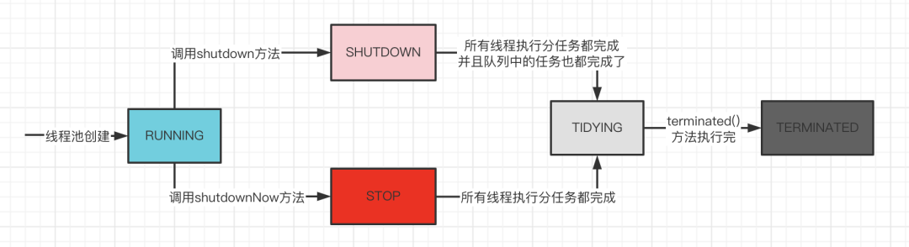

# JUC
## 基础概念

### 并发和并行

#### 并发

并发（Concurrent）是指在操作系统中，是指一个时间段中有几个程序都处于已启动运行到运行完毕之间，且这几个程序都是在同一个处理器上运行。

并发不是真正意义上的“同时进行”，只是CPU把一个时间段划分成几个时间片段(时间区间)，然后在这几个时间区间之间来回切换，由于CPU处理的速度非常快，只要时间间隔处理得当，即可让用户感觉是多个应用程序同时在进行。


#### 并行

并行（Parallel）是指当系统有一个以上CPU时，当一个CPU执行一个进程时，另一个CPU可以执行另一个进程，两个进程互不抢占CPU资源。

其实决定并行的因素不是CPU的数量，而是CPU的核心数量，比如一个CPU多个核也可以并行。适合科学计算，后台处理等弱交互场景。


##### 并发和并行对比

- 并发，指的是多个事情，在同一时间段内同时发生了；并行，指的是多个事情，在同一时间点上同时发生了。
- 并发的多个任务之间是互相抢占资源的；并行的多个任务之间是不互相抢占资源的。
- 只有在多CPU或者一个CPU多核的情况中，才会发生并行；否则，看似同时发生的事情，其实都是并发执行的。


### 核心概念
- 分工

分工就是将一个比较大的任务，拆分成多个大小合适的任务，交给合适的线程去完成，强调的是性能。

Java中提供的Executor、Fork/Join和Future都是实现分工的一种方式。

- 同步

在并发编程中的同步，主要指的是一个线程执行完任务后，如何通知其他的线程继续执行，强调的是性能。当线程执行的条件不满足时，线程需要继续等待，一旦条件满足，就需要唤醒等待的线程继续执行。

Java中提供了一些实现线程之间同步的工具类，比如说：CountDownLatch、 CyclicBarrier 等。

- 互斥

同一时刻，只允许一个线程访问共享变量，强调的是线程执行任务的正确性。如果多个线程同时访问同一个共享变量，则可能会发生意想不到的后果，而这种意想不到的后果主要是由线程的可见性、原子性和有序性问题产生的。而解决可见性、原子性和有序性问题的核心，就是互斥。

Java中提供的synchronized、Lock、ThreadLocal、final关键字等都可以解决互斥的问题。

### 导致问题原因
缓存导致的可见性问题、线程切换导致的原子性问题、编译优化导致的有序性问题。

#### 可见性
可见性问题，可以这样理解为一个线程修改了共享变量，另一个线程不能立刻看到，这是由于CPU添加了缓存导致的问题。

单核CPU不存在可见性问题，因为在单核CPU上，无论创建了多少个线程，同一时刻只会有一个线程能够获取到CPU的资源来执行任务，即使这个单核的CPU已经添加了缓存。

多核CPU上，每个CPU的内核都有自己的缓存。当多个不同的线程运行在不同的CPU内核上时，这些线程操作的是不同的CPU缓存。一个线程对其绑定的CPU的缓存的写操作，对于另外一个线程来说，不一定是可见的，这就造成了线程的可见性问题。

##### Java中的可见性问题
使用Java语言编写并发程序时，如果线程使用变量时，会把主内存中的数据复制到线程的私有内存，也就是工作内存中，每个线程读写数据时，都是操作自己的工作内存中的数据。

此时，Java中线程读写共享变量的模型与多核CPU类似，原因是Java并发程序运行在多核CPU上时，线程的私有内存，也就是工作内存就相当于多核CPU中每个CPU内核的缓存了。

```java
@Slf4j
public class ConcurrentTest {
    private int viewableCount;
    private void plusViewableCount() {
        viewableCount++;
    }

    @Test
    @SneakyThrows
    public void viewablePrincipleTest(){
        Thread threadA = new Thread(() -> {
            for(int i = 0; i < 1000; i++){
                plusViewableCount();
            }
        });

        Thread threadB = new Thread(() -> {
            for(int i = 0; i < 1000; i++){
                plusViewableCount();
            }
        });

        threadA.start();
        threadB.start();

        threadA.join();
        threadB.join();
        log.info("viewableCount result : " + viewableCount);
    }
}
```

> 执行结果
```
viewableCunt result : 1483
```

而在整个计算的过程中，线程A和线程B都是基于各自工作内存中的viewableCount值进行计算。这就导致了最终的count值小于2000。

#### 原子性
原子性是指一个或者多个操作在CPU中执行的过程不被中断的特性。原子性操作一旦开始运行，就会一直到运行结束为止，中间不会有中断的情况发生。

##### 线程切换
在并发编程中，往往设置的线程数目会大于CPU数目，而每个CPU在同一时刻只能被一个线程使用。而CPU资源的分配采用了时间片轮转策略，也就是给每个线程分配一个时间片，线程在这个时间片内占用CPU的资源来执行任务。当占用CPU资源的线程执行完任务后，会让出CPU的资源供其他线程运行，这就是任务切换，也叫做线程切换或者线程的上下文切换。

线程在执行某项操作时，此时由于CPU发生了线程切换，CPU转而去执行其他的任务，中断了当前线程执行的操作，这就会造成原子性问题。

#### 有序性


## 线程池

### 基础概念

在java程序中，其实经常需要用到多线程来处理一些业务，但是不建议单纯使用继承Thread或者实现Runnable接口的方式来创建线程，那样就会导致频繁创建及销毁线程，同时创建过多的线程也可能引发资源耗尽的风险。所以在这种情况下，使用线程池是一种更合理的选择，方便管理任务，实现了线程的重复利用。所以线程池一般适合那种需要异步或者多线程处理任务的场景。


> **池化技术的思想主要是为了减少每次获取资源的消耗，提高对资源的利用率。线程池、数据库连接池、Http 连接池等等都是对这个思想的应用。**


**线程池**提供了一种限制和管理资源（包括执行一个任务）。 每个**线程池**还维护一些基本统计信息，例如已完成任务的数量。**使用线程池的好处**：

- **降低资源消耗**。通过重复利用已创建的线程降低线程创建和销毁造成的消耗。
- **提高响应速度**。当任务到达时，任务可以不需要的等到线程创建就能立即执行。
- **提高线程的可管理性**。线程是稀缺资源，如果无限制的创建，不仅会消耗系统资源，还会降低系统的稳定性，使用线程池可以进行统一的分配，调优和监控。


#### 线程池状态

线程池内部有5个常量来代表线程池的五种状态：

> java.util.concurrent.ThreadPoolExecutor

```java
		private static final int RUNNING    = -1 << COUNT_BITS;
    private static final int SHUTDOWN   =  0 << COUNT_BITS;
    private static final int STOP       =  1 << COUNT_BITS;
    private static final int TIDYING    =  2 << COUNT_BITS;
    private static final int TERMINATED =  3 << COUNT_BITS;

    /*
     * 存储线程池状态和线程池中线程数
     */
    private final AtomicInteger ctl = new AtomicInteger(ctlOf(RUNNING, 0));
```

- **RUNNING**：线程池创建时就是这个状态，能够接收新任务，以及对已添加的任务进行处理。
- **SHUTDOWN**：调用shutdown方法线程池就会转换成SHUTDOWN状态，此时线程池不再接收新任务，但能继续处理已添加的任务到队列中任务。
- **STOP**：调用shutdownNow方法线程池就会转换成STOP状态，不接收新任务，也不能继续处理已添加的任务到队列中任务，并且会尝试中断正在处理的任务的线程。
- **TIDYING**：SHUTDOWN 状态下，任务数为 0， 其他所有任务已终止，线程池会变为 TIDYING 状态；线程池在 SHUTDOWN 状态，任务队列为空且执行中任务为空，线程池会变为 TIDYING 状态；线程池在 STOP 状态，线程池中执行中任务为空时，线程池会变为 TIDYING 状态。
- **TERMINATED**：线程池彻底终止。线程池在 TIDYING 状态执行完 terminated() 方法就会转变为 TERMINATED 状态。


5种状态的流转如下：



在线程池运行过程中，绝大多数操作执行前都得判断当前线程池处于哪种状态，再来决定是否继续执行该操作。


#### 对比Thread创建线程
Thread直接创建线程的弊端

- 每次new Thread新建对象，性能差。

- 线程缺乏统一管理，可能无限制的新建线程，相互竞争，有可能占用过多系统资源导致死机或OOM。

- 缺少更多的功能，如更多执行、定期执行、线程中断。


### 线程池原理

#### 创建线程池

创建线程池的方法有两种，通过ThreadPoolExecutor构造方法实现和通过Executors工具类方法来实现。


##### ThreadPoolExecutor方式

> java.util.concurrent.ThreadPoolExecutor

```java
    public ThreadPoolExecutor(int corePoolSize,
                              int maximumPoolSize,
                              long keepAliveTime,
                              TimeUnit unit,
                              BlockingQueue<Runnable> workQueue,
                              ThreadFactory threadFactory,
                              RejectedExecutionHandler handler) {
        if (corePoolSize < 0 ||
            maximumPoolSize <= 0 ||
            maximumPoolSize < corePoolSize ||
            keepAliveTime < 0)
            throw new IllegalArgumentException();
        if (workQueue == null || threadFactory == null || handler == null)
            throw new NullPointerException();
        this.acc = System.getSecurityManager() == null ?
                null :
                AccessController.getContext();
        this.corePoolSize = corePoolSize;
        this.maximumPoolSize = maximumPoolSize;
        this.workQueue = workQueue;
        this.keepAliveTime = unit.toNanos(keepAliveTime);
        this.threadFactory = threadFactory;
        this.handler = handler;
    }
```


`ThreadPoolExecutor` 类中提供四个构造方法，其余三个都是在这个构造方法的基础上产生。


**`ThreadPoolExecutor` 3 个最重要的参数：**

- **`corePoolSize`(int)**： 核心线程数线程数定义了最小可以同时运行的线程数量。
- **`maximumPoolSize`(int) **：最大线程数，线程池允许创建的最大线程数。当队列中存放的任务达到队列容量的时候，当前可以同时运行的线程数量变为最大线程数。
- **`workQueue`**：当新任务来的时候会先判断当前运行的线程数量是否达到核心线程数，如果达到的话，新任务就会被存放在队列中。


**ThreadPoolExecutor 其他常见参数：**

1. **`keepAliveTime`(long)**：超出 corePoolSize 后创建的线程存活时间或者是所有线程最大存活时间，取决于配置。
2. **`unit`** ：`keepAliveTime` 参数的时间单位。
3. **`threadFactory`** ：线程池内部创建线程所用的工厂。
4. **`handler`** ：拒绝策略。当队列已满并且线程数量达到最大线程数量时，会调用该方法处理该任务。


##### Executors方式

《阿里巴巴 Java 开发手册》中强制线程池不允许使用 Executors 去创建，而是通过 ThreadPoolExecutor 的方式，这样的处理方式让写的同学更加明确线程池的运行规则，规避资源耗尽的风险。


###### FixedThreadPool

> java.util.concurrent.Executors

```java
    public static ExecutorService newFixedThreadPool(int nThreads) {
        return new ThreadPoolExecutor(nThreads, nThreads,
                                      0L, TimeUnit.MILLISECONDS,
                                      new LinkedBlockingQueue<Runnable>());
    }

    public static ExecutorService newFixedThreadPool(int nThreads, ThreadFactory threadFactory) {
        return new ThreadPoolExecutor(nThreads, nThreads,
                                      0L, TimeUnit.MILLISECONDS,
                                      new LinkedBlockingQueue<Runnable>(),
                                      threadFactory);
    }
```


**FixedThreadPool** ： 该方法返回一个固定线程数量的线程池，核心线程数与最大线程数相等。该线程池中的线程数量始终不变。当有一个新的任务提交时，线程池中若有空闲线程，则立即执行。若没有，则新的任务会被暂存在一个任务队列中，待有线程空闲时，便处理在任务队列中的任务。


###### SingleThreadExecutor

> java.util.concurrent.Executors

```java
    public static ExecutorService newSingleThreadExecutor() {
        return new FinalizableDelegatedExecutorService
            (new ThreadPoolExecutor(1, 1,
                                    0L, TimeUnit.MILLISECONDS,
                                    new LinkedBlockingQueue<Runnable>()));
    }

    public static ExecutorService newSingleThreadExecutor(ThreadFactory threadFactory) {
        return new FinalizableDelegatedExecutorService
            (new ThreadPoolExecutor(1, 1,
                                    0L, TimeUnit.MILLISECONDS,
                                    new LinkedBlockingQueue<Runnable>(),
                                    threadFactory));
    }
```


**SingleThreadExecutor：** 方法返回一个只有一个线程的线程池。若多余一个任务被提交到该线程池，任务会被保存在一个任务队列中，待线程空闲，按先入先出的顺序执行队列中的任务。


###### CachedThreadPool

> java.util.concurrent.Executors

```java
    public static ExecutorService newCachedThreadPool() {
        return new ThreadPoolExecutor(0, Integer.MAX_VALUE,
                                      60L, TimeUnit.SECONDS,
                                      new SynchronousQueue<Runnable>());
    }

    public static ExecutorService newCachedThreadPool(ThreadFactory threadFactory) {
        return new ThreadPoolExecutor(0, Integer.MAX_VALUE,
                                      60L, TimeUnit.SECONDS,
                                      new SynchronousQueue<Runnable>(),
                                      threadFactory);
    }
```


**CachedThreadPool：** 接近无限大线程数量的线程池，该方法返回一个可根据实际情况调整线程数量的线程池。线程池的线程数量不确定，但若有空闲线程可以复用，则会优先使用可复用的线程。若所有线程均在工作，又有新的任务提交，则会创建新的线程处理任务。所有线程在当前任务执行完毕后，将返回线程池进行复用。


###### ScheduledThreadPool

> java.util.concurrent.Executors

```java
    /**
     * 创建一个线程池，可以安排命令在给定延迟后运行，或定期执行。
     */
    public static ScheduledExecutorService newScheduledThreadPool(int corePoolSize) {
        return new ScheduledThreadPoolExecutor(corePoolSize);
    }

    public static ScheduledExecutorService newScheduledThreadPool(
            int corePoolSize, ThreadFactory threadFactory) {
        return new ScheduledThreadPoolExecutor(corePoolSize, threadFactory);
    }
```


> java.util.concurrent.ScheduledThreadPoolExecutor

```java
public ScheduledThreadPoolExecutor(int corePoolSize) {
    super(corePoolSize, Integer.MAX_VALUE, 0, NANOSECONDS,
          new DelayedWorkQueue());
}
```


###### 总结

因为从上面构造线程池可以看出，newFixedThreadPool线程池，由于使用了LinkedBlockingQueue，队列的容量默认是无限大，实际使用中出现任务过多时会导致内存溢出；newCachedThreadPool线程池由于核心线程数无限大，当任务过多的时候，会导致创建大量的线程，可能机器负载过高，可能会导致服务宕机。


Executors 返回线程池对象的弊端如下：

- **FixedThreadPool 和 SingleThreadExecutor** ： 允许请求的队列长度为 Integer.MAX_VALUE ，可能堆积大量的请求，从而导致 OOM。
- **CachedThreadPool 和 ScheduledThreadPool** ： 允许创建的线程数量为 Integer.MAX_VALUE ，可能会创建大量线程，从而导致 OOM。


#### 提交任务

##### execute

> java.util.concurrent.ThreadPoolExecutor

```java
   // 存放线程池的运行状态 (runState) 和线程池内有效线程的数量 (workerCount)
   private final AtomicInteger ctl = new AtomicInteger(ctlOf(RUNNING, 0));

    private static int workerCountOf(int c) {
        return c & CAPACITY;
    }

    private final BlockingQueue<Runnable> workQueue;

    public void execute(Runnable command) {
        // 如果任务为null，则抛出异常。
        if (command == null)
            throw new NullPointerException();
        // ctl 中保存的线程池当前的一些状态信息
        int c = ctl.get();

        // 1.首先判断当前线程池中之行的任务数量是否小于 corePoolSize
        // 如果小于的话，通过addWorker(command, true)新建一个线程，并将任务(command)添加到该线程中；
        // 然后，启动该线程从而执行任务。
        if (workerCountOf(c) < corePoolSize) {
            if (addWorker(command, true))
                return;
            c = ctl.get();
        }
        // 2.如果当前之行的任务数量大于等于 corePoolSize 的时候就会走到这里
        // 通过 isRunning 方法判断线程池状态，线程池处于 RUNNING 状态才会被并且队列可以加入任务，该任务才会被加入进去
        if (isRunning(c) && workQueue.offer(command)) {
            int recheck = ctl.get();
            // 再次获取线程池状态，如果线程池状态不是 RUNNING 状态就需要从任务队列中移除任务，
            // 并尝试判断线程是否全部执行完毕。同时执行拒绝策略。
            if (!isRunning(recheck) && remove(command))
                reject(command);
                
            else if (workerCountOf(recheck) == 0)
                // 如果当前线程池为空就新创建一个线程并执行。
                addWorker(null, false);
        }
        //3. 通过addWorker(command, false)新建一个线程，并将任务(command)添加到该线程中；然后，启动该线程从而执行任务。
        //如果addWorker(command, false)执行失败，则通过reject()执行相应的拒绝策略的内容。
        else if (!addWorker(command, false))
            reject(command);
    }

```


在代码中模拟了 10 个任务，我们配置的核心线程数为 5 、等待队列容量为 100 ，所以每次只可能存在 5 个任务同时执行，剩下的 5 个任务会被放到等待队列中去。当前的 5 个任务之行完成后，才会之行剩下的 5 个任务。


###### 判断核心线程数

提交任务后判断当前线程池的线程数是否小于核心线程数，如果小于，那么就直接通过ThreadFactory创建一个线程来执行这个任务。

当任务执行完之后，线程不会退出，而是会去从阻塞队列中获取任务。

提交任务的时候，就算有线程池里的线程从阻塞队列中获取不到任务，如果线程池里的线程数还是小于核心线程数，那么依然会继续创建线程，而不是复用已有的线程。


###### 入等待队列

线程池里的线程数不小于核心线程数时就会尝试将任务放入阻塞队列中，入队成功之后，阻塞的线程就可以获取到任务。


###### 判断最大线程数

等待队列已经满了，任务放入失败了时，判断当前线程池里的线程数是否小于最大线程数，如果小于最大线程数，那么也会创建非核心线程来执行提交的任务。

就算队列中有任务，新创建的线程还是优先处理这个提交的任务，而不是从队列中获取已有的任务执行，从这可以看出，先提交的任务不一定先执行。

线程数已经达到了最大线程数量时，就会执行拒绝策略。


##### submit

> java.util.concurrent.ThreadPoolExecutor

```java
public <T> Future<T> submit(Callable<T> task) {
    if (task == null) throw new NullPointerException();
    RunnableFuture<T> ftask = newTaskFor(task);
    execute(ftask);
    return ftask;
}

protected <T> RunnableFuture<T> newTaskFor(Callable<T> callable) {
    return new FutureTask<T>(callable);
}

public Future<?> submit(Runnable task) {
    if (task == null) throw new NullPointerException();
    RunnableFuture<Void> ftask = newTaskFor(task, null);
    execute(ftask);
    return ftask;
}

protected <T> RunnableFuture<T> newTaskFor(Runnable runnable, T value) {
    return new FutureTask<T>(runnable, value);
}

public <T> Future<T> submit(Runnable task, T result) {
    if (task == null) throw new NullPointerException();
    RunnableFuture<T> ftask = newTaskFor(task, result);
    execute(ftask);
    return ftask;
}
```


######  execute()方法和 submit()方法的区别

1. **`execute()`方法用于提交不需要返回值的任务，所以无法判断任务是否被线程池执行成功与否；**

2. **`submit()`方法用于提交需要返回值的任务。线程池会返回一个 `Future` 类型的对象，通过这个 `Future` 对象可以判断任务是否执行成功**，并且可以通过 `Future` 的 `get()`方法来获取返回值，`get()`方法会阻塞当前线程直到任务完成，而使用 `get（long timeout，TimeUnit unit）`方法则会阻塞当前线程一段时间后立即返回，这时候有可能任务没有执行完。

	

#### 线程复用

线程池的核心功能就是实现了线程的重复利用，线程在线程池内部被封装成一个Worker对象，Worker继承了AQS，也就是有一定锁的特性。

> java.util.concurrent.ThreadPoolExecutor.Worker

```java
    private final class Worker
        extends AbstractQueuedSynchronizer
        implements Runnable
    {
        /**
         * This class will never be serialized, but we provide a
         * serialVersionUID to suppress a javac warning.
         */
        private static final long serialVersionUID = 6138294804551838833L;

        /** Thread this worker is running in.  Null if factory fails. */
        final Thread thread;
        /** Initial task to run.  Possibly null. */
        Runnable firstTask;
        /** Per-thread task counter */
        volatile long completedTasks;

        /**
         * Creates with given first task and thread from ThreadFactory.
         * @param firstTask the first task (null if none)
         */
        Worker(Runnable firstTask) {
            setState(-1); // inhibit interrupts until runWorker
            this.firstTask = firstTask;
            this.thread = getThreadFactory().newThread(this);
        }

        /** Delegates main run loop to outer runWorker  */
        public void run() {
            runWorker(this);
        }

        // Lock methods
        //
        // The value 0 represents the unlocked state.
        // The value 1 represents the locked state.

        protected boolean isHeldExclusively() {
            return getState() != 0;
        }

        protected boolean tryAcquire(int unused) {
            if (compareAndSetState(0, 1)) {
                setExclusiveOwnerThread(Thread.currentThread());
                return true;
            }
            return false;
        }

        protected boolean tryRelease(int unused) {
            setExclusiveOwnerThread(null);
            setState(0);
            return true;
        }

        public void lock()        { acquire(1); }
        public boolean tryLock()  { return tryAcquire(1); }
        public void unlock()      { release(1); }
        public boolean isLocked() { return isHeldExclusively(); }

        void interruptIfStarted() {
            Thread t;
            if (getState() >= 0 && (t = thread) != null && !t.isInterrupted()) {
                try {
                    t.interrupt();
                } catch (SecurityException ignore) {
                }
            }
        }
    }
```


##### 创建线程

创建线程来执行任务的方法上面提到是通过addWorker方法创建的。在创建Worker对象的时候，会把线程和任务一起封装到Worker内部，然后调用runWorker方法来让线程执行任务。

> java.util.concurrent.ThreadPoolExecutor

```java
    private boolean addWorker(Runnable firstTask, boolean core) {
        retry:
        for (;;) {
            int c = ctl.get();
            int rs = runStateOf(c);

            // Check if queue empty only if necessary.
            if (rs >= SHUTDOWN &&
                ! (rs == SHUTDOWN &&
                   firstTask == null &&
                   ! workQueue.isEmpty()))
                return false;

            for (;;) {
                int wc = workerCountOf(c);
                if (wc >= CAPACITY ||
                    wc >= (core ? corePoolSize : maximumPoolSize))
                    return false;
                if (compareAndIncrementWorkerCount(c))
                    break retry;
                c = ctl.get();  // Re-read ctl
                if (runStateOf(c) != rs)
                    continue retry;
                // else CAS failed due to workerCount change; retry inner loop
            }
        }

        boolean workerStarted = false;
        boolean workerAdded = false;
        Worker w = null;
        try {
            w = new Worker(firstTask);
            final Thread t = w.thread;
            if (t != null) {
                final ReentrantLock mainLock = this.mainLock;
                mainLock.lock();
                try {
                    // Recheck while holding lock.
                    // Back out on ThreadFactory failure or if
                    // shut down before lock acquired.
                    int rs = runStateOf(ctl.get());

                    if (rs < SHUTDOWN ||
                        (rs == SHUTDOWN && firstTask == null)) {
                        if (t.isAlive()) // precheck that t is startable
                            throw new IllegalThreadStateException();
                        workers.add(w);
                        int s = workers.size();
                        if (s > largestPoolSize)
                            largestPoolSize = s;
                        workerAdded = true;
                    }
                } finally {
                    mainLock.unlock();
                }
                if (workerAdded) {
                    t.start();
                    workerStarted = true;
                }
            }
        } finally {
            if (! workerStarted)
                addWorkerFailed(w);
        }
        return workerStarted;
    }
```


##### 执行线程

> java.util.concurrent.ThreadPoolExecutor

```java
    final void runWorker(Worker w) {
        Thread wt = Thread.currentThread();
        Runnable task = w.firstTask;
        w.firstTask = null;
        w.unlock(); // allow interrupts
        boolean completedAbruptly = true;
        try {
            while (task != null || (task = getTask()) != null) {
                w.lock();
                // If pool is stopping, ensure thread is interrupted;
                // if not, ensure thread is not interrupted.  This
                // requires a recheck in second case to deal with
                // shutdownNow race while clearing interrupt
                if ((runStateAtLeast(ctl.get(), STOP) ||
                     (Thread.interrupted() &&
                      runStateAtLeast(ctl.get(), STOP))) &&
                    !wt.isInterrupted())
                    wt.interrupt();
                try {
                    beforeExecute(wt, task);
                    Throwable thrown = null;
                    try {
                        task.run();
                    } catch (RuntimeException x) {
                        thrown = x; throw x;
                    } catch (Error x) {
                        thrown = x; throw x;
                    } catch (Throwable x) {
                        thrown = x; throw new Error(x);
                    } finally {
                        afterExecute(task, thrown);
                    }
                } finally {
                    task = null;
                    w.completedTasks++;
                    w.unlock();
                }
            }
            completedAbruptly = false;
        } finally {
            processWorkerExit(w, completedAbruptly);
        }
    }
```


可以看出线程执行完任务不会退出的原因，runWorker内部使用了while死循环，当第一个任务执行完之后，会不断地通过getTask方法获取任务，只要能获取到任务，就会调用run方法，继续执行任务，这就是线程能够复用的主要原因。

如果从getTask获取不到方法的时候，最后就会调用finally中的processWorkerExit方法，来将线程退出。

因为Worker继承了AQS，每次在执行任务之前都会调用Worker的lock方法，执行完任务之后，会调用unlock方法，这样做的目的就可以通过Woker的加锁状态就能判断出当前线程是否正在运行任务。如果想知道线程是否正在运行任务，只需要调用Woker的tryLock方法，根据是否加锁成功就能判断，加锁成功说明当前线程没有加锁，也就没有执行任务了，在调用shutdown方法关闭线程池的时候，就用这种方式来判断线程有没有在执行任务，如果没有的话，来尝试打断没有执行任务的线程。


#### 再次获取任务

线程在执行完任务之后，会继续从getTask方法中获取任务，获取不到就会退出。

> java.util.concurrent.ThreadPoolExecutor

```java
    private Runnable getTask() {
        boolean timedOut = false; // Did the last poll() time out?

        for (;;) {
            int c = ctl.get();
            int rs = runStateOf(c);

            // Check if queue empty only if necessary.
            if (rs >= SHUTDOWN && (rs >= STOP || workQueue.isEmpty())) {
                decrementWorkerCount();
                return null;
            }

            int wc = workerCountOf(c);

            // 判断当前过来获取任务的线程是否可以超时退出
            boolean timed = allowCoreThreadTimeOut || wc > corePoolSize;

            if ((wc > maximumPoolSize || (timed && timedOut))
                && (wc > 1 || workQueue.isEmpty())) {
                if (compareAndDecrementWorkerCount(c))
                    return null;
                continue;
            }

            try {
                // 超时退出利用队列的 poll 方法实现，超时则会返回null，然后退出线程
                // 没有设置超时则会调用 take 方法阻塞获取任务
                Runnable r = timed ?
                    workQueue.poll(keepAliveTime, TimeUnit.NANOSECONDS) :
                    workQueue.take();
                if (r != null)
                    return r;
                timedOut = true;
            } catch (InterruptedException retry) {
                timedOut = false;
            }
        }
    }
```


根据是否允许超时来选择调用阻塞队列workQueue的poll方法或者take方法。如果允许超时，则会调用poll方法，传入keepAliveTime，也就是构造线程池时传入的空闲时间，这个方法的意思就是从队列中阻塞keepAliveTime时间来获取任务，获取不到就会返回null；如果不允许超时，就会调用take方法，这个方法会一直阻塞获取任务，直到从队列中获取到任务位置。从这里可以看到keepAliveTime是如何使用的了。

所以到这里应该就知道线程池中的线程为什么可以做到空闲一定时间就退出了吧。其实最主要的是利用了阻塞队列的poll方法的实现，这个方法可以指定超时时间，一旦线程达到了keepAliveTime还没有获取到任务，那么就会返回null，上一小节提到，getTask方法返回null，线程就会退出。

这里也有一个细节，就是判断当前获取任务的线程是否可以超时退出的时候，如果将allowCoreThreadTimeOut设置为true，那么所有线程走到这个timed都是true，那么所有的线程，包括核心线程都可以做到超时退出。如果你的线程池需要将核心线程超时退出，那么可以通过allowCoreThreadTimeOut方法将allowCoreThreadTimeOut变量设置为true。


#### 关闭线程池

线程池提供了shutdown和shutdownNow两个方法来关闭线程池。


##### shutdown

> java.util.concurrent.ThreadPoolExecutor

```java
    public void shutdown() {
        final ReentrantLock mainLock = this.mainLock;
        mainLock.lock();
        try {
            checkShutdownAccess();
            advanceRunState(SHUTDOWN);
            interruptIdleWorkers();
            onShutdown(); // hook for ScheduledThreadPoolExecutor
        } finally {
            mainLock.unlock();
        }
        tryTerminate();
    }
```


就是将线程池的状态修改为SHUTDOWN，然后尝试打断空闲的线程（如何判断空闲，上面在说Worker继承AQS的时候说过），也就是在阻塞等待任务的线程。


##### shutdownNow

> java.util.concurrent.ThreadPoolExecutor

```java
    public List<Runnable> shutdownNow() {
        List<Runnable> tasks;
        final ReentrantLock mainLock = this.mainLock;
        mainLock.lock();
        try {
            checkShutdownAccess();
            advanceRunState(STOP);
            interruptWorkers();
            tasks = drainQueue();
        } finally {
            mainLock.unlock();
        }
        tryTerminate();
        return tasks;
    }
```

就是将线程池的状态修改为STOP，然后尝试打断所有的线程，从阻塞队列中移除剩余的任务，这也是为什么shutdownNow不能执行剩余任务的原因。

shutdown方法和shutdownNow方法的主要区别就是，shutdown之后还能处理在队列中的任务，shutdownNow直接就将任务从队列中移除，线程池里的线程就不再处理了。


#### 监控方法

在项目中使用线程池的时候，一般需要对线程池进行监控，方便出问题的时候进行查看。线程池本身提供了一些方法来获取线程池的运行状态。


| 方法                  | 描述                                                         |
| --------------------- | ------------------------------------------------------------ |
| getCompletedTaskCount | 已经执行完成的任务数量                                       |
| getActiveCount        | 获取正在执行任务的线程数据                                   |
| getTaskCount          | 获取线程池已执行和未执行的任务总数                           |
| getLargestPoolSize    | 线程池里曾经创建过的最大的线程数量。这个主要是用来判断线程是否满过。 |
| getCorePoolSize       | 获取线程池核心线程数                                         |
| getPoolSize           | 获取当前线程池中线程数量的大小                               |


除了线程池提供的上述已经实现的方法，同时线程池也预留了很对扩展方法。比如在runWorker方法里面，在执行任务之前会回调beforeExecute方法，执行任务之后会回调afterExecute方法，而这些方法默认都是空实现，你可以自己继承ThreadPoolExecutor来扩展重写这些方法，来实现自己想要的功能。

##### getCompletedTaskCount

**获取已完成的任务数量**

> java.util.concurrent.ThreadPoolExecutor

```java
    /**
     * Returns the approximate total number of tasks that have
     * completed execution. Because the states of tasks and threads
     * may change dynamically during computation, the returned value
     * is only an approximation, but one that does not ever decrease
     * across successive calls.
     *
     * @return the number of tasks
     */
    public long getCompletedTaskCount() {
        final ReentrantLock mainLock = this.mainLock;
        mainLock.lock();
        try {
            long n = completedTaskCount;
            for (Worker w : workers)
                n += w.completedTasks;
            return n;
        } finally {
            mainLock.unlock();
        }
    }
```


##### getActiveCount

**获取当前线程池中正在执行任务的线程数量**

> java.util.concurrent.ThreadPoolExecutor

```java
public class ThreadPoolExecutor extends AbstractExecutorService {
    /**
     * Returns the approximate number of threads that are actively
     * executing tasks.
     *
     * @return the number of threads
     */
    public int getActiveCount() {
        final ReentrantLock mainLock = this.mainLock;
        mainLock.lock();
        try {
            int n = 0;
            for (Worker w : workers)
                if (w.isLocked())
                    ++n;
            return n;
        } finally {
            mainLock.unlock();
        }
    }    
}
```


##### getTaskCount

**获取线程池已执行和未执行的任务总数**

> java.util.concurrent.ThreadPoolExecutor

```java
    /**
     * Returns the approximate total number of tasks that have ever been
     * scheduled for execution. Because the states of tasks and
     * threads may change dynamically during computation, the returned
     * value is only an approximation.
     *
     * @return the number of tasks
     */
    public long getTaskCount() {
        final ReentrantLock mainLock = this.mainLock;
        mainLock.lock();
        try {
            long n = completedTaskCount;
            for (Worker w : workers) {
                n += w.completedTasks;
                if (w.isLocked())
                    ++n;
            }
            return n + workQueue.size();
        } finally {
            mainLock.unlock();
        }
    }
```


##### getLargestPoolSize

> java.util.concurrent.ThreadPoolExecutor

```java
/**
 * 返回池中同时存在的最大线程数。
 */
public int getLargestPoolSize() {
    final ReentrantLock mainLock = this.mainLock;
    mainLock.lock();
    try {
        return largestPoolSize;
    } finally {
        mainLock.unlock();
    }
}
```


##### getCorePoolSize

**获取线程池核心线程数**

> java.util.concurrent.ThreadPoolExecutor

```java
    /**
     * Returns the core number of threads.
     *
     * @return the core number of threads
     * @see #setCorePoolSize
     */
    public int getCorePoolSize() {
        return corePoolSize;
    }    
```


##### getPoolSize

**获取线程池当前的线程数量**

> java.util.concurrent.ThreadPoolExecutor

```java
    /**
     * Returns the current number of threads in the pool.
     *
     * @return the number of threads
     */
    public int getPoolSize() {
        final ReentrantLock mainLock = this.mainLock;
        mainLock.lock();
        try {
            // Remove rare and surprising possibility of
            // isTerminated() && getPoolSize() > 0
            return runStateAtLeast(ctl.get(), TIDYING) ? 0
                : workers.size();
        } finally {
            mainLock.unlock();
        }
    }    
```


### 拒绝策略

数据源连接池一般请求的连接数超过连接池的最大值的时候就会触发拒绝策略，策略一般是阻塞等待设置的时间或者直接抛异常。

当提交的任务数大于corePoolSize时，会优先放到队列缓冲区，只有填满了缓冲区后，才会判断当前运行的任务是否大于maxPoolSize，小于时会新建线程处理。大于时就触发了拒绝策略，总结就是：当前提交任务数大于（maxPoolSize + queueCapacity）时就会触发线程池的拒绝策略了。


#### 拒绝策略总览

| 名称                          | 描述           | 提供方   |
| ----------------------------- | -------------- | -------- |
| CallerRunsPolicy              | 调用者运行策略 | JDK      |
| AbortPolicy                   | 中止策略       | JDK      |
| DiscardPolicy                 | 丢弃策略       | JDK      |
| DiscardOldestPolicy           | 丢弃最老策略   | JDK      |
| AbortPolicyWithReport         |                | Dubbo    |
| NewThreadRunsPolicy           |                | Netty    |
| ActiveMq拒绝策略              |                | ActiveMq |
| RejectedExecutionHandlerChain |                | Pinpoint |


#### JDK默认拒绝策略

当触发拒绝策略时，线程池会调用设置的具体的策略，将当前提交的任务以及线程池实例本身传递过来进行处理。所有的拒绝策略都要实现类 RejectedExecutionHandler。

> java.util.concurrent.RejectedExecutionHandler

```java
public interface RejectedExecutionHandler {
    /**
     * 
     */
    void rejectedExecution(Runnable r, ThreadPoolExecutor executor);
}
```


##### CallerRunsPolicy
用调用者所在的线程来执行任务。
> java.util.concurrent.ThreadPoolExecutor.CallerRunsPolicy
```java
/**
 * A handler for rejected tasks that runs the rejected task
 * directly in the calling thread of the {@code execute} method,
 * unless the executor has been shut down, in which case the task
 * is discarded.
 */
public static class CallerRunsPolicy implements RejectedExecutionHandler {
    /**
     * Creates a {@code CallerRunsPolicy}.
     */
    public CallerRunsPolicy() { }

    /**
     * Executes task r in the caller's thread, unless the executor
     * has been shut down, in which case the task is discarded.
     *
     * @param r the runnable task requested to be executed
     * @param e the executor attempting to execute this task
     */
    public void rejectedExecution(Runnable r, ThreadPoolExecutor e) {
        if (!e.isShutdown()) {
            r.run();
        }
    }
}
```


功能：当触发拒绝策略时，只要线程池没有关闭，就由提交任务的当前线程处理。

使用场景：一般在不允许失败的、对性能要求不高、并发量较小的场景下使用，因为线程池一般情况下不会关闭，也就是提交的任务一定会被运行，但是由于是调用者线程自己执行的，当多次提交任务时，就会阻塞后续任务执行，性能和效率自然就慢了。


##### AbortPolicy

直接抛出异常，这也是默认的策略。
> java.util.concurrent.ThreadPoolExecutor.AbortPolicy
```java
/**
 * A handler for rejected tasks that throws a
 * {@code RejectedExecutionException}.
 */
public static class AbortPolicy implements RejectedExecutionHandler {
    /**
     * Creates an {@code AbortPolicy}.
     */
    public AbortPolicy() { }

    /**
     * Always throws RejectedExecutionException.
     *
     * @param r 请求执行的任务
     * @param e 执行指定任务的执行器
     */
    public void rejectedExecution(Runnable r, ThreadPoolExecutor e) {
        throw new RejectedExecutionException("Task " + r.toString() +
                                             " rejected from " +
                                             e.toString());
    }
}
```

功能：当触发拒绝策略时，直接抛出拒绝执行的异常，中止策略的意思也就是打断当前执行流程

使用场景：这个就没有特殊的场景了，但是一点要正确处理抛出的异常。ThreadPoolExecutor中默认的策略就是AbortPolicy，ExecutorService接口的系列ThreadPoolExecutor因为都没有显示的设置拒绝策略，所以默认的都是这个。但是请注意，ExecutorService中的线程池实例队列都是无界的，也就是说把内存撑爆了都不会触发拒绝策略。当自己自定义线程池实例时，使用这个策略一定要处理好触发策略时抛的异常，因为他会打断当前的执行流程。


##### DiscardPolicy

直接丢弃当前任务。
> java.util.concurrent.ThreadPoolExecutor.DiscardPolicy
```java
/**
 * A handler for rejected tasks that silently discards the
 * rejected task.
 */
public static class DiscardPolicy implements RejectedExecutionHandler {
    /**
     * Creates a {@code DiscardPolicy}.
     */
    public DiscardPolicy() { }

    /**
     * Does nothing, which has the effect of discarding task r.
     *
     * @param r the runnable task requested to be executed
     * @param e the executor attempting to execute this task
     */
    public void rejectedExecution(Runnable r, ThreadPoolExecutor e) {
    }
}
```


##### DiscardOldestPolicy

丢弃队列中最靠前的任务并执行当前任务。
> java.util.concurrent.ThreadPoolExecutor.DiscardOldestPolicy
```java
/**
 * A handler for rejected tasks that discards the oldest unhandled
 * request and then retries {@code execute}, unless the executor
 * is shut down, in which case the task is discarded.
 */
public static class DiscardOldestPolicy implements RejectedExecutionHandler {
    /**
     * Creates a {@code DiscardOldestPolicy} for the given executor.
     */
    public DiscardOldestPolicy() { }

    /**
     * Obtains and ignores the next task that the executor
     * would otherwise execute, if one is immediately available,
     * and then retries execution of task r, unless the executor
     * is shut down, in which case task r is instead discarded.
     *
     * @param r the runnable task requested to be executed
     * @param e the executor attempting to execute this task
     */
    public void rejectedExecution(Runnable r, ThreadPoolExecutor e) {
        if (!e.isShutdown()) {
            e.getQueue().poll();
            e.execute(r);
        }
    }
}
```


功能：如果线程池未关闭，就弹出队列头部的元素，然后尝试执行

使用场景：这个策略还是会丢弃任务，丢弃时也是毫无声息，但是特点是丢弃的是老的未执行的任务，而且是待执行优先级较高的任务。基于这个特性，我能想到的场景就是，发布消息，和修改消息，当消息发布出去后，还未执行，此时更新的消息又来了，这个时候未执行的消息的版本比现在提交的消息版本要低就可以被丢弃了。因为队列中还有可能存在消息版本更低的消息会排队执行，所以在真正处理消息的时候一定要做好消息的版本比较。


#### 其它拒绝策略

##### Dubbo中的线程拒绝策略

```java
public class AbortPolicyWithReport extends ThreadPoolExecutor.AbortPolicy {

    protected static final Logger logger = LoggerFactory.getLogger(AbortPolicyWithReport.class);

    private final String threadName;

    private final URL url;

    private static volatilelong lastPrintTime = 0;

    private static Semaphore guard = new Semaphore(1);

    public AbortPolicyWithReport(String threadName, URL url) {
        this.threadName = threadName;
        this.url = url;
    }

    @Override
    public void rejectedExecution(Runnable r, ThreadPoolExecutor e) {
        String msg = String.format("Thread pool is EXHAUSTED!" +
                        " Thread Name: %s, Pool Size: %d (active: %d, core: %d, max: %d, largest: %d), Task: %d (completed: %d)," +
                        " Executor status:(isShutdown:%s, isTerminated:%s, isTerminating:%s), in %s://%s:%d!",
                threadName, e.getPoolSize(), e.getActiveCount(), e.getCorePoolSize(), e.getMaximumPoolSize(), e.getLargestPoolSize(),
                e.getTaskCount(), e.getCompletedTaskCount(), e.isShutdown(), e.isTerminated(), e.isTerminating(),
                url.getProtocol(), url.getIp(), url.getPort());
        logger.warn(msg);
        dumpJStack();
        thrownew RejectedExecutionException(msg);
    }

    private void dumpJStack() {
       //省略实现
    }
}
```

Dubbo的工作线程触发了线程拒绝后，主要做了三个事情，原则就是尽量让使用者清楚触发线程拒绝策略的真实原因。

- 输出了一条警告级别的日志，日志内容为线程池的详细设置参数，以及线程池当前的状态，还有当前拒绝任务的一些详细信息。可以说，这条日志，使用dubbo的有过生产运维经验的或多或少是见过的，这个日志简直就是日志打印的典范，其他的日志打印的典范还有spring。得益于这么详细的日志，可以很容易定位到问题所在
- 输出当前线程堆栈详情，这个太有用了，当你通过上面的日志信息还不能定位问题时，案发现场的dump线程上下文信息就是你发现问题的救命稻草。
- 继续抛出拒绝执行异常，使本次任务失败，这个继承了JDK默认拒绝策略的特性


##### Netty中的线程池拒绝策略

```java
private static final class NewThreadRunsPolicy implements RejectedExecutionHandler {
        NewThreadRunsPolicy() {
            super();
        }

        public void rejectedExecution(Runnable r, ThreadPoolExecutor executor) {
            try {
                final Thread t = new Thread(r, "Temporary task executor");
                t.start();
            } catch (Throwable e) {
                thrownew RejectedExecutionException(
                        "Failed to start a new thread", e);
            }
        }
    }
```


Netty中的实现很像JDK中的CallerRunsPolicy，舍不得丢弃任务。不同的是，CallerRunsPolicy是直接在调用者线程执行的任务。而 Netty是新建了一个线程来处理的。所以，Netty的实现相较于调用者执行策略的使用面就可以扩展到支持高效率高性能的场景了。但是也要注意一点，Netty的实现里，在创建线程时未做任何的判断约束，也就是说只要系统还有资源就会创建新的线程来处理，直到new不出新的线程了，才会抛创建线程失败的异常。


##### ActiveMq中的线程池拒绝策略

```java
new RejectedExecutionHandler() {
    @Override
    public void rejectedExecution(final Runnable r, final ThreadPoolExecutor executor) {
        try {
            executor.getQueue().offer(r, 60, TimeUnit.SECONDS);
        } catch (InterruptedException e) {
            thrownew RejectedExecutionException("Interrupted waiting for BrokerService.worker");
        }

        thrownew RejectedExecutionException("Timed Out while attempting to enqueue Task.");
    }
});
```


ActiveMq中的策略属于最大努力执行任务型，当触发拒绝策略时，在尝试一分钟的时间重新将任务塞进任务队列，当一分钟超时还没成功时，就抛出异常。


##### pinpoint中的线程池拒绝策略

```java
public class RejectedExecutionHandlerChain implements RejectedExecutionHandler {
    private final RejectedExecutionHandler[] handlerChain;

    public static RejectedExecutionHandler build(List<RejectedExecutionHandler> chain) {
        Objects.requireNonNull(chain, "handlerChain must not be null");
        RejectedExecutionHandler[] handlerChain = chain.toArray(new RejectedExecutionHandler[0]);
        returnnew RejectedExecutionHandlerChain(handlerChain);
    }

    private RejectedExecutionHandlerChain(RejectedExecutionHandler[] handlerChain) {
        this.handlerChain = Objects.requireNonNull(handlerChain, "handlerChain must not be null");
    }

    @Override
    public void rejectedExecution(Runnable r, ThreadPoolExecutor executor) {
        for (RejectedExecutionHandler rejectedExecutionHandler : handlerChain) {
            rejectedExecutionHandler.rejectedExecution(r, executor);
        }
    }
}
```

pinpoint的拒绝策略实现很有特点，和其他的实现都不同。他定义了一个拒绝策略链，包装了一个拒绝策略列表，当触发拒绝策略时，会将策略链中的rejectedExecution依次执行一遍。


### 实际生产

通过上面分析提到，通过Executors这个工具类来创建的线程池其实都无法满足实际的使用场景，那么在实际的项目中，到底该如何构造线程池呢，该如何合理的设置参数？


1）线程数

线程数的设置主要取决于业务是IO密集型还是CPU密集型。


CPU密集型指的是任务主要使用来进行大量的计算，没有什么导致线程阻塞。一般这种场景的线程数设置为CPU核心数+1。


IO密集型：当执行任务需要大量的io，比如磁盘io，网络io，可能会存在大量的阻塞，所以在IO密集型任务中使用多线程可以大大地加速任务的处理。一般线程数设置为 2*CPU核心数


java中用来获取CPU核心数的方法是：Runtime.getRuntime().availableProcessors();


2）线程工厂

一般建议自定义线程工厂，构建线程的时候设置线程的名称，这样就在查日志的时候就方便知道是哪个线程执行的代码。


3）有界队列

一般需要设置有界队列的大小，比如LinkedBlockingQueue在构造的时候就可以传入参数，来限制队列中任务数据的大小，这样就不会因为无限往队列中扔任务导致系统的oom。


## Atomic原子类

原子类就是具有原子/原子操作特征的类，并发包 `java.util.concurrent` 的原子类都存放在`java.util.concurrent.atomic`下。


### 原子类分类

**基本类型**

使用原子的方式更新基本类型

- `AtomicInteger`：整形原子类
- `AtomicLong`：长整型原子类
- `AtomicBoolean`：布尔型原子类


**数组类型**

使用原子的方式更新数组里的某个元素

- `AtomicIntegerArray`：整形数组原子类
- `AtomicLongArray`：长整形数组原子类
- `AtomicReferenceArray`：引用类型数组原子类


**引用类型**

- `AtomicReference`：引用类型原子类
- `AtomicStampedReference`：原子更新带有版本号的引用类型。该类将整数值与引用关联起来，可用于解决原子的更新数据和数据的版本号，可以解决使用 CAS 进行原子更新时可能出现的 ABA 问题。
- `AtomicMarkableReference` ：原子更新带有标记位的引用类型


**对象的属性修改类型**

- `AtomicIntegerFieldUpdater`：原子更新整形字段的更新器
- `AtomicLongFieldUpdater`：原子更新长整形字段的更新器
- `AtomicReferenceFieldUpdater`：原子更新引用类型字段的更新器


## AQS

AQS（AbstractQueuedSynchronizer）是一个用来构建锁和同步器的框架，使用 AQS 能简单且高效地构造出应用广泛的大量的同步器，比如 `ReentrantLock`，`Semaphore`，其他的诸如 `ReentrantReadWriteLock`，`SynchronousQueue`，`FutureTask` 等等皆是基于 AQS 的。

**AQS 核心思想是如果被请求的共享资源空闲，则将当前请求资源的线程设置为有效的工作线程，并且将共享资源设置为锁定状态。如果被请求的共享资源被占用，那么就需要一套线程阻塞等待以及被唤醒时锁分配的机制，这个机制 AQS 是用 CLH 队列锁实现的，即将暂时获取不到锁的线程加入到队列中。**


// TODO

[AQS 原理了解么？](https://snailclimb.gitee.io/javaguide-interview/#/./docs/b-3Java%E5%A4%9A%E7%BA%BF%E7%A8%8B?id=_2325-aqs-%e5%8e%9f%e7%90%86%e4%ba%86%e8%a7%a3%e4%b9%88%ef%bc%9f)

[Java并发之AQS详解](https://www.cnblogs.com/waterystone/p/4920797.html)

[Java并发包基石-AQS详解](https://www.cnblogs.com/chengxiao/p/7141160.html)


## CountDownLatch

// TODO 

[CountDownLatch](https://snailclimb.gitee.io/javaguide-interview/#/./docs/b-3Java%E5%A4%9A%E7%BA%BF%E7%A8%8B?id=_2327-%e7%94%a8%e8%bf%87-countdownlatch-%e4%b9%88%ef%bc%9f%e4%bb%80%e4%b9%88%e5%9c%ba%e6%99%af%e4%b8%8b%e7%94%a8%e7%9a%84%ef%bc%9f)


## CompletableFuture

### 创建
#### runAsync 方法
#### supplyAsync 方法


### 获取结果
