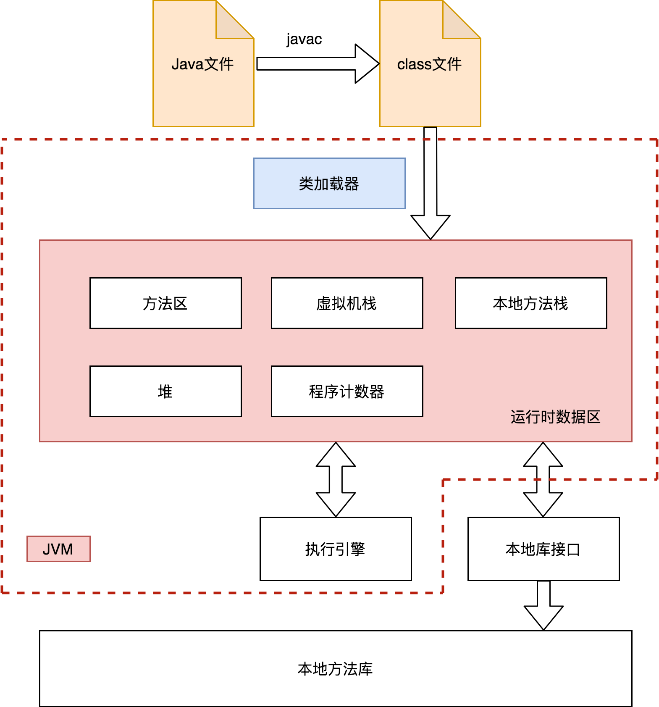
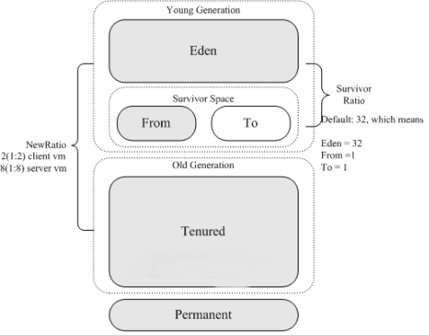
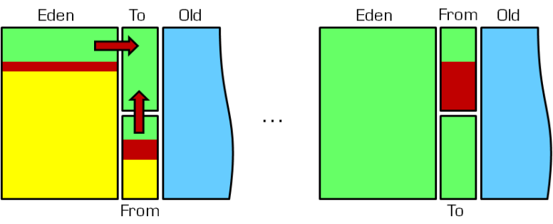
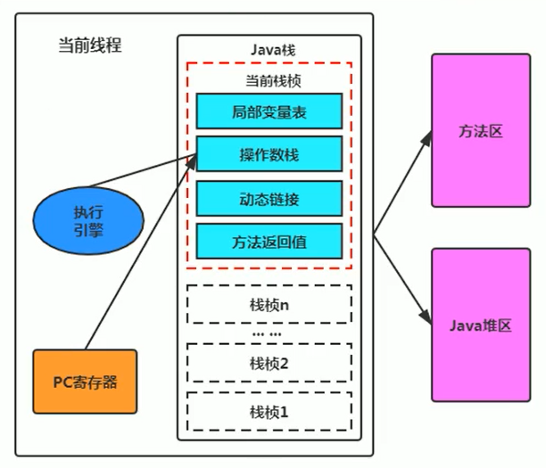
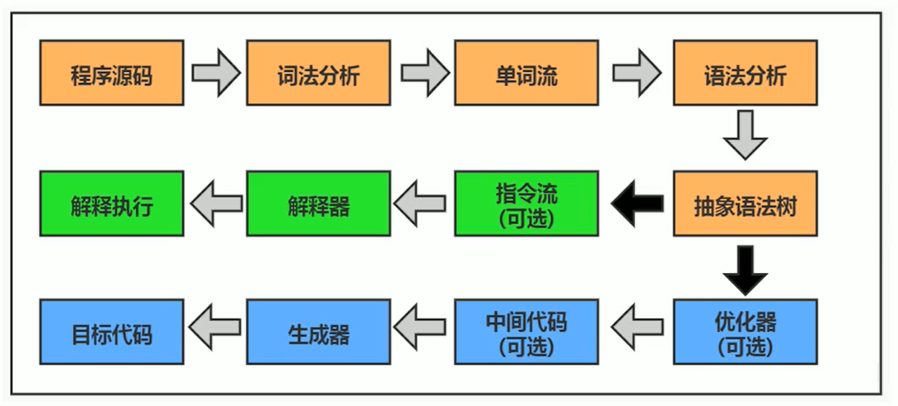
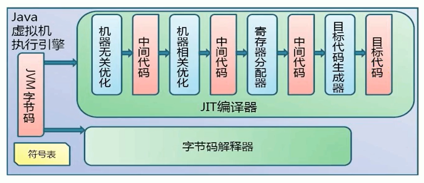
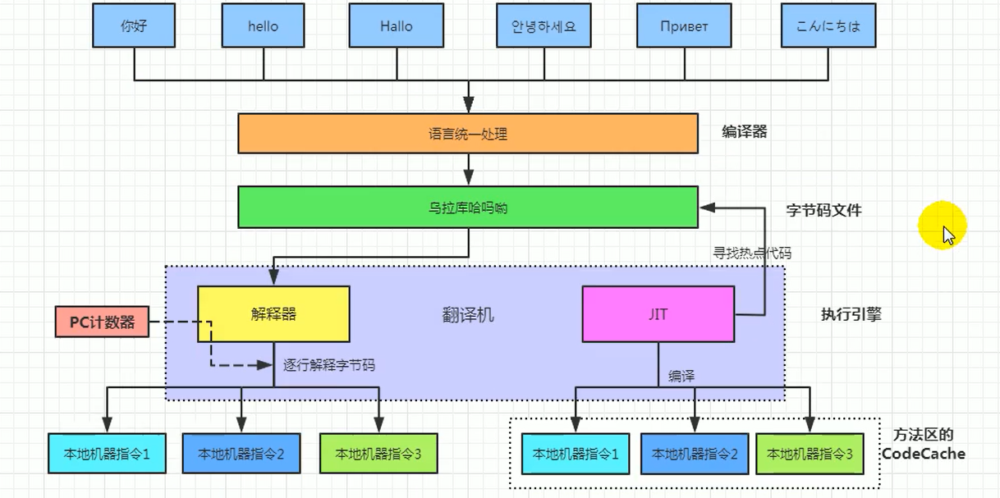
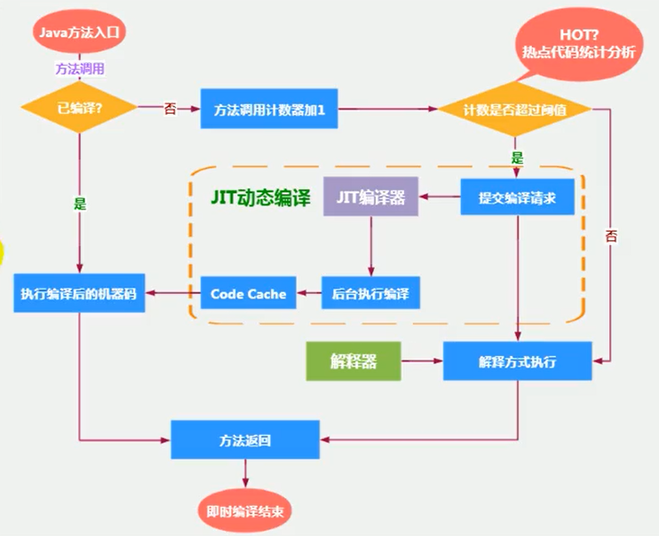
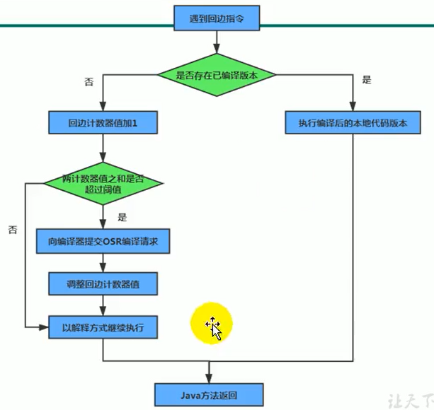
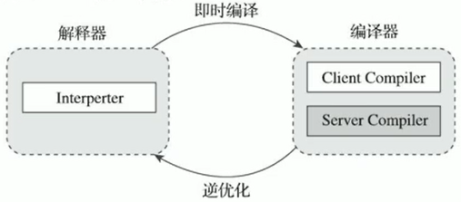

# JVM
## Java体系结构


### JVM、JRE和JDK

#### JVM

Java 虚拟机（Java Virtual Machine）是运行 Java 字节码的虚拟机。JVM 有针对不同系统的特定实现（Windows，Linux，macOS），目的是使用相同的字节码，它们都会给出相同的结果。

Java虚拟机与Java语言并没有必然的联系，它只与特定的二进制文件格式——Class文件（字节码文件）格式所关联，Class 文件中包含了Java虚拟机指令集（或者称为字节码、Bytecodes）和符号表，还有一些其他辅助信息。Scala和Kotlin等语言编译成字节码文件后也能在JVM上运行。

- 一次编译 ，到处运行；
- 自动内存管理；
- 自动垃圾回收功能。

Java 是跨平台的，JVM 不是跨平台的。


**什么是字节码?采用字节码的好处是什么?**

> 在 Java 中，JVM 可以理解的代码就叫做`字节码`（即扩展名为 `.class` 的文件），它不面向任何特定的处理器，只面向虚拟机。Java 语言通过字节码的方式，在一定程度上解决了传统解释型语言执行效率低的问题，同时又保留了解释型语言可移植的特点。所以 Java 程序运行时比较高效，而且，由于字节码并不针对一种特定的机器，因此，Java 程序无须重新编译便可在多种不同操作系统的计算机上运行。


**Java 程序从源代码到运行一般有下面 3 步：**


我们需要格外注意的是 .class->机器码 这一步。在这一步 JVM 类加载器首先加载字节码文件，然后通过解释器逐行解释执行，这种方式的执行速度会相对比较慢。而且，有些方法和代码块是经常需要被调用的(也就是所谓的热点代码)，所以后面引进了 JIT 编译器，而 JIT 属于运行时编译。当 JIT 编译器完成第一次编译后，其会将字节码对应的机器码保存下来，下次可以直接使用。而我们知道，机器码的运行效率肯定是高于 Java 解释器的。这也解释了我们为什么经常会说 Java 是编译与解释共存的语言。


> HotSpot 采用了惰性评估(Lazy Evaluation)的做法，根据二八定律，消耗大部分系统资源的只有那一小部分的代码（热点代码），而这也就是 JIT 所需要编译的部分。JVM 会根据代码每次被执行的情况收集信息并相应地做出一些优化，因此执行的次数越多，它的速度就越快。JDK 9 引入了一种新的编译模式 AOT(Ahead of Time Compilation)，它是直接将字节码编译成机器码，这样就避免了 JIT 预热等各方面的开销。JDK 支持分层编译和 AOT 协作使用。但是 ，AOT 编译器的编译质量是肯定比不上 JIT 编译器的。


**总结：**

Java 虚拟机（JVM）是运行 Java 字节码的虚拟机。JVM 有针对不同系统的特定实现（Windows，Linux，macOS），目的是使用相同的字节码，它们都会给出相同的结果。字节码和不同系统的 JVM 实现是 Java 语言“一次编译，随处可以运行”的关键所在。


#### JRE

JRE（java runtime environment）是 java 运行时环境，包含了 JVM 和 java 核心基础类库（JDBC，lang and util）。但是，它不能用于创建新程序。


#### JDK

JDK（java development kit）是 java 开发运行环境，包含了 JRE，同时还包含了编译 java 源码的 javac （或称为前端编译器）和用于 java 程序调试分析的工具（JConsole，visualVM等）等。


## 指令集架构

Java编译器输入的指令流基本上是一种**基于栈的指令集架构**，另外一种指令集架构则是**基于寄存器的指令集架构**（如传统的PC以及Android的Davlik虚拟机）。

在大部分情况下，基于寄存器架构的指令集往往都以一地址指令、二地址指令和三地址指令为主，而基于栈式架构的指令集却是以零地址指令为主。

由于跨平台性的设计，Java的指令都是根据栈来设计的。不同平台CPU架构不同，所以不能设计为基于寄存器的。


### 两种架构之间区别

- **基于栈式架构的特点**
	
  - 设计和实现更简单，适用于资源受限的系统；
  - 使用零地址指令方式分配；
  - 指令集小，同样的操作需要的指令多，性能不如寄存器；
  - 可移植性更好，更好实现跨平台。
	
- **基于寄存器架构的特点**

  - 完全依赖硬件，可移植性差；
  - 性能优秀、执行更高效:
  - 花费更少的指令去完成一项操作。


### 示例

执行 2+3 逻辑操作

- 基于栈式架构

```
iconst_2 //常量2入栈
istore_1
iconst_3 // 常量3入栈
istore_2
iload_1 //常量2和3出栈，执行相加
iload_2
iadd 
istore_0 // 结果5入栈
```


- 基于寄存器架构

```
mov eax,2 //将eax寄存器的值设为2
add eax,3 //使eax寄存器的值加3
```


##  生命周期

### 虚拟机的启动

JVM的启动是通过引导类加载器（bootstrap classloader）创建一个初始类（initial class）来完成的，这个类是由虚拟机的具体实现指定的。


### 虚拟机的执行

一个运行中的JVM有着一个清晰的任务：执行程序。程序开始执行时JVM运行，程序结束时JVM停止。执行程序时，实际执行的是一个叫做JVM的进程。


### 虚拟机的退出

- 程序正常执行结束；
- 程序在执行过程中遇到了异常或错误而异常终止；
- 由于操作系统出现错误而导致Java虚拟机进程终止；
- 某线程调用Runtime类或System类的exit方法，或Runtime类的halt方法，并且Java安全管理器也允许这次exit或halt操作；
- 除此之外，JNI ( Java Native Interface) 规范描述了用JNI Invocation API来加载或卸载Java虛 拟机时，Java虚拟机的退出情况。

## 系统
### 系统组件
#### 类加载系统
类加载系统（Classloader Sub-System）除了要定位和导入二进制class文件外，还负责验证被导入类的正确性，为类变量分配并初始化内存，以及帮助解析符号引用。 

#### 执行引擎
执行引擎（Execution Engine）负责执行那些包含在被装载类的方法中的指令。 
    
#### 运行时数据区
运行时数据区（Java Memory Allocation Area）又叫虚拟机内存或者Java内存，虚拟机运行时需要从整个计算机内存划分一块内存区域存储许多东西。例如：字节码、从已装载的class文件中得到的其他信息、程序创建的对象、传递给方法的参数，返回值、局部变量等等。

##### 本地接口
本地接口JNI（Java Native interface）的作用是融合不同的编程语言为Java所用，初衷是融合C/C++程序，于是就在内存中专门开辟了一块区域处理标记为native的代码，具体做法是在Native Method Stack中登记native方法，在执行引擎执行时加载native libraries。
 目前该方法使用的越来越少了，除非是与硬件有关的应用，比如通过Java程序驱动打印机或者Java系统管理生产设备，在企业级应用中已经比较少见。因为现在的异构领域间的通信很发达，比如可以使用Socket通信，也可以使用Web Service等。

##### 本地方法栈
本地方法栈（Native Method Stack）的具体做法是Native Method Stack中登记native方法，在执行引擎执行时加载本地方法库。

##### 程序计数器
程序计数器（Program Count Register）是线程执行时创建的，线程私有的，就是一个指针，指向方法区中的方法字节码（用来存储指向下一条指令的地址，也即将要执行的指令代码），由执行引擎读取下一条指令，是一个非常小的内存空间，几乎可以忽略不记。

##### 方法区
方法区（Method Area）是被所有线程共享，所有字段和方法字节码，以及一些特殊方法如构造函数，接口代码也在此定义。简单说，所有定义的方法的信息都保存在该区域，此区属于共享区间。静态变量、常量、类信息(构造方法/接口定义)、运行时常量池存在方法区中，实例变量存在堆内存中，和方法区无关。

###### 栈
栈（Stack）也叫栈内存，主管Java程序的运行，是在线程创建时创建，它的生命期是跟随线程的生命期，线程结束栈内存也就释放，对于栈来说不存在垃圾回收问题，只要线程一结束该栈就Over，生命周期和线程一致，是线程私有的。8种基本类型的变量、对象的引用变量、实例方法都是在函数的栈内存中分配。

栈帧中主要保存3类数据：
- 本地变量（Local Variables）：输入参数和输出参数以及方法内的变量；
- 栈操作（Operand Stack）：记录出栈、入栈的操作；
- 栈帧数据（Frame Data）：包括类文件、方法等等。

栈中的数据都是以栈帧（Stack Frame）的格式存在，栈帧是一个内存区块，是一个数据集，是一个有关方法和运行时数据的数据集，遵循先进后出原则。
    
#### 垃圾回收器
垃圾回收器（Garbage Collection）负责回收堆内存（Heap）中没有被使用的对象。 
             


### 系统线程
线程是一个程序里的运行单元。JVM允许一个应用有多个线程并行的执行。

在Hotspot JVM里，每个线程都与操作系统的本地线程直接映射。当一个Java线程准备好执行以后，对应的操作系统的本地线程也同时创建。Java线程执行终止后，本地线程也会回收。操作系统负责所有线程的安排调度到任何一个可用的CPU上。一旦本地线程初始化成功，它就会调用Java线程中的run()方法。

使用jconsole或者是任何一个调试工具，都能看到在后台有许多线程在运行。这些后台线程不包括调用main方法创建的main线程以及所有这个main线程创建的线程。这些后台系统线程在Hotspot JVM里主要是以下几个：

- 虚拟机线程：在JVM达到安全点时出现，因为在JVM达到安全点时，堆才不会变化。其执行类型包括“stop-the-world”的垃圾收集，线程栈收集，线程挂起以及偏向锁撤销；
- 周期任务线程：时间周期事件的体现（比如中断），一般用于周期性操作的调度执行；
- GC 线程：对在JVM里不同种类的垃圾收集行为提供了支持；
- 编译线程：在运行时会将字节码编译成到本地代码；
- 信号调度线程：接收信号并发送给JVM，在内部通过调用适当的方法进行处理。


## 发展历程

### Classic VM

早在1996年Java1.0版本的时候，Sun公司发布了一款名为Sun Classic VM的Java虚拟机，它同时也是世界上第一款商用Java虚拟机，JDK1.4时完全被淘汰。

这款虚拟机内部只提供解释器。如果使用JIT编译器，就需要进行外挂。但是一旦使用了JIT编译器，JIT就会接管虚拟机的执行系统。解释器就不再工作。解释器和编译器不能配合工作。现在hotspot内置了此虚拟机。


### Exact VM

为了解决上一个虚拟机问题，jdk1.2时，sun提供了此虚拟机。Exact Memory Management:准确式内存管理

- 也可以叫Non-Conservative/Accurate Memory Management
- 虚拟机可以知道内存中某个位置的数据具体是什么类型。

具备现代高性能虚拟机的雏形

- 热点探测
- 编译器与解释器混合工作模式

只在Solaris平台短暂使用，其他平台上还是classic vm

- 英雄气短，终被Hotspot虚拟机替换


### HotSpot VM

HotSpot历史

- 最初由一家名为“Longview Technologies"的小公司设计
- 1997年，此公司被Sun收购; 2009年，Sun公司被甲骨文收购。
- JDK1.3时，HotSpot VM成为默认虚拟机

目前Hotspot占有绝对的市场地位称霸武林。

- 不管是现在仍在广泛使用的JDK6，还是使用比例较多的JDK8中，默认的虚拟机都是HotSpot
- Sun/Oracle JDK和OpenJDK的默认虚拟机
- 因此本课程中默认介绍的虚拟机都是Hotspot，相关机制也主要是指HotSpot的GC机制。(比如其他两个商用虛拟机都没有方法区的概念)

从服务器、桌面到移动端、嵌入式都有应用。

名称中的HotSpot指的就是它的热点代码探测技术。

- 通过计数器找到最具编译价值代码，触发即时编译或栈上替换

- 通过编译器与解释器协同工作，在最优化的程序响应时间与最佳执行性能中取得平衡

    

### JRockit

- 专注于服务器端应用
	- 它可以不太关注程序启动速度，因此JRockit内部不包含解析器实现，全部代码都靠即时编译器编译后执行。
- 大量的行业基准测试显示，JRockit JVM是世界上最快的JVM。
	- 使用JRockit产品，客户已经体验到了显著的性能提高(一些超过了70%)和硬件成本的减少(达50%) 。
- 优势：全面的Java运行时解决方案组合
	- JHlockit面向延迟敏感型应用的解决方案JRockit Real Time提供以亳秒或
		微秒级的JVM响应时间，适合财务、军事指挥、电信网络的需要
	- MissionContro1服务套件，它是一组以极低的开销来监控、管理和分析生产
		环境中的应用程序的工具。
- 2008年，BEA被Oracle收购。
- Oracle表达了整合两大优秀虚拟机的工作，大致在JDK 8中完成。整合的方式是在Hotspot的基础上，移植JRockit的优秀特性。
- 高斯林：目前就职于谷歌，研究人工智能和水下机器人


### J9

- 全称: IBM Technology for Java Virtual Machine，简称IT4J，内部代号: J9
- 市场定位与Hotspot接近，服务器端、桌面应用、嵌入式等多用途VM
- 广泛用于IBM的各种Java产品。
- 目前，有影响力的三大商用虚拟机之一，也号称是世界上最快的Java虚拟机。
- 2017年左右，IBM发布了开源J9 VM，命名为openJ9，交给Eclipse基金会管理，也称为Eclipse OpenJ9


## 整体架构




## Java执行流程


# 类加载

## 概述

### 类加载机制

> 将描述类的数据从Class文件加载到内存，并对数据进行校验、转换解析和初始化，最终形成可以被虚拟机直接使用的Java类型，这个过程称为虚拟机的类加载机制。


### 类的生命周期

一个类型从被加载到虚拟机内存中开始，到卸载出内存为止，它的整个生命周期将会经历加载（Loading）、验证（Verification）、准备（Preparation）、解析（Resolution）、初始化（Initialization）、使用（Using）和卸载（Unloading）七个阶段，其中验证、准备、解析三个部分统称为链接（Linking）


### 类加载器子系统的作用

- 类加载器子系统负责从文件系统或者网络中加载Class文件，class文件在文件开头有特定的文件标识。

- ClassLoader只负责class文件的加载，至于它是否可以运行，则由Execution Engine决定。

- 加载的类信息存放于一块称为方法区的内存空间。除了类的信息外，方法区中还会存放运行时常量池信息，可能还包括字符串字面量和数字常量(这部分常量信息是Class文件中常量池部分的内存映射)

	

### ClassLoader角色

1. class file 存在于本地硬盘上，可以理解为设计师画在纸上的模板，而最终这个模板在执行的时候是要加载到JVM当中来根据这个文件实例化出n个一模一样的实例。

2. class file 加载到JVM中,被称为DNA元数据模板,放在方法区。

3. 在.class文件—> JVM —>最终成为元数据模板,此过程就要一个运输工具(类装载器Class Loader), 扮演一个快递员的角色。

	

### 类加载方式

- 从本地文件系统来加载class文件，这是前面绝大部分类加载方式；
- 从 JAR 包中加载class文件，这种方式也是很常见的，前面介绍 JDBC 编程时用到的数据库驱动类就是放在 JAR 文件中，JVM 可以从 JAR 文件中直接加载该class文件；
- 通过网络加载class文件；
- 把一个 Java 源文件动态编译、并执行加载。


## 类加载过程


当程序主动使用某个类时，如果该类还未被加载到内存中，则系统会通过如下三个步骤来对类进行初始化。


### 加载

此过程由类加载器完成，加载阶段和连接阶段的部分内容是交叉进行的，加载阶段尚未结束，连接阶段就可能已经开始了。

1. 读取类的class字节码文件，通过全类名获取定义此类的二进制字节流；
2. 将字节流所代表的静态存储结构转换为方法区的运行时数据结构；
3. 在内存中生成一个代表该类的Class对象，作为方法区这些数据的访问入口。

1. 通过一个类的全限定名预取定义此类的二进制字节流
2. 将这个字节流所代表的静态存储结构转化为方法区的运行时数据结构
3. **在内存中生成一个代表这个类的java. lang.Class对象**，作为方法区这个类的各种数据的访问入口

加载阶段结束后，Java虚拟机外部的二进制字节流就按照虚拟机所设定的格式存储在方法区之中了，方法区中的数据存储格式完全由虚拟机实现自行定义，《Java虚拟机规范》未规定此区域的具体 数据结构。类型数据妥善安置在方法区之后，会在*Java堆内存中实例化一个java.lang.Class类的对象， 这个对象将作为程序访问方法区中的类型数据的外部接口。*

​		

### 连接

将类的二进制数据合并到JVM中，连接又可分为三步：


#### 验证

- **验证(Verify)**

	- 目的在于确保class文件的字节流中包含信息符合当前虚拟机要求，保证被加载类的正确性，不会危害虚拟机自身安全。
	- 主要包括四种验证，文件格式验证，元数据验证，字节码验证，符号引用验证。

	

确保加载的类信息符合JVM规范，没有安全方面的问题。

- 文件格式验证

验证字节流是否符合Class文件格式的规范，例如是否以0XCAFEBABE开头、主次版本号是否在当前虚拟机的处理范围之内、常量池中的常量是否又不被支持的类型。

- 元数据验证

对字节码描述的信息进行语义分析，以保证其描述的信息符合Java语言规范的要求，例如这个类是否有父类、这个类是否继承了不允许继承的类。

- 字节码验证

最复杂的阶段。通过数据流和控制流分析，确定程序语义是合法的、符合逻辑的，例如保证任意时刻操作数栈和指令代码序列都能配合工作。

- 符号引用验证

确保解析动作能正确执行。

#### 准备

- **准备(Prepare)**

	- 为类变量（即静态变量，static修饰的）分配内存并且设置该类变量的默认初始值，即零值。
	- *这里不包含用final修饰的static, 因为final在编译的时候就会分配了*
	- *这里不会为实例变量分配初始化（类还未加载）*，类变量会分配在方法区中，而实例变量是会随着对象一起分配到Java堆中。

	

准备阶段是正式为类变量分配内存并设置类变量初始值的阶段，这些内存都将在方法区中分配。对于该阶段有以下几点需要注意：

- 这时候进行内存分配的仅包括类变量（static），而不包括实例变量，实例变量会在对象实例化时随着对象一块分配在 Java 堆中。
- 这里所设置的初始值"通常情况"下是数据类型默认的零值（如0、0L、null、false等），比如我们定义了public static int value=111 ，那么 value 变量在准备阶段的初始值就是 0 而不是111（初始化阶段才会复制）。特殊情况：比如给 value 变量加上了 fianl 关键字public static final int value=111 ，那么准备阶段 value 的值就被复制为 111。

#### 解析

- **解析(Resolve)**
	- 将常量池内的符号引用转换为直接引用的过程
		- 符号引用（Symbolic References）：符号引用以一组符号来描述所引用的目标，符号可以是任何形式的字面量，只要使用时能无歧义地定位到目标即可。
		- 直接引用（Direct References）：直接引用是可以直接指向目标的指针、相对偏移量或者是一个能间接定位到目标的句柄。
	- 事实上，解析操作往往会伴随着JVM在执行完初始化之后再执行
	- 解析动作主要针对类或接口、字段、类方法、接口方法、方法类型等。对应常量池中的CONSTANT Class info、 CONSTANT Fieldref info、 CONSTANT Methodref info等


解析阶段是虚拟机将常量池内的符号引用替换为直接引用的过程。解析动作主要针对类或接口、字段、类方法、接口方法、方法类型、方法句柄和调用限定符7类符号引用进行。

符号引用就是一组符号来描述目标，可以是任何字面量。直接引用就是直接指向目标的指针、相对偏移量或一个间接定位到目标的句柄。在程序实际运行时，只有符号引用是不够的，举个例子：在程序执行方法时，系统需要明确知道这个方法所在的位置。Java 虚拟机为每个类都准备了一张方法表来存放类中所有的方法。当需要调用一个类的方法的时候，只要知道这个方法在方发表中的偏移量就可以直接调用该方法了。通过解析操作符号引用就可以直接转变为目标方法在类中方法表的位置，从而使得方法可以被调用。

综上，解析阶段是虚拟机将常量池内的符号引用替换为直接引用的过程，也就是得到类或者字段、方法在内存中的指针或者偏移量。


### 初始化

JVM负责对类进行初始化

初始化是类加载的最后一步，也是真正执行类中定义的 Java 程序代码(字节码)，初始化阶段是执行类构造器方法的过程。

对于构造器方法方法的调用，虚拟机会自己确保其在多线程环境中的安全性。因为构造器方法方法是带锁线程安全，所以在多线程环境下进行类初始化的话可能会引起死锁，并且这种死锁很难被发现。

对于初始化阶段，虚拟机严格规范了有且只有5中情况下，必须对类进行初始化：

- 当遇到new、getstatic、putstatic或invokestatic 这4条直接码指令时，比如 new 一个类，读取一个静态字段(未被 final 修饰)、或调用一个类的静态方法时。
- 使用 java.lang.reflect 包的方法对类进行反射调用时 ，如果类没初始化，需要触发其初始化。
- 初始化一个类，如果其父类还未初始化，则先触发该父类的初始化。
- 当虚拟机启动时，用户需要定义一个要执行的主类 (包含 main 方法的那个类)，虚拟机会先初始化这个类。
- 当使用 JDK1.7 的动态动态语言时，如果一个MethodHandle 实例的最后解析结构为 REF_getStatic、REF_putStatic、REF_invokeStatic、的方法句柄，并且这个句柄没有初始化，则需要先触发器初始化。


> 直到初始化阶段，Java虚拟机才真正开始执行类中编写的Java程序代码，将主导权移交给应用程序。

- 初始化阶段就是执行类构造器方法`<clinit>()`的过程。

	- `<clinit>()`此方法不需定义，是javac编译器自动收集类中的所有**类变量的赋值动作**和**静态代码块中的语句（static{}块）**合并而来。类变量指的是static修饰的变量，未用static修饰的是实例变量。

		编译器收集的顺序是由语句在源文件中出现的顺序决定的

		```java
		public class Test{
			static {
				a = 10; // 可以赋值
		        System.out.println(a); // 非法前向引用，不能访问
			}
		    static int a = 9; // a初始化为9，因为9的赋值晚于10
		}
		```

- 此方法不是必需的，如果一个类中没有静态语句块，也没有对类变量的赋值操作，就不会生成

- `<clinit>()`不同于类的构造器。(关联: 构造器是虚拟机视角下的`<init>()`)

- 若该类具有父类，JVM会保证子类的`<clinit>()`执行前，父类的`<clinit>()`已经执行完毕。

- 虚拟机必须保证一个类的`<clinit>()`方法在多线程下被同步加锁。（**只会被加载一次**）


## 类加载器

> Java虚拟机设计团队有意把类加载阶段中的“通过一个类的全限定名来获取描述该类的二进制字节流”这个动作放到Java虚拟机外部去实现，以便让应用程序自己决定如何去获取所需的类。实现这个动作的代码被称为“类加载器”（Class Loader）。

在Java虚拟机的角度来看，只存在两种不同的类加载器：一种是启动类加载器（Bootstrap ClassLoader），这个类加载器使用C++语言实现，是虚拟机自身的一部分；另外一种就是其他所有的类加载器，这些类加载器都由Java语言实现，独立存在于虚拟机外部，并且全都继承自抽象类 java.lang.ClassLoader。

无论类加载器的类型如何划分，在程序中我们最常见的类加载器始终只有3个，如下所示：

这四者之间的关系是包含关系，不是上下级关系，也不是继承关系。


四种类加载器的应用场景以及双亲委派模型。

系统可能在第一次使用某个类时加载该类，但也可能采用预先加载机制来预加载某个类，不管怎样，类的加载必须由类加载器完成，系统会通过加载、连接、初始化三个步骤来对该类进行初始化。不管类的字节码内容从哪里加载，加载的结果都一样，这些字节码内容加载到内存后，都会将这些静态数据转换成方法区的运行时数据结构，然后生成一个代表这个类的java.lang.Class对象，作为方法区中类数据的访问入口（即引用地址），所有需要访问和使用类数据只能通过这个Class对象。


### 类加载器类型

Java的类加载器由如下四种：

- **引导类加载器**（Bootstrap Classloader）：又称为根类加载器
    它负责加载Java的核心库JAVA_HOME/jre/lib/rt.jar等，是用原生代码（C/C++）来实现的，并不继承自java.lang.ClassLoder，所以通过Java代码获取引导类加载器对象将会得到null，即无法直接获取。

- **扩展类加载器**（Extension ClassLoader）
    它由sun.misc.Launcher$ExtClassLoader实现，是java.lang.ClassLoader的子类，负责加载Java的扩展库JAVA_HOME/jre/ext/*.jar等。

- **应用程序类加载器**（Application Classloader）
    它由sun.misc.Launcher$AppClassLoader实现，是java.lang.ClassLoader的子类，负责加载Java应用程序类路径下的内容，是最常用的类加载器。

- **自定义类加载器**
    开发人员可以通过继承java.lang.ClassLoader类的方式实现自己的类加载器，以满足一些特殊的需求，例如对字节码进行加密来避免class文件被反编译，或者加载特殊目录下的字节码数据。

类加载器是用来把类(class)装载进内存的。JVM 规范定义了两种类型的类加载器：启动类加载器(bootstrap)和用户自定义加载器(user-defined class loader)。 JVM在运行时会产生3个类加载器组成的初始化加载器层次结构 ，如下图所示：


可以自己定义java.lang.String类，但在应用时，需要用自己的类加载器去加载，否则，系统的类加载器永远只是去加载 rt.jar 包中的那个 java.lang.String。

但在 Tomcat 的 Web 应用程序中，都是由 webapp 自己的类加载器先自己加载WEB-INF/classess 目录中的类，然后才委托上级的类加载器加载，如果我们在 Tomcat 的 Web应用程序中写一个 java.lang.String，这时候 Servlet 程序加载的就是我们自己写的java.lang.String，但是这么干就会出很多潜在的问题，原来所有用了java.lang.String 类的都将出现问题。


#### 启动类加载器

> Bootstrap ClassLoader

- 这个类加载使用C/C++语言实现的，嵌套在JVM内部。
- 它用来加载Java的核心库(JAVA HOME/jre/lib/rt.jar.resources. jar或sun. boot . class.path路径下的内容) , 用于提供JVM自身需要的类
- 并不继承自java. lang. ClassLoader，没有父加载器。
- 加载扩展类和应用程序类加载器，并指定为他们的父类加载器。
- 出于安全考虑，Bootstrap启动类加载器只加载包名为java、javax、sun等开头的类


#### 扩展类加载器

> Extension ClassLoader

- Java语言编写，由sun.misc.Launcher$ExtClassLoader实现。
- 派生于ClassLoader类
- 父类加载器为启动类加载器
- 从java .ext . dirs系统属性所指定的目录中加载类库，或从JDK的安装目录的jre/]ib/ext子目录(扩展目录)下加载类库。如果用户创建的JAR放在此目录下，也会自动由扩展类加载器加载。


#### 应用程序类加载器

> System ClassLoader

- java语言编写，由sun.misc. Launcher$AppClassLoader实现
- 派生于ClassLoader类
- 父类加载器为扩展类加载器
- 它负责加载环境变量classpath或系统属性java.class.path 指定路径下的类库
- 该类加载是程序中默认的类加载器，一般来说，Java应用的类都是由它来完成加载
- 通过ClasLoader#getSystemClassLoader()方法可以获取到该类加载器


#### 自定义类加载器

1. 开发人员可以通过继承抽象类java. lang.ClassLoader类的方式，实现自己的类加载器，以满足一些特殊的需求
2. 在JDK1.2之前，在自定义类加载器时，总会去继承ClassLoader类并重写loadClass ()方法，从而实现自定义的类加载类，但是在JDK1.2之后已不再建议用户去覆盖loadClass()方法，而是建议把自定义的类加载逻辑写在findClass()方法中
3. 在编写自定义类加载器时，如果没有太过于复杂的需求，可以直接继承URLClassLoader类，这样就可以避免自己去编写findClass()方法及.其获取字节码流的方式，使自定义类加载器编写更加简洁。


### 双亲委派

​	某个特定的类加载器在接到加载类的请求时，首先将加载任务委托给父类加载器，依次追溯，直到最高爷爷辈的。如果父类加载器可以完成类加载任务，则成功返回；只有父类加载器无法完成加载任务时才自己去加载。
​	双亲委派机制是为了保证Java核心库的类型安全，避免用户自己能定义java.lang.Object类的情况。类加载器除了用于加载类，也是安全的最基本的屏障。


Java虚拟机对class文件采用的是按需加载的方式，也就是说当需要使用该类时才会将它的class文件加载到内存生成class对象。而且加载某个类的class文件时，Java虚拟机采用的是双亲委派模式，即把请求交由父类处理,它是一种任务委派模式。

**工作原理**

1. 如果一个类加载器收到了类加载请求它并不会自己先去加载，而是把这个请求委托给父类的加载器去执行
2. 如果父类加载器还存在其父类加,载器，则进一步向上委托，依次递归,请求最终将到达项层的启动类加载器
3. 如果父类加载器可以完成类加载任务，就成功返回，倘若父类加载器无法完成此加载任务，子加载器才会尝试自己去加载，这就是双亲委派模式。

**优势**

1. 避免类的重复加载
2. 保护程序安全，防止核心API被篡改
	- 自定义 java.lang.String


### 沙箱安全

自定义String类，但是在加载自定义String类的时候会率先使用引导类加载器加载，而引导类加载器在加载的过程中会先加载jdk自带的文件(rt.jar包中java\lang\String.class)，报错信息说没有main方法，就是因为加载的是rt.jar包中的String类。这样可以保证对java核心源代码的保护，这就是沙箱安全机制。

JVM必须知道一个类型是由启动加载器加载的还是由用户类加载器加载的。如果一个类型是由用户类加载器加载的，那么JVM会将这个类加载器的一个引用作为类型信息的一"部分保存在方法区中。当解析一个类型到另一个类型的引用的时候，JVM需要保证这两个类型的类加载器是相同的。


### ClassLoader类

```java
public abstract class ClassLoader {
    
}
```


```java
public void method1() throws Exception {
    //获取系统类加载器
    ClassLoader classLoader = ClassLoader.getSystemClassLoader();
    System.out.println("系统类加载器"+classLoader);
    //获取系统类加载器的父类加载器，即扩展类加载器
    classLoader = classLoader.getParent();
    System.out.println("扩展类加载器"+classLoader);
    //获取扩展类加载器的父类加载器，即引导类加载器，该加载器无法直接获取
    classLoader = classLoader.getParent();
    System.out.println("引导类加载器"+classLoader);
    //获取加载当前类的加载器
    classLoader = Class.forName("test509.ClassLoaderTest").getClassLoader ();
    System.out.println("当前类的加载器"+classLoader);
    //获取加载JDK中的Object类的加载器，该加载器无法直接获取
    classLoader = Class.forName("java.lang.Object").getClassLoader();
    System.out.println("Object类加载器"+classLoader);
}
```


类加载器的一个主要方法：getResourceAsStream(String str):获取bin路径下的指定文件的输入流。

注意：类加载器加载文件的根目录位于bin（类路径）目录下

```java
public void method2() throws Exception {
    InputStream inputStream = null;
    Properties properties = new Properties();
    ClassLoader classLoader = this.getClass().getClassLoader();
    //该方法读取的资源文件位于bin（用于存放字节码文件）目录下，其他目录的资源文件无法读取
    //因为类加载器读取的是bin目录下的字节码文件，所以该方法将bin目录作为根目录
    inputStream = classLoader.getResourceAsStream("game.properties");
    properties.load(inputStream);
    String name = properties.getProperty("username");
    String age = properties.getProperty("password");
    System.out.println(name + age);
}
```


# 对象实例化
## 创建对象方式
- new：最常见的方式，单例类中调用getInstance的静态类方法，XXXFactory的静态方法；
- Class类的newInstance方法：反射的方式，在 JDK9 里面被标记为过时，因为只能调用空参构造器，权限必须是public；
- Constructor的newInstance(XXX)：反射的方式，可以调用空参、带参的构造器，权限没有要求；
- 使用clone()：不调用任何的构造器，要求当前类需要实现Cloneable接口中的clone()方法；
- 使用反序列化：反序列化一般用于Socket的网络传输，从文件中、从网络中获取一个对象的二进制流；
- 第三方库Objenesis。


## 创建对象步骤
1. 加载类元信息
2. 为对象分配内存
3. 处理并发问题
4. 属性的默认初始化（零值初始化）
5. 设置对象头信息
6. 属性的显示初始化、代码块中初始化、构造器中初始化

### 判断对象对应的类是否加载、链接、初始化
虚拟机遇到一条new指令，首先去检查这个指令的参数能否在Metaspace的常量池中定位到一个类的符号引用，并且检查这个符号引用代表的类是否已经被加载、解析和初始化。即判断类元信息是否存在。

如果没有，那么在双亲委派模式下，使用当前类加载器以“ClassLoader+包名+类名”为key进行查找对应的.class文件，如果没有找到文件，则抛出ClassNotFoundException异常，如果找到则进行类加载，并生成对应的Class类对象。

### 为对象分配内存
先计算对象占用空间大小，接着在堆中划分一块内存给新对象。如果实例成员变量是引用变量，仅分配引用变量空间即可，即4个字节大小。

#### 如果内存规整：指针碰撞
如果内存是规整的，那么虚拟机将采用的是指针碰撞法（Bump The Point）来为对象分配内存。即所有用过的内存在一边，空闲的内存放另外一边，中间放着一个指针作为分界点的指示器，分配内存就是把指针指向空闲那边挪动一段与对象大小相等的距离。

#### 如果内存不规整
如果内存不是规整的，已使用的内存和未使用的内存相互交错，那么虚拟机将采用的是空闲列表（Free List）来为对象分配内存。即虚拟机维护了一个空闲列表，记录可用内存块，分配时从列表中找到一块足够大的空间划分给对象实例，并更新列表上的内容。

选择哪种分配方式由Java堆是否规整所决定，而Java堆是否规整又由所采用的垃圾收集器是否带有压缩整理功能决定。

### 处理并发问题
虚拟机采用了两种方式解决频繁创建对象分配内存空间时的并发问题：
- 通过CAS（ Compare And Swap ）失败重试和区域加锁保证指针更新操作的原子性；

- 通过TLAB（Thread Local Allocation Buffer）把内存分配的动作按照线程划分在不同的空间之中进行，即每个线程在Java堆中的Eden区预先分配一小块内存，称为本地线程分配缓冲区。通过UseTLAB参数来设定虚拟机是否使用TLAB(jdk8后默认开启)。

### 初始化分配到的内存空间.
属性的默认初始化，即给对象的成员变量赋予默认值，保证该成员变量不用显示赋值仍可直接使用。

### 设置对象的对象头.
将对象的所属类（即类的元数据信息）、对象的HashCode和对象的GC信息和锁信息等数据存储在对象的对象头中，具体设置方式取决于JVM实现。

> 数据对象 = 数据内容 + 元数据（描述数据的数据）

### 执行init方法进行初始化
先进行属性的显式初始化、代码块中的初始化，两者依据代码中的顺序先后初始化；在进行构造器初始化。


### 示例
```java
public class InstanceClass {
    // 加载完成后会0值初始化code的值为0，codeLabel的值为null
    private int code;
    private String codeLabel;
    // 显示初始化属性name的值为“instanceClass”
    private String name = "instanceClass";
    
    {
        this.code = 0;
    }
    
    public InstanceClass() {
        this.code = 1;
    }
}
```

1. new对象时，比如`InstanceClass instance = new InstanceClass()`会声明一个InstanceClass类型的引用，JVM首先去检查InstanceClass这个符号引用所代表的类是否已经被加载过，如果没有就要执行对应类的加载过程；
2. 类加载完成以后，对象所需的内存大小其实就已经确定下来了，接下来JVM就会在堆上为对象分配内存；
3. 属性“0”值初始化即为实例化对象的各个属性赋上默认初始化“0”值，比如int的初始化0值就是0，对象的初始化0值就是null；
5. 接下来JVM会进行对象头的设置，主要包括对象的运行时元数据（比如Hash码、GC分代年龄、锁状态标志、锁指针、偏向线程ID、偏向时间戳等）以及类型指针（JVM通过该类型指针来确定该对象是哪个类的实例）；
6. 属性的显示初始化即针对某个属性字段手动的赋值；
7. 最后是调用类的构造方法来进行进行构造方法内的初始化动作。

## 对象内存布局
### 对象头
1. 对象头（Header）

> 如果是数组，还需要记录数组的长度

#### 运行时元数据
- Hash码（HashCode）：对象的首地址值，换成哈希以免查找耗时；
- GC分代年龄：年龄计数器age，达到16就进入老年代；
- 锁状态标志
- 线程持有的锁
- 偏向线程ID
- 偏向时间戳

#### 类型指针
指向类元数据，确定该对象所属的类型，指向的其实是方法区中存放的类元信息。并不是所有的对象都会保留类型指针。

### 实例数据
实例数据（Instance Data）是对象真正存储的有效信息，包括程序代码中定义的各种类型的字段（包括从父类继承下来的和本身拥有的字段）。
    
#### 规则
- 父类中定义的变量会出现在子类之前；
- 相同宽度的字段总是被分配在一起；
- 如果 CompactFields 参数为 true（默认为 true）：字类的窄变量可能插入到父类变量的空隙。
  
### 对齐填充
对齐填充（Padding），不是必须的，也没有特别的含义，仅仅起到占位符的作用。

## 对象访问定位
JVM有两种方式通过栈帧中的对象引用访问到其内部的对象实例，分别是句柄访问和直接指针访问。

### 句柄访问


句柄访问就是说栈的局部变量表中，记录的对象的引用，然后在堆空间中开辟了一块空间，也就是句柄池。
优点在于reference中存储稳定句柄地址，对象被移动（垃圾收集时移动对象很普遍）时只会改变句柄中实例数据指针，reference本身不需要被修改。

### 直接指针


直接指针是局部变量表中的引用直接指向堆中的实例，在对象实例中有类型指针，指向的是方法区中的对象类型数据。此时如果堆中对象的位置改变，那么reference也要跟着改变，如 “垃圾回收相关算法”中的复制算法。

hotspot JVM采用的就是直接指针的方式访问对象实例。

## 相关命令
### TLAB区配置
- -XX:+UseTLAB

表示使用TLAB

- -XX:-UseTLAB

表示不使用TLAB

- -XX:+TLABSize

表示设置TLAB大小

- -XX:TLABRefillWasteFraction

表示设置进入TLAB空间，单个对象大小。是一个比例值，默认为64。如果对象小于整个空间的1/64，则放在TLAB区，如果对象大于整个空间的1/64，则放在堆区。

- -XX:+PrintTLAB

表示查看TLAB信息

- -XX:ResizeTLAB

表示自动调整TLABRefillWasteFraction阈值


## 参考资料
- [【JVM之内存与垃圾回收篇】对象实例化内存布局与访问定位](https://www.cnblogs.com/blknemo/p/13296019.html)

# 运行时数据区

## 内存划分

内存(Memory)也被称为内存储器，其作用是用于暂时存放CPU中的运算数据，以及与硬盘等外部存储器交换的数据。只要计算机在运行中，CPU就会把需要运算的数据调到内存中进行运算，当运算完成后CPU再将结果传送出来。所谓Java内存结构就是指Java虚拟机中对于内存的划分。

- 类加载系统：负责从文件系统或者网络加载class信息，加载的信息存放在方法区。   
- 直接内存：JAVA NIO库允许JAVA程序直接内存，从而提高性能，通常直接内存性能高于JAVA堆。读写频繁的场合可能会考虑使用。   
- 本地方法栈：本地方法栈和JAVA栈类似，最大的不同为本地方法栈用于本地方法调用。JAVA虚拟机允许JAVA直接调用本地方法。    
- 垃圾回收系统：是JAVA的核心。       
- pc寄存器：每个线程私有的空间。JAVA虚拟机为每个线程创建pc寄存器，在任意时刻一个JAVA线程总是在执行一个方法，这个方法被称为当前方法，如果当前方法不是本地方法，pc寄存器总会执行当前正在被执行的指令，如果是本地方	法，则pc寄存器值为 undefined，寄存器存放当前执行执行环境指针、程序技术器、操作栈指针、计算的变量指针等信息。  
- 执行引擎：虚拟机的核心组件，负责执行虚拟机的字节码，一般先编译成机器码后执行。
- JAVA内存模型：（共享内存模型JMM）定义了一个线程对另一个线程可见。共享变量存放在主内存中，每个线程都有自己的本地内存，当多个线程同时访问一个数据时，可能本地内存没有及时刷新到主内存，所以就会发生线程安全问题。


## 对象的创建流程

1. 通过new创建一个类的实例化（类中只有属性和方法）；
2. 判断常量池中是否有对应的类符号引用，如果没有，则执行类的加载过程；如果有，再检查该符号引用所代表的类是否已被加载、解析和初始化过；
3. 虚拟机在堆中为对象分配内存，所需大小在类加载完成后便可完全确定（分配方式：指针碰撞和空闲列表）。类加载时会在栈中给属性，方法的引用分配内存，但是不会给局部变量分配内存空间，因为方法此时没有调用就没有执行，也就不会创建局部变量；
4. 将分配到的内存空间都初始化为零值，不包括对象头（基本类型的初始化）；
5. 对对象头（Object Header)进行设置，如对象哈希码，GC分代年龄等；
6. 调用对象的<init>方法（代码块和构造方法）；


在JVM在堆中为对象分配内存阶段，通常有以下两种分配方式，虚拟机选择哪种分配方式是由JAVA堆是否规整决定的，而JAVA堆是否规整又由所采用的垃圾收集器是否带有压缩整理功能决定。

- 指针碰撞

要求堆中内存绝对规整，所有用过的内存都放一边，空闲的内存放在另一边，中间放着一个指针作为分界点的指示器，分配内存就仅仅只是将该指针向空闲空间那边挪动一段与对象大小相等的距离。

- 空闲列表

针对的是堆中内存不规整的情况，虚拟机维护着一个列表，记录哪些内存块是可用的，在分配时从列表中找到一块足够大的空间划分给对象实例，并更新列表上的记录。


在为对象分配内存时，还需要考虑的一点就是线程安全性问题。可能出现正在给对象A分配内存，指针还没来得及修改，对象B又同时使用了原来的指针来分配内存的情况。针对这种问题，有以下两种解决方案。

- 对分配内存空间的动作进行同步处理，保证更新操作的原子性（采用CAS + 失败重试机制保障原原子性），但效率较低。

- 使用本地线程分配缓冲（TLAB），哪个线程需要分配内存，就在哪个线程的TLAB上分配，只有TLAB用完并需要分配新的TLAB时，才需要同步锁定（可通过-XX:+/-UseTLAB参数来设定虚拟机启用TLAB）。

在HotSpot虚拟机中，对象在内存中存储的布局可分为3块区域：对象头、实例数据和对齐填充。
对象头，由 Mark Word 和类型指针所组成。

Mark Word，用于存储对象自身的运行时数据，如哈希码、GC分代年龄、锁状态标志、线程持有锁、偏向线程ID、偏向时间戳等。

Mark Word在32位的JVM中对应的长度是32bit，在64位的JVM中长度是64bit。由于对象需要存储的运行数据很多，其实已经超出了32位和64位的限制，为了在极小的空间内存储尽量更多的信息，Mark Word 会根据对象状态的不同来存储不同的信息。如在32位的HotSpot虚拟机中，如对象处于未被锁定的状态，那么 Mark Word 将使用25bit用于存储对象的哈希码，4bit用于存储对象分代年龄，2bit用于存储锁标志位，1bit固定为0。

类型指针，虚拟机通过这个指针来确定对象是哪个类的实例，该指针指向对象的类元数据。（由于查找对象的元数据信息并不一定要经过对象本身，所以并不是所有的虚拟机实现都必须在对象数据上保留类型指针）
如果对象是一个JAVA数组，那么在对象头中还必须有一块用于记录数组长度的数据，因为普通对象的大小可通过元数据信息来获取，而数组不行。

实例数据，对象真正存储的有效信息，也就是在代码中所定义+的各种类型的字段内容。无论是从父类继承下来的，还是在子类中定义的，都需要记录起来。存储顺序受虚拟机分配策略参数（FieldsAllocationStyle）和字段在java源码中定义顺序的影响。

HotSpot虚拟机默认的分配策略为longs/doubles、ints、shorts/chars、bytes/booleans、oops(Ordinary Object Pointers)，相同带宽的字段总是被分配到一起，在此之后，父类中定义的变量会出现在子类之前。

如果CompactFields参数的值为true（默认为true），那么子类中较窄的变量也可能会插入到父类变量的空隙中。
对齐填充，无特殊含义，仅仅起到占位符的作用。HotSpot虚拟机要求起始地址必须是8字节的整数倍，因此当对象实例数据部分没有对齐时，就需要通过对齐填充来补全。

## JVM内存分区

基本数据类型比变量和对象的引用都是在栈分配的。

堆内存用来存放由new创建的对象和数组。

类变量（static修饰的变量），程序在一加载的时候就在堆中为类变量分配内存，堆中的内存地址存放在栈中。

实例变量：当你使用java关键字new的时候，系统在堆中开辟并不一定是连续的空间分配给变量，是根据零散的堆内存地址，通过哈希算法换算为一长串数字以表征这个变量在堆中的”物理位置”,实例变量的生命周期–当实例变量的引用丢失后，将被GC（垃圾回收器）列入可回收“名单”中，但并不是马上就释放堆中内存。

局部变量: 由声明在某方法，或某代码段里（比如for循环），执行到它的时候在栈中开辟内存，当局部变量一但脱离作用域，内存立即释放。


- 程序计数器(寄存器)：当前线程所执行的字节码行号指示器
- 本地方法栈：同虚拟机栈，只不过本地方法栈为虚拟机使用到的native方法服务。
- 虚拟机栈：每个方法在执行的同时都会创建一个栈帧用来存放存储局部变量表、操作数表、动态连接、方法出口等信息，每一个方法从调用直至执行完成的过程，就对应着一个栈帧在虚拟机栈中入栈到出栈的过程。
- 堆：所有线程共享的一块内存区域。Java虚拟机所管理的内存中最大的一块，因为该内存区域的唯一目的就是存放对象实例。几乎所有的对象实例度在这里分配内存，也就是通常我们说的new对象，同时堆也是垃圾收集器管理的主要区域。
- 方法区：和堆一样，是各个线程共享的内存区域，用于存储已被虚拟机加载的类信息、常量、静态变量、和编译器即时编译后的代码等

首先栈、堆与方法区都是在内存中的，都是属于运行时数据区，读入了内存才能被称作运行时。
栈是运行时的单位，而堆是存储的单位。


### 堆
JVM中堆（Heap）用于存储对象，内存较大，线程共享，会抛出 OutOfMemoryError: Java heap space。

堆和方法区是所有线程共享的资源，其中堆是进程中最大的一块内存，主要用于存放新创建的对象 (所有对象都在这里分配内存)，


=========
VM 中堆（Heap）（线程共享区）和栈属于不同的内存区域，使用目的也不同。栈常用于保存方法帧和局部变量，而对象总是在堆上分配。栈通常都比堆小，也不会在多个线程之间共享，而堆被整个 JVM 的所有线程共享。

堆内存分为两部分, 一部分是方法区, 另外一部分称为GC区。
Java堆（Java Heap）是Java虚拟机所管理的内存中最大的一块。Java堆是被所有线程共享的一块内存区域。在虚拟机启动的时候创建，在此区域的唯一目的就是存放对象实例，几乎所有的对象实例都是在这里分配内存，但是这个对象的引用却是在栈（Stack）中分配。因此，执行String s = new String("s")时，需要从两个地方分配内存：在堆中为String对象分配内存，在栈中为引用（这个堆对象的内存地址，即指针）分配内存。
堆是垃圾收集器管理的主要区域，因此也被称为“GC堆”，如果在执行垃圾回收之后，仍没有足够的内存分配，也不能再扩展，将会抛出OutOfMemoryError，可通过参数 -Xmx -Xms 来指定运行时堆内存的大小。

JAVA堆可以处于物理上不连续的内存空间中，只要逻辑上是连续的即可。

**概述**

- 一个JVM实例只存在一个堆内存，堆也是Java内存管理的核心区域。
- Java堆区在JVM启动的时候即被创建，其空间大小也就确定了。是JVM管理的最大一块内存空间。
    - 堆内存的大小是可以调节的。
- 《Java虚拟机规范》规定，堆可以处于物理上不连续的内存空间中，但在逻辑上它应该被视为连续的。
- 所有的线程共享Java堆，在这里还可以划分线程私有的缓冲区(Thread Local Allocation Buffer， TLAB) 。
- 《Java虚拟机规范》中对Java堆的描述是:所有的对象实例以及数组都应当在运行时分配在堆上。(The heap is the run-time data area from which memory for all class instances and arrays is allocated )
    - 我要说的是:“几乎” 所有的对象实例都在这里分配内存。从实际使用角度看的。
- 数组和对象可能永远不会存储在栈上，因为栈帧中保存引用，这个引用指向对象或者数组在堆中的位置。
- 在方法结束后，堆中的对象不会马上被移除，仅仅在垃圾收集的时候才会被移除。
- 堆，是GC ( Garbage Collection，垃圾收集器)执行垃圾回收的重点区域。


> 通过new关键字，创建对象都会使用堆内存


**内存细分**

现代垃圾收集器大部分都基于分代收集理论设计，堆空间细分为：


**设置参数**

1. Java堆区用于存储Java对象实例，那么堆的大小在JVM启动时就已经设定好了，大家可以通过选项"`-Xmx`"和" `-Xms`"来进行设置。

    “`-Xms`"用于表示堆区的起始内存，等价于`-XX: InitialHeapSize`
    “`-Xmx`"则用于表示堆区 的最大内存，等价于`-XX :MaxHeapSize`

    一旦堆区中的内存大小超过“`-Xmx`”所指定的最大内存时，将会抛出OutOfMemoryError异常。

2. 通常会将`-Xms` 和`-Xmx`两个参数**配置相同的值**，其目的是为了能够在java垃圾回收机制清理完堆区后不需要重新分隔计算堆区的大小，从而提高性能。

3. 默认情况下，初始内存大小:物理电脑内存大小/64

    最大内存大小:物理电脑内存大小/4

4. 查看设置的参数：

    - 方式一：jps / jstat -gc 进程id
    - 方式二：-XX:+PrintGCDetails

**年轻代与老年代**

- 存储在JVM中的Jaya对象可以被划分为两类:
    - 一类是生命周期较短的瞬时对象，这类对象的创建和消亡都非常迅速
    - 另外一类对象的生命周期却非常长，在某些极端的情况下还能够与JVM的生命周期保持一致。
- Java堆区进一步细分的话， 可以划分为年轻代(YoungGen) 和老年代(OldGen)
- 其中年轻代又可以划分为Eden空间、Survivor0空间和Survivor1空间(有时也叫做from区、to区)
- 新生代与老年代的比例：NewRatio 默认是1:2
- Eden与survivor区的比例：SurvivorRatio默认是8:1:1
- 几乎所有的对象都是在Eden区被new出来
- 绝大部分的Java对象的销毁都在新生代进行了


**图解对象分配过程**

为新对象分配内存是一件非常严谨和复杂的任务，JVM的设计者们不仅需要考虑内存如何分配、在哪里分配等问题，并且由于内存分配算法与内存回收算法密切相关，所以还需要考虑GC执行完内存回收后是否会在内存空间中停生内存碎片。

1. new的对象先放伊甸园区。此区有大小限制。
2. 当伊甸园的空间填满时，程序又需要创建对象，JVM的垃圾回收器将对伊甸园区进行垃圾回收(Minor GC)，将伊甸园区中的不再被其他对象所引用的对象进行销毁。
3. 再加载新的对象放到伊甸园区然后将伊甸园中的剩余对象移动到幸存者0区。
4. 如果再次触发垃圾回收，此时上次幸存下来的放到幸存者0区的，如果没有回收，就会放到幸存者1区.
5. 如果再次经历垃圾回收，此时会重新放回幸存者0区，接着再去幸存者1区。
6. 啥时候能去养老区呢?可以设置次数。默认是15次。
    可以设置参数: `-XX :MaxTenudingThreshold=<N>`进行设置。
7. 关于垃圾回收：频繁在新生区收集，很少在养老区收集，几乎不在永久区\元空间收集


**内存分配策略**

针对不同年龄段的对象分配原则如下所示:

- 优先分配到Eden
- 大对象直接分配到老年代
    - 尽量避免程序中出现过多的大对象
- 长期存活的对象分配到老年代
- 动态对象年龄判断
    - 如果Survivor 区中相同年龄的所有对象大小的总和大于Survivor空间的一半，年龄大于或等于该年龄的对象可以直接进入老年代，无须等到MaxTenuringThreshold中要求的年龄。

- 空间分配担保
    - -XX: HandlePromotionFailure


**TLAB（Thread Local Allocation Buffer）**

> 为对象分配内存

**为什么需要TLAB？**

- 堆区是线程共享区域，任何线程都可以访问到堆区中的共享数据
- 由于对象实例的创建在JVM中非常频繁，因此在并发环境下从堆区中划分内存空间是线程不安全的
- 为避免多个线程操作同一地址，需要使用加锁等机制，进而影响分配速度。

**定义**

- 从内存模型而不是垃圾收集的角度，对Eden区域继续进行划分，JVM为每个线程分配了一个私有缓存区域，它包含在Eden空间内。
- 多线程同时分配内存时，使用TLAB可以避免一系列的非线程安全问题，同时还能够提升内存分配的吞吐量，因此我们可以将这种内存分配方式称之为**快速分配策略**。
- 所有OpenJDK衍生出来的JVM都提供了TLAB的设计。


**说明**

- 尽管不是所有的对象实例都能够在TLAB中成功分配内存，但*JVM确实是将TLAB作为内存分配的首选*。
- 在程序中，开发人员可以通过选项“-XX:UseTLAB”设置是否开启TLAB空间。
- 默认情况下，TLAB空间的内存非常小，*仅占有整个Eden空间的1%*，当然我们可以通过选项“-XX :TLABWasteTargetPercent"设置TLAB空间所占用Eden空间的百分比大小。
- 一旦对象在TLAB空间分配内存失败时，JVM就会尝试着通过使用加锁机制确保数据操作的原子性，从而直接在Eden空间中分配内存。


**堆是分配对象存储的唯一选择吗？**

在《深入理解Java虚拟机》中关于Java堆内存有这样一段描述:

随着JIT编译期的发展与**逃逸分析技术**逐渐成熟，**栈上分配、标量替换优化**技术将会导致一些微妙的变化，所有的对象都分配到堆上也渐渐变得不那么“绝对”了。

在Java虚拟机中，对象是在Java堆中分配内存的，这是一个普遍的常识。但是，有一种特殊情况，那就是**如果经过逃逸分析(Escape Analysis) 后发现，一个对象并没有逃逸出方法的话，那么就可能被优化成栈上分配**。这样就无需在堆上分配内存，也无须进行垃圾回收了。这也是最常见的堆外存储技术。

此外，前面提到的基于openJDK深度定制的TaoBaoVM，其中创新的GCIH (GC invisible heap)技术实现off-heap，将生命周期较长的Java对象从heap中移至heap外，并且GC不能管理GCIH内部的Java对象，以此达到降低Gc的回收频率和提升GC的回收效率的目的。

**逃逸分析**

如何将堆上的对象分配到栈，需要使用逃逸分析手段。

- 这是一种可以有效减少Java程序中同步负载和内存堆分配压力的跨函数全局数据流分析算法。
- 通过逃逸分析，Java Hotspot编译器能够分析出一个新的对象的引用的使用范围从而决定是否要将这个对象分配到堆上。

逃逸分析的基本行为就是分析对象动态作用域

- 当一个对象在方法中被定义后，对象只在方法内部使用，则认为没有发生逃逸。
- 当一个对象在方法中被定义后，它被外部方法所引用，则认为发生逃逸。例如作为调用参数传递到其他地方中。

> 能使用局部变量的，就不要使用在方法外定义

**使用逃逸分析，编译器可以对代码做如下优化:**

1. *栈上分配*。将堆分配转化为栈分配。如果一个对象在子程序中被分配，要使指向该对象的指针永远不会逃逸，对象可能是栈分配的候选，而不是堆分配。

2. *同步省略*。如果一个对象被发现只能从一个线程被访问到，那么对于这个对象的操作可以不考虑同步。

    线程同步的代价是相当高的，同步的后果是降低并发性和性能。在动态编译同步块的时候，JIT编译器可以借助逃逸分析来判断同步块所使用的锁对象是否只能够被一个线程访问而没有被发布到其他线程。如果没有，那么JIT编译器在编译这个同步块的时候就会取消对这部分代码的同步。这样就能大大提高并发性和性能。这个取消同步的过程就叫同步省略，也叫**锁消除**。

3. *分离对象或标量替换*。有的对象可能不需要作为一个连续的内存结构存在也可以被访问到，那么对象的部分(或全部)可以不存储在内存，而是存储在CPU寄存器中。

    - 标量(Scalar)是指一个无法再分解成更小的数据的数据。Java中的原始数据类型就是标量。
    - 相对的，那些还可以分解的数据叫做聚合量(Aggregate)，Java中的对象就是聚合量，因为他可以分解成其他聚合量和标量。
    - 在JIT阶段，如果经过逃逸分析，发现一个对象不会被外界访问的话，那么经过JIT优化，就会把这个对象拆解成若干个其中包含的若干个成员变量来代替。这个过程就是标量替换。


### 方法区
方法区（Method Area）用于存储对象类型，线程共享。

方法区主要用于存放已被加载的类信息、常量、静态变量、即时编译器编译后的代码等数据。


**概述**

方法区（Method Area）与Java堆一样，是各个线程共享的内存区域，它用于*存储已被虚拟机加载的类型信息、常量、静态变量、即时编译器编译后的代码缓存等数据*。《Java虚拟机规范》中明确说明:“尽管所有的方法区在逻辑上是属于堆的一部分，但一些简单的实现可能不会选择去进行垃圾收集或者进行压缩。”但对于HotSpotJVM而言，方法区还有一个别名叫做Non-Heap (非堆)，目的就是要和堆分开。所以，*方法区看作是一块独立于Java堆的内存空间*。

- 方法区(Method Area)与Java堆一样，是各个线程共享的内存区域。
- 方法区在JVM启动的时候被创建，并且它的实际的物理内存空间中和Java堆区一样都可以是不连续的。
- 方法区的大小，跟堆空间一样，可以选择固定大小或者可扩展。
- 方法区的大小决定了系统可以保存多少个类，如果系统定义了太多的类，导致方法区溢出，虚拟机同样会抛出内存溢出错误: `java.lang.OutOfMemoryError: PermGen space`或者`java.lang.OutOfMemoryError: Metaspace`
- 关闭JVM就会释放这个区域的内存。


方法区（Method Area）（线程共享区）位于堆中，当虚拟机装载一个class文件时，它会从这个class文件包含的二进制数据中解析类型信息，然后把这些类型信息（包括类信息、常量、静态变量等）放到方法区中。

方法区虚拟机加载的类信息（类的版本、字段、方法、接口），常量，静态变量，即时编译器编译后的代码等数据
方法区逻辑上属于堆的一部分，但是为了与堆进行区分，通常又叫“非堆”。

HotSpot虚拟机使用永久代来实现方法区，使得HotSpot虚拟机的垃圾收集器可以像管理堆内存一样来管理这部分内存，能省去专门为方法区编写内存管理代码工作。所以开发者喜欢将方法区称为永久代，本质上两者并不等价，对于其他虚拟机来说不存在永久代的概念。这样也会更容易造成内存溢出的问题（永久代可以用-XX:MaxPermSize设置上限），所以在JDK1.7的HotSpot已经把永久代的字符串常量池移出，移到了Java Heap区。

方法区同样存在垃圾收集，因为用户通过自定义加载器加载的一些类同样会成为垃圾， JVM会回收一个未被引用类所占的空间，以使方法区的空间达到最小。方法区可选择不实现垃圾收集，一般来说，这个区域对内存回收的条件较为苛刻，但是这部分区域的回收确实是必要的。

当方法区无法满足内存分配需求时，将会抛OutOfMemoryError异常。

《深入理解Java虚拟机》书中对方法区(Method Area)存储内容描述如下: 它用于存储已被虚拟机加载的类型信息、常量、静态变量、即时编译器编译后的代码缓存等。

1. 类型信息

    对每个加载的类型(类class、接口interface、枚举enum、注解annotation)，JVM必须在方法区中存储以下类型信息:
    ①这个类型的完整有效名称(全名=包名.类名)
    ②这个类型直接父类的完整有效名(对于interface或是java. lang .0bject，都没有父类)
    ③这个类型的修饰符(public, abstract, final的某个子集)
    ④这个类型直接接口的一个有序列表

2. 域（Filed）信息

    JVM必须在方法区中保存类型的所有域的相关信息以及域的声明顺序。

    域的相关信息包括:

    - 域名称、域类型、域修饰符(public, private, protected, static, final, volatile, transient的某个子集)

3. 方法信息

    JVM必须保存所有方法的以下信息，同域信息一样包括声明顺序:

    - 方法名称

    - 方法的返回类型(或volid)

    - 方法参数的数量和类型(按顺序)

    - 方法的修饰符(public, private, protected, static, final,synchronized, native, abstract的一个子集)

    - 方法的字节码(bytecodes)、操作数栈、局部变量表及大小(abstract和native方法除外)

    - 异常表( abstract和native方法除外)

        每个异常处理的开始位置、结束位置、代码处理在程序计数器中的偏移地址、被捕获的异常类的常量池索引


#### 常量池

常量池（方法区的一部分）包含着一些常量和符号引用（加载类的连接阶段中的解析过程会将符号引用转换为直接引用）。

常量池(constant pool)指的是在编译期被确定，并被保存在已编译的.class文件中的一些数据。它包括了关于类、方法、接口等中的基本类型常量和字符串常量，Java会确保一个字符串常量只有一个拷贝。

Java虚拟机对Class文件每一部分的格式都有严格规定，每一个字节用于存储哪种数据都必须符合规范上的要求才会被虚拟机认可、装载和执行，然而对于运行时常量池却没做任何要求

运行时常量池相于class文件中的常量池，所不同的是其具备了动态性。class文件中常量池中的常量在编译期间就已经定义好了，而运行时常量池在程序运行期间也可以将常量放入该常量池中，最常见的做法就是调用String类的intern()方法。

运行时常量池（Runtime Constant Pool）是方法区的一部分。Class文件中除了有类的版本、字段、方法、接口等描述信息外，还有一项信息是常量池表（Constant Pool Table），用于存放编译期生成的各种字面量与符号引用，这部分内容将在类加载后存放到方法区的运行时常量池中。

一个java源文件中的类、接口，编译后产生一个字节码文件。而Java中的字节码需要数据支持，通常这种数据会很大以至于不能直接存到字节码里，换另一种方式，可以存到常量池，这个字节码包含了指向常量池的引用。在动态链接的时候会用到运行时常量池，之前有介绍。

```java
public class SimpleClass {
	public void sayHello() {
		System.out.println("hello");
	}
}
```


虽然只有194字节，但是里面却使用了string、System、 PrintStream及Object等结构。这里代码量其实已经很小了。如果代码多，引用到的结构会更多! 这里就需要常量池了!

几种在常量池内存储的数据类型包括:

- 数量值
- 字符串值
- 类引用
- 字段引用
- 方法引用

例如下面这段代码:

```java
public class MethodAreaTest2 {
	public static void main(String[] args) {
		object obj = new object();
}
```

object foo = new object () ;

将会被编译成如下字节码:

```ruby
0:new #2           // Class java/ lang/ object
1:dup
2:invokespecial #3 // Method java/ lang/object "<init>"( ) v
```


**概述**

- 运行时常量池( Runtime Constant Pool) 是方法区的一部分。
- 常量池表(Constant Pool Table)是Class文件的一 部分，**用于存放编译期生成的各种字面量与符号引用，这部分内容将在类加载后存放到方法区的运行时常量池中**。
- 运行时常量池，在加载类和接口到虚拟机后，就会创建对应的运行时常量池。
- JVM为每个已加载的类型(类或接口)都维护一个常量池。池中的数据项像数组项一样，是通过***索引访问***的。
- 运行时常量池中包含多种不同的常量，包括编译期就已经明确的数值字面量，也包括到运行期解析后才能够获得的方法或者字段引用。此时不再是常量池中的符号地址了，这里换为真实地址。
    - 运行时常量池，相对于Class文件常量池的另一重要特征是: ***具备动态性***
- 运行时常量池类似于传统编程语言中的符号表(symbol table) ，但是它所包含的数据却比符号表要更加丰富一些。
- 当创建类或接口的运行时常量池时，如果构造运行时常量池所需的内存空间超过了方法区所能提供的最大值，则JVM会抛OutOfMemoryError异常。


#### 扩展

**StringTable为什么要调整？**

jdk7中将stringTable放到了堆空间中。因为永久代的回收效率很低，在full gc的时候才会触发。而full gc是老年代的空间不足、永久代不足时才会触发。这就导致StringTable回收效率不高。而我们开发中会有大量的字符串被创建，回收效率低，导致永久代内存不足。放到堆里，能及时回收内存。

### 永久代
> Java8之前


### 元空间
> Java8之后，永久代中的数据迁移到了与堆不相连的本地内存区域，即元空间。

元空间（Metaspace）线程共享，会抛出 OutOfMemoryError: Metaspace


======
由于类的元数据分配在本地内存中，元空间的最大可分配空间就是系统可用内存空间。这项改动是很有必要的，原因有:

1. 为永久代设置空间大小是很难确定的

    在某些场景下，如果动态加载类过多，容易产生Perm区的OOM。比如某个实际Web工程中，因为功能点比较多，在运行过程中，要不断动态加载很多类，经常出现致命错误。

    Exception in thread dubbo client x.x connector' java.lang.OutOfMemoryError: PermGenspace

    而元空间和永久代之间最大的区别在于:元空间并不在虚拟机中，而是使用本地内存。因此，默认情况下，元空间的大小仅受本地内存限制。

2. 对永久代进行调优是很困难的。


### 虚拟机栈
JVM中栈（Stack）用于存储引用，内存较小，非线程共享，会抛出 StackOverflowError。

每个 Java 方法在执行的同时会创建一个栈帧用于存储局部变量表、操作数栈、常量池引用等信息。从方法调用直至执行完成的过程，就对应着一个栈帧在 Java 虚拟机栈中入栈和出栈的过程。为了**保证线程中的局部变量不被别的线程访问到**，虚拟机栈和本地方法栈是线程私有的。


> 栈是运行时的单位，而堆是存储的单位


**定义**

- 每个线程在创建时都会创建一个虚拟机栈，其内部保存一个个的栈帧（Stack Frame），对应一次次的Java方法调用
- 是线程私有的，生命周期与线程一致
- 每个线程只能有一个活动栈帧，对应着当前正在执行的那个方法（栈的顶部）
- 主管Java程序的运行，保存方法的局部变量（基本数据类型，引用类型的地址）、部分结果，并参与方法的调用和返回
- 注意
    - 栈溢出（StackOverflowError, OutOfMemoryError）
    - 垃圾回收不涉及栈
    - 栈内存分配不是越大越好
    - 方法内的局部变量是否线程安全？
        - 如果只有一个线程才可以操作此数据，则是线程安全的
        - 如果多个线程操作此数据，则此数据是共享数据，如果不考虑同步机制，会存在线程安全问题
        - 如果方法内局部变量没有逃离方法的作用访问，则安全
        - 外部传入或者返回到外部，则不安全

**特点**

- 栈是一种快速有效的分配存储方式，访问速度仅次于程序计数器
- 只存在两种操作：入栈和出栈
- 不存在垃圾回收问题


Java虚拟机规范允许Java栈的大小是动态的或者固定不变的

- 如果采用固定大小的栈，可能会出现StackOverflowError异常，栈帧过多导致栈内存溢出、栈帧过大。如递归循环调用；

- 如果采用动态扩展的栈，可能会出现OutOfMemoryError异常。


**栈的存储单位**

- 栈中的数据以栈帧的格式存在，每个方法对应一个栈帧
- 栈帧是一个内存区块，是一个数据集
- 内部结构
    - 局部变量表（Local Variables）
    - 操作数栈（Operand Stack）
    - 动态链接（Dynamic Linking）（指向运行时常量池的方法引用）
    - 方法返回地址（Return Address）（或方法正常退出或者异常退出的定义）
    - 一些附件信息


#### 内部结构

##### 局部变量表

- 定义为一个数字数组，主要用于存储方法参数和定义在方法体内的局部变量，这些数据类型包括各类基本数据类型、对象引用，以及returnAddress类型
- 局部变量所需的容量大小是在编译期间确定下来的
- 最基本的存储单元是Slot（变量槽）32位的类型占一个slot，64位的类型占用两个slot
- 如果当前帧是由构造方法或者实例方法创建的，那么该对象引用this将会存放在index为0的slot处，其余的参数按照参数表顺序继续排列。
- 栈帧中的局部变量表中的槽位是可以重用的，如果一个局部变量过了其作用域，那么在其作用域之后申明的新的局部变量就很有可能会复用过期局部变量的槽位，从而达到节省资源的目的。

##### 操作数栈

- 在方法执行过程中，根据字节码指令，往栈中写入数据或提取数据，即入栈、出栈
- 主要用于保存计算过程的中间结果，同时作为计算过程中变量临时的存储空间
- 如果被调用的方法带有返回值的话，其返回值将会被压入当前栈帧的操作数栈，并更新PC寄存器中下一条需要执行的字节码指令
- Java虚拟机的解释引擎是基于栈的执行引擎，栈就是操作数栈
- 由于操作数是存储在内存中，因此频繁地执行内存读写会影响执行速度。为了解决这个问题，HotSpot JVM的设计者提出了栈顶缓存（ToS，Top-of-stack Cashing）技术，将栈顶元素全部缓存在物理CPU的寄存器中，以此降低对内存的读写次数，提升执行引擎的执行效率。


##### 动态链接

- 每一个栈帧内部都包含一个指向运行时常量池中该栈帧所属方法的引用。包含这个引用的目的就是为了支持当前方法的代码能够实现动态链接(Dynamic Linking) 。比如: invokedynamic指令
- 在Java源文件被编译到字节码文件中时，所有的变量和方法引用都作为符号引用(Symbolic Reference)保存在class文件的常量池里。比如:描述一个方法调用了另外的其他方法时，就是通过常量池中指向方法的符号引用来表示的，那么**动态链接的作用就是为了将这些符号引用转换为调用方法的直接引用。**


##### 方法的调用

在JVM中，将符号引用转换为调用方法的直接引用与方法的绑定机制相关。

- 静态链接: 当一个字节码文件被装载进JVM内部时，如果被调用的目标方法在编译期可知,且运行期保持不变时。这种情况下将调用方法的符号引用转换为直接引用的过程称之为静态链接。
- 动态链接: 如果被调用的方法在编译期无法被确定下来，也就是说，只能够在程序运行期将调用方法的符号引用转换为直接引用，由于这种引用转换过程具备动态性，因此也就被称之为动态链接。

虚拟机中提供了以下几条方法调用指令:

- 普通调用指令:
    1. invokestatic: 调用静态方法，解析阶段确定唯一方法版本
    2. invokespecial: 调用`<init>`方法、私有及父类方法，解析阶段确定唯一方法版本
    3. invokevirtual: 调用所有虚方法
    4. invokeinterface: 调用接口方法
- 动态调用指令:
    1. invokedynamic: 动态解析出需要调用的方法，然后执行

> 前四条指令固化在虚拟机内部，方法的调用执行不可人为干预，而invokedynamic指令则支持由用户确定方法版本。其中invokestatic指令和invokespecial指令调用的方法称为非虚方法，其余的(final修饰的除外)称为虚方法。

**动态类型语言**和**静态类型语言**两者的区别：

就在于对类型的检查是在编译期还是在运行期，满足前者就是静态类型语言，反之是动态类型语言。说的再直白一点就是，静态类型语言是判断变量自身的类型信息;动态类型语言是判断变量值的类型信息，变量没有类型信息，变量值才有类型信息，这是动态语言的一个重要特征。

Lambda的引入使得Java具备了动态类型语言的特性。总体来说还是静态。


##### 方法返回地址

- 存放调用该方法的pc寄存器的值
- 无论通过哪种方式退出，在方法退出后都返回到该方法被调用的位置。方法正常退出时，调用者的pc计数器的值作为返回地址，即调用该方法的指令的下一条指令的地址。而通过异常退出的，返回地址是要通过异常表来确定，栈帧中一般不会保存这部分信息。


#### 线程运行诊断

1. CPU占用过高

    - 用top定位哪个进程对cpu的占用过高
    - ps H -eo pid,tid,%CPU | grep pid
    - jstack pid
        - 可以根据线程id找到有问题的线程，进一步定位到问题代码的源码行号

2. 程序运行很长时间没有结果

    使用jstack pid查看进程的运行情况，可发现死锁

    程序发生了死锁


虚拟机栈Stack又称Java栈，是一个后入先出的栈，其中保存的元素是栈帧 。

程序运行时，每调用一个方法就会生成一个栈帧，同时将当前正在执行方法的栈帧压入虚拟机栈。虚拟机栈顶的栈帧为“当前活跃栈帧”。栈帧包含局部变量表、操作数栈、动态链接、返回地址和其他信息。

局部变量表：一组局部变量值存储空间，用于存放方法参数和方法内部定义的局部变量，存放了编译期可知的各种基本数据类型和对象引用类型，通常我们所说的“栈内存”指的就是局部变量表这一部分。局部变量表所需的内存空间在编译期间完成分配，当进入一个方法时，这个方法需要在帧分配多少内存是固定的，运行期间不会改变局部变量表的大小。64位的long和double类型的数据会占用2个局部变量空间，其余的数据类型只占用1个。

操作数栈：一个以字长为单位的数组。但它不是通过索引来访问，而是通过标准的栈操作—压栈和出栈—来访问的。比如，如果某个指令A把一个值1压入到操作数栈中，指令B将值2压入栈中，稍后指令C就可以弹出这两个个值来进行相加计算，并将结果3压入栈中。通过操作数栈可以完成方法中的一些运算。

动态链接：每个栈帧内部都包含一个指向当前方法所在类型的运行时常量池的引用，以便对当前方法的代码实现动态链接。在class文件里面，一个方法如果要调用另外一个方法，或者访问其成员变量，则需要通过符号引用来表示，那么动态链接的作用就是在恰当的时候将这些以符号引用所表示的方法或是变量解析成直接引用。

返回地址：当一个方法被执行后，有两种退出方式：

1）当执行引擎遇到任意一个方法返回的字节码指令，这时候可能会有返回值传递给上层的方法调用者，是否有返回值和返回值的类型将根据遇到何种方法返回指令来决定，这种退出方法方式称为正常完成出口 (Normal Method Invocation Completion)。

2）方法在执行过程中遇到了异常，并且这个异常没有在方法体内得到处理，无论是Java虚拟机内部产生的异常，还是代码中使用athrow字节码指令产生的异常，只要在本方法的异常表中没有搜索到匹配的异常处理器，就会导致方法退出，这种退出方式称为异常完成出口 (Abrupt Method Invocation Completion)。一个方法使用异常完成出口的方式退出，是不会给它的调用都产生任何返回值的。

无论哪种方式退出，方法退出之前，都需要返回到方法被调用的位置，程序才能继续执行。方法返回时可能需要在栈帧中保存一些信息，用来帮助恢复它的上层方法的执行状态。方法正常退出时，调用者PC计数器的值就可以作为返回地址，栈帧中很可能会保存这个计数器值。而方法异常退出时，返回地址是要通过异常处理器来确定的，栈帧中一般不会保存这部分信息。方法退出的过程实际上等同于把当前栈帧出栈，因此退出时可能执行的操作有：恢复上层方法的局部变量表和操作数栈，把返回值(如果有的话)压入调用都栈帧的操作数栈中，调用PC计数器的值以指向方法调用指令后面的一条指令等。


虚拟机规范允许具体的虚拟机实现增加一些规范里没有描述的信息到栈帧中，例如与高度相关的信息，这部分信息完全取决于具体的虚拟机实现。

基础类型的变量和常量，变量和引用存储在栈中，常量存储在常量池中。另外，局部变量（形式参数）的数据存储在栈中，并且它随方法的消失而消失。

在内存固定大小的情况下，如果线程请求的栈的深度大于虚拟机所允许的深度，将抛出StackOverFlowError异常；多数虚拟机栈可以动态扩展，扩展时无法申请到足够多的内存，就会抛出OutOfMemoryError异常。

虚拟机栈和线程是紧密联系的，每创建一个线程时就会对应创建一个Java栈，所以Java栈也是”线程私有”的内存区域，而且生命周期和线程相同。这个栈中又会对应包含多个栈帧，每调用一个方法时就会往栈中创建并压入一个栈帧，栈帧是用来存储方法数据和部分过程结果的数据结构，方法从调用到最终返回结果的过程，就对应一个栈帧从入栈到出栈的过程。

虚拟机栈是一个后入先出的数据结构，线程运行过程中，只有一个栈帧是处于活跃状态的，被称为”当前活动帧栈”，当前活动帧栈始终是虚拟机栈的栈顶元素。

也就是说,对于一个Java程序来说，它的运行就是通过对栈的操作来完成的。栈以帧为单位保存线程的状态。JVM对栈只进行两种操作：以帧为单位的压栈和出栈操作。我们知道,某个线程正在执行的方法称为此线程的当前方法。我们可能不知道，当前方法使用的帧称为当前帧。当线程激活一个Java方法，JVM就会在线程的 Java堆栈里新压入一个帧，这个帧自然成为了当前帧。在此方法执行期间，这个帧将用来保存参数、局部变量、中间计算过程和其他数据。从Java的这种分配机制来看,堆栈又可以这样理解：栈(Stack)是操作系统在建立某个进程时或者线程(在支持多线程的操作系统中是线程)为这个线程建立的存储区域，该区域具有先进后出的特性。

存放于栈中的东西如下：

每个线程包含一个栈区,栈中只保存基础数据类型的对象和自定义对象的引用(不是对象)。对象都存放在堆区中。
每个栈中的数据(基础数据类型和对象引用)都是私有的，其他栈不能访问。

- 方法的形式参数，方法调用完后从栈空间回收
- 引用对象的地址，引用完后，栈空间地址立即被回收，堆空间等待GC


存放于堆中的东西如下：

- 存储的全部是对象，每个对象包含一个与之对应的class信息
- Jvm只有一个堆区被所有线程共享，堆区中不存放基本类型和对象引用，只存放对象本身


存放于方法区中的东西如下：

- 存放线程所执行的字节码指令，跟堆一样.被所有线程共享.方法区包含：所有的class、字符串常量和static变量


一：在方法中声明的变量，即该变量是局部变量，每当程序调用方法时，系统都会为该方法建立一个方法栈，其所在方法中声明的变量就放在方法栈中，当方法结束系统会释放方法栈，其对应在该方法中声明的变量随着栈的销毁而结束，这就局部变量只能在方法中有效的原因。在方法中声明的变量可以是基本类型的变量，也可以是引用类型的变量。

1）当声明是基本类型的变量的时，其变量名及值（变量名及值是两个概念）是放在方法栈中

2）当声明的是引用变量时，所声明的变量（该变量实际上是在方法中存储的是内存地址值）是放在方法的栈中，该变量所指向的对象是放在堆类存中的。

二：在类中声明的变量是成员变量，也叫全局变量，放在堆中的（因为全局变量不会随着某个方法执行结束而销毁）。同样在类中声明的变量即可是基本类型的变量 也可是引用类型的变量。

1）当声明的是基本类型的变量其变量名及其值放在堆内存中的

2）引用类型时，其声明的变量仍然会存储一个内存地址值，该内存地址值指向所引用的对象。引用变量名和对应的对象仍然存储在相应的堆中


```java
public class Example {
	public static void main(String[] args) {
		new Test().testString("hoo");
		new Test().testInt();
	}
}
class Test{		
	String str = "hoo";
	int i = 10;
	void testString(String strm) {
		/*
		 * 此时的strm、str0、str1虽然都是局部变量，但是其指向的对象都是指向常量池中的"hoo"；因此他们都是相同的
		 */
		String str0 = strm;
		String str1 = str;
		System.out.print((str == str0)+"\t");
		System.out.print((str == str1)+"\t");
		System.out.println(str0 == str1);

	}
	void testInt() {
		//基本数据类型赋值直接赋的是值，而引用数据类型赋值传递的是对象的引用
		int j = i;
		j += 1;
		i += 2;
		System.out.println(i+""+j);
	}
}
```


### 本地方法栈　

和虚拟机栈所发挥的作用非常相似，区别是： **虚拟机栈为虚拟机执行 Java 方法 （也就是字节码）服务，而本地方法栈则为虚拟机使用到的 Native 方法服务。** 在 HotSpot 虚拟机中和 Java 虚拟机栈合二为一。

Java虚拟机栈用于管理Java方法的调用，而本地方法栈（Native Method Stacks）用于管理本地方法的调用。也是线程私有的。（线程独占区）　

本地方法栈Native Stack为线程私有，和虚拟机栈类似，两者的区别就是虚拟机栈是为虚拟机执行java方法，本地方法栈为虚拟机执行native方法。

线程在调用本地方法时，存储本地方法的调用状态，存储本地方法的局部变量表，本地方法的操作数栈等等信息。
HotSpot虚拟机不区分虚拟机栈和本地方法栈，两者是一块的。

与虚拟机栈一样，本地方法栈也会抛StackOverflowError和OutOfMemoryError异常。

为了**保证线程中的局部变量不被别的线程访问到**，虚拟机栈和本地方法栈是线程私有的。


#### Native Method

简单地讲，一个Native Method就是一个Java调用非Java代码的接口。一个Native Method是这样一个Java方法: 该方法的实现由非Java语言实现，比如C。这个特征并非Java所特有，很多其它的编程语言都有这一机制，比如在C++中，你可以用extern "C"告 知C+ +编译器去调用一个C的函数。

"A native method is a Java method whose implementation is provided by non-java code."

在定义一个native method时，并不提供实现体(有些像定义一个Java interface，因为其实现体是由非java语言在外面实现的。本地接口的作用是融合不同的编程语言为Java所用，它的初衷是融合C/C++程序 。

**为什么要使用Native Method？**

Java使用起来非常方便，然而有些层次的任务用Java实现起来不容易，或者我们对程序的效率很在意时，问题就来了。

1. 与Java环境外交互
    *有时Java应用需要与Java外面的环境交互，这是本地方法存在的主要原因。*你可以想想Java需要与一些底层系统，如操作系统或某些硬件交换信息时的情况。本地方法正是这样一种交流机制：它为我们提供了一个非常简洁的接口，而且我们无需去了解Java应用之外的繁琐的细节。

2. 与操作系统交互
    JVM支持着Java语言本身和运行时库，它是Java程序赖以生存的平台，它由一个解释器(解释字节码)和一些连接到本地代码的库组成。然而不管怎样，它毕竟不是一个完整的系统，它经常依赖于一些底层系统的支持。这些底层系统常常是强大的操作系统。*通过使用本地方法，我们得以用Java实现了jre的与底层系统的交互，甚至JVM**的一些部分就是用c写的。*还有，如果我们要使用一些Java语言本身没有提供封装的操作系统的特性时，我们也需要使用本地方法。

3. Sun's Java
    *Sun的解释器是用c实现的，这使得它能像一些普通的C一样与外部交互*。jre大部分是用Java实现的，它也通过一些本地方法与外界交互。例如:类java. lang.Thread的setPriority() 方法是用Java实现的，但是它实现调用的是该类里的本地方法setPriority0()。这个本地方法是用C实现的，并被植入JVM内部，在Windows 95的平台上，这个本地方法最终将调用win32 SetPriority() API. 这是一个本地方法的具体实现由JVM直接提供，更多的情况是本地方法由外部的动态链接库(external dynamic link library) 提供，然后被JVM调用。

4. 现状

    目前该方法使用的越来越少了，除非是与硬件有关的应用，比如通过Java程序驱动打印机或者Java系统管理生产设备，在企业级应用中已经比较少见。因为现在的异构领域间的通信很发达，比如可以使用Socket通信，也可以使用web Service等等，不多做介绍。

**概述**

- *当某个线程调用一个本地方法时，它就进入了一个全新的并且不再受虚拟机限制的世界。它和虛拟机拥有同样的权限。*

    - 本地方法可以通过本地方法接口来访问**虚拟机内部的运行时数据区**。
    - 它甚至可以直接使用本地处理器中的寄存器
    - 直接从本地内存的堆中分配任意数量的内存。

- *并不是所有的JVM都支持本地方法。因为Java虚拟机规范并没有明确要求本地方法栈的使用语言、具体实现方式、数据结构等。*如果JVM产品不打算支持native方法，也可以无需实现本地方法栈。

    - 在Hotspot JVM中， 直接将本地方法栈和虚拟机栈合二为一 。

    

### 程序计数器

> Program Counter Register（PC寄存器）（线程独占区），JVM中的PC寄存器是对物理PC寄存器的一种抽象模拟
>


- 一块很小的内存空间，几乎可以忽略不记，运行速度最快的存储区域
- 它是程序控制流的指示器，分支、循环、跳转、异常处理、线程恢复等基础功能都需要依赖这个计数器来完成。
- 字节码解释器工作时就是通过改变这个计数器的值来选取下一条需要执行的字节码指令。
- 如果线程正在执行的是一个Java方法，这个计数器记录的是正在执行的虚拟机字节码指令的地址；如果正在执行的是本地（Native）方法，这个计数器值则应为空（Undefined）。
- 此内存区域是唯一一个在《Java虚拟机规范》中没有规定任何OutOfMemoryError情况的区域。
- 线程私有，与线程生命周期一致


#### 作用

- 字节码解释器通过改变程序计数器来依次读取指令，从而实现代码的流程控制，如：顺序执行、选择、循环、异常处理。
- 在多线程的情况下，程序计数器用于记录当前线程执行的位置，从而当线程被切换回来的时候能够知道该线程上次运行到哪儿了。


#### 记录内容

例如如下代码文件Hello.java

```java
public class Hello 
{
	public static void main(String[] args) 
	{
		System.out.println("hello");
	}
}
```


经过编译之后生成Hello.class字节码文件，使用javap反汇编命令查看class文件数据格式，得到如下代码：

```java
public class Hello {
  public Hello();
    Code:
       0: aload_0
       1: invokespecial #1                  // Method java/lang/Object."<init>":()V
       4: return

  public static void main(java.lang.String[]);
    Code:
       0: getstatic     #2                  // Field java/lang/System.out:Ljava/io/PrintStream;
       3: ldc           #3                  // String hello
       5: invokevirtual #4                  // Method java/io/PrintStream.println:(Ljava/lang/String;)V
       8: return
}
```


每一行开头的数字部分就是字节码指令的偏移地址也就是字节码的行号，程序计数器中存储就是这些行号数字。


#### 扩展

##### **为什么设定为线程私有**

为了保证线程中断或恢复时，能保证正确执行指令，因此程序计数器是私有的，和其它线程互不干扰。


### 总结

| 数据区域   | 线程私有 | 数据内容 | 生命周期   | 垃圾回收 | 版本          |
| ---------- | -------- | -------- | ---------- | -------- | ------------- |
| 堆         | 非私有   |          |            |          |               |
| 方法区     | 非私有   |          |            |          | JDK 1.8之前   |
| 元空间     | 非私有   |          |            |          | JDK 1.8及之后 |
| 虚拟机栈   | 私有     |          | 和线程一致 | 无       |               |
| 本地方法栈 | 私有     |          |            | 无       |               |
| 程序计数器 | 私有     | 指令地址 | 和线程一致 | 无       |               |


## 执行过程

JVM的多线程是通过线程轮流切换并分配CPU执行时间片的方式来实现的，任何一个时刻，一个CPU都只会执行一条线程中的指令。为了保证线程切换后能恢复到正确的执行位置，每条线程都需要有一个独立的程序计数器，各线程间的程序计数器独立存储，互不影响，因此程序计数器为线程私有的。

线程内

当线程获得时间片处于执行过程时，CPU会按照程序计数器中存储的内容依次的取出指令执行，当CPU取出当前指令时，CPU自动修改程序计数器内容，使其指向下一条指令字节码行号。由于程序计数器中存储的是数字值，因此不会随着程序运行而扩大需求空间，JVM的程序计数器寄存器的宽度足够保证可以持有一个返回地址或者native的指针。故不会发生溢出。

线程间切换

假设线程A正在执行，当执行到某个阶段，优先级更高线程B执行。此时，线程A挂起，线程B执行。当线程B执行完毕后，需要唤醒线程A继续执行，那么如何从线程A的中断位置继续执行呢，那就需要CPU访问线程A的程序计数器，从中获取下一条执行指令，保证程序继续执行。由于每个线程需要保存自身的执行位置，也就使得程序计数器为线程私有。

native方法

native本地方法大多是通过C实现并未编译成需要执行的字节码指令，所以在计数器中是undefined。

程序计数器特性

1） 因为处理器在一个确定是时刻只会执行一个线程中的指令，线程切换后，是通过计数器来记录执行痕迹的，因而可以看出，程序计数器是每个线程私有的。

2） 如果执行的是java方法，那么记录的是正在执行的虚拟机字节码指令的内存地址（可以理解为上图所示的行号），如果是native方法，计数器的值为空（undefined）。

3 ）这个内存区域是唯一一个在java虚拟界规范中没有规定任何OutOfMemoryError的情况的区域，因为程序计数器是由虚拟机内部维护的，不需要开发者进行操作。

直接内存

直接内存，就是JVM以外的机器内存。JDK中有一种基于通道（channel)和缓冲区（buffer）的内存分配方式，将由C语言实现的native函数库分配在直接内存中，用存储在jvm堆中的DirctByteBuffer来引用。
直接内存并不是虚拟机运行时数据区的一部分，也不是Java虚拟机规范定义的内存区域，是使用本机的内存，又名堆外内存。

虽然堆外内存不受Java堆大小的管理，但是受本机总内存以及处理器寻址空间的限制。在服务器管理员配置虚拟机参数的时候，可以通过-Xmx等来配置Java虚拟机最大内存，但经常忽略直接内存，导致各个内存区域总和大于物理内存限制，导致OutOfMemoryError异常。

## 内存实例

实例1

```java
/**
（1）用户创建了一个Student对象，运行时JVM首先会去方法区寻找该对象的类型信息，没有则使用类加载器classloader将Student.class字节码文件加载至内存中的方法区，并将Student类的类型信息存放至方法区。
（2）接着JVM在堆中为新的Student实例分配内存空间，这个实例持有着指向方法区的Student类型信息的引用，引用指的是类型信息在方法区中的内存地址。
（3）在此运行的JVM进程中，会首先起一个线程跑该用户程序，而创建线程的同时也创建了一个虚拟机栈，虚拟机栈用来跟踪线程运行中的一系列方法调用的过程，每调用一个方法就会创建并往栈中压入一个栈帧，栈帧用来存储方法的参数，局部变量和运算过程的临时数据。上面程序中的stu是对Student的引用，就存放于栈中，并持有指向堆中Student实例的内存地址。
（4）JVM根据stu引用持有的堆中对象的内存地址，定位到堆中的Student实例，由于堆中实例持有指向方法区的Student类型信息的引用，从而获得add()方法的字节码信息，接着执行add()方法包含的指令。 
 */
public class Example {
	//类加载时将类信息放在方法区内，堆内生成java.lang.class对象，持有指向方法区该类的引用

    /*
     * i1,i2都为Integer对象的引用，线程运行时放在java栈中新建的帧栈中
     *  该两个引用执行堆中的Integer实例的引用，而两实例在堆中的地址是不同的，所以，i1==i2返回false
     */
    static Integer i1=new Integer(1);
    static Integer i2=new Integer(1);

    /*
     * a,b引用同样放在java栈中帧栈中，指向常量池中的同一内存空间，所以，a==b返回true
     */
    static Integer a=1;
    static Integer b=1;

    public static void main(String[] args){//main方法放入方法区
	/*
	stu是对student对象的引用，放入栈中，指向堆中对象的内存地址。
	new出来的student对象放在堆中，并持有方法区中student类型信息的引用
	*/
	Student stu=new Student("jialimin");      
	/*
	执行add方法时，根据java栈中stu定位到堆中的对象实例，再根据堆中持有的位于方法区的student类型信息，获得add()
	字节码，执行此方法执行，打印出结果
	*/
        stu.add();
    }
}

class Student{
    public String name;
    public Student(String name){
        this.name=name;
    }
    public void add(){
        System.out.println(name);
    }
}
```


## 相关命令

### 堆

- -XX:+PrintFlagsInitial :查看所有的参数的默认初始值

- -XX: +PrintFlagsFinal :查看所有的参数的最终值(可能会存在修改，不再是初始值)

    - 具体查看某个参数的指令：
        - jps 查看运行进程
        - jinfo -flag SurvivorRatio 进程id

- -Xms: 初始堆空间内存 (默认为物理内存的1/64)

- -Xmx: 最大堆空间内存(默认为物理内存的1/4)

- -Xmn: 设置新生代的大小。(初始值及最大值)

- -xx:NewRatio: 配置新生代与老年代在堆结构的占比

- -XX:SurvivorRatio: 设置新生代中Eden和S0/S1空间的比例

- -XX:MaxTenuringThreshold: 设置新生代垃圾的最大年龄

- -Xx:+PrintGCDetails: 输出详细的GC处理日志

    打印gc简要信息:`-XX:+PrintGC` 或者 `-verbose:gc`

- -XX:HandlePromotionFailure: 是否设置空间分配担保


### 设置方法区大小与OOM

jdk8及以后:

- 元数据区大小可以使用参数`-XX : MetaspaceSize`和`-XX :MaxMetaspaceSize`指定,替代上述原有的两个参数。
- 默认值依赖于平台。windows下，`-XX :MetaspaceSize`是21M， `-XX:MaxMetaspaceSize`的值是-1，即没有限制。
- 与永久代不同，如果不指定大小，默认情况下，虚拟机会耗尽所有的可用系统内存。
    如果元数据区发生溢出，虚拟机一样会抛出异常`OutOfMemoryError: Metaspace`
- `-XX:MetaspaceSize`:设置初始的元空间大小。对于一个64位的服务器端JVM来说，其默认的`-XX:MetaspaceSize`值为21MB。这就是初始的高水位线，一旦触及这个水位线，Full GC将会被触发并卸载没用的类(即这些类对应的类加载器不再存活) ,然后这个高水位线将会重置。新的高水位线的值取决于GC后释放了多少元空间。如果释放的空间不足，那么在不超过`MaxMetaspaceSize`时，适当提高该值。如果释放空间过多，则适当降低该值。
- 如果初始化的高水位线设置过低，上述高水位线调整情况会 发生很多次。通过垃圾回收器的日志可以观察到Full GC多次调用。为了避免频繁地GC，建议将`-XX :MetaspaceSize`设置为一个相对较高的值。


### 参考资料

- [[官网说明书](https://docs.oracle.com/javase/8/docs/technotes/tools/unix/java.html)]


## 常见面试题

百度

- 三面:说一下JVM内存模型吧，有哪些区?分别干什么的?

蚂蚁金服

- Java8的内存分代改进
- JVM内存分哪几个区，每个区的作用是什么?
- 一面: JVM内存分布/内存结构?栈和堆的区别?堆的结构?为什么两个survivor区?
- 二面: Eden和Survior的比例分配

小米

- jvm内存分区，为什么要有新生代和老年代

字节跳动

- 二面: Java的内存分区
- 二面: 讲讲jvm运行时数据库区
- 什么时候对象会进入老年代?

京东

- JVM的内存结构，Eden 和Survivor比例。
- JVM内存为什么要分成新生代，老年代，持久代。新生代中为什么要分为Eden和Survivor.

天猫

- 一面: Jvm内存模型以及分区，需要详细到每个区放什么。
- 一面: JVM的内存模型，Java8做了什么修改

拼多多

- JVM内存分哪几个区，每个区的作用是什么?

美团

- java内存分配
- jvm的永久代中会发生垃圾回收吗?
- 一面: jvm内存分区，为什么要有新生代和老年代?

# 传输类型直接内存
## 介绍
直接内存（Direct Memory）不是虚拟机运行时数据区的一部分，也不是《Java虚拟机规范》中定义的内存区域。直接内存是在Java堆外的、直接向系统申请的内存区间。来源于NIO（New IO/ Non-Blocking IO），通过存在堆中的DirectByteBuffer操作Native内存


| 类型 | 传输类型      | 基于    | 备注                   |
| ---- | ------------- | ------- | ---------------------- |
| IO   | byte[]/char[] | Stream  |                        |
| NIO  | Buffer        | Channel | New IO/Non-Blocking IO |


通常，访问直接内存的速度会优于Java堆，即读写性能高。因此出于性能考虑，读写频繁的场合可能会考虑使用直接内存。Java的NIO库允许Java程序使用直接内存，用于数据缓冲区。

直接内存大小可以通过MaxDirectMemorySize设置，如果不指定，默认与堆的最大值-Xmx参数值一致。

使用下列代码，直接分配本地内存空间
```java
int BUFFER = 1024*1024*1024; // 1GB
ByteBuffer byteBuffer = ByteBuffer.allocateDirect(BUFFER);
```


## 读取文件

### 使用IO读取文件
读写文件，需要与磁盘交互，需要由用户态切换到内核态。在内核态时，需要内存如下图的操作。使用IO，这里需要两份内存存储重复数据，效率低。


### 使用NIO读取文件
使用NIO时，如图所示，操作系统划出的直接缓存区可以被java代码直接访问，只有一份。NIO适合对大文件的读写操作。


### 代码示例
```java
public class DirectMemoryBufferTest {
    private static final int _100MB = 1024 * 1024 * 100;

    @Test
    public void compareCopyFile() {
        String src = "D:\\Books\\重学Java设计模式.pdf";
        for (int i = 0; i < 1; i++) {
            String dest = src + i;
            calculateSpendTime(this::copyByIO, src,  dest + "io" + i + ".pdf");
            calculateSpendTime(this::copyByDirectBuffer, src, dest + "nio" + i + ".pdf");
        }
    }

    private void calculateSpendTime(BiConsumer<String, String> consumer, String src, String dest) {
        Stopwatch started = Stopwatch.createStarted();
        consumer.accept(src, dest);
        started.stop();
        System.err.println(started.elapsed(TimeUnit.MILLISECONDS));
    }

    private void copyByDirectBuffer(String src, String dest) {
        try (FileChannel inChannel = new FileInputStream(src).getChannel();
             FileChannel outChannel = new FileOutputStream(dest).getChannel()) {
            ByteBuffer byteBuffer = ByteBuffer.allocateDirect(_100MB);
            while (inChannel.read(byteBuffer) != -1) {
                byteBuffer.flip();  // 修改为读数据模式
                outChannel.write(byteBuffer);
                byteBuffer.clear(); // 清空
            }
        } catch (IOException e) {
            e.printStackTrace();
        }
    }

    private void copyByIO(String src, String dest) {
        try (FileInputStream fis = new FileInputStream(src);
             FileOutputStream fos = new FileOutputStream(dest)) {
            byte[] buffer = new byte[_100MB];
            while (true) {
                int len = fis.read(buffer);
                if (len == -1) {
                    break;
                }
                fos.write(buffer, 0, len);
            }
        } catch (IOException e) {
            e.printStackTrace();
        }
    }
}
```

## 存在的问题
- 可能导致OutOfMemoryError异常；
- 由于直接内存在Java堆外，因此它的大小不会直接受限于-Xmx指定的最大堆大小，但是系统内存是有限的，Java堆和直接内存的总和依然受限于操作系统能给出的最大内存；
- 分配回收成本较高，不受JVM内存回收管理。
  
### 代码示例
```java
public class DirectMemoryBufferTest {
    private static final int BUFFER = 1024 * 1024 * 40; // 20MB
    @Test
    public void directMemoryOutOfMemory() {
        List<ByteBuffer> byteBuffers = new ArrayList<>();
        int count = 0;
        try {
            while (true) {
                ByteBuffer byteBuffer = ByteBuffer.allocateDirect(BUFFER);
                byteBuffers.add(byteBuffer);
                count++;
            }
        } finally {
            System.out.println(count);
        }
    }
}
```


# 垃圾回收

## 基础概念
### 什么是垃圾对象？
垃圾（Garbage）是指在运行程序中没有任何引用（指针指向）的对象，这个对象就是需要被回收的垃圾。

>  An object is considered garbage when it can no longer be reached from any pointer in the running program.


如果不及时对内存中的垃圾进行清理，那么，这些垃圾对象所占的内存空间会一直保留到应用程序结束，被保留的空间无法被其他对象使用。甚至可能导致内存溢出。


### 内存溢出

内存溢出（OutOfMemoryError）指的是没有空闲内存，并且垃圾收集器也无法提供更多内存。即在垃圾回收器被触发进行垃圾回收后仍无法提供足够的内存时，就会发生内存溢出。

- JVM会去尝试回收软引用指向的对象；
- 在java.nio.BIts.reserveMemory()方法中，System. gc()会被调用，以清理空间；
- ……其它垃圾回收


也不是在任何情况下垃圾回收器都会被触发的，比如分配一个超大对象，类似一个超大数组，超过堆的最大值，JVM可以判断出垃圾回收并不能解决这个问题，所以直接抛出OutOfMemoryError。


#### 堆内存溢出的原因

- Java虚拟机的堆内存设置不够，要处理大量数据时没有显式指定JVM堆大小或指定数值偏小。可以通过参数-Xms、-Xmx来调整。
- 代码中创建了大量大对象，并且长时间不能被垃圾回收器回收（存在被引用）。


#### 扩展

##### 内存溢出输出异常

对于老版本的Oracle JDK，因为永久代的大小是有限的，并且JVM对永久代垃圾回收（如常量池回收、卸载不再需要的类型）非常不积极，所以不断添加新类型时，永久代出现OutOfMemoryError非常多见，尤其是在运行时存在大量动态类型生成的场合；类似intern字符串缓存占用太多空间，也会导致OOM问题。对应的异常信息，会标记出来和永久代相关：`java.lang.OutOfMemoryError: PermGen space`。随着元数据区的引入，方法区内存已经不再那么窘迫，所以相应的OOM有所改观，出现OOM，异常信息则变成了：`java.lang.OutOfMemoryError: Metaspace`。 直接内存不足，也会导致OOM。


### 内存泄漏

也称作“存储渗漏”。严格来说，只有对象不会再被程序用到了，但是GC又不能回收他们的情况，才叫内存泄漏。但实际情况很多时候一些不太好的实践或疏忽会导致对象的生命周期变得很长，甚至导致OOM，也可以叫做宽泛意义上的“内存泄漏” 。

尽管内存泄漏并不会立刻引起程序崩溃，但是一旦发生内存泄漏，程序中的可用内存就会被逐步蚕食，直至耗尽所有内存，最终出现OutOfMemory异常，导致程序崩溃。注意，这里的存储空间并不是指物理内存，而是指虛拟内存大小，这个虚拟内存大小取决于磁盘交换区设定的大小

程序运行过程中会不断地分配内存空间，那些不再使用的内存空间应该及时回收，从而保证系统可以再次使用这些内存，如果存在无用的内存没有被回收回来，那就是内存泄露。

对于Java程序而言，只要对象一直处于可达状态，gc就不会回收它们，即使它们对于程序来说已经变成了垃圾，但对于gc来说，它们还不是垃圾（还处于可达状态），因此不能回收。


#### 内存泄漏场景

##### 单例模式

单例的生命周期和应用程序是一样长的，所以单例程序中，如果持有对外部对象的引用的话，那么这个外部对象是不能被回收的，则会导致内存泄漏的产生。


##### 资源未关闭

一些提供close的资源未关闭导致内存泄漏，如数据库连接（dataSourse.getConnection()），网络连接（socket）和IO连接必须手动close，否则是不能被回收的。


#### 源码解析

```java
//ArrayList的remove方法中调用的fastRemove方法
private void fastRemove(int index) {
    modCount++;
    int numMoved = size - index - 1;
    if (numMoved > 0)
        System.arraycopy(elementData, index+1, elementData, index,
                         numMoved);
    elementData[--size] = null; // clear to let GC do its work
}
```


上述源码elementData[--size] = null;就是为了避免垃圾回收机制而编写的代码，如果没有这行代码，这个方法就会产生内存泄露，每删除一个对象，但该对象所占用的内存空间却不会释放。


#### 如何解决OOM

1. 要解决OOM异常或heap space的异常，一般的手段是首先通过内存映像分析工具(如Eclipse Memory Analyzer)对dump出来的堆转储快照进行分析，重点是确认内存中的对象是否是必要的，也就是要先分清楚到底是出现了内存泄漏(MemoryLeak)还是内存溢出(Memory Overflow)
2. 如果是内存泄漏，可进一步通过工具查看泄漏对象到GC Roots 的引用链。于是就能找到泄漏对象是通过怎样的路径与GCRoots相关联并导致垃圾收集器无法自动回收它们的。掌握了泄漏对象的类型信息，以及GC Roots 引用链的信息，就可以比较准确地定位出泄漏代码的位置。
3. 如果不存在内存泄漏，换句话说就是内存中的对象确实都还必须存活着，那就应当检查虚拟机的堆参数(-Xmx与-Xms) ，与机器物理内存对比看是否还可以调大，从代码上检查是否存在某些对象生命周期过长、持有状态时间过长的情况，尝试减少程序运行期的内存消耗。


### Stop The World

Stop-The-World，简称STW，指的是GC事件发生过程中，会产生应用程序的停顿。停顿产生时整个应用程序线程都会被暂停，没有任何响应，有点像卡死的感觉，这个停顿称为STW。

可达性分析算法中枚举根节点(GC Roots)会导致所有Java执行线程停顿。分析工作必须在一个能确保一致性的快照中进行，一致性指整个分析期间整个执行系统看起来像被冻结在某个时间点上，如果出现分析过程中对象引用关系还在不断变化，则分析结果的准确性无法保证。

STW事件和采用哪款GC无关，所有的GC都有这个事件。哪怕是G1也不能完全避免STW情况发生，只能说垃圾回收器越来越优秀，回收效率越来越高，尽可能地缩短了暂停时间。

STW是JVM在后台自动发起和自动完成的。在用户不可见的情况下，把用户正常的工作线程全部停掉。开发中不要用System.gc()，会导致STW发生。


### 垃圾回收的并发与并行

并发和并行，在谈论垃圾收集器的上下文语境中，解释如下:

- 并行（Parallel）指多条垃圾收集线程并行工作，但此时用户线程仍处于等待状态。如ParNew、 Parallel、Scavenge、 Parallel 0ld;
- 串行（Serial）指相较于并行的概念，单线程执行。如果内存不够，则程序暂停，启动JVM垃圾回收器进行垃圾回收，回收完，再启动程序的线程。
- 并发（Conlcurrent）指用户线程与垃圾收集线程同时执行（但不一定是并行的，可能会交替执行），垃圾回收线程在执行时不会停顿用户程序的运行。用户程序在继续运行，而垃圾收集程序线程运行于另一个CPU上，如: CMS、G1


###  安全点与安全区域

程序执行时并非在所有地方都能停顿下来开始GC， 只有在特定的位置才能停顿下来开始GC，这些位置称为安全点（Safe Point）。

Safe Point的选择很重要，如果太少可能导致GC等待的时间太长，如果太频繁可能导致运行时的性能问题。大部分指令的执行时间都非常短暂，通常会根据“是否具有让程序长时间执行的特征”为标准。比如：选择些执行时间较长的指令作为Safe Point，如方法调用、循环跳转和异常跳转等。

Safe Point机制保证了程序执行时，在不太长的时间内就会遇到可进入GC的Safe Point。但是，程序“不执行”的时候呢？例如线程处于Sleep状态或Blocked状态，这时候线程无法响应JVM的中断请求，“走” 到安全点去中断挂起，JVM 也不太可能等待线程被唤醒。对于这种情况，就需要安全区域(Safe Region)来解决。

安全区域是指在一段代码片段中，对象的引用关系不会发生变化，在这个区域中的任何位置开始GC都是安全的。我们也可以把Safe Region看做是被扩展了的Safe Point。


**如何在GC发生时，检查所有线程都跑到最近的安全点停顿下来呢?**

- **抢先式中断**( 目前没有虚拟机采用了)：首先中断所有线程，如果还有线程不在安全点，就恢复线程，让线程跑到安全点。
- **主动式中断**：设置一个中断标志，各个线程运行到Safe Point的时候主动轮询这个标志，如果中断标志为真，则将自己进行中断挂起。


**安全区域实际执行**

1. 当线程运行到Safe Region的代码时， 首先标识已经进入了Safe Region，如果这段时间内发生GC，JVM会忽略标识为Safe Region状态的线程；
2. 当线程即将离开Safe Region时， 会检查JVM是否已经完成GC，如果完成了，则继续运行，否则线程必须等待直到收到可以安全离开Safe Region的信号为止。

### 对象引用

我们希望能描述这样一类对象: 当内存空间还足够时，则能保留在内存中;如果内存空间在进行垃圾收集后还是很紧张，则可以抛弃这些对象。

- 强引用、软引用、弱引用、虚引用有什么区别？具体使用场景是什么？
    - 在JDK 1.2版之后，Java对引用的概念进行了扩充，将引用分为强引用(Strong Reference)、软引用(Soft Reference) 、弱引用(Weak Reference)和虚引用 (Phantom Reference) 4种，*这4种引用强度依次逐渐减弱*
    - 除强引用外，其他3种引用均可以在java. lang. ref包中找到它们的身影。如下图，显示
        了这3种引用类型对应的类，开发人员可以在应用程序中直接使用它们。

Reference子类中只有终结器引用是包内可见的，其他3种引用类型均为public，可以在应用程序中直接使用


#### 强引用

强引用（Strong Reference）：如果一个对象具有强引用，它就不会被垃圾回收器回收。即使当前内存空间不足，JVM也不会回收它，而是抛出 OutOfMemoryError 错误，使程序异常终止。如果想中断强引用和某个对象之间的关联，可以显式地将引用赋值为null，这样一来的话，JVM在合适的时间就会回收该对象。

最传统的“引用”的定义，是指在程序代码之中普遍存在的引用赋值，即类似“Object obj=new object()"这种引用关系。无论任何情况下，*只要强引用关系还存在，垃圾收集器就永远不会回收掉被引用的对象。*

- 强引用可以直接访问目标对象。
- 强引用所指向的对象在任何时候都不会被系统回收，虚拟机宁愿抛出OOM异常，也不会回收强引用所指向对象
- 强引用可能导致内存泄漏。


#### 软引用

软引用（Soft Reference）：在使用软引用时，如果内存的空间足够，软引用就能继续被使用，而不会被垃圾回收器回收，只有在内存不足时，软引用才会被垃圾回收器回收。

在系统将要发生内存溢出之前，将会把这些对象列入回收范围之中进行第二次回收。如果这次回收后还没有足够的内存，才会抛出内存溢出异常。

- 软引用通常用来实现内存敏感的缓存。比如:高速缓存就有用到软引用。如果还有空闲内存，就可以暂时保留缓存，当内存不足时清理掉，这样就保证了使用缓存的同时，不会耗尽内存。
- 垃圾回收器在某个时刻决定回收软可达的对象的时候，会清理软引用，并可选地把引用存放到一个引用队列( Reference Queue)。


```java
SoftReference<T> userSofRef = new SoftReference<T>(new T);
```


#### 弱引用

弱引用（Weak Reference）：具有弱引用的对象拥有的生命周期更短暂。因为当 JVM 进行垃圾回收，一旦发现弱引用对象，无论当前内存空间是否充足，都会将弱引用回收。不过由于垃圾回收器是一个优先级较低的线程，所以并不一定能迅速发现弱引用对象。

被弱引用关联的对象只能生存到下一次垃圾收集之前。当垃圾收集器工作时，无论内存空间是否足够，都会回收掉被弱引用关联的对象。

弱引用也适合来保存那些可有可无的缓存数据。


```java
WeakReference<T> userWRef = new WeakReference<T>(new T);
```


#### 虚引用

虚引用（Phantom Reference）：顾名思义，就是形同虚设，如果一个对象仅持有虚引用，那么它相当于没有引用，在任何时候都可能被垃圾回收器回收。

一个对象是否有虚引用的存在，完全不会对其生存时间构成影响，也无法通过虚引用来获得一个对象的实例。为一个对象设置虛引用关联的唯一目的就是能在这个对象被收集器回收时收到一个系统通知。

为一个对象设置虛引用关联的唯一目的在于跟踪垃圾回收过程。比如：能在这个对象被收集器回收时收到一个系统通知。


#### 终结器引用

它用以实现对象的finalize()方法，也可以称为终结器引用。无需手动编码，其内部配合引用队列使用。在GC时，终结器引用入队。由Finalizer线程通过终结器引用找到被引用对象并调用它的finalize()方法，第二次GC时才能回收被引用对象。


#### 扩展

#### 软引用和弱引用的区别

虽然 WeakReference 与 SoftReference 都有利于提高 GC 和 内存的效率，但是 WeakReference 一旦失去最后一个强引用，就会被 GC 回收，而软引用虽然不能阻止被回收，但是可以延迟到 JVM 内存不足的时候。


#### 为什么有不同的引用类型

不像C语言可以控制内存的申请和释放，在Java中需要适当的控制对象被回收的时机，因此就诞生了不同的引用类型，不同的引用类型实则是对GC回收时机不可控的妥协。

利用软引用和弱引用解决OOM问题：用一个HashMap来保存图片的路径和相应图片对象关联的软引用之间的映射关系，在内存不足时，JVM会自动回收这些缓存图片对象所占用的空间，从而有效地避免了OOM的问题.

通过软引用实现Java对象的高速缓存：比如创建了一Person的类，如果每次需要查询一个人的信息,哪怕是几秒中之前刚刚查询过的，都要重新构建一个实例，这将引起大量Person对象的消耗，并且由于这些对象的生命周期相对较短，会引起多次GC影响性能。此时，通过软引用和 HashMap 的结合可以构建高速缓存，提供性能。


## 垃圾标记算法

在堆里存放着几乎所有的Java对象实例，在GC执行垃圾回收之前，首先要区分出内存中垃圾对象。只有被标记为垃圾对象，GC才会在执行垃圾回收时，释放掉其所占用的内存空间，因此这个过程称为**垃圾标记阶段**。


### 引用计数算法

引用计数算法（Reference Counting）对每个对象保存一个整型的引用计数器属性，用于记录对象被引用的情况。对于一个对象A，只要有任何一个对象引用了A，则A的引用计数器就加1；当引用失效时，引用计数器就减1。只要对象A的引用计数器的值为0，即表示对象A不再被使用，可进行回收。


#### 优点

- 实现简单，垃圾对象便于辨识，判定效率高，回收没有延迟性。


#### 缺陷

- 需要单独的字段存储引用计数器，增加了存储空间的开销；
- 每次赋值都需要更新引用计数器，伴随着加法和减法操作，这增加了时间开销；
- 存在垃圾对象互相引用导致无法进行GC，这是一条致命缺陷，所以在Java的垃圾回收器中没有使用这类算法。


### 可达性分析算法

对于 Java 的垃圾回收器来说，它使用有向图来记录和管理堆内存中的所有对象，通过这个有向图就可以识别哪些对象是“可达的”（有引用变量引用它就是可达的），哪些对象是“不可达的”（没有引用变量引用它就是不可达的），所有“不可达”对象都是可被垃圾回收的。两个互相调用而没有其他对象进行调用的对象也是不可达的，会被当成垃圾处理。

相对于引用计数算法而言，可达性分析算法不仅同样具备实现简单和执行高效等特点，更重要的是该算法可以有效地解决在引用计数算法中循环引用的问题，防止内存泄漏的发生。

可达性分析算法也叫作追踪性垃圾收集(Tracing Garbage Collection)。


#### 基本方式

- 可达性分析算法是以根对象集合(GC Roots) 为起始点，按照从上至下的方式**搜索被根对象集合所连接的目标对象是否可达**。
- 使用可达性分析算法后，内存中的存活对象都会被根对象集合直接或间接连接着，搜索所走过的路径称为**引用链(Reference Chain)**
- 如果目标对象没有任何引用链相连，则是不可达的，就意味着该对象己经死亡，可以标记为垃圾对象。
- 在可达性分析算法中，*只有能够被根对象集合直接或者间接连接的对象才是存活对象*。


#### 概念

##### GC Roots

由于Root采用栈方式存放变量和指针，所以如果一个指针，它保存了堆内存里面的对象，但是自己又不存放在堆内存里面，那它就是一个Root。

在Java语言中，GC Roots包括以下几类元素:

- 虚拟机栈中引用的对象，比如各个线程被调用的方法中使用到的参数、局部变量等。
- 本地方法栈内JNI(通常说的本地方法)引用的对象
- 方法区中类静态属性引用的对象，比如Java类的引用类型静态变量
- 方法区中常量引用的对象，比如：字符串常量池(String Table)里的引用
- 所有被同步锁synchronized持有的对象
- Java虚拟机内部的引用，基本数据类型对应的Class对象，一些常驻的异常对象(如: NullPointerException、OutOfMemoryError) ，系统类加载器。
- 反映java虚拟机内部情况的JMXBean、JVMTI中注册的回调、本地代码缓存等。


除了这些固定的GC Roots集合以外，根据用户所选用的垃圾收集器以及当前回收的内存区域不同，还可以有其他对象“临时性“地加入，共同构成完整GC Roots集合。比如：分代收集和局部回收（Partial GC）。

如果只针对Java堆中的某一块区域进行垃圾回收（比如典型的只针对新生代），必须考虑到内存区域是虚拟机自己的实现细节，更不是孤立封闭的，这个区域的对象完全有可能被其他区域的对象所引用，这时候就需要一并将关联的区域对象也加入GC Roots集合中去考虑，才能保证可达性分析的准确性。

如果要使用可达性分析算法来判断内存是否可回收，那么分析工作必须在一个能保障一致性的快照中进行。这点不满足的话分析结果的准确性就无法保证。

这点也是导致GC进行时必须STW 的一个重要原因。即使是号称几乎不会发生停顿的CMS收集器中，枚举根节点时也是必须要停顿的。


##### finalization机制

Java语言提供了对象终止(finalization)机制来允许开发人员提供**对象被销毁之前的自定义处理逻辑**。当垃圾回收器发现没有引用指向一个对象，即垃圾回收此对象之前，总会先调用这个对象的finalize()方法。finalize()方法允许在子类中被重写，**用于在对象被回收时进行资源释放**。通常在这个方法中进行一些资源释放和清理的工作，比如关闭文件、套接字和数据库连接等。

永远不要主动调用某个对象的finalize()方法，应该交给垃圾回收机制调用，理由包括下面三点:

- 在finalize() 时可能会导致对象复活。
- finalize()方法的执行时间是没有保障的，它完全由GC线程决定，极端情况下，若不发生GC，则finalize()方法将没有执行机会。
- 一个糟糕的finalize()会严重影响GC的性能。


由于finalize()方法的存在，虚拟机中的对象一般处于三种可能的状态。如果从所有的根节点都无法访问到某个对象，说明对象已经不再使用了。一般来说，此对象需要被回收。但事实上，也并非是“非死不可”的，这时候它们暂时处于“缓刑”阶段。一个无法触及的对象有可能在某一个条件下“复活”自己，如果这样，那么对它的回收就是不合理的，为此，定义虚拟机中的对象可能的三种状态。如下:

- 可触及的: 从根节点开始，可以到达这个对象。
- 可复活的: 对象的所有引用都被释放，但是对象有可能在finalize()中复活。
- 不可触及的*: 对象的finalize()被调用，并且没有复活，那么就会进入不可触及状态。不可触及的对 象不可能被复活，因为*finalize()只会被调用一次。

以上3种状态中，是由于finalize()方法的存在，进行的区分。只有在对象不可触及时才可以被回收。


**判断可回收的具体过程**

判定一个对象objA是否可回收，至少要经历两次标记过程:

1. 如果对象objA到GC Roots没有引用链，则进行第一次标记。

2. 进行筛选，判断此对象是否有必要执行finalize()方法

	- 如果对象objA没有重写finalize()方法，或者finalize ()方法已经被虚拟机调用过，则虚拟机视为“没有必要执行”，objA被判定为不可触及的。
	- 如果对象objA重写了finalize()方法，且还未执行过，那么objA会被插入到r-Queue队列中，由一个虚拟机自动创建的、低优先级的Finalizer线程触发其finalize()方法执行。
	- finalize()方法是对象逃脱死亡的最后机会，稍后GC会对F-Queue队列中的对象进行第二次标记。如果objA在finalize()方法中与引用链上的任何一个对象建立了联系，那么在第二次标记时，objA会被移出“即将回收”集合。之后，对象会再次出现没有引用存在的情况。在这个情况下，finalize方法不会被再次调用，对象会直接变成不可触及的状态，也就是说，一个对象的finalize方法只会被调用一次。

	

## 垃圾回收算法

A．串行回收（Serial）和并行回收（Parallel） ：串行回收就是不管系统有多少个 CPU，始终只用一个 CPU 来执行垃圾回收操作；而并行回收就是把整个回收工作拆分成多部分，每个部分由一个 CPU 负责，从而让多个 CPU 并行回收，并行回收的执行效率很高，但复杂度增加，另外也有其他一些副作用，比如内存碎片会增加。

B．并发执行（Concurrent）和应用程序停止（Stop-the-world） ： 。Stop-the-world 的垃圾回收方式在执行垃圾回收的同时会导致应用程序的暂停。 并发执行的垃圾回收虽然不会导致应用程序的暂停， 但由于并发执行垃圾回收需要解决和应用程序的执行冲突 （应用程序可能会在垃圾回收的过称中修改对象） ，因此并发执行垃圾回收的系统开销比 Stop-the-world 更好，而且执行时也需要更多的堆内存。

C．压缩（Compacting）和不压缩（Non-compacting）和复制（Copying） ：为了减少内存碎片， 支持压缩的垃圾回收器会把所有的活对象搬迁到一起， 然后将之前占用的内存全部回收。不压缩式的垃圾回收器只是回收内存，这样回收回来的内存不可能是连续的，因此将会有较多的内存碎片。较之压缩式的垃圾回收，不压缩式的垃圾回收回收内存快了，而分配内存时就会更慢， 而且无法解决内存碎片的问题。 复制式的垃圾回收会将所有可达对象复制到另一块相同的内存中， 这种方式的优点是垃圾及回收过程不会产生内存碎片， 但缺点也很明显，需要拷贝数据和额外的内存。


### 标记-清除算法

当堆中的有效内存空间(available memory)被耗尽的时候，就会停止整个程序(也被称为stop the world)，然后进行两项工作，第一项则是标记，第二项则是清除。

- 标记： Collector从引用根节点开始遍历，标记所有被引用的对象。一般是在对象的Header中记录为可达对象。
- 清除：Collector对堆内存从头到尾进行线性的遍历，如果发现某个对象在其Header中没有标记为可达对象，则将其回收。


**缺点**

- 效率不算高
- 在进行GC的时候，需要停止整个应用程序，导致用户体验差；
- 这种方式清理出来的空闲内存是不连续的，产生内存碎片。需要维护一个空闲列表。


这里所谓的清除并不是真的置空，而是把需要清除的对象地址保存在空闲的地址列表里。下次有新对象需要加载时，判断垃圾的位置空间是否够，如果够，就存放。


### 标记-复制算法

将活着的内存空间分为两块，每次只使用其中一块，在垃圾回收时将正在使用的内存中的存活对象复制到未被使用的内存块中，之后清除正在使用的内存块中的所有对象，交换两个内存的角色，最后完成垃圾回收。

> 有点类似于from to区


**优点**

- 没有标记和清除过程，实现简单，运行高效
- 复制过去以后保证空间的连续性，不会出现“碎片”问题。

**缺点**

- 此算法的缺点也是很明显的，就是需要两倍的内存空间。
- 对于G1这种分拆成为大量region的GC，复制而不是移动，意味着GC需要维护region之间对象引用关系，不管是内存占用或者时间开销也不小。


如果系统中的垃圾对象很多，复制算法需要复制的存活对象数量并不会太大，或者说非常低才行。


### 标记-压缩算法

> 基于老年代垃圾回收的特性，需要使用其他的算法。


**执行过程**

- 第一阶段和标记—清除算法一样，从根节点开始标记所有被引用对象
- 第二阶段将所有的存活对象压缩到内存的一端，按顺序排放
- 之后，清理边界外所有的空间。


标记—压缩算法的最终效果等同于标记—清除算法执行完成后，再进行一次内存碎片整理，因此，也可以把它称为标记—清除—压缩(Mark- Sweep-Compact)算法。

二者的本质差异在于标记—清除算法是一种非移动式的回收算法，标记—压缩是移动式的。是否移动回收后的存活对象是一项优缺点并存的风险决策。

可以看到，标记的存活对象将会被整理，按照内存地址依次排列，而未被标记的内存会被清理掉。如此一来，当我们需要给新对象分配内存时，JVM只需要持有一个内存的起始地址即可，这比维护一个空闲列表显然少了许多开销。

**优点**

- 消除了标记—清除算法当中，内存区域分散的缺点，我们需要给新对象分配内存时，JVM只需要持有一个内存的起始地址即可。
- 消除了复制算法当中，内存减半的高额代价

**缺点**

- 从效率上来说，标记—整理算法要低于复制算法。
- 移动对象的同时，如果对象被其他对象引用，则还需要调整引用的地址。
- 移动过程中，需要全程暂停用户应用程序。即: STW


### 分代回收算法

> 不同生命周期的对象可以采取不同的收集方式，以便提高回收效率


目前几乎所有的GC都是采用分代收集( Generational Collecting) 算法执行垃圾回收的。

在Hotspot中，基于分代的概念，GC所使用的内存回收算法必须结合年轻代和老年代各自的特点。

JVM在程序运行过程当中，会创建大量的对象，这些对象，大部分是短周期的对象，小部分是长周期的对象，对于短周期的对象，需要频繁地进行垃圾回收以保证无用对象尽早被释放掉，对于长周期对象，则不需要频率垃圾回收以确保无谓地垃圾扫描检测。为解决这种矛盾，Sun JVM的内存管理采用分代的策略。

现在的垃圾收集器基本都是采用的分代收集算法，所以Java堆还可以细分为：新生代（Young Generation）和老年代（Old Generation）。分代收集算法的思想：第一种说法，用较高的频率对年轻的对象进行扫描和回收，这种叫做minor collection，而对老对象的检查回收频率要低很多，称为major collection。这样就不需要每次GC都将内存中所有对象都检查一遍，以便让出更多的系统资源供应用系统使用；另一种说法，在分配对象遇到内存不足时，先对新生代进行GC（Young GC）；当新生代GC之后仍无法满足内存空间分配需求时， 才会对整个堆空间以及方法区进行GC（Full GC）。

JVM区域总体分两类，heap区和非heap区。heap区又分：Eden Space（伊甸园）、Survivor Space(幸存者区)、Tenured Gen（老年代-养老区）。 非heap区又分：Code Cache(代码缓存区)、Perm Gen（永久代）、Jvm Stack(java虚拟机栈)、Local Method Statck(本地方法栈)。

分代的目的：Eden区由于对象产生的量多并且大都是朝生夕灭的，所以直接采用复制算法，这么做主要是为了减少内存碎片的产生。而养老区生命力很强，则采用标记-清理算法，针对不同情况使用不同算法。

不分代也可以完成GC，但是分代能优化GC性能。没有分代，所有的对象都在一块，GC的时候就会对堆的所有区域进行扫描，效率较低。很多对象是朝生夕死的，分代的话，把新创建的对象放到Eden区，当GC时先把这块区域回收，从而提升效率，节省空间。


#### 新生代

年轻代特点：区域相对老年代较小，对象生命周期短、存活率低，回收频繁。

这种情况复制算法的回收整理，速度是最快的。复制算法的效率只和当前存活对象大小有关，因此很适用于年轻代的回收。而复制算法内存利用率不高的问题，通过hotspot中的两个survivor的设计得到缓解。

新生代（Young Gen）：分为Eden区和Survivor区，Survivor区有分为From Space和To Space。Eden区是对象最初分配到的地方；默认情况下，From Space和To Space的区域大小相等。JVM进行Minor GC时，将Eden中还存活的对象拷贝到Survivor区中，还会将Survivor区中还存活的对象拷贝到Tenured区中。在这种GC模式下，JVM为了提升GC效率， 将Survivor区分为From Space和To Space，这样就可以将对象回收和对象晋升分离开来。

HotSpot JVM把年轻代分为了三部分：1个Eden区和2个Survivor区（分别叫from和to）。默认比例为8：1。








#### 老年代

老年代特点：区域较大，对象生命周期长、存活率高，回收不及年轻代频繁。

这种情况存在大量存活率高的对象，复制算法明显变得不合适。一般是由标记—清除或者是标记—清除与标记—整理的混合实现。

- Mark阶段的开销与存活对象的数量成正比。
- Sweep阶段的开销与所管理区域的大小成正相关。
- Compact阶段的开销与存活对象的数据成正比。

老年代（Tenured Gen）：当 OLD 区空间不够时， JVM 会在 OLD 区进行 major collection ；完全垃圾收集后，若Survivor及OLD区仍然无法存放从Eden复制过来的部分对象，导致JVM无法在Eden区为新对象创建内存区域，则出现"Out of memory错误"  。

以HotSpot中的CMS回收器为例，CMS是基于Mark-Sweep实现的，对于对象的回收效率很高。而对于碎片问题，CMS采用基于Mark-Compact算法的Seriall Old回收器作为补偿措施：当内存回收不佳(碎片导致的Concurrent Mode Failure时)，将采用Serial Old执行Full GC以达到对老年代内存的整理。

分代的思想被现有的虚拟机广泛使用。几乎所有的垃圾回收器都区分新生代和老年代。


#### 永久代

永久代（Permanent Generation）不属于Java堆，永久代是方法区，存放的都是jvm初始化时加载器加载的一些类型信息（包括类信息、字节码、常量、静态变量等），这些信息的生存周期比较长，GC不会在主程序运行期对PermGen Space进行清理，所以如果你的应用中有很多CLASS的话,就很可能出现PermGen Space错误。


### 增量回收算法

**基本思想**

如果一次性将所有的垃圾进行处理，需要造成系统长时间的停顿，那么就可以让垃圾收集线程和应用程序线程交替执行。每次，*垃圾收集线程只收集一小片区域的内存空间，接着切换到应用程序线程。依次反复，直到垃圾收集完成。*

总的来说，增量收集算法的基础仍是传统的标记—清除和复制算法。增量收集算法通过*对线程间冲突的妥善处理，允许垃圾收集线程以分阶段的方式完成标记、清理或复制工作。*

**缺点**

使用这种方式，由于在垃圾回收过程中，间断性地还执行了应用程序代码，所以能减少系统的停顿时间。但是，因为线程切换和上下文转换的消耗，会使得垃圾回收的总体成本上升，*造成系统吞吐量的下降*。


### 分区算法

一般来说，在相同条件下，堆空间越大，一次GC时所需要的时间就越长，有关GC产生的停顿也越长。为了更好地控制Gc产生的停顿时间，将一块大的内存区域分割成多个小块，根据目标的停顿时间，每次合理地回收若千个小区间，而不是整个堆空间，从而减少一次GC所产生的停顿。

分代算法将按照对象的生命周期长短划分成两个部分，分区算法将整个堆空间划分成连续的不同小区间。

每一个小区间都独立使用，独立回收。这种算法的好处是可以控制一次回收多少个小区间。


### 不同垃圾回收算法对比

|           | 速度 | 空间开销                        | 移动对象 |
| --------- | ---- | ------------------------------- | -------- |
| 标记-清除 | 中等 | 少，有碎片                      | 否       |
| 标记-压缩 | 最慢 | 少，无碎片                      | 是       |
| 标记-复制 | 最快 | 通常需要活对象的2倍大小，无碎片 | 是       |


效率上来说，复制算法是当之无愧的老大，但是却浪费了太多内存。

而为了尽量兼顾上面提到的三个指标，标记—整理算法相对来说更平滑一些，但是效率上不尽如人意，它比复制算法多了一个清理的阶段，比标记—清除多了一个整理内存的阶段。


## 垃圾回收器

### 概述

Java的使用场景很多，移动端，服务器等。针对不同的场景，提供不同的垃圾收集器，提高垃圾收集的性能。没有一种任何场景下都适用的完美收集器存在，更加没有万能的收集器。应选择对具体应用最合适的收集器。


- 新生代收集器: Serial、ParNew、Parallel Scavenge
- 老年代收集器: Serial Old、 Parallel Old、 CMS
- 整堆收集器: G1


不同垃圾收集器之间可以进行组合使用，如：Serial/Serial Old、Serial/CMS（JDK 9 移除）、 ParNew/Serial Old（JDK 9 移除）、ParNew/CMS、Parallel Scavenge/Serial Old、Parallel Scavenge/Parallel Old、G1;


>Serial Old作为CMS出现"Concurrent Mode Failure" 失败的后备预案。


### 性能指标

- **吞吐量**: 运行用户代码的时间占总运行时间的比例，总运行时间 = 程序的运行时间 + 内存回收的时间；
- 垃圾收集开销: 吞吐量的补数，垃圾收集所用时间与总运行时间的比例。
- **暂停时间**: **执行垃圾收集时，程序的工作线程被暂停的时间。**
- 收集频率: 相对于应用程序的执行，收集操作发生的频率。
- **内存占用**: Java堆区所占的内存大小。
- 快速: 一个对象从诞生到被回收所经历的时间。


#### 吞吐量

吞吐量（Throughout）就是CPU用于运行用户代码的时间与CPU总消耗时间的比值，即运行用户代码时间/ (运行用户代码时间+垃圾收集时间）。

 比如虚拟机总共运行了100分钟，其中垃圾收集花掉1分钟，那吞吐量就是99%。这种情况下，应用程序能容忍较高的暂停时间，因此，高吞吐量的应用程序有更长的时间基准，快速响应是不必考虑的。

吞吐量优先意味着在单位时间内，STW的时间最短。


#### 暂停时间

暂停时间（pause time）是指一个时间段内应用程序线程暂停，让GC线程执行的状态。

暂停时间优先意味着尽可能让单次STW的时间最短。


#### 吞吐量和暂停时间比较

高吞吐量会让用户感觉只有应用程序线程在工作，直觉上，吞吐量越高程序运行越快。低暂停时间（延迟）会提高用户体验，特别是对于交互式应用程序。

但是高吞吐量和低暂停时间是一对相互竞争的目标，因为如果选择以吞吐量优先，那么必然需要降低内存回收的执行频率，但是这样会导致GC需要更长的暂停时间来执行内存回收。相反的，如果选择以低延迟优先为原则，那么为了降低每次执行内存回收时的暂停时间，也只能频繁地执行内存回收，但这又引起了年轻代内存的缩减和程序吞吐量的下降。

现在标准：**在最大吞吐量优先的情况下，降低停顿时间。**


### Serial

Serial收集器是最基本、历史最悠久的垃圾收集器了，作为Hotspot中Client模式下的默认新生代垃圾收集器，是JDK1.3之前回收新生代唯一的选择。

除了年轻代之外，Serial收集器还提供用于执行老年代垃圾收集的Serial Old收集器，Serial Old是运行在Client模式下默认的老年代的垃圾回收器；Serial Old在Server模式下主要有两个用途，与新生代的Parallel Scavenge配合使用和作为老年代CMS收集器的后备垃圾收集方案。


#### 垃圾回收

##### 新生代

Serial回收器采取复制算法、串行回收和STW机制的方式执行内存回收。


##### 老年代

Serial Old收集器采取标记-压缩算法、串行回收和STW机制的方式执行内存回收。

#### 优势

- 简单而高效，对于限定单个CPU的环境来说，Serial收集器由于没有线程交互的开销，专心做垃圾收集自然可以获得最高的单线程收集效率。运行在Client模式下的虚拟机是个不错的选择。

- 在用户的桌面应用场景中，可用内存一般不大(几十MB至—两百MB)，可以在较短时间内完成垃圾收集(几十ms至—百多ms) ，只要不频繁发生，使用串行回收器是可以接受的。

	

#### 总结

- 这种垃圾收集器了解即可，现在已经不用串行的了。而且在限定单核cpu才可以用。现在都不是单核的了
- 对于交互较强的应用而言，这种垃圾收集器是不能接受的。一般在Javaweb应用程序中是不会采用串行垃圾收集器的。


### ParNew

如果说Serial GC是年轻代中的单线程垃圾收集器，那么ParNew收集器则是Serial收集器的多线程版本。ParNew收集器除了采用并行回收的方式执行内存回收外，两款垃圾收集器之间几乎没有任何区别。ParNew是很多JVM运行在server模式下新生代的默认垃圾收集器。


#### 垃圾回收

##### 新生代

采取复制算法和多线程并行的方式回收垃圾，暂停所有用户线程。


##### 老年代

采用标记-整理算法和单线程串行的方式回收及，暂停所有用户线程。因为老年代回收次数少，串行方式无需切换线程，节省了切换线程的资源。


#### 和Serial回收器比较

ParNew收集器运行在多CPU的环境下，由于可以充分利用多CPU、多核心等物理硬件资源优势，可以更快速地完成垃圾收集，提升程序的吞吐量。

但是在单个CPU的环境下，ParNew收集器不比Serial收集器更高效。虽然Serial收集器是基于串行回收，但是由于CPU不需要频繁地做任务切换，因此可以有效避免多线程交互过程中产生的一些额外开销。


### Parallel Scavenge

HotSpot的年轻代中除了拥有ParNew收集器是基于并行回收的以外，Parallel Scavenge收集器同样也采用了*复制算法、并行回收和"Stop the World"机制*。

**那么Parallel收集器的出现是否多此一举?**

- 和ParNew收集器不同，Parallel Scavenge收集器的目标则是达到一个**可控制的吞吐量**(Throughput)，它也被称为吞吐量优先的垃圾收集器。
- **自适应调节策略**也是Parallel Scavenge与ParNew一个重要区别。

**特点**

- 高吞吐量则可以高效率地利用CPU 时间，尽快完成程序的运算任务，主要适合在*后台运算而不需要太多交互的任务*。因此，常见在服务器环境中使用。例如，那些执行批量处理、订单处理、工资支付、科学计算的应用程序。
- Parallel收集器在JDK1.6时提供了用于执行老年代垃圾收集的Parallel Old收集器，用来代替老年代的Serial Old收集器。
- Parallel Old收集器采用了**标记—压缩算法**，但同样也是基于*并行回收和"Stop-the-World"机制*
- 在程序吞吐量优先的应用场景中，Parallel 收集器和Parallel Old 收集器的组合，在Server模式下的内存回收性能很不错。
- 在Java8中，默认是此垃圾收集器。


#### 垃圾回收

##### 新生代


##### 老年代


### CMS

现有的主流JVM分别是HotSpot和JRockit，主要研究对象也是这两个。这里，只研究HotSpot，也就是所谓的Sun JVM。目前阶段，Sun的GC方式主要有CMS和G1两种。考虑到效果和实际应用，这里只介绍CMS。CMS，全称Concurrent Mark Sweep，是JDK1.4后期版本开始引入的新GC算法，在JDK5和JDK6中得到了进一步改进，它的主要适合场景是对响应时间的重要性需求较高的应用，并且预期这部分应用能够承受垃圾回收线程和应用线程共享处理器资源，且应用中存在比较多的长生命周期的对象的应用。CMS是用于对Tenured Generation的回收，也就是年老代的回收，目标是尽量减少应用的暂停时间，减少Full GC发生的几率，利用和应用程序线程并发的垃圾回收线程来标记清除年老代。

> 低延迟

**概述**

- 在JDK 1.5时期，HotSpot 推出了一款在**强交互应用**中几乎可认为有划时代意义的垃圾收集器: CMS (Concurrent-Mark- Sweep)收集器，*这款收集器是HotSpot虚拟机中第一款真正意义上的并发收集器，它第一次实现了让垃圾收集线程与用户线程同时工作。*
- CMS收集器的关注点是尽可能缩短垃圾收集时用户线程的停顿时间。停顿时间越短(低延迟)就越适合与用户交互的程序，良好的响应速度能提升用户体验。
	- *目前很大一部分的Java应用集中在互联网站或者B/S系统的服务端上，这类应用尤其重视服务的响应速度，希望系统停顿时间最短*，以给用户带来较好的体验。CMS收集器就非常符合这类应用的需求。
- CMS的垃圾收集算法采用**标记—清除**算法，并且也会"Stop-the-world"

不幸的是，CMS作为老年代的收集器，却无法与JDK 1.4中已经存在的新生代收集器Parallel Scavenge配合工作，所以在JDK 1. 5中使用CMS来收集老年代的时候，新生代只能选择ParNew或者Seria1收集器中的一一个。

在G1出现之前，CMS使用还是非常广泛的。一直到今天，仍然有很多系统使用CMS GC。

CMS整个过程比之前的收集器要复杂，整个过程分为4个主要阶段，即初始标记阶段、并发
标记阶段、重新标记阶段和并发清除阶段。

- **初始标记(Initial-Mark) 阶段**

	在这个阶段中，程序中所有的工作线程都将会因为“Stop- the -World"机制而出现短暂的暂停，这个阶段的主要任务**仅仅只是标记出GCRoots能直接关联到的对象**。一旦标记完成之后就会恢复之前被暂停的所有应用线程。由于直接关联对象比较小，所以这里的**速度非常快**。

- **并发标记(Concurrent-Mark)阶段**

	从GC Roots的直接关联对象开始遍历整个对象图的过程，这个过程耗时较长但是**不需要停顿用户线程**，可以与垃圾收集线程一起并发运行。

- **重新标记(Remark) 阶段**

	由于在并发标记阶段中，程序的工作线程会和垃圾收集线程同时运行或者交叉运行，因此为了**修正并发标记期间，因用户程序继续运作而导致标记产生变动的那一部分对象的标记记录**，这个阶段的停顿时间通常会比初始标记阶段稍长一些，但也远比并发标记阶段的时间短。

- **并发清除(Concurrent -Sweep)阶段**

	此阶段**清理删除掉标记阶段判断的已经死亡的对象**，释放内存空间。由于不需要移动存活对象，所以这个阶段也是可以与用户线程同时并发的

尽管CMS收集器采用的是并发回收(非独占式)，但是在***其初始化标记和再次标记这两个阶段中仍然需要执行“Stop-the-World"机制***暂停程序中的工作线程，不过暂停时间并不会太长，因此可以说明目前所有的垃圾收集器都做不到完全不需要“Stop -the-World"，只是尽可能地缩短暂停时间。

*由于最耗费时间的并发标记与并发清除阶段都不需要暂停工作，所以整体的回收是低停顿的。*

另外，由于在垃圾收集阶段用户线程没有中断，所以*在CMS回收过程中，还应该确保应用程序用户线程有足够的内存可用*。因此，CMS收集器不能像其他收集器那样等到老年代几乎完全被填满了再进行收集，而是***当堆内存使用率达到某一阈值时，便开始进行回收***，以确保应用程序在CMS工作过程中依然有足够的空间支持应用程序运行。要是CMS运行期间预留的内存无法满足程序需要，就会出现一次“Concurrent Mode Failure”失败，这时虚拟机将启动后备预案: 临时启用Serial Old收集器来重新进行老年代的垃圾收集，这样停顿时间就很长了。

CMS收集器的垃圾收集算法采用的是标记—清除算法，这意味着每次执行完内存回收后，由于被执行内存回收的无用对象所占用的内存空间极有可能是不连续的一些内存块，不可避免地将会产生一些内存碎片。那么CMS在为新对象分配内存空间时，将无法使用指针碰撞(Bump the Pointer) 技术，而只能够选择空闲列表(Free List) 执行内存分配。


**有人会觉得既然Mark Sweep会造成内存碎片，那么为什么不把算法换成Mark Compact呢?**

- 答案其实很简单，因为当并发清除的时候，用Compact整理内存的话，原来的用户线程使用的内存还怎么用呢？要保证用户线程能继续执行，前提的它运行的资源不受影响。

	Mark Compact更适合“Stop the World"这种场景下使用

**CMS的优点**

- 并发收集
- 低延迟

**CMS的弊端**

1. **会产生内存碎片**，导致并发清除后，用户线程可用的空间不足。在无法分配大对象的情况下，不得不提前触发Full GC。
2. **CMS收集器对CPU资源非常敏感**。在并发阶段，它虽然不会导致用户停顿，但是会因为占用了一部分线程而导致应用程序变慢，总吞吐量会降低。
3. **CMS收集器无法处理浮动垃圾**。可能出现“Concurrent Mode Failure"失败而导致另一次Full GC的产生。在并发标记阶段由于程序的工作线程和垃圾收集线程是同时运行或者交叉运行的，那么**在并发标记阶段如果产生新的垃圾对象，CMS将无法对这些垃圾对象进行标记，最终会导致这些新产生的垃圾对象没有被及时回收**，从而只能在下一次执行GC时释放这些之前未被回收的内存空间。


> JDK9 CMS被标记为Deprecate，JDK14 正式删除CMS垃圾回收器。


**小结**

- 如果你想要最小化地使用内存和并行开销，请选Serial GC
- 如果你想要最大化应用程序的吞吐量，请选Parallel GC
- 如果你想要最小化GC的中断或停顿时间，请选CMS GC


### G1

> 区域分代化

**既然我们已经有了前面几个强大的GC，为什么还要发布Garbage First (G1) GC?**

原因就在于应用程序所应对的**业务越来越庞大、复杂，用户越来越多**，没有GC就不能保证应用程序正常进行，而经常造成STW的GC又跟不上实际的需求，所以才会不断地尝试对GC进行优化。G1 (Garbage- First)垃圾回收器是在Java7 update 4之后引入的一一个新的垃圾回收器，是当今收集器技术发展的最前沿成果之一。

与此同时，为了适应现在**不断扩大的内存和不断增加的处理器数量**，进一步降低暂停时间(pause time) ，同时兼顾良好的吞吐量。

*官方给G1设定的目标是在延迟可控的情况下获得尽可能高的吞吐量，所以才担当起“全功能收集器”的重任与期望。*

**为什么名字叫做Garbage First (G1)呢?**

- 因为G1是一个并行回收器，它把堆内存分割为很多不相关的区域(Region) (物理上不连续的)。使用不同的Region来表示Eden、幸存者0区，幸存者1区，老年代等。
- G1 GC有计划地避免在整个Java堆中进行全区域的垃圾收集。G1跟踪各个Region里面的垃圾堆积的价值大小(回收所获得的空间大小以及回收所需时间的经验值)，在后台维护一个优先列表，每次根据允许的收集时间，优先回收价值最大的Region。
- 由于这种方式的侧重点在于回收垃圾最大量的区间(Region) ，所以我们给G1一个名字: 垃圾优先(Garbage First) 。

G1 (Garbage- First)是一款面向服务端应用的垃圾收集器，**主要针对配备多核CPU及大容量内存的机器**，以极高概率满足GC停顿时间的同时，还兼具高吞吐量的性能特征。

在JDK1.7版本正式启用，移除了Experimental的标识，**是JDK 9以后的默认垃圾回收器**，取代了CMS回收器以及Parallel + Parallel Old组合。被Oracle官方称为“**全功能的垃圾收集器**”

与此同时，CMS已经在JDK 9中被标记为废弃(deprecated) 。在jdk8中还不是默认的垃圾回收器，需要使用-XX:+UseG1GC来启用。

**特点**

- **并行与并发**

	- 并行性（回收线程并行）: G1在回收期间，可以有多个GC线程同时工作，有效利用多核计算能力。此时用户线程STW
	- 并发性（用户与回收线程并发）: G1拥有与应用程序交替执行的能力，部分工作可以和应用程序同时执行，因此，一般来说，不会在整个回收阶段发生完全阻塞应用程序的情况

- **分代收集**

	- 从分代上看，**G1依然属于分代型垃圾回收器**，它会区分年轻代和老年代，年轻代依然有Eden区和Survivor区，但从堆的结构上看，它不要求整个Eden区、年轻代或者老年代都是连续的，也不再坚持固定大小和固定数量。
	- 将**堆空间分为若干个区域(Region) , 这些区域中包含了逻辑上的年轻代和老年代**
	- 和之前的各类回收器不同，它同时兼顾**年轻代和老年代**。对比其他回收器，或者工作在年轻代，或者工作在老年代

- **空间整合**

	- CMS: “标记清除”算法、内存碎片、若干次GC后进行一次碎片整理
	- G1将内存划分为一个个的region。内存的回收是以region作为基本单位的。**Region之间是复制算法**，但整体上实际可看作是**标记—压缩(Mark-Compact )算法**，两种算法都可以避免内存碎片。这种特性有利于程序长时间运行，分配大对象时不会因为无法找到连续内存空间而提前触发下一次GC。尤其是当Java堆非常大的时候，G1的优势更加明显。

- **可预测的停顿时间模型**

	(即:软实时soft real-time)

	这是G1相对于CMS的另一大优势，G1除了追求低停顿外，还能建立可预测的停顿时间模型，能让使用者明确指定在一个长度为M亳秒的时间片段内，消耗在垃圾收集上的时间不得超过N毫秒。

	- 由于分区的原因，G1可以只选取部分区域进行内存回收，这样缩小了回收的范围，因此对于全局停顿情况的发生也能得到较好的控制。
	- G1跟踪各个Region 里面的垃圾堆积的价值大小(回收所获得的空间大小以及回收所需时间的经验值)，在后台维护一个优先列表，**每次根据允许的收集时间，优先回收价值最大的Region**。保证了G1收集器在有限的时间内可以**获取尽可能高的收集效率**。
	- 相比于CMS GC, G1未必能做到CMs在最好情况下的延时停顿，但是最差情况要好很多。

**缺点**

- 相较于CMS，G1还不具备全方位、压倒性优势。比如在用户程序运行过程中，G1无论是为了垃圾收集产生的内存占用(Footprint) 还是程序运行时的额外执行负载(Overload)都要比CMS要高。
- 从经验上来说，在小内存应用上CMS的表现大概率会优于G1，而G1在大内存应用上则发挥其优势。平衡点在6- 8GB之间。


G1的设计原则就是**简化JVM性能调优**，开发人员只需要简单的三步即可完成调优:

第一步: 开启G1垃圾收集器

第二步: 设置堆的最大内存

第三步: 设置最大的停顿时间

G1中提供了三种垃圾回收模式: YoungGC、 Mixed GC和Full GC，在不同的条件下被触发。

**使用场景**

- 面向服务端应用，针对具有大内存、多处理器的机器。(在普通大小的堆里表现并不惊喜)

- 最主要的应用是需要低GC延迟，并具有大堆的应用程序提供解决方案

- 如: 在堆大小约6GB或更大时，可预测的暂停时间可以低于0.5秒; (G1通过每次只清理一部分而不是全部的Region的增量式清理来保证每次GC停顿时间不会过长)

- 用来替换掉JDK1.5中的CMS收集器

	在下面的情况时，使用G1可能比CMS好

	- 超过50%的Java堆被活动数据占用
	- 对象分配频率或年代提升频率变化很大
	- GC停顿时间过长(长于0.5至1秒)

- HotSpot垃圾收集器里，除了G1以外，其他的垃圾收集器使用内置的JVM线程执行GC的多线程操作，而G1 GC可以采用应用线程承担后台运行的GC工作，即当JVM的GC线程处理速度慢时，系统会调用应用程序线程帮助加速垃圾回收过程。

**分区Region**

使用G1收集器时，它将整个Java堆划分成约2048个大小相同的独立Region块，每个Region块大小根据堆空间的实际大小而定，整体被控制在1MB到32MB之间，且为2的N次幂，即1MB, 2MB, 4MB, 8MB, 16MB, 32MB。可以通过`-XX:G1HeapRegionSize`设定。**所有的Region大小相同，且在JVM生命周期内不会被改变。**

虽然还保留有新生代和老年代的概念，但新生代和老年代不再是物理隔离的了，它们都是一部分Region (不需要连续)的集合。通过Region的动态分配方式实现逻辑上的连续。


一个region有可能属于Eden， Survivor 或者Old/Tenured 内存区域。但是一个region只可能属于一个角色。图中的E表示该region属于Eden内存区域，S表示属于Survivor内存区域，O表示属于Old内存区域。图中空白的表示未使用的内存空间。

G1垃圾收集器还增加了一种新的内存区域，叫做Humongous内存区域，如图中的H块。主要用于存储大对象，如果超过1.5个region，就放到H。

**设置H的原因**

对于堆中的大对象，默认直接会被分配到老年代，但是如果它是一个短期存在的大对象，就会对垃圾收集器造成负面影响。为了解决这个问题，G1划分了一个Humongous区，它用来专门存放大对象。**如果一个H区装不下一个大对象，那么G1会寻找连续的H区来存储。**为了能找到连续的H区，有时候不得不启动Full GC。G1的大多数行为都把H区作为老年代的一部分来看待。

**回收过程**

G1 GC的垃圾回收过程主要包括如下三个环节:

- 年轻代GC (Young GC)
- 老年代并发标记过程 (Concurrent Marking )
- 混合回收 (Mixed GC)（年轻和老年代）
- (如果需要，单线程、独占式、高强度的Full GC还是继续存在的。它针对GC的评估失败提供了一种失败保护机制，即强力回收。)


应用程序分配内存，**当年轻代的Eden区用尽时开始年轻代回收过程**：G1的年轻代收集阶段是一个**并行的独占式收集器**。在年轻代回收期，G1 GC暂停所有应用程序线程，启动多线程执行年轻代回收。然后*从年轻代区间移动存活对象到Survivor区间或者老年区间，也有可能是两个区间都会涉及。*

当堆内存使用达到一定值(默认45%)时，开始**老年代并发标记**过程。

标记完成马上开始混合回收过程。对于一个混合回收期，G1 GC从老年区间移动存活对象到空闲区间，这些空闲区间也就成为了老年代的一部分。和年轻代不同，老年代的G1回收器和其他GC不同，**G1的老年代回收器不需要整个老年代被回收，一次只需要扫描/回收一小部分老年代的Region就可以了**。同时，这个老年代Region是和年轻代一起被回收的。

举个例子: 一个Web服务器，Java进程最大堆内存为4G，每分钟响应1500个请求，每45秒钟会新分配大约2G的内存。G1会每45秒钟进行一次年轻代回收，每31个小时整个堆的使用率会达到45%，会开始老年代并发标记过程，标记完成后开始四到五次的混合回收。


#### Remembered Set

> 记忆集是一种用于记录从非收集区域指向收集区域的指针集合的抽象数据结构

用以避免把整个老年代加进GC Roots扫描范围。事实上并不只是新生代、老年代之间才有跨代引用的问题，所有涉及部分区域收集（Partial GC）行为的垃圾收集器，典型的如G1、ZGC和Shenandoah收集器，都会面临相同的问题。

根据记录的精度大小分为：

- 字长精度：每个记录精确到一个机器字长（处理器的寻址位数32/64），该字包含跨代指针
- 对象精度：每个记录精确到一个对象，该对象里有字段含有跨代指针
- 卡精度：每个记录精确到一块内存区域，该区域内有对象含有跨代指针

卡精度所指的是用一种称为卡表（Card Table）的方式区实现记忆集。卡表最简单的形式可以只是一个字节数组。

```java
CARD_TABLE[this address >> 9] = 0;
// 512个字节为一个块
```

字节数组CARD_TABLE的每一个元素都对应着其标识的内存区域中一块特定大小的内存块，这个内存块被称作“卡页”（Card Page）。一般来说，卡页大小都是以2的N次幂的字节数，通过上面代码可以看出HotSpot中使用的卡页是2的9次幂，即512字节（地址右移9位，相当于用地址除以512）。那如果卡表标识内存区域的起始地址是0x0000的话，数组CARD_TABLE的第0、1、2号元素，分别对应了地址范围为0x0000～0x01FF、0x0200～0x03FF、0x0400～0x05FF的卡页内存块。


一个卡页的内存中通常包含不止一个对象，只要卡页内有一个（或更多）对象的字段存在着跨代指针，那就将对应卡表的数组元素的值标识为1，称为这个元素变脏（Dirty），没有则标识为0。在垃圾收集发生时，只要筛选出卡表中变脏的元素，就能轻易得出哪些卡页内存块中包含跨代指针，把它们加入GC Roots中一并扫描。

**写屏障**

在HotSpot虚拟机里是通过写屏障（Write Barrier）技术维护卡表状态的。

```java
void oop_field_store(oop* field, oop new_value) {
	// 引用字段赋值操作
	*field = new_value;
	// 写后屏障，在这里完成卡表状态更新
	post_write_barrier(field, new_value);
}
```

应用写屏障后，虚拟机就会为所有赋值操作生成相应的指令，一旦收集器在写屏障中增加了更新卡表操作，无论更新的是不是老年代对新生代对象的引用，每次只要对引用进行更新，就会产生额外的开销，不过这个开销与Minor GC时扫描整个老年代的代价相比还是低得多的。

**解决方法**

- 无论G1还是其他分代收集器，JVM都是使用Remembered Set来避免全局扫描
- 每个Region都有一个对应的Remembered Set
- 每次Reference类型数据写操作时，都会产一个写屏障（Write Barrier）暂时中断操作
- 然后检查将要写入的引用指向的对象是否和该Reference类型数据在不同的Region (其他收集器：检查老年代对象是否引用了新生代对象)
- 如果不同，通过CardTable把相关引用信息记录到引用指向对象的所在Region对应的Remembered Set中
- 当进行垃圾收集时，在GC根节点的枚举范围加入Remembered Set; 就可以保证不进行全局扫描，也不会有遗漏。


**1. 年轻代GC**

- JVM启动时，G1先准备好Eden区，程序在运行过程中不断创建对象到Eden区当Eden空间耗尽时，G1会启动一次年轻代垃圾回收过程。
- *年轻代垃圾回收只会回收Eden区和Survivor区*
- YGC时， 首先G1停止应用程序的执行(Stop-The-World) ，G1创建回收集(Collection Set)，回收集是指需要被回收的内存分段的集合，年轻代回收过程的回收集包含年轻代Eden区和Survivor区所有的内存分段。


然后开始如下回收过程

第一阶段：扫描根GC Roots

- 根是指static变量指向的对象，正在执行的方法调用链条上的局部变量等。根引用连同RSet记录的外部引用作为扫描存活对象的入口。

第二阶段：更新RSet

- 处理dirty card queue中的card，更新RSet。此阶段完成后，RSet可以准确的反映老年代对所在的内存分段中对象的引用

	(使用card的原因是，Rset的处理需要线程同步，开销大，先记录在card里，然后统一更新，会更好)

第三阶段：处理RSet

- 识别被老年代对象指向的Eden中的对象，这些被指向的Eden中的对象被认为是存活的对象

第四阶段：复制对象

- 此阶段，对象树被遍历，Eden区内存段中存活的对象会被复制到Survivor区中空的内存分段, Survivor区内存段中存活的对象如果年龄未达阈值，年龄会加1，达到阀值会被会被复制到Old区中空的内存分段。如果Survivor空间不够，Eden空间的部分数据会直接晋升到老年代空间。

第五阶段：处理引用

- 处理Soft，Weak，Phantom，Final, JNI Weak等引用。最终Eden空间的数据为空，GC停止工作，而目标内存中的对象都是连续存储的，没有碎片，所以复制过程可以达到内存整理的效果，减少碎片。

**2. 并发标记过程**

1. 初始标记阶段：标记从根节点直接可达的对象。这个阶段是STW的，并且会触发一次年轻代GC
2. 根区域扫描(Root Region Scanning) ：G1 GC扫描Survivor区直接可达的老年代区域对象，并标记被引用的对象。这一过程必须在young GC之前完成
3. 并发标记(Concurrent Marking)：在整个堆中进行并发标记(和应用程序并发执行) ，此过程可能被young GC中断。在并发标记阶段，*若发现区域对象中的所有对象都是垃圾那这个区域会被立即回收*。同时，并发标记过程中，会计算每个区域的对象活性(区域中存活对象的比例)。
4. 再次标记(Remark)：由于应用程序持续进行，需要修正上一次的标记结果。是STW的。G1中采用了比CMS更快的初始快照算法: snapshot-at-the-beginning (SATB)
5. 独占清理(cleanup,STW)：计算各个区域的存活对象和GC回收比例，并进行排序，识别可以混合回收的区域。为下阶段做铺垫。是STW的。
	- 这个阶段并不会实际上去做垃圾的收集
6. 并发清理阶段：识别并清理完全空闲的区域。

**3. 混合回收**

当越来越多的对象晋升到老年代Oldregion时，为了避免堆内存被耗尽，虚拟机会触发一个混合的垃圾收集器，即Mixed GC，该算法并不是一个OldGC,除了回收整个Young Region,还会回收一部分的Old Region。 这里需要注意：是一部分老年代，而不是全部老年代。可以选择哪些OldRegion进行收集，从而可以对垃圾回收的耗时时间进行控制。也要注意的是Mixed GC并不是Full GC。


并发标记结束以后，老年代中百分百为垃圾的内存分段被回收了，部分为垃圾的内存分段被计算了出来。默认情况下，这些老年代的内存分段会分8次(可以通过-XX: G1MixedGCCountTarget设置)被回收。

混合回收的回收集(Collection Set) 包括八分之一的老年代内存分段，Eden区内存分段，Survivor区 内存分段。混合回收的算法和年轻代回收的算法完全一样，只是回收集多了老年代的内存分段。具体过程请参考上面的年轻代回收过程。

由于老年代中的内存分段默认分8次回收，G1会优先回收垃圾多的内存分段。**垃圾占内存分段比例越高的，越会被先回收**。并且有一个阈值会决定内存分段是否被回收，-XX:G1MixedGCLiveThresholdPercent，默认为65%，意思是垃圾占内存分段比例要达到65%才会被回收。如果垃圾占比太低，意味着存活的对象占比高，在复制的时候会花费更多的时间。

混合回收并不一定要进行8次。有一个阈值-XX: G1HeapWastePercent,默认值为10%，意思是允许整个堆内存中有10%的空间被浪费，意味着如果发现可以回收的垃圾占堆内存的比例低于10%，则不再进行混合回收。因为GC会花费很多的时间但是回收到的内存却很少。

**4. Full GC**

G1的初衷就是要避免Full GC的出现。但是如果上述方式不能正常工作，G1会停止应用程序的执行(Stop-The-World) ，使用单线程的内存回收算法进行垃圾回收，性能会非常差，应用程序停顿时间会很长。

要避免Full GC的发生，一旦发生需要进行调整。什么时候会发生Full GC呢?

比如堆内存太小，当G1在复制存活对象的时候没有空的内存分段可用，则会回退到Full gc，这种情况可以通过增大内存解决。

导致G1 Full GC的原因可能有两个:

1. Evacuation的时候没有足够的to-space来存放晋升的对象;
2. 并发处理过程完成之前空间耗尽。


### 总结

| 垃圾回收器   | 分类       | 作用位置       | 使用算法                | 特点         | 适用场景                           |
| ------------ | ---------- | -------------- | ----------------------- | ------------ | ---------------------------------- |
| Serial       | 串行       | 新生代         | 复制算法                | 响应速度优先 | 单CPU环境下的client模式            |
| ParNew       | 并行       | 新生代         | 复制算法                | 响应速度优先 | 多CPU环境Server模式下与CMS配合使用 |
| Parallel     | 并行       | 新生代         | 复制算法                | 吞吐量优先   | 不需要太多交互的后台运算场景       |
| Serial Old   | 串行       | 老年代         | 标记-压缩算法           | 响应速度优先 | 单CPU环境下的client模式            |
| Parallel Old | 并行       | 老年代         | 标记-压缩算法           | 吞吐量优先   | 不需要太多交互的后台运算场景       |
| CMS          | 并行       | 老年代         | 标记-清除算法           | 响应速度优先 | 互联网或B/S业务                    |
| G1           | 并发、并行 | 新生代、老年代 | 标记-压缩算法、复制算法 | 响应速度优先 | 面向服务端应用                     |


### 扩展

GC仍然处于飞速发展之中，目前的默认选项G1 GC在不断的进行改进，很多我们原来认为的缺点，例如串行的Full GC、Card Table扫描的低效等，都已经被大幅改进，例如，JDK 10以后，Full GC已经是并行运行，在很多场景下，其表现还略优于Parallel GC的并行Full GC实现。

即使是Serial GC，虽然比较古老，但是简单的设计和实现未必就是过时的，它本身的开销，不管是GC相关数据结构的开销，还是线程的开销，都是非常小的，所以随着云计算的兴起，**在Serverless等新的应用场景下，Serial GC找到了新的舞台。**

比较不幸的是CMS GC，因为其算法的理论缺陷等原因，虽然现在还有非常大的用户群体，但在JDK9中已经被标记为废弃，并在JDK14版本中移除。


#### Shenandoah GC

Open JDK12 的Shenandoah GC:低停顿时间的GC ( 实验性)

是第一款不由Oracle公司团队领导开发的HotSpot垃圾收集器。不可避免的受到官方的排挤。比如号称OpenJDK和OracleJDK没有区别的Oracle公司仍拒绝在OracleJDK12中支持Shenandoah。

Shenandoah垃圾回收器最初由RedHat进行的一项垃圾收 集器研究项目Pauseless GC的实现，**旨在针对JVM上的内存回收实现低停顿的需求**。在2014年贡献给OpenJDK。

Red Hat研 发Shenandoah团队对外宣称，Shenandpah垃圾回收器的暂停时间与堆大小无关，这意味着无论将堆设置为200 MB还是200GB，99 .9%的目标都可以把垃圾收集的停顿时间限制在十毫秒以内。不过实际使用性能将取决于实际工作堆的大小和工作负载。


**总结**

- Shenandoah GC的弱项: 高运行负担下的吞吐量下降。
- Shenandoah GC的强项: 低延迟时间。


####  ZGC

ZGC与Shenandoah目标高度相似，在尽可能对吞吐量影响不大的前提下，实现在任意堆内存大小下都可以把垃圾收集的停顿时间限制在十毫秒以内的低延迟。

《深入理解Java虚拟机》书中这样定义ZGC: ZGC收集器是一款基于Region内存布局的，(暂时) 不设分代的，使用了读屏障、染色指针和内存多重映射等技术来实现**可并发的标记—压缩算法**的，以**低延迟为首要目标**的一款垃圾收集器。

ZGC的工作过程可以分为4个阶段：

1. 并发标记
2. 并发预备重分配
3. 并发重分配
4. 并发重映射等。

ZGC几乎在所有地方并发执行的，除了初始标记的是STW的。所以停顿时间几乎就耗费在初始标记上，这部分的实际时间是非常少的。

**内存布局**

ZGC的内存布局与G1一样，采用基于Region的堆内存布局，但不同的是，ZGC的Region具有动态性——动态创建和销毁，以及动态的区域容量大小。具有三种容量的大小：

- 小型 Region （Small Region）：容量固定2MB，放置小于256kb的小对象
- 中型Region（Medium Region）：容量固定为32MB，放置大于等于256kb小于4mb的对象
- 大型Region（Large Region）：容量不固定，动态变化，必须为2MB的整数倍，放置大于4mb的对象。其容量可能会小于中型Region。大型的Region不会被重分配（ZGC的一种处理）


## 内存回收

 新创建的对象都会被分配到Eden区(一些大对象特殊处理),这些对象经过第一次Minor GC后，如果仍然存活，将会被移到Survivor区。对象在Survivor区中每熬过一次Minor GC，年龄就会增加1岁，当它的年龄增加到一定程度时，就会被移动到年老代中。因为年轻代中的对象基本都是朝生夕死的(80%以上)，所以在年轻代的垃圾回收算法使用的是复制算法，复制算法的基本思想就是将内存分为两块，每次只用其中一块，当这一块内存用完，就将还活着的对象复制到另外一块上面。

Young Gen垃圾回收时，采用将存活对象复制到到空的Suvivor区的方式来确保尽量不存在内存碎片，采用空间换时间的方式来加速内存中不再被持有的对象尽快能够得到回收。

在GC开始的时候，对象只会存在于Eden区和名为“From”的Survivor区，Survivor区“To”是空的。紧接着进行GC，Eden区中所有存活的对象都会被复制到“To”，而在“From”区中，仍存活的对象会根据他们的年龄值来决定去向。年龄达到一定值(年龄阈值，可以通过-XX:MaxTenuringThreshold来设置)的对象会被移动到年老代中，没有达到阈值的对象会被复制到“To”区域。经过这次GC后，Eden区和From区已经被清空。这个时候，“From”和“To”会交换他们的角色，也就是新的“To”就是上次GC前的“From”，新的“From”就是上次GC前的“To”。不管怎样，都会保证名为To的Survivor区域是空的。Minor GC会一直重复这样的过程，直到“To”区被填满，“To”区被填满之后，会将所有对象移动到年老代中。

年老代主要存放JVM认为生命周期比较长的对象（经过几次的Young Gen的垃圾回收后仍然存在），内存大小相对会比较大，垃圾回收也相对没有那么频繁。年老代主要采用压缩的方式来避免内存碎片（将存活对象移动到内存片的一边，也就是内存整理）。当然，有些垃圾回收器（譬如CMS垃圾回收器）出于效率的原因，可能会不进行压缩。

### Minor GC

**Minor GC安全检查**

在发生Minor GC之前，虚拟机会检查老年代最大可用的连续空间是否大于新生代所有对象的总空间。

- 如果大于， 则此次Minor GC是安全的
- 如果小于，则虚拟机会查看-Xx: HandlePromot ionFailure设置值是否允许担保失败。
    - 如果HandlePromotionFailure=true， 那么会继续检查老年代最大可用连续空间是否大于历次晋升到老年代的对象的平均大小。
        - 如果大于，则尝试进行一次Minor GC，但这次Minor GC依然是有风险的;
        - 如果小于，则改为进行一次Full GC。
    - 如果HandlePromotionFailure=false， 则改为进行一次Full GC。

在JDK6 Update24之 后，HandlePromotionFailure参数不会再影响到虛拟机的空间分配担保策略，观察OpenJDK中的源码变化，虽然源码中还定义了HandlePromotionFailure参数，但是在代码中已经不会再使用它。JDK6 Update24之后的规则变为*只要老年代的连续空间大于新生代对象总大小或者历次晋升的平均大小就会进行Minor GC，否则将进行Full GC。*


### Major GC


### Full GC


**Minor GC** **Major GC** **Full GC**

JM在进行GC时，并非每次都对上面三个内存区域（新生代老年代、方法区）一起回收的，大部分时候回收的都是指新生代。

针对HotSpot VM的实现，它里面的GC按照回收区域又分为两大种类型：一种是部分收集(Partial GC), 一种是整堆收集(Full GC)

- 部分收集：不是完整收集整个Jva堆的垃圾收集。其中又分为：
    - 新生代收集(Minor GC/Young GC):只是新生代的垃圾收集
    - 老年代收集(Major GC/old GC):只是老年代的垃圾收集。
        - 目前，只有CMS GC会有单独收集老年代的行为。
        - *注意，很多时候Major GC会和Full GC混淆使用，需要具体分辨是老年代回收还是整堆回收。*
    - 混合收集(Mixed GC):收集整个新生代以及部分老年代的垃圾收集。
        - 目前，只有G1 GC会有这种行为
- 整堆收集(Full GC):收集整个iava堆和方法区的垃圾收集。

**年轻代GC(Minor GC )触发机制**

- 当年轻代空间不足时，就会触发Minor GC，这里的年轻代满指的是Eden代满，Survivor满不会引发GC。(每次 Minor GC会清理年轻代的内存。)
- 因为Java对象大多都具备朝生夕灭的特性，所以MinorGC非常频繁，一般回收速度也比较快。这一定义既清晰又易于理解。
- Minor GC会引发STW，暂停其它用户的线程，等垃圾回收结束，用户线程才恢复运行。

**老年代GC (Major GC/Full GC)触发机制**

- 指发生在老年代的GC，对象从老年代消失时，我们说“Major GC”或“Full GC”发生了。
- 出现了Major GC，经常会伴随至少一次的Minor GC (但非绝对的，在Parallel Scavenge收集器的收集策略里就有直接进行Major GC的策略选择过程)。
    - 也就是在老年代空间不足时，会先尝试触发Minor GC。如果之后空间还不足，则触发Major GC
- Major GC的速度一般会比Minor GC慢10倍以上，STW的时间更长。
- 如果Major GC后，内存还不足，就报OOM了。
- Major GC的速度一般会比Minor GC慢10倍以上。

**Full GC触发机制: (后面细讲)**

触发Full GC执行的情况有如下五种:

1. 调用System. gc()时，系统建议执行Full GC，但是不必然执行
2. 老年代空间不足
3. 方法区空间不足
4. 通过Minor GC后进入老年代的平均大小大于老年代的可用内存
5. 由Eden区、survivor space0 (From Space)区向survivor space1 (To Space)区复制时，对象大小大于To Space可用内存，则把该对象转存到老年代，且老年代的可用内存小于该对象大小

> 说明: full gc是开发或调优中尽量要避免的。这样暂时时间会短一些。

> **堆空间分代思想**：分代的唯一理由是优化GC性能，避免每次GC都要扫描每个对象


## 显示垃圾回收

​	C/C++等编程语言需要显示回收已经分配的内存，主要有两个缺点：

1、程序忘记及时回收无用内存，从而导致内存泄漏，降低系统性能；

2、程序错误的回收程序核心类库的内存，从而导致内存奔溃。


### 源码解析

> java.lang.System

```java
public final class System {
    public static void gc() {
        // 可以手动执行System.gc()，通知GC运行，但这只是一个通知，而JVM依然有权决定何时进行垃圾回收。
        Runtime.getRuntime().gc();
    }
}
```


在默认情况下，通过`system.gc()`或者`Runtime.getRuntime().gc()`的调用，会**显式触发FullGC，**同时对老年代和新生代进行回收，尝试释放被丢弃对象占用的内存；然而System.gc()调用附带一个免责声明，无法保证对垃圾收集器的调用。

JVM实现者可以通过`System.gc()`调用来决定JVM的GC行为。而一般情况下，垃圾回收应该是自动进行的，无须手动触发，否则就太过于麻烦了。在一些特殊情况下，如正在编写一个性能基准，可以在运行之间调用`System.gc()`。

`system.runFinalization()`强制调用使用引用的对象的`finalize()`方法。


## 相关命令


### 年轻代

1)-XX:NewSize和-XX:MaxNewSize

用于设置年轻代的大小，建议设为整个堆大小的1/3或者1/4,两个值设为一样大。

2)-XX:SurvivorRatio

用于设置Eden和其中一个Survivor的比值，这个值也比较重要。

3)-XX:+PrintTenuringDistribution

这个参数用于显示每次Minor GC时Survivor区中各个年龄段的对象的大小。

4).-XX:InitialTenuringThreshol和-XX:MaxTenuringThreshold

用于设置晋升到老年代的对象年龄的最小值和最大值，每个对象在坚持过一次Minor GC之后，年龄就加1。


### 垃圾回收器

#### 查看默认

| 命令                       | 作用                                                         |
| -------------------------- | ------------------------------------------------------------ |
| -XX:+PrintCommandLineFlags | 查看命令行相关参数（包含使用的垃圾收集器），使用命令行指令: jinfo -flag 相关垃圾回收器 参数进程ID |


#### Serial

| 命令             | 作用                                                         |
| ---------------- | ------------------------------------------------------------ |
| -XX:+UseSerialGC | 指定在HotSpot虚拟机中年轻代和老年代都使用串行收集器，等价于新生代用Serial GC，且老年代用Serial Old GC。 |


#### ParNew

| 命令                   | 作用                                                         |
| ---------------------- | ------------------------------------------------------------ |
| -XX: +UseParNewGC      | 指定使用ParNew收集器执行内存回收任务，表示年轻代使用并行收集器，不影响老年代。 |
| -XX: ParallelGCThreads | 限制线程数量，默认开启和CPU数据相同的线程数。                |


#### Parallel Scavenge

| 命令                       | 作用                                                         |
| -------------------------- | ------------------------------------------------------------ |
| -XX: +UseParallelGC        | 指定年轻代使用Parallel并行收集器执行内存回收任务。           |
| -XX: +UseParallelOldGC     | 指定老年代都是使用并行回收收集器。UseParallelGC和UseParallelOldGC默认开启一个，另一个也会被开启。 |
| -XX: ParallelGCThreads     | 设置年轻代并行收集器的线程数。一般地，最好与CPU数量相等，以避免过多的线程数影响垃圾收集性能。在默认情况下，当CPU数量小于8个， ParallelGCThreads的值等于CPU数量。当CPU数量大于8个， ParallelGCThreads的值等于3+ [5*CPU_ Count]/8]。 |
| -XX:MaxGdPauseMillis       | 设置垃圾收集器最大停顿时间(即STW的时间)，单位是毫秒。为了尽可能地把停顿时间控制在MaxGCPauseMills以内，收集器在工作时会调整Java堆大小或者其他一些参数。对于用户来讲，停顿时间越短体验越好。但是在服务器端，我们注重高并发，整体的吞吐量。所以服务器端适合Parallel，进行控制。该参数使用需谨慎。 |
| -XX:GCTimeRatio            | 垃圾收集时间占总时间的比例(=1/(N+1))，用于衡量吞吐量的大小。取值范围(0, 100)。默认值99，也就是垃圾回收时间不超过1%。与前一个-XX:MaxGCPauseMillis参数有一定矛盾性。暂停时间越长，Radio参数就容易超过设定的比例。 |
| -XX:+UseAdaptiveSizePolicy | 设置Parallel Scavenge收集器具有**自适应调节策略**，在这种模式下，年轻代的大小、Eden和Survivor的比例、晋升老年代的对象年龄等参数会被自动调整，已达到在堆大小、吞吐量和停顿时间之间的平衡点。在手动调优比较困难的场合，可以直接使用这种自适应的方式，仅指定虚拟机的最大堆、目标的吞吐量(GCT imeRatio)和停顿时间(MaxGCPauseMills)，让虚拟机自己完成调优工作。 |


#### CMS

| 命令                                | 作用                                                         |
| ----------------------------------- | ------------------------------------------------------------ |
| -XX: +UseConcMarksweepGC            | 手动指定使用CMS收集器执行内存回收任务。  开启该参数后会自动将`-XX: +UseParNewGC`打开。即: ParNew (Young区用) +CMS（Old区用) +Serial old的组合。 |
| -XX:CMSlnitiatingOccupanyFraction   | 设置堆内存使用率的阀值，一旦达到该阈值，便开始进行回收。<br />- JDK5及以前版本的默认值为68%，即当老年代的空间使用率达到68%时，会执行一次CMS回收。JDK6及以上版本默认值为92%<br />- 如果内存增长缓慢，则可以设置一个稍大的值，大的阈值可以有效降低CMS的触发频率，减少老年代回收的次数可以较为明显地改善应用程序性能。反之，如果应用程序内存使用率增长很快，则应该降低这个阈值，以避免频繁触发老年代串行收集器。因此通过该选项便可以有效降低Full GC的执行次数。 |
| -XX: +UseCMSCompactAtFullCollection | 用于指定在执行完Full GC后对内存空间进行压缩整理，以此避免内存碎片的产生。不过由于内存压缩整理过程无法并发执行，所带来的问题就是停顿时间变得更长了。 |
| -XX:CMSFullGCsBeforeCompaction      | 设置在执行多少次Full GC后对内存空间进行压缩整理。            |
| -XX: ParallelCMSThreads             | 设置CMS的线程数量，CMS默认启动的线程数是(ParallelGCThreads+3)/4, ParallelGCThreads是年轻代并行收集器的线程数。当CPU资源比较紧张时，受到CMS收集器线程的影响，应用程序的性能在垃圾回收阶段可能会非常糟糕。 |


#### G1

| 命令                                | 作用                                                         |
| ----------------------------------- | ------------------------------------------------------------ |
| -XX: +UseG1GC                       | 手动指定 使用G1收集器执行内存回收任务。                      |
| -XX: G1HeapRegionSize               | 设置每个Region的大小。值是2的幂，范围是1MB到32MB之间，目标是根据最小的Java堆大小划分出约2048个区域。默认是堆内存的 1/2000 |
| -XX: MaxGCPauseMillis               | 设置期望达到的最大GC停顿时间指标(JVM会尽力实现，但不保证达到)。默认值是200ms |
| -XX:ParallelGCThread                | 设置STW工作线程数的值。最多设置为8                           |
| -XX: ConcGCThreads                  | 设置并发标记的线程数。将n设置为并行垃圾回收线程数（ParallelGCThreads）的1/4左右 |
| -XX: InitiatingHeapOccupancyPercent | 设置触发并发GC周期的Java堆占用率阈值。超过此值，就触发GC。默认值是45%。 |


### 垃圾回收日志

#### -XX: +PrintGC

输出GC日志。类似: `-verbose:gc`。


- `-XX: +PrintGCDetails` 输出Gc的详细日志
- `-XX: +PrintGCTimeStamps` 输出GC的时间戳(以基准时间的形式)
- `-XX: +PrintGCDateStamps` 输出GC的时间戳(以日期的形式，如2013-05-04T21:53:59.234+0800)
- `-XX: +PrintHeapAtGC` 在进行GC的前后打印出堆的信息
- `-Xloggc:./logs/gc.log` 日志文件的输出路径


**日志分析工具**

常用的日志分析工具有: **GCViewer、GCEasy**、GCHisto、GCLogViewer、Hpjmeter、garbagecat等。


## 扩展

**垃圾回收**

有些人认为方法区(如HotSpot虚拟机中的元空间或者永久代)是没有垃圾收集行为的，其实不然。《Java虚拟机规范》 对方法区的约束是非常宽松的，提到过可以不要求虚拟机在方法区中实现垃圾收集。事实上也确实有未实现或未能完整实现方法区类型卸载的收集器存在(如JDK 11时 期的zGC收集器就不支持类卸载)。

般来说这个*区域的回收效果比较难令人满意，尤其是类型的卸载，条件相当苛刻*。但是这部分区域的回收*有时又确实是必要的*。以前Sun公司的Bug列表中，曾出现过的若干个严重的Bug就是由于低版本的Hotspot虚拟机对此区域未完全回收而导致内存泄漏。

方法区的垃圾收集主要回收两部分内容：**常量池中废弃的常量**和**不再使用的类型**。

先来说说方法区内常量池之中主要存放的两大类常量:**字面量**和**符号引用**。字面量比较接近Java语言层次的常量概念，如文本字符串、被声明为final的常量值等。而符号引用则属于编译原理方面的概念，包括下面三类常量:

1. 类和接口的全限定名
2. 字段的名称和描述符
3. 方法的名称和描述符

HotSpot虚拟机对常量池的回收策略是很明确的，只要常量池中的常量没有被任何地方引用，就可以被回收。回收废弃常量与回收Java堆中的对象非常类似。

判定一个常量是否“废弃”还是相对简单，而要判定一个类型是否属于“不再被使用的类”的条件就比较苛刻了。需要同时满足下面三个条件:

1. 该类所有的实例都已经被回收，也就是Java堆中不存在该类及其任何派生子类的实例。
2. 加载该类的类加载器已经被回收，这个条件除非是经过精心设计的可替换类加载器的场景，如OSGi、 JSP的重加载等，否则通常是很难达成的。
3. 该类对应的java.lang.Class对象没有在任何地方被引用，无法在任何地方通过反射访问该类的方法。

Java虚拟机被允许对满足上述三个条件的无用类进行回收，这里说的仅仅是“被允许”，而并不是和对象-一样，没有引用了就必然会回收。关于是否要对类型进行回收, HotSpot虛拟机提供了`-Xnoclassgc`参数进行控制，还可以使用`-verbose:class`以及`-XX:+TraceClass-Loading`、`-X:+TraceClassUnLoading`查看类加载和卸载信息

在大量使用反射、动态代理、CGLib等字节码框架，动态生成JSP以及0SGi这类频繁自定义类加载器的场景中，通常都需要Java虚拟机具备类型卸载的能力，以保证不会对方法区造成过大的内存压力


## 常见面试题

蚂蚁金服

- 你知道哪几种垃圾回收器，各自的优缺点，重点讲一下cms和g1
- JVM GC算法有哪些，目前的JDK版本采用什么回收算法
- G1回收器讲下回收过程
- GC是什么?为什么要有GC?
- GC的两种判定方法? CMS收集器与G1收集器的特点。


百度

- 说一下GC算法，分代回收说下
- 垃圾收集策略和算法


天猫

- jvm GC原理，JVM怎么回收内存
- CMS特点，垃圾回收算法有哪些?各自的优缺点，他们共同的缺点是什么?


滴滴

- java的垃圾回收器都有哪些，说下g1的应用场景，平时你是如何搭配使用垃圾回收器的


京东

- 你知道哪几种垃圾收集器，各自的优缺点，重点讲下cms和G1，包括原理，流程，优缺点。
- 垃圾回收算法的实现原理。


阿里

- 讲一讲垃圾回收算法。
- 什么情况下触发垃圾回收?
- 如何选择合适的垃圾收集算法?
- JVM有哪三种垃圾回收器?


字节跳动

- 常见的垃圾回收器算法有哪些，各有什么优劣?
- system.gc()和runtime.gc()会做什么事情?
- Java GC机制? GC Roots有哪些?
- Java对象的回收方式，回收算法。
- CMS和G1了解么，CMS解决什么问题，说一下回收的过程。
- CMS回收停顿了几次，为什么要停顿两次。


# 执行引擎

## 介绍

执行引擎属于 JVM 的下层，是JVM核心的组成部分之一，包括解释器（Interpreter）、及时编译器JIT（Just In Time Compiler）和垃圾回收器（Garbage Collection）。


“虚拟机”是一个相对于“物理机”的概念，这两种机器都有代码执行能力，其区别是物理机的执行引擎是直接建立在处理器、缓存、指令集和操作系统层面上的，而虚拟机的执行引擎则是由软件自行实现的，因此可以不受物理条件制约地定制指令集与执行引擎的结构体系，能够执行那些不被硬件直接支持的指令集格式。

JVM的主要任务是负责装载字节码到其内部，但字节码并不能够直接运行在操作系统之上，因为字节码指令并非等价于本地机器指令，它内部包含的仅仅只是一些能够被JVM所识别的字节码指令、符号表，以及其他辅助信息。要让Java程序运行，执行引擎（Execution Engine）将字节码指令解释/编译为对应平台上的本地机器指令。简单来说，JVM中的执行引擎充当了将高级语言翻译为机器语言的译者。


### 执行引擎的工作过程

- 执行引擎完全依赖于 PC寄存器执行字节码指令；
- 执行完一项指令操作后，PC寄存器就会更新下一条需要被执行的指令地址；
- 当然方法在执行的过程中，执行引擎有可能会通过存储在局部变量表中的对象引用准确定位到存储在 Java 堆区中的对象实例信息，以及通过对象头中的元数据指针定位到目标对象的类型信息。



所有的Java虚拟机的执行引擎输入输出都是一致的：输入的是字节码二进制流，处理过程是字节码解析执行的等效过程，输出的是执行结果。


### Java代码编译和执行



大部分的程序代码转换成物理机的目标代码或虚拟机能执行的指令集之前，都需要经过上图中的各个步骤

- 前面橙色部分是生成字节码文件的过程，和 JVM 无关
- 后面蓝色和绿色才是 JVM 需要考虑的过程


Java 代码编译是由 Java 源码编译器来完成，流程图如下所示：


Java 字节码的执行是由 JVM 执行引擎来完成，流程图如下所示：




用一个总的图，来说说解释器和编译器：




## 解释器和编译器

### 解释器

解释器（Interpreter）当Java 虚拟机启动时会根据预定义的规范对字节码采用逐行解释的方式执行，将每条字节码文件中的内容“翻译”为对应平台的本地机器指令执行。

在HotSpot VM中，解释器主要由Interpreter模块和Code模块构成。
- Interpreter模块：实现了解释器的核心功能；
- Code模块：用于管理HotSpot VM在运行时生成的本地机器指令。


由于解释器在设计和实现上非常简单，因此除了Java语言之外，还有许多高级语言同样也是基于解释器执行的，比如Python、Perl、 Ruby等。但是在今天，基于解释器执行已经沦落为低效的代名词，并且时常被一些C/C++程序员所调侃。

为了解决这个问题，JVM平台支持一种叫作即时编译的技术。即时编译的目的是避免函数被解释执行，而是将整个函数体编译成为机器码，每次函数执行时，只执行编译后的机器码即可，这种方式可以使执行效率大幅度提升。不过无论如何，基于解释器的执行模式仍然为中间语言的发展做出了不可磨灭的贡献。


#### 字节码解释器

在Java的发展历史里，一共有两套解释执行器，即古老的*字节码解释器*、现在普遍使用的*模板解释器*。

字节码解释器在执行时通过*纯软件代码*模拟字节码的执行，效率非常低下。


#### 模板解释器

而模板解释器将*每一条字节码和一个模板函数相关联*，模板函数中直接产生这条字节码执行时的机器码，从而很大程度上提高了解释器的性能。


### JIT编译器

JIT (Just In Time Compiler) 编译器就是虚拟机将源代码直接编译成和本地机器平台相关的机器语言。JIT编译称为后端编译，生成字节码称为前端编译。


#### JIT分类

在HotSpot VM中内嵌有两个JIT编译器，分别为Client Compiler和Server Compiler,但大多数情况下我们简称为C1编译器和C2编译器。开发人员可以通过如下命令显式指定Java虚拟机在运行时到底使用哪-种即时编译器，如下所示:

- -client: 指定Java虚拟机运行在Client模式下，并使用C1编译器;

    C1编译器会对字节码进行简单和可靠的优化，耗时短。以达到更快的编译速度。

- -server: 指定Java 虚拟机运行在Server模式下，并使用C2编译器。

    C2进行耗时较长的优化，以及激进优化。但优化的代码执行效率更高。

    

##### 不同的优化策略

在不同的编译器上有不同的优化策略，C1编译器上主要有方法内联，去虚拟化、冗余消除。

- 方法内联: 将引用的函数代码编译到引用点处，这样可以减少栈帧的生成，减少参数传递以及跳转过程
- 去虚拟化: 对唯一的实现类进行内联
- 冗余消除: 在运行期间把一些不会执行的代码折叠掉

C2的优化主要是在全局层面，**逃逸分析是优化的基础**。基于逃逸分析在C2上有如下几种优化:

- 标量替换: 用标量值代替聚合对象的属性值
- 栈上分配: 对于未逃逸的对象分配对象在栈而不是堆
- 同步消除: 清除同步操作，通常指synchronized


##### 分层编译策略

**分层编译(Tiered Compilation) 策略**: 程序解释执行(不开启性能监控)可以触发C1编译，将字节码编译成机器码，可以进行简单优化，也可以加上性能监控，C2编译会根据性能监控信息进行激进优化。

不过在Java7版本之后，一旦开发人员在程序中显式指定命令“-server” 时，默认将会开启分层编译策略，由C1编译器和C2编译器相互协作共同来执行编译任务。


##### 总结

- 一般来讲，JIT编译出来的机器码性能比解释器高。
- C2编译器启动时长比C1编译器慢，系统稳定执行以后，C2编译器执行速度远远快于C1编译器。


#### Java 代码的执行分类

第一种是将源代码编译成字节码文件，然后在运行时通过解释器将字节码文件转为机器码执行；

第二种是编译执行（直接编译成机器码）。现代虚拟机为了提高执行效率，会使用即时编译技术（JIT，Just In Time）将方法编译成机器码后再执行。

Hotspot IVM是目前市面上高性能虚拟机的代表作之一。 它采用解释器与即时编译器并存的架构。在Java 虚拟机运行时，解释器和即时编译器能够相互协作，各自取长补短，尽力去选择最合适的方式来权衡编译本地代码的时间和直接解释执行代码的时间。


#### 热点代码

**热点代码及探测方式**

当然是否需要启动JIT编译器将字节码直接编译为对应平台的本地机器指令，则需要根据代码被调用**执行的频率**而定。关于那些需要被编译为本地代码的字节码，也被称之为“**热点代码**”，JIT编译器在运行时会针对那些频繁被调用。的“热点代码”做出**深度优化**，将其直接编译为对应平台的本地机器指令，以此提升Java程序的执行性能。

- *一个被多次调用的方法，或者是一个方法体内部循环次数较多的循环体都可以被称之为“热点代码”*，因此都可以通过JIT编译器编译为本地机器指令。由于这种编译方式发生在方法的执行过程中，因此也被称之为栈上替换，或简称为OSR (On Stack Replacement)编译。
- 一个方法究竟要被调用多少次，或者一个循环体究竟需要执行多少次循环才可以达到这个标准?必然需要一个明确的阈值， JIT编译器才会将这些“热点代码”编译为本地机器指令执行。这里主要依靠*热点探测功能*。
- *目前HotSpot VM所采用的热点探测方式是基于计数器的热点探测。*
- 采用基于计数器的热点探测，HotSpot VM将会为每一个 方法都建立2个不同类型的计数器，分别为方法调用计数器(Invocation Counter) 和回边计数器(Back Edge Counter) 。
    - 方法调用计数器用于统计方法的调用次数
    - 回边计数器则用于统计循环体执行的循环次数


##### 方法调用计数器

这个计数器就用于统计方法被调用的次数，它的默认阈值在Client模式下是1500次，在Server 模式下是10000 次。超过这个阈值，就会触发JIT编译。

这个阈值可以通过虚拟机参数`-XX :CompileThreshold`来人为设定。

当一个方法被调用时，会先检查该方法是否存在被JIT 编译过的版本，如果存在，则优先使用编译后的本地代码来执行。如果不存在已被编译过的版本，则将此方法的调用计数器值加1，然后判断方法调用计数器与回边计数器值之和是否超过方法调用计数器的阈值。如果已超过阈值，那么将会向即时编译器提交一个该方法的代码编译请求。




###### 热度衰减

如果不做任何设置，方法调用计数器统计的并不是方法被调用的绝对次数，而是一个相对的执行频率，即*一段时间之内方法被调用的次数*。当超过一定的时间限度， 如果方法的调用次数仍然不足以让它提交给即时编译器编译，那这个方法的调用计数器就会被减少一半，这个过程称为方法调用计数器热度的**衰减(Counter Decay)** ，而这段时间就称为此方法统计的**半衰周期（Counter Half Life Time)**。

进行热度衰减的动作是在虚拟机进行垃圾收集时顺便进行的，可以使用虚拟机参数`-Xx:-UseCounterDecay`来关闭热度衰减，让方法计数器统计方法调用的绝对次数，这样，只要系统运行时间足够长，绝大部分方法都会被编译成本地代码。

另外，可以使用`-xx:CounterHalfLifeTime`参数设置半衰周期的时间，单位是秒。


##### 回边计数器

它的作用是统计一个方法中循环体代码执行的次数，在字节码中遇到控制流向后跳转的指令称为“回边"Back Edge)。显然，建立回边计数器统计的目的就是为了触发OSR 编译。




### Graal 编译器

自 JDK10 起，HotSpot 又加入了一个全新的及时编译器：Graal 编译器，编译效果短短几年时间就追评了 G2 编译器，未来可期。目前是实验状态，需显示命令激活使用。


### 扩展

- **为什么说Java是半编译半解释型语言?**

JDK1.0时代，将Java语言定位为“解释执行”还是比较准确的。后来Java也发展出可以直接生成本地代码的编译器。现在JVM在执行Java代码的时候，通常都会将解释执行与编译执行二者结合起来进行。


- **既然HotSpot VM中已经内置JIT编译器了，那么为什么还需要再使用解释器来“拖累”程序的执行性能呢？**

比如JRockit VM内部就不包含解释器，字节码全部都依靠即时编译器编译后执行。JRockit 虚拟机是砍掉了解释器，也就是只采及时编译器。那是因为呢 JRockit 只部署在服务器上，一般已经有时间让他进行指令编译的过程了，对于响应来说要求不高，等及时编译器的编译完成后，就会提供更好的性能。


当程序启动后，解释器可以马上发挥作用，省去编译的时间，立即执行。编译器要想发挥作用，把代码编译成本地代码，需要一定的执行时间。 但编译为本地代码后，执行效率高。

尽管JRockit VM中程序的执行性能会非常高效，但程序在启动时必然需要花费更长的时间来进行编译。对于服务端应用来说，启动时间并非是关注重点，但对于那些看中启动时间的应用场景而言，或许就需要采用解释器与即时编译器并存的架构来换取一个平衡点。在此模式下，当Java虛拟器启动时，解释器可以首先发挥作用，而不必等待即时编译器全部编译完成后再执行，这样可以省去许多不必要的编译时间。随着时间的推移，编译器发挥作用，把越来越多的代码编译成本地代码，获得更高的执行效率。

同时，解释执行在编译器进行激进优化不成立的时候，作为编译器的“逃生门”


> 注意解释执行与编译执行在线上环境微妙的辩证关系。**机器在热机状态可以承受的负载要大于冷机状态。**如果以热机状态时的流量进行切流，可能使处于冷机状态的服务器因无法承载流量而假死。
>
> 在生产环境发布过程中，以分批的方式进行发布，根据机器数量划分成多个批次，每个批次的机器数至多占到整个集群的 1/8。曾经有这样的故障案例：某程序员在发布平台进行分批发布，在输入发布总批数时，误填写成分为两批发布。如果是热机状态，在正常情况下一半的机器可以勉强承载流量，但由于刚启动的 JVM 均是解释执行，还没有进行热点代码统计和JIT动态编译，导致机器启动之后，当前 1/2 发布成功的服务器马上全部宕机，此故障说明了 JIT 的存在。——阿里团队





Java 语言的“编译期” 其实是一段“不确定”的操作过程，因为它可能是指一个**前端编译器**(其实叫“ 编译器的前端”更准确一些)把.java文件转变成.class文件的过程；也可能是指虚拟机的**后端运行期编译器**(JIT编译器，Just In Time Compiler)把字节码转变成机器码的过程。还可能是指使用**静态提前编译器**(AOT编译器，Ahead Of Time Compiler) 直接把.java文件编译成本地机器代码的过程。

前端编译器：Sun 的 Javac、Eclipse JDT 中的增量式编译器（ECJ）。

JIT 编译器：HotSpot VM 的 C1、C2 编译器。

AOT 编译器：GNU Compiler for the Java（GCJ）、Excelsior JET。


## 相关命令

### 设置程序执行方式

缺省情况下HotSpot VM是采用解释器与即时编译器并存的架构，可以根据具体的应用场景，通过命令显式地为Java虚拟机指定在运行时到底是完全采用解释器执行，还是完全采用即时编译器执行。如下所示:

- -Xint: 完全采用解释器模式执行程序;
- -Xcomp: 完全采用即时编译器模式执行程序。如果即时编译出现问题，解释器会介入执行。
- -Xmixed: 采用解释器+即时编译器的混合模式共同执行程序。


### Graal 编译器

- -XX:+UnlockExperimentalvMOptions -XX:+UseJVMCICompiler

激活Graal 编译器。


## 扩展

### 扩展概念

#### 机器码

各种用二进制编码方式表示的指令，叫做机器指令码。开始，人们就用它采编写程序，这就是机器语言。

机器语言虽然能够被计算机理解和接受，但和人们的语言差别太大，不易被人们理解和记忆，并且用它编程容易出差错。

用它编写的程序一经输入计算机，CPU直接读取运行，因此和其他语言编的程序相比，执行速度最快。机器指令与CPU紧密相关，所以不同种类的CPU所对应的机器指令也就不同。


#### 指令

由于机器码是有0和1组成的二进制序列，可读性实在太差，于是人们发明了指令。指令就是把机器码中特定的0和1序列，简化成对应的指令(一般为英文简写， 如mov, inc等)，可读性稍好。由于不同的硬件平台，执行同一个操作，对应的机器码可能不同，所以不同的硬件平台的同一种指令(比如mov)，对应的机器码也可能不同。


#### 指令集

不同的硬件平台，各自支持的指令，是有差别的。因此每个平台所支持的指令，称之为对应平台的指令集。

如常见的：
- x86指令集，对应的是x86架构的平台；
- ARM指令集，对应的是ARM架构的平台。


#### 汇编语言

由于指令的可读性还是太差，于是人们又发明了汇编语言。在汇编语言中，用助记符（Mnemonics）代替机器指令的操作码，用地址符号（Symbol） 或标号（Label）代替指令或操作数的地址。

在不同的硬件平台，汇编语言对应着不同的机器语言指令集，通过汇编过程转换成机器指令。由于计算机只认识指令码，所以用汇编语言编写的程序还必须翻译成机器指令码，计算机才能识别和执行。


#### 高级语言

为了使计算机用户编程序更容易些，后来就出现了各种高级计算机语言。高级语言比机器语言、汇编语言更接近人的语言

当计算机执行高级语言编写的程序时，仍然需要把程序解释和编译成机器的指令码。完成这个过程的程序就叫做解释程序或编译程序。

编译过程又可以分成两个阶段：编译和汇编。

- 编译过程：是读取源程序（字符流），对之进行词法和语法的分析，将高级语言指令转换为功能等效的汇编代码；

- 汇编过程：实际上指把汇编语言代码翻译成目标机器指令的过程。


#### 字节码

字节码是一种中间状态(中间码)的二进制代码(文件) ，它比机器码更抽象，需要直译器转译后才能成为机器码，字节码主要为了实现特定软件运行和软件环境，与硬件环境无关。

字节码的实现方式是通过编译器和虚拟机器。编译器将源码编译成字节码，特定平台上的虚拟机器将字节码转译为可以直接执行的指令。字节码的典型应用为Java bytecode。

# 调优

## 参考资料

- []()
- []()
- []()
- []()
- []()
- []()
- [官方文档-工具和命令参考](https://docs.oracle.com/en/java/javase/11/tools/tools-and-command-reference.html)
- [JVM--参数调优](https://www.cnblogs.com/aspirant/p/11799461.html)