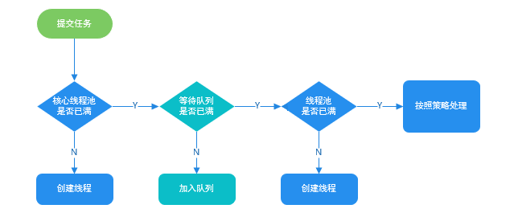

# Java Thread

## 概念

多线程

### 线程、进程和程序

#### 线程

**线程**与进程相似，但线程是一个比进程更小的执行单位。一个进程在其执行的过程中可以产生多个线程。与进程不同的是同类的多个线程共享同一块内存空间和一组系统资源，每个线程有自己的**程序计数器**、**虚拟机栈**和**本地方法栈**。所以系统在产生一个线程，或是在各个线程之间作切换工作时，负担要比进程小得多，也正因为如此，线程也被称为轻量级进程。


```java
    @Test
    public void multiThread(){
        // 获取 Java 线程管理 MXBean
        ThreadMXBean threadMXBean = ManagementFactory.getThreadMXBean();
        // 不需要获取同步的 monitor 和 synchronizer 信息，仅获取线程和线程堆栈信息
        ThreadInfo[] threadInfos = threadMXBean.dumpAllThreads(false, false);
        // 遍历线程信息，仅打印线程 ID 和线程名称信息
        for (ThreadInfo threadInfo : threadInfos) {
            System.out.println("[" + threadInfo.getThreadId() + "] " + threadInfo.getThreadName());
        }
    }
```


输出结果：

```
[6] Monitor Ctrl-Break 
[5] Attach Listener    //添加事件
[4] Signal Dispatcher  // 分发处理给 JVM 信号的线程
[3] Finalizer          //调用对象 finalize 方法的线程
[2] Reference Handler  //清除 reference 线程
[1] main               //main 线程,程序入口
```


**一个 Java 程序的运行是 main 线程和多个其他线程同时运行**。


#### 进程

**进程**是程序的一次执行过程，是系统运行程序的基本单位，因此进程是动态的。系统运行一个程序即是一个进程从创建，运行到消亡的过程。简单来说，一个进程就是一个执行中的程序，它在计算机中一个指令接着一个指令地执行着，同时，每个进程还占有某些系统资源如 CPU 时间，内存空间，文件，输入输出设备的使用权等等。换句话说，当程序在执行时，将会被操作系统载入内存中。 线程是进程划分成的更小的运行单位。线程和进程最大的不同在于基本上各进程是独立的，而各线程则不一定，因为同一进程中的线程极有可能会相互影响。从另一角度来说，进程属于操作系统的范畴，主要是同一段时间内，可以同时执行一个以上的程序，而线程则是在同一程序内几乎同时执行一个以上的程序段。


#### 程序

**程序**是含有指令和数据的文件，被存储在磁盘或其他的数据存储设备中，也就是说程序是静态的代码。


### 并发和并行

- **并发：** 同一时间段，多个任务都在执行 (单位时间内不一定同时执行)；
- **并行：** 单位时间内，多个任务同时执行。


### 线程基本状态

Java 线程在运行的生命周期中的指定时刻只可能处于下面 6 种不同状态的其中一个状态：


线程在生命周期中并不是固定处于某一个状态而是随着代码的执行在不同状态之间切换。Java 线程状态变迁如下图所示


线程创建之后它将处于 **NEW（新建）** 状态，调用 `start()` 方法后开始运行，线程这时候处于 **READY（可运行）** 状态。可运行状态的线程获得了 cpu 时间片（timeslice）后就处于 **RUNNING（运行）** 状态。


> 操作系统隐藏 Java 虚拟机（JVM）中的 READY 和 RUNNING 状态，它只能看到 RUNNABLE 状态（图源：[HowToDoInJava](https://howtodoinjava.com/)：[Java Thread Life Cycle and Thread States](https://howtodoinjava.com/java/multi-threading/java-thread-life-cycle-and-thread-states/)），所以 Java 系统一般将这两个状态统称为 **RUNNABLE（运行中）** 状态 。


当线程执行 `wait()`方法之后，线程进入 **WAITING（等待）**状态。进入等待状态的线程需要依靠其他线程的通知才能够返回到运行状态，而 **TIME_WAITING(超时等待)** 状态相当于在等待状态的基础上增加了超时限制，比如通过 `sleep（long millis）`方法或 `wait（long millis）`方法可以将 Java 线程置于 TIMED WAITING 状态。当超时时间到达后 Java 线程将会返回到 RUNNABLE 状态。当线程调用同步方法时，在没有获取到锁的情况下，线程将会进入到 **BLOCKED（阻塞）** 状态。线程在执行 Runnable 的`run()`方法之后将会进入到 **TERMINATED（终止）** 状态。


### 多线程

先从总体上来说：

- **从计算机底层来说：** 线程可以比作是轻量级的进程，是程序执行的最小单位,线程间的切换和调度的成本远远小于进程。另外，多核 CPU 时代意味着多个线程可以同时运行，这**减少了线程上下文切换的开销**。
- **从当代互联网发展趋势来说：** 现在的系统动不动就要求百万级甚至千万级的并发量，而多线程并发编程正是开发高并发系统的基础，利用好多线程机制可以大大**提高系统整体的并发能力以及性能**。

再深入到计算机底层来探讨：

- **单核时代：** 在单核时代多线程主要是为了提高 CPU 和 IO 设备的综合利用率。举个例子：当只有一个线程的时候会导致 CPU 计算时，IO 设备空闲；进行 IO 操作时，CPU 空闲。我们可以简单地说这两者的利用率目前都是 50%左右。但是当有两个线程的时候就不一样了，当一个线程执行 CPU 计算时，另外一个线程可以进行 IO 操作，这样两个的利用率就可以在理想情况下达到 100%了。
- **多核时代:** 多核时代多线程主要是为了提高 CPU 利用率。举个例子：假如我们要计算一个复杂的任务，我们只用一个线程的话，CPU 只会一个 CPU 核心被利用到，而创建多个线程就可以让多个 CPU 核心被利用到，这样就**提高了 CPU 的利用率**。


并发编程的目的就是为了能提高程序的执行效率提高程序运行速度，但是并发编程并不总是能提高程序运行速度的，而且并发编程可能会遇到很多问题，比如：**内存泄漏**、**上下文切换**、**死锁** 。


#### 上下文切换

多线程编程中一般线程的个数都大于 CPU 核心的个数，而一个 CPU 核心在任意时刻只能被一个线程使用，为了让这些线程都能得到有效执行，CPU 采取的策略是为每个线程分配时间片并轮转的形式。当一个线程的时间片用完的时候就会重新处于就绪状态让给其他线程使用，这个过程就属于一次上下文切换。

概括来说就是：当前任务在执行完 CPU 时间片切换到另一个任务之前会先保存自己的状态，以便下次再切换回这个任务时，可以再加载这个任务的状态。**任务从保存到再加载的过程就是一次上下文切换**。

上下文切换通常是计算密集型的。也就是说，它需要相当可观的处理器时间，在每秒几十上百次的切换中，每次切换都需要纳秒量级的时间。所以，上下文切换对系统来说意味着消耗大量的 CPU 时间，事实上，可能是操作系统中时间消耗最大的操作。

Linux 相比与其他操作系统（包括其他类 Unix 系统）有很多的优点，其中有一项就是，其上下文切换和模式切换的时间消耗非常少。


#### 死锁

线程死锁描述的是这样一种情况：多个线程同时被阻塞，它们中的一个或者全部都在等待某个资源被释放。由于线程被无限期地阻塞，因此程序不可能正常终止。


#### 死锁达成条件

死锁必须具备以下四个条件：

1. 互斥条件：该资源任意一个时刻只由一个线程占用。
2. 请求与保持条件：一个进程因请求资源而阻塞时，对已获得的资源保持不放。
3. 不剥夺条件:线程已获得的资源在末使用完之前不能被其他线程强行剥夺，只有自己使用完毕后才释放资源。
4. 循环等待条件:若干进程之间形成一种头尾相接的循环等待资源关系。


#### 避免死锁

1. **破坏互斥条件** ：这个条件我们没有办法破坏，因为我们用锁本来就是想让他们互斥的（临界资源需要互斥访问）。
2. **破坏请求与保持条件** ：一次性申请所有的资源。
3. **破坏不剥夺条件** ：占用部分资源的线程进一步申请其他资源时，如果申请不到，可以主动释放它占有的资源。
4. **破坏循环等待条件** ：靠按序申请资源来预防。按某一顺序申请资源，释放资源则反序释放。破坏循环等待条件。


## 关键字

### synchronized关键字

**`synchronized` 关键字解决的是多个线程之间访问资源的同步性，保证被它修饰的方法或者代码块在任意时刻只能有一个线程执行。**


在 Java 早期版本中，`synchronized` 属于 **重量级锁**，效率低下。因为监视器锁（monitor）是依赖于底层的操作系统的 `Mutex Lock` 来实现的，Java 的线程是映射到操作系统的原生线程之上的。如果要挂起或者唤醒一个线程，都需要操作系统帮忙完成，而操作系统实现线程之间的切换时需要从用户态转换到内核态，这个状态之间的转换需要相对比较长的时间，时间成本相对较高。


 Java 6 之后 Java 官方对从 JVM 层面对 `synchronized` 较大优化，所以现在的 `synchronized` 锁效率也优化得很不错了。JDK1.6 对锁的实现引入了大量的优化，如自旋锁、适应性自旋锁、锁消除、锁粗化、偏向锁、轻量级锁等技术来减少锁操作的开销。

所以目前不论是各种开源框架还是 JDK 源码都大量使用了 `synchronized` 关键字。


#### 使用方法

##### 修饰实例方法

作用于当前对象实例加锁，进入同步代码前要获得 **当前对象实例的锁**。


```java
synchronized void method() {
  //业务代码
}
```


##### 修饰静态方法

也就是给当前类加锁，会作用于类的所有对象实例 ，进入同步代码前要获得 **当前 class 的锁**。因为静态成员不属于任何一个实例对象，是类成员（static 表明这是该类的一个静态资源，不管 new 了多少个对象，只有一份）。所以，如果一个线程 A 调用一个实例对象的非静态 `synchronized` 方法，而线程 B 需要调用这个实例对象所属类的静态 `synchronized` 方法，是允许的，不会发生互斥现象，**因为访问静态 `synchronized` 方法占用的锁是当前类的锁，而访问非静态 `synchronized` 方法占用的锁是当前实例对象锁**。


```java
synchronized staic void method() {
  //业务代码
}
```


##### 修饰代码块

指定加锁对象，对给定对象/类加锁。`synchronized(this|object)` 表示进入同步代码库前要获得**给定对象的锁**。`synchronized(类.class)` 表示进入同步代码前要获得 **当前 class 的锁**。


```java
synchronized(this) {
  //业务代码
}
```


##### 总结

- `synchronized` 关键字加到 `static` 静态方法和 `synchronized(class)` 代码块上都是是给 Class 类上锁。
- `synchronized` 关键字加到实例方法上是给对象实例上锁。
- 尽量不要使用 `synchronized(String a)` 因为 JVM 中，字符串常量池具有缓存功能！


#### 底层原理

##### synchronized 同步语句块

```java
public class SynchronizedDemo {
    public void method() {
        synchronized (this) {
            System.out.println("synchronized 代码块");
        }
    }
}
```


>通过 JDK 自带的 `javap` 命令查看 `SynchronizedDemo` 类的相关字节码信息：首先切换到类的对应目录执行 `javac SynchronizedDemo.java` 命令生成编译后的 .class 文件，然后执行`javap -c -s -v -l SynchronizedDemo.class`。


**`synchronized` 同步语句块的实现使用的是 `monitorenter` 和 `monitorexit` 指令，其中 `monitorenter` 指令指向同步代码块的开始位置，`monitorexit` 指令则指明同步代码块的结束位置。**

当执行 `monitorenter` 指令时，线程试图获取锁也就是获取 **对象监视器 `monitor`** 的持有权。

在执行`monitorenter`时，会尝试获取对象的锁，如果锁的计数器为 0 则表示锁可以被获取，获取后将锁计数器设为 1 也就是加 1。

在执行 `monitorexit` 指令后，将锁计数器设为 0，表明锁被释放。如果获取对象锁失败，那当前线程就要阻塞等待，直到锁被另外一个线程释放为止。


##### synchronized 修饰方法

```java
public class SynchronizedDemo2 {
    public synchronized void method() {
        System.out.println("synchronized 方法");
    }
}
```


`synchronized` 修饰的方法并没有 `monitorenter` 指令和 `monitorexit` 指令，取得代之的确实是 `ACC_SYNCHRONIZED` 标识，该标识指明了该方法是一个同步方法。JVM 通过该 `ACC_SYNCHRONIZED` 访问标志来辨别一个方法是否声明为同步方法，从而执行相应的同步调用。


##### 总结

`synchronized` 同步语句块的实现使用的是 `monitorenter` 和 `monitorexit` 指令，其中 `monitorenter` 指令指向同步代码块的开始位置，`monitorexit` 指令则指明同步代码块的结束位置。

`synchronized` 修饰的方法并没有 `monitorenter` 指令和 `monitorexit` 指令，取得代之的确实是 `ACC_SYNCHRONIZED` 标识，该标识指明了该方法是一个同步方法。

**两者的本质都是对对象监视器 monitor 的获取。**


#### 扩展

##### 构造方法可以使用 synchronized 关键字修饰么？

**构造方法不能使用 synchronized 关键字修饰。**构造方法本身就属于线程安全的，不存在同步的构造方法一说。


### volatile关键字

在 JDK1.2 之前，Java 的内存模型实现总是从**主存**（即共享内存）读取变量，是不需要进行特别的注意的。而在当前的 Java 内存模型下，线程可以把变量保存**本地内存**（比如机器的寄存器）中，而不是直接在主存中进行读写。这就可能造成一个线程在主存中修改了一个变量的值，而另外一个线程还继续使用它在寄存器中的变量值的拷贝，造成**数据的不一致**。


要解决这个问题，就需要把变量声明为**`volatile`**，这就指示 JVM，这个变量是共享且不稳定的，每次使用它都到主存中进行读取。

所以，**`volatile` 关键字 除了防止 JVM 的指令重排 ，还有一个重要的作用就是保证变量的可见性。**


#### volatile和synchronized的区别

`synchronized` 关键字和 `volatile` 关键字是两个互补的存在，而不是对立的存在！

- **`volatile` 关键字**是线程同步的**轻量级实现**，所以**`volatile`性能肯定比`synchronized`关键字要好**。但是**`volatile` 关键字只能用于变量而 `synchronized` 关键字可以修饰方法以及代码块**。
- **`volatile` 关键字能保证数据的可见性，但不能保证数据的原子性。`synchronized` 关键字两者都能保证。**
- **`volatile`关键字主要用于解决变量在多个线程之间的可见性，而 `synchronized` 关键字解决的是多个线程之间访问资源的同步性。**


## Thread

### 源码解析

#### 属性

> java.lang.Thread

```java
    /* 
     * 与此线程有关的 ThreadLocal 值。此映射由 ThreadLocal 类维护。 
     */
    ThreadLocal.ThreadLocalMap threadLocals = null;

    /*
     * 与此线程有关的 InheritableThreadLocal 值。
     * 该映射由 InheritableThreadLocal 类维护。
     */
    ThreadLocal.ThreadLocalMap inheritableThreadLocals = null;
```


- threadLocals

该变量默认为null，只有调用 ThreadLoacl 的 get 和 set 方法时才会创建。


#### run

> java.lang.Thread

```java
    /**
     * 如果该线程是使用单独的 Runnable 运行对象构造的，则调用该 Runnable对象的 run 方法；
     * 否则，此方法不执行任何操作并返回。
     */
    @Override
    public void run() {
        if (target != null) {
            target.run();
        }
    }
```


#### start

```java
    public synchronized void start() {
        /**
         * This method is not invoked for the main method thread or "system"
         * group threads created/set up by the VM. Any new functionality added
         * to this method in the future may have to also be added to the VM.
         *
         * A zero status value corresponds to state "NEW".
         */
        if (threadStatus != 0)
            throw new IllegalThreadStateException();

        /* Notify the group that this thread is about to be started
         * so that it can be added to the group's list of threads
         * and the group's unstarted count can be decremented. */
        group.add(this);

        boolean started = false;
        try {
            start0();
            started = true;
        } finally {
            try {
                if (!started) {
                    group.threadStartFailed(this);
                }
            } catch (Throwable ignore) {
                /* do nothing. If start0 threw a Throwable then
                  it will be passed up the call stack */
            }
        }
    }

    private native void start0();

    /**
     * Notifies the group that the thread {@code t} has failed
     * an attempt to start.
     *
     * <p> The state of this thread group is rolled back as if the
     * attempt to start the thread has never occurred. The thread is again
     * considered an unstarted member of the thread group, and a subsequent
     * attempt to start the thread is permitted.
     *
     * @param  t
     *         the Thread whose start method was invoked
     */
    void threadStartFailed(Thread t) {
        synchronized(this) {
            remove(t);
            nUnstartedThreads++;
        }
    }

    /**
     * 从此组中删除指定的线程。在已销毁的线程组上调用此方法无效。
     */
    private void remove(Thread t) {
        synchronized (this) {
            if (destroyed) {
                return;
            }
            for (int i = 0 ; i < nthreads ; i++) {
                if (threads[i] == t) {
                    System.arraycopy(threads, i + 1, threads, i, --nthreads - i);
                    // 对死线程的空引用，以便垃圾收集器收集它。
                    threads[nthreads] = null;
                    break;
                }
            }
        }
    }
```


new 一个 Thread，线程进入了新建状态。调用 `start()`方法，会启动一个线程并使线程进入了就绪状态，当分配到时间片后就可以开始运行了。 `start()` 会执行线程的相应准备工作，然后自动执行 `run()` 方法的内容，这是真正的多线程工作。 但是，直接执行 `run()` 方法，会把 `run()` 方法当成一个 main 线程下的普通方法去执行，并不会在某个线程中执行它，所以这并不是多线程工作。

**总结： 调用 `start()` 方法方可启动线程并使线程进入就绪状态，直接执行 `run()` 方法的话不会以多线程的方式执行。**


#### sleep

> java.lang.Thread

```java
    /**
     * 使当前执行的线程休眠（暂时停止执行）指定的毫秒数，
     * 取决于系统计时器和调度程序的精度和准确性。该线程不会失去任何监视器的所有权。
     */
    public static native void sleep(long millis) throws InterruptedException;

    /**
     * 使当前执行的线程休眠（暂时停止执行）指定的毫秒数加上指定的纳秒数，
     * 具体取决于系统计时器和调度程序的精度和准确性。该线程不会失去任何监视器的所有权。
     */
    public static void sleep(long millis, int nanos)
    throws InterruptedException {
        if (millis < 0) {
            throw new IllegalArgumentException("timeout value is negative");
        }

        if (nanos < 0 || nanos > 999999) {
            throw new IllegalArgumentException(
                                "nanosecond timeout value out of range");
        }

        if (nanos >= 500000 || (nanos != 0 && millis == 0)) {
            millis++;
        }

        sleep(millis);
    }
```


##### sleep方法和wait方法的区别

- 两者最主要的区别在于：**`sleep()` 方法没有释放锁，而 `wait()` 方法释放了锁** 。
- 两者都可以暂停线程的执行。
- `wait()` 通常被用于线程间交互/通信，`sleep()`通常被用于暂停执行。
- `wait()` 方法被调用后，线程不会自动苏醒，需要别的线程调用同一个对象上的 `notify()`或者 `notifyAll()` 方法。`sleep()`方法执行完成后，线程会自动苏醒。或者可以使用 `wait(long timeout)` 超时后线程会自动苏醒。


## Runnable 和 Callable

Runnable 接口不会返回结果或抛出检查异常，但是Callable 接口可以。所以，如果任务不需要返回结果或抛出异常推荐使用 Runnable 接口。


### 互相转换


### 源码解析

#### 接口定义

> java.lang.Runnable

```java
@FunctionalInterface
public interface Runnable {
    /**
     * 当使用实现接口Runnable的对象来创建线程时，启动线程会导致在该单独执行的线程中调用对象的run方法。
     */
    public abstract void run();
}
```


> java.util.concurrent.Callable

```java
@FunctionalInterface
public interface Callable<V> {
    /**
     * 计算结果，失败则抛出异常
     */
    V call() throws Exception;
}
```


#### 互相转换

工具类 `Executors` 可以实现 `Runnable` 对象和 `Callable` 对象之间的相互转换。


> java.util.concurrent.Executors

```java
    /**
     * 
     */
    public static <T> Callable<T> callable(Runnable task, T result) {
        if (task == null)
            throw new NullPointerException();
        return new RunnableAdapter<T>(task, result);
    }

    /**
     * 
     */
    public static Callable<Object> callable(Runnable task) {
        if (task == null)
            throw new NullPointerException();
        return new RunnableAdapter<Object>(task, null);
    }


```


## ThreadLocal
### ThreadLocal
#### 概述
**`ThreadLocal`类主要解决的就是让每个线程绑定自己的值。**

**访问`ThreadLocal`变量的每个线程都会有这个变量的本地副本，可以使用 `get（）` 和 `set（）` 方法来获取默认值或将其值更改为当前线程所存的副本的值，从而避免了线程安全问题。**


#### 原理
##### threadLocalHashCode属性
通过属性threadLocalHashCode和容量长度len的进行位运算来获取在table中的下标位置。


##### nextHashCode属性
因为nextHashCode属性是static的原因，在每次new ThreadLocal时因为threadLocalHashCode的初始化，会使threadLocalHashCode值自增一次，增量为0x61c88647。


##### HASH_INCREMENT常量
HASH_INCREMENT常量值为0x61c88647。

0x61c88647是斐波那契散列乘数,它的优点是通过它散列(hash)出来的结果分布会比较均匀，可以很大程度上避免hash冲突，已初始容量16为例，hash并与15位运算计算数组下标结果如下：

ThreadLocalMap使用的是线性探测法，均匀分布的好处在于很快就能探测到下一个临近的可用slot，从而保证效率。。

|hashCode	|数组下标    |
| ----      | ----      |
|0x61c88647	|7          |
|0xc3910c8e	|14         |
|0x255992d5	|5          |
|0x8722191c	|12         |
|0xe8ea9f63	|3          |
|0x4ab325aa	|10         |
|0xac7babf1	|1          |
|0xe443238	|8          |
|0x700cb87f	|15         |

总结如下：
- 对于某一ThreadLocal来讲，他的索引值i是确定的，在不同线程之间访问时访问的是不同的table数组的同一位置即都为table[i]，只不过这个不同线程之间的table是独立的。
- 对于同一线程的不同ThreadLocal来讲，这些ThreadLocal实例共享一个table数组，然后每个ThreadLocal实例在table中的索引i是不同的。


#### 总结

##### 和synchronized比较

`ThreadLocal`和`Synchronized`都是为了解决多线程中相同变量的访问冲突问题，不同的点是

- `Synchronized`是通过线程等待，牺牲时间来解决访问冲突。
- `ThreadLocal`是通过每个线程单独一份存储空间，牺牲空间来解决冲突，并且相比于`Synchronized`，`ThreadLocal`具有线程隔离的效果，只有在线程内才能获取到对应的值，线程外则不能访问到想要的值。

正因为`ThreadLocal`的线程隔离特性，使他的应用场景相对来说更为特殊一些。在android中Looper、ActivityThread以及AMS中都用到了`ThreadLocal`。当某些数据是以线程为作用域并且不同线程具有不同的数据副本的时候，就可以考虑采用`ThreadLocal`。


##### ThreadLocal与内存泄漏

`ThreadLocalMap` 中使用的 key 为 `ThreadLocal` 的弱引用,而 value 是强引用。所以，如果 `ThreadLocal` 没有被外部强引用的情况下，在垃圾回收的时候，key 会被清理掉，而 value 不会被清理掉。这样一来，`ThreadLocalMap` 中就会出现 key 为 null 的 Entry。假如我们不做任何措施的话，value 永远无法被 GC 回收，这个时候就可能会产生内存泄露。

ThreadLocalMap 实现中已经考虑了这种情况，在调用 `set()`、`get()`、`remove()` 方法的时候，会清理掉 key 为 null 的记录。使用ThreadLocal的过程中，显式地进行调用remove方法，将弱引用的key与强引用的value一起删除，避免引起内存泄漏。


#### 源码解析
##### 基础结构
> java.lang.ThreadLocal
```java
public class ThreadLocal<T> {
   
    private final int threadLocalHashCode = nextHashCode();

    private static AtomicInteger nextHashCode =
        new AtomicInteger();
    
    private static final int HASH_INCREMENT = 0x61c88647;
    
    private static int nextHashCode() {
        // HASH_INCREMENT可以让生成出来的值或者说ThreadLocal的ID较为均匀地分布在2的幂大小的数组中
        return nextHashCode.getAndAdd(HASH_INCREMENT);
    }

    public ThreadLocal() {
    }
```


##### set

> java.lang.ThreadLocal
```java
public class ThreadLocal<T> {
    public void set(T value) {
        Thread t = Thread.currentThread();
        ThreadLocalMap map = getMap(t);
        if (map != null)
            map.set(this, value);
        else
            createMap(t, value);
    }
    
    ThreadLocalMap getMap(Thread t) {
        // 获取当前Thread类维护的ThreadLocalMap类型属性threadLocals
        return t.threadLocals;
    }

    void createMap(Thread t, T firstValue) {
        // 创建ThreadLocalMap对象并复制给当前Thread对象的属性threadLocals
        t.threadLocals = new ThreadLocalMap(this, firstValue);
    }
}
```


线程本地变量实质上是存放在了 Thread 类的 threadLocals 属性中，ThreadLocal 可以理解为 ThreadLocalMap 的封装。

每个 Thread 中都具备一个ThreadLocalMap，而ThreadLocalMap可以存储以ThreadLocal为 key ，Object 对象为 value 的键值对。

在同一个线程中声明了两个 ThreadLocal 对象的话，会使用 Thread内部都是使用仅有那个ThreadLocalMap 存放数据的，ThreadLocalMap的 key 就是 ThreadLocal对象，value 就是 ThreadLocal 对象调用set方法设置的值。


##### get

> java.lang.ThreadLocal
```java
public class ThreadLocal<T> {
    public T get() {
        Thread t = Thread.currentThread();
        ThreadLocalMap map = getMap(t);
        if (map != null) {
            ThreadLocalMap.Entry e = map.getEntry(this);
            if (e != null) {
                @SuppressWarnings("unchecked")
                T result = (T)e.value;
                return result;
            }
        }
        // 设置初始化值并返回
        return setInitialValue();
    }

    private T setInitialValue() {
        // 获取初始化值，默认为null
        T value = initialValue();
        Thread t = Thread.currentThread();
        ThreadLocalMap map = getMap(t);
        if (map != null)
            map.set(this, value);
        else
            createMap(t, value);
        return value;
    }    

    protected T initialValue() {
        return null;
    }
}
```


##### remove

> java.lang.ThreadLocal
```java
public class ThreadLocal<T> {
     public void remove() {
         ThreadLocalMap m = getMap(Thread.currentThread());
         if (m != null)
             m.remove(this);
     }        
}
```


### SuppliedThreadLocal

#### 概述
`SuppliedThreadLocal`继承了`ThreadLocal`类，对其功能提供了扩展，可以通过函数式接口`Supplier`来设置默认的初始化值。


#### 源码解析

> java.lang.ThreadLocal.SuppliedThreadLocal
```java
static final class SuppliedThreadLocal<T> extends ThreadLocal<T> {

    private final Supplier<? extends T> supplier;

    SuppliedThreadLocal(Supplier<? extends T> supplier) {
        this.supplier = Objects.requireNonNull(supplier);
    }

    @Override
    protected T initialValue() {
        return supplier.get();
    }
}
```


### ThreadLocalMap

#### 概述
ThreadLocalMap是定义于ThreadLocal类中的默认静太类，没有对外暴露任何public方法，因此只能有ThreadLocal内进行调用。


#### 源码解析

##### 基础结构
> java.lang.ThreadLocal.ThreadLocalMap
```java
static class ThreadLocalMap {
    static class Entry extends WeakReference<ThreadLocal<?>> {
        Object value;
        Entry(ThreadLocal<?> k, Object v) {
            super(k);
            value = v;
        }
    }

    /**
     * 初始化容器容量
     */
    private static final int INITIAL_CAPACITY = 16;

    private Entry[] table;

    /**
     * table中元素的数量
     */
    private int size = 0;

    /**
     * 当size >= threshold时，遍历table并删除key为null的元素，如果删除后size >= threshold*3/4时，需要对table进行扩容。
     */
    private int threshold; // Default to 0

    private void setThreshold(int len) {
        // threshold是table大小的2/3
        threshold = len * 2 / 3;
    }

    private static int nextIndex(int i, int len) {
        return ((i + 1 < len) ? i + 1 : 0);
    }

    private static int prevIndex(int i, int len) {
        return ((i - 1 >= 0) ? i - 1 : len - 1);
    }

    ThreadLocalMap(ThreadLocal<?> firstKey, Object firstValue) {
        // 定义一个长度为16的Entry数组table
        table = new Entry[INITIAL_CAPACITY];
        // 位运算，获取存放下标位置
        int i = firstKey.threadLocalHashCode & (INITIAL_CAPACITY - 1);
        table[i] = new Entry(firstKey, firstValue);
        size = 1;
        setThreshold(INITIAL_CAPACITY);
    }

    private ThreadLocalMap(ThreadLocalMap parentMap) {
        Entry[] parentTable = parentMap.table;
        int len = parentTable.length;
        setThreshold(len);
        table = new Entry[len];

        for (int j = 0; j < len; j++) {
            Entry e = parentTable[j];
            if (e != null) {
                @SuppressWarnings("unchecked")
                ThreadLocal<Object> key = (ThreadLocal<Object>) e.get();
                if (key != null) {
                    Object value = key.childValue(e.value);
                    Entry c = new Entry(key, value);
                    int h = key.threadLocalHashCode & (len - 1);
                    while (table[h] != null)
                        h = nextIndex(h, len);
                    table[h] = c;
                    size++;
                }
            }
        }
    }
}
```


##### set方法

> java.lang.ThreadLocal.ThreadLocalMap
```java
static class ThreadLocalMap {
    private void set(ThreadLocal<?> key, Object value) {

        // We don't use a fast path as with get() because it is at
        // least as common to use set() to create new entries as
        // it is to replace existing ones, in which case, a fast
        // path would fail more often than not.

        Entry[] tab = table;
        int len = tab.length;
        int i = key.threadLocalHashCode & (len-1);

        for (Entry e = tab[i];
             e != null;
             e = tab[i = nextIndex(i, len)]) {
            ThreadLocal<?> k = e.get();

            if (k == key) {
                // 当前线程key存在，设置value值并返回
                e.value = value;
                return;
            }

            if (k == null) {
                // 如果k为null，表示这个位置的value已经是陈旧的元素，将该旧元素替换
                replaceStaleEntry(key, value, i);
                return;
            }
        }
        
        // 当前下标位置没有Entry对象，则创建Entry对象并设置到当前下标位置    
        tab[i] = new Entry(key, value);
        int sz = ++size;
        if (!cleanSomeSlots(i, sz) && sz >= threshold)
            // 满足没有清除元素且元素数量大于设置的threshold条件
            rehash();
    }

    private void replaceStaleEntry(ThreadLocal<?> key, Object value,
                                   int staleSlot) {
        // 删除所有陈旧元素并设置新元素
        Entry[] tab = table;
        int len = tab.length;
        Entry e;

        int slotToExpunge = staleSlot;
        for (int i = prevIndex(staleSlot, len);
             (e = tab[i]) != null;
             i = prevIndex(i, len))
            if (e.get() == null)
                slotToExpunge = i;

        for (int i = nextIndex(staleSlot, len);
             (e = tab[i]) != null;
             i = nextIndex(i, len)) {
            ThreadLocal<?> k = e.get();

            if (k == key) {
                e.value = value;

                tab[i] = tab[staleSlot];
                tab[staleSlot] = e;

                if (slotToExpunge == staleSlot)
                    slotToExpunge = i;
                cleanSomeSlots(expungeStaleEntry(slotToExpunge), len);
                return;
            }

            if (k == null && slotToExpunge == staleSlot)
                slotToExpunge = i;
        }

        tab[staleSlot].value = null;
        tab[staleSlot] = new Entry(key, value);

        if (slotToExpunge != staleSlot)
            cleanSomeSlots(expungeStaleEntry(slotToExpunge), len);
    }
   
    private boolean cleanSomeSlots(int i, int n) {
        boolean removed = false;
        Entry[] tab = table;
        int len = tab.length;
        do {
            i = nextIndex(i, len);
            Entry e = tab[i];
            if (e != null && e.get() == null) {
                n = len;
                removed = true;
                i = expungeStaleEntry(i);
            }
        } while ( (n >>>= 1) != 0);
        return removed;
    }

    private void expungeStaleEntries() {
        Entry[] tab = table;
        int len = tab.length;
        for (int j = 0; j < len; j++) {
            Entry e = tab[j];
            if (e != null && e.get() == null)
                expungeStaleEntry(j);
        }
    }
}
```


##### getEntry方法

> java.lang.ThreadLocal.ThreadLocalMap
```java
static class ThreadLocalMap {
    private Entry getEntry(ThreadLocal<?> key) {
        int i = key.threadLocalHashCode & (table.length - 1);
        Entry e = table[i];
        if (e != null && e.get() == key)
            // 指定下标的entry存在且key与当前参数TreadLocal相等，则返回对应的值
            return e;
        else
            return getEntryAfterMiss(key, i, e);
    }

    private Entry getEntryAfterMiss(ThreadLocal<?> key, int i, Entry e) {
        Entry[] tab = table;
        int len = tab.length;

        while (e != null) {
            ThreadLocal<?> k = e.get();
            if (k == key)
                return e;
            if (k == null)
                expungeStaleEntry(i);
            else
                i = nextIndex(i, len);
            e = tab[i];
        }
        return null;
    }    

    private int expungeStaleEntry(int staleSlot) {
        Entry[] tab = table;
        int len = tab.length;

        // expunge entry at staleSlot
        tab[staleSlot].value = null;
        tab[staleSlot] = null;
        size--;

        // Rehash until we encounter null
        Entry e;
        int i;
        for (i = nextIndex(staleSlot, len);
             (e = tab[i]) != null;
             i = nextIndex(i, len)) {
            ThreadLocal<?> k = e.get();
            if (k == null) {
                e.value = null;
                tab[i] = null;
                size--;
            } else {
                int h = k.threadLocalHashCode & (len - 1);
                if (h != i) {
                    tab[i] = null;

                    // Unlike Knuth 6.4 Algorithm R, we must scan until
                    // null because multiple entries could have been stale.
                    while (tab[h] != null)
                        h = nextIndex(h, len);
                    tab[h] = e;
                }
            }
        }
        return i;
    }
}
```


##### remove方法

> java.lang.ThreadLocal.ThreadLocalMap
```java
static class ThreadLocalMap {
    private void remove(ThreadLocal<?> key) {
        Entry[] tab = table;
        int len = tab.length;
        int i = key.threadLocalHashCode & (len-1);
        for (Entry e = tab[i];
             e != null;
             e = tab[i = nextIndex(i, len)]) {
            if (e.get() == key) {
                e.clear();
                expungeStaleEntry(i);
                return;
            }
        }
    }    
}
```


##### rehash方法

> java.lang.ThreadLocal.ThreadLocalMap
```java
static class ThreadLocalMap {
    private void rehash() {
        // 删除所有旧的元素
        expungeStaleEntries();

        if (size >= threshold - threshold / 4)
            // 超出设置的threshold*3/4时，进行扩容操作
            resize();
    }

    private void resize() {
        Entry[] oldTab = table;
        int oldLen = oldTab.length;
        // 扩容后的大小为原先的2倍
        int newLen = oldLen * 2;
        Entry[] newTab = new Entry[newLen];
        int count = 0;

        for (int j = 0; j < oldLen; ++j) {
            Entry e = oldTab[j];
            if (e != null) {
                ThreadLocal<?> k = e.get();
                if (k == null) {
                    e.value = null;
                } else {
                    int h = k.threadLocalHashCode & (newLen - 1);
                    while (newTab[h] != null)
                        h = nextIndex(h, nsewLen);
                    newTab[h] = e;
                    count++;
                }
            }
        }

        setThreshold(newLen);
        size = count;
        table = newTab;
    }
}
```


## 线程池

> **池化技术的思想主要是为了减少每次获取资源的消耗，提高对资源的利用率。线程池、数据库连接池、Http 连接池等等都是对这个思想的应用。**


**线程池**提供了一种限制和管理资源（包括执行一个任务）。 每个**线程池**还维护一些基本统计信息，例如已完成任务的数量。


**使用线程池的好处**：

- **降低资源消耗**。通过重复利用已创建的线程降低线程创建和销毁造成的消耗。
- **提高响应速度**。当任务到达时，任务可以不需要的等到线程创建就能立即执行。
- **提高线程的可管理性**。线程是稀缺资源，如果无限制的创建，不仅会消耗系统资源，还会降低系统的稳定性，使用线程池可以进行统一的分配，调优和监控。


### 创建线程池

创建线程池的方法有两种，通过ThreadPoolExecutor构造方法实现和通过Executors工具类方法来实现。


#### ThreadPoolExecutor方式

##### ThreadPoolExecutor构造方法

> java.util.concurrent.ThreadPoolExecutor

```java
    public ThreadPoolExecutor(int corePoolSize,
                              int maximumPoolSize,
                              long keepAliveTime,
                              TimeUnit unit,
                              BlockingQueue<Runnable> workQueue,
                              ThreadFactory threadFactory,
                              RejectedExecutionHandler handler) {
        if (corePoolSize < 0 ||
            maximumPoolSize <= 0 ||
            maximumPoolSize < corePoolSize ||
            keepAliveTime < 0)
            throw new IllegalArgumentException();
        if (workQueue == null || threadFactory == null || handler == null)
            throw new NullPointerException();
        this.acc = System.getSecurityManager() == null ?
                null :
                AccessController.getContext();
        this.corePoolSize = corePoolSize;
        this.maximumPoolSize = maximumPoolSize;
        this.workQueue = workQueue;
        this.keepAliveTime = unit.toNanos(keepAliveTime);
        this.threadFactory = threadFactory;
        this.handler = handler;
    }
```


`ThreadPoolExecutor` 类中提供四个构造方法，其余三个都是在这个构造方法的基础上产生。


**`ThreadPoolExecutor` 3 个最重要的参数：**

- **`corePoolSize`(int)**： 核心线程数线程数定义了最小可以同时运行的线程数量。
- **`maximumPoolSize`(int) **： 当队列中存放的任务达到队列容量的时候，当前可以同时运行的线程数量变为最大线程数。
- **`workQueue`**：当新任务来的时候会先判断当前运行的线程数量是否达到核心线程数，如果达到的话，新任务就会被存放在队列中。


`ThreadPoolExecutor`其他常见参数:

1. **`keepAliveTime`(long)**：当线程池中的线程数量大于 `corePoolSize` 的时候，如果这时没有新的任务提交，核心线程外的线程不会立即销毁，而是会等待，直到等待的时间超过了 `keepAliveTime`才会被回收销毁；
2. **`unit`** ：`keepAliveTime` 参数的时间单位。
3. **`threadFactory`** ：executor 创建新线程的时候会用到。
4. **`handler`** ：饱和策略。关于饱和策略下面单独介绍一下。


#### Executors工具类方式

《阿里巴巴 Java 开发手册》中强制线程池不允许使用 Executors 去创建，而是通过 ThreadPoolExecutor 的方式，这样的处理方式让写的同学更加明确线程池的运行规则，规避资源耗尽的风险。


> Executors 返回线程池对象的弊端如下：
>
> - **FixedThreadPool 和 SingleThreadExecutor** ： 允许请求的队列长度为 Integer.MAX_VALUE ，可能堆积大量的请求，从而导致 OOM。
> - **CachedThreadPool 和 ScheduledThreadPool** ： 允许创建的线程数量为 Integer.MAX_VALUE ，可能会创建大量线程，从而导致 OOM。


##### FixedThreadPool

**FixedThreadPool** ： 该方法返回一个固定线程数量的线程池。该线程池中的线程数量始终不变。当有一个新的任务提交时，线程池中若有空闲线程，则立即执行。若没有，则新的任务会被暂存在一个任务队列中，待有线程空闲时，便处理在任务队列中的任务。


###### 源码解析

> java.util.concurrent.Executors

```java
    public static ExecutorService newFixedThreadPool(int nThreads) {
        return new ThreadPoolExecutor(nThreads, nThreads,
                                      0L, TimeUnit.MILLISECONDS,
                                      new LinkedBlockingQueue<Runnable>());
    }

    public static ExecutorService newFixedThreadPool(int nThreads, ThreadFactory threadFactory) {
        return new ThreadPoolExecutor(nThreads, nThreads,
                                      0L, TimeUnit.MILLISECONDS,
                                      new LinkedBlockingQueue<Runnable>(),
                                      threadFactory);
    }
```


##### SingleThreadExecutor

**SingleThreadExecutor：** 方法返回一个只有一个线程的线程池。若多余一个任务被提交到该线程池，任务会被保存在一个任务队列中，待线程空闲，按先入先出的顺序执行队列中的任务。


###### 源码解析

```java
    public static ExecutorService newSingleThreadExecutor() {
        return new FinalizableDelegatedExecutorService
            (new ThreadPoolExecutor(1, 1,
                                    0L, TimeUnit.MILLISECONDS,
                                    new LinkedBlockingQueue<Runnable>()));
    }

    public static ExecutorService newSingleThreadExecutor(ThreadFactory threadFactory) {
        return new FinalizableDelegatedExecutorService
            (new ThreadPoolExecutor(1, 1,
                                    0L, TimeUnit.MILLISECONDS,
                                    new LinkedBlockingQueue<Runnable>(),
                                    threadFactory));
    }
```


##### CachedThreadPool

**CachedThreadPool：** 该方法返回一个可根据实际情况调整线程数量的线程池。线程池的线程数量不确定，但若有空闲线程可以复用，则会优先使用可复用的线程。若所有线程均在工作，又有新的任务提交，则会创建新的线程处理任务。所有线程在当前任务执行完毕后，将返回线程池进行复用。


###### 源码解析

```java
    public static ExecutorService newCachedThreadPool() {
        return new ThreadPoolExecutor(0, Integer.MAX_VALUE,
                                      60L, TimeUnit.SECONDS,
                                      new SynchronousQueue<Runnable>());
    }

    public static ExecutorService newCachedThreadPool(ThreadFactory threadFactory) {
        return new ThreadPoolExecutor(0, Integer.MAX_VALUE,
                                      60L, TimeUnit.SECONDS,
                                      new SynchronousQueue<Runnable>(),
                                      threadFactory);
    }
```


### 线程池原理

> java.util.concurrent.ThreadPoolExecutor

```java
   // 存放线程池的运行状态 (runState) 和线程池内有效线程的数量 (workerCount)
   private final AtomicInteger ctl = new AtomicInteger(ctlOf(RUNNING, 0));

    private static int workerCountOf(int c) {
        return c & CAPACITY;
    }

    private final BlockingQueue<Runnable> workQueue;

    public void execute(Runnable command) {
        // 如果任务为null，则抛出异常。
        if (command == null)
            throw new NullPointerException();
        // ctl 中保存的线程池当前的一些状态信息
        int c = ctl.get();

        // 1.首先判断当前线程池中之行的任务数量是否小于 corePoolSize
        // 如果小于的话，通过addWorker(command, true)新建一个线程，并将任务(command)添加到该线程中；
        // 然后，启动该线程从而执行任务。
        if (workerCountOf(c) < corePoolSize) {
            if (addWorker(command, true))
                return;
            c = ctl.get();
        }
        // 2.如果当前之行的任务数量大于等于 corePoolSize 的时候就会走到这里
        // 通过 isRunning 方法判断线程池状态，线程池处于 RUNNING 状态才会被并且队列可以加入任务，该任务才会被加入进去
        if (isRunning(c) && workQueue.offer(command)) {
            int recheck = ctl.get();
            // 再次获取线程池状态，如果线程池状态不是 RUNNING 状态就需要从任务队列中移除任务，
            // 并尝试判断线程是否全部执行完毕。同时执行拒绝策略。
            if (!isRunning(recheck) && remove(command))
                reject(command);
                
            else if (workerCountOf(recheck) == 0)
                // 如果当前线程池为空就新创建一个线程并执行。
                addWorker(null, false);
        }
        //3. 通过addWorker(command, false)新建一个线程，并将任务(command)添加到该线程中；然后，启动该线程从而执行任务。
        //如果addWorker(command, false)执行失败，则通过reject()执行相应的拒绝策略的内容。
        else if (!addWorker(command, false))
            reject(command);
    }

```





> 在代码中模拟了 10 个任务，我们配置的核心线程数为 5 、等待队列容量为 100 ，所以每次只可能存在 5 个任务同时执行，剩下的 5 个任务会被放到等待队列中去。当前的 5 个任务之行完成后，才会之行剩下的 5 个任务。


### 饱和策略


### 扩展

####  execute()方法和 submit()方法的区别

1. **`execute()`方法用于提交不需要返回值的任务，所以无法判断任务是否被线程池执行成功与否；**
2. **`submit()`方法用于提交需要返回值的任务。线程池会返回一个 `Future` 类型的对象，通过这个 `Future` 对象可以判断任务是否执行成功**，并且可以通过 `Future` 的 `get()`方法来获取返回值，`get()`方法会阻塞当前线程直到任务完成，而使用 `get（long timeout，TimeUnit unit）`方法则会阻塞当前线程一段时间后立即返回，这时候有可能任务没有执行完。


##### 源码解析

###### submit方法

> java.util.concurrent.AbstractExecutorService

```java
    public <T> Future<T> submit(Callable<T> task) {
        if (task == null) throw new NullPointerException();
        RunnableFuture<T> ftask = newTaskFor(task);
        execute(ftask);
        return ftask;
    }

    protected <T> RunnableFuture<T> newTaskFor(Callable<T> callable) {
        return new FutureTask<T>(callable);
    }

    public Future<?> submit(Runnable task) {
        if (task == null) throw new NullPointerException();
        RunnableFuture<Void> ftask = newTaskFor(task, null);
        execute(ftask);
        return ftask;
    }

    protected <T> RunnableFuture<T> newTaskFor(Runnable runnable, T value) {
        return new FutureTask<T>(runnable, value);
    }

    public <T> Future<T> submit(Runnable task, T result) {
        if (task == null) throw new NullPointerException();
        RunnableFuture<T> ftask = newTaskFor(task, result);
        execute(ftask);
        return ftask;
    }
```


###### execute方法

见 线程池原理。


# JUC

## Atomic原子类

原子类就是具有原子/原子操作特征的类，并发包 `java.util.concurrent` 的原子类都存放在`java.util.concurrent.atomic`下。


### 原子类分类

**基本类型**

使用原子的方式更新基本类型

- `AtomicInteger`：整形原子类
- `AtomicLong`：长整型原子类
- `AtomicBoolean`：布尔型原子类


**数组类型**

使用原子的方式更新数组里的某个元素

- `AtomicIntegerArray`：整形数组原子类
- `AtomicLongArray`：长整形数组原子类
- `AtomicReferenceArray`：引用类型数组原子类


**引用类型**

- `AtomicReference`：引用类型原子类
- `AtomicStampedReference`：原子更新带有版本号的引用类型。该类将整数值与引用关联起来，可用于解决原子的更新数据和数据的版本号，可以解决使用 CAS 进行原子更新时可能出现的 ABA 问题。
- `AtomicMarkableReference` ：原子更新带有标记位的引用类型


**对象的属性修改类型**

- `AtomicIntegerFieldUpdater`：原子更新整形字段的更新器
- `AtomicLongFieldUpdater`：原子更新长整形字段的更新器
- `AtomicReferenceFieldUpdater`：原子更新引用类型字段的更新器


## AQS

AQS（AbstractQueuedSynchronizer）是一个用来构建锁和同步器的框架，使用 AQS 能简单且高效地构造出应用广泛的大量的同步器，比如 `ReentrantLock`，`Semaphore`，其他的诸如 `ReentrantReadWriteLock`，`SynchronousQueue`，`FutureTask` 等等皆是基于 AQS 的。

**AQS 核心思想是如果被请求的共享资源空闲，则将当前请求资源的线程设置为有效的工作线程，并且将共享资源设置为锁定状态。如果被请求的共享资源被占用，那么就需要一套线程阻塞等待以及被唤醒时锁分配的机制，这个机制 AQS 是用 CLH 队列锁实现的，即将暂时获取不到锁的线程加入到队列中。**


// TODO

[AQS 原理了解么？](https://snailclimb.gitee.io/javaguide-interview/#/./docs/b-3Java%E5%A4%9A%E7%BA%BF%E7%A8%8B?id=_2325-aqs-%e5%8e%9f%e7%90%86%e4%ba%86%e8%a7%a3%e4%b9%88%ef%bc%9f)

[Java并发之AQS详解](https://www.cnblogs.com/waterystone/p/4920797.html)

[Java并发包基石-AQS详解](https://www.cnblogs.com/chengxiao/p/7141160.html)


## CountDownLatch

// TODO 

[CountDownLatch](https://snailclimb.gitee.io/javaguide-interview/#/./docs/b-3Java%E5%A4%9A%E7%BA%BF%E7%A8%8B?id=_2327-%e7%94%a8%e8%bf%87-countdownlatch-%e4%b9%88%ef%bc%9f%e4%bb%80%e4%b9%88%e5%9c%ba%e6%99%af%e4%b8%8b%e7%94%a8%e7%9a%84%ef%bc%9f)
