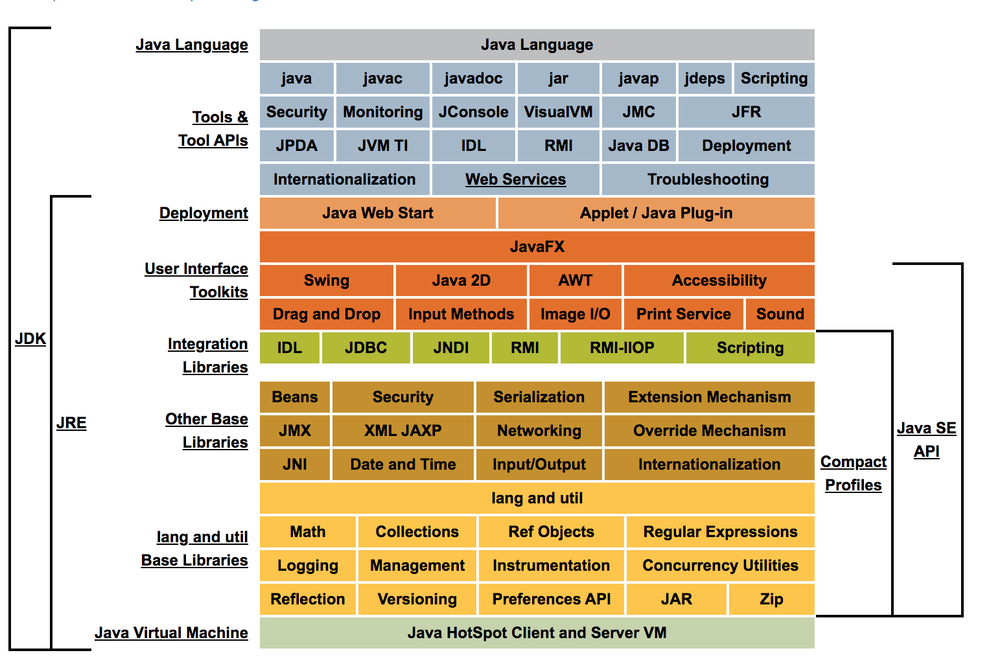
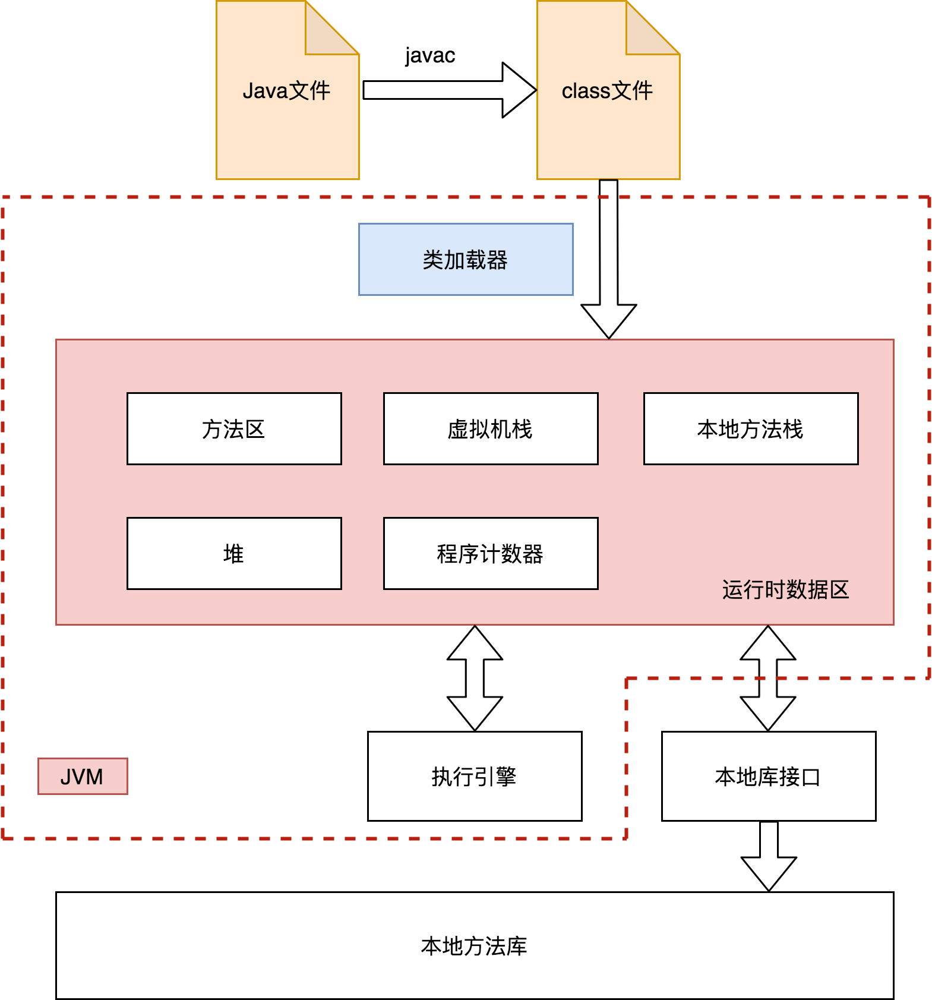
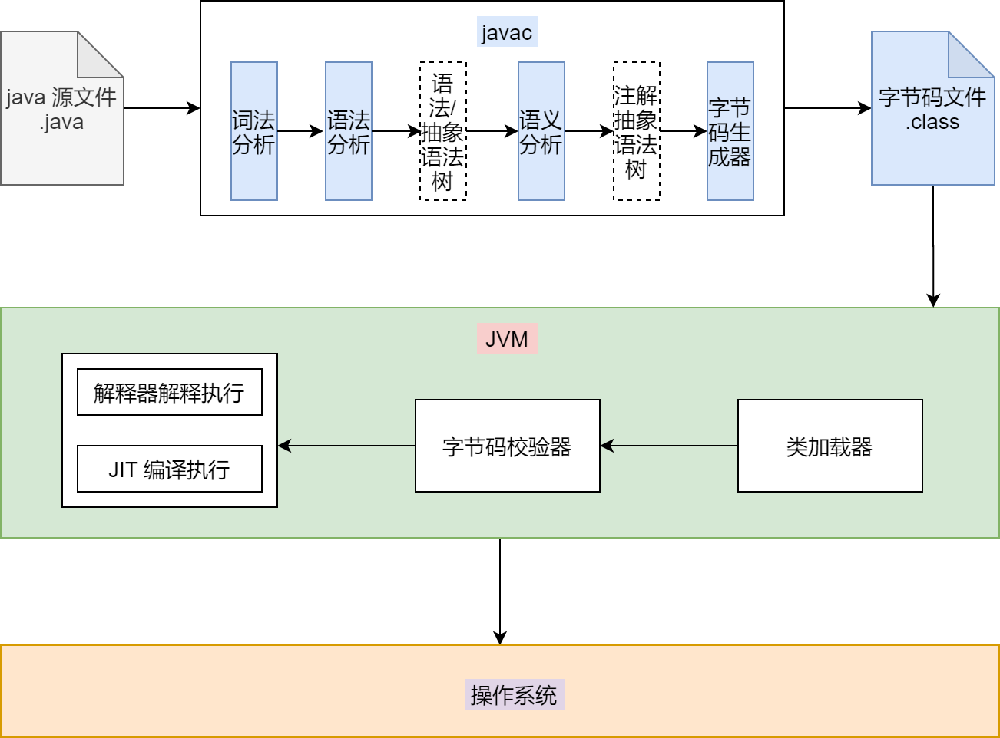

[TOC]
# JVM
## Java体系结构



### JVM

Java虚拟机（Java Virtual Machine）是Java程序的运行环境（Java二进制字节码的运行环境）。

Java虚拟机与Java语言并没有必然的联系，它只与特定的二进制文件格式——Class文件（字节码文件）格式所关联，Class 文件中包含了Java虚拟机指令集（或者称为字节码、Bytecodes）和符号表，还有一些其他辅助信息。Scala和Kotlin等语言编译成字节码文件后也能在JVM上运行。

- 一次编译 ，到处运行；
- 自动内存管理；
- 自动垃圾回收功能。

Java 是跨平台的，JVM 不是跨平台的。


### JRE

JRE（java runtime environment）是 java 运行时环境，包含了 JVM 和 java 核心基础类库（JDBC，lang and util）。


### JDK

JDK（java development kit）是 java 开发运行环境，包含了 JRE，同时还包含了编译 java 源码的 javac （或称为前端编译器）和用于 java 程序调试分析的工具（JConsole，visualVM等）等。


## 指令集架构

Java编译器输入的指令流基本上是一种**基于栈的指令集架构**，另外一种指令集架构则是**基于寄存器的指令集架构**（如传统的PC以及Android的Davlik虚拟机）。

在大部分情况下，基于寄存器架构的指令集往往都以一地址指令、二地址指令和三地址指令为主，而基于栈式架构的指令集却是以零地址指令为主。

由于跨平台性的设计，Java的指令都是根据栈来设计的。不同平台CPU架构不同，所以不能设计为基于寄存器的。


### 两种架构之间区别

- **基于栈式架构的特点**
	
  - 设计和实现更简单，适用于资源受限的系统；
  - 使用零地址指令方式分配；
  - 指令集小，同样的操作需要的指令多，性能不如寄存器；
  - 可移植性更好，更好实现跨平台。
	
- **基于寄存器架构的特点**

  - 完全依赖硬件，可移植性差；
  - 性能优秀、执行更高效:
  - 花费更少的指令去完成一项操作。


### 示例

执行 2+3 逻辑操作

- 基于栈式架构

```
iconst_2 //常量2入栈
istore_1
iconst_3 // 常量3入栈
istore_2
iload_1 //常量2和3出栈，执行相加
iload_2
iadd 
istore_0 // 结果5入栈
```


- 基于寄存器架构

```
mov eax,2 //将eax寄存器的值设为2
add eax,3 //使eax寄存器的值加3
```


##  生命周期

### 虚拟机的启动

JVM的启动是通过引导类加载器（bootstrap classloader）创建一个初始类（initial class）来完成的，这个类是由虚拟机的具体实现指定的。


### 虚拟机的执行

一个运行中的JVM有着一个清晰的任务：执行程序。程序开始执行时JVM运行，程序结束时JVM停止。执行程序时，实际执行的是一个叫做JVM的进程。


### 虚拟机的退出

- 程序正常执行结束；
- 程序在执行过程中遇到了异常或错误而异常终止；
- 由于操作系统出现错误而导致Java虚拟机进程终止；
- 某线程调用Runtime类或System类的exit方法，或Runtime类的halt方法，并且Java安全管理器也允许这次exit或halt操作；
- 除此之外，JNI ( Java Native Interface) 规范描述了用JNI Invocation API来加载或卸载Java虛 拟机时，Java虚拟机的退出情况。

## 系统
### 系统组件
#### 类加载系统
类加载系统（Classloader Sub-System）除了要定位和导入二进制class文件外，还负责验证被导入类的正确性，为类变量分配并初始化内存，以及帮助解析符号引用。 

#### 执行引擎
执行引擎（Execution Engine）负责执行那些包含在被装载类的方法中的指令。 
    
#### 运行时数据区
运行时数据区（Java Memory Allocation Area）又叫虚拟机内存或者Java内存，虚拟机运行时需要从整个计算机内存划分一块内存区域存储许多东西。例如：字节码、从已装载的class文件中得到的其他信息、程序创建的对象、传递给方法的参数，返回值、局部变量等等。

##### 本地接口
本地接口JNI（Java Native interface）的作用是融合不同的编程语言为Java所用，初衷是融合C/C++程序，于是就在内存中专门开辟了一块区域处理标记为native的代码，具体做法是在Native Method Stack中登记native方法，在执行引擎执行时加载native libraries。
 目前该方法使用的越来越少了，除非是与硬件有关的应用，比如通过Java程序驱动打印机或者Java系统管理生产设备，在企业级应用中已经比较少见。因为现在的异构领域间的通信很发达，比如可以使用Socket通信，也可以使用Web Service等。

##### 本地方法栈
本地方法栈（Native Method Stack）的具体做法是Native Method Stack中登记native方法，在执行引擎执行时加载本地方法库。

##### 程序计数器
程序计数器（Program Count Register）是线程执行时创建的，线程私有的，就是一个指针，指向方法区中的方法字节码（用来存储指向下一条指令的地址，也即将要执行的指令代码），由执行引擎读取下一条指令，是一个非常小的内存空间，几乎可以忽略不记。

##### 方法区
方法区（Method Area）是被所有线程共享，所有字段和方法字节码，以及一些特殊方法如构造函数，接口代码也在此定义。简单说，所有定义的方法的信息都保存在该区域，此区属于共享区间。静态变量、常量、类信息(构造方法/接口定义)、运行时常量池存在方法区中，实例变量存在堆内存中，和方法区无关。

###### 栈
栈（Stack）也叫栈内存，主管Java程序的运行，是在线程创建时创建，它的生命期是跟随线程的生命期，线程结束栈内存也就释放，对于栈来说不存在垃圾回收问题，只要线程一结束该栈就Over，生命周期和线程一致，是线程私有的。8种基本类型的变量、对象的引用变量、实例方法都是在函数的栈内存中分配。

栈帧中主要保存3类数据：
- 本地变量（Local Variables）：输入参数和输出参数以及方法内的变量；
- 栈操作（Operand Stack）：记录出栈、入栈的操作；
- 栈帧数据（Frame Data）：包括类文件、方法等等。

栈中的数据都是以栈帧（Stack Frame）的格式存在，栈帧是一个内存区块，是一个数据集，是一个有关方法和运行时数据的数据集，遵循先进后出原则。
    
#### 垃圾回收器
垃圾回收器（Garbage Collection）负责回收堆内存（Heap）中没有被使用的对象。 
             


### 系统线程
线程是一个程序里的运行单元。JVM允许一个应用有多个线程并行的执行。

在Hotspot JVM里，每个线程都与操作系统的本地线程直接映射。当一个Java线程准备好执行以后，对应的操作系统的本地线程也同时创建。Java线程执行终止后，本地线程也会回收。操作系统负责所有线程的安排调度到任何一个可用的CPU上。一旦本地线程初始化成功，它就会调用Java线程中的run()方法。

使用jconsole或者是任何一个调试工具，都能看到在后台有许多线程在运行。这些后台线程不包括调用main方法创建的main线程以及所有这个main线程创建的线程。这些后台系统线程在Hotspot JVM里主要是以下几个：

- 虚拟机线程：在JVM达到安全点时出现，因为在JVM达到安全点时，堆才不会变化。其执行类型包括“stop-the-world”的垃圾收集，线程栈收集，线程挂起以及偏向锁撤销；
- 周期任务线程：时间周期事件的体现（比如中断），一般用于周期性操作的调度执行；
- GC 线程：对在JVM里不同种类的垃圾收集行为提供了支持；
- 编译线程：在运行时会将字节码编译成到本地代码；
- 信号调度线程：接收信号并发送给JVM，在内部通过调用适当的方法进行处理。


## 发展历程

### Classic VM

早在1996年Java1.0版本的时候，Sun公司发布了一款名为Sun Classic VM的Java虚拟机，它同时也是世界上第一款商用Java虚拟机，JDK1.4时完全被淘汰。

这款虚拟机内部只提供解释器。如果使用JIT编译器，就需要进行外挂。但是一旦使用了JIT编译器，JIT就会接管虚拟机的执行系统。解释器就不再工作。解释器和编译器不能配合工作。现在hotspot内置了此虚拟机。


### Exact VM

为了解决上一个虚拟机问题，jdk1.2时，sun提供了此虚拟机。Exact Memory Management:准确式内存管理

- 也可以叫Non-Conservative/Accurate Memory Management
- 虚拟机可以知道内存中某个位置的数据具体是什么类型。

具备现代高性能虚拟机的雏形

- 热点探测
- 编译器与解释器混合工作模式

只在Solaris平台短暂使用，其他平台上还是classic vm

- 英雄气短，终被Hotspot虚拟机替换


### HotSpot VM

HotSpot历史

- 最初由一家名为“Longview Technologies"的小公司设计
- 1997年，此公司被Sun收购; 2009年，Sun公司被甲骨文收购。
- JDK1.3时，HotSpot VM成为默认虚拟机

目前Hotspot占有绝对的市场地位称霸武林。

- 不管是现在仍在广泛使用的JDK6，还是使用比例较多的JDK8中，默认的虚拟机都是HotSpot
- Sun/Oracle JDK和OpenJDK的默认虚拟机
- 因此本课程中默认介绍的虚拟机都是Hotspot，相关机制也主要是指HotSpot的GC机制。(比如其他两个商用虛拟机都没有方法区的概念)

从服务器、桌面到移动端、嵌入式都有应用。

名称中的HotSpot指的就是它的热点代码探测技术。

- 通过计数器找到最具编译价值代码，触发即时编译或栈上替换

- 通过编译器与解释器协同工作，在最优化的程序响应时间与最佳执行性能中取得平衡

    

### JRockit

- 专注于服务器端应用
	- 它可以不太关注程序启动速度，因此JRockit内部不包含解析器实现，全部代码都靠即时编译器编译后执行。
- 大量的行业基准测试显示，JRockit JVM是世界上最快的JVM。
	- 使用JRockit产品，客户已经体验到了显著的性能提高(一些超过了70%)和硬件成本的减少(达50%) 。
- 优势：全面的Java运行时解决方案组合
	- JHlockit面向延迟敏感型应用的解决方案JRockit Real Time提供以亳秒或
		微秒级的JVM响应时间，适合财务、军事指挥、电信网络的需要
	- MissionContro1服务套件，它是一组以极低的开销来监控、管理和分析生产
		环境中的应用程序的工具。
- 2008年，BEA被Oracle收购。
- Oracle表达了整合两大优秀虚拟机的工作，大致在JDK 8中完成。整合的方式是在Hotspot的基础上，移植JRockit的优秀特性。
- 高斯林：目前就职于谷歌，研究人工智能和水下机器人


### J9

- 全称: IBM Technology for Java Virtual Machine，简称IT4J，内部代号: J9
- 市场定位与Hotspot接近，服务器端、桌面应用、嵌入式等多用途VM
- 广泛用于IBM的各种Java产品。
- 目前，有影响力的三大商用虚拟机之一，也号称是世界上最快的Java虚拟机。
- 2017年左右，IBM发布了开源J9 VM，命名为openJ9，交给Eclipse基金会管理，也称为Eclipse OpenJ9


## 整体架构




## Java执行流程




# 调优

## 参考资料

- []()
- []()
- []()
- []()
- []()
- []()
- [官方文档-工具和命令参考](https://docs.oracle.com/en/java/javase/11/tools/tools-and-command-reference.html)
- [JVM--参数调优](https://www.cnblogs.com/aspirant/p/11799461.html)