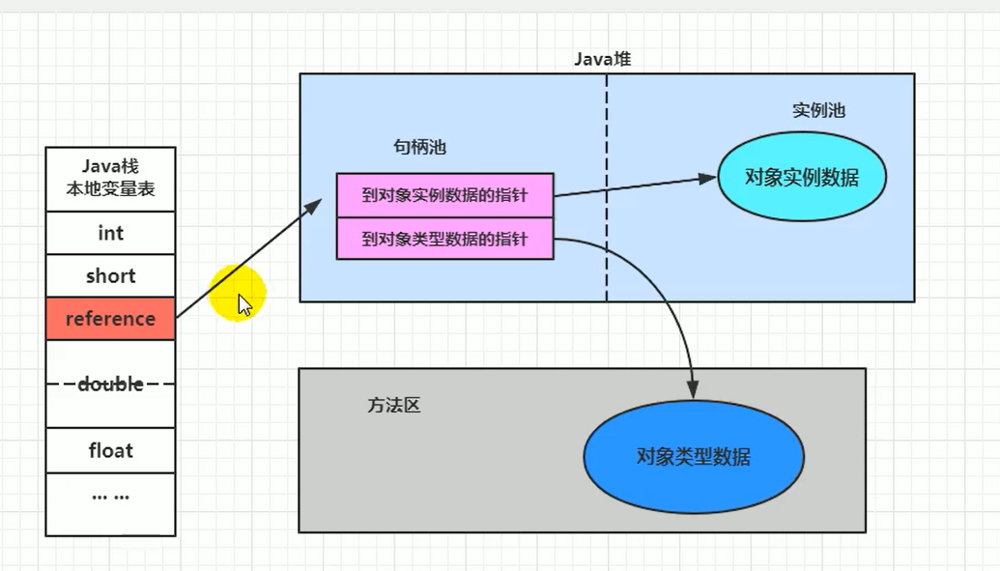
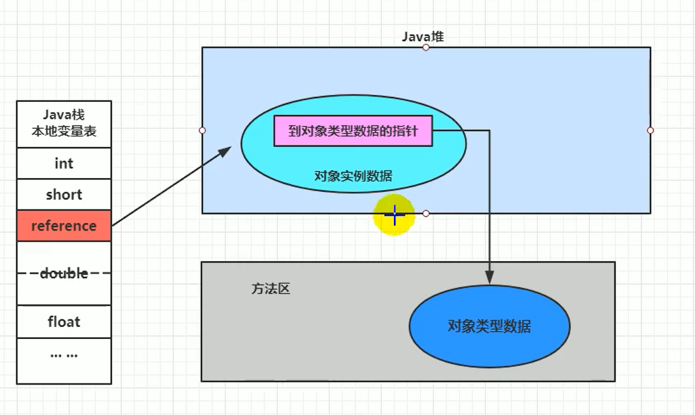

# 对象实例化
## 创建对象方式
- new：最常见的方式，单例类中调用getInstance的静态类方法，XXXFactory的静态方法；
- Class类的newInstance方法：反射的方式，在 JDK9 里面被标记为过时，因为只能调用空参构造器，权限必须是public；
- Constructor的newInstance(XXX)：反射的方式，可以调用空参、带参的构造器，权限没有要求；
- 使用clone()：不调用任何的构造器，要求当前类需要实现Cloneable接口中的clone()方法；
- 使用反序列化：反序列化一般用于Socket的网络传输，从文件中、从网络中获取一个对象的二进制流；
- 第三方库Objenesis。


## 创建对象步骤
1. 加载类元信息
2. 为对象分配内存
3. 处理并发问题
4. 属性的默认初始化（零值初始化）
5. 设置对象头信息
6. 属性的显示初始化、代码块中初始化、构造器中初始化

### 判断对象对应的类是否加载、链接、初始化
虚拟机遇到一条new指令，首先去检查这个指令的参数能否在Metaspace的常量池中定位到一个类的符号引用，并且检查这个符号引用代表的类是否已经被加载、解析和初始化。即判断类元信息是否存在。

如果没有，那么在双亲委派模式下，使用当前类加载器以“ClassLoader+包名+类名”为key进行查找对应的.class文件，如果没有找到文件，则抛出ClassNotFoundException异常，如果找到则进行类加载，并生成对应的Class类对象。

### 为对象分配内存
先计算对象占用空间大小，接着在堆中划分一块内存给新对象。如果实例成员变量是引用变量，仅分配引用变量空间即可，即4个字节大小。

#### 如果内存规整：指针碰撞
如果内存是规整的，那么虚拟机将采用的是指针碰撞法（Bump The Point）来为对象分配内存。即所有用过的内存在一边，空闲的内存放另外一边，中间放着一个指针作为分界点的指示器，分配内存就是把指针指向空闲那边挪动一段与对象大小相等的距离。

#### 如果内存不规整
如果内存不是规整的，已使用的内存和未使用的内存相互交错，那么虚拟机将采用的是空闲列表（Free List）来为对象分配内存。即虚拟机维护了一个空闲列表，记录可用内存块，分配时从列表中找到一块足够大的空间划分给对象实例，并更新列表上的内容。

选择哪种分配方式由Java堆是否规整所决定，而Java堆是否规整又由所采用的垃圾收集器是否带有压缩整理功能决定。

### 处理并发问题
虚拟机采用了两种方式解决频繁创建对象分配内存空间时的并发问题：
- 通过CAS（ Compare And Swap ）失败重试和区域加锁保证指针更新操作的原子性；

- 通过TLAB（Thread Local Allocation Buffer）把内存分配的动作按照线程划分在不同的空间之中进行，即每个线程在Java堆中的Eden区预先分配一小块内存，称为本地线程分配缓冲区。通过UseTLAB参数来设定虚拟机是否使用TLAB(jdk8后默认开启)。

### 初始化分配到的内存空间.
属性的默认初始化，即给对象的成员变量赋予默认值，保证该成员变量不用显示赋值仍可直接使用。

### 设置对象的对象头.
将对象的所属类（即类的元数据信息）、对象的HashCode和对象的GC信息和锁信息等数据存储在对象的对象头中，具体设置方式取决于JVM实现。

> 数据对象 = 数据内容 + 元数据（描述数据的数据）

### 执行init方法进行初始化
先进行属性的显式初始化、代码块中的初始化，两者依据代码中的顺序先后初始化；在进行构造器初始化。


### 示例
```java
public class InstanceClass {
    // 加载完成后会0值初始化code的值为0，codeLabel的值为null
    private int code;
    private String codeLabel;
    // 显示初始化属性name的值为“instanceClass”
    private String name = "instanceClass";
    
    {
        this.code = 0;
    }
    
    public InstanceClass() {
        this.code = 1;
    }
}
```

1. new对象时，比如`InstanceClass instance = new InstanceClass()`会声明一个InstanceClass类型的引用，JVM首先去检查InstanceClass这个符号引用所代表的类是否已经被加载过，如果没有就要执行对应类的加载过程；
2. 类加载完成以后，对象所需的内存大小其实就已经确定下来了，接下来JVM就会在堆上为对象分配内存；
3. 属性“0”值初始化即为实例化对象的各个属性赋上默认初始化“0”值，比如int的初始化0值就是0，对象的初始化0值就是null；
5. 接下来JVM会进行对象头的设置，主要包括对象的运行时元数据（比如Hash码、GC分代年龄、锁状态标志、锁指针、偏向线程ID、偏向时间戳等）以及类型指针（JVM通过该类型指针来确定该对象是哪个类的实例）；
6. 属性的显示初始化即针对某个属性字段手动的赋值；
7. 最后是调用类的构造方法来进行进行构造方法内的初始化动作。

## 对象内存布局
### 对象头
1. 对象头（Header）

> 如果是数组，还需要记录数组的长度

#### 运行时元数据
- Hash码（HashCode）：对象的首地址值，换成哈希以免查找耗时；
- GC分代年龄：年龄计数器age，达到16就进入老年代；
- 锁状态标志
- 线程持有的锁
- 偏向线程ID
- 偏向时间戳

#### 类型指针
指向类元数据，确定该对象所属的类型，指向的其实是方法区中存放的类元信息。并不是所有的对象都会保留类型指针。

### 实例数据
实例数据（Instance Data）是对象真正存储的有效信息，包括程序代码中定义的各种类型的字段（包括从父类继承下来的和本身拥有的字段）。
    
#### 规则
- 父类中定义的变量会出现在子类之前；
- 相同宽度的字段总是被分配在一起；
- 如果 CompactFields 参数为 true（默认为 true）：字类的窄变量可能插入到父类变量的空隙。
  
### 对齐填充
对齐填充（Padding），不是必须的，也没有特别的含义，仅仅起到占位符的作用。

## 对象访问定位
JVM有两种方式通过栈帧中的对象引用访问到其内部的对象实例，分别是句柄访问和直接指针访问。

### 句柄访问



句柄访问就是说栈的局部变量表中，记录的对象的引用，然后在堆空间中开辟了一块空间，也就是句柄池。
优点在于reference中存储稳定句柄地址，对象被移动（垃圾收集时移动对象很普遍）时只会改变句柄中实例数据指针，reference本身不需要被修改。

### 直接指针



直接指针是局部变量表中的引用直接指向堆中的实例，在对象实例中有类型指针，指向的是方法区中的对象类型数据。此时如果堆中对象的位置改变，那么reference也要跟着改变，如 “垃圾回收相关算法”中的复制算法。

hotspot JVM采用的就是直接指针的方式访问对象实例。

## 相关命令
### TLAB区配置
- -XX:+UseTLAB

表示使用TLAB

- -XX:-UseTLAB

表示不使用TLAB

- -XX:+TLABSize

表示设置TLAB大小

- -XX:TLABRefillWasteFraction

表示设置进入TLAB空间，单个对象大小。是一个比例值，默认为64。如果对象小于整个空间的1/64，则放在TLAB区，如果对象大于整个空间的1/64，则放在堆区。

- -XX:+PrintTLAB

表示查看TLAB信息

- -XX:ResizeTLAB

表示自动调整TLABRefillWasteFraction阈值


## 参考资料
- [【JVM之内存与垃圾回收篇】对象实例化内存布局与访问定位](https://www.cnblogs.com/blknemo/p/13296019.html)