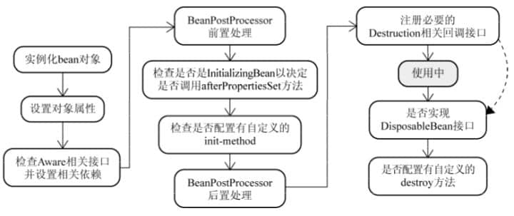
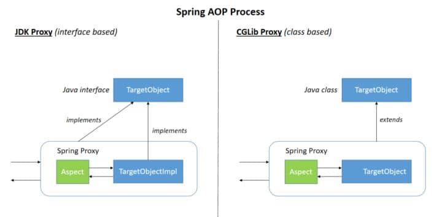
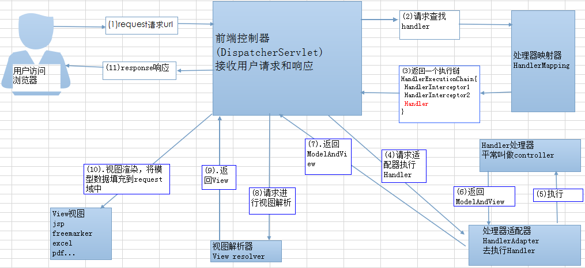
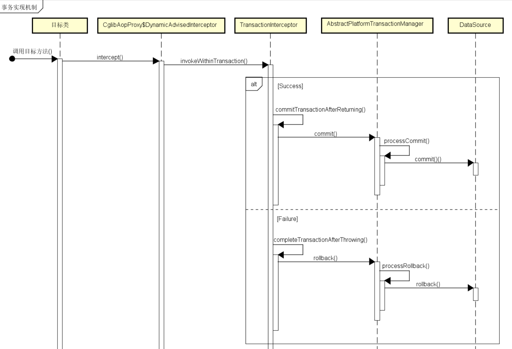
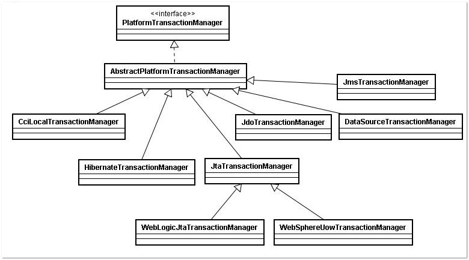

# Spring

Spring 是一种轻量级开发框架，旨在提高开发人员的开发效率以及系统的可维护性。


## Spring组成

Spring框架至今已集成了20多个模块，这些模块分布在以下模块中：

- 核心容器（Core Container）
- 数据访问/集成（Data Access/Integration）层
- Web层
- AOP（Aspect Oriented Programming）模块
- 植入（Instrumentation）模块
- 消息传输（Messaging）
- 测试（Test）模块


| 组成部分                      | 概述                                                         |
| ----------------------------- | ------------------------------------------------------------ |
| Core                          | 提供了框架的基本组成部分，包括控制反转（Inversion of Control，IOC）和依赖注入（Dependency Injection，DI）功能。 |
| Beans                         | 提供了BeanFactory，是工厂模式的一个经典实现，Spring将管理对象称为Bean。 |
| Context                       | 建立在Core和Beans模块的基础之上，提供一个框架式的对象访问方式，是访问定义和配置的任何对象的媒介。ApplicationContext接口是Context模块的焦点。 |
| Context-Support               | 持整合第三方库到Spring应用程序上下文，特别是用于高速缓存（EhCache、JCache）和任务调度（CommonJ、Quartz）的支持。 |
| Expression                    | 提供了强大的表达式语言去支持运行时查询和操作对象图。这是对JSP2.1规范中规定的统一表达式语言（Unified EL）的扩展。该语言支持设置和获取属性值、属性分配、方法调用、访问数组、集合和索引器的内容、逻辑和算术运算、变量命名以及从Spring的IOC容器中以名称检索对象。它还支持列表投影、选择以及常用的列表聚合。 |
| AOP                           | 提供了一个符合AOP要求的面向切面的编程实现，允许定义方法拦截器和切入点，将代码按照功能进行分离，以便干净地解耦。 |
| Aspects                       | 提供了与AspectJ的集成功能，AspectJ是一个功能强大且成熟的AOP框架。 |
| Instrument                    | 提供了类植入（Instrumentation）支持和类加载器的实现，可以在特定的应用服务器中使用。 |
| Messaging                     | 该模块提供了对消息传递体系结构和协议的支持。                 |
| JDBC                          | 提供了一个JDBC的抽象层，消除了烦琐的JDBC编码和数据库厂商特有的错误代码解析。 |
| orm                           | 为流行的对象关系映射（Object-Relational Mapping）API提供集成层，包括JPA和Hibernate。使用Spring-orm模块可以将这些O/R映射框架与Spring提供的所有其他功能结合使用，例如声明式事务管理功能。 |
| oxm                           | 提供了一个支持对象/XML映射的抽象层实现，例如JAXB、Castor、JiBX和XStream。 |
| jms（Java Messaging Service） | 指Java消息传递服务，包含用于生产和使用消息的功能。自Spring4.1以后，提供了与Spring-messaging模块的集成。 |
| tx                            | 支持用于实现特殊接口和所有POJO（普通Java对象）类的编程和声明式事务管理。 |
| web                           | 提供了基本的Web开发集成功能，例如多文件上传功能、使用Servlet监听器初始化一个IOC容器以及Web应用上下文。 |
| webmvc                        | 也称为Web-Servlet模块，包含用于web应用程序的Spring MVC和REST Web Services实现。Spring MVC框架提供了领域模型代码和Web表单之间的清晰分离，并与Spring Framework的所有其他功能集成。 |
| websocket                     | Spring4.0以后新增的模块，它提供了WebSocket和SocketJS的实现。 |
| Portlet                       | （已废弃）类似于Servlet模块的功能，提供了Portlet环境下的MVC实现。 |
| Spring-test                   | 支持使用JUnit或TestNG对Spring组件进行单元测试和集成测试。    |


## 设计模式

- **工厂设计模式** : Spring使用工厂模式通过 `BeanFactory`、`ApplicationContext` 创建 bean 对象。
- **代理设计模式** : Spring AOP 功能的实现。
- **单例设计模式** : Spring 中的 Bean 默认都是单例的。
- **包装器设计模式** : 我们的项目需要连接多个数据库，而且不同的客户在每次访问中根据需要会去访问不同的数据库。这种模式让我们可以根据客户的需求能够动态切换不同的数据源。
- **观察者模式:** Spring 事件驱动模型就是观察者模式很经典的一个应用。
- **适配器模式** :Spring AOP 的增强或通知(Advice)使用到了适配器模式、spring MVC 中也是用到了适配器模式适配`Controller`。


### 工厂模式

Spring使用工厂模式可以通过 `BeanFactory` 或 `ApplicationContext` 创建 bean 对象。

**两者对比：**

- `BeanFactory` ：延迟注入(使用到某个 bean 的时候才会注入),相比于`BeanFactory`来说会占用更少的内存，程序启动速度更快。
- `ApplicationContext` ：容器启动的时候，不管你用没用到，一次性创建所有 bean 。`BeanFactory` 仅提供了最基本的依赖注入支持，`ApplicationContext` 扩展了 `BeanFactory` ,除了有`BeanFactory`的功能还有额外更多功能，所以一般开发人员使用`ApplicationContext`会更多。

ApplicationContext的三个实现类：

1. `ClassPathXmlApplication`：把上下文文件当成类路径资源。
2. `FileSystemXmlApplication`：从文件系统中的 XML 文件载入上下文定义信息。
3. `XmlWebApplicationContext`：从Web系统中的XML文件载入上下文定义信息。


### 代理模式

AOP(Aspect-Oriented Programming:面向切面编程)能够将那些与业务无关，却为业务模块所共同调用的逻辑或责任（例如事务处理、日志管理、权限控制等）封装起来，便于减少系统的重复代码，降低模块间的耦合度，并有利于未来的可拓展性和可维护性。

**Spring AOP 就是基于动态代理的**，如果要代理的对象，实现了某个接口，那么Spring AOP会使用**JDK Proxy**，去创建代理对象，而对于没有实现接口的对象，就无法使用 JDK Proxy 去进行代理了，这时候Spring AOP会使用**Cglib** ，这时候Spring AOP会使用 **Cglib** 生成一个被代理对象的子类来作为代理，如下图所示：


### 单例模式

在我们的系统中，有一些对象其实我们只需要一个，比如说：线程池、缓存、对话框、注册表、日志对象、充当打印机、显卡等设备驱动程序的对象。事实上，这一类对象只能有一个实例，如果制造出多个实例就可能会导致一些问题的产生，比如：程序的行为异常、资源使用过量、或者不一致性的结果。


**使用单例模式的好处:**

- 对于频繁使用的对象，可以省略创建对象所花费的时间，这对于那些重量级对象而言，是非常可观的一笔系统开销；
- 由于 new 操作的次数减少，因而对系统内存的使用频率也会降低，这将减轻 GC 压力，缩短 GC 停顿时间。


**Spring 实现单例的方式：**

- xml:<bean id="userService" class="top.snailclimb.UserService" scope="singleton"/>``
- 注解：`@Scope(value = "singleton")`


Spring 通过 `ConcurrentHashMap` 实现单例注册表的特殊方式实现单例模式。Spring 实现单例的核心代码如下：

```java
// 通过 ConcurrentHashMap（线程安全） 实现单例注册表
private final Map<String, Object> singletonObjects = new ConcurrentHashMap<String, Object>(64);

public Object getSingleton(String beanName, ObjectFactory<?> singletonFactory) {
        Assert.notNull(beanName, "'beanName' must not be null");
        synchronized (this.singletonObjects) {
            // 检查缓存中是否存在实例  
            Object singletonObject = this.singletonObjects.get(beanName);
            if (singletonObject == null) {
                //...省略了很多代码
                try {
                    singletonObject = singletonFactory.getObject();
                }
                //...省略了很多代码
                // 如果实例对象在不存在，我们注册到单例注册表中。
                addSingleton(beanName, singletonObject);
            }
            return (singletonObject != NULL_OBJECT ? singletonObject : null);
        }
    }
    //将对象添加到单例注册表
    protected void addSingleton(String beanName, Object singletonObject) {
            synchronized (this.singletonObjects) {
                this.singletonObjects.put(beanName, (singletonObject != null ? singletonObject : NULL_OBJECT));

            }
        }
}
```


### 模板方法

模板方法模式是一种行为设计模式，它定义一个操作中的算法的骨架，而将一些步骤延迟到子类中。 模板方法使得子类可以不改变一个算法的结构即可重定义该算法的某些特定步骤的实现方式。

Spring 中 `jdbcTemplate`、`hibernateTemplate` 等以 Template 结尾的对数据库操作的类，它们就使用到了模板模式。一般情况下，我们都是使用继承的方式来实现模板模式，但是 Spring 并没有使用这种方式，而是使用Callback 模式与模板方法模式配合，既达到了代码复用的效果，同时增加了灵活性。


### 观察者模式

观察者模式是一种对象行为型模式。它表示的是一种对象与对象之间具有依赖关系，当一个对象发生改变的时候，这个对象所依赖的对象也会做出反应。

Spring 事件驱动模型就是观察者模式很经典的一个应用。


#### Spring驱动模型

##### 三种角色

###### 事件角色

`ApplicationEvent` (`org.springframework.context`包下)充当事件的角色,这是一个抽象类，它继承了`java.util.EventObject`并实现了 `java.io.Serializable`接口。

Spring 中默认存在以下事件，他们都是对 `ApplicationContextEvent` 的实现(继承自`ApplicationContextEvent`)：

- `ContextStartedEvent`：`ApplicationContext` 启动后触发的事件;
- `ContextStoppedEvent`：`ApplicationContext` 停止后触发的事件;
- `ContextRefreshedEvent`：`ApplicationContext` 初始化或刷新完成后触发的事件;
- `ContextClosedEvent`：`ApplicationContext` 关闭后触发的事件。


###### 事件监听者角色

`ApplicationListener` 充当了事件监听者角色，它是一个接口，里面只定义了一个 `onApplicationEvent（）`方法来处理`ApplicationEvent`。`ApplicationListener`接口类源码如下，可以看出接口定义看出接口中的事件只要实现了 `ApplicationEvent`就可以了。所以，在 Spring中我们只要实现 `ApplicationListener` 接口实现 `onApplicationEvent()` 方法即可完成监听事件。


###### 事件发布者角色

`ApplicationEventPublisher` 充当了事件的发布者，它也是一个接口。

`ApplicationEventPublisher` 接口的`publishEvent（）`这个方法在`AbstractApplicationContext`类中被实现，阅读这个方法的实现，你会发现实际上事件真正是通过`ApplicationEventMulticaster`来广播出去的。


##### 事件流程总结

1. 定义一个事件: 实现一个继承自 `ApplicationEvent`，并且写相应的构造函数；
2. 定义一个事件监听者：实现 `ApplicationListener` 接口，重写 `onApplicationEvent()` 方法；
3. 使用事件发布者发布消息: 可以通过 `ApplicationEventPublisher` 的 `publishEvent()` 方法发布消息。


```java
// 定义一个事件,继承自ApplicationEvent并且写相应的构造函数
public class DemoEvent extends ApplicationEvent{
    private static final long serialVersionUID = 1L;

    private String message;

    public DemoEvent(Object source,String message){
        super(source);
        this.message = message;
    }

    public String getMessage() {
         return message;
          }


// 定义一个事件监听者,实现ApplicationListener接口，重写 onApplicationEvent() 方法；
@Component
public class DemoListener implements ApplicationListener<DemoEvent>{

    //使用onApplicationEvent接收消息
    @Override
    public void onApplicationEvent(DemoEvent event) {
        String msg = event.getMessage();
        System.out.println("接收到的信息是："+msg);
    }

}
// 发布事件，可以通过ApplicationEventPublisher  的 publishEvent() 方法发布消息。
@Component
public class DemoPublisher {

    @Autowired
    ApplicationContext applicationContext;

    public void publish(String message){
        //发布事件
        applicationContext.publishEvent(new DemoEvent(this, message));
    }
}
```


当调用 `DemoPublisher` 的 `publish()` 方法的时候，比如 `demoPublisher.publish("你好")` ，控制台就会打印出:`接收到的信息是：你好` 。


### 适配器模式

适配器模式(Adapter Pattern) 将一个接口转换成客户希望的另一个接口，适配器模式使接口不兼容的那些类可以一起工作，其别名为包装器(Wrapper)。


#### Spring AOP

Spring AOP 的实现是基于代理模式，但是 Spring AOP 的增强或通知(Advice)使用到了适配器模式，与之相关的接口是`AdvisorAdapter` 。Advice 常用的类型有：`BeforeAdvice`（目标方法调用前,前置通知）、`AfterAdvice`（目标方法调用后,后置通知）、`AfterReturningAdvice`(目标方法执行结束后，return之前)等等。每个类型Advice（通知）都有对应的拦截器:`MethodBeforeAdviceInterceptor`、`AfterReturningAdviceAdapter`、`AfterReturningAdviceInterceptor`。Spring预定义的通知要通过对应的适配器，适配成 `MethodInterceptor`接口(方法拦截器)类型的对象（如：`MethodBeforeAdviceInterceptor` 负责适配 `MethodBeforeAdvice`）。


#### Spring MVC

在Spring MVC中，`DispatcherServlet` 根据请求信息调用 `HandlerMapping`，解析请求对应的 `Handler`。解析到对应的 `Handler`（也就是我们平常说的 `Controller` 控制器）后，开始由`HandlerAdapter` 适配器处理。`HandlerAdapter` 作为期望接口，具体的适配器实现类用于对目标类进行适配，`Controller` 作为需要适配的类。

Spring MVC 中的 `Controller` 种类众多，不同类型的 `Controller` 通过不同的方法来对请求进行处理。如果不利用适配器模式的话，`DispatcherServlet` 直接获取对应类型的 `Controller`，需要的自行来判断。


### 装饰者模式

装饰者模式可以动态地给对象添加一些额外的属性或行为。相比于使用继承，装饰者模式更加灵活。简单点儿说就是当我们需要修改原有的功能，但我们又不愿直接去修改原有的代码时，设计一个Decorator套在原有代码外面。

在 JDK 中就有很多地方用到了装饰者模式，比如 `InputStream`家族，`InputStream` 类下有 `FileInputStream` (读取文件)、`BufferedInputStream` (增加缓存,使读取文件速度大大提升)等子类都在不修改`InputStream` 代码的情况下扩展了它的功能。

Spring 中用到的包装器模式在类名上含有 `Wrapper`或者 `Decorator`。这些类基本上都是动态地给一个对象添加一些额外的职责。


## 总结

### 缺点

Spring的配置是重量级的，需要大量的XML配置。


# Spring Core

## IOC和DI

IoC（Inverse of Control:控制反转）是一种**设计思想**，就是 **将原本在程序中手动创建对象的控制权，交由Spring框架来管理。** IoC 在其他语言中也有应用，并非 Spring 特有。 **IoC 容器是 Spring 用来实现 IoC 的载体， IoC 容器实际上就是个Map（key，value）,Map 中存放的是各种对象。**

 **IoC 容器就像是一个工厂一样，当我们需要创建一个对象的时候，只需要配置好配置文件/注解即可，完全不用考虑对象是如何被创建出来的。**


### 容器对象
`Spring` 容器对象有 `ApplicationContext` 和 `BeanFactory`，`ApplicationContext` 包含 `BeanFactory` 的所有功能，建议优先使用 `ApplicationContext`。


#### FactoryBean
一般情况下，Spring通过反射机制利用<bean>的class属性指定实现类实例化Bean，在某些情况下，实例化Bean过程比较复杂，如果按照传统的方式，则需要在<bean>中提供大量的配置信息。配置方式的灵活性是受限的，这时采用编码的方式可能会得到一个简单的方案。Spring为此提供了一个org.springframework.bean.factory.FactoryBean的工厂类接口，用户可以通过实现该接口定制实例化Bean的逻辑。FactoryBean接口对于Spring框架来说占用重要的地位，Spring自身就提供了70多个FactoryBean的实现。

```java
@Service
public class DefaultFactoryBean implements FactoryBean<SchoolBean> {
    private String name = "default factory bean";

    @Override
    public SchoolBean getObject() {
        return new SchoolBean(1L, "第一中学");
    }

    @Override
    public Class<?> getObjectType() {
        return SchoolBean.class;
    }
}
```

##### 源码解析
```java
public interface FactoryBean<T> {
    String OBJECT_TYPE_ATTRIBUTE = "factoryBeanObjectType";
    
    /**
     * 返回由FactoryBean创建的Bean实例，
     * 如果isSingleton()返回true，则该实例会放到Spring容器中单实例缓存池中；
     */
    @Nullable
    T getObject() throws Exception;
    
    /**
     * 返回FactoryBean创建的Bean类型。
     */
    @Nullable
    Class<?> getObjectType();
    
    /**
     * 返回由FactoryBean创建的Bean实例的作用域是singleton还是prototype
     */
    default boolean isSingleton() {
        return true;
    }
}
```

#### BeanFactory
BeanFactory是IOC容器的核心接口，它的职责包括：实例化、定位、配置应用程序中的对象及建立这些对象间的依赖。BeanFactory只是个接口，并不是IOC容器的具体实现，但是Spring容器给出了很多种实现，如 DefaultListableBeanFactory、XmlBeanFactory、ApplicationContext等，其中XmlBeanFactory就是常用的一个，该实现将以XML方式描述组成应用的对象及对象间的依赖关系。

原始的BeanFactory无法支持spring的许多插件，如AOP功能、Web应用等。

##### 实现 `BeanFactoryAware` 接口获取BeanFactory
```java
@Service
public class ObtainContextByBeanFactoryAware implements BeanFactoryAware {
    private BeanFactory beanFactory;

    @Override
    public void setBeanFactory(@NonNull BeanFactory beanFactory) throws BeansException {
        this.beanFactory = beanFactory;
    }

    public String getContent() {
        ContextBean contextBean = (ContextBean)beanFactory.getBean("contextBean");
        return contextBean.getContent();
    }
}
```

##### `BeanFactory` 和 `FactoryBean` 的区别
`BeanFactory` 是接口，提供了IOC容器最基本的形式，给具体的IOC容器的实现提供了规范；

`FactoryBean` 也是接口，为IOC容器中Bean的实现提供了更加灵活的方式，`FactoryBean` 在IOC容器的基础上给Bean的实现加上了一个简单工厂模式和装饰模式，可以在getObject()方法中灵活配置。

```java
@Service
public class DefaultBeanFactory implements BeanFactoryAware {
    private BeanFactory beanFactory;

    @Override
    public void setBeanFactory(@NonNull BeanFactory beanFactory) throws BeansException {
        this.beanFactory = beanFactory;
    }

    public void execute() {
        String beanName = "defaultFactoryBean";
        Object bean = beanFactory.getBean(beanName);
        if(bean instanceof SchoolBean) {
            System.err.println("bean类型是SchoolBean");
        }
        Object factoryBean = beanFactory.getBean(BeanFactory.FACTORY_BEAN_PREFIX + beanName);
        if(factoryBean instanceof FactoryBean) {
            System.err.println("bean类型是FactoryBean");
        }
    }
}
```

##### 源码解析
```java
public interface BeanFactory {  
    String FACTORY_BEAN_PREFIX = "&";

    /**
     * 返回给定名称注册的bean实例。根据bean的配置情况，如果是singleton模式将返回一个共享实例，
     * 否则将返回一个新建的实例，如果没有找到指定bean,该方法可能会抛出异常
     */
    Object getBean(String name) throws BeansException;

    /**
     * 返回以给定名称注册的bean实例，并转换为给定class类型
     */
    <T> T getBean(String name, Class<T> requiredType) throws BeansException;
    Object getBean(String name, Object... args) throws BeansException;
    <T> T getBean(Class<T> requiredType) throws BeansException;
    <T> T getBean(Class<T> requiredType, Object... args) throws BeansException;
    <T> ObjectProvider<T> getBeanProvider(Class<T> requiredType);
    <T> ObjectProvider<T> getBeanProvider(ResolvableType requiredType);

    /**
     * 判断工厂中是否包含给定名称的bean定义，若有则返回true
     */
    boolean containsBean(String name);

    /**
     * 判断给定名称的bean定义是否为单例模式
     */
    boolean isSingleton(String name) throws NoSuchBeanDefinitionException;  boolean isPrototype(String name) throws NoSuchBeanDefinitionException;  boolean isTypeMatch(String name, ResolvableType typeToMatch) throws NoSuchBeanDefinitionException;  boolean isTypeMatch(String name, Class<?> typeToMatch) throws NoSuchBeanDefinitionException;    

    /**
     * 返回给定名称的bean的Class,
     * 如果没有找到指定的bean实例，则抛出NoSuchBeanDefinitionException异常
     */
    @Nullable
    Class<?> getType(String name) throws NoSuchBeanDefinitionException;

    /**
     * 返回给定bean名称的所有别名 
     */
    @Nullable
    Class<?> getType(String name, boolean allowFactoryBeanInit) throws NoSuchBeanDefinitionException;

    /**
     * 返回给定bean名称的所有别名 
     */
    String[] getAliases(String name);
}
```

#### ApplicationContext 

ApplicationContext以一种更向面向框架的方式工作以及对上下文进行分层和实现继承，ApplicationContext包还提供了以下的功能： 

- MessageSource, 提供国际化的消息访问 
- 资源访问，如URL和文件 
- 事件传播 
- 载入多个（有继承关系）上下文 ，使得每一个上下文都专注于一个特定的层次，比如应用的web层; 

##### 实现 `ApplicationContextAware` 接口
```java
@Service
public class ObtainContextByApplicationContextAware implements ApplicationContextAware {
    private ApplicationContext applicationContext;

    @Override
    public void setApplicationContext(@Nonnull ApplicationContext applicationContext) throws BeansException {
        this.applicationContext = applicationContext;
    }

    public String getContent() {
        ContextBean contextBean = (ContextBean)applicationContext.getBean("contextBean");
        return contextBean.getContent();
    }
}
```


##### 实现 `ApplicationListener` 接口
```java
@Service
public class ObtainContextByApplicationListener implements ApplicationListener<ContextRefreshedEvent> {
    private ApplicationContext applicationContext;

    @Override
    public void onApplicationEvent(ContextRefreshedEvent event) {
        this.applicationContext = event.getApplicationContext();
    }

    public String getContent() {
        ContextBean contextBean = (ContextBean)applicationContext.getBean("contextBean");
        return contextBean.getContent();
    }
}
```


### 对象属性注入
#### `@Autowired` 注解
- 属性注入

属性注入非常简洁，没有任何多余代码，非常有效的提高了java的简洁性。即使再多几个依赖一样能解决掉这个问题。

- setter方法注入

在使用set方式时，这是一种选择注入，可有可无，即使没有注入这个依赖，那么也不会影响整个类的运行。

- 构造器注入

在使用构造器方式时已经显式注明必须强制注入。通过强制指明依赖注入来保证这个类的运行。

变量方式注入应该尽量避免，使用set方式注入或者构造器注入，这两种方式的选择就要看这个类是强制依赖的话就用构造器方式，选择依赖的话就用set方法注入。
### 对象初始化
#### xml中的 `init-method` 配置
这种方式现在已经很少使用，推荐下面两种初始化方式。


#### 实现 `InitializingBean` 接口
```java
@Slf4j
@Service
public class InitByInterface implements InitializingBean {
    @Override
    public void afterPropertiesSet() {
        log.info("通过实现InitializingBean接口来进行初始化");
    }
}
```


#### `@PostConstruct` 注解
```java
@Slf4j
@Service
public class InitByAnnotation {
    @PostConstruct
    public void init() {
        log.info("通过@PostConstruct注解进行初始化操作");
    }
}
```

##### 源码解析
> org.springframework.beans.factory.config.BeanPostProcessor
```java
public interface BeanPostProcessor {
	@Nullable
	default Object postProcessBeforeInitialization(Object bean, String beanName) throws BeansException {
		return bean;
	}

	@Nullable
	default Object postProcessAfterInitialization(Object bean, String beanName) throws BeansException {
		return bean;
	}
}
```

> org.springframework.context.annotation.CommonAnnotationBeanPostProcessor
```java
public class CommonAnnotationBeanPostProcessor extends InitDestroyAnnotationBeanPostProcessor
		implements InstantiationAwareBeanPostProcessor, BeanFactoryAware, Serializable {
    public CommonAnnotationBeanPostProcessor() {
        setOrder(Ordered.LOWEST_PRECEDENCE - 3);
        // 调用父类方法设置被@PostConstruct注解
        setInitAnnotationType(PostConstruct.class);
        setDestroyAnnotationType(PreDestroy.class);
        ignoreResourceType("javax.xml.ws.WebServiceContext");
    }
}
```

> org.springframework.beans.factory.annotation.InitDestroyAnnotationBeanPostProcessor
```java
public class InitDestroyAnnotationBeanPostProcessor
		implements DestructionAwareBeanPostProcessor, MergedBeanDefinitionPostProcessor, PriorityOrdered, Serializable {
    // 通过CommonAnnotationBeanPostProcessor设置initAnnotationType为@PostConstruct
    public void setInitAnnotationType(Class<? extends Annotation> initAnnotationType) {
        this.initAnnotationType = initAnnotationType;
    }
    
    @Override
    public Object postProcessBeforeInitialization(Object bean, String beanName) throws BeansException {
        // 获取初始化和销毁方法
        LifecycleMetadata metadata = findLifecycleMetadata(bean.getClass());
        try {
            // 通过反射执行初始化方法
            metadata.invokeInitMethods(bean, beanName); 
        }
        // ...
        // 执行完初始化方法后返回对象并执行下一个BeanPostProcessor的初始化方法
        return bean;
    } 

    private LifecycleMetadata buildLifecycleMetadata(final Class<?> clazz) {
        // ...
        List<LifecycleElement> initMethods = new ArrayList<>();
        // ...
        Class<?> targetClass = clazz;
        do {
            final List<LifecycleElement> currInitMethods = new ArrayList<>();
            // ...
            ReflectionUtils.doWithLocalMethods(targetClass, method -> {
                if (this.initAnnotationType != null && method.isAnnotationPresent(this.initAnnotationType)) {
                    LifecycleElement element = new LifecycleElement(method);
                    // 获取被@PostConstruct标注的方法并将其添加到
                    currInitMethods.add(element);
                    // ...
                }
                // ...
            });
            initMethods.addAll(0, currInitMethods);
            // ...
            targetClass = targetClass.getSuperclass();
        }
        while (targetClass != null && targetClass != Object.class);
        return (initMethods.isEmpty() && destroyMethods.isEmpty() ? this.emptyLifecycleMetadata :
                new LifecycleMetadata(clazz, initMethods, destroyMethods));
    }
}
```

#### 对象初始化顺序
初始化方式的顺序如下：

Constructor构造方法 -> `@Autowired` -> `@PostConstruct` -> `InitializingBean` -> `init-method`
```java
@Slf4j
@Service
public class InitOrder implements InitializingBean {
    private ContextBean contextBean;
    public InitOrder() {
        log.info("1、先执行构造器初始化");
        if(contextBean == null) {
            log.info("此时contextBean为null");
        }
    }

    @Autowired
    public void setContextBean(ContextBean contextBean) {
        log.info("2、再执行@Autowired注解初始化");
        this.contextBean = contextBean;
        if(contextBean != null) {
            log.info("此时contextBean不为null");
        }
    }

    @PostConstruct
    public void init() {
        log.info("3、再执行@PostConstruct注解初始化");
    }

    @Override
    public void afterPropertiesSet() {
        log.info("4、最后执行afterPropertiesSet方法和init-method进行初始化");
    }
}
```

##### 源码解析
决定他们调用顺序的关键代码在 `AbstractAutowireCapableBeanFactory` 类的 `initializeBean` 方法中。

> org.springframework.beans.factory.support.AbstractAutowireCapableBeanFactory
```java
 abstract class AbstractAutowireCapableBeanFactory extends AbstractBeanFactory
		implements AutowireCapableBeanFactory {
    protected Object initializeBean(final String beanName, final Object bean, @Nullable RootBeanDefinition mbd) {
        // ...
        Object wrappedBean = bean;
        if (mbd == null || !mbd.isSynthetic()) {
            // 调用BeanPostProcessor，注解@PostConstruct就是通过InitDestroyAnnotationBeanPostProcessor实现的
            wrappedBean = applyBeanPostProcessorsBeforeInitialization(wrappedBean, beanName);
        }
    
        try {
            // 调用初始化方法，包括afterPropertiesSet和init-method
            invokeInitMethods(beanName, wrappedBean, mbd);
        }
        // ...
    }

    @Override
    public Object applyBeanPostProcessorsBeforeInitialization(Object existingBean, String beanName)
            throws BeansException {
        Object result = existingBean;
        for (BeanPostProcessor processor : getBeanPostProcessors()) {
            // 调用BeanPostProcessor的postProcessBeforeInitialization进行初始化
            Object current = processor.postProcessBeforeInitialization(result, beanName);
            if (current == null) {
                return result;
            }
            result = current;
        }
        return result;
    }

    protected void invokeInitMethods(String beanName, final Object bean, @Nullable RootBeanDefinition mbd) {
        // 先调用InitializingBean接口的afterPropertiesSet方法初始化对象
        boolean isInitializingBean = (bean instanceof InitializingBean);
        if (isInitializingBean && (mbd == null || !mbd.isExternallyManagedInitMethod("afterPropertiesSet"))) {
            // ...
            if (System.getSecurityManager() != null) {
                try {
                    AccessController.doPrivileged((PrivilegedExceptionAction<Object>) () -> {
                        ((InitializingBean) bean).afterPropertiesSet();
                        return null;
                    }, getAccessControlContext());
                }
                // ...
            }
            else {
                ((InitializingBean) bean).afterPropertiesSet();
            }
        }
    
        // 再调用init-method方法初始化对象
        if (mbd != null && !Objects.equals(bean.getClass(), NullBean.class)) {
            String initMethodName = mbd.getInitMethodName();
            if (StringUtils.hasLength(initMethodName) &&
                    !(isInitializingBean && "afterPropertiesSet".equals(initMethodName)) &&
                    !mbd.isExternallyManagedInitMethod(initMethodName)) {
                invokeCustomInitMethod(beanName, bean, mbd);
            }
        }
    }
}
```


#### @Scope
#### @Scope注解衍生注解
`@RequestScope`, `@SessionScope` 和 `@ApplicationScope` 注解都是 `@Scope` 注解的衍生注解，其功能相当于设置 `@Scope` 注解的对应 `value` 属性。


> org.springframework.web.context.annotation.RequestScope
```java
@Scope(WebApplicationContext.SCOPE_REQUEST)
public @interface RequestScope {
	// ...
}
```


> org.springframework.web.context.annotation.SessionScope
```java
@Scope(WebApplicationContext.SCOPE_SESSION)
public @interface SessionScope {
	// ...
}
```


> org.springframework.web.context.annotation.ApplicationScope 
```java
@Scope(WebApplicationContext.SCOPE_APPLICATION)
public @interface ApplicationScope {
	// ...
}
```


# Spring Bean

## 对象

### 声明对象方式

一般使用 `@Autowired` 注解自动装配 bean，要想把类标识成可用于 `@Autowired` 注解自动装配的 bean 的类，采用以下注解可实现：

- `@Component` ：通用的注解，可标注任意类为 `Spring` 组件。如果一个Bean不知道属于哪个层，可以使用`@Component` 注解标注。
- `@Repository` : 对应持久层即 Dao 层，主要用于数据库相关操作。
- `@Service` : 对应服务层，主要涉及一些复杂的逻辑，需要用到 Dao层。
- `@Controller` : 对应 Spring MVC 控制层，主要用户接受用户请求并调用 Service 层返回数据给前端页面。


### 对象作用域

| 作用域        | 描述                 | 适用场景 |
| ------------- | -------------------- | -------- |
| singleton     | 单例                 | 所有场景 |
| prototype     | 多例                 | 所有场景 |
| request       | 在一次http请求内有效 | Web场景  |
| session       | 在一个用户会话内有效 | Web场景  |
| globalSession | 在全局会话内有效     | Web场景  |


#### singleton

Springboot的注入默认范围是单例，在容器中通过对象引入配置注入和通过容器的getBean()方法返回的实例都是同一个bean。容器在启动的时候，自动实例化所有的singleton的bean并缓存于容器当中。

1、对bean提前的实例化操作，会及早发现一些潜在的配置的问题。

2、Bean以缓存的方式运行，当运行到需要使用该bean的时候，就不需要再去实例化了。加快了运行效率。


##### 线程安全问题

单例 bean 存在线程问题，主要是因为当多个线程操作同一个对象的时候，对这个对象的非静态成员变量的写操作会存在线程安全问题。

常见的有两种解决办法：

1. 在Bean对象中尽量避免定义可变的成员变量。
2. 在类中定义一个ThreadLocal成员变量，将需要的可变成员变量保存在 ThreadLocal 中（推荐的一种方式）。


#### prototype

是指每次从容器中调用Bean时，都返回一个新的实例，即每次调用getBean()时，相当于执行new Bean()的操作。在默认情况下，容器在启动时不实例化prototype的Bean，容器将prototype的实例交给调用者之后便不在管理他的生命周期了。

对于有状态的Bean应该使用prototype，对于无状态的Bean则使用singleton


#### request

对应一个http请求和生命周期，当http请求调用作用域为request的bean的时候,Spring便会创建一个新的bean，在请求处理完成之后便及时销毁这个bean。


#### session

Session中所有http请求共享同一个请求的bean实例。Session结束后就销毁bean。


#### globalSession

与session大体相同，但仅在portlet应用中使用。Portlet规范定义了全局session的概念。请求的bean被组成所有portlet的自portlet所共享。如果不是在portlet这种应用下，globalSession则等价于session作用域。


### 对象声明周期


## 注解

### @Component

该注解作用于类，通过类路径扫描来自动侦测以及自动装配到Spring容器中（可以使用 `@ComponentScan` 注解定义要扫描的路径从中找出标识了需要装配的类自动装配到 Spring 的 bean 容器中）。


### @Bean

该注解作用于方法，通常是在标有该注解的方法中定义产生这个 Bean，`@Bean`告诉了Spring这是某个类的示例，当我需要用它的时候还给我。

`@Bean` 注解比 `Component` 注解的自定义性更强，而且很多地方我们只能通过 `@Bean` 注解来注册bean。比如当我们引用第三方库中的类需要装配到 `Spring`容器时，则只能通过 `@Bean`来实现。


### 总结

- Bean 容器找到配置文件中 Spring Bean 的定义。
- Bean 容器利用 Java Reflection API 创建一个Bean的实例。
- 如果涉及到一些属性值 利用 `set()`方法设置一些属性值。
- 如果 Bean 实现了 `BeanNameAware` 接口，调用 `setBeanName()`方法，传入Bean的名字。
- 如果 Bean 实现了 `BeanClassLoaderAware` 接口，调用 `setBeanClassLoader()`方法，传入 `ClassLoader`对象的实例。
- 与上面的类似，如果实现了其他 `*.Aware`接口，就调用相应的方法。
- 如果有和加载这个 Bean 的 Spring 容器相关的 `BeanPostProcessor` 对象，执行`postProcessBeforeInitialization()` 方法
- 如果Bean实现了`InitializingBean`接口，执行`afterPropertiesSet()`方法。
- 如果 Bean 在配置文件中的定义包含 init-method 属性，执行指定的方法。
- 如果有和加载这个 Bean的 Spring 容器相关的 `BeanPostProcessor` 对象，执行`postProcessAfterInitialization()` 方法
- 当要销毁 Bean 的时候，如果 Bean 实现了 `DisposableBean` 接口，执行 `destroy()` 方法。
- 当要销毁 Bean 的时候，如果 Bean 在配置文件中的定义包含 destroy-method 属性，执行指定的方法。





## 接口

### Aware接口

`Aware` 是一个空接口，里面不包括任何方法。该接口表示已感知，可以通过该接口的实现获取指定对象。

> org.springframework.beans.factory.Aware

```java
public interface Aware {
}
```


该接口的部分实现如下：

- ApplicationEventPublisherAware 
- ServletContextAware 
- MessageSourceAware 
- ResourceLoaderAware 
- SchedulerContextAware 
- NotificationPublisherAware 
- EnvironmentAware 
- BeanFactoryAware 
- EmbeddedValueResolverAware 
- ImportAware 
- ServletConfigAware 
- BootstrapContextAware 
- LoadTimeWeaverAware
- BeanNameAware
- BeanClassLoaderAware
- ApplicationContextAware


# Spring AOP

AOP(Aspect-Oriented Programming:面向切面编程)能够将那些与业务无关，**却为业务模块所共同调用的逻辑或责任（例如事务处理、日志管理、权限控制等）封装起来**，便于**减少系统的重复代码**，**降低模块间的耦合度**，并**有利于未来的可拓展性和可维护性**。

**Spring AOP就是基于动态代理的**，如果要代理的对象，实现了某个接口，那么Spring AOP会使用**JDK Proxy**，去创建代理对象，而对于没有实现接口的对象，就无法使用 JDK Proxy 去进行代理了，这时候Spring AOP会使用**Cglib** ，这时候Spring AOP会使用 **Cglib** 生成一个被代理对象的子类来作为代理，如下图所示：




## 扩展

##### Spring AOP 和 AspectJ AOP 有什么区别？

**Spring AOP 属于运行时增强，而 AspectJ 是编译时增强。** Spring AOP 基于代理(Proxying)，而 AspectJ 基于字节码操作(Bytecode Manipulation)。

Spring AOP 已经集成了 AspectJ ，AspectJ 应该算的上是 Java 生态系统中最完整的 AOP 框架了。AspectJ 相比于 Spring AOP 功能更加强大，但是 Spring AOP 相对来说更简单，

如果我们的切面比较少，那么两者性能差异不大。但是，当切面太多的话，最好选择 AspectJ ，它比Spring AOP 快很多。


# Spring MVC

## 原理

### 核心执行流程




1. 客户端（浏览器）发送请求，直接请求到 `DispatcherServlet`。
2. `DispatcherServlet` 根据请求信息调用 `HandlerMapping`，解析请求对应的 `Handler`。
3. 解析到对应的 `Handler`（也就是我们平常说的 `Controller` 控制器）后，开始由 `HandlerAdapter` 适配器处理。
4. `HandlerAdapter` 会根据 `Handler `来调用真正的处理器开处理请求，并处理相应的业务逻辑。
5. 处理器处理完业务后，会返回一个 `ModelAndView` 对象，`Model` 是返回的数据对象，`View` 是个逻辑上的 `View`。
6. `ViewResolver` 会根据逻辑 `View` 查找实际的 `View`。
7. `DispaterServlet` 把返回的 `Model` 传给 `View`（视图渲染）。
8. 把 `View` 返回给请求者（浏览器）


```java
o.s.w.servlet.FrameworkServlet#doGet
o.s.w.servlet.FrameworkServlet#processRequest
o.s.w.servlet.DispatcherServlet#doService
o.s.w.servlet.DispatcherServlet#doDispatch
o.s.w.servlet.DispatcherServlet#getHandler
o.s.w.servlet.handler.AbstractHandlerMethodMapping#getHandlerInternal
o.s.w.servlet.handler.AbstractHandlerMethodMapping#lookupHandlerMethod
o.s.w.servlet.HandlerAdapter#handle
o.s.w.servlet.mvc.method.annotation.RequestMappingHandlerAdapter#invokeHandlerMethod
o.s.w.servlet.mvc.method.annotation.ServletInvocableHandlerMethod#invokeAndHandle
o.s.w.method.support.InvocableHandlerMethod#invokeForRequest
o.s.w.method.support.InvocableHandlerMethod#getMethodArgumentValues
o.s.w.method.support.InvocableHandlerMethod#doInvoke
o.s.w.method.support.HandlerMethodReturnValueHandlerComposite#handleReturnValue
o.s.w.servlet.mvc.method.annotation.RequestMappingHandlerAdapter#getModelAndView
```


# Spring TX

**事务能否生效数据库引擎是否支持事务是关键。比如常用的 MySQL 数据库默认使用支持事务的 `innodb`引擎。但是，如果把数据库引擎变为 `myisam`，那么程序也就不再支持事务了！**


## 编程式事务

编程式事务管理使用TransactionTemplate或者直接使用底层的PlatformTransactionManager。对于编程式事务管理，spring推荐使用TransactionTemplate。


### 实际使用

#### TransactionTemplate

```java
@Autowired
private TransactionTemplate transactionTemplate;
public void testTransaction() {

        transactionTemplate.execute(new TransactionCallbackWithoutResult() {
            @Override
            protected void doInTransactionWithoutResult(TransactionStatus transactionStatus) {

                try {

                    // ....  业务代码
                } catch (Exception e){
                    //回滚
                    transactionStatus.setRollbackOnly();
                }

            }
        });
}
```


#### TransactionManager

```java
@Autowired
private PlatformTransactionManager transactionManager;

public void testTransaction() {

  TransactionStatus status = transactionManager.getTransaction(new DefaultTransactionDefinition());
          try {
               // ....  业务代码
              transactionManager.commit(status);
          } catch (Exception e) {
              transactionManager.rollback(status);
          }
}
```


## 声明式事务

声明式事务管理建立在AOP之上的。其本质是对方法前后进行拦截，然后在目标方法开始之前创建或者加入一个事务，在执行完目标方法之后根据执行情况提交或者回滚事务。


### 基于XML

基于XML的声明式事务。


### 基于注解

Spring在TransactionDefinition接口中规定了7种类型的事务传播行为，它们规定了事务方法和事务方法发生嵌套调用时事务如何进行传播：


#### 事务隔离级别

TransactionDefinition 接口中定义了五个表示隔离级别的常量。


| 类型                           | 描述                                                         |
| ------------------------------ | ------------------------------------------------------------ |
| **ISOLATION_DEFAULT**          | 使用后端数据库默认的隔离级别，Mysql 默认采用的 REPEATABLE_READ隔离级别 Oracle 默认采用的 READ_COMMITTED隔离级别。 |
| **ISOLATION_READ_UNCOMMITTED** | 最低的隔离级别，允许读取尚未提交的数据变更，**可能会导致脏读、幻读或不可重复读** |
| **ISOLATION_READ_COMMITTED**   | 允许读取并发事务已经提交的数据，**可以阻止脏读，但是幻读或不可重复读仍有可能发生** |
| **ISOLATION_REPEATABLE_READ**  | 对同一字段的多次读取结果都是一致的，除非数据是被本身事务自己所修改，**可以阻止脏读和不可重复读，但幻读仍有可能发生。** |
| **ISOLATION_SERIALIZABLE**     | 最高的隔离级别，完全服从ACID的隔离级别。所有的事务依次逐个执行，这样事务之间就完全不可能产生干扰，也就是说，**该级别可以防止脏读、不可重复读以及幻读**。但是这将严重影响程序的性能。通常情况下也不会用到该级别。 |


#### 事务传播行为

TransactionDefinition 接口中定义了七个表示事务传播行为的常量。


##### 支持当前事务

| 类型                      | 描述                                                         |
| ------------------------- | ------------------------------------------------------------ |
| **PROPAGATION_REQUIRED**  | （这是默认级别）如果当前存在事务，则加入该事务；如果当前没有事务，则创建一个新的事务。 |
| **PROPAGATION_SUPPORTS**  | 如果当前存在事务，则加入该事务；如果当前没有事务，则以非事务的方式继续运行。 |
| **PROPAGATION_MANDATORY** | 如果当前存在事务，则加入该事务；如果当前没有事务，则抛出异常。（mandatory：强制性） |
| **PROPAGATION_NESTED**    | 如果当前存在事务，则创建一个事务作为当前事务的嵌套事务来运行；如果当前没有事务，则新建事务。 |


###### PROPAGATION_REQUIRED

这个级别通常能满足处理大多数的业务场景。

**外围方法未开启事务的情况下`Propagation.REQUIRED`修饰的内部方法会新开启自己的事务，且开启的事务相互独立，互不干扰。**

**外围方法开启事务的情况下`Propagation.REQUIRED`修饰的内部方法会加入到外围方法的事务中，所有`Propagation.REQUIRED`修饰的内部方法和外围方法均属于同一事务，只要一个方法回滚，整个事务均回滚。**


###### PROPAGATION_SUPPORTS

**并非所有的包在**`transactionTemplate.execute`**中的代码都会有事务支持**。这个通常是用来处理那些并非原子性的非核心业务逻辑操作。应用场景较少。（事务可能不会发生回滚）


###### PROPAGATION_MANDATORY

配置该方式的传播级别是**有效的控制上下文调用代码遗漏添加事务控制的保证手段**。比如一段代码不能单独被调用执行，但是一旦被调用，就必须有事务包含的情况，就可以使用这个传播级别。


###### PROPAGATION_NESTED

**上下文中存在事务，则嵌套事务执行，如果不存在事务，则新建事务**。

嵌套是子事务套在父事务中执行，**子事务是父事务的一部分，在进入子事务之前，父事务建立一个回滚点，叫save point，然后执行子事务**，这个子事务的执行也算是父事务的一部分，然后子事务执行结束，父事务继续执行。重点就在于那个save point。看几个问题就明了了：

**如果子事务回滚，会发生什么？**
父事务会回滚到进入子事务前建立的save point，然后尝试其他的事务或者其他的业务逻辑，父事务之前的操作不会受到影响，更不会自动回滚。

**如果父事务回滚，会发生什么？**
父事务回滚，子事务也会跟着回滚！为什么呢，因为父事务结束之前，子事务是不会提交的，我们说子事务是父事务的一部分，正是这个道理。那么：

**事务的提交，是什么情况？**
是父事务先提交，然后子事务提交，还是子事务先提交，父事务再提交？答案是第二种情况，还是那句话，子事务是父事务的一部分，由父事务统一提交。


**外围方法未开启事务的情况下`Propagation.NESTED`和`Propagation.REQUIRED`作用相同，修饰的内部方法都会新开启自己的事务，且开启的事务相互独立，互不干扰。**

**外围方法开启事务的情况下`Propagation.NESTED`修饰的内部方法属于外部事务的子事务，外围主事务回滚，子事务一定回滚，而内部子事务可以单独回滚而不影响外围主事务和其他子事务**。


##### 不支持当前事务

| 类型                          | 描述                                                   |
| ----------------------------- | ------------------------------------------------------ |
| **PROPAGATION_REQUIRES_NEW**  | 创建一个新的事务，如果当前存在事务，则把当前事务挂起。 |
| **PROPAGATION_NOT_SUPPORTED** | 以非事务方式运行，如果当前存在事务，则把当前事务挂起。 |
| **PROPAGATION_NEVER**         | 以非事务方式运行，如果当前存在事务，则抛出异常。       |


###### PROPAGATION_REQUIRES_NEW

该传播级别的特点是，**每次都会新建一个事务，并且同时将上下文中的事务挂起，执行当前新建事务完成以后，上下文事务恢复再执行**。

这是一个很有用的传播级别，举一个应用场景：现在有一个发送100个红包的操作，在发送之前，要做一些系统的初始化、验证、数据记录操作，然后发送100封红包，然后再记录发送日志，发送日志要求100%的准确，如果日志不准确，那么整个父事务逻辑需要回滚。

通过这个PROPAGATION_REQUIRES_NEW 级别的事务传播控制就可以完成，发送红包的子事务不会直接影响到父事务的提交和回滚。

**外围方法未开启事务的情况下`Propagation.REQUIRES_NEW`修饰的内部方法会新开启自己的事务，且开启的事务相互独立，互不干扰。**

**外围方法开启事务的情况下`Propagation.REQUIRES_NEW`修饰的内部方法依然会单独开启独立事务，且与外部方法事务也独立，内部方法之间、内部方法和外部方法事务均相互独立，互不干扰。**


###### PROPAGATION_NOT_SUPPORTED

**上下文中存在事务，则挂起事务，执行当前逻辑，结束后恢复上下文的事务**。（事务将不会发生回滚）

将事务极可能的缩小。一个事务越大，它存在的风险也就越多。所以在处理事务的过程中，要保证尽可能的缩小范围。比如一段代码，是每次逻辑操作都必须调用的，比如循环1000次的某个非核心业务逻辑操作。这样的代码如果包在事务中，势必造成事务太大，导致出现一些难以考虑周全的异常情况。所以这个事务这个级别的传播级别就派上用场了。用当前级别的事务模板抱起来就可以了。


###### PROPAGATION_NEVER

**上下文中不能存在事务，一旦有事务，就抛出**`RuntimeException`，强制停止执行！


##### 总结

###### **NESTED 和 REQUIRED**

**NESTED 和 REQUIRED 修饰的内部方法都属于外围方法事务，如果外围方法抛出异常，这两种方法的事务都会被回滚。但是 REQUIRED 是加入外围方法事务，所以和外围事务同属于一个事务，一旦 REQUIRED 事务抛出异常被回滚，外围方法事务也将被回滚。而 NESTED 是外围方法的子事务，有单独的保存点，所以 NESTED 方法抛出异常被回滚，不会影响到外围方法的事务。**


###### **NESTED 和 REQUIRES_NEW**

**NESTED 和 REQUIRES_NEW 都可以做到内部方法事务回滚而不影响外围方法事务。但是因为 NESTED 是嵌套事务，所以外围方法回滚之后，作为外围方法事务的子事务也会被回滚。而 REQUIRES_NEW 是通过开启新的事务实现的，内部事务和外围事务是两个事务，外围事务回滚不会影响内部事。**


#### @Transactional注解

##### 作用范围

当`@Transactional`注解作用于类上时，该类的所有 public 方法将都具有该类型的事务属性，同时，我们也可以在方法级别使用该标注来覆盖类级别的定义。如果类或者方法加了这个注解，那么这个类里面的方法抛出异常，就会回滚，数据库里面的数据也会回滚。

`@Transactional` 注解也可以添加到类级别上，当把`@Transactional` 注解放在类级别时，表示所有该类的公共方法都配置相同的事务属性信息。当类级别配置了`@Transactional`，方法级别也配置了`@Transactional`，应用程序会以方法级别的事务属性信息来管理事务，换言之，方法级别的事务属性信息会覆盖类级别的相关配置信息。


1. **方法** ：推荐将注解使用于方法上，不过需要注意的是：**该注解只能应用到 public 方法上，否则不生效。**
2. **类** ：如果这个注解使用在类上的话，表明该注解对该类中所有的 public 方法都生效。
3. **接口** ：不推荐在接口上使用。


##### rollbackFor

在`@Transactional`注解中如果不配置`rollbackFor`属性,那么事物只会在遇到`RuntimeException`的时候才会回滚,加上`rollbackFor=Exception.class`,可以让事物在遇到非运行时异常时也回滚。

默认情况下，如果在事务中抛出了未检查异常（继承自 `RuntimeException` 的异常）或者 `Error`，则 Spring 将回滚事务；除此之外，Spring 不会回滚事务。（**此处需要留意`@Transactional`默认不会对检测型异常回滚**）

如果在事务中抛出其他类型的异常，并期望 Spring 能够回滚事务，可以指定 rollbackFor。例：

```java
@Transactional(propagation= Propagation.REQUIRED,rollbackFor= MyException.class)
```

若在目标方法中抛出的异常是 `rollbackFor` 指定的异常的子类，事务同样会回滚。


##### readOnly

对于只有读取数据查询的事务，可以指定事务类型为 readonly，即只读事务。只读事务不涉及数据的修改，数据库会提供一些优化手段，适合用在有多条数据库查询操作的方法中。


> MySQL 默认对每一个新建立的连接都启用了`autocommit`模式。在该模式下，每一个发送到 MySQL 服务器的`sql`语句都会在一个单独的事务中进行处理，执行结束后会自动提交事务，并开启一个新的事务。


如果不加`Transactional`，每条`sql`会开启一个单独的事务，中间被其它事务改了数据，都会实时读取到最新值，可能会出现读数据不一致的状态。


##### 源码解析

> org.springframework.transaction.annotation.Transactional

```java
@Target({ElementType.TYPE, ElementType.METHOD})
@Retention(RetentionPolicy.RUNTIME)
@Inherited
@Documented
public @interface Transactional {

	/**
	 * 当在配置文件中有多个 TransactionManager , 可以用该属性指定选择哪个事务管理器。
	 */
	@AliasFor("transactionManager")
	String value() default "";

	@AliasFor("value")
	String transactionManager() default "";

	/**
	 * 事务的传播行为，默认值为 REQUIRED。
	 */
	Propagation propagation() default Propagation.REQUIRED;

	/**
	 * 事务的隔离度，默认值采用 DEFAULT。
	 */
	Isolation isolation() default Isolation.DEFAULT;

	/**
	 * 事务的超时时间，单位是秒，默认值为-1。如果超过该时间限制但事务还没有完成，则自动回滚事务。
	 */
	int timeout() default TransactionDefinition.TIMEOUT_DEFAULT;

	/**
	 * 指定事务是否为只读事务，默认值为 false；为了忽略那些不需要事务的方法，
	 * 比如读取数据，可以设置 read-only 为 true。
	 */
	boolean readOnly() default false;

	/**
	 * 	用于指定能够触发事务回滚的异常类型，如果有多个异常类型需要指定，各类型之间可以通过逗号分隔。
	 */
	Class<? extends Throwable>[] rollbackFor() default {};

	String[] rollbackForClassName() default {};

	/**
	 * 抛出 no-rollback-for 指定的异常类型，不回滚事务。
	 */
	Class<? extends Throwable>[] noRollbackFor() default {};

	String[] noRollbackForClassName() default {};
```


#### 事务失效场景

- 类内部自调用
- 修饰非public方法

- 修饰接口方法但是非基于接口的JDK代理
- 错误配置事务注解
- 数据库引擎不支持事务
- 没有被Spring管理
- 数据源没有配置事务管理器

```java
@Bean
public PlatformTransactionManager transactionManager(DataSource dataSource) {
    return new DataSourceTransactionManager(dataSource);
}
```


- 异常被catch了或非rollback指定异常及其子异常


#### 实现原理

**`@Transactional` 的工作机制是基于 AOP 实现的，AOP 又是使用动态代理实现的。如果目标对象实现了接口，默认情况下会采用 JDK 的动态代理，如果目标对象没有实现了接口,会使用 CGLIB 动态代理。**

如果一个类或者一个类中的 public 方法上被标注`@Transactional` 注解的话，Spring 容器就会在启动的时候为其创建一个代理类，在调用被`@Transactional` 注解的 public 方法的时候，实际调用的是，`TransactionInterceptor` 类中的 `invoke()`方法。这个方法的作用就是在目标方法之前开启事务，方法执行过程中如果遇到异常的时候回滚事务，方法调用完成之后提交事务。


Spring 框架中，事务管理相关最重要的 3 个接口如下：

- **`PlatformTransactionManager`**： （平台）事务管理器，Spring 事务策略的核心。
- **`TransactionDefinition`**： 事务定义信息(事务隔离级别、传播行为、超时、只读、回滚规则)。
- **`TransactionStatus`**： 事务运行状态。

 **`PlatformTransactionManager`** 接口可以被看作是事务上层的管理者，而 **`TransactionDefinition`** 和 **`TransactionStatus`** 这两个接口可以看作是事务的描述。

**`PlatformTransactionManager`** 会根据 **`TransactionDefinition`** 的定义比如事务超时时间、隔离级别、传播行为等来进行事务管理 ，而 **`TransactionStatus`** 接口则提供了一些方法来获取事务相应的状态比如是否新事务、是否可以回滚等等。


在应用系统调用声明@Transactional 的目标方法时，Spring Framework 默认使用 AOP 代理，在代码运行时生成一个代理对象，根据@Transactional 的属性配置信息，这个代理对象决定该声明@Transactional 的目标方法是否由拦截器 TransactionInterceptor 来使用拦截，在 TransactionInterceptor 拦截时，会在在目标方法开始执行之前创建并加入事务，并执行目标方法的逻辑, 最后根据执行情况是否出现异常，利用抽象事务管理器AbstractPlatformTransactionManager 操作数据源 DataSource 提交或回滚事务。





Spring AOP 代理有 CglibAopProxy 和 JdkDynamicAopProxy 两种，图 1 是以 CglibAopProxy 为例，对于 CglibAopProxy，需要调用其内部类的 DynamicAdvisedInterceptor 的 intercept 方法。对于JdkDynamicAopProxy，需要调用其 invoke 方法。

正如上文提到的，事务管理的框架是由抽象事务管理器 AbstractPlatformTransactionManager 来提供的，而具体的底层事务处理实现，由 PlatformTransactionManager 的具体实现类来实现，如事务管理器 DataSourceTransactionManager。不同的事务管理器管理不同的数据资源 DataSource，比如 DataSourceTransactionManager 管理 JDBC 的 Connection。


##### 事务管理器

**Spring 并不直接管理事务，而是提供了多种事务管理器** 。Spring 事务管理器的接口是： **`PlatformTransactionManager`** 。

定义 PlatformTransactionManager 接口是因为要将事务管理行为抽象出来，然后不同的平台去实现它，这样可以保证提供给外部的行为不变，方便扩展。


通过这个接口，Spring 为各个平台如 JDBC(`DataSourceTransactionManager`)、Hibernate(`HibernateTransactionManager`)、JPA(`JpaTransactionManager`)等都提供了对应的事务管理器，但是具体的实现就是各个平台自己的事情了。


PlatformTransactionManager，AbstractPlatformTransactionManager 及具体实现类关系如图所示。





##### 事务属性

事务管理器接口 **`PlatformTransactionManager`** 通过 **`getTransaction(TransactionDefinition definition)`** 方法来得到一个事务，这个方法里面的参数是 **`TransactionDefinition`** 类 ，这个类就定义了一些基本的事务属性。

**什么是事务属性呢？** 事务属性可以理解成事务的一些基本配置，描述了事务策略如何应用到方法上。

事务属性包含了 5 个方面：

- 隔离级别
- 传播行为
- 回滚规则
- 是否只读
- 事务超时

`TransactionDefinition` 接口中定义了 5 个方法以及一些表示事务属性的常量比如隔离级别、传播行为等等。


##### 事务状态

`TransactionStatus`接口用来记录事务的状态 该接口定义了一组方法,用来获取或判断事务的相应状态信息。

`PlatformTransactionManager.getTransaction(…)`方法返回一个 `TransactionStatus` 对象。


##### 源码解析

> org.springframework.transaction.PlatformTransactionManager

```java
public interface PlatformTransactionManager {
   /**
    * 
    */
   TransactionStatus getTransaction(@Nullable TransactionDefinition definition)
         throws TransactionException;

   /**
    * 
    */
   void commit(TransactionStatus status) throws TransactionException;

   /**
    * 
    */
   void rollback(TransactionStatus status) throws TransactionException;
}
```


> org.springframework.transaction.TransactionDefinition

```java
public interface TransactionDefinition {

   /**
    * 
    */
   int PROPAGATION_REQUIRED = 0;

   /**
    * 
    */
   int PROPAGATION_SUPPORTS = 1;

   /**
    * 
    */
   int PROPAGATION_MANDATORY = 2;

   /**
    * 
    */
   int PROPAGATION_REQUIRES_NEW = 3;

   /**
    * 
    */
   int PROPAGATION_NOT_SUPPORTED = 4;

   /**
    * 
    */
   int PROPAGATION_NEVER = 5;

   /**
    * 
    */
   int PROPAGATION_NESTED = 6;


   /**
    * 
    */
   int ISOLATION_DEFAULT = -1;

   /**
    * 
    */
   int ISOLATION_READ_UNCOMMITTED = Connection.TRANSACTION_READ_UNCOMMITTED;

   /**
    * 
    */
   int ISOLATION_READ_COMMITTED = Connection.TRANSACTION_READ_COMMITTED;

   /**
    * 
    */
   int ISOLATION_REPEATABLE_READ = Connection.TRANSACTION_REPEATABLE_READ;

   /**
    * 
    */
   int ISOLATION_SERIALIZABLE = Connection.TRANSACTION_SERIALIZABLE;


   /**
    * 
    */
   int TIMEOUT_DEFAULT = -1;


   /**
    * 返回事务的传播行为，默认值为 REQUIRED。
    */
   int getPropagationBehavior();

   /**
    * 返回事务的隔离级别，默认值是 DEFAULT
    */
   int getIsolationLevel();

   /**
    * 返回事务的超时时间，默认值为-1。如果超过该时间限制但事务还没有完成，则自动回滚事务。
    */
   int getTimeout();

   /**
    * 返回是否为只读事务，默认值为 false
    */
   boolean isReadOnly();

   /**
    * 
    */
   @Nullable
   String getName();

}
```


> org.springframework.transaction.TransactionStatus

```java
public interface TransactionStatus extends SavepointManager, Flushable {
   /**
    * 是否是新的事务
    */
   boolean isNewTransaction();

   /**
    * 是否有恢复点
    */
   boolean hasSavepoint();

   /**
    * 设置为只回滚
    */
   void setRollbackOnly();

   /**
    * 是否为只回滚
    */
   boolean isRollbackOnly();

   /**
    * 
    */
   @Override
   void flush();

   /**
    * 是否已完成
    */
   boolean isCompleted();
```


#### 源码解析

> org.springframework.transaction.interceptor.AbstractFallbackTransactionAttributeSource

```java
	@Nullable
	protected TransactionAttribute computeTransactionAttribute(Method method, @Nullable Class<?> targetClass) {
		// 方法不是public修饰就不会获取@Transactional的属性配置信息
		if (allowPublicMethodsOnly() && !Modifier.isPublic(method.getModifiers())) {
			return null;
		}
		// ...
	}
```


#### 实际使用

1. 通过@EnableTransactionManagement 注解可以启用事务管理功能。
2. 将@Transactional 注解添加到合适的方法上，并设置合适的属性信息。


#### 扩展

##### 避免 Spring 的 AOP 的自调用问题

在 Spring 的 AOP 代理下，只有目标方法由外部调用，目标方法才由 Spring 生成的代理对象来管理，这会造成自调用问题。若同一类中的方法调用自己类中有`@Transactional`注解的方法，被调用的方法的`@Transactional`被忽略，不会发生回滚。


##### @Transactional不能使用在private方法

当客户代码所持有的引用是一个Test类的代理的时候，当调用a()方法时候,首先会调用原始a()方法上的@Before的代码逻辑，然后调用原始的a()方法，原始a()方法内的b()调用的是原始对象的this.b()，即**一旦调用最终抵达了目标对象 (此处为Test类的引用)，任何对自身的调用例如this.b()将对this引用进行调用而非代理。**


为解决这两个问题，可以使用`AspectJ`取代`Spring AOP` ，通过字节码在编译时生成代理类。


#### 总结

虽然 `@Transactional` 注解可以作用于接口、接口方法、类以及类方法上，但是 Spring 建议不要在接口或者接口方法上使用该注解，因为这只有在使用基于接口的代理时它才会生效。

另外， `@Transactional` 注解应该只被应用到 `public` 方法上，这是由 `Spring AOP` 的本质决定的。如果你在 `protected`、`private` 或者默认可见性的方法上使用 `@Transactional` 注解，这将被忽略，也不会抛出任何异常。

默认情况下，只有来自外部的方法调用才会被AOP代理捕获，也就是说类内部方法调用本类内部的其他方法并不会引起事务行为，即使被调用方法使用`@Transactional`注解进行修饰。
